# Introduction

```{r, echo=FALSE, message=FALSE, warning=FALSE}
library(tidyverse)
```


This chapter will show you how to get started with `R` and `Rstudio`.  

`R` is the programming language. It is what enables us to write code and make things happen.

`RStudio` is the piece of software that we use to make working with `R` simpler. It is a graphical interface.

When both of these are downloaded and installed, we always work by opening `RStudio`. `R` just lives happily in the background and we never need to directly open it.

The first thing to do is to download and install R and RStudio. You should do it in that order - download R first, and then RStudio. The exact steps you need to take for each will differ depending on if you're using a Windows, Mac or Linux. This is explained below.

One extra thing to note. At the time of writing this book, the latest R version is `R4.0.2` and the latest RStudio version is `RStudio.1.3.1056`. These numbers will almost certainly be different by the time you come to install each of these. That's not a problem - just download the most recent version that exists - these will be at the top of the screen at the links we explain below.


## Downloading R

Go to the [R website](https://cran.r-project.org). The first box has options for downloading R for Mac, Windows or Linux. Click on the appropriate link for your operating system.

{width=800px}

<br>

**R for Windows**

For windows users, after you have clicked the appropriate link below, you will see the following screen and you should click on  $\color{blue}{\text{"install R for the first time"}}$.

{width=800px}


After this page, you will see the following page:

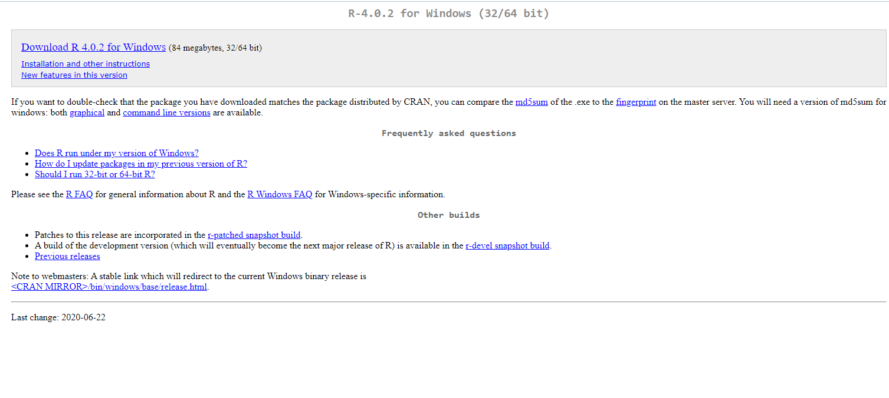{width=800px}


You want to click the link that says  $\color{blue}{\text{"Download R 4.0.2 for Windows"}}$ that is right at the top of the screen. If the version is more recent than 4.0.2, then click on that instead - just make sure it's the link at the very top of the page in the gray box. This will start downloading R. Just follow the instructions. You do not need to change any of the default settings, just click accept for each.  One piece of advice is to try and keep R in a folder on your machine such as `Documents` and don't put it in a cloud folder. We have seen some students have issues when R has been located in cloud folders.

<br>


**R for Mac OS X**

If you have a Mac operating system, then you will see the image below. You want to click on $\color{blue}{\text{"R-4.0.2.pkg"}}$.  If a more recent version of R is available, then the version number will be higher than 4.0.2 - click on this instead.

{width=800px}

Again, follow the instructions. You can accept all the default settings for the installation, you don't need to change anything. It is also best to leave this in a folder located on your machine such as `Documents` and not in a cloud based folder.

<br><br>

## Downloading RStudio
Go to the [Rstudio website](https://rstudio.com/products/rstudio/download/). Scroll down so you see something that looks like the image below. Click **DOWNLOAD** under RStudio Desktop, open source license FREE.

{width=800px}

After you click on that box, you should see something that looks like the below image on the next page:

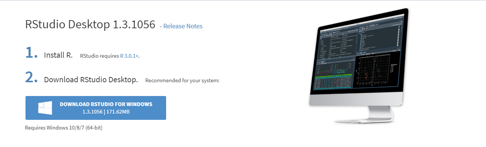{width=800px}

This will name the most recent version of RStudio (here it is 1.3.1056), don't worry if yours is a higher number than this. It will remind you that you should have installed R already (that's the number 1 in the image).  Then it says you should download RStudio Desktop.  It usually gives you a suggested download and that will be in the blue rectangle under point 2.  You can just click that to start your RStudio download.  You can then download the software.

If you don't see that blue rectangle, then you can choose an appropriate installer for your operating system (Mac, Windows, or Linux) from the list that comes further down that webpage. It looks like this: 

{width=800px}


If you have Windows, you will want to click on the first link $\color{blue}{\text{"RStudio-1.3.1056.exe"}}$. If you have Mac, you should click on the second link $\color{blue}{\text{"RStudio-1.3.1056.dmg"}}$.  


Once you have downloaded Rstudio installer, click on it to start the full installation of the program. Again you can just accept all the default settings. We also advise that, as with R, you save RStudio to a location on your machine such as your `Documents` folder rather than in a cloud folder.

<br>

### Successful installation

If you have successfully installed your `R` and your `RStudio` then you can do the following to check that it works. Find the RStudio shortcut on your Desktop, or find RStudio in your programs. Click on the program or shortcut icon to open up RStudio.

The RStudio icon looks like this:

{width=200px}


Alternatively the `R` icon looks like this:

{width=200px}

We always use `RStudio` to start our work, we never need to open `R` or click on the R icon.


Once you have opened `RStudio` it should look something like this:

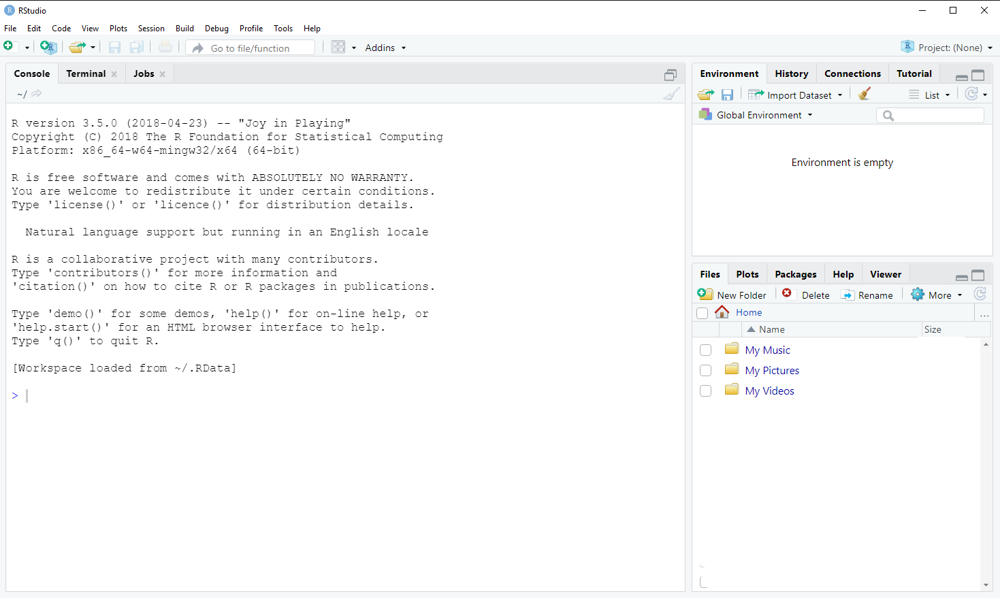{width=800px}


<br><br>

## Using RCloud 
[RCloud](https://rstudio.cloud/)

RCloud is a web-based platform for Rstudio, which allows you to perform all visualization and analysis with your data, without downloading Rstudio on to your machine.

We had considered using RCloud as a backup option for students if they had trouble downloading and installing R or RStudio.  However, RCloud has changed a lot of its accessibility options recently and so we are no longer going to use this.


<br><br>


## The RStudio Environment 

Your Rstudio environment is separated into 4 main panes. On your machine these panes by be organized differently. You can also change the order of these panes by going to your tools tab, then clicking Global preferences. 

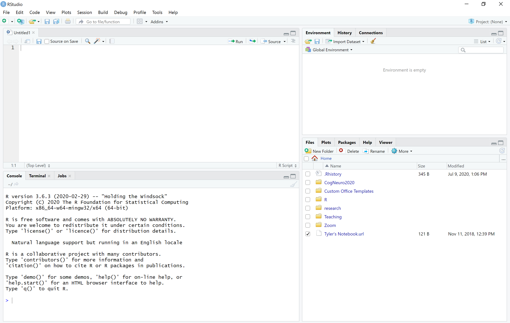{width=800px}


First, in the top left, you have a source pane. This is where you will be writing most of your **code**. You will have to run the code, before seeing the output in the console. This pane is important because this is where you can write and save code for future use. 

Second, on the bottom left, there is the Console. All of the code and the code's output that you run from the source panel will show up in the console. You can also directly write code in the console.  However, objects in the console will not be saved. 

Third, you have a Global Environment panel in the top right. When you first open RStudio this will be empty, but it fills up with things once you start working with the code. You will also see some tabs above the Global Environment. You should see the `Environment` and `History` tabs. You may also see other tabs up there including `Git`, `Tutorial` depending on the version of RStudio you have downloaded and what other programs you have on your machine. There are also some other buttons including the `Import Dataset` button above this panel.

Here is an example of a Global Environment where you can see dataframes, matrices, values, and functions that are being worked with: 

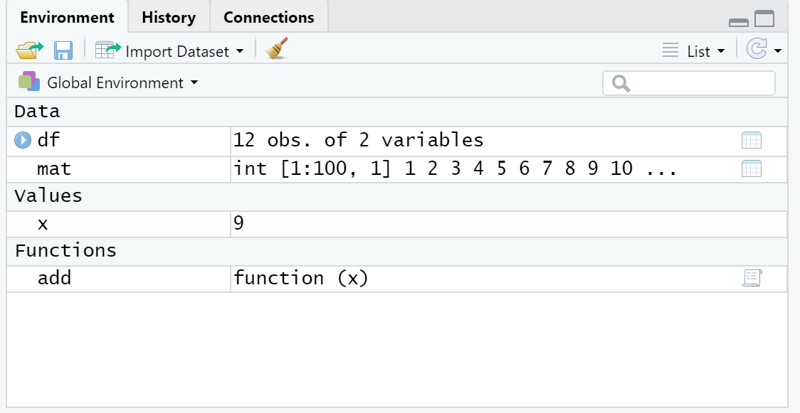{width=500px}

If you click the play arrow next to the dataframe, you can view the entire dataframe. This is the save as running the function `View(df)` (see section \@ref(importing-data)). Another, important button is the broom icon, if you click this it will clear your global environment and you will have to rerun code to get any dataframes, function, etc. back. 

In the `History` tab, you can see all the code that was once ran through your console. This tab can be important, because information in the console is never saved and can be deleted easily. Nevertheless, you should get use to saving your code in **R scripts**, which we'll describe shortly, so you will probably not use this tab to often. 


The fourth pane, is the most compacted and has tabs for `Files`, `Plots`, `Packages`, `Help` and possibly `Viewer` depending on your version. 

The file tab, allows you access all files on your computer. The initial location for this is likely to be the folder that you saved R and Rstudio in - usually `My Documents` or something similar. You can navigate to other folders on your computer using the button with the three dots `...` that looks like this:

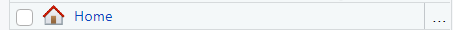

That will open up your computers folders and you can click to a new folder.


The Plot tab, will be filled with plots generated from your code. There are buttons right under the tab to Zoom and Export plots. There is also a button which looks like a broom, this will clear the plots. 

The Packages tab, has a User Library which is just a list of all the packages you already have install on your machine. You can also install a package, by hitting the install button and then search for your wanted package. The update button will update all packages you already have installed. 
  
The Help tab, will give you information to help understand different functions and commands in R. You can also call for help with a function right from the console like this:
  
`?t.test`


## Running Code


### The Console

In R, you can code run in the console and an Rscript file.

In the console, the bottom left panel, you type code and run it by hitting `Enter` or `Return` on your keyboard. R will show the results in the console as well. 

You should write this code immediately after the `command prompt` which is a blue `>` sign with a flashing cursor bar after it.  Code written in the console looks like this:

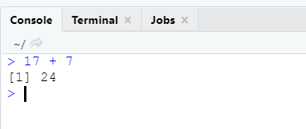

A downside of using the console is that all code and results will be forgotten when the R session is closed. This is why it is better to you use Rscripts. 


<br>

### RScript


To open a new Rscript you can:

1. Click on `File -> New File -> R Script` in the menu bar of RStudio.

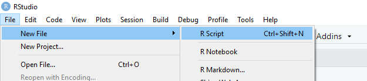


2. Click on the button in the toolbar in RStudio that looks like a white sheet with a green plus sign. This is located right under `File` in your Rstudio environment:


3. Hit `"Ctrl"+ "Shift" + "N"` on your keyboard if you have Windows, or `"Command"+ "Shift" + "N"` if you have Mac. 


Once you have opened a new Rscript it will looks like this:

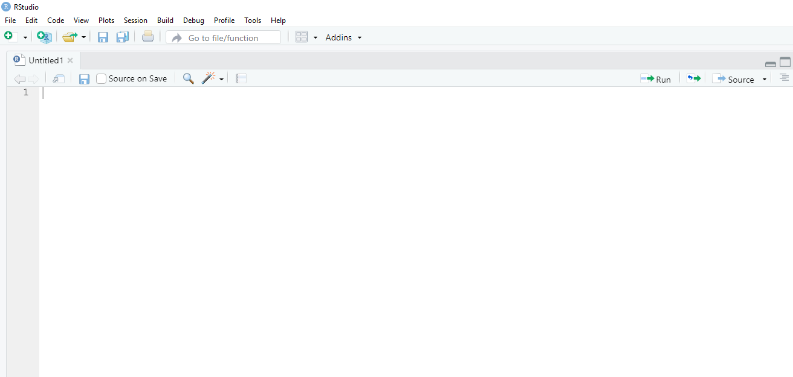

You will see that it says `Untitled1` which means this is a new script file and you haven't saved it yet. You'll also see a gray `1` on the side. This means that that is line 1 of the code. At the moment there is no code.

Here is a script that has a few lines of code in it:

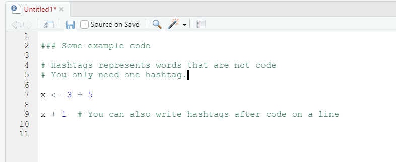

There are a few things to point out here.  First, notice that the gray numbers now go to `11`. This means we have 11 lines in the script.  Some lines start with a `#` sign. These lines contain text (in green in our version) that is not code. After you put a `#` you can write notes to yourself or to others and R will ignore them - it will not run them as code.  Anything else that is written, e.g. the `x <- 3 + 5` and the `x + 1` is in black or blue text and can be run as code.

<br>


### Saving an RScript

To save your Rscript, hit the blue disk icon on the script toolbar and you can name your script. You can save it anywhere on your computer, but probably best to save it in an easy to remember folder. This allows you to come back later to finish working on some assignment even after you have closed the R session.  RScript folders will be saved with an `.R` extension.  

If you open several scripts, they will arrange themselves as tabs and you can click between them. That could look like this:

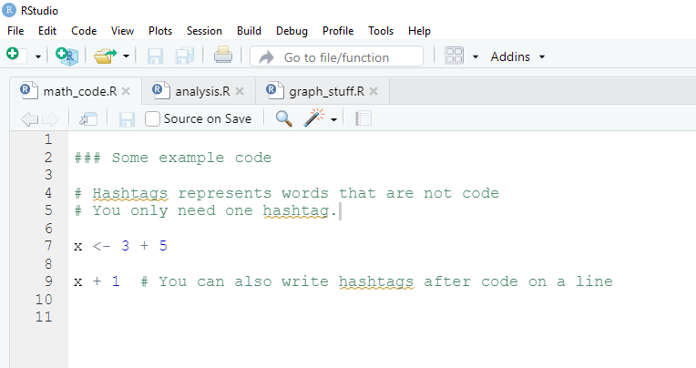

<br>

### Open an existing RScript

If you already have an RScript that you wish to open, you can go to the folder that contains this `.R` file and double click on it to open.  Alternatively, you could hit the folder icon on the RStudio toolbar and use that to locate the file you wish to open.

If it is a file that you have viewed recently, then you can hit the down arrow to the side of the folder icon on the toolbar and it will list your most recent files. You can select the one you want from this list. It will look something like this:

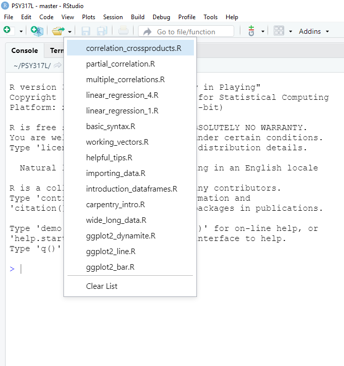

<br>


### Running Code in Scripts
 
There are several ways to run the code in your Rscript file. 

1. You can highlight your code, then hit 'Run' in the top right corner of the script file. 

2. You can click anywhere on the line that contains the code you wish to run, then hit 'Run'

3. You can highlight or click on the code you want to run, then use the keyboard shortcut `Command + Return` on Mac, or `Control + Enter` on Windows. 

4. You can click anywhere on the line that contains the code you wish to run, then use the keyboard shortcut `Command + Return` on Mac, or `Control + Enter` on Windows. 

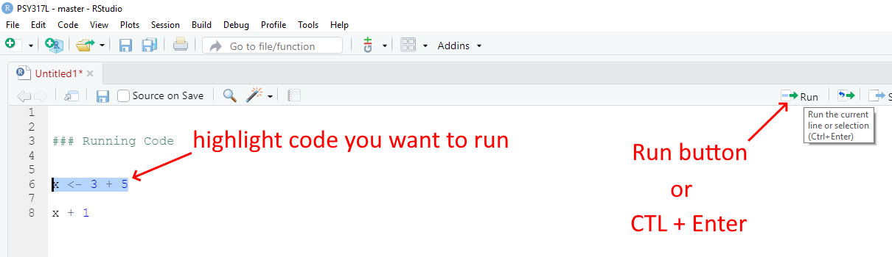


## Packages

When working with R, you will hear about different packages that we will utilize to complete a variety of tasks. A package is a collection of code, functions, and sometimes data developed by members of the R community with the purpose of freely sharing with other R users. We install packages to help us work more efficiently in R. You can think of them as similar to apps you'd download from the app-store.


There are two ways to download packages on to your computer. 

The first way is through the Packages tab in the right bottom panel in your Rstudio environment. In this tab you will see all the packages already installed on your machine.

{width=500px}

Here if you click on install, a box will pop up and your can enter the name of the package you wish to to have then hit install.

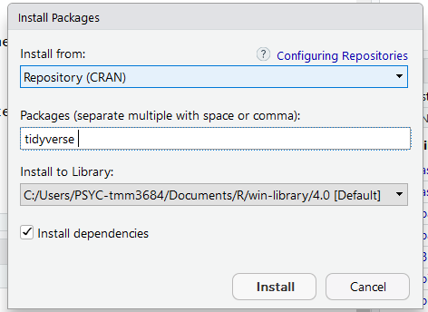{width=500px}

The second way is through one line of code you can write in the console. For example, to just install the `tidyverse` package (which is actually a package that contains many packages within it) you would type `install.package("tidyverse")` into your console like this:

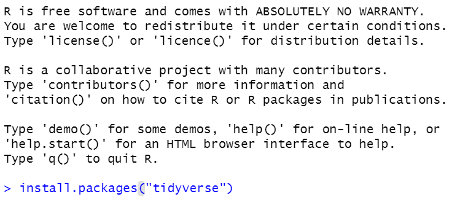

At the beginning of this class, you will be asked to install all the packages that you will need to run the various scripts used in this class. You'll only need to do this once. To do this, please copy and paste the following code in your console and hit enter: 

`install.packages(c("car", "coin", "gridExtra", "lsr", "moments", "ppcor", "psych", "rcompanion", "tidyverse"))`

Your Console should look something like this

{width=500px}

After you do that, your console should start spurting out lots of red, blue and black text. This may take a while (up to 10 minutes) to complete.  You may get a prompt that shows up asking you if you want to `download from source` or some such statement. It's ok to hit `Y` in the console if asked there, or to hit `OK` or `Yes` on the dialog box that pops up. If this question doesn't arise, then that's fine.


It should look something like this during the middle of the installation:

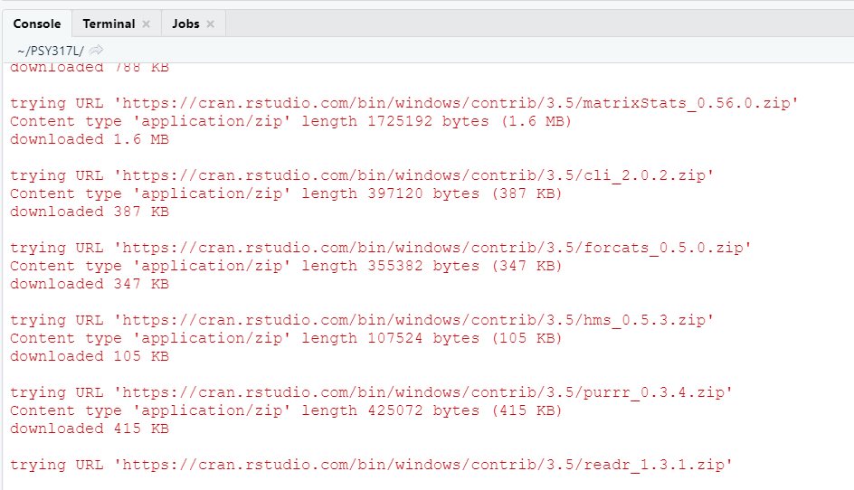


If it has finished installing the packages successfully, then you should see something like this at the end:


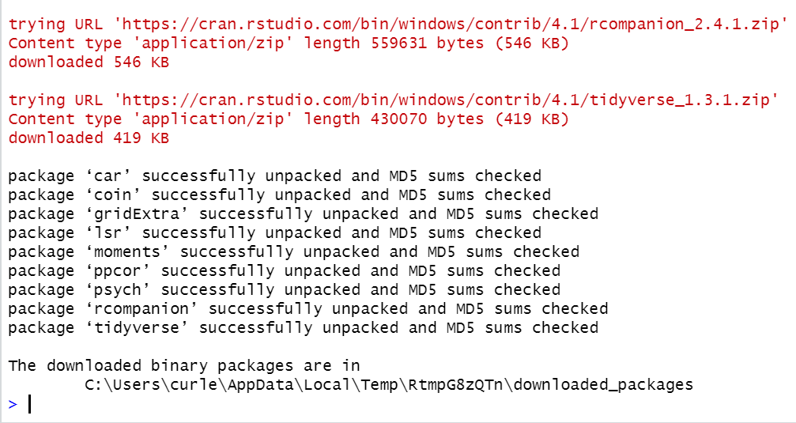

To test whether the main package that we will use `tidyverse` is downloaded correctly, then type the following in the console after the blue >

```{r, eval=F}
library(tidyverse)
```

You should see something like the following appear - the red X under "Conflicts" are ok in this instance (they are just saying that the functions `filter()` and `lag()` are used by more than one package:

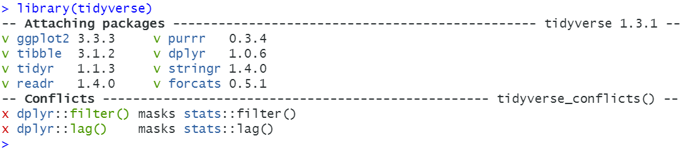


If you have any issues with the installation process then please reach out to a TA or Professor Curley through the discussion page. We will get back to you and help.


## Working with RStudio in PSY317L 

For this course, all the files that you will need to work with are contained in a single folder. This contains what's called a `project folder` in RStudio.  To get this folder, you need to download the `PSY317L_files.zip` zip folder from Canvas.  Once you have done that, double click the folder to extract all the files. The top level should just be a folder called `PSY317L`. If you click on that folder to open it, you should see the folders and files in the image below.

Next, move that folder to somewhere on your computer. Ideally in your `Documents` folder would be the best place. Please check that if you click on that folder you see these folders and files. Importantly, you should see one file that is an `RProject` file called `PSY317L`. It will have a blue transparent cube icon with an R inside of it.

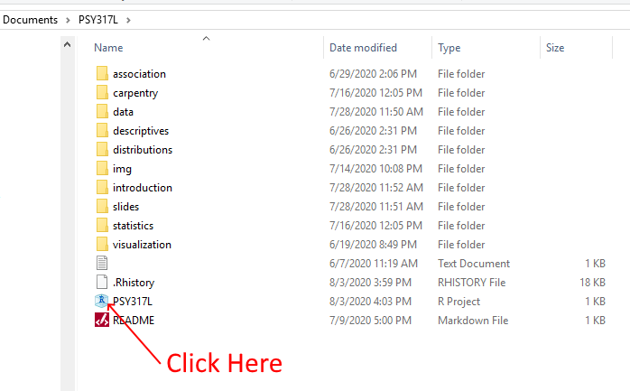

For our course, the best way to access the R files is to hit the blue Rproject icon `PSY317L`. Once you click that, RStudio should automatically open and you should see something like this:

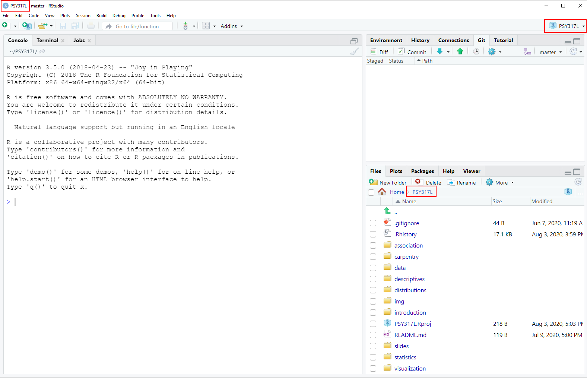

Notice the red squares that we've added to the image. These all say `PSY317L` and indicate that you're working in the PSY317L RProject. You should also see the blue R cube in various (three) places on your Rstudio.

Finally, you should see in your `Files` tab in the bottom right a list of all the files and folders that you will need in this course. 

To open any individual file, you just need to click on the appropriate folder. So, if we wanted to open the file `paired_t_test.R`, we would click on the `Statistics` folder and then click the `paired_t_test.R` file. Then our RStudio would look like this:

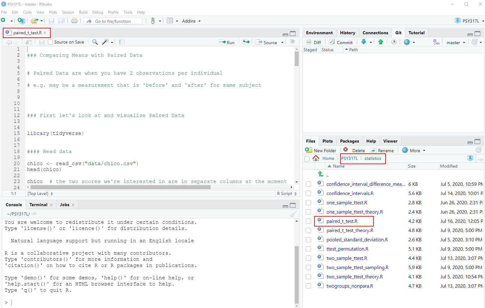

Notice that the file has opened up in the top-right panel. To navigate back to the top folder that contains all our folders, you can hit the `PSY317L` label next to `Home` highlight in the red box.

To close a file, just hit the `x` next to the file name in the top-right panel.


 
## Quitting RStudio

The easiest way to close working with RStudio is to hit the `X` in the top right corner of RStudio. If you have not done any work, this will just quite the program immediately. If you have been working with any RScript file and have made changes but have not saved it yet, then you'll get the following prompt:


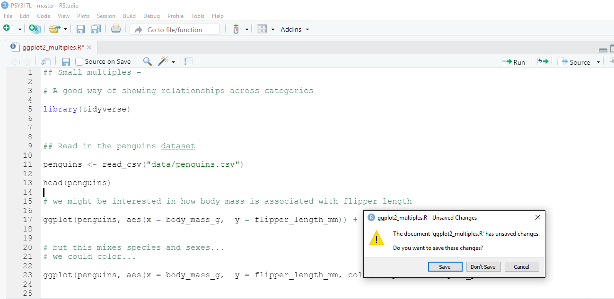{width=800px}


It is asking you `The document xxx.R has unsaved changes.  Do you want to save these changes?`. Most of the time you'll want to hit `Save` and then it will quit.

If you have saved all your RScript files, but you also ran code and perhaps have some things still present in the global environment (e.g. dataframes) or your have plots in your Plot window, you may get the following prompt:

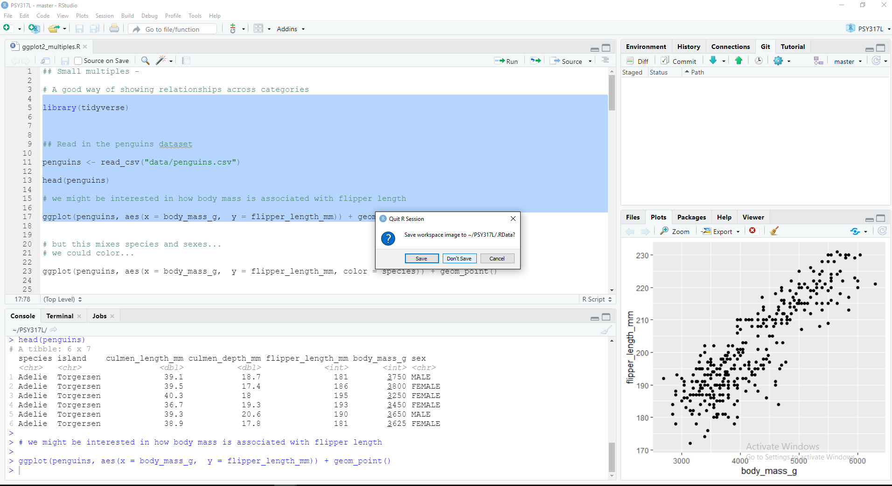{width=800px}


It asks you `Save workspace image to ~/PSY317L/.RData?`. You can safely hit `Don't Save` for this to just quit RStudio.


