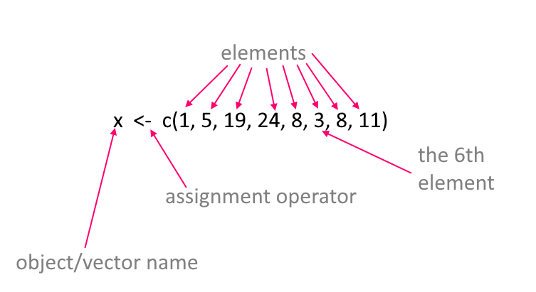
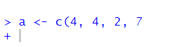
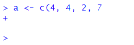
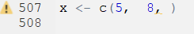
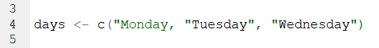
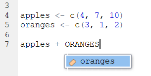
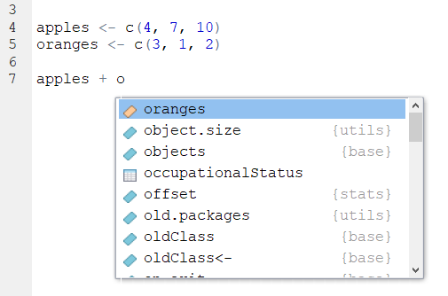
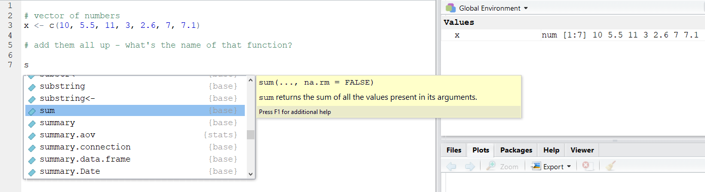
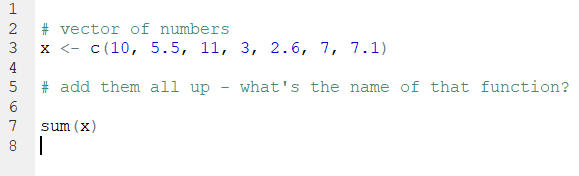

# Basic Syntax

Before we move forward it is important to know a little bit of R syntax. This chapter contains lots of information about how R is organized and works. Don't feel like you have to learn all of this now. This chapter is here for reference and for help. Also, these nuts and bolts of programming languages are things that you pick up over time - they are pretty hard to remember at first and you constantly do have to check and copy/paste things. That's ok. Another very helpful resource on basic syntax in R is [Chapter 3 of Danielle' Navarro's book](https://learningstatisticswithr.com/book/introR.html) which we highly recommend.


## Simple mathematical syntax

R is, first and foremost, a statistical programming language. So, unsurprisingly, you can do a bunch of mathematical operations fairly easily. Let's do some really tedious math:


You can add with the `+` key:

```{r}
4 + 6
```

You can see that the output returned `10` indicating that that is the answer to `4 + 6`.  However, we also see in the output a `[1]` before it. What does this mean?  This is an index - which we'll talk about in more detail later- but essentially all it is telling us is that the number that comes directly after it is the first bit of the output. We only have one thing in our output here - the number `10`, so it's pretty pointless - but it does have relevance in the future.  For now though, you can safely ignore it.


Subtracting uses a hyphen or minus key `-`:

```{r}
43 - 18
```

Multiplying uses the asterisk `*`:

```{r}
5 * 3
```

Dividing uses this slash key `/`:

```{r}
34 / 7
```


You can square root like so by typing `sqrt()` and putting your number to square root in the brackets:

```{r}
sqrt(45)
```


Squaring a number requires us to use the cute `^` key followed by a number `2` to indicate that we are raising to the power 2 (which is squaring):

```{r}
12^2
```


We can also get the logarithm of numbers:

```{r}
log(12)
```

*Our first little warning*

Like all programming languages, R will only do what it's told. One thing that catches people out is that it will read code in order from left to right.  So, if you're doing several things at once, you may need to insert brackets to make sure that it does what you want it to.  For instance, say you want to multiply 5 by the sum of 7 and 9.

You might write that like this:

```{r}
5 * 7 + 9 
```

but `44` is not the answer you're looking for!  What it has done is to take 5, then multiply it by 7 (makes 35) and then add 9 to make 44. 


OK, how about you write it like this instead:

```{r}
7 + 9 * 5
```

Erm, this time it multiplied 9 by 5 to get 45 and then added 7 to make 52.  What is happening is that some mathematical operations are taking precedence over others and R does things in certain order. To explicitly make sure that it does what you want, insert some brackets like this:


```{r}
5 * (7 + 9) 
```

Now it **knows** that what you wanted to do was to add 7 and 9 to get 16 and have that number multiplied by 5 to get 80.  This sort of thing is something to look out for, but as you get experienced you'll have a sense for it. Well placed brackets can save you a headache.


## Assignment

e.g. what the assignment operator is.

This symbol `<-` which is just a "less than sign" followed by a "hyphen" is called an assignment operator. It basically is equivalent to saying you want to save something.  You write what you want to be saved on the right hand side of it, and the name of your newly saved thing on the left of it.  We call the 'thing' that you've saved an 'object' in programming speak.

For instance, say you wanted to save the number `17`, and you wanted to call that saved number an object called `x`. You'd do it like this:


```{r}
x <- 17
```

Now, whenever you type, `x`, R thinks that it is the number 17.


```{r}
x 
```


We should probably fess up right now and tell you that there is another way that you can assign things in R. On the face of it, it's a much easier way too, but we're going to recommend you don't do it. The only reason that we're bringing it up at this point is that if you look up help on the internet or in some books, you'll see people doing it - so we should mention it.

You can assign using the equal key `=` like this:

```{r}

y = 10 - 2

y
```

So, as you can see, we created an object called `y` that was equal to 10 minus 2, that is 8. Using `=` seems so much easier than using `<-` so what is the reason not to do it?  Well, the equal sign gets used for a ton of other commands and sometimes it gets a little messy and confusing if too many equal signs fly around.  Therefore, we're going to politely ask that whenever you assign things, please use the `<-` operator, even though it's two bits of punctuation stuck together:

```{r}

hooray <- 17 + 4  # thanks for using this sign
hooray
```


## Vectors

Of course, you can save even more complex things as the object. For example, if you wished to save the numbers `5, 6, 7, 8, 9, 10`, you have two ways of doing that.  Let's just see them in action, and then we'll explain the syntax:

```{r}

v1 <- 5:10

v1

v2 <- c(5,6,7,8,9,10)

v2

```


As you can see both `v1` and `v2` are our newly saved objects and they both contain the numbers 5 through 10.  For `v1` we separated the numbers 5 and 10 with a colon `:`.  In R, the `:` sign can be used to mean "to" when talking about a series of numbers. e.g.

```{r}
5:10

101:103
```


The other way we did it with `v2` was to use the `c()` function. This stands for `concatenate` which is a mouthful.  Basically, it's a way of sticking things together.  You write `c()` and then put the stuff you want to stick together inside the brackets, but make sure you separate each thing by a comma `,`.  For example,

```{r}
c(1,10,100,1000)

c(4,6,8,10,8,6,1)

```


Another bit of terminology might be worth mentioning right now.  Our saved objects `x`, `v1` and `v2`, as well as being called `objects` can also be called `vectors`.  A vector is something in R that contains several items. These items are actually called `elements`.  Importantly the items are indexed, which means that they are in order, not all jumbled up.  That means that you can directly grab an element by it's position.  So, if you wished to get the first element (or item) of the object `v1` you'd type like this:

```{r}
v1[1]
```

That returns '5' which was our first element we put into the vector.

If we wish to get the 3rd element of `v1` we'd do this:

```{r}
v1[3]
```

And, if we wished to get the first, second and third element of `v1` we'd do this:

```{r}
v1[1:3]
```


We can also get non-consecutive elements of vectors. If we wanted to get the first, fourth and sixth elements of `v1` we'd do this:

```{r}
v1[c(1,4,6)]
```

Notice here that you can't do this:

```{r, error=TRUE}
v1[1,4,6]
```
You have to put the indexes of the elements you want inside `c()` and separate each with a comma, if they are non-consecutive.

Be careful to make sure you're referring to elements that actually exist. The vector `v1` has six elements in total, so if you ask it to give the seventh element, then you get the following:

```{r, error=TRUE}
v1[7]
```

It just says `NA`. This is R for "nothing" or "doesn't exist" or "missing".  You'll also see `NaN` in some situations to represent missing data.


That's quite a lot about vectors, their elements, and how to index them. Hopefully the below image will help you remember this terminology:




**Working with Vectors**    
    

Now, one of the great advantages of vectors is that you can do things to all of the numbers inside the vectors at once.  For instance, say we wanted to square all the numbers inside of `v1`, then all we need to do is:

```{r}
v1^2
```

and notice how it squared the numbers 5 through 10 that are the contents of `v1`.


You can also do things to the entire contents of a vector at once.  For instance, if you wanted to add up all the numbers in `v1` you could do this by using the function `sum()` like this:

```{r}
sum(v1)
```

and it added `5+6+7+8+9+10` to give one answer!


You can also use the names of the vectors together. For example, if you do `v1 + v2` let's see what happens:

```{r}
v1

v2

v1 + v2

```

You can see that it added the first element of each vector to each other, then the second element of each vector to each other and so on.  This only works though because `v1` and `v2` are the same length. If they had unequal number of elements, R would get mad and not do anything.


## Characters

The vectors that we've been looking at so far are all `numeric` meaning that they contain numbers. Another type of information that R uses is text - or `characters`. Sometimes called `strings`.  Let's make a vector of characters:

```{r}
the_week <- c("Monday", "Tuesday", "Wednesday", "Thursday", "Friday", "Saturday", "Sunday")

the_week

```

Here we have an object called `the_week` that has 7 elements. Each element is separated by a comma. This is pretty similar to when we enter numbers except for situation when we can use the `:` shortcut such as using `5:8` to mean `5, 6, 7, 8`.  We also stick everything together into a vector using `c()` as we did with numbers.  The major difference is that to make sure R knows that each of these words is a character or text string, we have put quote marks around each word.  If we didn't do that, it would be looking for objects called `Monday`, `Tuesday` etc.  

Actually, let's see an example of using words to create a vector, when the words are actually objects:


```{r}
aa <- 5
bb <- c(9, 11)
cc <- 10
dd <- c("james", "tyler")
ee <- "hedgehog"

aa
bb
cc
dd
ee


example <- c(aa, bb, cc, dd, ee)

example

```

Here, each of `aa` to `ee` is assigned to be an object and they contain information. When we write `c(aa, bb, cc, dd, ee)` we don't need to use quotes as we're referring to the objects and not to words called `aa`, `ee` etc.  Also notice that we were able to make vectors that mixed together numbers and characters.  Also, some of our original vectors like `bb` and `dd` contained more than one element. When we put them all together with `c(aa, bb, cc, dd, ee)` to create the `example` object, R just stuck them all together in the order we wrote.


It's pretty unusual though to mix numeric and character vectors together.  Let's get back to talking about vectors that contain characters only.

Some functions can work on both character vectors and numeric vectors. One example is `length()` which counts the number of elements in a vector:


```{r}

v1

the_week

length(v1)

length(the_week)
```

However, some functions only make sense when working with one type or the other.  For instance `sum()` to add up the elements of a vector, only works with numeric data:

```{r}
sum(v1)
```

If you try it with character data, then it will give you an error:

```{r, error=TRUE}
sum(the_week)
```


Others work with characters. For example, `nchar()` calculates the number of letters in a piece of character text. Applying it to a vector will tell you how many letters are in each of the days of the week:

```{r}
nchar(the_week)
```

If you try this with numeric vectors, it gives you a funny output of how many characters are in each number!

```{r}
nchar(v1)
```


Regardless of whether you are using numerical or character vectors, indexing works in the same way.

e.g. To get the 3rd element of each vector:

```{r}
v1[3]

the_week[3]

```


e.g. to get the 5th and 5th elements of each vector:

```{r}
v1[5:6]

the_week[5:6]
```


e.g. to get the first, fourth, and sixth element of each vector:

```{r}
v1[c(1,4,6)]

the_week[c(1,4,6)]
```


## Naming of objects

One of the hardest things in R is deciding what to name things. You run out of ideas very fast! There's only so many times you can call things `x` or `df` or `v1` before you get bored. The best names tend to be short and memorable. If you were saving a vector of color names for example, you might want to call it `mycolors`:

```{r}
mycolors <- c("mistyrose", "dodgerblue", "pink")
```

There are some important rules for the naming of objects. These are some DOs and some important DON'Ts:


- you can use characters or numbers in object names, or both

- do not use spaces

- try to use lower case ideally

- do not use any punctuation in names for objects, dataframes or column names except for the period `.` or underscore `_`. Everything else is forbidden.

- if you do use an underscore `_` it cannot go at the beginning, e.g.

```{r, error=TRUE}
_mynumber <- 17
```

- you can use a period `.` at the beginning of an object name, but please don't.

- periods `.` and underscores `_` are best used in the middle of object names to help read the name, e.g.

```{r}
prime_numbers <- c(1,3,5,7,11,13)
prime_numbers
```

- but even better, use short object names!

```{r}
primes <- c(1,3,5,7,11,13)
primes
```


- you should avoid using certain words, as they have other meanings in R and calling something else by that name could confuse things. Examples of words to avoid: `if`, `else`, `repeat`, `library`, `break`, `while`, `stop`, `function`, `for`, `in`, `next`, `TRUE`, `FALSE`, `NULL`, `Inf`, `NaN`, `NA`, `data`, etc.  That still leaves a lot of words you can use.

Usually when you start to write one of these words in R, you'll notice that they change color in the script (to which color depends upon your color settings) - this indicates that these words are 'special'.

- for the same reason, there are several letters that I would avoid using, because they have special meaning: e.g.  `c`, `t`, `T`, `F`.  The last two are short for `TRUE` and `FALSE`.  We've already seen `c()` in action. `t()` means to transpose data. You might find that we've called some objects of numbers `t` in this course - sorry in advance if we broke this 'rule'.


## Logical Operators

The R language contains several bits of punctuation that can be used for what's termed 'logical operators'. These will lead to an output of either `TRUE` or `FALSE` being printed to the console. It's easiest to work out what they do by just seeing them in action:

```{r}
"is equals to"

2+2 == 4
2+2 == 5
```

The double equals sign `==` checks if the left hand side is equal to the right hands side. In the top example, 2+2 does equal 4 so we get a `TRUE`, while in the bottom example, 2+5 does not equal 5 so we get a `FALSE`.

You don't have to check one thing at a time. You could check all elements of a vector at once:

```{r}
x <- c(5, 10, 15, 10, 1, 11, 10)
x == 10

```

Here it is saying which elements of `x` are equal to 10 or not.


If you want to ask whether something is `not equal to` something, then you use `!=` like this:

```{r}
x <- c(5, 10, 15, 10, 1, 11, 10)
x != 10

```


Other logical operators are `<`, `<=`, `>` and `>=` and can be used in the usual mathematical way:


```{r}
x <- c(5, 10, 15, 10, 1, 11, 10)

x < 10

x <= 10

x > 10

x >= 10


```


You can also add up the logical output.   Say you wanted to know how many of your vector of `x` were equal to 10. You can use `sum()` to add up. With the `TRUE` AND `FALSE` output, `sum()` will count up the number of `TRUE`s you have. (It considers `TRUE` to be 1's and `FALSE` to be 0's)

```{r}
x <- c(5, 10, 15, 10, 1, 11, 10)
x == 10

sum(x==10)
```


**Indexing Vectors with Logical Operators**

This is all a bit abstract and vague as to why we should care about logical operators. One common situation we use them is when we want to subset vectors. Remember, we use the square brackets `[]` to index a vector like this:


```{r}
x <- c(5, 10, 15, 10, 1, 11, 10)

x[5]

x[1:2]
```

Above we first got the 5th element of `x` and then we got the first and second elements of `x`.  We can also grab things from vectors using logic. Effectively keeping those elements that give the output `TRUE` in response to the logic statement. Here are examples:

```{r}
x <- c(5, 10, 15, 10, 1, 11, 10)

x[x==10]

```


```{r}
x[x!=10]

```


```{r}
x[x>10]

```


Another funky piece of syntax that comes in useful from time to time is `%in%`. You can basically use it only keep those elements that match those that exist inside another element.


```{r}
stuff <- c(1, 5, 15)
x[x %in% stuff]

```


## Some things that are useful to know.

**whitespace**

R doesn't, on the whole, care that much about whitespace - this is space that is between code. It just ignores it.  For instance, all of the following give the same result (what's happening here is that `a` and `b` are `vectors` that each have three `elements`. Telling `a+b` will make it add the first element of `a` to the first element of `b` and then the 2nd element of `a` to the 2nd element of `b` and so on:

```{r}
a <- c(1,2,3)
b <- c(4,5,6)
a + b
```


```{r}
a<- c(   1,            2,     3)
b <- c(4,5,6           )
a +              b
```


```{r}
a <- c(1    ,2,   3)
b <-    c(    4,5  ,6)
            a +    b
```


Hopefully, you get the point.

You can also leave whitespace across lines and R will, for the most part, jump to the code ahead and not worry about the whitespace. This example looks ugly because the commas, numbers, and brackets are all on different lines, but R reads it ok:

```{r}
x <- c(  
  
   4, 5, 
       
       
       3,    6
       
       ,   14
       )


x
```

Although this is possible. Please, please, don't do it!  It's ugly to read, and what's more, there are situations in which it can cause you problems.


Indeed, there are some important place where whitespace needs to be adhered to.

Firstly, when using the assignment operator `<-`. R cannot stand it if you put a space in between the `<` and the `-`. e.g.

```{r, error=TRUE}
eg < - 5:10
eg
```

It is stating here that `object 'eg' not found` because it thinks you're trying to ask it if `eg` is `less than` `-5:10`.    If `eg` already existed, then you need to be extra careful here. We won't go into what could happen in that situation, but it could be bad!  So, golden rule,  no spaces with `<-` !


Secondly, in future sections on carpentry and visualization, you'll use some syntax that `pipes` or chains together a series of commands. These operators are `+` or `%>%`. When using this syntax, you need to finish each line (expect the last line) with one of these pipe syntaxes. If you do not do that, you'll get an error message, because R won't jump to the later lines when it is chaining things together.  Although this might be a bit early in your R journey to mention - it is such a frequent error, that we just wanted to reference it here.  Hopefully, this will be a useful reference aid if you see this error.


Here's a simple example of what this looks like. 

```{r, error=TRUE}
x <- c(3, 5, 6, 7, 4, 6, 5, 10, 4, 5, 7)

x 
%>% unique
  

```

Here we get an error message saying `Error: unexpected SPECIAL in "%>%"`. What has happened is that R read the lines where we assigned the numbers to `x` and then on the line that just had `x` it printed out the numbers.  Then when it got to `%>% unique` it didn't know what this was referring to. When using chain syntax such as `%>%` you cannot start a new line with it. Instead you should write:

```{r}
x <- c(3, 5, 6, 7, 4, 6, 5, 10, 4, 5, 7)

x  %>% unique
```

Now, it has processed the code appropriately and the output is what we want. Basically, we took our vector of `x` and extracted all the unique numbers.

A golden rule should be - be neat with your code !!! and this will avoid a lot of errors and problems.


**Other common errors**


*Close your brackets*

Missing commas or brackets might be the most common errors! You will get an error message though, and it usually will tell you what you did wrong.  Also, when you start to type `(` RStudio will automatically autocomplete to write `()` which helps you to not forget to close your bracket.  

```{r, error=TRUE}
a <- c(4, 4, 2, 7
```


When you forget to close your brackets, but you run your code anyway, you'll notice that in your console you get a flashing bar and the cursor still has a plus sign like this :




This is telling you that it's waiting for something else to finish the code. It expected you to close your brackets!  If you do this and you want to reset to get back to the `>` cursor sign (which means it's ready for action), then just click next to the plus on the flashing `|` and hit `Esc` key.  This should reset it to the `>` cursor, and look like this:




*Don't forget commas*


Commas need to be watched out for too.  They are usually used to split separate items up, such as numbers in a vector or arguments in a function (see section \@ref(functions)).  Missing them out can cause issues! For instance, here we are trying to make the vector `b` have the numbers 3, 6, 9 & 10.  But the way we write it, R might think we mean 3, 6 & 910 because we forgot the comma. Remember, R often ignores spaces. Fortunately, R catches it because it 'knows' numbers need to be paid attention to - and suggests that you've missed out a comma. Well, technically it tells you `Error: unexpected numeric constant in ....` which doesn't help much - but it's because we forgot the comma.

```{r, error=TRUE}
b <- c(3, 6, 9 10)

```


RStudio can help you as you write code. During most of this course, you will be following code already written by us. However, in the `try for yourself` examples, you'll have to fill in blanks.  Whenever there is an issue with code and it won't run, RStudio flags this for you as soon as it realizes. It will give you a big red circle with an X inside of it.  These appear in your script. You can see an example below for our problems with missing brackets and commas.


Another thing that often happens with commas, is that people forget to put something in between them. Here's this issue:

```{r, error=TRUE}
x <- c(5,  8, )

```

You get warned that one of your `arguments` are empty. If you scroll away from your code, you'll get the X in the red circle telling you something is wrong.  If your cursor is still by your code, you may get a yellow warning triangle telling you to beware, similar to this:




*Check your quote marks*

Quote marks `"hello"` or `'hello'` are often used in R when we want to make sure something is a character (i.e. text). Most commonly used when we're inputting data that include words, or when we're stating a color, or when we're adding a title or a label to a graph.

An error that we often see is that quote marks are either missing or not closed. Up to this point in the book, we haven't yet covered the situations in which this is most likely to occur - so don't worry about following this code just yet. We're actually trying to make a scatterplot, that we discuss more in section \@ref(scatterplots). Instead, just focus on the error message:

```{r, message=FALSE, warning=FALSE, error=TRUE}
library(tidyverse)
ggplot(mtcars, aes(x=wt, y=mpg)) + geom_point(color = purple)

```

Note that it says `object 'purple' not found`.  That's because, even though we are trying to make the points of the scatterplot purple, because we didn't put it in quotes, it's looking for the `object` called purple. It thinks there is something called purple that contains the information it needs.  The actual code should include purple in quotes, to make sure it processes the word 'purple' literally: 

```{r, message=FALSE, warning=FALSE}
library(tidyverse)
ggplot(mtcars, aes(x=wt, y=mpg)) + geom_point(color = "purple")

```


For the most part in R, you can choose whether you use double quotes `"` or single quotes `'` when using quotes. Just make sure you match them, and close them.  For example, the following examples are correct:

```{r}
days <- c("Monday", "Tuesday", "Wednesday")
days
```

```{r}
days <- c('Monday', 'Tuesday', 'Wednesday')
days
```

You can also do this, although it looks a bit odd:

```{r}
days <- c('Monday', "Tuesday", 'Wednesday')
days
```


Here are some examples of what happens if you don't close your quotes:

```{r, error=TRUE}
days <- c("Monday, "Tuesday", "Wednesday")
```

Often you'll get the error message `Error: unexpected symbol...` in such situations. This is usually a clue to look for a punctuation error.


Another think you'll notice when you make this error, is that the colors of your code don't look right. Notice that the colors of each day aren't consistent:




In general, we'd recommend that when you need to use quotes, that the double quotes `"hello"` are the better option. There are two reasons for this. First, if you start to type those in R then the second quote mark magically appears. RStudio knows you're using quotes and already produces the closing quote. This doesn't happen (for some reason) when you use the single quote `'hello'`.  Secondly, often we use quote marks because we're adding a title or a label to something. Some example code to add a title to a graph might be:

```{r, eval=FALSE}
p + ggtitle("Tyler's first graph")
```

Notice in this title that one of the words requires an apostrophe `'`. If you had used single quotes to wrap around `Tyler's first graph` then this would have caused confusion as to where you wanted to end the text string. This only arises when using single quotes - so we say that double quotes are safer!


*Typos are bad!*

R can only run the code that you tell it to run.....  (well this is not 100% true... but wait until the end of the paragraph for that).  If you don't precisely tell it what you want, it will get confused or angry. If you typo, then this can cause problems. Let's do an example. Say we want to make two vectors called `apples` and `oranges` and we want to add them together. This works:

```{r}
apples <- c(4, 7, 10)
oranges <- c(3, 1, 2)

apples + oranges
```

but this will not work:

```{r, error=TRUE}
apples <- c(4, 7, 10)
oranges <- c(3, 1, 2)

appless + oranges
```

You'll get the error saying `object 'blah' not found`. This is the most common error that we see. Basically, it cannot find an object (be it a vector or a dataframe) if it's not spelled correctly. This also applies to column names of dataframes and so on.  R is also case sensitive. The following doesn't work:


```{r, error=TRUE}
apples <- c(4, 7, 10)
oranges <- c(3, 1, 2)

apples + ORANGES
```

It will not automatically realize you meant `oranges`. 

However, there is a bit of help that RStudio will give you. Look what happens when we write `ORANGES` in our code script:




It automatically popped up `oranges` as a suggestion. The little colored icon to the left of it indicates that it is in an object. So - RStudio can be your friend!


Actually, when you first start to type the first letter of any object, you can hit the `Tab` key and various options will pop up for you to choose from. You can then either use your up and down arrows or your mouse to click on the thing you want. In the example below, you can see it includes our `oranges` object and ton of other stuff that we don't need right now that also beings with `o`. This is super helpful when you've forgotten what you called something:




* We said that it's not 100% true that R cannot 'guess' what you mean. There are a few exceptions. One example, is that sometimes R can guess the name of a column in a dataset if you only type half of it or the first few letters. However, many programmers think this is a terrible thing to be able to do and so perhaps we should just forget about it. We would highly recommend always writing everything precisely.


### Tab is your friend

As seen from the example above, the `Tab` key can be used to get help as you're writing code. This is a super useful little trick as it can be hard to remember the names of some of the commands (functions) in R.  Earlier in this section we saw that it was possible to calculate the `sum` of a vector with a function called `sum()`. However, what if you forgot the name of this but you just had a vague recollection that it began with an `s` ?  You could start to type `s` and then hit the `Tab` key. Scroll through the list that pops up by your code until you find the one that you think is correct!





You'll also notice that you get a big yellow help box that appears to the side. This gives you a bit more information about what the thing you've highlighted does - and this may help jog your memory as to what you were looking for.

After you have clicked on the thing you want- it will automatically include it in your script- and you're good to go:




## Error Messages

We'll be honest here and say that often times when you get an error message, they aren't massively helpful. Or, at least this was the case until recently.  There still are many error messages that don't really help you too much in learning what you did wrong, but if you make errors when using the `tidyverse` (see section \@ref(tidyverse)) such as when making visualization - these error messages are much more helpful now than they once were.

Making errors when coding is part of the learning curve though. It's like learning to play the piano. There is almost no way you can do it just by watching somebody else. You have to practice and be ok with making small mistakes. At first they catch you out, but over time you'll realize when you're about to mess up and you'll avoid it. Or, you'll mess up and be faster at working out how to get past it.

If people are stuck on particular error messages during this course - please do let us know. We'll try and collate an FAQ of error messages that we can provide answers to - that will hopefully make the learning process a lot less painful.


## Functions

Functions are operations that you can conduct in R. There are many built-in functions to R, and several that come in packages that we can install and load in.

There is usually (although not always) an object that is the focus of the function. Functions have names and end in brackets. We've already met some of these, e.g.:

`sum()`
`length()`
`c()`
`sqrt()`


As we go through the course, we'll see lots more functions and it will become second nature to use them.  There is one additional thing that we'll bring up at this point. The things that you put inside functions are called `arguments`. Sometimes you'll see them called `parameters` - but that has other meanings in statistics, so let's use 'arguments'.  Some functions have one argument, others have more.  Most functions have defaults for these arguments, so if you don't include them, it will still run using it's predefined default.

Let's illustrate this by introducing you to the function called `round()`.  This function will round numbers to various decimal places. Let's use the number   `17.10771947` as an example. What does round do to this number?

```{r}
round(17.10771947)
```

It's default is to round it to 0 decimal places. Inside of `round()` the number is in the position of the 1st argument. `round()` can have two arguments - the second one relates to how many decimal places you would like to round to. So, if you want to round to 3 decimal places, you need to do this:

```{r}
round(17.10771047, 3)
```

Now we have two arguments. In actual fact, those arguments have names, and you can most often work out what the names for the arguments should be from help guides. Technically, what we have just performed is the following:

```{r}
round(x = 17.10771047, digits = 3)
```

But as you have already worked out, we didn't need to write the names of the arguments. R worked it out already. What if we'd got the arguments, the wrong way round?

```{r, error=TRUE}
round(3, 17.10771047)
```

Now it defaulted to giving us the first argument to zero decimal places. Because the second argument isn't a whole number (integer) then it just ignored it. What if you keep these in this order, but give them their correct argument names?

```{r, error=TRUE}
round(digits = 3, x = 17.10771047)
```

Now it works as expected again.  The moral of this story is that it is best practice to use the argument names!  If you hit the `Tab` key as you type out a function name, then it will give you a list of possible arguments for that function:


Arguments of functions aren't always numeric. Sometimes you need to write in words,  punctuation or the logical statements `TRUE` or `FALSE` to tell the function what you want to do. An example is the function `paste` which joins together two objects.  Here we tell it to paste together three objects with an underscore:

```{r}
obj1 <- "hello"
obj2 <- "james"
obj3 <- "curley"
paste(obj1, obj2, obj3, sep = "_")
```

In functions, punctuation and characters need quote marks around them. `TRUE` and `FALSE` should not have punctuation around them.


If you want to continue with R then it's also possible to write custom functions that will do what we do whatever we ask them to do - but that is for the future.


**R works from in to out**

One thing to remember about R as a coding language is that it will apply functions from in to out. It will start with the innermost function in a statement, and then move outwards.

So, if you have the following vector:

```{r}
x <- c(1, 5, 3, 7, 10, 11, 13, 5, 6, 2, 5, 6, 3, 7)

x
```

and you want to get the unique numbers (i.e. get rid of the repeating numbers and only keep one of each of all the numbers), then you could use `unique()`:

```{r}
unique(x)
```

If you wanted to take the unique numbers, and then square root each of them you could wrap `unique(x)` in `sqrt()` like this:

```{r}
sqrt(unique(x))
```

That code is still just about readable. 

However, say you want to (for some reason), keep the unique numbers, then take the square root of each number, then add them all up, then round the answer to 2 decimal places. This is what it would like:

```{r}
round(sum(sqrt(unique(x))), digits = 2)

```

It finds the object you are working with `x` then the first function outside of that is `unique()` then the next one outside of `unique(x)` is `sqrt()`, then the next one outside of `sqrt(unique(x))` is `sum()` and the next one outside of `sum(sqrt(unique(x)))` is `round()`. That's quite hard to follow!

Another approach would be to do this in steps and assign objects at each step, like this:


```{r}
x

x1 <- unique(x)
x1

x2 <- sqrt(x1)
x2

x3 <- sum(x2)
x3

x4 <- round(x3, digits = 2)
x4

```

Another alternative is to chain the syntax together (see next section). 


## Chaining Syntax

The code in the previous section was pretty ugly! Here it is:

```{r}
round(sum(sqrt(unique(x))), digits = 2)
```

We could rewrite it however by chaining together the outputs of each function using the `pipe` or chaining piece of syntax that looks like this `%>%`.  This is how it would look if we chained each function together:

```{r}
x %>%
  unique %>%
  sqrt %>%
  sum %>%
  round(2)

```

Let's break down what's happening bit by bit.  Essentially you can read the `%>%` as `and next do this`.

This first bit just keeps the numbers that are unique in the vector, removing duplicates:

```{r}
x %>%
  unique 
```

Next we square root each of those unique numbers:
```{r}
x %>%
  unique %>%
  sqrt 
```

Then the next step is to add up those six square rooted numbers:
```{r}
x %>%
  unique %>%
  sqrt %>%
  sum 
```

Then we round that value to two decimal places:

```{r}
x %>%
  unique %>%
  sqrt %>%
  sum %>%
  round(2)
```


It's also worth pointing out that you don't have to start a new line after every `%>%`, you can have these in the middle of rows. Just don't start rows with them (see errors above)!

This also is fine:

```{r}
x %>% unique %>% sqrt %>% sum %>% round(2)

```


