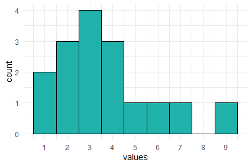
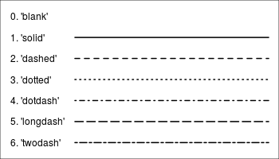
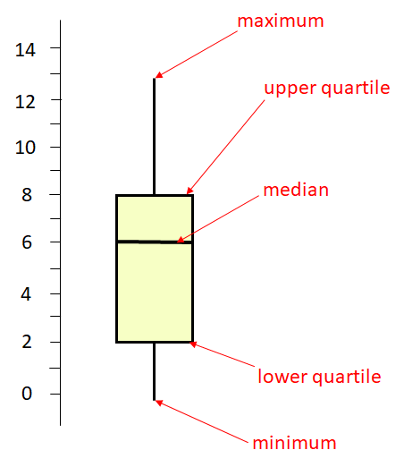
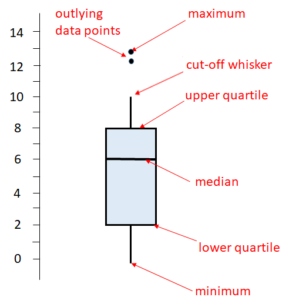
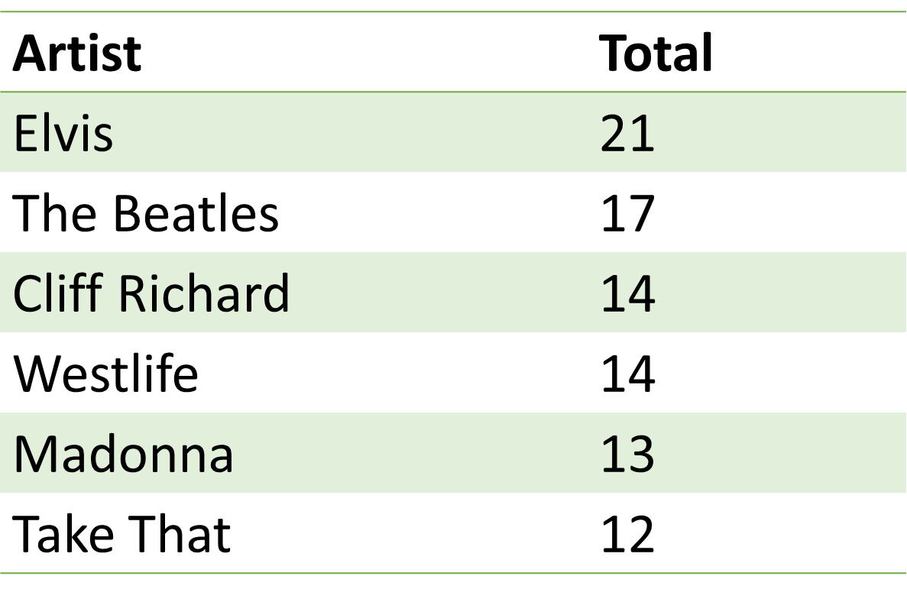
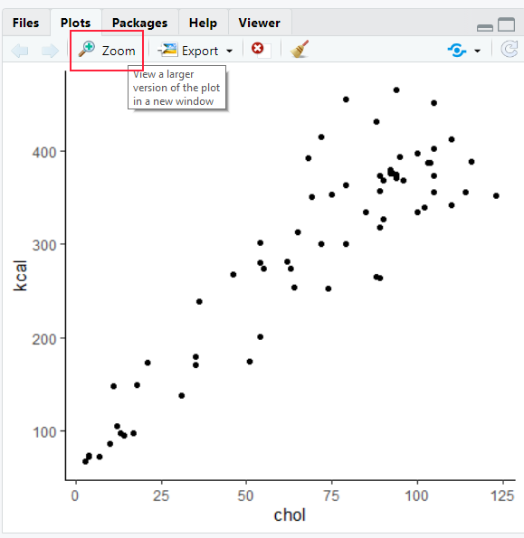
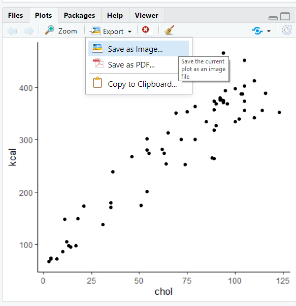

# Data Visualization 

In this chapter we shall discuss how we can make different types of data visualization in R. We will use the package `ggplot2` to visualize data. This is part of the `tidyverse` package, meaning you should load `tidyverse` to ensure you have `ggplot2` loaded.

We shall also discuss a little bit about when to make different types of graphs, and what each type is best suited for. We will also give a few pieces of advice about how to make your visualizations as readable and interpretable as possible. For much more information on the theory of data visualization with excellent examples, please refer to the [Fundamentals of Data Visualization](https://serialmentor.com/dataviz/) book by Claus Wilke. To understand the power behind `ggplot2` and for more data visualization examples, see the [ggplot2: Elegant Graphics for Data Analysis](https://ggplot2-book.org/index.html) by Hadley Wickham. 


## Introduction to ggplot2

The first thing to do when we want to make a visualization with `ggplot2` is to load the tidyverse:

```{r, message = FALSE}
library(tidyverse)
```


Next, let's load in some data. We'll pick the `BlueJays.csv` data:

```{r, message=FALSE, warning=FALSE}
df <- read_csv("data/BlueJays.csv")

head(df)

```


In the next few steps, we'll slowly build up a plot using `ggplot2`. This is **not** how you would typically write the code. However, it is worth going step by step, just to show you the logic behind the code.


If we just run the function `ggplot()` notice that all we get is a blank gray canvas. R knows that we want to make a plot, but it has no idea what type of plot or with what data - so it just throws up the canvas:


``` {r, fig.width = 5, fig.height = 3}
ggplot()  
```


Now, if we add the dataset to `ggplot()`, it still only gives us the blank canvas. It now knows we want to make a graph from the dataset called `df` but doesn't plot anything yet as we didn't tell it what to plot:

```{r, fig.width = 5, fig.height = 3}
ggplot(df)   
```


For R to 'know' what you are trying to plot, you need to use **`aes()`**. You put that most of the time inside `ggplot()` after your dataframe name.  (There are exceptions to this, but let's not worry about that yet). Inside the `aes()` we'll put what columns contain our data for the x and y axes. We may also refer to other columns inside `aes()` if we wish to modify the color or shape or something else about our data based on the values in some column.


For our first example, let's make a **scatterplot** of body mass against head size of these Blue Jays. If you look at the original dataset, you'll notice that both the `Mass` and `Head` columns contain continuous numeric data (i.e. they are numbers). 

In the code below, we are telling `aes()` to plot the `Mass` data on the x-axis and to plot the `Head` data on the y-axis.

```{r, fig.width = 5, fig.height = 3}
ggplot(df, aes(x=Mass, y=Head) )   
```

Something did change this time. We get a plot with labels on the x- and y-axes. It recognizes that we wish to plot `Mass` and `Head` data. It even knows the range of our data on each axis. For instance, it knows that the Mass data lies somewhere between 55 and 85.  However, we haven't yet told it precisely what type of plot we want to make (it doesn't just assume that we wanted to make a scatterplot - it can't read our minds).

So our next step is to tell it to make a scatterplot by adding points to the graph.  We tell `ggplot()` what we are adding to the chart by using different `geoms`. For a scatterplot, the geom we require is `geom_point()` - that means add datapoints. It is hard to remember all the different geoms, but you can just look them up.

Here is how we add datapoints to our graph with `+ geom_point()`.  

```{r, fig.width = 5, fig.height = 3}
ggplot(df, aes(x=Mass, y=Head) ) + geom_point()
```

That is our first ggplot graph! It looks pretty good. The amazing thing about ggplot is almost everything you are looking at on that graph can be customized to your preferred design choice. We'll discuss several of these customizations throughout this chapter. First, let's talk about changing the color of the datapoints. Inside of `geom_point()` we can change the color of all the points like this:


```{r, fig.width = 5, fig.height = 3}
ggplot(df, aes(x=Mass, y=Head) ) + geom_point(color="red")
```

This made the points red. Just make sure you put a recognized color name ([you can look them up here](http://www.stat.columbia.edu/~tzheng/files/Rcolor.pdf)) or a recognized [hex code](https://htmlcolorcodes.com/color-picker/).  Notice though that color name must be put inside of quotes.


What if we want to color the points based on another variable? For example, instead of having all of our data points be red, say we want them to be colored based on whether the birds or male or female?  The column that has the information about whether the birds are male or female is `KnownSex`. Because we are basing the color on a column, we put that information inside of `aes()` with `color = KnownSex`. We don't put that inside `geom_point()`.  This code looks like this:

```{r, fig.width = 5, fig.height = 3}
ggplot(df, aes(x=Mass, y=Head, color = KnownSex) ) + geom_point() 
```


### Assigning plots

When we make plots, our code can start to get quite long as we make more and more additions or changes to the plot. One very useful thing to know is that we can *assign* our plot to be an object, just as we would with a vector or a dataframe. For instance, let's remake the plot above, but this time we'll assign it the name `p`. We do that using `p <-`.

```{r, fig.width = 5, fig.height = 3}
p <- ggplot(df, aes(x=Mass, y=Head, color = KnownSex) ) + geom_point() 
```


Now, whenever we type and run `p` we will get our plot. e.g.

```{r, fig.width = 5, fig.height = 3}
p
```

### Titles and Axes Titles

The advantage of assigning our plots to a short name, is that we can add things with less code.  In R, if we wish to add a title to a plot, we do this with `+ ggtitle()`.  So, here is how we add a title to our above plot:

```{r, fig.width = 5, fig.height = 3}
p + ggtitle("Our first scatterplot")
```

The above plot is basically the same as writing:

```{r, fig.width = 5, fig.height = 3}
ggplot(df, aes(x=Mass, y=Head, color = KnownSex) ) + 
  geom_point() +
  ggtitle("Our First Scatterplot")

```


You'll notice that we are **chaining** together commands with the `+`. This is similar to how we chain together commands with the `%>%` when doing data carpentry. `ggplot()` instead chains with the `+`. Again, be careful not to start a row with a `+`, and you must end a row with a `+` unless it's the very last row.


To change the title of the x-axis or the y-axis, we use `xlab` and `ylab` respectively. We can do it like this:

```{r, fig.width = 5, fig.height = 3}

p + xlab("Body Mass (g)") + ylab("Head Size (mm)")

```

### Colors, Shapes and Sizes

R recognizes many default color names. These can be found at either of these places:
 
<br>
[Color names 1](https://www.datanovia.com/en/blog/awesome-list-of-657-r-color-names/)
<br>
[Color names 2](http://www.stat.columbia.edu/~tzheng/files/Rcolor.pdf)
<br>
Or, you can use a [hex code](https://htmlcolorcodes.com/color-picker/)
<br>

Here we use the color `dodgerblue` to change all the points to that color:

```{r, fig.width = 5, fig.height = 3}
ggplot(df, aes(x=Mass, y=Head) ) + geom_point(color="dodgerblue")
```


Here we change the points to the color `#ababcc` using a hexcode - note that hexcodes need to have `#` in front of them:

```{r, fig.width = 5, fig.height = 3}
ggplot(df, aes(x=Mass, y=Head) ) + geom_point(color="#ababcc")
```


You can also change the shape of the points you plot with `geom_point(pch = )`. You need to insert the appropriate number according to this guide:
 
{width=600px}


For example, to have dodgerblue asterisks, we add `pch = 8`, separating the color and shape commands by a comma:

```{r, fig.width = 5, fig.height = 3}
ggplot(df, aes(x=Mass, y=Head) ) + geom_point(color="dodgerblue", pch = 8)
```

Finally, we can change the size of our datapoints (or other shape we choose), using `size =`:

```{r, fig.width = 5, fig.height = 3}
ggplot(df, aes(x=Mass, y=Head) ) + geom_point(color="purple", size=2)
```


### Themes

**Default Themes**

You may have noticed that every plot we have made so far has the same gray background with faint white gridlines. This is the default setting for the look of `ggplot()` graphs. There are several other `themes` that are available to us that change the overall appearance of our plots. Some of these are listed below:


`theme_bw()` 
a variation on theme_grey() that uses a white background and thin grey grid lines.

`theme_linedraw()` 
A theme with only black lines of various widths on white backgrounds, reminiscent of a line drawing.

`theme_light()`
similar to theme_linedraw() but with light grey lines and axes, to direct more attention towards the data.

`theme_dark()`
the dark cousin of theme_light(), with similar line sizes but a dark background. Useful to make thin colored lines pop out.

`theme_minimal()`
A minimalistic theme with no background annotations.

`theme_classic()`
A classic-looking theme, with x and y axis lines and no gridlines.

`theme_void()`
A completely empty theme


Let's shows a couple of these different themes.  The theme that we use the most in this course is `theme_classic()`.  This is how you would apply this theme to your plot:

```{r, fig.width = 5, fig.height = 3}
ggplot(df, aes(x=Mass, y=Head) ) + 
  geom_point() +
  theme_classic()
```

It creates a very sleek simple graph. The downside to this type of graph is that it does get rid of the gridlines which can be helpful sometimes.  

Another theme that we use often is `theme_minimal()`. Here is how we would add this:

```{r, fig.width = 5, fig.height = 3}
ggplot(df, aes(x=Mass, y=Head) ) + 
  geom_point() +
  theme_minimal()
```

This theme is also simplistic, but has gridlines too. 

<br>

**Custom themes**

Rather than changing many different aspects of the graph at once, we can change individual things one by one with `theme()`. We don't propose to cover this in more detail in this book - for more information about themes [look here](https://ggplot2-book.org/) - however, here is one quick example.

Let's say we wanted to make the panel background light blue instead of gray. We could do it like this:

```{r, fig.width = 5, fig.height = 3}
ggplot(df, aes(x=Mass, y=Head) ) + 
  geom_point() +
  theme(panel.background = element_rect(fill = "lightblue"))
```

Again, this can get quite complicated - so stick with the default themes if you want to change your plots up a bit, or go to other help guides for more fine detail on customization.


<br><br>

## Histograms

Histograms are very common data visualizations. Histograms plot the frequency on the y-axis of a continuous variable on the x-axis.  For instance, let's say we had the following data, that we'll call `d1`:

```{r}

d1 <- data.frame(vals = c(1, 3, 4, 3, 6, 7, 2, 9, 3, 2, 2, 3, 1, 5, 4, 4))
d1

```

If we wanted to know how many of each number in the column vals we have, we could use `table()`:

```{r}
table(d1$vals)
```
The table above represents the **frequency table** or **frequency count** of the data. We can plot these data like this:



In this histogram, the height of each bar represents the total amount of the number on the x-axis. So, the height of the bar at `x=9` is one. This mean we have 1 of this value in our data distribution. The height of the bar at `x=3` is four, therefore we have four in our distribution for the value 3.

In the example above, the width of the bars is precisely 1. We could change the width to say two.  This is illustrated below:


Here, the first bar is at height 9. It spans the values of x between 1-3.  The second bar is at height 4, this include values between 3.01-5, and so on.  What we did here was to adjust the `binwidth`. When we have large distributions, adjusting the binwidth helps us to interpret the data more easily. 


### Histograms with ggplot2

To describe how to make histograms with the `ggplot()` function, lets look at the `films.csv` dataset.


```{r, message=FALSE, warning=FALSE}
film <- read_csv("data/films.csv")

head(film)

```

This dataset contains 146 rows of data. Each row has a unique film, with the final three columns giving three different ratings measures of how good the film was. These are their respective `rottentomatoes`, `imdb` and `metacritic` scores.

If we wished to plot the distribution of `imdb` scores, we need to put `x=imdb` inside the `aes()` part of the ggplot code. That is to tell it to plot these scores on the x-axis. We do not need to put a `y=` inside this, as we are not plotting anything from our dataset on the y-axis. Instead, ggplot2 will count up the frequency of our scores between regular intervals of `imdb` scores.

We then add `+ geom_histogram()` to tell it to make a histogram.  All together it looks like this:


```{r, fig.width = 5, fig.height = 3}

ggplot(film, aes(x=imdb)) + 
  geom_histogram()  
```


Now, this doesn't look great and we have several problems with it.  The two major problems that we get with our first histograms are.  1) The binwidth is almost never appropriate. We need to tell ggplot exactly what we want the binwidth on the x-axis to be. That is, what interval do we want our scores to be counted over. Looking at the graph, our scores range from just below 4 to about 8.6.  Perhaps a better interval would be 0.2, so we count how many films had scores between 3.6-3.8, 3.8-4.0, 4.0-4.2, 4.2-4.4, ........ 8.4-8.6, 8.6-8.8 etc.  2) Having black bars makes it really hard to distinguish the bars when they are close in heights. We need to fix the color scheme.


OK, let's make the bars dodgerblue and border them white. Inside `geom_histogram()` we use `color="white"` to represent the outside *lines* of the bars. We use `fill="dodgerblue` to indicate the color inside the bars should be dodgerblue.

```{r, fig.width = 5, fig.height = 3}
ggplot(film, aes(x=imdb)) + 
  geom_histogram(color="white", fill="dodgerblue") 
```


Now let's fix that binwidth.  To resolve this, inside `geom_histogram()` we write `binwidth = 0.2`.


```{r, fig.width = 5, fig.height = 3}
ggplot(film, aes(x = imdb)) + 
  geom_histogram(binwidth = 0.2, color="white", fill="dodgerblue") 
```

This looks a lot better. Now we can see that the majority of films have ratings in the 6.2-7.8 range, with relatively few above 8 and below 5.  It's not always easy to know what size interval to choose for the x-axis in histograms. It's worth just playing around with that number and seeing how it looks.

When we set the interval to be some value - here, we chose 0.2 - R doesn't automatically make that between easy to interpret numbers such as 4.0-4.2, 4.2-4.4 etc.  It could just as easily have chosen 3.874-4.074, 4.074-4.274.  Obviously, the latter is hard for us to interpret when looking at the axes. You can see in the above plot, that the vertical lines of the histogram bars don't neatly fall on top of whole numbers. To fix, this you can adjust the boundaries by picking a value to center your interval on. So, if we pick `boundary=4`, then that will be a boundary marker, and the interval will go 4.0-4.2, 4.2-4.4 etc.  


```{r, fig.width = 5, fig.height = 3}
ggplot(film, aes(x = imdb)) + 
  geom_histogram(binwidth = 0.2, color="white", fill="dodgerblue",boundary=4) 
```

Just be careful with using the boundaries that it does not crop your histogram incorrectly. Changing histograms too much can lead to misrepresenting the data. We would recommend that you don't use the boundary feature unless you have a real need to do so - just be careful!


Like with all ggplot figures, you can add as much customization as you wish. Here, we add a new theme, title and x- and y-axis labels:

```{r, fig.width = 5, fig.height = 3}
ggplot(film, aes(x = imdb)) + 
  geom_histogram(binwidth = 0.2, color="white", fill="dodgerblue") +
  theme_classic() +
  ggtitle("Histogram of IMDB Ratings") +
  xlab("Rating") +
  ylab("Frequency")
```

This looks really nice !


<br><br><br>

### Density Curves

Instead of plotting the **frequency** or counts of values on the y-axis, we can instead plot **density**. Here, we essentially convert the histogram to a solid line that estimates the overall shape of the distribution. We call this line a density curve. You can make this plot using `ggplot()` using `+ geom_density()` instead of `+ geom_histogram()`.

In the code below we do this for the `imdb` ratings, and we make the line color navy, and the fill of the density curve dodgerblue:

```{r, fig.width = 5, fig.height = 3}
ggplot(film, aes(x = imdb)) + 
  geom_density(color = "navy", fill = "dodgerblue") 
```

Usually the fill of these plots is too much, so it's nice to add some transparency. You can do that by picking a number between 0 and 1 to provide to the `alpha` argument. Here we choose `alpha = .4`:

```{r, fig.width = 5, fig.height = 3}
ggplot(film, aes(x = imdb)) +  
  geom_density(color = "navy", fill = "dodgerblue", alpha=.4)
```

The useful thing about density plots is that they give you a quick visual aid as to the overall shape of the distribution. You can easily see where the bulk of the data lie (here between 6 and 8 ratings score), and whether the data is symmetrical or not.


<br>

### Comparing Distributions

Instead of just plotting one histogram or one density curve, we often are interested in comparing two or more distributions. This means we are interested in comparing two or more histograms or density curves. To do this, we first need to ensure that our data are all measured in the same units.  

<br>

**Overlaid Histograms**

To illustrate this, let's use the `lifeexp.csv` data which contains life expectancy data for many countries.

```{r, message=FALSE}
life <- read_csv("data/lifeexp.csv")

head(life)
```

You can see that one of the columns is called `lifeExp` which is the life expectancy of each country in either 1952 or 2007. The year is shown in the `year` column, and the country is shown in the `country` column.  You'll notice that these data are in long format (see section \@ref(wide-versus-long-data)).

Perhaps we are interested in the distribution of life expectancies across all countries in the year 1952 compared to the distribution of life expectancies in the year 2007. We have a few options to do this.

The first option does not look good for this example (although it may work in other situations). This is an **overlaid histogram**. To do this, inside `aes()` as well as saying which column our distribution data is in `x=lifeExp`, we also tell it to make separate histograms based on the year column with `fill=year`. This will ensure it uses different fill colors for the two different years. Although not necessary, putting `position="identity"` inside `geom_histogram()` helps make the plot a little nicer.  Putting `color="black"` and `alpha=.7` inside `geom_histogram()` also helps distinguish the two histograms. 

```{r, fig.width = 5, fig.height = 3}
ggplot(life, aes(x=lifeExp, fill=year)) +  
  geom_histogram(binwidth=2, position="identity", color="black", alpha=.7) +
  theme_minimal()
```


This plot is still pretty bad though. This method of plotting is better when the histograms are quite distinctive from one another and there isn't much overlap in the distributions.

Choosing two colors that contrast more strongly than the default colors can help. Here, we are using hexcodes to pick a gray and a mustard yellow color. We manually define our fill colors using `+  scale_fill_manual(values = c("#999999", "#E69F00"))`.  To change the colors, just change the hexcodes to different ones or the names of colors you'd like. Just make sure that you have the same number of colors as groups in your data. Here, we have two groups (1952 and 2007) so we need two colors.  Also, notice that it says `scale_fill_manual` and not `scale_color_manual`. Because we are dealing with the inside color - this is considered to be a **fill** in ggplot2 terms. We used `fill=year` inside `aes()` so we need to match that with `fill` when manually choosing colors.

```{r, fig.width = 5, fig.height = 3}
ggplot(life, aes(x=lifeExp, fill=year)) +  
  geom_histogram( binwidth=2, position="identity", color="black", alpha=.7) +
  theme_minimal() +
  scale_fill_manual(values = c("#999999", "#E69F00"))

```


**Overlaid Density Plots**

Comparing distributions can also be done with `geom_density`. This is usually simpler to compare than overlaid histograms. 
  
The default plot for this would be to include `fill=year` inside the `aes()` code, as the `year` column contains the data that we wish to make separate plots for.

```{r, fig.width = 5, fig.height = 3}
ggplot(life, aes(x=lifeExp, fill=year)) +  
  geom_density(alpha = 0.4) 
```

We can add a custom fill colors with `+ scale_fill_manual(values = c("#999999", "#E69F00"))` and a custom theme with `+ theme_classic()`.

```{r, fig.width = 5, fig.height = 3}
ggplot(life, aes(x=lifeExp, fill=year)) +  
  geom_density(aes(fill = year), alpha = 0.4) +
  scale_fill_manual(values = c("#999999", "#E69F00"))  + 
  theme_classic()
```


This plot is now very easy to interpret. It's clear that in 2007 most countries had life expectancies of over 70, with a tail towards younger life expectancies. In 1952, the opposite pattern is found with most countries having life expectancies around 40 with the tail going towards older countries.


### Stem-and-Leaf Plots

Stem-and-leaf plots are a simplistic version of histograms. Before the advent of computers, this kind of plot would sometimes be easier to make than a histogram. Their heyday was quite a few decades ago! In fact, nowadays, these types of plots are almost never made by researchers or data scientists in the real world. They are pretty much exclusive to introductory statistics courses.  This is a bit of a shame because we think they are pretty cute.


Here is an example. Imagine we have the following numbers in a distribution. They may represent temperatures:

`20, 20, 23, 28, 29, 31, 32, 39, 40, 41, 42, 44, 44, 45, 48, 49, 55, 55, 56, 58, 59, 61, 62, 65, 66, 67, 70, 71, 75, 82, 86`

We can represent these in a stem-and-leaf plot as below. The first column represents the "tens" and the second column represents the "ones". So the "6" in the last row in the second column represents a temperature of 86. We put the second column data in ascending order. The heights of these bars represent a kind of histogram of sorts.


The columns do not have to be tens and ones.  For instance, if our data had been seconds, and the distribution was `2.0, 2.0, 2.3, 2.8....... 7.5, 8.2, 8.6` we could have done the same stem-and-leaf plot. 

There isn't a simple ggplot way of making stem-and-leaf plots, but there is a built-in function called `stem()` that can make them.


For an example, if we return to our imdb ratings:

```{r}
head(film)
```

We can make a stem-and-leaf plot of the `imdb` column like this.  The `scale=0.6` parameter dictates how long the stem-and-leaf plot should be. You can adjust it to your liking. Lower numbers make the plot shorter:

```{r}
stem(film$imdb, scale=0.6)
```

Here, the lowest rating we have is 4.0, and the highest is 8.6.


<br><br><br>

## Scatterplots

In the introduction to `ggplot2`, we already demonstrated how to make a scatterplot. Here we will show a few extra features of these plots. Scatterplots plot continuous variables on the x- and y-axes, and can be very useful to examine the association between the two continuous variables. We use them a lot when plotting data related to correlation (see section \@ref(correlation)) or regression (see section \@ref(linear-regression)).

As we showed earlier, `geom_point` is used to add datapoints to scatter plots. We'll do this for the `cheese.csv` dataset, that contains nutritional information about various cheeses:


```{r, message=FALSE, warning=FALSE}
cheese <- read_csv("data/cheese.csv")
head(cheese)
```

We'll start with a simple scatterplot looking at the association between saturated fat on the x-axis and cholesterol on the y-axis intake. 

```{r, fig.width = 5, fig.height = 3}
ggplot(cheese, aes(x=sat_fat, y=chol) ) + 
  geom_point()
```


We can change the color of the points by adding a color inside of `geom_point` - making sure that the color name is in quotes:

```{r, fig.width = 5, fig.height = 3}
ggplot(cheese, aes(x=sat_fat, y=chol) ) + 
  geom_point(color = "purple")
```


To add a straight trendline through the data we use  `+ stat_smooth(method = "lm")`. The `stat_smooth` bit tells it to add a trendline, and the `method="lm"` bit in the middle is telling it to make the straight line:

```{r, fig.width = 5, fig.height = 3, message=FALSE, warning=FALSE}
ggplot(cheese, aes(x=sat_fat, y=chol) ) + 
  geom_point(color = "purple") +
 stat_smooth(method = "lm")
```
Here you can see it automatically puts a shaded area around your trendline, which represents a confidence interval around the trendline. There is a way to remove it by adding `se = FALSE` or `se = F` inside of `stat_smooth()`: 

```{r, fig.width = 5, fig.height = 3, message=FALSE, warning=FALSE}
ggplot(cheese, aes(x=sat_fat, y=chol) ) + 
  geom_point(color = "purple") +
 stat_smooth(method = "lm", se = FALSE)
```


You can also change the color of the trendline, by adding to `stat_smooth`

```{r, fig.width = 5, fig.height = 3, message=FALSE, warning=FALSE}
ggplot(cheese, aes(x=sat_fat, y=chol) ) + 
  geom_point(color = "purple") +
  stat_smooth(method = "lm", se= F, color = "black")
```


As with all `ggplot2` graphs, you can customize the plot. For example changing the theme, adding a title and axes titles:


```{r, fig.width = 5, fig.height = 3, message=FALSE, warning=FALSE}
ggplot(cheese, aes(x=sat_fat, y=chol) ) + 
  geom_point(color = "purple") +
  stat_smooth(method = "lm", se= F, color = "black") +
  xlab(" Saturated Fat") +
  ylab("Cholesterol") +
  ggtitle("Saturated Fat vs Cholesterol") +
  theme_minimal()
```


If you wish to change the color of the points based on a grouping variable, then we need to put our `color=` into the `aes()`. You then need to provide the column that has the color grouping variable. For example, to change the color of points in our plot of body mass against head size in Blue Jays based on the sex of birds:

```{r, fig.width = 5, fig.height = 3}
head(df)

ggplot(df, aes(x=Mass, y=Head, color = KnownSex) ) + 
  geom_point() 
```

If you wish to customize the colors of your datapoints, then you need to add `scale_color_manual()` like this:


```{r, fig.width = 5, fig.height = 3}
ggplot(df, aes(x=Mass, y=Head, color = KnownSex) ) + 
  geom_point() +
  scale_color_manual(values = c("darkorange", "steelblue2")) +
  theme_classic()
```


If you have a lot of points on your scatterplot, it can get quite hard to see all the datapoints. One way to deal with this is to change the **transparency** of the points. You can do this by adjusting the `alpha` level inside of `geom_point()`. `alpha=` ranges from 0 to 1, with 0 being fully transparent and 1 being fully solid.


```{r, fig.width = 5, fig.height = 3}
ggplot(df, aes(x=Mass, y=Head, color = KnownSex) ) + 
  geom_point(alpha=.4) +
  scale_color_manual(values = c("darkorange", "steelblue2")) +
  theme_classic()
```


#### Multiple Groups on a Scatterplot

We can add multiple trendlines to each group of datapoints plotted on a scatterplot. Let's look at the following data of the chemical components of different olive oils produced in Italy. This is what the data look like: 

```{r, message=FALSE, warning=FALSE}
olives <- read_csv("data/olives.csv")
head(olives)
```

If we use `table()`, we can see how many different regions are represented in the data. There are three unique Italian areas where the olives come from:


```{r, message=FALSE, warning=FALSE}
table(olives$macro.area)
```

Say we are interested in looking at how `oleic` and `linoleic` acid contents are related to each other by `macro.area`:

```{r, message=FALSE, warning=FALSE, fig.width = 5, fig.height = 3}
ggplot(olives, aes(x=oleic, y=linoleic, color=macro.area)) +
  geom_point() +
  theme_classic()
```
<br>

If we wanted to add a trendline for each area, all we need to do is add our `stat_smooth(method="lm)` line to the code.  It already knows to plot these as separate trendlines for each group because inside `aes()` we have `color=macro.area`.  As long as there is a `group=` or `color=` inside `aes()` then it knows to do things like adding trendlines separately for each group:


```{r, message=FALSE, warning=FALSE, fig.width = 5, fig.height = 3}
ggplot(olives, aes(x=oleic, y=linoleic, color=macro.area)) +
  geom_point() +
  stat_smooth(method="lm", se=F) +
  theme_classic() 
```

<br>


### Bubble Charts

Bubble Charts are an extension to scatterplots. In scatterplots we plot two continuous variables against each other. With a bubble chart we add a third continuous variable and vary the size of our datapoints according to this variable.  For example, say we wish to also plot skull size on our Blue Jay scatterplot. We could increase the size of the points for individuals with larger skull sizes.  We do this by adding `size=Skull` into our `aes()` part:


```{r, fig.width = 5, fig.height = 3}
ggplot(df, aes(x=Mass, y=Head, color = KnownSex, size = Skull) ) + 
  geom_point(alpha=.4) +
  scale_color_manual(values = c("darkorange", "steelblue2")) +
  theme_classic()
```

The issue with bubble charts is that they can start to look very cluttered, making it hard to actually see any patterns. They should probably be used sparingly.  One trick you can employ to make them a little easier to see is to add `scale_size()` to the plot. Here, you enter two numbers to tell it what size points to scale to. In our example below, we used `scale_size(range = c(.1, 4))` which makes our points range between sizes 0.1 and 4. This makes the plot a little less busy:


```{r, fig.width = 5, fig.height = 3}
ggplot(df, aes(x=Mass, y=Head, color = KnownSex, size = Skull) ) + 
  geom_point(alpha=.4) +
  scale_color_manual(values = c("darkorange", "steelblue2")) +
  theme_classic() +
  scale_size(range = c(.1, 4))
```


 
<br><br><br>


## Line Graphs

Line graphs connect continuous values on the y-axis over time on the x-axis.  They are very useful for show patterns of change over time.

Let's look at the `jennifer.csv` dataset:


```{r, message=FALSE, warning=FALSE}
jennifer <- read_csv("data/jennifer.csv")

head(jennifer)
```


This dataset shows the number `n` of children born each year (`year`) in the United States with the name Jennifer. In 1916 there were five children born with the name Jennifer.  In 1917 there were 0. In 1923 there were 9. 

This dataset goes up to 2017 where there were 1052 children born with the name Jennifer:

```{r}
tail(jennifer)
```

Therefore, we have a continuous variable (`n`) and a time variable (`year`). We can plot these as we would plot a scatterplot by supplying `year` to our x-axis and `n` to our y-axis.  We could then add datapoints with `geom_point()` essentially making a scatterplot:

```{r, fig.width = 5, fig.height = 3}
ggplot(jennifer, aes(x=year, y=n) ) + geom_point() 
```


But, we aren't dealing with just a scatterplot. These datapoints can be connected to each other as they are ordered in time. Instead of using `geom_point()` we can use `geom_line()` to draw a line instead:

```{r, fig.width = 5, fig.height = 3}
ggplot(jennifer, aes(x=year, y=n) ) + geom_line()
```


If you so desired, you could plot both the points and lines together:

```{r, fig.width = 5, fig.height = 3}
ggplot(jennifer, aes(x=year, y=n) ) + 
  geom_point() +  
  geom_line() 
```

You can adjust the colors of the lines and the points independently by supplying `color=` inside of each geom:

e.g. Changing the color of the line, but *not* the points:

```{r, fig.width = 5, fig.height = 3}
ggplot(jennifer, aes(x=year, y=n) ) + 
  geom_point() +
  geom_line(color = "purple") 
```

Changing the color of both the points and the line:

```{r, fig.width = 5, fig.height = 3}
ggplot(jennifer, aes(x=year, y=n) ) + 
  geom_point(color = "violet") +
  geom_line(color = "purple") 
```

You can also change the width of lines by adding `lwd=` to `geom_line()`:

```{r, fig.width = 5, fig.height = 3}
ggplot(jennifer, aes(x=year, y=n) ) + 
  geom_line(color = "purple", lwd=2)
```


There are also several different styles of lines. You can change these by adjusting the number you provide to `lty=` inside of `geom_line()`. Here are a few examples:

```{r, fig.width = 3, fig.height = 2}
ggplot(jennifer, aes(x=year, y=n) ) + geom_line(lty=2)
```

```{r, fig.width = 3, fig.height = 2}
ggplot(jennifer, aes(x=year, y=n) ) + geom_line(lty=3)
```

This illustration shows some of the linetype options:




Just a quick reminder:  Please only connect datapoints into a line if it is meaningful to do so! This is almost always when your x-axis is some measure of time.  

<br>

### Multiple Line Graphs

Often we wish to compare the patterns over time of different groups. We can do that by plotting *multiple* lines on the same graph.

Let's look at this example dataset. 

```{r, message=FALSE, warning=FALSE}
jenlinda <- read_csv("data/jenlinda.csv")

tail(jenlinda)
```

Here, we have data in **long** format. We still have our continuous outcome variable of `n` in one column. We also have `year` in another column. So we can plot these two against each other. Importantly, we can split our lines based on our grouping variable, which is the `name` column. In that column we have two different groups - Jennifer and Linda.

To plot separate lines based on the `name` column, we need to add `group=name` to our `aes()`. We've also added some custom labels, titles and a theme.

```{r, fig.width = 5, fig.height = 3}
ggplot(jenlinda, aes(x=year, y=n, group=name)) + 
  geom_line()+
  xlab("Year") +
  ylab("Number of Children Born") +
  ggtitle("Popularity of Names Jennifer & Linda in USA") +
  theme_minimal()
```


You may notice that both lines are the same color!  To make the lines have different colors, we insert `color=name` into the `aes()` instead of `group=name`:


```{r, fig.width = 5, fig.height = 3}
ggplot(jenlinda, aes(x=year, y=n, color=name)) + 
  geom_line()+
  xlab("Year") +
  ylab("Number of Children Born") +
  ggtitle("Popularity of Names Jennifer & Linda in USA") +
  theme_minimal()
```


Again, we could customize these colors if we did not like them with `scale_color_manual()` like this:

```{r, fig.width = 5, fig.height = 3}
ggplot(jenlinda, aes(x=year, y=n, color=name)) + 
  geom_line()+
  xlab("Year") +
  ylab("Number of Children Born") +
  ggtitle("Popularity of Names Jennifer & Linda in USA") +
  theme_classic() +
  scale_color_manual(values=c("#ffadf3", "#800f4f"))


```

Just insert your favorite colors, and make sure you provide the same number of colors as you have separate groups/lines.


<br><br><br>


## Comparing Distributions across Groups

One of the most important data visualizations that we make is to compare the distribution of data across groups. Here we have a categorical variable on the x-axis, and a continuous variable on the y-axis. For some reason, the most common way to represent these data in most of the scientific literature is to plot bar graphs with error bars - so-called dynamite plots. However, in our very strong opinion these plots are dreadful and you should never use them. [Fortunately others agree](http://biostat.mc.vanderbilt.edu/wiki/pub/Main/TatsukiRcode/Poster3.pdf).  Instead, please choose from strip plots, boxplots or violin plots, or a combination, depending upon your data.

In this section we'll use the `wheels1.csv` dataset. These data show the number of revolutions of a running wheel made by mice over a four day period. The mice vary by their strain (type). Here we just select the `id`, `strain` and `day4` columns for this example: 

```{r, warning=FALSE, message=FALSE}
wheels <- read_csv("data/wheels1.csv")
wheels1 <- wheels %>% select(id, strain, day4) 
head(wheels1)
```

The `day4` column represents how many wheel revolutions the mice made on their fourth day running in the wheel. Some mice really like running in the wheel, others aren't as bothered!

Let's have a look at how many datapoints we have in each strain:

```{r}
table(wheels$strain)
```

We have 80 mice in five different strains.

<br>

### Strip Plots

Strip plots essentially just plot the raw data. It's like plotting a scatterplot, except we plot a categorical variable on the x-axis.

So in our example, inside `aes()` we'll put strain on the x-axis with `x=strain`, and on the y-axis we put our outcome variable with `y=day4`. We'll add datapoints with `+ geom_point()`:


```{r, fig.width = 5, fig.height = 3, warning=FALSE, message=FALSE}
ggplot(wheels1, aes(x = strain, y = day4)) + 
  geom_point()  +
  theme_classic()
```

The major issue with this plot is that all the points are in a very straight line, and it can be difficult to distinguish between different points.  To change this, instead of using `geom_point()` we use `geom_jitter()` which bounces the points around a bit:

```{r, fig.width = 5, fig.height = 3, warning=FALSE, message=FALSE}
ggplot(wheels1, aes(x = strain, y = day4)) + 
  geom_jitter()  +
  theme_classic()
```


Whoops! The points exploded. Now it's not possible to know which points belong to which group. To constrain this, we can set `width=` inside of `geom_jitter()` which tells the points how far they are allowed to bounce around:

```{r, fig.width = 5, fig.height = 3, warning=FALSE, message=FALSE}
ggplot(wheels1, aes(x = strain, y = day4)) + 
  geom_jitter(width = .15)  +
  theme_classic()
```

This looks a lot better!. 


<br>

### Boxplots

Boxplots are a very useful way of summarizing the distribution of data. The image below summarizes what each line in the boxplot represents. For more details on all of these descriptive measures see section \@ref(descriptives):




The middle horizontal line is at 6. This represents the **median** of the distribution which is the middle value. 50% of the distribution lies above this value and 50% below it. The higher horizontal line at the top of the box represents the **upper quartile**. This is approximately the median of the upper 50% of the data, so is approximately the 75% percentile.  The lower horizontal line at the bottom of the box represents the **lower quartile**. This is approximately the median of the lower 50% of the data, so is approximately the 25% percentile of the data.  Therefore, the middle 50% of the data (from the 25% percentile to the 75% percentile) lies inside the box.  The long vertical lines represent the **range** of the data. The top of that line is the maximum value in the data, and the bottom of that line is the minimum value in the distribution.


The above is a basic boxplot. However, `ggplot2` does things a little bit differently. It turns out there is more than one way to calculate the lower and upper quartiles (see section \@ref(interquartile-range)). Also, R doesn't necessarily extend the vertical lines (**whiskers**) all the way to the minimum and maximum values. If there are datapoints that  are too far away from the upper or lower quartile, then it truncates the whisker and shows datapoints outside of this range as dots.  Here is an illustration of a ggplot boxplot:




OK, let's have a look at some boxplots using `ggplot()`.  We provide the same `x=strain` and `y=day4` values as we do with strip plots. Instead of `geom_jitter()` we use `geom_boxplot()`:


```{r, fig.width = 5, fig.height = 3, warning=FALSE, message=FALSE}
ggplot(wheels1, aes(x = strain, y = day4)) + 
  geom_boxplot()  +
  theme_classic()
```

You can see in this example, that the strain "F1-129B6" and the strain "S129" both have two datapoints that are shown as outliers beyond the whiskers. 


To change the colors of the boxplots, you can change `color=` and `fill=` inside `geom_boxplot()`. Remember that `color` refers to the color of the lines, and `fill` refers to the filled in color of the shape:


```{r, fig.width = 5, fig.height = 3, warning=FALSE, message=FALSE}
ggplot(wheels1, aes(x = strain, y = day4)) + 
  geom_boxplot(color="navy", fill="lightsteelblue1") +
  theme_classic()
```


You can change the size, color and shape of the outliers. For instance, to remove them completely, we do `outlier.shape=NA` inside `geom_boxplot()`

```{r, fig.width = 5, fig.height = 3, warning=FALSE, message=FALSE}
ggplot(wheels1, aes(x = strain, y = day4)) + 
  geom_boxplot(color="navy", fill="lightsteelblue1", outlier.shape = NA) +
  theme_classic()
```

To change the size and color, you can use `outlier.size` and `outlier.color` respectively inside `geom_boxplot()`

```{r, fig.width = 5, fig.height = 3, warning=FALSE, message=FALSE}
ggplot(wheels1, aes(x = strain, y = day4)) + 
  geom_boxplot(color="navy", fill="lightsteelblue1", outlier.size = .5, outlier.color = "gray66") +
  theme_classic()
```

<br>

#### Overlaying points

It can often be helpful to overlay your raw datapoints over the top of boxplots, providing that you don't have too much data.  To do this, just add your points with either `geom_point()` or preferably `geom_jitter()`. But one warning - make sure you remove any outliers with `outlier.shape=NA` otherwise those datapoints will show up twice: 
```{r, fig.width = 5, fig.height = 3, warning=FALSE, message=FALSE}
ggplot(wheels1, aes(x = strain, y = day4)) + 
  geom_boxplot(color="navy", fill="lightsteelblue1", outlier.shape = NA) +
  geom_jitter(width=0.15, color="navy") +
  theme_classic()
```


Sometimes this can look a bit too busy. One way to contrast things is to set either the points or the boxplots themselves to have some transparency with `alpha=`. 

Here we make the points a bit transparent:


```{r, fig.width = 5, fig.height = 3, warning=FALSE, message=FALSE}
ggplot(wheels1, aes(x = strain, y = day4)) + 
  geom_boxplot(color="navy", fill="lightsteelblue1", outlier.shape = NA) +
  geom_jitter(width=0.15, color="navy", alpha = .3) +
  theme_classic()
```


Here we leave the points solid, but make the boxplot fill transparent:


```{r, fig.width = 5, fig.height = 3, warning=FALSE, message=FALSE}
ggplot(wheels1, aes(x = strain, y = day4)) + 
  geom_boxplot(color="navy", fill="lightsteelblue1", outlier.shape = NA, alpha = .3) +
  geom_jitter(width=0.15, color="navy") +
  theme_classic()
```


And finally, making both a bit transparent, adding some custom titles and labels. You can just choose what you think looks best!

```{r, fig.width = 5, fig.height = 3, warning=FALSE, message=FALSE}
ggplot(wheels1, aes(x = strain, y = day4)) + 
  geom_boxplot(color="navy", fill="lightsteelblue1", outlier.shape = NA, alpha = .3) +
  geom_jitter(width=0.15, color="navy", alpha=.3) +
  theme_classic()  +
  xlab("Mouse Strain") +
  ylab("Total Revolutions") +
  ggtitle("Mouse Wheel Running")
```


<br>

#### Reordering categorical x-axes

The boxplot that we made looks ok, but one thing is visually annoying. The boxes are plotted in alphabetical order on the x-axis (B6, F1-129B6..... Swiss). There is no reason why they should be in this order.  A more visually appealing way would be to order the boxplots from the group with the highest median to the lowest median. 

To do this, instead of putting `x=strain` inside of `aes()` we put `x = reorder(strain, -day4, median)` inside instead. This is a bit of a mouthful. To break it down, it's saying plot strain on the x-axis, but reorder the groups based on the median of the strain column (that's the '-day4' in the code).


```{r, fig.width = 5, fig.height = 3, warning=FALSE, message=FALSE}
ggplot(wheels1, aes(x = reorder(strain, -day4, median), y = day4)) + 
  geom_boxplot(color="navy", fill="lightsteelblue1", alpha = .3) +
  theme_classic()
```

The output looks pretty good - it is now really easy to notice that one of the groups has a much lower distribution than the others. The major issue is that the label of the x-axis is terrible. So let's fix that: 

```{r, fig.width = 5, fig.height = 3, warning=FALSE, message=FALSE}
ggplot(wheels1, aes(x = reorder(strain, -day4, median), y = day4)) + 
  geom_boxplot(color="navy", fill="lightsteelblue1", alpha = .3) +
  theme_classic() +
  xlab("Mouse Strain") +
  ylab("Total Revolutions") +
  ggtitle("Mouse Wheel Running")
```

Much nicer!


<br>

#### Flipping Axes

Often boxplots look perfectly fine with the categorical grouping variable on the x-axis and the continuous variable on the y-axis. If you start to have many groups, then sometimes the boxplots looks too cluttered when placed on the x-axis. In this situation, it might look better to flip the axes, and have the boxplots stacked vertically.  To do this, you write your plot code exactly as you would normally, but you just add `+ coord_flip()` to the end of the code.


Let's add this to the reordered boxplots we just made in the previous section:

```{r, fig.width = 5, fig.height = 3, warning=FALSE, message=FALSE}
ggplot(wheels1, aes(x = reorder(strain, -day4, median), y = day4)) + 
  geom_boxplot(color="navy", fill="lightsteelblue1", alpha = .3) +
  theme_classic() +
  xlab("Mouse Strain") +
  ylab("Total Revolutions") +
  ggtitle("Mouse Wheel Running") +
  coord_flip()
```


This is OK, but it would be nicer if the highest values were at the top. There may well be a more straightforward way of doing this, but a quick solution is to wrap `reorder(strain, strain, median)` with `fct_rev`, so you now have  `x = fct_rev(reorder(strain, strain, median))`.  It's a whole lot of code, but it does make the graph really pretty, so it's worth it:

```{r, fig.width = 5, fig.height = 3, warning=FALSE, message=FALSE}
ggplot(wheels1, aes(x = fct_rev(reorder(strain, -day4, median)), y = day4)) + 
  geom_boxplot(color="navy", fill="lightsteelblue1", alpha = .3) +
  theme_classic() +
  xlab("Mouse Strain") +
  ylab("Total Revolutions") +
  ggtitle("Mouse Wheel Running") +
  coord_flip() 
```


<br>

### Violin Plots


A disadvantage of boxplots, especially when you have large distributions, is that the box does not tell you much about the overall shape of the distribution. An alternative are **violin plots**, where the width of the shape reflects the shape of the distribution. To make these plots, instead of using `geom_boxplot()` we use `geom_violin()`.

```{r, fig.width = 5, fig.height = 3, warning= FALSE, message = FALSE}
ggplot(wheels1, aes(x = strain, y = day4)) +  
  geom_violin() + 
  theme_classic()
```

You can do all the customizing, reordering, coloring, transparency-ing, etc that you do with boxplots:

```{r, fig.width = 5, fig.height = 3, warning=FALSE, message=FALSE}
ggplot(wheels1, aes(x = fct_rev(reorder(strain, strain, median)), y = day4)) + 
  geom_violin(color="navy", fill="lightsteelblue1", alpha = .3) +
  theme_classic() +
  xlab("Mouse Strain") +
  ylab("Total Revolutions") +
  ggtitle("Mouse Wheel Running") +
  coord_flip() 
```


### Stacked Boxplots

Sometimes, we want to compare distributions for the same group side by side. For instance, we may not just want to plot the day4 wheel running data, but also plot the day1 data. 

Below, we have data in **wide format**. We have ids, strain, day1 running and day4 running. 


```{r}
wheels2 <- wheels %>% select(id, strain, day1, day4)

head(wheels2)

```

We need to turn this to **long data** to be able to make the stacked boxplot graph. See section \@ref(wide-versus-long-data) for more on how to switch between wide and long data formats:

```{r}
wheels2.long <- wheels2 %>% pivot_longer(cols = 3:4, names_to = "day")
wheels2.long

```


Now the wheel running data is in its own column - `value`. So we use `y=value`. The grouping variable is in the `day` column, so we use `fill=day` to make separate boxplots based on the day. This will also make them different fill colors:

```{r, fig.width = 5, fig.height = 3, warning=FALSE, message=FALSE}
ggplot(wheels2.long, aes(x = strain, y = value, fill=day)) + 
  geom_boxplot() +
  theme_classic()
```


This looks ok, but the colors are yucky.  Lets add custom titles, labels, and we'll customize the fill colors using `scale_fill_manual`. We have two groups (day1 and day4) so we need to provide two colors:

```{r, fig.width = 5, fig.height = 3, warning=FALSE, message=FALSE}
ggplot(wheels2.long, aes(x = strain, y = value, fill=day)) + 
  geom_boxplot() +
  theme_classic() +
  scale_fill_manual(values = c("#9381e3", "#faff75")) +
  xlab("Mouse Strain") +
  ylab("Total Revolutions") +
  ggtitle("Mouse Wheel Running") 
```

It turns out all the strains increase their overall running in wheels from day 1 to day 4, except the S129 strain who get bored with wheel running - probably similar to how you're bored of seeing graphs about wheel running.


<br>


### Ridgeline Plots

Another useful way of displaying distributions of data across groups is using ridgeline plots. These are essentially density histogram plots for each categorical group plotted side by side. To do this we need to use a package called `ggridges`. This can be installed by going to the `Packages` tab, selecting `Install` and typing in `ggridges` in the box.

Let's go back to the `olives` data.  Say we are interested in displaying the distribution of `oleic` acid content by `macro.area`.  We plot the categorical group of interest (here `macro.area`) on the y-axis, and the continuous variable whose distribution we are interested in (`oleic`) on the x-axis. We then use `stat_density_ridges()` to plot the ridgeline plots.


```{r, warning=FALSE, message=FALSE, fig.width = 6, fig.height = 4}
library(ggridges)

ggplot(olives, aes(x = oleic, y = macro.area)) +
  stat_density_ridges() +
  theme_classic()

```
You can add color by adding in a `fill=` to the `aes()`. 

```{r, message=FALSE, warning=FALSE, fig.width = 6, fig.height = 4}

ggplot(olives, aes(x = oleic, y = macro.area, fill = macro.area)) +
  stat_density_ridges() +
  theme_classic() 
```
... and perhaps we can manually override the default color scheme - here I'm using hex codes to pick a very purpley color scheme:

```{r, message=FALSE, warning=FALSE, fig.width = 6, fig.height = 4}

ggplot(olives, aes(x = oleic, y = macro.area, fill = macro.area)) +
  stat_density_ridges() +
  theme_classic() +
  scale_fill_manual(values=c("#D1B8D0", "#F78EF2", "#AC33FF"))
```
A nice thing about these ridgeline plots is that we can easily add on lines that represent the lower quartile, median  and upper quartile by adding in the argument `quantile_lines = TRUE` like this:

```{r, message=FALSE, warning=FALSE, fig.width = 6, fig.height = 4}

ggplot(olives, aes(x = oleic, y = macro.area, fill = macro.area)) +
  stat_density_ridges(quantile_lines = TRUE) +
  theme_classic() +
  scale_fill_manual(values=c("#D1B8D0", "#F78EF2", "#AC33FF"))
```
The final ridgeline plot below plots the distributions of oleic acid by region. There are 9 regions. It's best in these plots to try and plot the categories from highest to lowest median, as it looks nicer. The following code is a bit tricky, and if you're not interested - then you can safely ignore. However, just in case it is of interest to anyone:  to do that you need to make sure `ggplot` recognizes the categorical variable `region` in this case to be a factor (a grouped variable) and that they are in the right order. It can be done using using this line: `fct_reorder(region, -oleic, .fun = median)`. Essentially this says, make the `region` variable a factor, and reorder it to be from highest median of oleic acid to lowest.  One final thing - you have to do this for both the `y` axis category, and the `fill` - otherwise your colors won't match your y-axis categories.

In the below code, I also added quantiles, x-axis and y-axis titles, a title and I removed the legend as it didn't add any extra information that isn't already on the plot.


```{r, message=FALSE, warning=FALSE, fig.width = 6, fig.height = 4}

ggplot(olives, aes(x = oleic, 
                   y = fct_reorder(region, -oleic, .fun = median), 
                   fill = fct_reorder(region, -oleic, .fun = median)
                   )) +
  stat_density_ridges(quantile_lines = TRUE) +
  theme_classic() +
  scale_fill_manual(values=c("#0000FF", "#2000DF", "#4000BF", "#60009F", "#800080", "#9F0060", "#BF0040", "#DF0020", "#FF0000")) +
  theme(legend.position = "none") +
  ylab("Region") +
  xlab("Oleic Acid Content") +
  ggtitle("Oleic Acid Content of Italian Olives by Region")

```

For more information about these plots, you can look up the help documentation for this [package here](https://cran.r-project.org/web/packages/ggridges/vignettes/introduction.html).


<br><br><br>

## Bar Graphs  

A common form of data that we wish to show are the amounts of different categories. Often these data could be presented in a table format. For instance, the table below shows the total number of number 1 hits by six different artists in the UK.

{width=30%}

A table is a completely legitimate way to present data. A graphical way of presenting these same data would be to make a **bar graph**. In these plots we have a categorical grouping variable on the x-axis and a numerical value (either continuous or discrete) on the y-axis.  An advantage of bar graphs over tables is that it is often easier to visualize the proportional differences between categories in their values when looking at a bar graph compared to a table. Bar graphs are therefore especially useful when the differences between groups are larger. 


If we wish to make a bar graph using `ggplot()` our data may come in two different ways. First, we may already have the totals that we wish to plot - that is our dataset already contains the values that the bar heights will be at.  Second, we may not have these counts but need R to calculate them for us. These two different initial data setups require different geoms to create bar graphs.


**geom_col()**

Let's first describe the situation when you have a dataset where you *have* already counted the number that applies to each group. We will use the `number1s.csv` data which contains the same data as the table above. 


```{r, message=FALSE, warning=FALSE}
df1 <- read_csv("data/number1s.csv")
head(df1)
```

When data look like this and you have one column that is the category (`x = name`) and one column containing the numerical data `y = total`, you can use `geom_col()`.  

```{r, fig.width = 5, fig.height = 3}
ggplot(df1, aes(x = name, y = total) ) + 
  geom_col() +
  theme_classic()
```


Notice that the default order is alphabetical. You can reorder by putting `reorder` around the x-axis column. If you put `reorder(name, total)` this is telling it to reorder the `name` variable by their respective increasing values of total:

```{r, fig.width = 5, fig.height = 3}
ggplot(df1, aes(x = reorder(name, total), y = total) ) +
  geom_col() +
  theme_classic()
```


Alternatively, if you put `reorder(name, -total)`, with the `-` sign in front of 'total', this is telling it to reorder the `name` variable by their respective decreasing values of total:


```{r, fig.width = 5, fig.height = 3}
ggplot(df1, aes(x = reorder(name, -total), y = total) ) + 
  geom_col() +
  theme_classic()
```

 To change the color of the bars, you need to put `fill=` inside `geom_col()` as we are dealing with filling in a shape: 

When changing color use 'fill' here because it's a shape.
```{r, fig.width = 5, fig.height = 3}
ggplot(df1, aes(x = reorder(name, -total), y = total) ) + 
  geom_col(fill = "#32b5ed") +
  theme_classic()
```

If you wish to add a different color border around the bars, then you can add `color=` inside the `geom_col()`:


```{r, fig.width = 5, fig.height = 3}
ggplot(df1, aes(x = reorder(name, -total), y = total) ) + 
  geom_col(fill = "#32b5ed", color="#193642") +
  theme_classic()
```


And, as per usual, all other customizations are acceptable, including rotating the chart using `coord_flip()`: 

```{r, fig.width = 5 , fig.height = 3}
ggplot(df1, aes(x = reorder(name, total), y = total) ) + 
  geom_col(fill = "#32b5ed", color="#193642") +
  xlab("") +
  ylab("Total Number 1's") +
  ggtitle("Number 1 hits in UK") +
  theme_classic() +
  coord_flip()
```

In the code for this flipped bar graph, notice that we removed the `-` from next to `-total` when reordering. If we'd left it in, it would have plotted the bars in the opposite order. If you are unsure with your own data whether to use it or not - just see what happens with and without it. Bar graphs look better when the highest value is at the top.

One other key thing about bar graphs, is that they should technically **start at 0**. As you are visualizing amounts, it would be misleading to start the graph at e.g. 10 in the above example. That would distort the relationship of the length of the bars to each other. Some people extend this rule to all graphs, but this is a misconception. Often we don't need to know where 0 is for boxplots for instance. However, it is generally important to know where 0 is for bar graphs if we wish to compare bars between groups.


**geom_bar()**

Often we want to make bar graphs to visualize how many we have of each group, but we don't yet know how many we have! For example, take the following dataset which is found in `pets.csv`.

```{r, warning=FALSE, message=FALSE}
pets <- read_csv("data/pets.csv")
head(pets)
```

These data show different individuals in a class in the `name` column and what their favorite pet is in the `pet` column. Perhaps we want to visualize which pets are the most popular. We'd like to get the total number of people who put 'cat' as their favorite, the total number of people that put 'dog' down and so on.

One quick way to visually inspect how many we have of each pet in the `pet` column is to use the function `table()`:
```{r}
table(pets$pet)
```


To make the bar graph of these data using `ggplot()`, we need to use `geom_bar()`. Fortunately, `geom_bar()` counts how many we have of each for us. We do not need to supply a y column. We just need to supply `x=pet` to indicate that that column will be our grouping variable.

```{r, fig.width = 5, fig.height = 3}
ggplot(pets, aes(x = pet)) + 
  geom_bar() +
  theme_classic()
```


Once we have the basic plot down, all the other bits and pieces can be done:


Then just customize.
```{r, fig.width = 5, fig.height = 3}
ggplot(pets, aes(x = pet)) + 
  geom_bar(color="black", fill="plum3") +
  theme_classic()+
  xlab("Pet")+
  ylab("Total")+
  ggtitle("Popularity of Pets in a Class")
```


You can also reorder your factor. With `geom_bar()` we reorder in a similar way to how we did with `geom_boxplot()`. We use `x = reorder(pet, pet, table)` to tell it to reorder the pet category according to the frequency count of each as calculated by the `table()` function.  Using `coord_flip()` makes it easier to read and compare bars.

```{r, fig.width = 5, fig.height = 3}
ggplot(pets, aes(x = reorder(pet, pet, table))) + 
  geom_bar(color="black", fill="plum3") +
  theme_classic()+
  xlab("Pet")+
  ylab("Total")+
  ggtitle("Popularity of Pets in a Class") +
  coord_flip()
```

<br><br><br>


## Small Multiples

Often we want to compare graphs across multiple categories. One good strategy to do this is to make **small multiples**, which is essentially replicating the same graph for each group several times in different panels. This is probably best explained by doing an example.


**Scatterplot small multiple**

Here, we load in the `penguins.csv` dataset. This data shows the size of various penguins culmen (the beak) and flippers:


```{r, warning=FALSE, message=FALSE}

penguins <- read_csv("data/penguins.csv")
head(penguins)


```

The dataset contains three different species:

```{r, fig.width = 5, fig.height = 3}
table(penguins$species)
```

We might be interested in examining how body mass is associated with flipper length across species and across sex. Here, we have two different columns containing categorical variables. We have `sex` and `species`. If we wanted to show all of this on just one scatterplot, we could change the color of the points to represent species, and the shape of the points to represent sex. We change the shape by a column using `shape=` inside of `aes()`:

```{r, fig.width = 5, fig.height = 3}
ggplot(penguins, aes(x = body_mass_g,  y = flipper_length_mm, color = species, shape = sex)) + 
  geom_point() +
  theme_classic()

```

The problem with this sort of graph is that it is far too cluttered. Using shape to distinguish categories isn't that useful or helpful. You really have to squint at the graph to work out what is a circle and what is a triangle.


An alternative approach is to make small multiples. We create a separate scatterplot for each species. Here, we color our points by sex with `color=sex` inside `aes()`. We add to our code the line `facet_wrap(~species)` to tell `ggplot()` to make separate scatterplots for each species. Please note the `~` that comes before the column name that you wish to make separate plots for:

```{r, fig.width = 8, fig.height = 3}
ggplot(penguins, aes(x = body_mass_g,  y = flipper_length_mm, color = sex)) + 
  geom_point() +
  theme_minimal() +
  facet_wrap(~ species)
```


You may notice that all the scatterplots have the same range of values on the x-axis.  Technically, this is the most appropriate approach as it enables you to make comparisons across groups more easily.  However, if you want to fit the data on each scatterplot to cover the whole canvas, you can make the axes unfixed by adding `scales="free"` to your `facet_wrap()` command:

```{r, fig.width = 8, fig.height = 3}
ggplot(penguins, aes(x = body_mass_g,  y = flipper_length_mm, color = sex)) + 
  geom_point() +
  theme_minimal() +
  facet_wrap(~ species, scales = "free")
```


**Line graph small multiple**

We can also make small multiples for line graphs. Let's illustrate this using the `lifeexp_all.csv` dataset.

```{r, warning=FALSE, message=FALSE}
le <- read_csv("data/lifeexp_all.csv")

head(le)

```

In this dataset we have a column giving the life expectancy (`lifeExp`) of various countries that are in the `country` column. We also have a `year` column that goes from 1952 to 2007 at five year intervals.  Consequently, we could plot a line graph of year on the x-axis and life expectancy on the y-axis. We could make separate lines for each country. As there are far too many countries to plot, it is not worth making each one a separate color. Because of this, rather than putting `color=country` into `aes()` to indicate to make separate lines for each country, we'll put `group=country`.  This will make separate lines for each country, but make them all the same color. If we make them a light color and a bit transparent, it will look best:


```{r, fig.width = 5, fig.height = 3}
ggplot(le, aes(x = year, y = lifeExp, group = country)) + 
  geom_line(color="cornflowerblue", alpha=0.2) +
  theme_minimal()

```

This gives us a sense of the overall pattern of life expectancies from 1952 to 2007. The trend for most countries is generally upwards, though there are some countries that have big crashes.

We also have another categorical variable in our dataset. There is a column called `continent`.  We could replot this line graph, but separate the plots based on which continent the lines/countries belong to.  We do that again using `facet_wrap(~continent)`.


```{r, fig.width = 9, fig.height = 7}
ggplot(le, aes(x = year, y = lifeExp, group = country)) + 
  geom_line(color="cornflowerblue", alpha=0.5) +
  theme_minimal() +
  facet_wrap(~continent)

```

Because there are fewer lines on each graph, we upped the alpha to 0.5 to make the lines a bit darker on this plot.


If you wish to make the lines belonging to each panel different colors from each other, you can add `color=continent` to your `aes()`.  You have to remove the color from `geom_line()` to make this work:


```{r, fig.width = 9, fig.height = 7}
ggplot(le, aes(x = year, y = lifeExp, group = country, color = continent)) + 
  geom_line( alpha=0.5) +
  theme_minimal() +
  facet_wrap(~continent)+
  xlab("Year") +
  ylab("Life Expectancy")

```


<br><br><br>


## Saving and Exporting ggplot2 graphs

How do we save the nice plots that we have made using ggplot2?  There are some quite advanced ways of saving high resolution images.  Here, we'll just run through some quick and easy options.


First, you could just hit `zoom` in RStudio to make your plot bigger. Resize the window to your preferred graph size and then take a screenshot. Paste your screenshot into a program such as paint and crop away.  This is a very crude method - but it's fast and reliable if you just want to have an image to insert into some other program.

{width=50%}


A second option is after you have made your plot, you can hit the 'export' tab on the plot viewer. Choose either "Save as Image" or "Save as PDF" and then choose how and where you want to save the image.

{width=50%}


A more premium option is to use a function from ggplot called `ggsave()`.  The first step you should do is to assign your plot to an object name. In the code below, we are making a scatterplot that we save to the object `plot1`:

```{r, fig.width=5, fig.height=4}
plot1 <- ggplot(cheese, aes(x = chol, y = kcal)) + 
     geom_point(color='purple', size=2) + 
     theme_classic() +
     xlab("Cholesterol") +
     ylab("Calories in kcal") +
     ggtitle("Cheese")

plot1
```

Next, run a line of code that will save your plot.  You type `ggsave()`. The first thing you put inside this is the location where you want your plot to be stored. You need to write a location on your computer. If you are using an Rproject such as with this course, you could put your plot in a folder called `img`.  Remember to type the file extension `.png` or `.pdf` after the name of your new plot.  The second thing you need to write is the name of the graph object you wish to save. Here our graph is called `plot1`.

```{r, eval=FALSE}
ggsave("img/cheese_plot.png", plot1)  # save as a png

ggsave("img/cheese_plot.pdf", plot1)  # save as a pdf
```


You can also play around with the width and height of your saved image. You probably need to trial and error this a few times to get the proportions that you really like. Here we are making an image that is 10 inches wide and 8 inches high.

```{r, eval=FALSE}
ggsave("img/cheese_plot2.png", plot1, width = 10, height = 8)  #(in inches, though can be in cm)

```

<br><br><br>