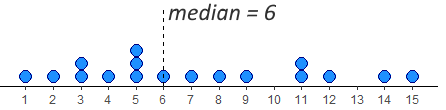
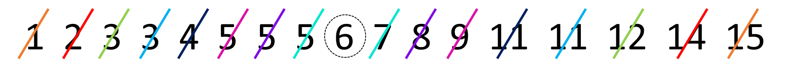
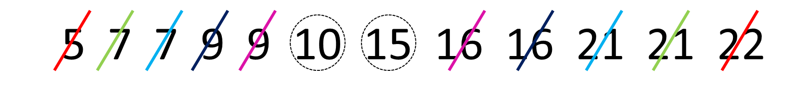
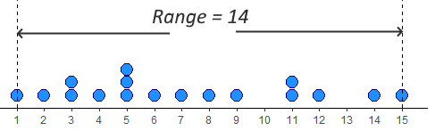
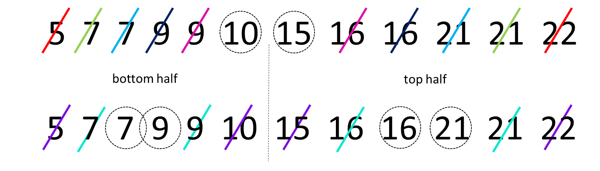
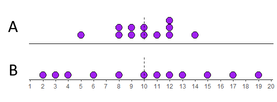

# Descriptives

Descriptive statistics describe basic features of the data in simple summaries. Examples include reporting measures of **central tendency** such as the mean, median, and mode. These are values that represent the most typical or most central point of a data distribution. Another class of descriptives are measures of **variability** or **variation** such as variance, standard deviation, ranges or interquartile ranges. These measures describe the spread of data. As well as being useful summaries in their own right, descriptive statistics are also used in data visualization to summarize distributions. There are several functions in R and other packages that help to get descriptive statistics from data. Before we go into detail about how to use R to get descriptives, we'll describe these measures of central tendency and variation in a bit more detail.


## Sample vs Population

The first thing we would like to discuss is the difference between **samples** and **populations**.  We can calculate descriptive measures such as means and standard deviations for both samples and populations, but we use different notation to describe these.  A population is all subjects that we could possibly collect data from. For example, if we were interested in the IQ scores of eighth graders in Texas, then our population of interest is all eighth graders in Texas. If we wished to study maze learning in juvenile rats, then our population of interest would be all juvenile rats. If we were studying leaf growth in sunflowers, then our population of interest is all sunflowers.  If we were able to measure the size of leaves on all sunflowers in existence, or measure the maze learning of all juvenile rats in the world, or the IQ of all eighth graders in Texas, then we would have data for the whole population. We would then be able to say something about the mean or median or some other descriptive about the population. Clearly, it is not always possible to measure every subject in a population. Of our three examples, it may just about be possible to measure the IQ of all Texas eighth graders although it would be a lot of work. It seems unlikely to be possible to measure the leaf growth of all sunflowers or the maze learning of all juvenile rats. Instead, what we typically do is to collect data on a subset of subjects. We call this subset a **sample**.   For instance, if we picked 10 sunflowers then we would collect data on just those sunflowers. We may be able to calculate the average leaf size of these 10 sunflowers and use that to **estimate** what the true leaf size is of all sunflowers.  We call the descriptive measures of samples **estimates** or **statistics**, whereas the descriptive measures of populations are called **parameters**.

Let's now discuss different descriptive measures in turn.


## Sample and Population Size

This isn't strictly a descriptive measure - but it is worth pointing out that the notation for the size of your data is different depending upon whether you are talking about a sample of a population.  If you are taking about a sample, then we use the lower case $n$ to refer to the sample size.  So, if you see $n=10$ this means that the sample size is 10. e.g. you picked 10 sunflowers to collect data on.  If you see the upper case $N$ this refers to the population size. So if you see that the population size is $N=1200000$ this refers to a population size of 1.2 million.


## Central Tendency

The first class of descriptives we will explore are measures of central tendency. These can be thought of as values that describe what is the most common, most typical or most average value in a distribution. Also, here we are using the term **distribution** to refer to a group of numbers or our data.

We'll use the following dataset as an example. Let's imagine that this is a sample of data:

```{r}
x <- c(1, 14, 12, 5, 3, 6, 11, 15, 9, 5, 4, 2, 7, 5, 3, 8, 11)
x
```

We can calculate the sample size using `length()`:

```{r}
length(x)
```

We can see that the sample size is $n=17$.


### Mode

The **mode** or **modal value** of a distribution is the most frequent or most common value in a distribution. The number that appears the most times in our sample of data above is `5`. The mode is therefore 5.  In our example, it's possible to manually check all the values, but a quicker way to summarize the frequency count of each value in a vector in R is to use `table()` like this:

```{r}
table(x)
```

We can see that there are 3 instances of the number 5 making it the mode.  There are two instances of 11 and 3, and every other number in the distribution has only 1 instance.

Is 5 really the 'middle' of this distribution though? The mode has some serious deficiencies as a measure of central tendency in that although it picks up on the most frequent value, that value isn't necessarily the most central measure.


### Median

The median value is the **middle** value of the distribution. It represents the value at which 50% of the data lies above the median, and 50% lies below the data.

One way to look at this is to visualize our distribution as a dot plot:



We have 17 datapoints, which is an odd number. In this case, we want the number/dot at which half the remaining datapoints (8) are below the median, and half (the other 8) are above the median. You can see in the image, that the median value is therefore 6. This leaves 8 dots below it and 8 dots above it.

To do this by hand, we would first order the data, and then work from the outside to the inside of the distribution, crossing off one from each end at a time. The image below shows how we're doing that using different colors to show the crossing out:





In R, we have a quick shortcut for calculating the median, and it's to use the function called `median()`:

```{r}
median(x)
```


If we have an even number of values in our distribution, then we take the average of the middle two values. For example, look at the image below. It has 12 numbers in the distribution, so we take the average of the 6th and 7th number:



Once we've crossed out each number going from outside to in, we're left with the 6th and 7th numbers being 10 and 15. The average of these numbers is 12.5, so the median is 12.5.  We can see that with `median()`:

```{r}
y <- c(5,7,7,9,9,10,15,16,16,21,21,22)
median(y)
```


### Mean

The mean, or **arithmetic mean** is the measure that most people think about when they think of the *average* value in a dataset or distribution. There are actually various different ways of calculating means, so the one that we will focus on is called the arithmetic mean. This is calculated by adding up all the numbers in a distribution and then dividing by the number of datapoints.  You can write this as a formula. For a sample, it looks like this:

$\overline{x} = \frac{\Sigma{x}}{n}$


And for a population it looks like this:  


$\mu = \frac{\Sigma{x}}{N}$

Notice that we use $\overline{x}$ to denote the mean of a sample, and $\mu$ to denote the mean of a population. Despite these notation differences, the formula is essentially exactly the same.


Let's calculate the arithmetic mean of our distribution `x`:


```{r}

sum_of_x <- 1 + 14 + 12 + 5 + 3 + 6 + 11 + 15 + 9 + 5 + 4 + 2 + 7 + 5 + 3 + 8 + 11

sum_of_x

```

So, here $\Sigma{x}=121$.  That makes the mean:

```{r}
sum_of_x / 17
```

This makes the mean $\overline{x}=7.12$.  The shortcut way of doing this in R, is to use the function `mean()`:

```{r}
mean(x)
```

We'll talk more about the pros and cons of the mean and median in future chapters.


## Variation

As well as describing the central tendency of data distributions, the other key way in which we should describe a distribution is to summarize the **variation** in data. This family of measures look at how much **spread** there is in the data. Another way of thinking about this is that these measure give us a sense of how *clumped* or how *spread out* the data are.


### Range

The simplest measure of spread is the **range**. This simply is the difference between the minimum and maximum value in a dataset. Looking at our distribution `x`, the minimum value is 1, and the maximum value is 15 - therefore the range is $15-1 = 14$.




The problem with range as a measure can be illustrated by just adjusting our data distribution slightly. Say, instead of having a datapoint at 15, we had a value at 25.  Now the range is 24 instead of 14. This suggests that the data is much more spread out, but in reality it is just one datapoint that is forcing the range to be much higher - the rest of the data is no more clumped or spread out.  This is the major drawback of the range - it can be easily influenced by outliers - as illustrated below.


In R, we can calculate the minimum, maximum and range of a distribution using the functions `min()`, `max()` and `range()`. Although `range()` just gives us the minimum and maximum values, we have to do the rest:

```{r}
min(x)
max(x)
range(x)
```


### Interquartile Range

The interquartile range or IQR is another measure of spread. It is roughly equivalent to the range of the middle 50% of the data.  One way to think about this is to consider how the median splits the data into a bottom half and a top half. Then, calculate the median of the lower half of the data and the median of the upper half of the data. These values can be considered to be the lower quartile and upper quartile respectively. The interquartile range is the difference between these values.  A visualization of this is below:


The median of the bottom half of our data is 3.5 (the average of 3 and 4). The median of the top half is 11 (the average of 11 and 11). This makes the IQR equal to $11-3.5 = 7.5$.


If we start with an even number of numbers in our distribution, then we include each of the middle numbers in their respective lower and upper halves.  The image below represents this:



With this distribution, we calculated the median to be 12.5 as the numbers 10 and 15th were the middle two values. Because of this, we include 10 in the bottom half and 15 in the top half. When we work out to in on each of these halves, we find that the median of the bottom half is 8 (the average of 7 and 9) and the median of the upper half is 18.5 (the average of 16 and 21). Therefore, the lower quartile is 8 and the upper quartile is 18.5, making the IQR equal to $18.5-8=10.5$.


The above explanation of how to calculate the IQR is actually just one way of trying to estimate the "middle 50%" of the data. With this way of doing it, the lower quartile represents the 25% percentile of the data (25% of values being lower than it and 75% of values being higher). The upper quartile represents the 75% percentile of the data (75% of values being lower than it and 25% being higher).

Unfortunately, there are several ways of calculating the lower and upper quartiles and estimating where these 25% and 75% percentiles are. When we calculate them in R, the default method it uses is actually different to our 'by hand' method. To calculate quartiles, we use the function `quantile()` (note - not quartile!) but we have to put a second argument to say if we want the lower quartile or upper quartile.


```{r}
quantile(x, 0.25) #0.25 means lower quartile
quantile(x, 0.75) #0.75 means upper quartile
```

You can see these values are slightly different to our 'by hand' method. The upper quartile of `x` agrees with our method being 11. By hand we got the lower quartile to be 3.5, but R gives it as 4. This would make the IQR equal to $11-4 =7$. The quick way of getting that in R is to use `IQR()`:

```{r}
IQR(x)
```


We recommend using the R functions to calculate quartiles and interquartile ranges - it is a slightly stronger method than our by-hand method. You can actually do the by-hand method in R by adding `type=6` to the functions. There are actually nine different ways of calculating these in R - which is ridiculous!

```{r}
quantile(x, 0.25, type = 6)
quantile(x, 0.75, type = 6)
IQR(x, type = 6)
```


### Average Deviation

An alternative way of looking at spread is to ask how far from the center of the data distribution (i.e. the mean) is each datapoint on average. Distributions that are highly clumped will have most datapoints very close to the distribution's mean. Distributions that are spread out will have several datapoints that are far away from the mean.

Look at the two distributions below. Both of them have means of 10. The top distribution (A) however is much more clumped than the bottom distribution (B) which is more spread out.



Let's look at these in more detail. We'll start with distribution A.  We can calculate the difference of each datapoint from the mean (10) like this:

```{r}
A <- c(5,8,8,9,9,10,10,11,12,12,12,14)
A - mean(A)
```

If we add up all of those differences from the mean, then they will equal 0. We can show this like this:

```{r}
sum(A - mean(A))
```

A way to count up all the differences from the mean and to make sure that they count is to make each number positive regardless of its sign. We can do this using `abs()` in R:

```{r}
abs(A - mean(A))
```

When we sum all of these values up, we get the total of all the differences from the mean of each datapoint:

```{r}
sum(abs(A - mean(A)))
```

We see that this total is 22.  In formula notation, we find that $\Sigma|(x - \overline{\mu})|$. Here $x$ represents each datapoint. $\overline{\mu}$ represents the population mean. $| |$ represents 'take the absolute values of', and $\Sigma$ means "sum up".

To get the "average deviation" we simply divide our sum of difference scores by the number of datapoints, which is 12 in this case.  The formula for average deviation is:


$AD = \frac{\Sigma|(x - \overline{\mu})|}{N}$

```{r}
22/12
```

Our average deviation is therefore 1.83.  This can be interpreted as each datapoint being on average 1.83 units away from the mean of 10.


Another way to have got the $N$ would have been to use `length()` which counts the number of datapoints:

```{r}
sum(abs(A - mean(A))) / length(A)
```


We could do the same for distribution B. Calculate the sum of all the difference scores, and then divide by the $N$:

```{r}
B <- c(2,3,4,6,8,10,11,12,13,15,17,19)

#difference scores
B - mean(B)

# absolute difference scores
abs(B - mean(B))

# sum of absolute difference scores
sum(abs(B - mean(B)))

# average deviation
sum(abs(B - mean(B))) / length(B)
```

Here, the total sum of differences from the mean is 54. The average deviation is 4.5.  This value being higher than 1.83, shows that distribution B is more spread out than distribution A, which makes sense just looking at the dotplots of the data.


### Standard Deviation

An alternative, and much more common method of calculating the 'deviation' from the mean of the average datapoint is the standard deviation. This is very similar to the absolute deviation, but the method of making the difference scores positive is different. In average deviation, we just ignore the sign of the difference scores and we make everything positive (this is called taking the absolute value). In standard deviation the method used to make these difference scores positive is to square them.


Let's look at how this one works for our two distributions. We'll start with distribution A again.

First step, is again to get the difference scores, by taking each datapoint away from the mean of the distribution:

```{r}
A - mean(A)
```


Next, we square these difference scores to get positive values:

```{r}
(A - mean(A))^2
```

Notice that the datapoints that are furthest from the mean get proportionally larger than values that are close to the mean. Squaring has this effect.


We need to sum these "squared differences" to get a measure of how much deviation there is in total - this figure can also be called the **Sum of Squares** or **Sum of Squared Differences**:

```{r}
sum((A - mean(A))^2)
```

The total of the squared differences is 64. The notation for this is:

$\Sigma(x-\mu)^2$


To get a sense of the average squared difference, we then divide the total of the squared differences by our $N$:

```{r}
sum((A - mean(A))^2) / 12
```

The average squared difference is 5.33. The notation for this is $\frac{\Sigma(x-\mu)^2}{N}$.

This is a useful measure of deviation, but unfortunately it is still in the units of "squared differences". To get it back to the original units of the distribution we just square root it and we call this the "standard deviation":

```{r}
sqrt(5.333333) 
```

The standard deviation $\sigma=2.309$.  The notation for this is:

$\sigma = \sqrt{\frac{\Sigma(x-\mu)^2}{N}}$

We are using $\sigma$ to represent the **population standard deviation**.


We can do the same thing for our population B. Let's calculate the difference scores, then square them, then add them up, then divide by $N$, and finally square root:

```{r}
# difference scores
B - mean(B)

# squared difference scores
(B - mean(B))^2

# Sum of squared differences
sum((B - mean(B))^2)

# Average squared difference
sum((B - mean(B))^2) / 12

# Standard Deviation
sqrt(sum((B - mean(B))^2) / 12)

```

The population standard deviation $\sigma$ for population B is 5.31. Again, as this value is higher than 2.31 this suggests that population B is more spread out than population A, because its datapoints are on average further from the mean.


### Variance

Variance is related to standard deviation. In fact, it is just standard deviation squared. It can be calculated by the formula:

$\sigma^2 = \sigma^2$

which is a bit ridiculous. Variance is denoted by $\sigma^2$ and is calculated by squaring the standard deviation $\sigma$.

It's actually the value you get before you do the square root step when calculating standard deviation. Therefore, we can actually say:


$\sigma^2 = \frac{\Sigma(x-\mu)^2}{N}$


### Average versus Standard Deviation

So why do we have two methods for calculating the deviation from the mean. We have the "average deviation" and the "standard deviation".  One thing you should notice is that the standard deviation is larger than the average deviation.  Distribution A had an average deviation of 4.5 and a standard deviation of 5.3.  Distribution B had an average deviation of 1.83 and a standard deviation of 2.3.  The reason for this is that squaring difference scores leads to larger values than just taking absolute values.  So why do we do the squaring thing?  The main reason is that it emphasizes datapoints that are further away from the mean, and this can be an important aspect of spread that we need to take account for. Because of that, it is favored to use the 'standard deviation' above the 'average deviation'.


### Sample Standard Deviation

Something that is often confusing in introductory statistics is that there are two different formulas for calculating the standard deviation. The one we have already introduced above is called the **population standard deviation** and its formula is:


$\sigma = \sqrt{\frac{\Sigma(x-\mu)^2}{N}}$


But, we use a different formula when we are calculating the standard deviation for a *sample*. This is called the **sample standard deviation**:


$s = \sqrt{\frac{\Sigma(x-\mu)^2}{n-1}}$


Notice two things. First, we use the notation $s$ to indicate a sample standard deviation. Second, instead of dividing by $N$ in the formula, we divide by $n-1$.  


So, for our example data distribution of `A`, this is how we would calculate $s$:

First, we get the difference scores, by subtracting the mean of the distribution from each score:

```{r}
#difference scores
A - mean(A)
```

Second, we square these difference scores to make them positive and to emphasize larger difference scores:

```{r}
#square the difference scores
(A - mean(A))^2
```


Third, we sum up all the squared difference scores:


```{r}
#sum the squared difference scores
sum((A - mean(A))^2)
```

Fourth, we divide this sum by $n-1$, which technically gives us the variance:

```{r}
#divide by n-1 to get the variance
# the 'n' is 12 here
(sum((A - mean(A))^2))/(12-1)
```

Finally, we square root this value to get the sample standard deviation - a measure of the typical deviation of each datapoint from the mean:

```{r}
#square root to get the SD
sqrt((sum((A - mean(A))^2))/(12-1))
```

Here we have manually calculated the sample standard deviation $s=2.412$. Earlier in this chapter we calculated the population standard deviation of this same distribution to be $\sigma=2.309$. Notice that the sample standard deviation $s$ is larger than the population standard deviation $\sigma$. This is because $n-1$ will always be smaller than $N$, inflating the final result.

So far, we haven't shown you the shortcut for calculating the standard deviation in R.  It's actually just the function `sd()`:

```{r}
sd(A)
```

Hopefully you notice that the output of `sd()` is the sample standard deviation and not the population standard deviation.

There is actually no built in function for calculating the population standard deviation $\sigma$ in R. The below code is a custom function to calculate it that we made. It's called `pop.sd()`.

```{r}
# this is a custom function to calculate
# the population standard deviation 
 pop.sd <- function(s) { 
   sqrt(sum((s - mean(s))^2)/length(s)) 
 } 
```

When we look at the population standard deviation of A we can see that it matches what we worked out by hand earlier:

```{r}
pop.sd(A) 
```


Let's look at distribution B for its sample and population standard deviations:

```{r}
sd(B)
pop.sd(B)
```

Again you can see that $s=5.543$ is greater than $\sigma=5.307$.  Both these values are higher than the standard deviations for distribution A, indicating that distribution B is more spread out and less clumped than distribution A.


### Sample versus Population Standard Deviation

So why are there two formulas, and why do we divide by $n-1$ in the sample standard deviation?  The short answer is that whenever we determine the standard deviation for a sample, our goal is technically not to 'calculate' the standard deviation just for that sample. The bigger goal is that we are trying to **estimate** the population standard deviation $\sigma$. However, when we use the population SD formula on samples, we consistently underestimate the real population standard deviation. Why is this?  Basically it's for two reasons. First, within any one sample we typically have much less variation than we do in our population, so we tend to underestimate the true variation. Secondly, when we have our sample we use our sample mean $\overline{x}$ as an estimate of the population mean $\mu$. Because $\overline{x}$ will be usually slightly different from $\mu$ we will be usually underestimating the true deviation from the mean in the population.

The bottom line is this:  using the population SD formula for a sample generally gives an **underestimate** of the true population standard deviation $\sigma$. The solution is to use a fudge-factor of dividing by $n-1$ which bumps up the standard deviation. This is what we do in the sample standard deviation formula.


In the sections below, we are going to visually demonstrate this.  Hopefully this helps to show you that dividing by $n-1$ works. Don't worry too much about any code here, the aim isn't for you to learn how to run simulations such as these, but we want you to be able to visually see what's going on.


#### Comparing population and sample means

Before we get to why we need a separate formula for the sample standard deviation, let's show you why we don't need a separate formula for the sample mean compared to the population mean. Both of these formulas are essentially the same:

Sample mean:
$\Large\overline{x} = \frac{\Sigma{x}}{n}$

<br>

Population mean:  
$\Large \mu = \frac{\Sigma{x}}{N}$


Let's assume the following data distribution is our population, we'll call it `pop`. The following code creates a population of 10000 numbers drawn from a random normal distribution (see section \@ref(normal-distribution)) with a population mean of 8 and population standard deviation of 2. Because we're randomly drawing numbers to make our population, the final population won't have a mean and standard deviation that are precisely 8 and 2, but we can calculate what they turn out to be:


```{r}
set.seed(1) # just so we all get the same results

pop <- rnorm(10000, mean = 8, sd = 2) #100 random numbers with mean of 8, popSD of 2.

```

We now have our population of size $N=10000$. We can precisely calculate the population mean $\mu$ and population standard deviation $\sigma$ of our 10000 numbers using `mean()` and `pop.sd()`:

```{r}
mean(pop)      

pop.sd(pop) 
```

So our population has a mean $\mu=7.99$ and population standard deviation $\sigma=2.02$.


Let's now start taking samples. We'll just choose samples of size $n=10$. We can get samples using `sample()` in R. Let's look at the sample mean of each sample:

```{r}
#first sample
samp1 <- sample(pop, size = 10, replace = T)
samp1

mean(samp1)


```

Here our sample mean $\overline{x}=8.62$ which is close-ish, but a fair bit above $\mu=7.99$.  

Let's do it again:

```{r}
#second sample
samp2 <- sample(pop, size = 10, replace = T)
samp2

mean(samp2)


```

Again our value of $\overline{x}=8.10$ is above $\mu=7.99$, but this time much closer.

Let's do a third sample:

```{r}
#third sample
samp3 <- sample(pop, size = 10, replace = T)
samp3

mean(samp3)


```


This time our value of $\overline{x}=7.86$ is a bit below $\mu=7.99$.


What if we did this thousands and thousands of times? Would our sample mean be more often lower or higher than the population mean $\mu=7.99$?

This is what the code below is doing - it's effectively grabbing a sample of size 10 and then calculating the sample mean, but it's doing this 20,000 times. It's storing all the sample means in an object called `results.means`.

Note: you don't need to know how this code works! though do reach out if you are interested.

```{r}
results.means<- vector('list',20000)

for(i in 1:20000){
  samp <- sample(pop, size = 10, replace = T)
  results.means[[i]] <- mean(samp)
}
```


Let's look at 10 of these sample means we just collected:

```{r}
unlist(results.means)[1:10]
```

Some are above and some are below $\mu=7.99$.

Let's calculate the mean of all the 20,000 sample means:

```{r}
mean(unlist(results.means))
```

It turns out that the average sample mean that we collect using the formula $\Large \overline{x} = \frac{\Sigma{x}}{n}$ is 7.99 which is the same as the population mean $\mu$. What this means is that this formula is perfectly fine to use to **estimate** the population mean. It is what we call an **unbiased estimator**.  Over the long run, it gives us a very good estimate of the population mean $\mu$.  Here is a histogram of our sample means from our 20,000 samples: 

```{r, echo=FALSE, message=FALSE, warning=FALSE}
library(tidyverse)
ggplot(data.frame(x = unlist(results.means)), aes(x=x)) +
         geom_histogram(color="black",fill="lightseagreen", binwidth=.05)+
         geom_vline(xintercept=7.99, lwd=1)+
         theme_classic()+
  xlab("Sample mean")


```

The vertical solid black line represents $\mu=7.99$. This histogram is centered on this value, showing that our sample mean formula is unbiased in estimating the population mean - overall, it isn't under- or over-estimating the population mean.

As a side note - what we just did in the exercise above was to calculate a *sampling distribution of sample means* - something we'll discuss much more in section \@ref(what-is-a-sampling-distribution). 

<br>

#### Sample standard deviation as an unbiased estimator

Let's do something similar with our two formulas for calculating standard deviation. We'll take samples of size $n=10$ and use the sample standard deviation $s$ and the population standard deviation $\sigma$ formulas to estimate the true $\sigma=2.02$.


```{r}
#first sample
sd(samp1)
pop.sd(samp1)
```

With the first sample, both estimates are lower than $\sigma=2.02$, although the sample standard deviation is a bit closer to $\sigma=2.02$.


```{r}
#second sample
sd(samp2)
pop.sd(samp2)
```

With the second sample of 10, both estimates are even lower than $\sigma=2.02$. Again, the sample standard deviation formula produces a result that is closer to 2.02 than does the population deviation formula.

What if we did this for 20,000 samples of size 10?  We'll save the estimates using the sample SD formula in the object `results.samp.sd` and the estimates using the population SD formula in `results.pop.sd`. Again, don't worry about the code here - just focus on the output:


```{r}
results.samp.sd<- vector('list',20000)
results.pop.sd<- vector('list',20000)

for(i in 1:20000){
  samp <- sample(pop, size = 10, replace = T)
  results.samp.sd[[i]] <- sd(samp)
  results.pop.sd[[i]] <- pop.sd(samp)
  }
```


We can work out the average estimate of the standard deviation across all 20,000 samples:

```{r}
mean(unlist(results.samp.sd))
mean(unlist(results.pop.sd))
```

So, over 20,000 samples both formulas actually overall underestimate the true population standard deviation of $\sigma=2.02$, however, the sample standard deviation formula is closer with it's average being 1.97 compared to the population standard deviation's formula being at 1.87.

We can graph this like this:

```{r, echo=FALSE, message=FALSE, warning=FALSE}

ddx <- data.frame(sample_formula = unlist(results.samp.sd),
           pop_formula = unlist(results.pop.sd) ) %>%
  pivot_longer(1:2)

ggplot(ddx, aes(x=value)) +
         geom_histogram(color="black",fill="lightseagreen", binwidth=.05)+
         geom_vline(xintercept=2.02, lwd=1)+
         theme_classic()+
  facet_wrap(~name) +
  xlab("Estimate of Standard Deviation")+
  theme(strip.background = element_blank())


```

This visualization shows us a few things. First, over all 20,000 samples, some of our estimates of the true standard deviation $\sigma$ are higher and some are lower regardless of which formula we use. However, when we use the population formula (dividing by $N$), we have far more samples with estimates of the standard deviation $\sigma$ which are too low. The distribution is clearly not symmetrical.  If we consider the right histogram, when we use the sample SD formula (dividing by $n-1$), we correct this by and large. This histogram is closer to symmetrical, and we are not underestimating the true population standard deviation nearly as much. In this way, we called the sample standard deviation $s$ an **unbiased estimator**.

If we were to take larger sample sizes, then our estimates of the population standard deviation $\sigma$, would get better and better when using the sample standard deviation formula.


<br><br>


## Descriptive Statistics in R

The above sections interweaved some theory with how to get descriptive information using R. In this section we'll summarize how to get descriptive summaries from real data in R.

The dataset that we'll use is a year's worth of temperature data from Austin, TX.

```{r message=FALSE}
atx <- read_csv("data/austin_weather.csv")
head(atx) # first 6 rows
```


The `temp` column shows the average temperature for that day of the year in 2019. Here is a histogram showing the distribution. It is often hot in Texas.

```{r}
ggplot(atx, aes(x= temp)) + 
  geom_histogram(color="black", fill="lightseagreen", binwidth = 2)+
  theme_classic()+
  xlab("Average temperature")
```


**Basic Descriptives**

Here is a list of some the basic descriptive commands such as calculating the $n$, the minimum, maximum and range. We apply each function to the whole column of data `atx$temp`, i.e. all the numbers of the distribution:

```{r}
length(atx$temp) # length this tells you the 'n'

range(atx$temp) # range 

min(atx$temp) # minimum

max(atx$temp) # maximum

```


**Mean, Median, and Mode**

These mean and median are straightforward in R:

```{r}
mean(atx$temp) # mean

median(atx$temp) # median

```


For some descriptives, like mode, there is not a function already built into R. One option is to use `table()` to get frequencies - but this isn't useful when you have relatively large datasets. The output is too large. Another option is to use `tidyverse` methods. Here, we use `group_by()` to get each temperature, then we use `count()` to count how many of each temperature we have, and then `arrange()` to determine which is most frequent:

```{r}
atx %>%
  group_by(temp) %>%
  count() %>%
  arrange(-n)
```

This shows us that the modal value is 84.8F.  In reality however, the mode is never something that you will calculate outside of an introductory stats class.


**Variation**

The default standard variation measure in R is the sample standard deviation `sd()`, and is the one you should pretty much always use:

``` {r}
sd(atx$temp) #  sample standard deviation
```


Variance can also be calculated using `var()` - remember this is the standard deviation squared. When you calculate this using the sample standard deviation $s$ the formula notation for the variance is $s^2$:

```{r}
var(atx$temp) # variance 
```


The lower quartile, upper quartile and inter-quartile range can be calculated like this:


``` {r}
quantile(atx$temp, .25)  # this is the lower quartile

quantile(atx$temp, .75)  # this is the upper quartile

IQR(atx$temp)   # this is the inter-quartile range.

```


Remember there are several ways of calculating the quartiles (see above).


### Dealing with Missing Data

Often in datasets we have missing data. In R, missing data in our dataframes or vectors is represented by `NA` or sometimes `NaN`.  A slightly annoying feature of many of the descriptive summary functions is that they do not work if there is missing data.

Here's an illustration. We've created a vector of data called `q` that has some numbers but also a 'missing' piece of data:

```{r}
q <- c(5, 10, 8, 3, NA, 7, 1, 2)
q
```

If we try and calculate some descriptives, R will not like it:

```{r}
mean(q)

sd(q)

range(q)

median(q)

```

What we have to do in these situations is to override the missing data. We need to tell it that we really do want to get these values and it should remove the missing data before doing that. We do that by adding the argument `na.rm=T` to the end of each function:

```{r}
mean(q, na.rm=T)

sd(q, na.rm=T)

range(q, na.rm=T)

median(q, na.rm=T)

```

Now R is happy to do what we want.


The only 'gotcha' that you need to watch out for is `length()` which we sometimes use to calculate the $n$ of a vector. If we do this for `q`, we'll get 8, which includes our missing value:


```{r}
length(q)
```

This is a way of getting around that - it looks odd, so we've just put it here for reference. It's not necessary for you to remember this. It's essentially asking what is the length of `q` when you don't include the `NA`:

```{r}
length(q[!is.na(q)])
```


## Descriptives for Datasets

Often in studies, we are interested in many different outcome variables at once. We are also interested in how groups differ in various descriptive statistics. The following code will show you how to get descriptive statistics for several columns. In the next section we'll discuss getting descriptives for different groups from data. 


First read in these data that are looking at various sales of different video games.

```{r message=FALSE}
vg <- read_csv("data/videogames.csv")

head(vg)
```


One way to get quick summary information is to use the R function `summary()` like this:

```{r}
summary(vg)

```


You'll notice here that it just gives you some summary information for different columns, even those that have no numerical data in them. It's also not broken down by groups.  However, `summary()` can be a quick way to get some summary information.


A slightly better function is `Describe()` in the `psych` package. Remember to install the `psych` package before using it.  Also, here we are telling it only to provide summaries of the relevant numeric columns (which are the 6th through 11th columns):

```{r, warning=FALSE, message=FALSE}
library(psych)
describe(vg[c(6:11)])

```

This function also includes some descriptives that we don't necessarily need to worry about right now, but it does contain most of the ones we are concerned with.


### Descriptives for Groups

There are a few ways of getting descriptives for different groups.  In our videogame dataset `vg`, we have a column called `genre`. We can use the function `table()` to get the $n$ for all groups. 

```{r}
table(vg$genre)
```

We have four different groups of genres, and we might want to get descriptives for each. We can use the function `describeBy()` from the `psych` package to get a very quick and easy, but a bit annoying, look at group summaries. It also ignores missing data which is helpful.  We dictate which group to get summaries by using the `group = "genre"` argument:

```{r, warning=FALSE, message=FALSE}
describeBy(vg[c(4,6:11)], group = "genre")
```


The above is a quick and dirty way of getting summary information by group. But it is messy. We suggest an alternative method which is to write code using the `tidyverse` package. This can give us descriptive statistics in a more organized way. 

For instance, if we wanted to get the mean of the column `NA_sales` by `genre` we would use `group_by()` and `summarise()` in this way:


```{r}
vg %>% 
  group_by(genre) %>% 
  summarise(meanNA = mean(NA_sales))

```

The above code can be read as taking the dataset `vg`, and then grouping it by the column `genre`, and then summarizing the data to get the mean of the `NA_sales` column by group/genre.  Please not the British spelling of `summarise()`. The `tidyverse` was originally written using British spelling, and although R is usually fine with British or US spelling, this is one situation in which it is usually helpful to stick with the British spelling for boring reasons.

If you had missing data, you'd do it like this. 


```{r}
vg %>% 
  group_by(genre) %>% 
  summarise(meanNA = mean(NA_sales, na.rm = T)) 
```


You can do several summaries at once like this. Here we are getting the means and sample standard deviations of the `NA_sales` and `EU_sales` columns by `genre`:

```{r}
vg %>% 
  group_by(genre) %>% 
  summarise(meanNA = mean(NA_sales),
            sd_NA = sd(NA_sales),
            meanEU = mean(EU_sales),
            sd_EU = sd(EU_sales))
```

To save time, you can tell it to just get the summary of all numeric columns by using `summarise_if()`. 

```{r}
vg$year <- as.factor(vg$year) # just need to make year non-numeric first so doesn't get included in the numeric columns


vg %>%
  group_by(genre) %>%
  summarise_if(is.numeric, mean, na.rm = T) %>%
  as.data.frame()


 vg %>%
  group_by(genre) %>%
  summarise_if(is.numeric, sd, na.rm = TRUE) %>%
  as.data.frame()

```

<br><br>


### Counts by Group

Another common use of `group_by()` is to get counts of how many we have of each categorical variable.  For instance, let's look more at the videogames dataset `vg`.

We have previously seen that we can use `table()` to count simple frequencies.  For instance, the following:

```{r}
table(vg$genre)
```
shows us how many observations of each genre we have. We have 997 Action games, 349 Racing games, 583 shooter games and 573 sports games.

We can look at how these breakdown by platform by adding one more argument into our `table()` function which relates to our second column of interest:

```{r}
table(vg$genre, vg$platform)
```

<br>

We can see here that we have 32 Sports games on the PC, 135 racing games on the PS2 and so on.


This is a nice and straightforward way of doing this. It's also possible to do it using the `tidyverse()` which can come in handy sometimes in some circumstances. To do it this way, we make use of `group_by()` and `count()`.  We tell it the two columns we wish to group our data by (in this case it is the `genre` and the `platform` columns), and then tell it to count how many observations we have:

```{r}
vg %>%
  group_by(genre, platform) %>%
  count()
```

<br>

These data are presented in a slightly different way. The count of each combination is shown in the new `n` column. The nice thing about this tidy approach is that we can further manipulate the data.  This is better illustrated with an even busier dataset, the `catcolor.csv` dataset:

```{r,warning=FALSE, message=FALSE}
cats <- read_csv("data/catcolor.csv")
head(cats)
```

Say we want to know how many male and female cats of each breed we have.  With tidyverse, we would do it like this: 

```{r, warning=FALSE, message=FALSE}
cats %>%
  group_by(breed,sex) %>%
  count()

```

<br>  

This  gives us a lot of information.  In fact, we have 87 rows of data.  However, we could next sort by the newly created `n` column, to see which sex/breed combination we have the highest amount of. We can use `arrange()` to do this:

```{r, warning=FALSE, message=FALSE}
cats %>%
  group_by(breed,sex) %>%
  count() %>%
  arrange(-n)
```

<br>

Another thing we can do is to count how many there are of a given category or categories that satisfy certain conditions.  For example, let's say we wanted to know the most popular name of each breed for orange cats.  We could first filter the data by `color1` to only keep orange cats, then group by `name` and `breed` and then use `count()` and `arrange()`:

```{r, warning=FALSE, message=FALSE}
cats %>%
  filter(color1 == "orange") %>%
  group_by(name,breed) %>%
  count() %>% 
  arrange(-n)
```

It turns out that the most popular names overall for orange cats are for domestic shorthairs who are called Oliver, then Oscar, Ginger, Sam, Garfield and so on.

To do exactly what we said above, we can do something a bit different. After we've done all the above, we can then tell the chain that we only want to group by `breed` this time, and we want to keep the highest value with `top_n(1)`.  This returns the following:


```{r, warning=FALSE, message=FALSE}
cats %>%
  filter(color1 == "orange") %>%
  group_by(name,breed) %>%
  count() %>% 
  arrange(-n) %>% 
  group_by(breed) %>%
  top_n(1)
```

Charlie, Gilbert and Pumpkin are all the most common names for orange domestic longhairs!

<br>
<br>


