# Distributions


```{r, echo=FALSE}

### A function for calculating the mode

estimate_mode <- function(x) {
  d <- density(x)
  d$x[which.max(d$y)]
}

```


In statistical terms a distribution refers to the range of possible values that can come from a sample space. Another way of stating that is to say that a distribution represents how the probabilities of getting various values are distributed.

There are several classic distributions in statistics. There are distributions such as the normal, t, Poisson, bimodal etc.  

We're going to dig a bit deeper into distributions, in particular the normal distribution.  The best way to look at distributions is to plot histograms.  Let's look at some distributions.


### Uniform Distribution

The first distribution we'll look at is the uniform. A uniform distribution is one where there's an equal probability of getting each value from the distribution.  In the example below, we've grabbed 1,000,000 numbers from a uniform distribution that starts at 0 and ends at 100. Let's look at it's shape:

```{r, echo=FALSE}
library(tidyverse)
uni <- runif(n = 1000000, min = 0, max = 100) 
df_uni <- data.frame(vals = uni)

ggplot(df_uni, aes(x = vals)) + 
  geom_histogram(color='black', fill='lightseagreen', boundary=0, binwidth = 5) +
  theme_classic() +
  ggtitle("Uniform Distribution")

```

As you can see, the histogram that we have generated is roughly flat across the top. This means that we have equal frequency counts in each bin. Each bin here is 5 across, so the first bin is 0-5, the next bin is 5-10, and so on. We have 25 bins in total in this histogram, and each has roughly 50,000 values in it.  This is the classic shape of the uniform distribution.


### Bimodal Distribution

Another family of distributions that is worth our attention are bimodal distributions. In these distributions we have two peaks in the distribution.  You can see an example below:


```{r, echo=FALSE}

rn1 <- rnorm(n = 600000, mean = 50, sd = 7.5)
rn2 <- rnorm(n = 600000, mean = 80, sd = 9.5)
bim <- c(rn1,rn2)

df_bim <- data.frame(vals = bim)

ggplot(df_bim, aes(x = vals)) + 
  geom_histogram(color='black', fill='lightseagreen', boundary=0, binwidth = 2.5) +
  theme_classic() +
  ggtitle("Bimodal Distribution")

```


### Normal Distribution

In most domains, the type of histograms i.e. distributions, that we most commonly observe don't have 0 peaks like the uniform distribution or 2 peaks like the bimodal distribution, but have just one peak. These are called **unimodal** distributions. One such classic distribution that is very important to statistics is the normal distribution.

The normal distribution has one peak and is symmetrical, with the same proportion of data on each side of the distribution. In addition, we say that a normal distribution has a *skewness of 0* and a *kurtosis of 3*. We'll talk about what those are a little bit more about what that means very shortly. 

Let's look at a normal distribution. The following normal distribution has a mean of 100 and a standard deviation of 5. We can generate it by collecting 1,000,000 datapoints in R:


```{r}
set.seed(1)

x <- rnorm(n = 1000000, mean = 100, sd = 5.0)

mean(x) 

sd(x) 

dfnorm <- data.frame(vals = x)

p <- ggplot(dfnorm, aes(x = vals))  + 
  geom_histogram(aes(y = ..density..), color = "black", fill = "purple", alpha=.4, binwidth = 0.5) + 
  geom_density(alpha = 0.7, fill = "mistyrose") + 
  theme_classic() +
  xlab("values")

p

```


Normal distributions can vary in their means and standard deviations. Below is an image of a selection of four different normal distributions that all vary in their means and standard deviations.  The dotted vertical black line in each graph indicates where their respective means lie. 


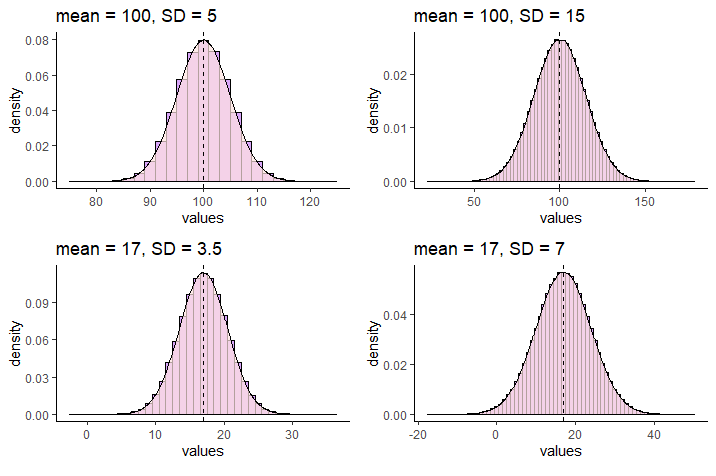

We use special notation to indicate that a distribution is a  Normal Distribution. For instance, for the normal distribution that has a mean of 17 and a standard deviation of 7, we would write:

$N(\mu=17, \sigma^{2}=49)$

which demonstrates that the distribution is approximately normal with a mean of 17 and variance of 49 (which is the standard deviation, 7, squared).


### Standard Normal Distribution

Although normal distributions can have various means or standard deviations, there is one case that we reserve and call the standard normal distribution. This is for the situation where the mean of the distribution is 0 and the standard deviation (and the variance) is equal to 1.


$N(\mu=0, \sigma^{2}=1)$


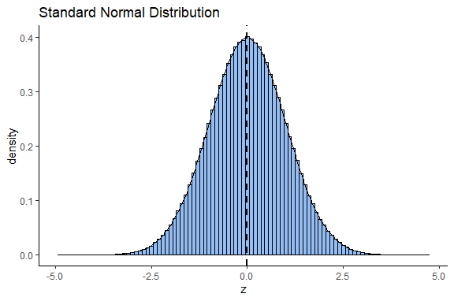

How does the standard normal distribution come about?  We will discuss more about this distribution in section \@ref(normal-distribution), but briefly it is obtained by converting all the values of a normal distribution into z-scores.  z-scores are calculated by:

$\Large z=\frac{x - {\mu}_x}{\sigma_x}$

This standard normal distribution is very useful in statistics because we can precisely calculate the proportion of the distribution that is to the left or right under the curve at any point of it. This principle forms the basis of several statistical tests.


### Skewness and Kurtosis

Above we described that a normal distribution has a skewness of 0 and a kurtosis of 3, but then we just skipped along and didn't really say anything else.  It's important to take a quick step back and think about these two things. 


#### Skewness

We most commonly evaluate skewness for unimodal distributions (those with one peak). The skewness of a distribution can be either negative or positive, or, if it has no skew whatsoever it will be 0.

It is probably easiest to describe skewness by looking at examples. In the picture below, all distributions have a mean of 100 and a standard deviation of 20.  However, they differ in their skewness. The one on the left has a skew of +0.68, the one on the right has a skew of -0.68. The one in the middle has a skew of 0 and is the only one that is normally distributed.


 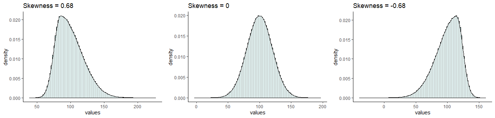


Distributions that have negative skew are also called left skewed because their longest tail extends to the left of the distribution.  Similarly, distributions that have positive skew are called right skewed because their longest tail extends to the right of the distribution.  

Another thing to consider about the skew of the distribution is what happens to the mean, median and mode of the distributions. 

First, let's look at the normal distribution we made earlier in this section that had a mean of approximately 100 and a standard deviation of approximately 5. If we get the median, mode and mean of that distribution, we get the following:

```{r}
mean(x)

median(x)

estimate_mode(x) # R doesn't have a built in mode function, so I'm using this as a proxy


```

We can see here, that all three values are really close to 100.  We can look at this in our plot of the distribution. We've overlaid a red line for the mean, a blue line for the median and an orange line for the mode.  However, they all lie on top of each other at x=100, so it's hard to distinguish them:

```{r}

p + 
  geom_vline(xintercept = median(x), color = "blue", lwd=1)+ 
  geom_vline(xintercept = mean(x), color = "red", lwd=1)+ 
  geom_vline(xintercept = estimate_mode(x), color = "darkorange", lwd=1)

```


Now let's look at some skewed distributions as to what happens to the mode, median and mean in such distributions.


In this dataset, we have 7486 rows of data (observations). Each row is a MLB player. The three numerical columns refer to the career total hits (`totalH`), career total at bats (`totalAB`), and career batting average (`avg`) of each player.


```{r}

bats <- read_csv("data/batting.csv")

nrow(bats)

head(bats)

```


```{r}

#histogram
p1 <- ggplot(bats, aes(x = avg)) + 
  geom_histogram(aes(y = ..density..), 
                 color = "black", 
                 fill = "lightseagreen", 
                 alpha = 0.2,
                 binwidth = .005) + 
  geom_density(colour = 'black', lwd=1) +
  theme_classic() +
  xlab("Career Batting Average")

p1
```

As you can see, this distribution is very negatively (left) skewed. This means that there are many players who have career batting averages between 0.2 and 0.3. There are relatively few players with career averages over 0.3.  There are more averages that are less than 0.2 causing the skew.

We can directly measure the skewness using the `skewness()` function from the `moments` package. We can see that it is highly negatively skewed with a value of -1.01:

```{r, message=FALSE}
library(moments)
skewness(bats$avg) 
```

Let's look at where the median, mean and mode are for this negatively skewed distribution.

```{r}
median(bats$avg)
mean(bats$avg)
estimate_mode(bats$avg)
```

This time, these descriptive values are not equal. The median and mean are lower than the mode. In fact, the mean is lowest of all. 

In negative skewed distributions, the mean and median get pulled towards the skewed tail of the distribution, but the mean gets pulled further.


```{r}
p1 + 
  geom_vline(xintercept = median(bats$avg), color = "blue", lwd=1)+ 
  geom_vline(xintercept = mean(bats$avg), color = "red", lwd=1)+ 
  geom_vline(xintercept = estimate_mode(bats$avg), color = "darkorange", lwd=1)
```


Now let's look at what happens to the mode, median and mean in right skewed distributions. Let's look at the career at-bats of MLB players.


```{r}

#histogram
p2 <- ggplot(bats, aes(x = totalAB)) + 
  geom_histogram(aes(y = ..density..), 
                 color = "black", 
                 fill = "plum", 
                 alpha = 0.2,
                 binwidth = 200) + 
  geom_density(colour = 'black', lwd=1) +
  theme_classic()

p2
```


This distribution is extremely right (positive) skewed. If we measure the skewness we find that the skewness is 1.63. 

```{r}
skewness(bats$totalAB)
```


Now, let's look at the median, mean and mode and plot these on the distribution:

```{r}
median(bats$totalAB)
mean(bats$totalAB)
estimate_mode(bats$totalAB)

p2 + 
  geom_vline(xintercept = median(bats$totalAB), color = "blue", lwd=1)+ 
  geom_vline(xintercept = mean(bats$totalAB), color = "red", lwd=1)+ 
  geom_vline(xintercept = estimate_mode(bats$totalAB), color = "darkorange", lwd=1)

```

In these severely right skewed distribution, we again see that the median and mean get pulled towards the tail of the distribution, with the mean getting pulled even further than the median.  


Let's have a look at a quick summary figure of where the mean, median and mode lie with respect to each other in skewed distributions. As you can see, the mean always gets pulled the furthest to the tail of distributions.The reason for this is that the mean is much more affected by extreme outliers than the median. The median is simply the boundary which divides the top 50% of the data from the bottom 50% of the data. The mean has to include all values in its calculation, so can be largely affected by extreme values more so than the median.


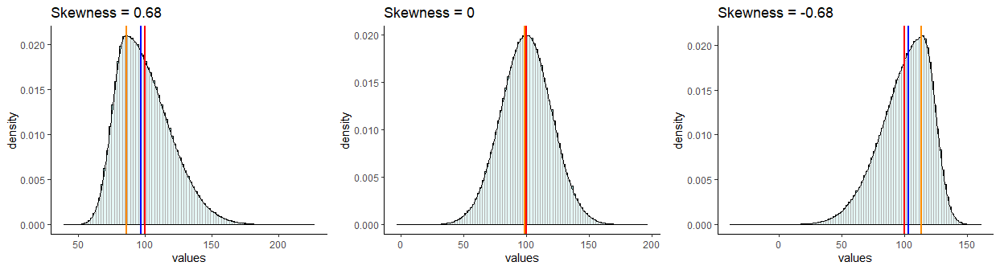
  


<br>

#### Kurtosis

Another measure of the shape of a data distribution is called kurtosis. Kurtosis relates to how heavy or thin the tails of the distribution are. Often people talk about kurtosis being related to how "peaky" the distribution is, because distributions of different kurtosis values often look to have different peaks - but strictly, kurtosis is about the tails.

We can broadly describe three basic patterns of kurtosis. 

*Mesokurtic* - tails are not too thick or too thin - this is the case with the normal distribution.

*Platykurtic* - data is moved more from the center of the distribution to the tails.

*Leptokurtic* - data is taken from the shoulders of the distribution and moved more into the center and slightly to the tails

These are illustrated below:


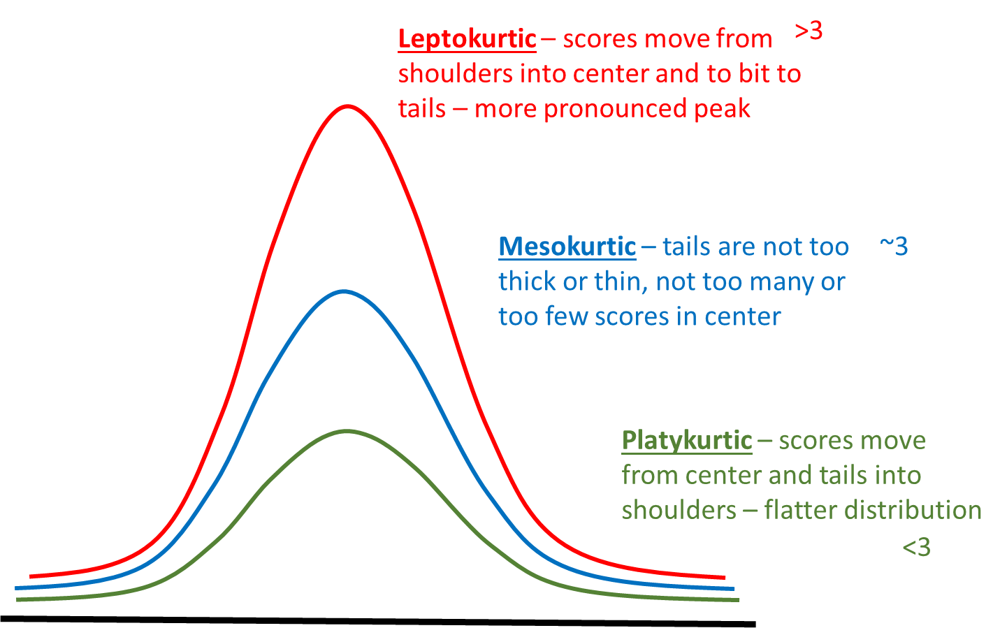

<br>

In addition, to using the above funny names to describe the shapes of distributions, we can also actually calculate a kurtosis value. We won't show the formula here, but effectively the values relate to the patterns as follows.

Mesokurtic distributions have a kurtosis value of approximately 3.

Leptokurtic distributions have a kurtosis value greater than 3.

Platykurtic distributions have a kurtosis value lower than 3.


We can compute this kurtosis value in R using the `kurtosis()` function from the package `moments`.

Both our distributions of total at bats and averages have kurtosis values above 3, indicating that they are leptokurtic - i.e. quite peaky and have less data in the shoulders of the distribution.


```{r}

kurtosis(bats$totalAB)   # >3 = 'peaky' less in shoulders of tails


kurtosis(bats$avg)   # >3 = 'peaky' less in shoulders of tails

```


<br>


Another thing of interest is what happens with small sample sizes. Typically small sample sizes are not that normal - that is they are fairly skewed.  They are also often fairly platykurtic - they have less data in the center and more in the shoulders and tails of the distribution. 

The below shows an example for a sample of 10 scores that come from a normal population of $\mu=100$ and $\sigma=5$.

```{r}
set.seed(10)
x1 <- rnorm(n = 10, mean = 100, sd = 5.0)
x1

skewness(x1)
kurtosis(x1)

```

You can see that this small sample is skewed with a skewness of -0.40 and platykurtic with a kurtosis of 1.85.  


<br><br>

## Z-scores

z-scores are a useful way of comparing different scores in different distributions. As an example, let's look at the two distributions below. On the left we have the population of all Airedale Terriers that is normally distributed with a mean of 60 lbs with a standard deviation of 6 lbs.  On the right we have the population of all Scottish Terriers that is normally distributed with a mean of 20 lbs and a standard deviation of 0.4 lbs.

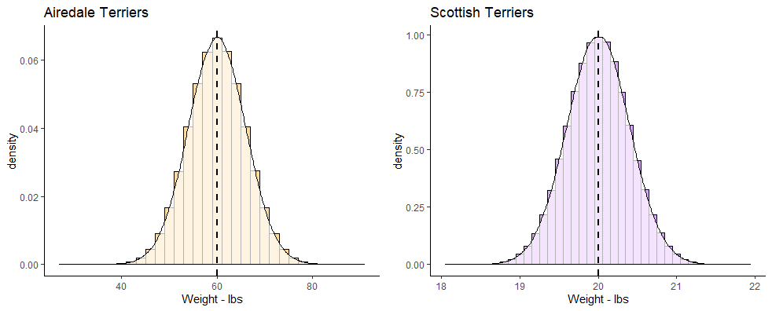 
 
 
 


If you owned an Airedale Terrier that was 65 lbs and a Scottish Terrier that was 20.5 lbs, would you be able to say which one was relatively larger than their breed average?  Both of them are above the mean of their breeds, but by how much?  The Airedale Terrier is (65-60) 5 lbs heavier than the mean of the breed, whereas the Scottish Terrier is only (20.5-20) 0.5 lbs heavier than its breed average.

Looking at things in absolute terms however is misleading. It would be better if we could somehow standardize these differences. This is where z-scores come in.  z-scores enable us to calculate how far any datapoint is from the mean of its distribution by saying how many "standard deviations" away from the mean it is.

Let's look at the Airedale Terrier. Your Airedale is 5 lbs heavier than the mean of 60 lbs. This is a bit less than one standard deviation above the mean, as the standard deviation is 6 lbs.  However, your Scottish Terrier is 0.5 lbs heavier than the mean of 20 lbs, which is a bit more than the standard deviation of 0.4 lbs for that breed.  We can calculate precisely how many standard deviations away from the mean they are using z-scores.  This is the formula:


$\Large z=\frac{x - {\mu}_x}{\sigma_x}$


Using this formula, let's calculate the z-scores for each of our dogs:

```{r}
#Airedale
(65 - 60) / 6

#Scottish
(20.5 - 20) / 0.4

```

The z-score for our 65 lb Airedale is `z=0.83`. The z-score for our 20.5 lb Scottish is `z=1.25`.  This shows us that our Scottish Terrier is actual more standard deviations away from its breed mean than is our Airedale Terrier dog.

We could also plot each of these z-scores on top of the standard normal distribution. Remember, this is the specific case of the normal distribution where the mean of the distribution is 0 and the standard deviation is 1.

Shown below, we've plotted on the top row the breed population histograms with red vertical lines the weights of each of these dogs on their respective population histogram. On the bottom row we have these values converted to their z-scores and still shown with a red line. Each is overlaid on top of a standard normal distribution.


 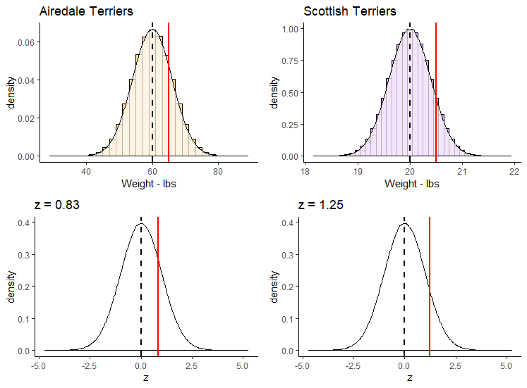 
 
 

z-scores can be very useful ways of standardizing observed values into ways that we can directly compare across different distributions.  If we calculate a negative z-score then it's clear that our observed value is below the population mean, and if we calculate a positive z-score then our value is greater than the population mean. The size of the z-score relates to how many population standard deviations from the mean each value is overall.


### z-scores in samples.

Often we may not know the population mean or standard deviation. In such cases if all we have is a sample mean and a sample standard deviation, we can still calculate z-scores for such samples. We effectively use the same formula to calculate the z-scores, just substituting in the sample mean and standard deviation.

$\Large z=\frac{x - {\overline{x}}}{s_{x}}$


For instance, let's look at the following sample of ages for players on a village cricket team:

```{r}

ages <- c(23, 19, 21, 33, 51, 40, 16, 15, 61, 55, 30, 28)

mean(ages)

sd(ages)
```

These data clearly don't look normally distributed, but we still are able to calculate a mean and standard deviation.  We can also still calculate the z-scores for each age:

```{r}

z <- (ages - mean(ages)) / sd(ages)

z
```

You'll notice that those individuals that have negative z-scores are younger than the mean age of 32.67. Those individuals with positive z-scores are older than the mean age of 32.67.  The largest z-score in terms of magnitude (either in the positive or negative direction) is 1.8.  This person was 61 and was 1.8 standard deviations older than the average age.

Although it's possible to calculate z-scores for any sample, if the sample data come from a normally distributed population then we can use this z-score principle to perform inferential statistics (see xxx.xxx)


### Using z-scores to determine probabilities

One of the great things about the normal distribution, is that we can calculate quite straightforwardly what proportion of the distribution lies under the curve for any distance away from the mean measured in standard deviation. 

With computers, this is a very trivial task to perform, as we'll see shortly. Prior to the computer age, these computations weren't as easy, so we'd often use something called the **empirical rule**. This is basically a framework that tell us what proportion of the distribution lies under the curve at 1$\sigma$, 2$\sigma$, 3$\sigma$, etc. from the mean.

Let's look at the distribution below, which is normally distributed with a mean ($\mu$) of 14 and a standard deviation ($\sigma$) of 4.

The first thing to note is that a normal distribution is perfectly symmetrical, with equal area under the curve on either side of the mean. Therefore, in our example, 50% of the distribution lies below the mean of 14, and 50% of datapoints lie above the mean.

The area colored in green in the distribution represents the area of the distribution that lies $\mu \pm1\sigma$. The area colored in pinky-purple lie between $\mu+1\sigma$ and $\mu+2\sigma$ or between $\mu-1\sigma$ and $\mu-2\sigma$. The area colored in yellow lie between $\mu+2\sigma$ and $\mu+3\sigma$ or between $\mu-2\sigma$ and $\mu-3\sigma$. The blue areas represent the proportion of the distribution that lies beyond $\mu \pm4\sigma$.


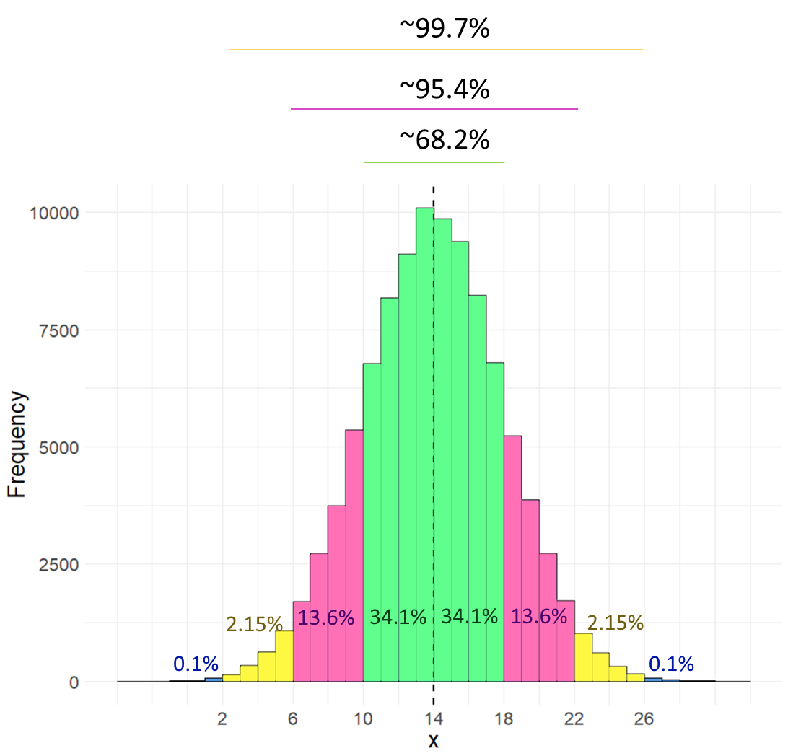{width=90%}

Rather than look at the proportion that lies between two boundaries, often instead we describe the proportion of the distribution that lies to the left of a certain value. The table below shows what proportion of the distribution lie to the left of each value. For instance, in the above distribution $\mu+2\sigma=22$. According to the table below, we have 97.72% of the data/distribution that are to the left of $x=22$.


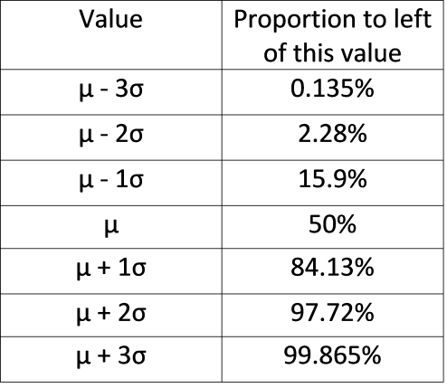{width=50%}


The above table and histogram are obviously useful guides for knowing what proportion of the data exist at certain breakpoints.  But, what if you had a value of $x=17.5$ in the above distribution? What proportion of the data are below this value? 

Well we can actually work this out if we convert our raw scores to z-scores. Once we have a z-score, we can calculate the area to the left of any point on the standard normal curve.  Our value of  $x=17.5$ has a z-score of 0.875, so it is 0.875 standard deviations above the mean.

```{r}
(17.5 - 14) /4
```

Let's look at that on the standard normal curve, with the value $z = 0.875$ represented by the red solid line. We can obtain the area in the distribution to the left of this value that is shaded in light red in R, using the function `pnorm()`.

 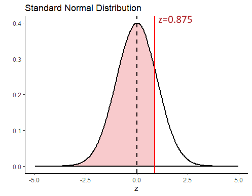

```{r}
pnorm(0.875)
```

This shows us that 80.92% of the distribution lie to the left of $z=0.875$. To get what proportion of the distribution lie to the right of this value, we just subtract it from 1.


```{r}
1 - pnorm(0.875)
```


Let's look at the proportions under the curve to the left of plus or minus 0, 1, 2, or 3 standard deviations from the mean.

```{r}
zvals <- c(-3,-2,-1,0,1,2,3)
pnorm(zvals)

```

Hopefully you can see that these values mirror those in the table provided above.

<br>

#### z-score and probability problems.


Let's take this a little further with some small examples.


**Example 1**


Let's assume that the weights of pineapples are normally distributed with a mean of 1003.5g and a standard deviation of 35g. You bought a random pineapple and it turned out to only be 940g. What proportion of pineapples are less than 940g?  How unlucky did you get to buy such a small pineapple?

First, let's take a look at the population distribution of pineapples with $\mu=1003.5$ and $\sigma=35$. Our pineapple is 940g and is shown with the solid red line below. As our distribution is normal, if we convert this to a z-score we can compare it to where z is in the standard normal distribution on the right.

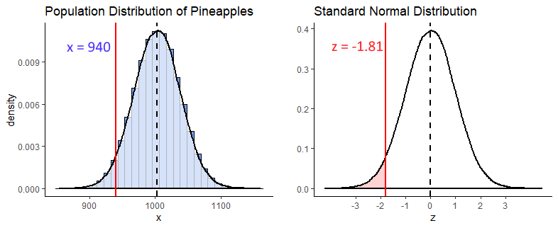

```{r}
(940 - 1003.5) / 35
```

So we calculated that $z = -1.81$, and we visualize that on our standard normal distribution. We're interested in what proportion of pineapples from the distribution are 940g or less. That is the light red shaded area.  To calculate that we can just use `pnorm()` in R:

```{r}
pnorm(-1.81)
```

From this we can see that only 3.5% of pineapples are less than 940g. We got super unlucky to get such a tiny pineapple.


**Example 2**

What is the probability of getting a pineapple of greater than 1050g ?  

To answer this we first get the z-score for a pineapple of 1050g, and find that $z = 1.33$.

```{r}
(1050 - 1003.5) / 35

```

Next we recognize that if we're interested in what proportion of pineapples weigh more than 1050g, we need to know what proportion of the standard normal curve is greater than  $z = 1.33$ (the shaded light red area below).


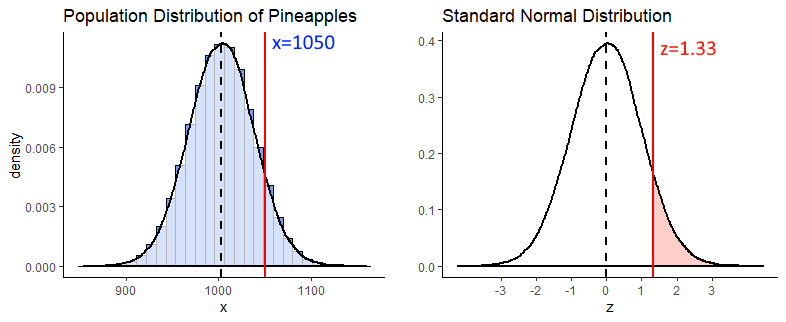

We can calculate that by using `pnorm()` to figure out what proportion is to the left of  $z = 1.33$, and then subtract that from 1 to get what proportion is to the right.

```{r}
1 - pnorm(1.33)   #0.003  (so 9.18% chance)

```


**Example 3**

What is the probability of getting a pineapple between 950g and 1045g  ?

For this question, we're interested in the shaded light red area between $z = x$ and $z = z$ on the standard normal curve. Why these z-values? Because these are the z scores you get if you convert a 950g and a 1045g pineapple to z scores.


```{r}
z1 <- (950 - 1003.5)  / 35
z2 <- (1045 - 1003.5)  / 35

z1 #-1.53
z2 #1.19

```

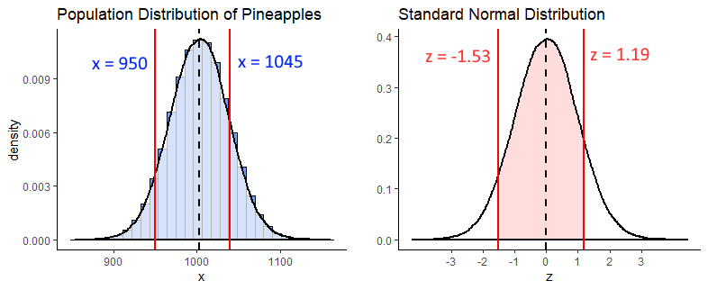

In R we can calculate the proportion to the left of each of these z-scores using `pnorm()`. What we need is the shaded area, which we can get if we subtract the area to the left of $z = -1.53$ from the area to the left of $z = 1.19$. We do it like this:

```{r}
## get proportion of curve to left of each z-score

pnorm(z1) # 0.06

pnorm(z2) # 0.88

# so the area between them is:

pnorm(z2) - pnorm(z1)  #0.82

```

So, 82% of the distribution lie between 950g and 1040g.


<br><br>


## What is a Sampling Distribution ?

Another type of distribution that we will discuss a lot! is the sampling distribution. There are different types of sampling distributions, so for now we'll focus on the **sampling distribution of the sample means**.  The best way to illustrate a sampling distribution, is to show it by example.

Say we have a population of 1 million adult Archerfish. The population mean of their bodylength is $\mu = 100.0mm$, and the population standard deviation is $\sigma = 15.0mm$.

Let's create this population:

```{r}
set.seed(3)

archerfish <- rnorm(n = 1000000, mean = 100, sd = 15)

mean(archerfish)

sd(archerfish)

```

Let's also plot what this normally distrusted population looks like by making a histogram:

```{r}
# histogram of the population:

ggplot(data.frame(archerfish), aes(x = archerfish)) + 
  geom_histogram(color='black', fill='#f584ed', alpha=.5, binwidth =2) +
  theme_classic() +
  xlab("Body Length mm") +
  ylab("Frequency") +
  ggtitle("Body Sizes of 1 million Archerfish") +
  geom_vline(xintercept = 100.0, lwd=1, color='black')

```


OK, let's say that you didn't have the time to go out and catch 1 million archerfish and measure the body length of every single fish. What should you do? One thing you might decide is to just go and take a random sample of 10 archerfish (you could have picked another sample size - let's just stick with 10 for now). Once you have your sample of 10 archerfish, you could then measure them and you will be able to calculate the sample mean of that sample.

We'll use `sample()` to randomly select 10 archerfish.

```{r}
set.seed(1) # so we all get the same sample.
samp1 <- sample(archerfish, 10, replace = T)  

samp1

mean(samp1)
```

Our sample mean is $\overline{x}=95.6$ - that's fairly close to the actual population mean of 100.0mm.  Let's grab another three samples of 10 archerfish and see what the sample means are of those sample:


```{r}

mean(sample(archerfish, 10, replace = T))  # mean of our 2nd sample

mean(sample(archerfish, 10, replace = T))  # mean of our 3rd sample

mean(sample(archerfish, 10, replace = T))  # mean of our 4th sample

```

These next three samples are closer to 100.0, with one just above and two just below 100.


What would happen if we collected thousands and thousands of samples of size 10?  Let's do it - you don't need to follow the exact code here of how we're doing this, but essentially we're grabbing 20,000 samples of size 10. From each of these we're getting the sample mean. That means we'll end up with 20,000 sample means. We're storing those results in the object called `res`.

```{r}
### What if we were to collect 20,000 samples and for each one get the mean

results<-vector('list',20000)
for(i in 1:20000){
results[[i]]  <- mean(sample(archerfish, 10, replace = T))  
}

res <- unlist(results)
```


Now we have our 20,000 sample means we could make a histogram of these sample means.

```{r}
psd <- ggplot(data.frame(res), aes(x = res)) + 
  geom_histogram(color='black', fill='#4adbe0', alpha=.5, binwidth = 1) +
  theme_classic() +
  xlab("Mean Body Length of each sample - mm") +
  ylab("Frequency") +
  ggtitle("Sampling Distribution of Sample Means for n=10") +
  geom_vline(xintercept = mean(res), lwd=1)

psd

```

This distribution that we've just plotted is the **sampling distribution of sample means for samples of size n=10**.  We picked 20,000 as the number of samples of size 10 to collect as it's reasonably large enough to get enough sample means that we can see the shape of the distribution. We could have picked 100,000 samples to collect, or 1,000,000... in fact the more the better, but 20,000 is enough to get the point across.

Out of all of these sample means that we "collected", what is the average across all of the 20,000 samples? - and what's more, what is the standard deviation of that distribution?

```{r}
mean(res)

sd(res) #standard deviation of the sampling distribution, aka standard error

```


Let's first focus on the mean.  Our mean of sample means was 99.996, which is very approximately the same as the mean of 1,000,000 archerfish in the population!  It turns out that the mean of the sampling distribution is approximately equal to the population mean.  By the way, the notation that we use to depict the mean of the sampling distribution of sample means is  $\mu_{\overline{x}}$.  So $\mu_{\overline{x}} = 100.0$.


What is the standard deviation of this distribution (the sampling distribution of the sample means)?  We just calculated it in R to be 4.77.  The notation we use for this is $\sigma_{\overline{x}} = 4.77$. It's called the standard deviation of the sampling distribution of sample means, but for short it gets called the **standard error**.

Of course, we never in reality actually collect thousands and thousands of samples - that defeats the point of sampling. If we had time to collect thousands and thousands of samples, we may as well just measure every archerfish in the population.  Usually, we just collect one sample. In later sections, we'll discuss how you can estimate what $\mu_{\overline{x}}$ and $\sigma_{\overline{x}}$ are when you have only collected one sample. 

However, given we already know the population standard deviation of the 1 million archerfish is $\sigma=15$, we can calculate the standard deviation of the sampling distribution of sample means for any sample size. It is calculated using the formula:


$\Large \sigma_{\overline{x}} = \frac{\sigma}{\sqrt{n}}$

So in our case it should be equal to:

```{r}

15/sqrt(10) # 4.74

```

As you can see this is very close to the value that we got in our simulated sampling distribution above.

<br>

### Sample Size and the Sampling Distribution

In the previous section we looked at what would happen if we took samples of size 10 from our archerfish population and looked at the sample means of each sample. We found that when we made a histogram out of these sample means, that the mean of the sample means  $\mu_{\overline{x}}$ was approximately equal to the population mean of 100. The standard deviation of the sampling distribution of sample means, or standard error, $\sigma_{\overline{x}}$ was approximately equal to 4.74.


What happens if we were to take a different sized sample each time - say size 50? What would be the mean and standard deviation of this distribution of sample means?  Let's find out. We'll again take 20000 samples of size 50 at random from our population of 1 million archerfish. For each sample we'll record the sample mean length of the 50 fish. We'll end up saving these 20,000 sample means in an R object called `res1`. Again, don't worry about how the code is doing it here, just as long as you follow what we're doing.


```{r}

# ok, get 20,000 samples of size 50
results1<-vector('list',20000)
for(i in 1:20000){
  results1[[i]]  <- mean(sample(archerfish, 50, replace = T))
}

res1 <- unlist(results1)

```


Now we have our 20,000 samples, let's plot the histogram

```{r}
psd2 <- ggplot(data.frame(res1), aes(x = res1)) + 
  geom_histogram(color='black', fill='#4adbe0', alpha=.5, binwidth = .5) +
  theme_classic() +
  xlab("Mean Body Length of each sample - mm") +
  ylab("Frequency") +
  ggtitle("Sampling Distribution of Sample Means for n=50")+
  geom_vline(xintercept = mean(res1),lwd=1)

psd2


```

If we look at the mean and standard deviation of this sampling distribution, we get the following values:

```{r}
mean(res1)  # still same as population mean

sd(res1)    # smaller with larger sample size
```

The mean of the sampling distribution of sample means $\mu_{\overline{x}}$ is still a very good estimate of the population mean.

The biggest difference is in the standard deviation of the sampling distribution,  $\sigma_{\overline{x}}$ (the standard error), which is much lower than when we had samples of size 10.  The reason for this is that the variability in our sample means is much more reduced when we have samples of size 50. On average, our sample means are much closer individual estimates to the population mean. This is what drastically reduces the standard deviation of this sampling distribution.

We could have calculated the standard error directly using the formula provided earlier, because we already know the population standard deviation. When we use that formula we get 2.12, almost the same standard deviation as we got with our simulated sampling distribution:

```{r}
15 / sqrt(50)
```


Let's directly compare the two sampling distributions for the two different sample sizes. We adjusted the x-axis so it is the same for both figures, so you can see the change in the standard deviation between the two sample sizes:

```{r, echo=FALSE, message=FALSE, warning=FALSE}
library(gridExtra)
grid.arrange(
psd + xlim(75,125) + ggtitle("Sample Size = 10"),
psd2 + xlim(75,125)+ ggtitle("Sample Size = 50"),
nrow=1)
```


<br><br>


## Central Limit Theorem

In the previous section we discovered that if you take many, many samples from a normally distributed population and calculated the sample mean of each sample, that you would get a sampling distribution of sample means. We also saw that that sampling distribution was normally distributed with a mean $\mu_{\overline{x}}$  that was approximately equal to the population mean, and a standard deviation $\sigma_{\overline{x}}$   that was equal to the population standard deviation divided by the square root of n $\Large \sigma_{\overline{x}} = \frac{\sigma}{\sqrt{n}}$.

Is it just coincidence that both the population distribution and the sampling distribution was approximately normally distributed?  What we will learn in this chapter is that it does not matter at all what the population distribution is - if we take thousands of samples from **any** shaped distribution and calculate the sample mean of each sample, when we create the histogram of those sample means we will find that they are approximately normally distributed.  This is what we refer to as the **central limit theorem**.  Further, the larger the sample size that we take, the closer to a normal distribution the sampling distribution becomes.

Let's look at this by taking samples from various different population distributions.

<br>

**Uniform Distribution**

First we'll look at a uniform distribution of 1 million numbers between 0 and 75. You might like to think of this as the distance of trees from the center of a forest in km. Let's graph the distribution and calculate the mean and standard deviation.

```{r}
set.seed(1)

#get data from uniform distribution
x1 <- runif(1000000, min = 0, max = 75)

# histogram
ggplot(data.frame(x1), aes(x = x1)) + 
  geom_histogram(color='black', 
                 fill = "#894ae0", 
                 alpha=.3, 
                 binwidth = 5,
                 boundary = 0) +
  theme_classic() +
  xlab("Distance from Center of Forest km")


### Population Mean & SD
mean(x1)  #37.5

sd(x1) #21.6

```

We can see that the mean of this population is 37.5, and the population standard deviation is 21.6.

Let's take samples of size 30 at random from this population of 1 million.  For each sample, we'll calculate the sample mean. We'll take 10,000 samples (again - we could have picked any really large number here, but 10,000 seems reasonable enough to prove our point). After we get our 10,000 sample means from samples of size 30, we'll plot the histogram of those sample means.

```{r}
## Let's get 10,000 samples of size 30

results<-vector('list',10000)
for(i in 1:10000){
  results[[i]]  <- mean(sample(x1, 30, replace = T))  
}

res <- unlist(results)


# This is the sampling distribution.
ggplot(data.frame(res), aes(x = res)) + 
  geom_histogram(color='black', fill='#894ae0', alpha=.5, binwidth = 1) +
  theme_classic() +
  geom_vline(xintercept = mean(res), lwd=1) + 
  xlab("Mean of each sample") +
  ylab("Frequency") +
  ggtitle("Sampling Distribution of Sample Means for n=30")

  
```

This histogram represents our sampling distribution of sample means when we took samples of size 30 from a uniform distribution.  Hopefully you notice that it is approximately normally distributed - even though the original population was uniformally distributed! Let's calculate the mean and standard deviation of this sampling distribution:

```{r}
mean(res)  # the mean of the sample means is close to 37.5, the population mean

sd(res)  #3.996 - this is a lot smaller than the population SD
```

The mean of our sampling distribution $\mu_{\overline{x}} = 37.5$ which is again approximately equal to the population mean. The sampling distribution standard deviation $\sigma_{\overline{x}} = 3.99$ which is a lot lower than the original population standard deviation. Because we only took 10,000 samples, these values aren't exact, but we could have calculated the standard error by taking the population standard deviation and dividing by the square root of n $\Large \sigma_{\overline{x}} = \frac{\sigma}{\sqrt{n}}$ as follows:


```{r}
sd(x1)/sqrt(30)  # standard error.
```

You'll notice that this calculated value is very close to the one we estimated by running our simulation.

<br>


**Skewed Distributions**

We can see that the central limit theorem holds true for skewed distributions also. Here, we have a population of 1 million charity donations. Let's draw a histogram of the population distribution and calculate the mean and standard deviation of the population.

```{r}
set.seed(1)
# e.g. Donations to a charity (in $s)

q <- rnbinom(1000000, 5, .4)

# histogram
ggplot(data.frame(q), aes(x = q)) + 
  geom_histogram(color='black', 
                 fill = "#1ad665", 
                 alpha=.3, 
                 binwidth = 1,
                 boundary = 0) +
  theme_classic() +
  xlab("Charity Donation in $")


### Population Mean
mean(q)  #7.5

sd(q)  #4.33
```

It is clear that this population distribution is highly positively skewed. The mean of the population is 7.5 and the standard deviation is 4.33.

In the following code we takes samples of size 30 and calculate the sample mean of each sample. This time, we'll collect 50,000 samples, just to be a bit different.

```{r}
results<-vector('list',50000)
for(i in 1:10000){
  results[[i]]  <- mean(sample(q, 30, replace = T))  
}

res <- unlist(results)


### Let's Draw this as a histogram.

ggplot(data.frame(res), aes(x = res)) + 
  geom_histogram(color='black', fill='#31e8d0', alpha=.5, binwidth = .1) +
  theme_classic() +
  geom_vline(xintercept = mean(res), lwd=1) + 
  xlab("Mean of each sample") +
  ylab("Frequency") +
  ggtitle("Sampling Distribution of Sample Means for n=30")

```


So, it happened again.  This is our sampling distribution of sample means, collected from samples of size 30 from a highly skewed distribution. But once again, the sampling distribution is approximately normally distributed. It might not be perfectly normally distributed, but it is close to being normal. We can calculate the mean and the standard deviation of this sampling distribution:


```{r}
mean(res)  # the mean of the sample means is close to 7.5

sd(res)  #0.799
```

$\mu_{\overline{x}} = 7.5$ which is once again approximately equal to the original population mean. The sampling distribution standard deviation $\sigma_{\overline{x}} = 0.799$. We could have directly calculated that using the formula for the standard error, n $\Large \sigma_{\overline{x}} = \frac{\sigma}{\sqrt{n}}$, as we know the original population standard deviation:

```{r}

sd(q)/sqrt(30)  # standard error = 0.791

```


We could keep going with even more types of population distributions. We would find the same thing over and over again. If we take many samples from each population and calculated the sample means of all samples, they would form an approximately normally distribution. This will be especially true for larger samples. This is the basis of the central limit theorem.  In the following sections we'll learn more about what we can do with these sampling distributions.


<br><br>


## Sampling distribution problems

We can use our knowledge of sampling distributions and z-scores to determine how likely or unlikely we are to observe any one particular sample mean.

Let's use an example to illustrate this.


<p style="color:blue">Q. Say the weight of chicken eggs is normally distributed with mean 60g and standard deviation of 3g. What is the probability of getting a batch of a dozen eggs that have a mean of less than 58g ?</p>

The way to think about these questions is to recognize that we're dealing with a sampling distribution. We're really being asked what proportion of the sampling distribution is less than a sample mean of 58g, when your sample size is 12 (a dozen).

First, let's plot the population of chicken eggs and then the sampling distribution of samples means for a sample size of 12.

```{r, warning=FALSE, message=FALSE}
set.seed(1) # so you get the same values as my script


### First, I'll make some plots of the 'population' and 'sampling distribution'


## Population
x <- rnorm(1000000, mean = 60, sd = 3)

p1 <- ggplot(data.frame(x), aes(x = x)) +
  geom_histogram(color='black', fill='mistyrose', alpha=.4)+
  geom_vline(xintercept = 60, lwd=1) +
  ggtitle("Population of chicken eggs") +
  theme_classic() +
  xlab("Weight")


## Sampling Distribution of sample means with Sample size of 12 (a dozen).

results<-vector('list',10000)
for(i in 1:10000){
  results[[i]] <- mean(sample(x, 12, replace = T))
}

res <- unlist(results)

p2 <- ggplot(data.frame(res), aes(x=res)) +
  geom_histogram(color="black", fill='lightseagreen', alpha=.4)+
  geom_vline(xintercept = mean(res),lwd=1) +
  ggtitle("Sampling Distribution of Sample Means") +
  theme_classic() +
  xlab("sample mean")

library(gridExtra)
grid.arrange(p1,p2,nrow=1)

```


What are the mean and standard deviation of this sampling distribution of sample means? Well, $\mu_{\overline{x}} = 60$ because that's the population mean, and we know the mean of the sample means is approximately the same. We know we can calculate $\sigma_{\overline{x}}$ because we know the population standard deviation $\sigma$.

Again, the formula is $\Large \sigma_{\overline{x}} = \frac{\sigma}{\sqrt{n}}$. Therefore, the standard deviation of the sampling distribution is $\sigma_{\overline{x}} = 0.87$:

```{r}
sem <- 3 / sqrt(12)

sem

```


Now, we're interested in a sample of 12 that has a sample mean of 58g.  Let's visualize what that looks like on the histogram of the sampling distribution:

```{r, warning=FALSE, message=FALSE}
p2 + geom_vline(xintercept = 58, lty=2, lwd=1, color="red") +
  ggtitle("Sampling Distribution of Sample Means \n for sample size = 12")
```

Because we know the mean and standard deviation of this distribution, we can actually calculate the sample mean of 58g as a z-score. Doing this we find that $z  = -2.31$, which means that a sample mean of 58g is 2.31 standard deviations below the mean.

```{r}
# so, 58g as a z-score is...

z <- (58 - 60) / sem  # -2.31

z

```

The original question asked what probability there was of getting a sample mean of less than 58g. This is basically what area is under the curve of the above sampling distribution to the left of the 58g sample mean. Because we converted that sample mean of 58g to a z-score of -2.31, we can look at that value on a standard normal curve. The area we are interested in is the filled in area to the left of z = -2.31:

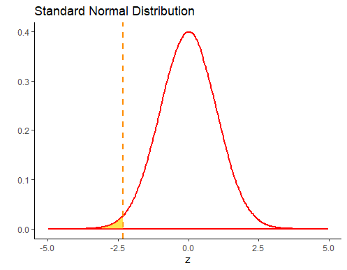

We can look up this value in R, using the function `pnorm`. 

```{r}
pnorm(z)  # prob = 0.010
```

So we can see that the probability of getting a sample mean of lower than 58g is `p=0.0105`.


<br><br>


## The t-distribution

Another distribution that is important to know about is the t-distribution. Like the normal distribution, this is a symmetrical distribution, but it has slightly fatter tails than the normal distribution. 

The t-distribution comes up most commonly in sampling distributions. In particular, although the central limit theorem prescribes that sampling distributions are approximately normal, it is known that often they aren't approximately normal enough, and instead they follow a t-distribution shape.

An important detail about the t-distribution is that there are actually several t-distributions. There are  different t-distributions for different degrees of freedom. These differ slightly in how heavy the tails of the distribution are. The degrees of freedom are usually related to the sample size minus one or two (depending upon the test being employed - see sections \@ref(one-sample-t-tests) and \@ref(theory-behind-student’s-t-test).  The higher the degrees of freedom, the more closely the t-distribution looks like a normal distribution.  You can see this in the image below. The standard normal distribution is in black, and the t-distribution is in red. Each panel shows a different t-distribution. As the degrees of freedom increase, the t-distribution essentially becomes the normal distribution. At lower degrees of freedom, there is a lot more difference between the t-distribution and the normal distribution in the tails.

 


