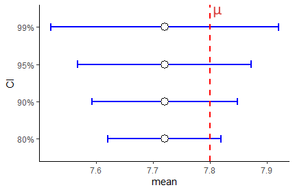

# Confidence Intervals


When we collect a sample, we typically calculate a sample mean $\overline{x}$. We use this as our estimate of the real population mean $\mu$, as this is unknown to us typically.  If we were to collect another sample, we would most likely get a sample mean $\overline{x}$ that is slightly different to the first one, but would also be an estimate of the population mean $\mu$. 

Given that we are not completely sure of what the population mean $\mu$ is, or how close our sample mean  $\overline{x}$ is to that population mean, one thing that we like to do is to put confidence limits around our sample mean estimate. The confidence interval gives us a range of values which likely contains our population mean.  In essence, a confidence interval can be considered to be a margin of error around our sample mean estimate.

In this course, we use two separate approaches to calculate confidence intervals around a sample mean  $\overline{x}$. The first method uses the $z$-distribution to generate the confidence interval. The second method uses the $t$-distribution. In practice, we almost always use the $t$-distribution when doing this. In fact, the only time we really use the $z$-distribution is when teaching introductory stats. The reason for this, is that learning how to make a confidence interval using the $z$-distribution is a good stepping stone to using the $t$-distribution. Technically, we can use the $z$-distribution to calculate the confidence interval when we know the population standard deviation $\sigma$ and our sample size is relatively large.  However, we almost never know $\sigma$, and so that's why in practice we use the $t$-distribution.

We'll start this chapter by talking about the relationship between the sampling distribution and confidence intervals. Then we'll describe how to use both the $z$- and $t-$distributions to generate confidence intervals.


## Sample means as estimates.

Let us imagine we have a population of butterflies and we're interested in their wingspan. The population is normally distributed with a population mean $\mu = 7.8cm$, with a population standard deviation $\sigma = 0.3cm$.  This is what this population distribution looks like:

```{r, message=FALSE,warning=FALSE}
set.seed(1)
x <- rnorm(100000, mean = 7.8, sd = 0.3)
library(tidyverse)
p1 <- ggplot(data.frame(vals=x),aes(vals))+
  geom_histogram(aes(y = ..density..), color = "black", fill = "purple", alpha=.4, binwidth = 0.05) + 
  geom_density(alpha = 0.7, fill = "mistyrose") + 
  theme_classic() +
  xlab("Wingspan cm")+
  geom_vline(xintercept = 7.8, color='black',lwd=1)
p1
```


Now, let's collect samples of size $n=15$.  Here's one sample, and it's sample mean $\overline{x}$:

```{r}
samp1 <- sample(x, size = 15, replace = T)
samp1
mean(samp1)
```

Our observed sample mean is $\overline{x}=7.71$ which is close to the population mean of $\mu=7.8$.  But if we were to collect another sample, then that sample mean will be slightly different. Let's do it again:

```{r}
samp2 <- sample(x, size = 15, replace = T)
samp2
mean(samp2)
```

This time our sample mean (our estimate) is $\overline{x}=7.81$ which is very close.

If we did this thousands of times, then we'd get our sampling distribution of sample means (see section \@ref(normal-distribution)). This is what our sampling distribution for sample sizes of $n=15$ looks like:

```{r}
#get sample means for sampling distribution
results<-vector('list',100000)
for(i in 1:100000){
results[[i]]  <- mean(sample(x, 15, replace = T))  
}

res <- unlist(results)

p2 <- ggplot(data.frame(res), aes(x = res)) + 
  geom_histogram(aes(y = ..density..), color = "black", fill = "#4adbe0", alpha=.4, binwidth = 0.01) + 
  geom_density(alpha = 0.7, fill = "ghostwhite") + 
  theme_classic() +
  xlab("Sample Mean") +
  ylab("Frequency") +
  ggtitle("Sampling Distribution of Sample Means for n=15") +
  geom_vline(xintercept = mean(res), lwd=1)

p2
```


According to Central Limit Theorem, this sampling distribution is approximately normally distributed. The mean of this sampling distribution is $\mu_{\overline{x}}=7.8$ which is the same as the population mean $\mu$. The standard deviation of this sampling distribution $\Large \sigma_{\overline{x}} = \frac{\sigma}{\sqrt{n}}$.

```{r}
0.3 / sqrt(15)
```

Therefore the standard deviation of this sampling distribution is $\sigma_{\overline{x}} = 0.077$.


Remember, this sampling distribution represents thousands and thousands of potential means from individual samples of size 15 that we could have collected. Each one of them in isolation would be our point estimate of the true population mean $\mu$. Sometimes we'll be really close to the true population mean, and other times we might be quite far away. This is why we like to put confidence intervals around our sample means, to give a range of values that likely contain our population mean.


One thing we can do first is to think about this - between which two values on the sampling distribution shown above would 95% of the data lie?  That is the same as asking, which two values represent the part where 2.5% of the distribution is in each tail (leaving 95% in the middle).  To answer this, we just need to remember that according to Central Limit Theorem that our sampling distribution is normally distributed. Therefore we can use the standard normal curve.

According to the standard normal distribution, the values of `z` that leave 2.5% in each tail are $z=-1.96$ and $z=1.96$. That means values that 95% of the distribution lie between 1.96 standard deviations below and above the mean.


If you didn't want to take our word for it that +1.96 and -1.96 are the values of `z` that leave 2.5% in each tail, you could also directly calculate it in R:

```{r}
qnorm(c(0.025, 0.975)) # get the values of z that are the boundaries of 2.5% to the left, and 97.5% to the left.
```


So if we go back to thinking about our sampling distribution - because we say it is approximately normally distributed, 95% of the distribution will also lie between 1.96 standard deviations below and above the mean.  We know that the mean of the sampling distribution is $\mu_{\overline{x}=7.8}$ and the standard deviation of the sampling distribution is $\sigma_{\overline{x}} = 0.077$, as we calculated it above.  Therefore, we can use this to calculate which sample mean values in the distribution are 1.96 standard deviations either side of the mean.  They are:

```{r}
7.8 +  (1.96 * 0.077)

7.8 -  (1.96 * 0.077)
```

So, 95% of our sample means in our sampling distribution lie between 7.65 and 7.95. That area is represented by the shaded red area on our sampling distribution below:


What we have just done is the basic principle behind a confidence interval using a $z$-distribution. Let's look at this in more detail.

<br>

## Calculating a confidence interval with z-distribution

Let's go back to our first sample of size 15 that we collected, with $\overline{x}=7.71$.  

```{r}
samp1
mean(samp1)
```

What we want to do now is put a confidence interval around 7.71. We want to say that our population mean is equal to $7.71 \pm margin.of.error$  The actual formula for the $z$-distribution confidence interval is:

$\Large CI_{95\%} = \overline{x} \pm z \times \frac{\sigma}{\sqrt{n}}$

In this scenario, we are presuming that we don't know what the population mean $\mu$ is - that's why we're building a confidence interval. Consequently, we also don't precisely know what the mean of the sampling distribution $\mu_{\overline{x}}$ is.  What we'll do instead, is to *assume* that our sample mean $\overline{x}$ is the mean of the sampling distribution $\mu_{\overline{x}}$.  We already know what the standard deviation of the sampling distribution $\sigma_{\overline{x}}$ is because we know the population standard deviation $\sigma$ is.  So, $\Large \sigma_{\overline{x}} = \frac{\sigma}{\sqrt{n}}$.

What value of $z$ should we use?  The short answer is 1.96 for the same reasons as above. If our sampling distribution is normally distributed, then we want to know the values that are $\pm 1.96$ of the sample mean $\overline{x}$.


So, let's just do it - this is how we calculate the 95% confidence interval if we have $\overline{x}$, $\sigma$ and $n$.

```{r}
x_bar <- mean(samp1)  # sample mean = 7.71
x_bar

n <- length(samp1)  # sample size =  n = 15
n

sigma <- 0.3  # the pop SD given in the example

sem <- sigma/sqrt(n) # standard error of the mean (SD of sampling distribution)
sem

z <- 1.96  # the value of 'z' we need to get the middle 95% of the distribution
```


```{r}
# margin of error
z * sem

# upper bound of confidence interval
x_bar + (z * sem)


# lower bound of confidence interval
x_bar - (z * sem)

```

We have just calculated our 95% confidence interval! It has a lower bound of 7.56cm and an upper bound of 7.86cm.  We can write this confidence interval in two ways:

$CI_{95\%} = 7.71 \pm  0.152$

$CI_{95\%} = 7.71 [7.56, 7.86]$


Below is a graphical representation of our confidence interval around our sample mean $\overline{x}$. You can see that the true population mean $\mu$ is within the confidence interval.


Remember we collected a second sample that had a sample mean $\overline{x}=7.81$ ?

```{r}
mean(samp2)
```

We could also create a 95% confidence interval for our estimate of the population mean $\mu$ using this sample mean $\overline{x}$. We just use the same formula:

```{r}
# upper bound of confidence interval
7.87 + (z * sem)


# lower bound of confidence interval
7.87 - (z * sem)

```

$CI_{95\%} = 7.81 \pm  0.152$

$CI_{95\%} = 7.81 [7.72, 8.02]$


Let's compare this confidence interval with the first one we created:


Note that both include the true population mean of 7.8 in their confidence interval. 

What if we collected 25 new samples, and calculated 25 sample means, and made 25 confidence intervals?  Well, the chart below shows 25 95% confidence intervals collected from samples of size 15 selected at random from our population of butterflies:


First, notice that the margin of error is equal for all of our confidence intervals around the sample means. This is because we are using the same value of $\sigma$ and same value of $z$ for all of these confidence intervals.  Secondly, you'll notice that not all the confidence intervals include the population mean $\mu$. Two of them - highlighted in green - do not include the population mean. In this sense, our sample mean and associated confidence interval is not doing a terrific job of estimating the population mean.  

Actually, it turns out that if you collect enough samples and generate enough sample means, then you *will capture* the population mean within your confidence interval 95% of the time. So roughly 5 out of every 100 confidence intervals you make from samples will not include the population mean.  

Technically, this is the definition of a 95% confidence interval. That is, in 95% of your samples you will include the true population mean. However, when talking about confidence intervals in lay-speak, when we have our one confidence interval around our one sample mean e.g. $CI_{95\%} = 7.72 [7.568, 7.871]$, we often say *"there's a 95% chance that the true population mean is between 7.568 and 7.871*. This is technically lazy shorthand although it does kind of help us understand the point of a confidence interval. But, please remember, the real definition is that in 95% of samples we'll include the true population mean in our samples.


**Assumptions** We should also briefly just remark on what the assumptions are when generating these $z$-distribution based confidence intervals. We are assuming that our data are normally distributed and that our sample is randomly drawn from the population, and that all data points are independent of each other.


<br>

### Other Confidence Intervals ranges

We can actually construct confidence intervals for any % value. Most commonly people make 95% confidence intervals, but other common ones include 80%, 90% and 99% confidence intervals.  These have the same interpretation as the 95% CI. For instance, a 99% confidence interval means that if you were to take 100 samples from a population and calculate 99% confidence intervals for each, only 1 out of a 100 on average would not include the true population mean $\mu$.

The formulas for each of these confidence intervals when using the $z$-distribution are as follows:

$\Large CI_{80\%} = \overline{x} \pm 1.28 \times \frac{\sigma}{\sqrt{n}}$

$\Large CI_{90\%} = \overline{x} \pm 1.64 \times \frac{\sigma}{\sqrt{n}}$

$\Large CI_{95\%} = \overline{x} \pm 1.96 \times \frac{\sigma}{\sqrt{n}}$

$\Large CI_{99\%} = \overline{x} \pm 2.58 \times \frac{\sigma}{\sqrt{n}}$


Where did each of these different numbers come from for $z$ ?  Well, if we wish to make a 99% CI, we need to know what values of $z$ are the boundaries that leave 99% of the distribution inside them on the standard normal curve. We exclude 0.5% in each tail.  Likewise, for the 80%CI, we want to know the values of $z$ that leave 5% in each tail and 10% in the middle.  We can calculate these values in R like this:

```{r}

qnorm(.9)# for 80% CI

qnorm(.95)# for 90% CI

qnorm(.975)# for 95% CI

qnorm(.995)# for 99% CI

```


So, if we were to calculate the 80% confidence interval for a sample with a sample mean of $\overline{x}=7.72$, we would do:


```{r}
#margin of error
1.281552 * sem

# upper bound of confidence interval
7.72 + (1.281552 * sem)


# lower bound of confidence interval
7.72 - (1.281552 * sem)

```

Our 80% confidence interval is:

$\Large CI_{80\%} = 7.72 \pm  0.099$

$\Large CI_{80\%} = 7.72 [7.620, 7.819]$


The figure below shows the CIs that we would create using each of these different values of $z$ for 80%, 90%, 95% and 99% CIs for a sample of size 15 with a sample mean of $\overline{x}=7.72$.

Clearly, confidence intervals widen with higher percentages. This makes sense, because out of 100 samples, with a 99% CI we'd expect only one confidence interval out of 100 to not include the true population mean, but with a 80% CI we'd expect 20/100 CIs not to include the true population mean.




Let's look at this same figure, but this time for a sample that has an sample mean $\overline{x}=7.95$:


As you can see here, this time the 90% and 80% CIs do not include the true population mean $\mu$. We increase the chances of including the true population mean $\mu$ inside our confidence interval by increasing the level of our confidence interval. A 99% confidence interval has an increased probability of including the confidence interval compared to a 95% confidence interval and so on.

<br>

### Confidence Intervals and Sample Size

The other variable inside the confidence interval formula that we should think about is the sample size $n$. Let's look at the formula again:

$\Large CI = \overline{x} \pm z \times \frac{\sigma}{\sqrt{n}}$

What happens when we get different sized sample sizes?  For instance, look at the 95% confidence intervals below that all have a sample mean of $\overline{x}=7.72$ but are for different sample sizes:


There are two things to note. First, as your sample size increases, for any confidence level (in this situation a 95% CI) the confidence interval is going to shrink. It gets tighter for larger sample sizes. **Increasing sample sizes increases certainty**. This is because the denominator of the confidence interval formula $\sqrt{n}$ gets larger, meaning that the margin of error gets smaller.

The second thing might seem counter-intuitive. Why does it look like in the graph above that a sample size of $n=50$ is only just able to have $\mu$ contained within it?  It would seem that a larger sample size should do a better job of including $\mu$.  Well, remember, that a 95% CI really means that 95% of your sample means will contain $\mu$.... so across all these sample sizes you have a 95% chance of having captured $\mu$ inside your CI.  

The key thing to remember is that with a bigger sample size you are much more likely to get a sample mean $\overline{x}$ that is close to the population mean $\mu$.  That's because the sampling distribution of sample means is much tighter. In some ways the figure above is a bit misleading as all the sample means are at 7.72. What is more likely to be the case for many samples is that they will be closer to the true population mean.  Look at the figure below, that compares samples sizes of 10 with sample sizes of 50.  Larger samples lead to CIs that have a sample mean closer to $\mu$ and that are tighter - but still with a 95% chance of having captured $\mu$.


<br>
<br>

## Confidence Intervals with t-distribution

Hopefully the preceding sections on creating a confidence interval with the $z$-distribution helped you in understanding some of the theory about confidence intervals in general.  Perhaps there is still one thought going through your mind - isn't all of this a bit strange?  Why are we trying to estimate the population mean $\mu$ from the sample mean $\overline{x}$ when we also already know the population standard deviation $\sigma$?  How could you know $\sigma$ but not know $\mu$ - that makes no sense, and indeed it doesn't.  

It turns out that in the real world, that when we collect a sample of data and get our sample mean $\overline{x}$, and we want to create our confidence interval around it to have some certainty about where the population mean $\mu$ might lie, we also do not know $\sigma$. We need a backup plan for how to construct confidence intervals. This back up plan is making confidence intervals with the $t$-distribution.


First, let's look at the formula for making a confidence interval with a $t$-distribution:

$\Large CI = \overline{x} \pm t \times \frac{s}{\sqrt{n}}$


Two things are different about this one compared to the formula for calculating a CI with the $z$-distribution. First, we are using a $t$ value rather than a $z$ value. Secondly, we are using the sample standard deviation $s$ rather than the population standard deviation $\sigma$. If we do not know $\sigma$ then our next best option is to use our estimate of the population standard deviation, which is our sample standard deviation $s$.


We briefly introduced the $t$-distribution in section \@ref(the-t-distribution).  Why do we need to use it here?  Essentially, the key thing is that when we collect many sample means to create our sampling distribution of sample means, it is not always the case that this sampling distribution will be perfectly normally distributed. In fact, this is especially true for smaller sample sizes. If we collect smaller samples and calculate the sample mean of each, it turns out our sampling distribution will be slightly heavier in the tails than a normal distribution. How far away from normal our sampling distribution will be depends on our sample size. For bigger sample sizes, our sampling distribution will look more normal. This is illustrated below:


It's important to remember that the shape of the $t$-distribution varies for different sample sizes. In fact, we actually state the distribution not in terms of the sample size, but in terms of the *degrees of freedom*. For instance, for a sample size of 15, we would say that the sampling distribution follows a $t$-distribution with a shape of degrees of freedom 14.  The degrees of freedom is equal to $n-1$ when describing sampling distributions of sample means.

As a result of this issue, if we were to assume that our sampling distribution was normally distributed and used $z=1.96$ to calculate our 95% confidence interval, we would be inaccurately determining where the middle 95% of the distribution was.  In fact, for a $t$-distribution, because the tails are heavier, the value of $t$ that leaves 2.5% in each tail will be a larger value than 1.96.  Compare the standard normal curve below to the $t$-distribution for $df=14$.

<br>


As we can see, the value of $t$ that leaves 2.5% in each tail is 2.145 which is higher than 1.96.  Consequently, all else being equal, this will increase our margin of error.

<br>

## Calculating a t-distribution Confidence Interval

Let's look more practically at how we calculate a 95% confidence interval for a $t$-distribution. 

The formula we use is:

$\Large CI95\% = \overline{x} \pm t \times \frac{s}{\sqrt{n}}$

First, let's grab a sample of size 15 from our population. We need to calculate the sample standard deviation and sample mean.


```{r}
set.seed(1)
samp3 <- sample(x, size = 15, replace = T)
samp3
```

```{r}
mean(samp3)
sd(samp3)

```

We can see that $\overline{x}=7.74$ and $s=0.373$:


Next, we need to calculate $t$. This value will be the value that leaves 2.5% in the tails of a $t$-distribution for degrees of freedom = 14 ($n-1 = 14$). We can calculate that in R using the function `qt()`. We enter `0.975` to ask it to return the value of $t$ that leaves 2.5% in the upper tail, and then we enter `df=14` to ensure we are using the correct $t$-distribution:

```{r}
qt(p = 0.975, df = 14)
```

This shows us that our value of $t=2.145$. 

We can now create our estimate of the standard error (the standard deviation of the sampling distribution of sample means), and our confidence intervals:

```{r}

#standard error
sem1 <- sd(samp3)/sqrt(15)
sem1

# upper bound of confidence interval
7.74 + (2.144787 * sem1)


# lower bound of confidence interval
7.74 - (2.144787 * sem1)


```

Our confidence interval is therefore:  

$\Large CI95\% = 7.74[7.53,7.95]$


Let's compare this to a 95% CI calculated with a $z$-distribution for this sample. 
```{r}
# remember we calculated the standard error sem above in the z-distribution section
7.74 + (1.96 * sem)
7.74 - (1.96 * sem)
```

We can graphically compare these 95% confidence intervals We've plotted the $t$ confidence interval in purple and the $z$ confidence interval in blue for this same sample. 


Notice that the confidence interval based on the $t$-distribution is a little wider than that based on the $z$-distribution. This is because we are using a higher value of $t$ than of $z$ in the equation. This is because we are assuming our sampling distribution is following the $t$ shape rather than the classic $z$ shape, and as the tails are heavier in a $t$-distribution, the value of $t$ that leaves 2.5% in the tail is further away from 0.  

There is also one other detail that is a little hard to see from just the one sample above. That is that the size of the confidence intervals constructed using the $z$-distribution are fixed - i.e. they are always the same size. This is because the value of $z$ is fixed (1.96 in this case) and the value of $\sigma$ is fixed - it's always the same population standard deviation, which doesn't change.  However, for confidence intervals made using the $t$-distribution, the size of these may change from sample to sample. This is because the sample standard deviation changes from sample to sample, meaning that not all confidence intervals will be the same length.

We can illustrate this below. Here are 20 95% confidence intervals made using either the $z-$ or $t$-distribution for 20 different samples of sample size $n=15$. 


You can see that the $z$-distribution CIs are all equal in length, whereas the $t$-distribution ones vary from sample to sample. This is because of the use of the sample standard deviation $s$ in the formula. Most of the time, because of the higher $t$ value in the formula than the $z$ value, it leads to the CIs being wider for those calculated with the $t$-distribution. This sometimes has important implications. For instance, notice the 9th sample down from the top. Using the $z$-distribution, this CI does not capture the true population mean $\mu$, but using the $t$-distribution does capture it.  

However, the CIs are not always bigger when using the $t$-distribution. Sometimes, the sample may just have very little variation in it meaning that the sample standard deviation $s$ is very small. This could lead to a smaller margin of error - as seen with the 19th and 20th samples from the top in the figure.


<br><br>

### t-distribution CIs and sample size.

With the $z$-distribution based confidence intervals, when we increased the sample size $n$, the margin of error always decreased because both $z$ and $\sigma$ are fixed in the formula. For instance, for a 95% CI with a population standard deviation $\sigma=10$ and sample size $n=10$ or $n=30$, the margin of error using the $z$-distribution in the CI would be for each sample size:

```{r}
1.96 * (10/sqrt(10))


1.96 * (10/sqrt(30))

```

Clearly, increasing the sample size reduces the margin of error. The situation is not as consistent when constructing confidence intervals with the $t$-distribution, although the general pattern remains true.

When we collect samples of different sample sizes, two things change in the $t$-distribution confidence interval formula. Firstly, the value of $t$ used is dependent upon the degrees of freedom.  As sample sizes increase, the $t$- distribution becomes more normal shaped and less heavy in the tails. If, for example, we are interested in making 95% Confidence Intervals, then the value of $t$ that leaves 2.5% in each tail (and 95% of the distribution in the middle) is going to get closer to 1.96 (and negative -1.96) as the sample size increases. This is illustrated in the figure below:


Each of these $t$ values can be calculated, by finding the value of $t$ on the $t$-distribution for the respective degrees of freedom that leaves 2.5% in the upper tail:

```{r}
qt(.975, df = 9)
qt(.975, df = 19)
qt(.975, df = 29)
```


So, as sample size increases, the value of $t$ decreases for a given confidence interval. This would seem to suggest that this would decrease the margin of error for the confidence interval. This is for the most part true, but not always.  Remember the $t$ value is multiplied by the estimated standard deviation of the sampling distribution (the standard error) which is $\frac{s}{\sqrt{n}}$. Now again, it looks like increasing $n$ would lead to a larger denominator and a smaller overall margin of error. This is also true.  But, because we are using the sample standard deviation $s$ in the formula to estimate the standard error, then $s$ is going to vary from one sample to another. This means that for any given sample, we may actually end up with a wider confidence interval even if we increase our sample size.  However, the main point remains - generally increasing your sample size, will lead to a tighter confidence interval for a given CI range.  

The final thing that is worth mentioning is a repeat of what is discussed above in the $z$-distribution section. Increasing sample sizes also leads to sample means that will be, on average, much closer to the true population mean $\mu$ than you get when using smaller sample sizes.


<br><br>

### Other Confidence Intervals ranges for t-distribution

Like with the confidence intervals made with the $z$-distribution, we can create confidence intervals for any range with the $t$-distribution.  The rationale is the same. If we were to make an 80% CI around a sample mean, what we are effectively saying is that in 80% of all samples that we could collect, we would capture the true population mean $\mu$.  Practically, we use a different value of $t$ for each CI range. This value of $t$ will be the positive and negative value of the $t$-distribution for a given degree of freedom that leaves the appropriate percentage in the middle of the distribution.  For instance, for an 80% CI for a sample size of 25, which had degrees of freedom 24, the value would be $t=1.32$. 

We calculated this as follows:  For an 80% CI, we wish to have 80% of the distribution in the middle (40% either side of our sample mean), leaving 20% in the tails - i.e. 10% in each tail. Therefore, we wish to know the value of $t$ that demarks this boundary. The easiest way to do that is to use the `qt()` function in R, and ask for the 90%th percentile (the value that leaves 10% in the upper tail) for a $t$ distribution of degrees of freedom = 24.  We do that like this:

```{r}
qt(0.90, df=24)

```


Thus, if we had a sample mean of $\overline{x}=15.52$, a sample standard deviation of $s=3.3$ and a sample size of $n=25$, then our 80% confidence interval of the true population mean $\mu$ would be $CI = 15.52[14.65, 16.39]$:

```{r}
15.52 + (1.32 * (3.3 / sqrt(25)))
15.52 - (1.32 * (3.3 / sqrt(25)))

```


The value of $t$ used in the confidence interval formula therefore changes based on both your confidence interval size, and your degrees of freedom. Below are some other values of $t$ that would be used for different sample sizes and CI ranges:

```{r}
# 99% CI, n = 20
qt(.995, df = 19)


# 90% CI, n = 12
qt(.95, df = 11)


# 99.9% CI, n = 35
qt(.9995, df = 34)

```


<br>

## Comparing CIs using the z- and t-distributions

You might be thinking that using the $t$-distribution to make 95% confidence intervals seems like a lot of extra legwork to figure out what value of $t$ to use, compared to just using $z=1.96$ when using the $z$-distribution.  This mini section hopefully is an illustration of why you have to do this.  

These are the two formulas that we use to generate confidence intervals:


$\Large CI_{95\%} = \overline{x} \pm z \times \frac{\sigma}{\sqrt{n}}$

$\Large CI_{95\%} = \overline{x} \pm t \times \frac{s}{\sqrt{n}}$


But, what if we did just decide to use $z$ when we don't know the population standard deviation $\sigma$ and we used this formula:

$\Large CI_{95\%} = \overline{x} \pm z \times \frac{s}{\sqrt{n}}$


Well, in the figure below, we did just that for 25 sample means collected from samples of size $n=8$ from a population with a mean of $\mu=4$ and standard deviation of $\sigma=1.5$.  As you can see, the first and third columns that are using the appropriate $z$- and $t$-distribution formulas have 23/25 confidence intervals that include the true population mean.  In fact, out of 1000 simulations of these data (i.e. 1000 sample means collected) precisely 95% of confidence intervals included the population mean for both, which is what we would expect.


Conversely, the middle column includes the confidence intervals calculated using $z=1.96$ and using $s$ as an estimate of the population standard deviation.  With this formula, 6/25 confidence intervals fail to include the true population mean. Out of the 1000 simulations of the data, actually 9.6% of CIs failed to capture the true population mean. This shows that the margin of error calculated using this formula is consistently too small.  The reason for this is that when we estimate the population standard deviation, we generally are under-estimating the true value. This is another reason why we should be using the $t$-distribution.

