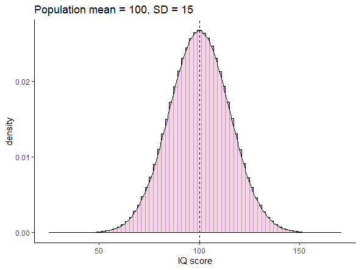
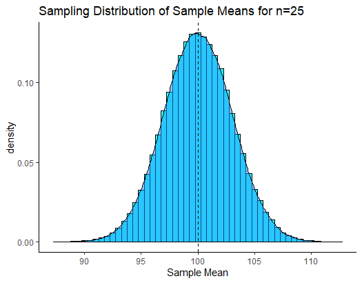
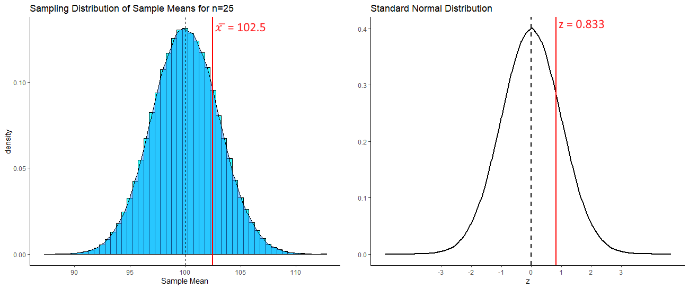
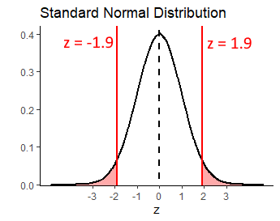
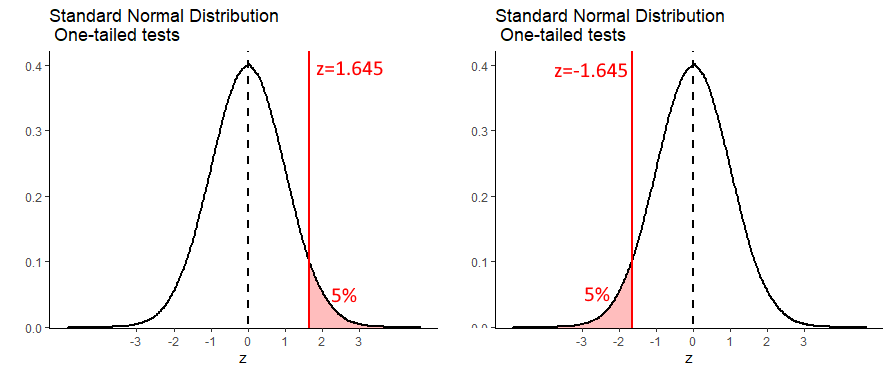
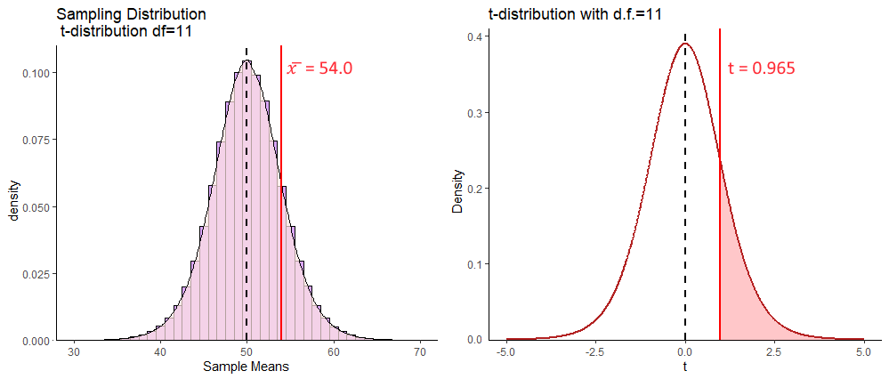

# One Sample Inferential Statistics


The general question at hand with one-sample inferential tests, is that we wish to test the probability that our one sample of data comes from a population that has a true population mean $\mu$ that is equal to, greater than, or less than, some specific value.  We will look at two ways of doing this - firstly using a z-test and then using t-tests.  

<br><br>

          
## One-sample z-tests


### Sampling Distribution Recap

In one-sample z-tests we are provided with the population mean $\mu$ and standard deviation $\sigma$. We then collect or are given one sample of data of size $n$. From this sample, we calculate the sample mean $\overline{x}$. The question then becomes, how likely were we to get a sample mean as large or as small as the sample that we got?

To answer this, we need to think in terms of the sampling distribution of sample means. We need to recognize that our one observed sample mean $\overline{x}$ is just one sample mean that we could have got from a sampling distribution of sample means. 

For instance, look at the population below. This is a normally distributed population of IQ scores, with a population mean $\mu = 100$ and a population standard deviation $\sigma = 15$.





Let's take a sample of size $n=25$ from this population, round the individual scores to 1dp, and get the mean of the sample:

```{r}
set.seed(1)
samp1 <- round(rnorm(n=25, mean=100, sd=15),1)
samp1
mean(samp1)
```

Our one observed sample has a sample mean of $\overline{x}=102.5$


If we repeated this step and got a second sample of $n=25$, we could get another sample mean $\overline{x}$:

```{r}
samp2 <- round(rnorm(n=25, mean=100, sd=15),1)
samp2
mean(samp2)
```

This time the sample mean is $\overline{x}=100.5$.


If you remember back to section \@ref(what-is-a-sampling-distribution), if we were to repeat this process thousands and thousands of times, we would get a **sampling distribution of sample means**. We could visualize all of our sample means from many thousands of samples in a histogram, which shows the shape of the sampling distribution:





Because of Central Limit Theorem (see section \@ref(central-limit-theorem)) then this sampling distribution is normally distributed and it's mean $\mu_{\overline{x}}$ is equal to the population mean $\mu$. Therefore $\mu_{\overline{x}}=10.0$. We also know the standard deviation of this sampling distribution, also known as the **standard error** as it can be calculated by: $\Large  \sigma_{\overline{x}} = \frac{\sigma}{\sqrt{n}}$.  Therefore, the sampling distribution standard deviation is $\sigma_{\overline{x}}=3.0$:

```{r}
sem <- 15 / sqrt(25)
sem
```


Because this sampling distribution is normally distributed, we can determine how far away from the mean any sample mean is in terms of how many standard deviations from the mean they are.  For instance, our first sample we got a mean of  $\overline{x}=102.5$. How many sampling distribution standard deviations is this from the mean of the sampling distribution?  We can use an amended z-score formula (see section  \@ref(z-scores)) to determine this:

$z = \frac{\overline{x} - \mu_{\overline{x}}}{\sigma_{\overline{x}}}$

```{r}
(102.5 - 100.0) / 3


```

So, our sample mean of  $\overline{x}=102.5$ is 0.833 standard deviations above the mean.  Because our sampling distribution is normally distributed, then we can visualize how far above the mean this value is on the standard normal curve as well as on the sampling distribution:




If we were asked what proportion of sample means were at least as big as 102.5, then we'd be interested in knowing what proportion of sample means are to the right of the red lines above. We can calculate the area under a standard normal curve to the left of any `z` value in R using `pnorm()`:

```{r}
pnorm(0.833)
```

To find the proportion of the curve to the right of the red line (i.e. the proportion of sample means that are greater than 102.5), we just subtract this value from 1.

```{r}
1 - pnorm(0.833)

```

So 20.2% of samples have a sample mean greater than 102.5.  In this situation, our one sample mean was not therefore that unusual or surprising.


<br><br>

### Calculating p-values for z-test

**One-tailed tests** 

We can calculate the proportion of sample means that are greater or less than any value.  For instance, if we were interested in whether a new reading program in a school boosted the IQ of subjects. We might take a sample of 25 of these students and measure their IQ.  If we got a sample mean of $\overline{x}= 105.7$, we may wish to test whether this value is surprisingly large given that the population of IQ has a $\mu=100.0$ and $\sigma=15.0$.

If we were to formally write this in hypothesis terms, it would look like this:

<br>
$H_{0}: \mu \le 100.0$
<br>
$H_{1}: \mu > 100.0$
<br>

This is saying that the alternative hypothesis $H_{1}$ is that our sample of 25 come from a population whose mean is greater than 100.0.  The null hypothesis that we are testing is that they come from a population whose mean is equal to or less than 100.0.

For the test, we assume with the null hypothesis that our sample did indeed come from a population with  $\mu=100.0$ and $\sigma=15.0$. We already calculated above that the sampling distribution of sample means for $n=25$ has a $\mu_{\overline{x}}=100.0$ and $\sigma_{\overline{x}}=3.0$. How unusual is our one observed sample mean of $\overline{x}=105.7$?   We need to calculate this in terms of z:

$\Large z = \frac{\overline{x} - \mu_{\overline{x}}}{\sigma_{\overline{x}}}$

```{r}
(105.7 - 100.0) / 3

```

This suggests that our observed sample mean is 1.9 sampling distribution standard deviations away from the mean of the sampling distribution.  We next need to work out what proportion of sample means are greater than this. That is akin to the red shaded area below:


We can do this with `pnorm()`:

```{r}
1 - pnorm(1.9)

```

This shows that only 2.9% of sample means are greater than our observed sample mean, given the population data of $\mu=100.0$ and $\sigma=15.0$. Therefore, our observed sample mean is quite surprising. We can write the likelihood of getting this sample mean as `p = 0.029`. Because we a priori had a prediction as to the direction of the mean in our sample (we predicted it to be higher than the population mean of 100.0), then we have in fact just done a one-tailed test. If we decide that any p-values that are below `p=0.05` are 'significant', then we can say that our reading program in the school has a 'significant effect' on improving IQ scores.  


<br><br>

**Two-tailed tests** 

What instead we had implement a reading program that was quite radical, and we were not sure whether it would be successful or not. We were interested in seeing whether it could increase or decrease IQ?  In this situation, we do not have a direction of prediction, and we set up our hypotheses slightly differently:

<br>
$H_{0}: \mu = 100.0$
<br>
$H_{1}: \mu \ne 100.0$
<br>

Here, we are interested in whether our observed sample mean of $\mu=105.7$ could have come from a sampling distribution with a population mean of $\mu_{\overline{x}=100.0} or not.  The initial steps are the same. We calculate how unusual our observed sample mean was in terms of standard deviations away from the mean of the sampling distribution:


```{r}
(105.7 - 100.0) / 3

```


It's still 1.9 standard deviations away.

What we have to now thing about, is that because we did not predict the direction of the difference, we have to double our p-value. This is to account for the fact that in terms of 'surprising' results, we are interested in results that are more extreme than 1.9 standard deviations either side of the mean - i.e. the sum of the shaded area below:



Therefore, our p-value for this test is:

```{r}
2 * (1 - pnorm(1.9))
```

Which is `p=0.057`.  This would suggest that our reading program did not sufficiently shift the population IQ scores in our school away from 100.0, as our p-value is greater than 0.05.

But is this really true?   It is important to consider two things here.  One, it is important what initial hypothesis that you set up. If you have a strong a priori belief in the directionality of the hypothesis, then you are justified in doing a one-tailed z-test and using that p-value from that.  Secondly, the difference between `p=0.029` and `p=0.057` in this case isn't that great. We shouldn't be overly focused on the cut-off value of `p=0.05` as the criteria as to whether our results are significant or not significant. We should see the bigger picture, that our p-value is just one piece of information as to how different our sample of data is from the population that we believe it came from.


<br><br>


### Using critical values

In the preceding section, we ran one-tailed and two-tailed z-tests and calculated exact p-values. It is reasonably straightforward to do this in R. There is no reason not to use that approach. We prefer it. However, most often in introductory textbooks, a different approach is used. In this approach, the step of calculating the p-value is missed out. Instead, you are asked to just determine whether your observed z-value is more extreme than you'd expect by chance.  "By chance" in this context means, that your observed z-value is less than 5% likely to occur.

<br>

**One-tailed z-test**

The population mean for SAT scores is $\mu=500$ with a population standard deviation $\sigma=100$. A tutoring company says that they improve SAT scores. A random sample of 12 students who took the tutoring program had a sample mean of $\overline(x)=551$. Let's test whether this sample mean came from the population.


<br>
$H_{0}: \mu \le 500.0$
<br>
$H_{1}: \mu > 500.0$
<br>

Next, we calculate the mean and standard deviation of the sampling distribution for a sample size $n=12$.  For the test, we assume that the sampling distribution mean $\mu_{\overline{x}}=500.0$ - i.e. is the same as the population mean. The standard deviation of the sampling distribution $\sigma_{\overline{x}} = 28.87$:

```{r}
100 / sqrt(12)

```

Next, we work out how many sampling distribution standard deviations from the sampling distribution mean is our observed sample:

```{r}
(551 - 500) / 28.86751

```

This shows that our observed sample mean of $\overline{x}=551$ is 1.77 standard deviations above the mean of the sampling distribution. We could convert this to a p-value and calculate precisely how many sample means are larger than this in the sampling distribution. Instead, we'll take a different approach:


Because this sampling distribution is approximately normal, we can determine how many standard deviations above the mean you'd have to be to be larger than 95% of all samples.



It turns out that $z=1.645$ is the value of $z$ that leaves 5% in the right hand tail. Therefore, any value of $z$ greater than $z=1.645$ will be 'unusually' large and have a p-value of less than 0.05.  If we were dealing with sample means that were surprisingly small (so a one-tailed test where we are predicting that the sample mean comes from a population with a mean that is smaller than the population mean), then we are looking for $z$ values that are lower than $z=-1.645$. 

We can work out where these 'critical values' are in R using the `qnorm()` function:

```{r}
qnorm(0.95) # leaves 5% in right of tail
```


```{r}
qnorm(0.05) # leaves 5% in left of tail
```


If we get back to our observed $z$ value of $z=1.77$, we can overlay this over the graph above like this:


As you can see, our observed $z$ value is more extreme than the 'critical value' of $z=1.645$. We say that our observed value is therefore in the 'region of rejection' and we can therefore reject the null hypothesis with a p-value of $p<0.05$ and accept the alternate hypothesis that our sample comes from a population with a population mean that is greater than 500. In other words, the tutoring program appears to have a population mean of SAT scores greater than 500.

<br><br>

**Two-tailed z-test**

With the one-tailed z-test, we see that our critical values of z are $z=1.645$ for situations in which we are testing whether our sample mean is unexpectedly large, or $z=-1.645$ for situations in which we are testing that our sample mean is unexpectedly small. In a two-tailed situation, we are testing whether our sample mean is unexpectedly large *or* small. Because we still want only 5% of sample means to be in this 'unexpectedly' large or small category, this time we need a value of $z$ that leaves a total of 5% in the ends of both tails of the normal distribution. This is the same as leaving 2.5% in each tail:


```{r}
qnorm(.975)  # leaves 2.5% in right tail

qnorm(.025)  # leaves 2.5% in left tail

```


Let's illustrate this a bit further with the following example.  Say we have a bakery that makes cupcakes. The population mean weight of cupcakes is $\mu=6.5$ ounces, with a standard deviation of $\sigma=0.15$ ounces. A customer wants to test if a new cupcake variety is heavier or lighter than 6.5 ounces. They purchase a random sample of 10 cupcakes and find that the sample mean is $\overline(x)=6.42$ ounces. 

If we were to conduct a two-tailed test, to test if the population mean that our sample come from is equal to 6.5 ounces or not,  then our hypotheses would be:

<br>
$H_{0}: \mu = 6.5$
<br>
$H_{1}: \mu \ne 6.5$
<br>


We need to calculate the z-score for our sample mean, to determine how many standard deviations of the sampling distribution it is away from the mean.

```{r}
sem <- 0.15 / sqrt(10)  #standard deviation of the sampling distribution

z <- (6.42 - 6.5) / sem  # how many SD away from the mean is our sample

z
```

We can overlay this observed value of $z$ onto our standard normal curve like this:


Our value of $z=-1.69$ is therefore not inside either of the regions of rejection. This means that we do not have sufficient evidence to reject the null hypothesis that our sample comes from a population with mean of equal to 6.5. 


<br><br>


## One-sample t-tests

As with confidence intervals based on the $z$-distribution (the standard normal curve), the major issue with z-tests is that they require you to know the population mean $\sigma$ to perform the calculations.  This is almost never the case - with exceptions like standardized tests including IQ and SAT that are designed to have specific means and standard deviations.  

If you wish to test whether your observed sample mean is likely or not to come from a population with a given mean, what approach should you take when you do not know $\sigma$?  As with confidence intervals, the approach we take is to use the $t$-distribution.


In this situation, because we don't know our population standard deviation $\sigma$, we have to estimate it using the sample standard deviation $s$. Further, because our sampling distribution may not be precisely normal given this estimation, we say that it comes from a $t$-distribution. $t$-distributions have slightly heavier tails than the normal distribution.

<br><br>

**One-tailed t-test example**

Let's illustrate the steps we take in a one-sample t-test with an example. These steps are identical to the two-tailed t-test up until we calculate the p-value.

The population mean number of words spoken by two year olds by their 2nd birthday is $\mu=50$ words and this is normally distributed.  We don't know the population standard deviation $\sigma$. A researcher wanted to investigate if reading to children increases their word knowledge. They collected data from 12 children ($n=12$) who were read to for at least two hours every day. These are the number of words spoken by the 12 children:

```{r}
x <- c(45, 53, 71, 35, 51, 59, 49, 55, 78, 27, 66, 59)
x
mean(x)  
```

Our one observed sample mean $\overline{x}=54$. This is higher than 50, but is it meaningfully higher? If we were to formalize our hypothesis for this test, we would write:

<br>
$H_{0}: \mu \le 50.0$
<br>
$H_{1}: \mu > 50.0$
<br>

We are testing whether our sample was likely to have come from a population with mean 50 or less (null hypothesis), or if it was more likely to come from a population with a mean of greater than 50.

The first step is to think about the sampling distribution. We need to recognize that our one observed sample mean is just one sample mean that we theoretically could have got from a sample distribution. Under the null hypothesis, we are going to assume that the mean of our sampling distribution $\mu_{\overline{x}}$ is equivalent to the population mean $\mu$. Therefore, $\mu_{\overline{x}}=50.0$

Next, we need to calculate the standard deviation of the sampling distribution of sample means for n=12 (i.e. the standard error). As we do not know the population standard deviation $\sigma$, we estimate this by using the following formula:

$\Large \sigma_{\overline{x}} = \frac{s}{\sqrt{n}}$

Therefore, our estimate of the standard error is $\sigma_{\overline{x}}=4.14$:

```{r}
sem <- sd(x) / sqrt(12)
sem

```

Now that we know both the mean and standard deviation of the t-shaped sampling distribution, next we need to calculate how many standard deviations from this mean is our one observed sample mean. We calculate that using the formula that is similar to the $z$ formula:

$\Large t = \frac{\overline{x} - \mu_{\overline{x}}}{\sigma_{\overline{x}}}$

Our sample mean of $\overline{x}=54$ has a $t$ value of $t = 0.965$:

```{r}
(54-50) / sem

```

This means that it is approximately 0.965 standard deviations higher than the mean.  We can calculate the proportion of sample means in the sampling distribution that are higher than our one observed sample mean by calculating the area under the curve to the right of our $t$-value. Remember, that our sampling distribution is $t$-shaped and has 11 degrees of freedom. The degrees of freedom are $df = n-1$ for a one-sample t-test.




To determine what proportion of the curve lies to the right of $t=0.965$ we can use `pt()` which calculates the proportion to the left of the given value. 

```{r}
pt(0.965, df=11)
```

So, this tells us that for a $t$-distribution with 11 degrees of freedom, that 82.2% of values are to the left (lower than) of this value.  That means that 17.8% of values are to the right, or 17.8% of sample means that could be drawn from the sampling distribution with a mean of 54 and standard deviation of 4.14 will be higher than our observed sample mean.

```{r}
1 - pt(0.965, df=11)
```

We can also get this value by setting `lower.tail = FALSE`:

```{r}
pt(0.965, df=11, lower.tail = FALSE) 
```

Because we made a prediction as to the direction of the hypothesis - i.e. we predicted that reading to children would *increase* the population mean, we are effectively running a one-tailed test. Our p-value is simply $p=0.177$. As we use an alpha level of 0.05 (a p-value of 0.05 as our critical value), this suggests that we do not have sufficient evidence to suggest that our sample of 12 children have a mean value that comes from a population with a mean that is greater than 50. We do not reject our null hypothesis.

<br><br>

**Two-tailed t-test example**

There are 20 psychology students in Dr. Zeppo's class. Here are their scores on a test, as well as their sample mean $\overline{x}$ and sample standard deviation $s$:

```{r}
zeppo <- c(50,60,60,64,66,66,67,69,70,74,76,76,77,79,79,79,81,82,82,89)

zeppo

length(zeppo)  # 20 - there are 20 students in the sample.

mean(zeppo)  # the mean of the sample is 72.3

sd(zeppo)  # the sample SD is 9.52
```

Historically, students in this class get a score of 65 points on this test - that is the population mean $\mu$. Dr Zeppo wishes to test if this one sample (one class) has a mean (technically 'comes from a population with a mean') that is different to 65.  We would write out this hypothesis like this:

<br>
$H_{0}: \mu = 65.0$
<br>
$H_{1}: \mu \ne 65.0$
<br>

As with all of these tests, our first job is to recognize that our one sample mean is just one sample mean that we 'theoretically' could have got from lots of samples of size $n=20$. All of those sample means together are referred to as the sampling distribution of sample means.  Under the null hypothesis, we assume that the mean of the sampling distribution of sample means $\mu_{\overline{x}}=65$, i.e. it is equivalent to the population mean $\mu$. Next, we have to estimate the standard deviation of the sampling distribution of sample means, i.e. the standard error $\sigma_{\overline{x}}$.  We do this using the same formula as before:


$\large \sigma_{\overline{x}} = \frac{s}{\sqrt{n}}$

So, our standard error is $\sigma_{\overline{x}} = 2.13$:

```{r}
sem <- sd(zeppo) / sqrt(20)
sem

```

Following this, we need to calculate how expected or unexpected our one sample mean $\overline{x}$ was. We do this by calculating it in terms of how many sampling distribution standard deviations is it away from the sampling distribution mean.  We use the formula:

$\Large t = \frac{\overline{x} - \mu_{\overline{x}}}{\sigma_{\overline{x}}}$

```{r}
(mean(zeppo) - 65) / sem
```

Our observed sample mean of $\overline{x} = 72.3$ is 3.43 sampling distribution standard deviations from the sampling distribution mean.

We can picture this as follows:
<br>


To calculate our p-value for our 2-tailed t-test, we need to calculate not just the area underneath the curve with values of $t$ greater than our observed $t=3.43$, but also the values under the curve with $t$ values that are more negative than $t=-3.43$. This is because in a 2-tailed test, we need to test for the probability of getting a $t$-value as large in both directions. Our p-value can be calculated using `pt()`:

```{r}
pt(3.43, df = 19, lower.tail = F) + pt(-3.43, df = 19) 
```

Or alternatively, we could just multiply those values greater than $t=3.43$ by 2:

```{r}
pt(3.43, df = 19, lower.tail = F) * 2
```

Either way, we can see that our p-values is $p = 0.003$, which tells us that our observed mean of $\overline{x}=72.3$ is quite unlikely to have come from a distribution with a population mean $\mu=65$. This leads us to rejecting our null hypothesis and accepting the alternative, that these psychology students come from a population with a mean that is greater than 65.


<br><br>


### Critical values for the one-sample t-test


As with the z-test (see section \@ref(one-sample-z-test), instead of calculating the p-values for our observed values of $t$, you can simply test whether your value of $t$ exceeds (in either the positive or negative direction) some 'critical value' of $t$. Again, this approach was more often taken when it wasn't as easy to run computers to do these tests, so it seems a bit obsolete to do it this way. We recommend just doing it the way outlined above. Nevertheless, just for completeness, here is how to calculate these critical values of $t$.


We'll use data from a different dataset.  Here, we have the times taken to complete a crossword puzzle. We have a sample of $n=10$ subjects.  

```{r, message=FALSE, warning=FALSE}
library(tidyverse)
xt <- read_csv("data/crosstimes.csv")
xt$time3
```

Let's say we wish to test whether this sample comes from a population with a mean of less than 16.0.  We would be doing a one-tailed test and our hypotheses would look like this:

<br>
$H_{0}: \mu \ge 16.0$
<br>
$H_{1}: \mu < 16.0$
<br>

When using critical values, all the steps up to completing the observed $t$-value are the same as before. So, we assume that our one sample mean $\overline{x}$ comes from a sampling distribution of sample means that has a mean equivalent to the population mean of 16.  The standard deviation of this sampling distribution is:

```{r}
sem <- sd(xt$time3) / sqrt(10)
sem

```

Next, we calculate our observed $t$ which is a measure of how many sampling deviation standard deviations our observed sample mean is away from the mean of the sampling distribution:

```{r}
(mean(xt$time3) - 16) / sem
```

Our observed $t$ values is $t = -0.99$.

As we are conducting a one-tailed t-test, we need to think in terms of what value of $t$ leaves 5% in the tail for a t-distribution with 9 degrees of freedom. This is visualized below:


If our observed sample mean with a $t$-value of -0.99 was unexpectedly small, then it would need to be in the region of rejection (red shaded area). This would mean that it was in the bottom 5% of sample means from such a distribution. The value of $t$ that is the boundary of the the lower 5% can be calculated using the `qt()` function like this:


```{r}
qt(0.05, df=9)
```

<br><br>

**Two-tailed tests**

For this example, let's use the `penguins` data. Say we are interested in the flipper length of male Adelie  penguins on Biscoe island (a bit specific, but let's go with it), and wanted to know if their mean length was different from $\mu = 188$.  Our hypotheses would be:

<br>
$H_{0}: \mu = 188.0$
<br>
$H_{1}: \mu \ne 188.0$
<br>


From our data, we can calculate our $n$ and sample mean $\overline{x}$:

```{r, message=FALSE, warning=FALSE}
### Read in the Data Penguins
penguins <- read_csv("data/penguins.csv")

# just look at the females.
adelie <- penguins %>% filter(species == "Adelie", sex == "MALE", island == "Biscoe")

nrow(adelie)

mean(adelie$flipper_length_mm)

```


We can also represent these data as a boxplot:

```{r, fig.width=6, fig.height=1.5}
ggplot(adelie, aes(x = 0, y = flipper_length_mm)) +
  geom_boxplot() +
  geom_jitter(width = .1, size=2)+
  theme(axis.title.y=element_blank(),
        axis.text.y=element_blank(),
        axis.ticks.y=element_blank()) +
  coord_flip() +
  geom_hline(yintercept = 187, color="red")

```

Our sample of penguins has a sample size of $n=22$, with a sample mean of $\overline{x}=190.4$.  Let's calculate our observed value of $t$ for this sample:

```{r}
sem <- sd(adelie$flipper_length_mm) / sqrt(22)

tobs <- (mean(adelie$flipper_length_mm) - 188) / sem

tobs
```

This means that our observed sample mean is 1.75 sample standard deviations above the sampling distribution mean. 

In terms of critical regions, for a 2-tailed test, we need to know the values of $t$ that leave 2.5% in each tail for a $t$-distribution with 21 degrees of freedom.

```{r}
qt(.975, df = 21)

qt(.025, df = 21)
```

<br>


For a $t$-distribution with 21 degrees of freedom, the top 2.5% of t-values are greater than $t=2.08$, whilst the lowest 2.5% of t-values are below $t=-2.08$. Therefore, for us to reject the null hypothesis, our observed t-value needs to be higher than 2.08 or lower than -2.08. That would leave it in the region of rejection (red shaded areas above).  Our observed t-value is $t=1.75$ which is not in these areas, so we cannot reject the null hypothesis. We do not have sufficient evidence to suggest that our penguins come from a population with a mean of $\mu = 188$. 


<br><br>


## Conducting one-sample t-tests in R

Conducting one-sample t-tests in R is very straightforward. 

First, let's consider the sample of 12 two-year olds and their word scores.

```{r}
x <- c(45, 53, 71, 35, 51, 59, 49, 55, 78, 27, 66, 59)
mean(x)

```

To test whether this sample mean is likely to have come from a population with a mean greater than 50, we use `t.test()` in the following way:


```{r}
t.test(x, mu = 50, alternative = "greater")  # one-tailed test
```

`mu` specifies the mean that we are testing against.  `alternative = "greater"` states that it is a one-tailed test, where we are testing the prediction that the population mean is greater than 50.  The output gives us the same observed t-value that we calculated by hand $t=0.97$, the degrees of freedom and the p-value.


To conduct a two-tailed test, where we just make the prediction that the population mean that the sample came from is not equal to some value, we just drop the `alternative` argument.  For instance, we can test whether the `zeppo` data come from a population with a mean equal to 65:


```{r}

t.test(zeppo, mu = 65)  # two tailed test

```


Again, we see the same t-value, degrees of freedom and p-value as we calculated by hand.  Also with a two-tailed t-test we get the 95% confidence interval of the true population mean (see section  \@ref(calculating -a-t-distribution-confidence-interval).


Finally, if we wished to do a one-tailed t-test where we were testing whether the sample came from a population with a population mean of less than some value, we would use `alternative = "less"`. For example, to test if the sample of puzzle competitors came from a population that completed their puzzles in less than 16 minutes:

```{r}
t.test(xt$time3, mu = 16, alternative = "less")
```

<br><br>


## Assumptions of the one-sample t-test

The main assumptions of the one-sample t-test are that the observations should be independent of each other, and the values should be approximately normally distributed.

We can more formally test if our data come from a population that is approximately normally distributed using a Shapiro-Wilk test. This test essentially examines the distribution of our data, and determines the probability that it came from a normal distribution. We can perform this test in R using `shapiro.test()`.

```{r}
shapiro.test(x)

shapiro.test(zeppo)

shapiro.test(xt$time3)

shapiro.test(adelie$flipper_length_mm)

```

As you can see, all four of the datasets that we have performed one-sample t-tests on have p-values for this test that are greater than p=0.05. This suggests that our data are approximately normally distributed. The p-value for the crossword puzzle times is very low `p=0.0501` which probably suggests that we should look at that data in more detail to be sure that our data are normally distributed.

If your data are not normally distributed, then one option is to perform a non-parametric alternative to the one-sample t-test. This test is called the  one-sample Wilcoxon signed rank test. We will not go into the details of the test, but effectively it tests whether your sample is likely to have come from a population with a median of a specified value.  It is run like this in R:

```{r}
wilcox.test(xt$time3, mu = 16, alternative = "less")
```

Again, with this test, we are looking for a p-value lower than 0.05 to reject the null hypothesis and accept the alternative that our sample comes from a population with a median of less than 16.

