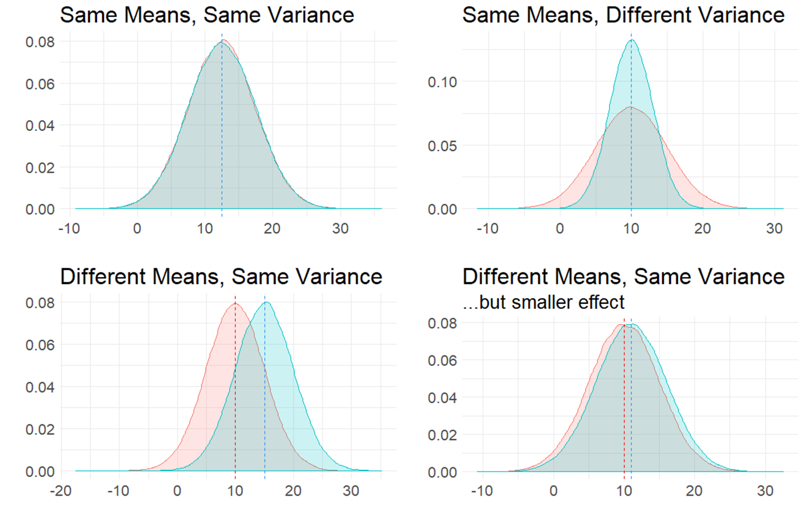
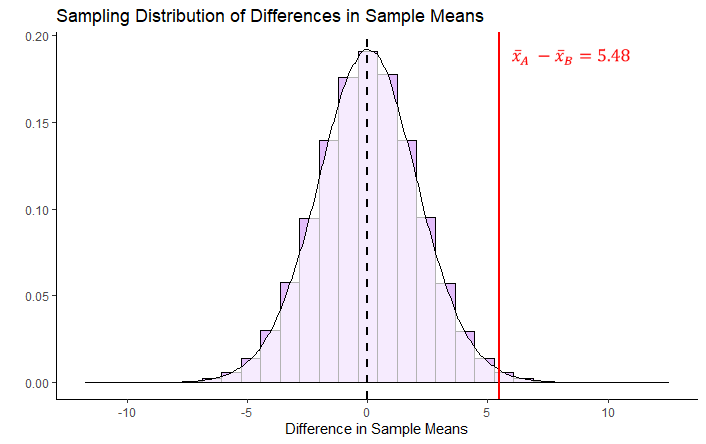
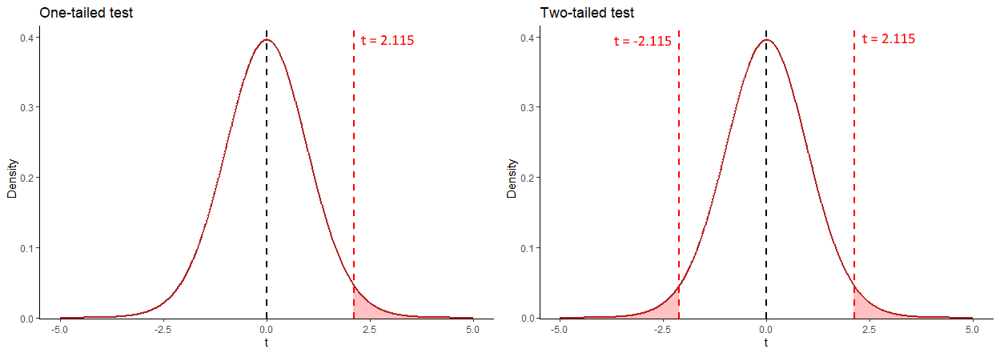

# Two Sample Inferential Statistics

```{r, echo=FALSE, warning=FALSE, message=FALSE}
library(tidyverse)
```

A very common question in statistics is whether two groups differ from each other in their distributions. Most often, what we are really asking is whether the population means $\mu$ of two groups differ from each other. 

In the figure below, we are plotting four different comparisons of two normal distributions. 

In the top left, both populations have the same mean $\mu$ and same variance $\sigma^2$ (remember that variance is standard deviation $\sigma$ squared). These two populations are essentially identical. In the top right, both populations have the same mean $\mu$, but differ in their variance $\sigma^2$. 

The bottom two distributions show populations with different population means $\mu$ and the same variance $\sigma^2$. In the bottom left, the means are quite far apart, whereas in the bottom right the means are different to each other but the effect is much smaller.

<br><br>


<br><br>

It is also possible to have the situation where the means are different to each other, and so is the variance, as is shown in the figure below:

<br><br>


<br><br>

## Independent Samples t-test

The most typical situation where we are interested in comparing two means is when we collect two samples of data. Perhaps we collect data on the reaction times of subjects after drinking water or coffee.  We would be able to directly calculate the sample means $\overline{x}$ of both samples and could find out if there was a different or not in these values. But, what we really want to know is whether the respective populations that these two samples come from (i.e. the population of water drinkers vs the population of coffee drinkers) actually differ in their population means $\mu$.

This is the situation that we will discuss more in this chapter. **Independent t-tests** examine whether two independent samples (meaning different individuals in each group) could theoretically have come from populations with the same population mean $\mu$, or whether this is unlikely and their populations likely had different population means $\mu$. Independent t-tests also get called **two-sample t-tests**.

There are two types of independent t-tests. The first, and the one that we will discuss most extensively, is called the **Student's t-test**. This test assumes that the populations we are comparing have the same variances $\sigma^2$. The other independent t-test is called the **Welch's t-test** and makes a correction that allows for the two populations we are comparing to have different variances $\sigma^2$.  We will talk more about this version when performing t-tests in R, as it is actually the default version that R performs. For now, we shall dive deeper into the principles behind the Student's t-test. 


## Sampling Distribution of the Difference in Sample Means

For a two-sample independent $t$-test, the sampling distribution we use is different to the sampling distribution for a one-sample $t$-test. In a one-sample test, we are focused on the sampling distribution of sample means. In a two-sample test we are focused on the *sampling distribution of the differences in sample means*.


### Visualizing the Sampling Distribution


Let's try to illustrate this by looking at the sampling distributions we could get when we draw samples from two populations. In the first example, the populations differ in their means.  In the second example, the populations do not differ in their means.

<br>

**Difference in Population Means**

Say we have two normally distributed populations, A and B and each has 500,000 subjects. A has a population mean $\mu = 15$, and a population standard deviation $\sigma = 2.5$.  B has a population mean $\mu = 12$, and a population SD $\sigma = 2.5$.

We can generate these population by simulation in R like this:

```{r}
set.seed(1)

A <- rnorm(n = 500000, mean = 15, sd = 2.5)
B <- rnorm(n = 500000, mean = 12, sd = 2.5)

```


We can check their mean and standard deviation, and we see that the standard deviations are identical at 2.5, but the population means differ by 3:

```{r}
# and their summary descriptive stats
mean(A)   
sd(A)     

mean(B)   
sd(B)    

```


We can visualize these population distributions as follows:

```{r}
data.frame(A, B) %>%
  pivot_longer(1:2) %>%
  ggplot(aes(x=value, fill=name)) +
  geom_density(alpha = .1) +
  theme_classic() +
  ggtitle("Comparison of Population A vs B")+
  geom_vline(xintercept = 15, color="red", lwd=1, lty=1)+
  geom_vline(xintercept = 12, color="dodgerblue", lwd=1, lty=2) +
  scale_x_continuous(breaks = seq(2,26,2))
```


We can calculate the true difference in population means $\mu_{A} - \mu_{B}$ to be 2.997. 


```{r}
mean(A) - mean(B) 
```


If we knew nothing about the populations of A and B, but were interested in whether they differed in their population means, then we might take a sample of A and a sample of B and compare their sample means. In this example, we are going to take a sample of size $n=17$ from population A, and a sample of size $n=20$ from population B.  These sample sizes were picked more or less at random - they can be the same sized samples, or they can be different sizes. 

Let's take our samples, and then examine the differences in our sample means:

```{r}
set.seed(1) # so we get the same values

a1 <- sample(A, 17)
a1

b1 <- sample(B, 20)
b1

mean(a1)
mean(b1)

mean(a1) - mean(b1)  

```

Here we find that the difference in means between our sample from population A and our sample from population B is 2.85.  In other words, $\overline{x}_{A} - \overline{x}_{B} = 2.85$  This is pretty close to the true difference in population means (although we're currently pretending that we don't know that difference).


We could do this again. Let's select another sample from population A of size 17, and another sample from population B of size 20:


```{r}
a2 <- sample(A, 17)
a2

b2 <- sample(B, 20)
b2


mean(a2)
mean(b2)

mean(a2) - mean(b2)  

```

This time, $\overline{x}_{A} - \overline{x}_{B} = 3.37$  This is again pretty close to the true difference in population means, but a bit higher this time.


We can keep drawing samples of size 17 from A, and size 20 from B and examining the difference in sample means $\overline{x}_{A} - \overline{x}_{B}$.  A quick way of writing that code in R is as follows - where we repeat it 5 more times:

```{r}
mean(sample(A,17)) - mean(sample(B,20))
mean(sample(A,17)) - mean(sample(B,20))
mean(sample(A,17)) - mean(sample(B,20))
mean(sample(A,17)) - mean(sample(B,20))
mean(sample(A,17)) - mean(sample(B,20))
```

As you can see, the values we get tend to be a little bit above or a little bit below 3.

If we did this thousands and thousands of times, we'd get a distribution of the differences in sample means. This would be the *sampling distribution of the differences in sample means*.  Below we repeat the above step 10,000 times to get a visualization of what this sampling distribution looks like:

```{r}
set.seed(1)
difs <- vector('list', 10000)

for(i in 1:10000){
  difs[[i]] <-  mean(sample(A, 17)) - mean(sample(B, 20))
}

df <- data.frame(dif = unlist(difs))


#get mean difference
mean(unlist(difs))  # 3.00

#make histogram
ggplot(df, aes(x=dif)) +
  geom_histogram(color='black', fill='dodgerblue', alpha=.5, binwidth = .1)+
  theme_classic() +
  xlab("Difference in Sample Means")+
  ggtitle("Sampling Distribution of Difference in Sample Means") +
  geom_vline(xintercept = mean(unlist(difs)), lwd=1, color="red")


```


As you can see, the sampling distribution is approximately symmetrical. If we ran it for more simulations, it would become even more symmetrical. The average (mean) difference in sample means across all samples is $\Large \mu_{\overline{x}_{A} - \overline{x}_{B}}= 2.987$ which is approximately equal to the real difference in population means $\mu_{A} - \mu_{B}$.

An obvious next question is what is the standard deviation of this sampling distribution? i.e. the standard deviation of the sampling distribution of the differences in sample means. If we knew this, then we'd be able to describe how likely or unlikely we were to get any particular difference in sample means in terms of how many sampling distribution standard deviations that score is away from the mean.

There are actually two different formulas that we can use to work out the standard deviation - which we will discuss shortly (see section \@ref(pooled-standard-deviation)). In brief, it is a bit trickier to calculate the standard deviation of this sampling distribution compared to the standard deviation of the sampling distribution of sample means, because our difference in sample means uses two different samples each with their own sample standard deviation. 

Given we just simulated our sampling distribution of the differences in sample means, we could just look at its standard deviation in R:

```{r}
sd(unlist(difs))
```

This tells us that the standard deviation of this sampling distribution is approximately equal to $\sigma_{\overline{x}_{A} - \overline{x}_{B}}= 0.82$.  As well as using the formulas that we will introduce shortly to estimate this value, there is actually another shortcut we could have used too as we know the original population standard deviations. This is not essential to know or remember, as it's not something we would ever do in practice, it's just something to point out in passing.

There is something called [variance sum law](http://onlinestatbook.com/2/summarizing_distributions/variance_sum_law.html).  Essentially, if you want to know the difference of two variables, then it is equal to the sum of the variance of the two variables.

Our variables in this scenario are the sampling distributions of sample means for A and B. We can calculate the variance of each by $\sigma^2/n$.  If we add them together according to the variance sum law, we get the variance for the difference in these two variables. Then we square-root to get the standard deviation - which is equivalent to our sampling distribution of the difference in sample means standard deviation:

```{r}
sqrt((var(A)/17) + (var(B)/20)) 
```

Again, this tells us that $\Large  \sigma_{\overline{x}_{A} - \overline{x}_{B}}= 0.82$.  

However, in practice, we only have our two samples (our one sample of population A and our one sample of population B). We don't know anything else about the sampling distribution or the populations. Therefore we cannot use either of the above methods to calculate the standard deviation of the sampling distribution.  We'll get to what method you need to use soon.  


<br><br>

**No Difference in Population Means**

Let's look at an example of what the sampling distribution of difference in sample means looks like when there is no difference between population means.

In this scenario, we have two normally distributed populations, C and D and each has 500,000 subjects. C has a population mean $\mu = 10$, and a population standard deviation $\sigma = 3$.  D has a population mean $\mu = 10$, and a population SD $\sigma = 3$. We can generate these populations in R:

```{r}
set.seed(1)

C <- rnorm(n = 500000, mean = 10, sd = 3)
D <- rnorm(n = 500000, mean = 10, sd = 3)

```


We can then examine their means and standard deviations:

```{r}
# and their summary descriptive stats
mean(C)   
sd(C)     

mean(D)   
sd(D)     
```


We can then calculate the true difference between these populations in their population means and see that $\mu_{C}-\mu_{D} = 0.00$ 

```{r}
mean(C) - mean(D)
```


We can also visualize these populations - it can be hard to see both populations because they are identical and D is directly on top of C, but they are both there!

```{r}
data.frame(C, D) %>%
  pivot_longer(1:2) %>%
  ggplot(aes(x=value, fill=name)) +
  geom_density(alpha = .1) +
  theme_classic() +
  ggtitle("Comparison of Population C vs D")+
  geom_vline(xintercept = 10, color="red", lwd=1, lty=1)+
  geom_vline(xintercept = 10, color="dodgerblue", lwd=1, lty=2)
```


For this example, let's look at one sample of size 11 for population C and one sample of size 14 for population D.

```{r}
set.seed(1)
c1 <- sample(C, 11)
d1 <- sample(D, 14)

c1
d1

mean(c1)

mean(d1)

mean(c1) - mean(d1)  
```

Here we find that the difference in sample means $\Large \overline{x}_C - \overline{x}_D = -0.197$.

If we did this lots of times, we'd sometimes get sample means that were larger in C and sometimes they would be larger in D. Let's do it five more times:

```{r}
mean(sample(C,11)) - mean(sample(D,14))
mean(sample(C,11)) - mean(sample(D,14))
mean(sample(C,11)) - mean(sample(D,14))
mean(sample(C,11)) - mean(sample(D,14))
mean(sample(C,11)) - mean(sample(D,14))
```


If we did this thousands and thousands of times, we will get our sampling distribution of the differences in sample means. We can use the code below to simulate this, collecting 20,000 samples of C and D and determining the difference in means for each sample collected:

```{r}
set.seed(1)

difs1 <- vector('list', 20000)

for(i in 1:20000){
  difs1[[i]] <-  mean(sample(C, 11)) - mean(sample(D, 14))
}

```

We can visualize this sampling distribution:

```{r}
## plot as a histogram:
df1 <- data.frame(dif = unlist(difs1))

ggplot(df1, aes(x=dif)) +
  geom_histogram(color='black', fill='mistyrose', alpha=.5, binwidth = .2)+
  theme_classic() +
  ggtitle("Sampling Distribution of Difference in Sample Means") +
  geom_vline(xintercept = mean(unlist(difs1)), lwd=1, color="red")
```


```{r}
mean(unlist(difs1))  
```

After 20,000 samples of size 11 from population C and size 14 from population D, we find that the mean difference in sample means is $\mu_{\overline{x}_C - \overline{x}_D} = -0.006$. This is pretty close to the true difference in population means of 0. If we were to run our simulation for longer to get even more differences in sample means, then our mean difference would get even closer to 0.


So, we have a symmetrical sampling distribution of differences in sample means with a mean $\mu_{\overline{x}_C - \overline{x}_D}$ approximately equal to 0.0. What is the Standard Deviation of this distribution? Again, we can calculate this directly from our simulated data:

```{r}
sd(unlist(difs1))
```

Here we find that the standard deviation is $\sigma_{\overline{x}_C - \overline{x}_D} = 1.2$.  The question becomes, how do you estimate this standard deviation when you only have one sample of each population?  We shall get to how this is done in the next few sections.


## Pooled Standard Deviation


In the Student's t-test, we assume that our two samples come from populations that have "equal variance", i.e. that their standard deviations are equivalent. The reason behind this is that it enables us to use this estimate in calculating the Standard Deviation of the Sampling Distribution of Differences in Sample Means.  

When we assume that two samples have the same variance, we estimate this by pooling their standard deviations. Let's look in more detail about how standard deviations are pooled.


When we have two samples, they each have sample standard deviations, that are usually not equal. For example, let's look at these two samples. The first sample is of size 9 and the second sample is of size 10.

```{r}
samp1 <-  c(23, 25, 33, 19, 21, 27, 26, 31, 20)
samp1
sd(samp1)


samp2 <-  c(21, 22, 23, 19, 20, 24, 25, 21, 23, 22)
samp2
sd(samp2)

```


It's clear that our sample standard deviations differ, with sample 1 having a sample standard deviation $s=4.82$ and sample 2 having a sample standard deviation of $s=1.83$.

So, if we assumed that they both come from populations with the same SD, how do we estimate that value? We have to pool the standard deviation.  Essentially, we want to calculate a value that is likely somewhere in between the two sample SDs. In practice we use a weighted average.

There are two ways of going about calculating this pooled standard deviation value.  The first is to use first principles as to what a standard deviation is. This is the one that makes most sense logically (to us at least), but it is also the more long-winded way.  The second way is to use a shortcut formula.

<br><br>

**Option 1: From first principles**

Let's first calculate the pooled standard deviation based on first principles.  Remember, a standard deviation is the square root of the average squared deviation of each value from the mean.

What we could do is to get the difference of every score from it's group mean, then square those differences, then add them all up, then divide by $n-2$, and then square root.  We divide by $n-2$ instead of $n-1$ because we have two samples that we are using and we are using two different estimated means to determine the standard deviation. Therefore, to avoid underestimating our standard deviation we divide by $n-2$.

Here, we break this down step by step:

i) Calculate each sample mean:

```{r}
mean(samp1)
mean(samp2)

```

ii) Let's get the differences of each score from their group mean:

```{r}
# get the differences from each group mean:

samp1_dif  <- samp1 - mean(samp1)
samp2_dif  <- samp2 - mean(samp2)

samp1_dif

samp2_dif
```


iii) Now square all these differences:

```{r}
samp1_dif2 <- samp1_dif^2
samp2_dif2 <- samp2_dif^2

samp1_dif2
samp2_dif2
```

iv) Get the sum of all the squares and add them up across both samples:

```{r}
ssq <- sum(samp1_dif2) + sum(samp2_dif2)
ssq
```

v) Now we get the 'average' squared deviation by dividing by n-2

```{r}
n2 <- 9 + 10 - 2
asd <- ssq/n2
asd
```

vi) Finally, we get the pooled standard deviation by square-rooting this:

```{r}
sqrt(asd)
```

Thus our estimate of the pooled standard deviation is $\hat\sigma_p = 3.56$.   This value is between our original sample standard deviations of 4.82 and 1.83, which makes sense.

You may see the following formula for calculating the pooled standard deviation in the way we just did. 

$\Large \hat\sigma_p = \sqrt{\frac{\Sigma_{ik}(x_{ik} - \overline{x}_k)^2}{n_1 + n_2 -2}}$


Here, $n_1$ is the sample size of sample 1, $n_2$ is the sample size of sample 2. The $\Sigma_{ik}(x_{ik} - \overline{x}_k)^2$ part of the formula is simply saying to take each data point away from it's sample mean and then square it - and then add all of these up. It looks quite intimidating, but hopefully the steps we outlined above make sense.

<br><br>

**Option 2: Using a shortcut formula**

The second way to calculate the pooled standard deviations doesn't require you to know the raw data. It is a formula that only requires you to know the sample standard deviation of each sample and the sample size of each sample. This is the formula:

$\Large \hat\sigma_p = \sqrt{\frac{w_1s_1^2 + w_2s_2^2 }{w_1 + w_2}}$


Here, $w_1 = n_1-1$ where $n_1$ is the sample size of sample 1. $w_2 = n_2-1$ where $n_2$ is the sample size of sample 2. $s_1$ is the sample standard deviation of sample 1, and $s_1$ is the sample standard deviation of sample 2.

We can calculate the pooled standard deviation using this formula for our two samples above:

```{r}
s1sd <- sd(samp1)
s2sd <- sd(samp2)

w1 <- length(samp1) - 1
w2 <- length(samp2) - 1

numerator <- (w1*s1sd^2) + (w2*s2sd^2)
denominator <- w1+w2

sqrt(numerator/denominator) 

```

This approach also calculates the pooled standard deviation to be $\hat\sigma_p = 3.56$.


## Theory behind Student's t-test

Hopefully you have a sense of the sampling distribution for the difference in sample means, and an idea about what pooled standard deviation is.  In this section we'll bring together these ideas to show you the behind the scenes working of the Student's t-test.


We'll use some example data from [the Navarro book](https://learningstatisticswithr.com/book/ttest.html#studentttest). These data are the exam scores of students who were TA-ed by either Anastasia or Bernadette. The question at hand is whether these two samples could have come from populations with the same mean, or from populations with different means. We assume that the variance (and therefore standard deviations) of both of these populations are the same. 

Here are the data:

```{r}
anastasia <- c(65, 74, 73, 83, 76, 65, 86, 70, 80, 55, 78, 78, 90, 77, 68)
bernadette <- c(72, 66, 71, 66, 76, 69, 79, 73, 62, 69, 68, 60, 73, 68, 67, 74, 56, 74)

```


We can make a boxplot to compare the two samples:

```{r}
# plot the data:
d <- data.frame(values = c(anastasia, bernadette),
                group = c(rep("anastasia",15), rep("bernadette", 18))
)

ggplot(d, aes(x = group, y = values, fill = group)) +
  geom_boxplot(alpha=.3) +
  geom_jitter(width=.1, size=2) +
  theme_classic() +
  scale_fill_manual(values = c("firebrick", "dodgerblue"))

```


We can also get the sample mean $\overline{x}$, standard deviation $s$ and $n$ of each sample:

```{r}
mean(anastasia)            
sd(anastasia)              
nA<-length(anastasia)      
nA

mean(bernadette)           
sd(bernadette)             
nB <- length(bernadette)   
nB
```


Although we are actually interested in whether these two samples come from populations that differ in their population means, we can directly measure if the two samples differ in their sample means by subtracting one from the other:

```{r}
mean(anastasia)  - mean(bernadette)  
```

We can see that Anastasia students have on average 5.48 higher scores than Bernadette students. But how meaningful is this difference?


What we are going to do is to work out how unusual or usual our one observed sample mean difference is.  We need to construct the sampling distribution of differences in sample means. We hypothesize that the true mean difference in population means is 0 (no difference between groups).

These are our hypotheses:

<br>
$H_{0}: \mu_A = \mu_A$
<br>
$H_{1}: \mu_A \ne \mu_A$
<br>


If we assume that the true difference in population means is 0 (the null hypothesis), then this will mean that the mean of the sampling distribution of the difference in sample means will also be 0 ($\mu_{\overline{x}_A-\overline{x}_B}=0$). If we know the standard deviation of this sampling distribution, then we could work out how many standard deviations away our one observed sample mean difference of 5.48 is from 0. That would enable us to work out the probability of getting a value that extreme.


So our next step is to work out the standard deviation of the sampling distribution. If we assume equal variances between the populations of group A and B, then we can calculate the standard deviation of this sampling distribution as

$\Large \sigma_{\overline{x}_A-\overline{x}_B} = \hat\sigma_p \times \sqrt{\frac{1}{n_1} + \frac{1}{n_2} }$


So, the first step in this formula is to calculate the pooled standard deviation $\hat\sigma_p$.  We can either calculate this from first principles or using the shortcut formula (see section \@ref(pooled-standard-deviation)). Below, we calculate the pooled standard deviation using the first principles:

```{r}
# from first principles, calculating deviations from each group mean
difA2 <- (anastasia - mean(anastasia))^2
difB2 <- (bernadette - mean(bernadette))^2
sumsq <- sum(difA2) + sum(difB2)
n <- nA + nB #33
sd.pool <- sqrt(sumsq/(n-2))

sd.pool # 7.41  this is the estimated pooled s.d.
```

This gives us a value of $\hat\sigma_p = 7.407$. This makes sense being in between our two sample standard deviations:

```{r}
sd(anastasia) #8.999
sd(bernadette) #5.775
```


Once we've calculated the pooled standard deviation $\hat\sigma_p$, we can insert it to the formula above to calculate the standard deviation of the sampling distribution of differences in sample means $\sigma_{\overline{x}_A-\overline{x}_B}$.

```{r}
sedm <-  sd.pool * sqrt( (1/nA) + (1/nB))

sedm  # this is the Standard Deviation of the Sampling Distribution of differences in sample means
```

Doing this, we calculate $\sigma_{\overline{x}_A-\overline{x}_B} = 2.59$.  This tells us that the standard deviation of the theoretical sampling distribution of the differences in sample means is 2.59. With that information, we can work out how many standard deviations away from the mean (of 0) our one observed difference in sample means of $\overline{x}_A - \overline{x}_B = 5.48$ is. 


Lets' visualize what this sampling distribution looks like:
<br>




By estimating the standard deviation, we are able to plot what our sampling distribution would look like. We are then able to see that our observed difference in sample means of $\overline{x}_A - \overline{x}_B = 5.48$ is quite far away from the hypothesized mean of 0 in terms of standard deviations.  What we have not discussed so far is what kind of shape that this distribution is other than it is symmetrical.  Similar to when we were looking at sampling distributions of sample means (see section \@ref(sampling-distribution-of-the-difference-in-sample-means)), the shape of this sampling distribution of the difference in sample means is also $t$-shaped. In the example given above, it is a $t$-distribution with 31 degrees of freedom. The degrees of freedom of these sampling distributions are equal to $df = n_A +  n_B - 2$. So in our case, this is equal to:

```{r}
nA + nB - 2
```

Given that the shape of our distribution is $t$-shaped, when we determine how many standard deviations away from the mean our single observed difference in sample means is, we call this our *observed t-value*.

We calculate t by the following formula:

$\Large t = \frac{(\overline{x}_A - \overline{x}_B)  -  (\mu_{\overline{x}_{A} - \overline{x}_{B}})}{\sigma_{\overline{x}_{A} - \overline{x}_{B}}}$

But because we assume the mean of the sampling distribution of sample means to be zero, we can write it as:

$\Large t = \frac{\overline{x}_A - \overline{x}_B}{\sigma_{\overline{x}_{A} - \overline{x}_{B}}}$


Essentially, it is taking our observed difference in sample means and dividing it by the standard deviation of the sampling distribution.


```{r}
tobs <- (mean(anastasia)  - mean(bernadette))  / sedm  

tobs 
```

Our observed t-value is $t = 2.115$.


Our final thing to do is to calculate the p-value.  The first step in this is to work out the proportion of the t distribution that is higher than our observed t-value. Because we are running a two-tailed test (we are examining whether the true difference in population means is 0 or not equal to 0), we need to double that proportion to get our p-value.  



The image above helps to explain how we'd calculate the p-value. Because it's a two-tailed test, we need to calculate the proportion of the distribution in the red area - this is the area that is greater than $t=2.115$ and less than $t=-2.115$.  We can use the `pt()` function in R to calculate this - remember that for this example, our degrees of freedom are 31:

```{r}
1 - pt(2.115, df=31)
```

This tells us that the area beyond $t=2.115$ is 0.021.  Therefore to get our p-value we double this:

```{r}
(1 - pt(2.115, df=31)) * 2
```

Our p-value is $p = 0.043$.


** One-tailed test **

If we had predicted beforehand that Anastaia's students would score more highly on the exam than Bernadette's then we could perform a one-tailed test. The hypotheses in this situation would be:

$H_{0}: \mu_A \le \mu_A$
$H_{1}: \mu_A > \mu_A$


All of the steps for calculating the observed $t$-value would be the same as above. The only difference is when calculating the p-value, we only need to consider the area under the curve beyond $t=2.115$. Therefore the p-value for this one-tailed test is $p = 0.021$.


<br><br>


## Confidence Interval for Difference in Means

When we take a sample of two independent groups, we are able to directly calculate the observed difference in sample means $\overline{x}_A - \overline{x}_B$. What we are usually interested in is whether this observed difference is meaningfully different from 0. One way to gain more insight into whether this might be true or not is to generate a 95% confidence interval around our observed sample difference $\overline{x}_A - \overline{x}_B$. If 0 is not inside our confidence interval, then this is pretty good evidence that the true difference in population means $\mu_A - \mu_B$ between the two groups is not 0, and therefore there is a difference in population means.  

As with all confidence intervals, the longer explanation as to what a 95% confidence interval really is, is a bit more long winded. Technically, this 95% confidence intervals means that if we were to take many samples of A and many samples of B, and calculate the difference and confidence intervals for all of them, in 95% of these confidence intervals we would have captured the true difference in population means $\mu_A - \mu_B$.


Let's illustrate with a small example, and then we'll turn to our TA data.


<br>

*Example 1*

A researcher compares the reaction times of two groups on a motor test. Individuals are different (independent) in each group. GroupA took a stimulant prior to the test. GroupB is the control group.

```{r}
groupA <- c(5.5, 5.1, 3.5, 5.1, 4.6, 4.6, 5.9, 4.0, 3.1, 3.8)
mean(groupA)     # 4.52
sd(groupA)       # 0.91


groupB <- c(5.7, 5.3, 5.9, 5.0, 5.0, 4.3, 4.1, 5.9, 5.9, 5.8, 5.4, 5.2, 4.9, 5.5)
mean(groupB)     # 5.28
sd(groupB)       # 0.58
```


```{r}

# plot the data:
dd <- data.frame(values = c(groupA, groupB),
                group = c(rep("A",10), rep("B", 14))
)

head(dd)

ggplot(dd, aes(x = group, y = values, fill = group)) +
  geom_boxplot(alpha=.3) +
  geom_jitter(width=.1, size=2) +
  theme_classic() +
  scale_fill_manual(values = c("firebrick", "dodgerblue"))

```


We can see from our data, that the observed difference in sample means between the two groups is $\overline{x}_A - \overline{x}_B = -0.759$

```{r}
mean(groupA) - mean(groupB)
```

Group B (the control group) is slower by 0.76 seconds on average than group A (the group that took the stimulant).


The first step in constructing a confidence interval around this observed difference in sample means, is to imagine that this observed difference in sample means came from a sampling distribution of difference in sample means. Our observed value was just one possible sample that we could have got from this sampling distribution.

This sampling distribution of differences in sample means, is $t$-shaped with degrees of freedom equal to $n-2$. We assume that our observed value of the difference in sample means is a good estimate of the true difference in population means. If we know the standard deviation of this sampling distribution, then we can create the 95% confidence interval around it using the formula:


$\Large CI_{95\%} =  \overline{x}_A - \overline{x}_B   \pm   t \times \sigma_{\overline{x}_A - \overline{x}_B}$ 


As discussed in the previous sections (see \@ref(sampling-distribution-of-the-difference-in-sample-means) and \@ref(pooled-standard-deviation)) the standard deviation of the sampling distribution of differences in sample means, can be calculated using the formula:

$\Large \sigma_{\overline{x}_A - \overline{x}_B}  =  \hat{\sigma_{\rho}} \times \sqrt{\frac{1}{n_A} + \frac{1}{n_B}}$


where $\hat{\sigma_{\rho}}$ is the pooled estimate of the standard deviation between the two groups.


The below diagram illustrates how this formula determines the 95% confidence interval. Our margin of error is the value of $t$ for the $t$-distribution with the appropriate degrees of freedom that leaves 2.5% in each tail, and therefore 95% in the middle of the distribution. We multiply this value of $t$ by the standard deviation of the sampling distribution of the differences in sample means to get the margin of error.  


The first step is therefore to calculate the pooled estimate of the common standard deviation $\hat{\sigma_{\rho}}$ (see section \@ref(sampling-Distribution-of-the-difference-in-sample-means)). Using the method of calculating deviations from each group mean, we can find that $\hat{\sigma_{\rho}} = 0.73$

```{r}
difA2 <- (groupA - mean(groupA))^2
difB2 <- (groupB - mean(groupB))^2
sumsq <- sum(difA2) + sum(difB2)
n <- length(groupA) + length(groupB) #24
sd.pool <- sqrt(sumsq/(n-2))
sd.pool
```

Putting this value into the above formula, we can calculate the standard deviation of the sampling distribution of the  differences in sample means to be $\sigma_{\overline{x}_A - \overline{x}_B} = 0.302$.


```{r}
sedm1 <-  sd.pool * sqrt( (1/length(groupA)) + (1/length(groupB)))

sedm1
```


So now we have the estimated mean $\overline{x}_A - \overline{x}_B$ and the standard deviation $\sigma_{\overline{x}_A - \overline{x}_B}$ of our sampling distribution of differences in sample means. Because our sampling distribution approximates to a $t$-distribution of degrees of freedom = $n-2$, we calculate the value of $t$ which leaves 2.5% in the tails using the `qt()` function in R.

```{r}
n <- length(groupA) + length(groupB)
tval <- qt(.975, df = n-2)
tval
```

Using this value, we can calculate the margin of error, and the lower and upper bounds of the confidence interval:

```{r}
dm <- mean(groupA) - mean(groupB)
dm

tval*sedm1
dm +  (tval*sedm1)  # upper bound = -0.13
dm -  (tval*sedm1)  # lower bound = -1.39

```

So the confidence interval is equal to: $CI_{95\%} = -0.76 \pm 0.63$ or  $CI_{95\%} =  -0.76[-0.13, -1.39]$. This shows us that the true difference in population means is unlikely to include 0, so we can conclude that there is likely a true difference in population means between the two groups.
 

The above is the 'by hand' way to calculating the confidence interval, that explains the theory behind it. The quickest way is to use the R function `t.test()`. Inside the brackets, you include the two groups of data, and use `var.equal=T`. This last argument ensures that you are assuming that the variances between the two populations that the samples come from are equal.  The `$conf.int` bit on the end just gives us the confidence intervals:

```{r}
t.test(groupA, groupB, var.equal = T)$conf.int
```

<br>

*Example 2*

Let's look at this with a second example using the `anastasia` and `bernadette` data. 

First, we get the value of $\overline{x}_A - \overline{x}_B$, which is our observed difference in sample means. This is what we assume the mean of the sampling distribution of differences in sample means is.

```{r}
meandif <- mean(anastasia)  - mean(bernadette)   # 5.48
meandif # this is our observed difference in sample means
```

We find that $\overline{x}_A - \overline{x}_B=5.48$

Previously in section \@ref(theory-behind-student's-t-test) we calculated the standard deviation of this sampling distribution to be $\sigma_{\overline{x}_A - \overline{x}_B} = 2.59$. We saved this earlier as `sedm`.

```{r}
sedm  
```

To calculate our margin of error, we need to multiply $\sigma_{\overline{x}_A - \overline{x}_B}$ by the value of $t$ that leaves 2.5% in each tail for a $t$-distribution with $n-2$ degrees of freedom:

```{r}
tval <- qt(.975, df = length(anastasia) + length(bernadette) -2)
tval  #2.04
```

We can now calculate the confidence intervals:

```{r}
tval*sedm
meandif +  (tval*sedm) # 10.76
meandif -  (tval*sedm) # 0.20
```

So the 95% confidence interval is equal to: $CI_{95\%} = 5.48 \pm 5.28$ or  $CI_{95\%} =  5.48[0.20, 10.76]$.  These CIs suggest that 0 is not likely to be the true difference in population means, therefore it is plausible that the population of students that have Anastasia as a TA score more highly on their exams than the population of students that have Bernadette as a TA.

We could have checked this using `ttest()`:

```{r}
t.test(anastasia, bernadette, var.equal = T)$conf.int
```

Finally, we could also plot confidence intervals like this:

```{r}
## plotting confidence intervals

dci <- data.frame(group = "", 
                  mean = meandif, 
                  lower = meandif -  (tval*sedm), 
                  upper = meandif +  (tval*sedm)
)


ggplot(dci, aes(x=group, y=mean, ymax=upper, ymin=lower)) +
  geom_errorbar(width=0.2, size=1, color="blue") +
  geom_point(size=4, shape=21, fill="white") +
  theme_minimal() +
  coord_flip() +
  xlab("") +
  ylab("Estimate of Difference in Sample Means")
```  
   


## Conducting the Student t-test in R

The function we need to conduct a Student's t-test in R is `t.test()`.

For instance, we want to test whether there is a difference in population means between the `anastasia` and `bernadette` samples. Here is the data visualized:

```{r}
# boxplot
ggplot(d, aes(x = group, y = values, fill = group)) +
  geom_boxplot(alpha=.3, outlier.shape = NA) +
  geom_jitter(width=.1, size=2) +
  theme_classic() +
  scale_fill_manual(values = c("firebrick", "dodgerblue"))

```


You can do the Student's t-test either from data stored in vectors, or in dataframes.   

Here's how to do it for data stored in vectors. The first two arguments should be the names of the two independent samples. The final argument of `var.equal = T` tells R to do a Student's t-test by assuming that variances are equal between the two groups.

```{r}
t.test(anastasia, bernadette, var.equal = T)
```

As you can see from the output, the default Student's t-test is to do a 2-tailed test.  In this output you are given the observed $t$-value, the degrees of freedom and the p-value. Also given are the sample means of each sample, as well as a 95% confidence interval of the true difference in population means (see section \@ref(confidence-interval-for-difference-in-means) for more on this confidence interval).


It's also possible to use `t-test` with data in long format in dataframes.  Here is our data in long data format (we used this to make the boxplot):

```{r}
head(d)
tail(d)
```

In this format, we use `t.test()` and use the tilde `~` like this:

```{r}
t.test(values ~ group, data=d, var.equal = T)
```

As you can see, this gives the exact same output as using data stored in vectors.


To perform a one-tailed t-test, you need to add the argument `alternative = "greater"` or `alternative = "less"` as appropriate for your hypothesis.  So, if you had hypothesized Anastasia's students came from a population with a greater population mean than the population that Bernadette's you would use `alternative = "greater"`:


```{r}
t.test(anastasia, bernadette, var.equal = T, alternative = "greater")
```

You could also do the following if your data are in long format:


```{r}
t.test(values ~ group, data=d, var.equal = T, alternative = "greater")
```

Notice that the observed $t$-value is the same as are the degrees of freedom compared to the two-tailed t-test. The p-value has actually halved. The confidence intervals also changed in the output, but you should use the confidence intervals from the two-tailed version of the test.


<br><br>

## Assumptions of the Independent t-test

The Student's t-test has two important assumptions that should be checked before you can fully be confident in the results of your statistical test.

<br>

**Independence fo Data**

As the name suggests, the data in each sample should be independent of each other. That is, individuals in each sample must be different - no individual should be in both  groups. Also, subjects in one sample should not influence subjects in the other sample. e.g. If students who were in the Anastasia group studied with students who were in the  Bernadette group, then the groups are no longer independent.


**Normality**

Firstly, the test assumes that both samples comes from populations that are normally distributed. We can test this by examining whether each sample is approximately normally distributed. Two options for doing this are to run a Shapiro-Wilk test, or make a QQ plot.  Both test whether the distribution of data in your sample follow the normal distribution shape.

The Shapiro-Wilk test is run using `shapiro.test()`

```{r}
shapiro.test(anastasia)  
shapiro.test(bernadette) 
```

Because the p-values of these tests are both $p>.05$, we do not have sufficient evidence to suggest that our data are not approximately normal. In other words, we can assume that our data are approximately normal.


To make a QQ plot, we use `qnorm()` followed by `qqline()`.  What we are looking for here is for our data points to roughly stick to the diagonal line. This would mean that our data values are approximately in line with what we'd expect for a normal distribution:

```{r}
qqnorm(anastasia)
qqline(anastasia, col = "steelblue", lwd = 2) # looks ok

qqnorm(bernadette)
qqline(bernadette, col = "steelblue", lwd = 2) # looks ok
```

In both of our plots, the data points are roughly against the line, which is good evidence that our data are normally distributed. Having some variability is fine, especially with datapoints at the tail of the x-axes. 


**Homogeneity of Variance**

Another assumption of the Student's t-test is that we have homogeneity of variance between the populations that our samples come from. We assume this when we calculate the pooled standard deviation which helps us calculate the standard deviation of the sampling distribution.

We can examine the standard deviations of each group with `sd()` but this alone does not tell us if they are similar enough to qualify for having equality of variance:

```{r}
sd(anastasia)
sd(bernadette)
```


There is a formal test you can to to test for the equality of variance. This test is called a Levene's test. To do it, we use the `leveneTest()` function from the `car` library. To use it, you need your data in long format:

```{r, message=F,warning=F}
library(car)
leveneTest(y = d$values, group = d$group)
```

A p-value of $p>.05$ indicates that there is not sufficient evidence to suggest that the groups have different variances. In other words, we can assume that their variances are equal and we are ok to do a Student's t-test.


<br><br>

## Welch's t-test

It is important to mention that the Student's t-test is only on version of an Independent t-test. It is the one that is taught first because computationally it is the most straightforward (even though it has several strange formulas in it).  An issue with the Student's t-test is that we assume equal variances between the groups. As we saw in the previous section, we can test for this formally with a Levene's test, and proceed with a Student's t-test if we pass that.  However, a more commonly taken approach is to computationally account for any difference in variance between the groups using the Welch's test. We won't go into how this is done, but you can do this in R using `t.test()`.

To do the Welch's test, just remove the `var.equal=T`:

```{r}
t.test(anastasia, bernadette)  # notice the changes...
```

You'll notice here that the t-value, degrees of freedom and p-value have all changed!  This is a result of the test accounting for the slight differences in variance between the two samples.

For a one-tailed Welch's test, you again use `alternative = "greater"`, and remove `equal.var=T`:

```{r}
t.test(anastasia, bernadette, alternative = "greater") 
```

Again, the t-value and degrees of freedom are the same of the two-tailed Welch's t-test, and the p-value is halved. 


We actually recommend that if you are doing an independent t-test then you should do a Welch's test rather than a Student's t-test, even though we've spent a lot of time in this chapter outlining how to do a Student's t-test by hand!  There is no real penalty for doing a Welch's test, and it is technically more accurate.


<br><br>

## Effect Size for Independent two sample t-tests:

Just because you observe a “significant” difference in the population means between your two groups doesn’t mean that it’s necessarily interesting or relevant. The test is designed to pick up on whether there is a difference in the population means, not to tell you how large or small that difference is.  We can determine how great the difference in means is by calculating the effect size. There are many different effect size measures we could choose, but perhaps the most commonly used is Cohen's $\delta$.

The formula for this effect size measure is:

$\Large \delta = \frac{\overline{X}_{1} - \overline{X}_{2}}{\hat{\sigma}_{\rho}}$

This is saying to divide the difference between the means of each group by the pooled standard deviation. For our `anastasia` and `bernadette` samples, we could do this 'by hand' like this (note: we calculated the pooled standard deviation ${\hat{\sigma}_{\rho}}$ for these samples earlier in section \@ref(confidence-interval-for-difference-in-means) and saved it as `sd.pool`.:

```{r}
(mean(anastasia) - mean(bernadette))  / sd.pool 

```

Here, $\delta = 0.74$.  

The `t.test()` function does not produce the effect size by default. Instead, if we didn't want to calculate the effect size by hand, we can use the function `cohensD` from the library `lsr` on long format data:

```{r}
library(lsr)
cohensD(values ~ group, data = d)  
```

Again, $\delta = 0.74$.  This would be considered a large effect size. Any value of $\delta$ above 0.7 or 0.8 is considered to be a large effect size. Anything above 0.5 is a moderate effect size, and anything above 0.2 or 0.3 is a small effect size. The precise boundaries were not exactly defined by Cohen, so they are a little fuzzy.

When reporting results of your t-test, you should always give the effect size too.


<br><br>


## Paired t-tests

Paired data are data where we have two related scores per individual subject. For instance, we may have a 'before' and 'after' score on some test. Importantly, the scores need to be measured on the same scale. For instance, if we had 'height' and 'weight' of each subject, then these would not be paired data as they are measured on different scales.

When we have paired data, we may be interested in knowing if there is a difference between the two groups of scores in means over all subjects. We cannot proceed with an independent t-test to examine this, as the data all violate the assumption of independence.  These data by their very nature are non-independent of each other. Instead, we need to account for the fact the data are paired.

Let's look at the following data which show exam scores in Dr Chico's class. We have 20 students who took two exams during the class. These are called `grade_test1` and `grade_test2`. As you can see below, the data are currently in "wide format".


```{r, message=FALSE}
chico <- read_csv("data/chico.csv")
chico
```

A typical visualization would be to look at the boxplot to compare the two samples:


```{r}

chico.long <- chico %>% pivot_longer(2:3) 


# boxplot
ggplot(chico.long, aes(x=name, y=value, fill=name))+
  geom_boxplot(outlier.shape = NA, alpha=.5) +
  geom_jitter(width=.1, size=1) +
  theme_classic() +
  scale_fill_manual(values=c("lightseagreen","darkseagreen"))

```


The issue with this plot however, is that our data our paired. It looks as if there isn't much of a difference between the two groups. But with paired data we are actually more interested in how each individual changes their own score over time, not how the overall mean of each group changes.

There are two other ways to present paired data. A good visualization to use on paired data is a scatterplot, plotting each subject's twos scores as one datapoint.

```{r}
## Scatterplot
head(chico)

ggplot(chico, aes(x=grade_test1, y=grade_test2)) +
  geom_point() +
  theme_classic()+
  geom_abline(intercept =0 , slope = 1)
```

As you can see with this scatterplot, we have also added a diagonal line through the plot. This line represents values that are equivalent on test 1 and test 2. Most dots are above this diagonal line. This shows us that for most subjects, they have a higher score on test 2 than they do on test 1.  We have 20 dots because we have 20 individual subjects.


Another option is to use a slope graph. Here we plot the individual dots of each group as if we are doing a boxplot, but then we join dots who are the same individual in each group together:

```{r}
## Slope Graph
ggplot(chico.long, aes(x=name, y=value, group=id))+
  geom_point(alpha=.6, size=2)+
  geom_line(color="gray50")+
  theme_classic()
```

What we are looking for in a plot such as this is whether a majority of the lines are going in the same direction as each other - either up or down.  In this particular example, the absolute increase of each line is quite small and so it's harder to see the differences in this graph than the scatterplot. For other datasets, where there is a lot more variation in the magnitude and direction of the differences for each individual, the slope graph might be better than the scatterplot.


### The paired t-test is a one-sample t-test

The general principle behind a paired t-test is that it is not a new test at all. In fact, we will be doing a one-sample t-test based on the difference between the two scores.  We will be testing whether the true population mean difference in scores is likely to include 0. Please see section \@ref(one-sample-t-tests) for more information on the theory of one-sample t-tests. Here, we'll just walk through how to write the code in R, what assumptions you need to check, and what plots you should make.

Let's first do this by hand, before we see the very quick way to do this in R.

The first step is to calculate the difference scores. We create a new column called `improvement` that shows whether the test 2 score is higher or lower than the test 2 score. Positive scores indicate that subjects scored more highly on test 2 than on test 1.


```{r}
# Create a new column that is the difference between our two columns:
chico$improvement <- chico$grade_test2 - chico$grade_test1 
chico
```

We can visually inspect these data by doing a histogram of the difference scores:


```{r}
# histogram of difference scores
ggplot(chico, aes(x=improvement)) +
  geom_histogram(color='black', fill='green', alpha=.4, boundary=0, binwidth = .5) +
  theme_classic()+
  geom_vline(xintercept = 0, lty=2, color='black')
```

This shows us that the vast majority of scores are positive, indicating that the students generally did better on test 2 than test 1. The fist bar contains two values - one is a negative improvement score, and the other is 0.

We can also get the observed sample mean and standard deviation of these differences:

```{r}
# descriptives of the difference scores
mean(chico$improvement)
sd(chico$improvement)
```

This shows us that the average improvement score from our 'one sample' of difference scores is $\overline{x}=1.405$.

Before we proceed with the test, we need to check that our data is normally distributed, as this is one of the assumptions of the test. We can do that using QQ plots or a Shapiro-Wilk test:


```{r}
# check normality of difference scores
qqnorm(chico$improvement)
qqline(chico$improvement, col = "steelblue", lwd = 2) # bit better

shapiro.test(chico$improvement)

```

As the dots fall largely on the line, especially in the middle of our plot, the QQ plot suggests that date are approximately normal. Likewise, because the p-value of the Shapiro-Wilk test is greater than 0.05, this indicates that our data are approximately normal.


If you recall back to section \@ref(one-sample-t-tests), to run a one-sample t-test in R we use `t.test()` and set `mu=0` to indicate that we are testing whether our sample comes from a population whose mean could be equal to 0.

```{r}
t.test(chico$improvement, mu=0) 
```

This output suggests that the 95% confidence interval of the true population mean of difference (improvement)
 scores is  $CI_{95\%} =  1.405[0.951, 1.859]$. The observed $t$-value is $t=6.475$ suggesting that the observed sample mean difference score is relatively large compare to the range of mean difference scores we could have got. Indeed, we have a significant p-value, $p=0.000003$ which indicates that our difference scores are unlikely to have come from a population with a true mean difference of $\mu=0$.
 
Above, we just performed a one-sample t-test on the difference scores (the improvement column in our data).  To do this, we needed to create the extra column of data. We actually didn't need to do this, we could have just done a paired t-test directly on our data:

```{r} 
t.test(chico$grade_test2, chico$grade_test1, paired=T)  
```

By including `paired=T` we are telling R to essentially run a one-sample t-test on the difference scores - this is the paired t-test. Notice the output is identical.


<br><br>

### One-tailed paired t-tests


The above test we just completed is a two-tailed t-test. This is testing the null hypothesis that the population mean of the difference scores is equal to 0, and the alternative hypothesis is that it is not equal to 0. If we had made an a priori prediction that test 2 would have higher scores than test 1, we could run a one-tailed test. The hypotheses for a one-tailed test would be:

<br>
$H_0: \mu \le 0$
<br>
$H_1: \mu > 0$
<br>

To run the one-tailed test, we simply add `alternative="greater"` or `alternative="less"` depending upon which direction we are testing. In our case, we predict that test 2 will be greater than test 1, therefore we do the following:

```{r}
t.test(chico$grade_test2, chico$grade_test1, paired=T, alternative = "greater")  # this is 1-tailed
```


<br><br>

### Calculating effect sizes

As with the independent t-test, just because you observe a 'significant' difference between the two groups does not indicate that that difference is particularly large or interesting. To get a better indicator of how large or meaningful a difference in group means is, we should calculate an effect size. There are numerous different effect size measures that exist. One that is commonly reported for the paired t-test is another version of Cohen's $\delta$.  For a paired t-test, this is calculated by the formula:

$\Large \delta = \frac{\overline{d}}{s_d}$

where $\overline{d}$ refers to the mean of the differences in scores for each individual, and $s_d$ is the standard deviation of the differences in scores for each individual.

Therefore for our `chico` dataset, the effect size $\delta = 1.45$.

```{r}
# Effect Size is equal to:
mean(chico$improvement) / sd(chico$improvement) 
```

This indicates a very large effect.  As with the independent t-test (see section \@ref(effect-size-for-independent-two-sample-t-tests)) anything above 0.7 can be considered a large effect, anything above 0.5 is a moderate effect, and anything above 0.3 is a small effect.


<br><br>

## Non-parametric Alternatives for Independent t-tests

One of the key assumptions of the independent t-test is that the data come from populations that are approximately normally distributed. If your data do not appear to be normal, there are several options still available. One of these is to do a permutation t-test (see section \@ref(t-test-permutation)). Another option is to run a non-parametric statistical test. We won't go into the theory here, instead just focusing on how to run these tests in R. 

Let's look at an example dataset of how we would do these non-parametric tests.

In a study, a researcher measured anxiety scores of subjects 1hour after taking placebo or anti-anxiety drug.  These are the scores. Because different individuals are in different groups, this is a between subjects design, and therefore would be appropriate for an independent t-test.

These are the scores:

```{r}
placebo <- c(15, 16, 19, 19, 17, 20, 18, 14, 18, 20, 20, 20, 13, 11, 16, 19, 19, 16, 10) 

drug <- c(15, 15, 16, 13, 11, 19, 17, 17, 11, 14, 10, 18, 19, 14, 13, 16, 16, 17, 14, 10, 14)

```


We can put these into a dataframe:

```{r}
# put into dataframe - long format
df <- data.frame(anxiety = c(placebo, drug),
           group = c(rep("placebo", length(placebo)), 
                     rep("drug", length(drug))
                     )
           )

head(df)
tail(df)
```


We can visualize these data and group differences by making a boxplot:

```{r}
## Plot Data of anxiety by group

ggplot(df, aes(x=group, y=anxiety, fill=group)) + 
  geom_boxplot(outlier.shape = NA, alpha=.4) +
  geom_jitter(width=.1) +
  theme_classic() +
  scale_fill_manual(values=c("orange", "brown"))
  
```


Looking at these data, it seems that the anti-anxiety drug group does have subjects with generally lower overall anxiety scores than the placebo group. A logical next step would be to think about doing an independent t-test.

To check whether our data are normally distributed, and therefore appropriate for an independent t-test, we need to perform a Shapiro-Wilk test on the data:

```{r}
# test if each group is approximately normally distributed
shapiro.test(drug)    
shapiro.test(placebo)
```

As you can see from this output, this suggests that the placebo data are not normally distributed as the p-value is less than 0.05.  This means that continuing with the independent t-test would be inappropriate.

An alternative approach would be to do what's called a non-parametric alternative to the independent t-test. This test is called **Wilcoxon Ranked Sum Test** (also called a Mann-Whitney U test). Essentially this test ranks the data from both groups and examines whether one group has significantly more of the higher or lower ranks.  Practically, what it is testing is whether there is a difference in the medians of the populations that the two samples came from.

To run this test in R, we just use the function `wilcox.test()` and include our two vectors of data:

```{r}
wilcox.test(placebo, drug) # 2-tailed
```

The default is to run a 2-tailed test. You are given a test-statistic $W$ and a p-value. Here, $p=0.0191$ which indicates that our two samples have significantly different medians. With this test, you will get a warning about not being able to compute an exact p-value with ties. This isn't really important and can be ignored. In fact, you can turn it off by using the following:

```{r}
wilcox.test(placebo, drug, exact=F) # this gets rid of obnoxious warnings, but not a big deal
```


We can also get a 95% confidence interval of the difference in population medians between the two groups by including `conf.int=T`:

```{r}

wilcox.test(placebo, drug, exact=F, conf.int = T) 

```

This tells us that the lower bound of the confidence interval is 0.000031 and the upper bound is 4.0.  


If your data are in a dataframe, you can run the test if your data are in long format like this:

```{r}
head(df)
wilcox.test(anxiety ~ group, data=df, exact=F, conf.int=T)
```

There is also a one-tailed version of this test, which you can do in the same way as you do for the t-test:

```{r}
wilcox.test(placebo, drug, exact=F, alternative = "greater") # 1-tailed
```


Finally, as with t-tests, we should also report effect sizes for Wilcoxon Ranked Sum tests. This is because just determining there is a significant difference in population medians, does not tell us enough about how large this difference is.  There are many different effect size measures that exist, all of which effectively evaluate the degree to which one group has higher ranks of data than the other group.  Without going into formulaic details, the easiest way to calculate this effect size is to use the function `wilcoxonR()` from the package `rcompanion`.  This function needs your data to be in long-data format.

```{r, message=FALSE}
library(rcompanion)

wilcoxonR(x  = df$anxiety,
          g  = df$group,
          ci = T)
```

We can ignore the sign here. What we notice is that the effect size is 0.37, with a possible range of 0.05 to 0.63. With this effect size measure, medium effects are above 0.3, and large effects are over 0.5.


## Non-parametric Alternatives to the Two Sample t-tests


Likewise if Paired Data are not normal, you should not perform a paired t-test. Instead, you can use a **Wilcoxon Signed Rank Test**. This is basically the non-parametric version of the one-sample t-test. It essentially assesses how likely your difference scores are to come from a population whose population median is not equal to 0.

In this example, we look at the `bloodwork` dataset. The two columns called `immuncount` and `immuncount2` refer to before and after measurements of some immune cells in blood.

```{r, warning=FALSE, message=FALSE}
df1 <- read_csv("data/bloodwork.csv") %>% select(ids, immuncount, immuncount2)
head(df1)
```

If we examine whether the data are approximately normal, we find out that they are definitely not approximately normally distributed as the Shapiro-Wilk test on each give p-values far below 0.05:

```{r}
shapiro.test(df1$immuncount)
shapiro.test(df1$immuncount2)
```


We can visualize the differences between time point 1 and time point 2 using a scatterplot:

```{r}
# scatterplot
ggplot(df1, aes(x = immuncount, y=immuncount2 )) +
  geom_point() +
  theme_classic() +
  geom_abline(intercept =0 , slope = 1)
```

Looking at this, it looks like lots of low values are close to the line, some middle values are below the line and some are a long way above the line. 

We can next test if the population median of the difference scores is equal to 0 or not.  We use the `wilcox.test` function but use the `paired=T` argument to ensure we do a paired test.

```{r}
## Wilcoxon Signed Rank Test
wilcox.test(df1$immuncount, df1$immuncount2,  paired=T, conf.int = T) #with CIs
```

This gives us confidence intervals of the population median in differences cores of -0.135[-1.162, 0.137] which includes 0 and therefore suggests that there is no difference in medians between the paired groups. The p-value confirms this being $p=0.54$. The $V$ value is the test-statistic.

Should you need a 1-tailed test you can do it this way - this time we use `alternative="less"` as we're seeing if time point 1 has a lower median that time point 2 across individuals:

```{r}
wilcox.test(df1$immuncount, df1$immuncount2,  paired=T, alternative = "less") # 1-tailed
```


Again, we have an effect size measure for this test. This can be done using the `wilcoxonPairedR()` function from the `rcompanion` package. 

The downside of this function is that it requires the data to be ordered specifically. The top half of the data are the values for group1. The bottom half of the data are the values for group2. Then the id variable needs to be in the same order for both groups.

```{r}

df2 <- df1 %>% pivot_longer(2:3) %>% arrange(name,ids)

head(df2)


wilcoxonPairedR(x  = df2$value,
          g  = df2$name,
          ci = T)

```
What we can see from this output is that the estimate of the effect size is -0.11[-0.45, 0.27]. This suggests that the likely effect size is 0.11 but 0 is also likely to be the effect size as it is inside the confidence interval.  This is further evidence that there is no real effect of changes in scores from time point 1 to time point 2 in these data.


