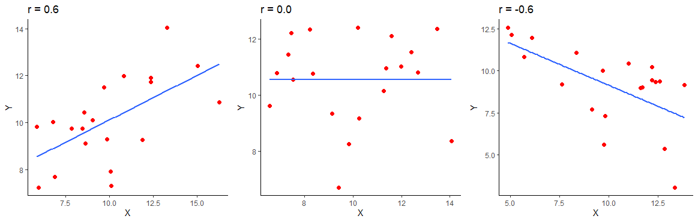
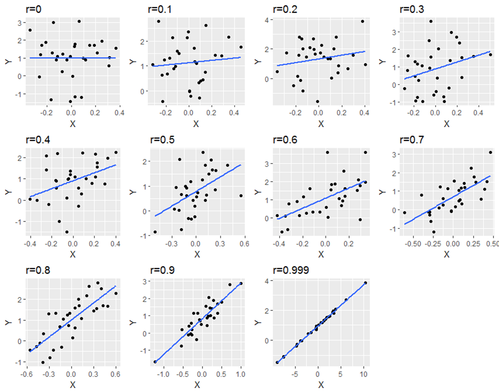
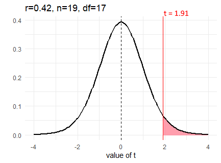
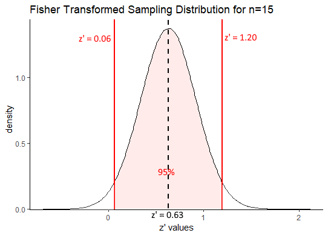
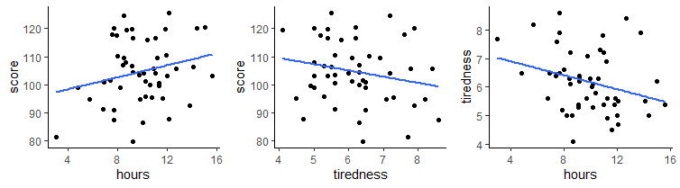
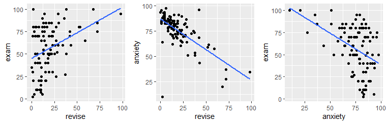

# Correlation

Correlation is the simplest measure of association between two continuous variables. There are a number of different types of correlation measures that will explore in this chapter. All of these measures attempt to define how changes in one variable are associated with changes in another variable.


## Pearson Correlation

Pearson's correlation is measured by $r$ and ranges between -1 and +1.  +1 indicates that the variables `X` and `Y` are maximally positively correlated, such that as values of X increase so do values of Y. -1 indicates a completely negative correlation such that as values of `X` increase, values of `Y` decrease.  A value of 0 indicates that there is no overall relationship.


The below image shows a positive correlation of $r=0.6$, a zero correlation of $r=0$ and a negative correlation of $r=-0.6$ for 20 datapoints in each scatterplot.



<br><br>

The below image shows scatterplots, each with a sample size of 30. The trendline is to help demonstrate how correlations of different magnitudes look in terms of their association.




## Cross-products

The formula for calculating the Pearson's correlation coefficient for a sample is:

$\Large r = \frac{\sum_{}^{} z_{x}z_{y}}{n - 1}$


When we have a population, we can use the formula: 


$\Large \rho = \frac{\sum_{}^{} z_{x}z_{y}}{N}$


Notice that for a population we use a different notation for the Pearson's correlation coefficient.

Essentially, the steps are to convert all the `X` and `Y` scores into their respective z-scores. Then you multiply these two values together to get the `cross-product`.  After summing up all the cross-products for each data point, we divide this number by `n-1` if we're dealing with a sample (we usually are), or `N` if we're dealing with a population.  


The sum of the cross-products will therefore be largely positive if positive z-scores are multiple together or if negative z-scores are multiplied together.  The sum of the cross-products will be largely negative if negative z-scores are multiplied with positive z-scores.


The following example should help make this clearer.  Look at the following data, its  scatterplot and the correlation coefficient.  They show that we have a positive correlation of `r=0.84`.  Let's break it down how we got that value.

```{r, warning=FALSE, message=FALSE}

library(tidyverse)

x <- c(1.1, 1.5, 2.1, 3.5, 3.6, 3.5, 2.6, 5.6, 4.4, 3.9)
y <- c(2.8, 2.9, 1.6, 5.5, 4.7, 8.1, 3.3, 7.7, 7.1, 5.8)

df <- data.frame(x, y)

df

ggplot(df, aes(x = x, y = y)) + geom_point(size=2)

cor(x,y)
```

First, let's calculate the means and standard deviation (using `sd` so a sample standard deviation) of `x` and `y`.  We need to get these values so we can calculate the z-scores of each.

```{r, message=F, warning=F}

# step 1:  Get the mean and sd of x and y


mean(x)
sd(x)

mean(y)
sd(y)
```


Now, we can calculate the z-scores, remembering that the formula for that is:  

$\Large z = \frac{x - \overline{x}}{s_{x}}$

```{r, message=F, warning=F}
# step 2. Calculate z-scores of x, and z-scores of y.

df$zx <- (x - mean(x)) / sd(x)  # z scores of x
df$zy <- (y - mean(y)) / sd(y)  # z scores of y

df

```


Following this, we simply multiple the z-scores of `x` and `y` against each other for every data point:

```{r, message=F, warning=F}
# step 3. Calculate the cross-product:  zx * zy

df$zxzy <- df$zx * df$zy

df

```


We now have all of our cross-products.  Notice why the majority are positive. This is because we have multiplied positive $z_{x}$ with positive $z_{y}$ or we multiplied negative $z_{x}$ with negative $z_{y}$.  This happens because datapoints that tend to be above the mean for `x` are also above the mean for `y`, and points that are below the mean of `x` are also below the mean of `y`.  

We can add this up to get the sum of the cross-products.  That is the $\sum_{}^{} z_{x}z_{y}$ in the formula.

```{r, message=F, warning=F}

# step 4.  Sum up the cross products.

sum(df$zxzy) # 7.58

```

We now divide that by `n-1` as we have a sample, to get the correlation coefficient `r`. That gives us an estimation of the average cross-product.


```{r, message=F, warning=F}

# step 5- calculate 'r' by dividing by n-1. (for a sample)

sum(df$zxzy) / 9   # our n was 10, so n-1 = 9

sum(df$zxzy) / (nrow(df) - 1)  # nrow(df) is more generalizable

# r=0.84

```


Just as a quick second example, here is a work through calculating a negative correlation.  Notice the $z_{x}$ and   $z_{y}$ scores that are multiplied together.  They are largely opposite in terms of signs. This is what leads to a negative sum of cross-products and the negative correlation.  Why?  Because data points that are above the mean for `x` are generally below the mean in terms of `y` and visa-versa.


```{r, message=F, warning=F}

### Example 2.   Negative Correlation.

x <- c(1.1, 1.5, 2.1, 3.5, 3.6, 3.5, 2.6, 5.6, 4.4, 3.9)
y <- c(10.4, 10.0, 8.4, 8.5, 8.4, 6.3, 7.1, 6.2, 8.1, 10.0)

df <- data.frame(x, y)

ggplot(df, aes(x = x, y = y)) + geom_point(size=2)


cor(df$x,df$y) 

```

Here is the code, truncated for space:


```{r, message=F, warning=F}
# Calculate z-scores for each x and each y
df$zx <- (x - mean(x)) / sd(x)
df$zy <- (y - mean(y)) / sd(y)

# Calculate the cross-product:  zx * zy
df$zxzy <- df$zx * df$zy

# let's look at the dataframe
# notice the cross products:
df


# Sum up the cross products and Calculate 'r' by dividing by N-1.

sum(df$zxzy) / (nrow(df) - 1)


cor(df$x,df$y) 

```


<br>

## Conducting a Pearson Correlation Test

Although `cor()` gives you the correlation between two continuous variables, to actually run a significance test, you need to use `cor.test()`.

Let's use some BlueJay data to do this. We'll just use data on male birds.

```{r, message=F, warning=F}
library(tidyverse)
jays <- read_csv("data/BlueJays.csv")
jayM <- jays %>% filter(KnownSex == "M") # we'll just look at Males

nrow(jayM) # 63 observations

head(jayM)
```


Let's say you're interested in examining whether there is an association between Body Mass and Head Size.  First we'll make a scatterplot between the `Mass` and `Head` columns.  We'll also investigate the correlation using `cor()`.

```{r, message=F, warning=F}
ggplot(jayM, aes(x=Mass, y=Head)) + 
  geom_point(shape = 21, colour = "navy", fill = "dodgerblue") +
  stat_smooth(method="lm", se=F)


cor(jayM$Mass, jayM$Head)  # r = 0.58,  a strong positive correlation.

```


To run the significance test, we do the following:

```{r, message=F, warning=F}
cor.test(jayM$Head, jayM$Mass) 

```

This gives us a lot of information. Firstly, at the bottom it repeats the correlation coefficient `cor`. At the top, it gives us the value of `t` which is essentially how surprising it is for us to get the correlation we did assuming we were drawing our sample from a population where there is no correlation.  Associated with this `t` value is the degrees of freedom which is equal to `n-2`, so in this case that is `63-2 = 61`. The p-value is also given. If we are using `alpha=0.05` as our significance level, then we can reject the hypothesis that there is no overall correlation in the population between Body Mass and Head size if `p<0.05`.  

The default for `cor.test()` is to do a two-tailed test.  This is testing whether your observed correlation `r` is different from `r=0` in either the positive or negative direction.  This default version also gives us the confidence interval for the correlation coefficient. Essentially, this gives us the interval in which we have a 95% confidence that the true population `r` lies (remember we just have data from one sample that theoretically comes from a population).

It's also possible however that you had an **a priori** prediction about the direction of the effect. For instance, you may have predicted that Body Mass would be positively correlated with Head Size. In this case, you could do a one-tailed correlation test, where your alternative hypothesis is that there is a positive correlation and the null is that the correlation coefficient is equal to 0 or less than 0.

To do one-tailed tests you need to add the `alternative` argument.

```{r, message=F, warning=F}

# testing if there is a positive correlation
cor.test(jayM$Head, jayM$Mass, alternative = "greater") 

```


```{r, message=F, warning=F}

# testing if there is a negative correlation
cor.test(jayM$Head, jayM$Mass, alternative = "less") 
```

<br>

### Significance Testing a Pearson Correlation

In the above section we demonstrated how to do a one-tailed and two-tailed significance test in R.  Let's discuss a little more the output that is produced from `cor.test()` and what its relevance is.

Most importantly, we need to discuss the observed $t$ statistic and the degrees of freedom. As already described above, the degrees of freedom are equal to $n-2$.  The $t$ value represents how likely it was to get the sample correlation that we got in our sample if the true population correlation was actually $\rho=0$. 


There are several ways to calculate $t$, but here is a nice shortcut formula:

$\Large t = r\sqrt{\frac{n-2}{1-r^2}}$

You'll also see this same formula written like this:

$\Large t = \frac{r}{\sqrt{\frac{1-r^2}{n-2}}}$


So, as an example, if we calculated a correlation coefficient of $r=0.42$ from a sample size of 19, then we could calculate our observed $t$ value as follows:

```{r, warning=FALSE, message=FALSE}

r <- 0.42
n <- 19

tval <- r * sqrt( (n-2) / (1 - r^2) )

tval

```

We calculate the observed $t$ value to be $t = 1.91$.  We can visualize our sampling distribution of possible correlations as a $t$-distribution with degrees of freedom equal to  17 (19-2).
<br>



Like with other t-distributions, we can calculate how likely we were to get our observed value of $t$ by calculating the area under the curve in the tails.  For a positive $t$-value we want to know the area under the curve for values greater than our $t$-value.  That would tell us how likely we were to get that value.  We do this in the same way as with t-tests, using `pt()`. We put in our $t$-value, and our degrees of freedom.  Because `pt()` returns the area under the curve to the left of our $t$-value, we need to do `1 - pt()` to get the area to the right:


```{r, warning=FALSE, message=FALSE}

1 - pt(tval, df=n-2)


```
Therefore, our p-value here is $p=0.04$.  But, be careful.  This is only the p-value for a one-tailed test.  If we are conducting a two-tailed significance test, then we need to account for samples that are as extremely negative as well as extremely positive as our observed value.  We must double the p-value to account for the area under both tails.


```{r, message=FALSE, warning=FALSE}

2 * (1 - pt(tval, df=n-2))

```

Our p-value is $p=0.073$ for a two-tailed test.

Below is a sample of data that actually has a correlation of $r=0.42$ and a sample size of 19.

```{r, warning=FALSE, message=FALSE}

x <- c(-0.73, 0.89, 1.36, -1.30, 1.07,  0.76, -1.32, -1.31,  0.46,  2.09,  0.36, -0.70, -1.34, -1.99, -0.39, -0.51, -0.92,  1.37,  2.31)

y <-c(0.69, 0.29, -0.52, -0.05, -1.08,  0.37, -0.31, -0.33,  0.76,  1.37,  0.91,  0.19,  0.10, -2.00, -1.72, 0.53, -0.52, -0.20,  0.63)

dfxy <- data.frame(x=x, y=y)
ggplot(dfxy, aes(x=x, y=y)) +
  geom_point(size=2, color = "#123abc", alpha=.7)+
  stat_smooth(method="lm", se=F) +
  theme_classic()

```
<br>

Let's look at the output if we conduct a two-tailed significance test on our sample $r$:

```{r, warning=FALSE, message=FALSE}
cor.test(x,y)
```
<br>

We get our correlation of $r=0.42$, degrees of freedom = 17, and observed $t$-value of $t=1.91$.  We also see the p-value of $p=0.07$.

If we were to do a one-tailed test (assuming we had an *a priori* prediction as to the direction of the correlation):


```{r, warning=FALSE, message=FALSE}
cor.test(x,y, alternative = "greater")
```
<br>
Now we see that we get the same $t$- and p-values, but the probability is half as with the two-tailed test.

Additionally the R output of `cor.test()` gives us a 95% confidence interval around our sample Pearson correlation r.  Remember, r is just an estimate of the true population correlation coefficient $\rho$.  Therefore, this 95% confidence interval represents a measure of how certain we are in this estimate. We should use the 95% confidence interval that is outputted when we do a two-tail test. We discuss this in more detail below.

<br>


## Assumptions of Pearson's Correlation

The Pearson Correlation Coefficient requires your data to be approximately normally distributed. To do this we have various options how to test for normality.

Firstly, we could do a Shapiro-Wilk test, which formally determines whether our data are normal. This is done using `shapiro.test()`, where we assume our data are from a normal population if the resulting p-value is above 0.05.  If the p-value is below 0.05 then we have evidence to reject that our data come from a normal population.

With our data above, this would look like this when running the test on each variable:

```{r, message=F, warning=F}
shapiro.test(jayM$Mass)  # P > 0.05, therefore cannot reject null that data is not normal
shapiro.test(jayM$Head)  # P > 0.05, therefore cannot reject null that data is not normal

```


We can also make a QQ-plot for each variable. Essentially what we require from this plot is for the majority of our data to fall on the straight line - especially the datapoints in the middle. Some deviation at the tails is ok.  This plot orders our data and plots the observed data against values on the x-axis that we would expect to get if our data was truly from a normal population.

```{r, message=F, warning=F}
qqnorm(jayM$Mass)
qqline(jayM$Mass, col = "steelblue", lwd = 2)
```

```{r, message=F, warning=F}
qqnorm(jayM$Head)
qqline(jayM$Head, col = "steelblue", lwd = 2)

```

Both of these QQ plots are ok, and indicate normality, as does our Shapiro-Wilk tests. Therefore we would be ok to use a Pearson Correlation test with these data.

What should you do though if either of your continuous variables are not approximately normally distributed? In that case, there are other correlation coefficients and associated significance tests that you could run instead.  We describe these in more detail in Section \@ref(non-parametric-correlations). 


<br>

## Confidence Intervals for r

When we run a correlation on our data we get one correlation coefficient $r$ from our sample. Ideally we would be able to give a confidence interval around this correlation coefficient to describe how certain or uncertain we are in the correlation coefficient.  This is possible to do, but it's a bit long-winded.  Let's look at how it is done.


The main thing to realize is that our sample of data that we calculate our observed correlation coefficient from is technically just one sample that we could have got from a population. We could have picked a slightly different sample, and got a slightly different correlation.  Let's work through this using an example.


Say we have a population of 25,000 subjects (datapoints) and the true population correlation coefficient is $\rho=0.75$ (When we're dealing with a population we use $\rho$ for the Pearson's correlation coefficient rather than $r$.).

This is our population. We have 25,000 rows of `x` and `y` data:


```{r, message=F, warning=F}
dfr <- read_csv("data/popcor.csv")
head(dfr)
tail(dfr)
nrow(dfr)
```


We could plot this to examine the population data:

```{r,message=FALSE,warning=FALSE}
ggplot(dfr, aes(x=x,y=y))+
  geom_point(alpha=.05) +
  theme_classic() +
  stat_smooth(method='lm',se=F) +
  ggtitle("Population of 25,000  r=0.75")

```


We can check the correlation for the population and we find that $\rho=0.75$.

```{r, message=F, warning=F}
cor(dfr$x, dfr$y)
```


If we were interested in trying to find the correlation between `x` and `y` but were unable to measure all 25,000 individuals in the population, we might pick one sample to test.  Imagine we pick a sample size of $n=15$. Let's pick 15 datapoints at random from our population and find out the correlation coefficient $r$ of this sample:


```{r, message=F, warning=F}
set.seed(1) # so we get the same results 

# this code selects 15 rows at random
samp1 <- dfr[sample(1:nrow(dfr),15, T),]
samp1

```


We can make a quick plot of our sample of 15, and calculate the sample correlation:

```{r, message=FALSE}

ggplot(samp1, aes(x=x, y=y)) +
  geom_point(size=2) +
  theme_classic() +
  stat_smooth(method='lm',se=F)

cor(samp1$x, samp1$y)

```

In our sample we get $r=0.80$ which is a little bit higher than our population correlation. What if we take a few more samples of size 15? What would we get for those sample correlations?  Let's do it:

```{r, message=F, warning=F}
samp2 <- dfr[sample(1:nrow(dfr),15, T),]
cor(samp2$x, samp2$y)

samp3 <- dfr[sample(1:nrow(dfr),15, T),]
cor(samp3$x, samp3$y)

samp4 <- dfr[sample(1:nrow(dfr),15, T),]
cor(samp4$x, samp4$y)

samp5 <- dfr[sample(1:nrow(dfr),15, T),]
cor(samp5$x, samp5$y)


```

The next three samples have correlations that are also higher than the population correlation.  The fifth sample we collected is much lower with the sample correlation being $r=0.55$. As you might have worked out by now, if we keep doing this over and over again (thousands of times) we would end up with a **sampling distribution of correlation coefficients**.  Let's do that:

```{r, message=F, warning=F}
#this code is to get 50,000 correlation coefficients from samples of n=15

results <- vector('list',50000)
for(i in 1:50000){
samp <- dfr[sample(1:nrow(dfr),15, T),]
results[[i]] <- cor(samp$x, samp$y)
}

dfr.results <- data.frame(r = unlist(results))

head(dfr.results)
```

Because we now have a sampling distribution of correlation coefficients, we can plot this in a histogram.


```{r, message=F, warning=F}
ggplot(dfr.results, aes(x=r)) +
  geom_histogram(aes(y = ..density..), color = "black", fill = "purple", alpha=.4, binwidth = .01) + 
  geom_density(alpha = 0.7, fill = "mistyrose") + 
  theme_classic() +
  xlab("Sample correlation r") +
  ggtitle("Sampling Distribution of Correlation Coefficients")+
  geom_vline(xintercept=0.75, lty=1, lwd=1, color="red")


```

What is the first thing that you notice about this sampling distribution?  Hopefully it is that it is *not symmetrical*. It is highly skewed. This is because correlation coefficients are bounded between -1 and +1. We do not get an approximately normally distributed sampling distribution (with the one exception being when the population correlation $\rho=0$.  The red line represents our original population coefficient of $\rho=0.75$.

There is however a trick that we can employ to make this sampling distribution approximately normal. We can do something called **Fisher Transform** our sample correlations in the sampling distribution. So for every value of $r$ in our sampling distribution, we can apply the following formula:


$\Large z' = 0.5 \times \log(\frac{1 + r}{1 - r})$


$z'$ is referred to as the Fisher Transformed $r$ value.  So, if we had a sample correlation of $r=0.56$, that would equate to a $z'$ value of $z'=0.63$:

```{r, message=F, warning=F}
0.5 * log( (1+0.56) / (1-0.56) )
```

Alternatively, a correlation of $r=0.75$ would have a Fisher transformed score of $z'=0.97$:

```{r, message=F, warning=F}
0.5 * log( (1+0.75) / (1-0.75) )
```

Notably, a correlation of $r=0.0$ has  a Fisher transformed score of $z'=0.00$:

```{r, message=F, warning=F}
0.5 * log( (1+0) / (1-0) )
```


If we apply this formula to all the $r$ values in our sampling distribution and replot the distribution, it now looks like this:

```{r, message=F, warning=F}
#put Fisher transformed scores into a column called 'zt'
dfr.results$zt <-  0.5 * log( (1+dfr.results$r) / (1-dfr.results$r) )
head(dfr.results)

```


```{r, message=F, warning=F}
ggplot(dfr.results, aes(x=zt)) +
  geom_histogram(aes(y = ..density..), color = "black", fill = "purple", alpha=.4, binwidth = .05) + 
  geom_density(alpha = 0.7, fill = "mistyrose") + 
  theme_classic() +
  xlab("Fisher Transformed z'") +
  ggtitle("Sampling Distribution of Correlation Coefficients")+
  geom_vline(xintercept=0.97, lty=1, lwd=1, color="red")

```

This distribution is approximately symmetrical. The red line here represents the population correlation coefficient of $r=0.75$ which is $z'=0.97$. This is the approximate mean of the distribution. 

The standard deviation of this transformed sampling distribution can be calculated by this formula:

$\Large se = \sqrt{\frac{1}{n-3}}$

So, because we have a sample size of $n=15$ the standard deviation of this sampling distribution is $se = 0.289$:

```{r, message=F, warning=F}
sqrt(1/12)
```

Now we have an approximately normal sampling distribution with a standard deviation, we can start to do similar things to what we did with other sampling distributions such as calculate confidence intervals.


Let's calculate a confidence interval around a sample of $r=0.56$.  What we assume is that the Fisher transformed score of $r=0.56$ is the mean of the sampling distribution. Therefore we assume that $z' = 0.63$ is the mean of the sampling distribution. Because we want to have 95% of the distribution inside the confidence interval, then we want to know which values are 1.96 standard deviations away from the mean. This is because we're assuming the transformed sampling distribution to be approximately normal, and in a standard normal curve 95% of the data is $\pm 1.96$ standard deviations of the mean (see section \@ref(sampling-distribution-of-the-difference-in-sample-means).

The formula is:

$CI_{95\%} = z' + (1.96 \times se)$


In our example, 1.96 standard deviations away from the mean is:

```{r, message=F, warning=F}
0.63 + (1.96 * 0.289)
0.63 - (1.96 * 0.289)
```

We can visualize this as follows:



Our confidence interval in terms of Fisher Transformed z' values is $z' = 0.63[0.06, 1.20]$. One thing we can immediately draw from that is that a correlation of $r=0$ is unlikely to be the true population correlation. This is because when $r=0$, the transformed value is also equal to 0 and $z'=0$ is not within the 95% confidence interval.  Also, it is notable that our true population correlation coefficient of $
rho=0.75$ which equates to $z'=0.97$ is included within the correlation coefficient.  

As with other 95% confidence interval measures, what this really means is that in 95% of our samples we will capture the true population correlation coefficient when we create confidence intervals around our sample correlation coefficient.

Although we can directly determine if a population correlation of $\rho=0$ is within our confidence interval or not, leaving the confidence interval in Fisher transformed $z'$ values isn't that interpretable. Therefore, you can transform $z'$ values back to $r$ values using the following formula:

$\Large r = \frac{\exp(2z')-1}{1 + \exp(2z')}$

So for each bit of our confidence interval, transforming the $z'$ values back to $r$ values we get the following:


```{r, message=F, warning=F}
(exp(2 * 0.63) - 1) / ( 1 + exp(2 * 0.63))

(exp(2 * 0.06) - 1) / ( 1 + exp(2 * 0.06))

(exp(2 * 1.20) - 1) / ( 1 + exp(2 * 1.20))


```


Our 95% confidence interval in terms of $r$ is therefore $r = 0.56[0.06, 0.83]$ which is very wide! but doesn't include $r=0$. If we were to increase our sample size then our confidence intervals would get tighter - and our individual estimate of the correlation coefficient would get close to the true population correlation coefficient $\rho$.

<br>


**Correlation Confidence Interval Example**

Because the above is a little bit tricky, let's look at a second example.  In a study, researchers found a correlation of $r= -0.654$ based on 34 observations. What is the 95% confidence interval of this correlation ?

First, convert the $r$ value to a Fisher Transformed $z'$ value and assume that is the mean of the symmetrical sampling distribution, and we get $z' = -0.78$:

```{r, message=F, warning=F}
0.5 * log( (1 + -0.654) / (1 - -0.654) )
```


Second, we know the standard deviation of this symmetrical sampling distribution is equal to $se = \sqrt{\frac{1}{n-3}}$, so it's equal to 0.1796: 

```{r, message=F, warning=F}
sqrt(1 / 31)
```


Third, we want to know the values of $z'$ that are 1.96 times the sampling distribution standard deviation from the mean, to get the lower and upper bounds of our confidence intervals:

```{r, message=F, warning=F}
 -0.7822566 + (1.96 * 0.1796053)
 -0.7822566 - (1.96 * 0.1796053)

```

In terms of Fisher transformed values, our 95% confidence interval is therefore $z' = -0.78[-1.13, -0.43]$. Notice that 0 is not inside the confidence interval, suggesting that the population correlation coefficient is not equal to 0.

We can also convert all of these back to $r$ values:


```{r, message=F, warning=F}
(exp(2 * -0.78) - 1) / ( 1 + exp(2 * -0.78))

(exp(2 * -1.13) - 1) / ( 1 + exp(2 * -1.13))

(exp(2 * -0.43) - 1) / ( 1 + exp(2 * -0.43))


```

So our 95% Confidence interval is $r = -0.65[-0.41, -0.81]$.  Notice with the larger sample size, we get a much tighter confidence interval.


<br>


## Partial Correlations

An important consideration when running a correlation is the **third variable** problem. In brief, this is when we have the situation that a purported association between `X` and `Y` is actually being driven by both of their association with a third variable `Z`. It is important to consider that a correlation may only exist because both variables are correlated with something else. Alternatively, we may wish to get an "adjusted" correlation between `X` and `Y` based on their relationship with `Z`. This is essentially the theory behind partial correlations.


If we have measured the correlation between `X` and `Y` (which we'll call $r_{xy}$) as well as each of their correlations with `Z` (which we'll call $r_{xz}$ and $r_{yz}$ respectively) then we can calculate this adjusted partial correlation between `X` and `Y` which we'll call $r_{xy.z}$.  To do this, we use this horrible looking formula:


$\Large r_{xy.z} = \frac{r_{xy} - (r_{xz}\times r_{yz}) } {\sqrt{1-r_{xz}^2} \times \sqrt{1-r_{yz}^2}}$

In reality though, it's pretty easy to plug the correct values for $r$ or $r^2$ into this formula and get the result required.


Let's use an example. In these data we have 50 participants who logged the number of hours that they engaged in a task. We also have a column that shows their score in that task, and a column that records how tired they were. Higher tiredness scores means that they were more tired. (We've changed this from the column name in the original video to make it clear!)

```{r, message=F, warning=F}

gs <- read_csv("data/gamescore.csv")
colnames(gs)[4]<-"tiredness" # change this column name to make it more clear

nrow(gs)

head(gs)
```


Say we predicted that the more hours played would lead to a higher score in the task. We might make our scatterplot and then run a one-tailed Pearson's correlation significance test:


```{r, message=F, warning=F}
# scatterplot
ggplot(gs, aes(x=hours, y=score)) + 
  geom_point(color="navy") +
  stat_smooth(method="lm",se=F) +
  theme_classic()


cor.test(gs$hours, gs$score, alternative = "greater")  # p=0.049

```


We can see from this plot that we have a correlation of `r=0.24` between `hours` and `score`, which is a low to moderate correlation. Our one-tailed significance test also tells us that we have a significant difference of `p=0.049` that this is a significantly positive correlation, although the effect is smallish.


What if we considered each of these variables' relationship with `tiredness` ?




We can calculate the Pearson correlation for `tiredness` against `score` and for `hours` against `tiredness`, in addition to our original correlation of `hours` against `score`.


```{r, message=F, warning=F}
cor(gs$hours, gs$score)  # r = 0.24
cor(gs$tiredness, gs$score) # r = -0.21
cor(gs$hours, gs$tiredness) # r = -0.29
```

As you can see, tiredness is negatively correlated with score, meaning individuals who report themselves as more tired scored lower in the task. Hours was also negatively correlated with tiredness, meaning individuals who were more tired spent fewer hours on the task.

It's therefore possible that an individual's tiredness could affect both the number of hours that an individual engages in the task, as well as their overall performance.  These relationships may affect the overall observed relationship between `hours` and `score`.


If we were to do this in R, we'd use the `pcor.test()` function from the `ppcor` package. We just need to tell it what our original `X` and `Y` are as well as our third variable `Z`.


```{r, message=F, warning=F}
library(ppcor)

pcor.test(x=gs$hours, y=gs$score, z=gs$tiredness)

```

This output tells us that the adjust correlation, i.e. the `partial correlation` for $r_{xy}$ is 0.19.  There is a p-value associated with that correlation of `p=0.194` which indicates that the correlation is no longer significant. This means that the relationship between test score and hours is no longer significant after you take into account that they are both related to tiredness.


We can also look at this 'by hand' using the formula above:

```{r, message=F, warning=F}
r.xy <- cor(gs$hours, gs$score)  # r = 0.24
r.xz <- cor(gs$tiredness, gs$score) # r = -0.21
r.yz <- cor(gs$hours, gs$tiredness) # r = -0.29
```


```{r, message=F, warning=F}
numerator <- r.xy - (r.xz * r.yz)
denominator <- (sqrt(1 - r.xz^2) * (sqrt(1  - r.yz^2)) )

numerator/denominator

```

We get the same result!


<br>


## Non-parametric Correlations


When at least on of our variables are not normal, then we need to consider alternative approaches to the Pearson correlation for assessing correlations. 

Let's take this example, where we are interested in seeing if there's an association between saturated fat and cholesterol levels across a bunch of different cheeses:


```{r, message=F, warning=F}

library(tidyverse)

cheese <- read_csv("data/cheese.csv")

head(cheese)

# let's make a scatterplot of saturated fat against cholesterol
ggplot(cheese, aes(x = sat_fat, y = chol)) + geom_point() +
  stat_smooth(method="lm",se=F)

```


It looks like there is a pretty obvious relationship, but let's check the normality of each variable before progressing. Firstly the Shapiro-Wilk tests suggest that our data do not come from a normal distribution:

```{r, message=F, warning=F}
shapiro.test(cheese$sat_fat)  # P < 0.05, therefore data may not be normal
shapiro.test(cheese$chol)  # P < 0.05,  therefore data may not be normal
```

Secondly, we have quite dramatic deviation from the straight line of our datapoints in our QQ plots. This indicates that our data are likely skewed.

```{r, message=F, warning=F}

qqnorm(cheese$sat_fat)
qqline(cheese$sat_fat, col = "steelblue", lwd = 2)

qqnorm(cheese$chol)
qqline(cheese$chol, col = "steelblue", lwd = 2)

```


We could be thorough and check this by plotting histograms of our data:


```{r, message=F, warning=F}

library(gridExtra)

p1 <- ggplot(cheese, aes(x=sat_fat)) + geom_histogram(color="black", fill="lightseagreen")
p2 <- ggplot(cheese, aes(x=chol)) + geom_histogram(color="black", fill="lightseagreen")

grid.arrange(p1,p2,nrow=1)

```


Because our data do not appear to be normal, we cannot do a Pearson correlation coefficient. We should instead use a non-parametric correlation method.  There are several of these to choose from. We don't plan to go into the details here of how these methods determine their correlation coefficients or conduct significance test. In brief, these methods generally rank order the datapoints along the `x` and `y` axes and then determine how ordered these ranks are with respect to each other. 

Probably the most commonly used non-parametric correlation test is called the Spearman Rank Correlation test.

To run this, we can use `cor()` to get the correlation or `cor.test()` to run the significance test in the same way we did the Pearson test. However, the difference here is that we specify `method="spearman"` at the end.

```{r, message=F, warning=F}
cor(cheese$sat_fat, cheese$chol, method = "spearman")      

cor.test(cheese$sat_fat, cheese$chol, method = "spearman") 

```

The correlation coefficient here is 0.87 and is termed `rho` instead of `r`. With the significance test, you get a test-statistic `S` which relates to how well ordered the ranked data are. Also provided is a p-value. As with the Pearson, the default is a 2-tailed test, testing whether the observed correlation could have come from a population with a correlation of 0. If the p-value is below 0.05 (using alpha = 0.05 as our criterion), then that is reasonable evidence that there is a significant correlation. 

You may also notice with Spearman Rank correlations that you are forever getting warnings about computing p-values with ties. Don't worry at all about this - although this is an issue with the test and how it calculates the p-value, it isn't of any real practical concern.

If you were interested in conducting a one-tailed correlation test, you could do that in the same way as you did for the Pearson.  For instance, if you predicted that cholesterol and saturated fat would have a positive correlation, you could do the following to do a one-tailed test:

```{r, message=F, warning=F}

cor.test(cheese$sat_fat, cheese$chol, method = "spearman", alternative = "greater") 

```

You may also notice that the output of the Spearman Rank test does not give confidence intervals for the value of rho.  This is unfortunate and is one of the drawbacks of doing a non-parametric correlation.


Finally, there are several other types of non-parametric correlations you could choose from if you didn't want to do a Spearman Rank correlation.  We personally recommend using a method called `Kendalls Tau B` correlation, which can be done like this:

```{r, message=F, warning=F}
cor.test(cheese$sat_fat, cheese$chol, method = "kendall") 

```

This output gives you a `tau` value which is the correlation coefficient, and a p-value which you can interpret in the same way as the other tests.


<br>

**Ranked Data**


If at least one of your variables of your data are rank (ordinal) data, then you should use non-parametric correlations. 

In the following example, the data show the dominance rank, age, body size and testosterone levels for a group of 18 animals.  Lower numbers of the ranks, indicate a higher ranking animal. An animal with rank 1 means that it is the most dominant individual.

Perhaps with such data you may be interested in seeing if there was an association between dominance rank and testosterone levels. Because your dominance rank measure is ordinal (a rank), then you should pick a non-parametric correlation.


```{r, message=F, warning=F}

test <- read_csv("data/testosterone.csv")

head(test)

ggplot(test, aes(x = drank, y = testosterone)) + 
  geom_point() +
  stat_smooth(method = "lm", se=F) +
  xlab("Dominance Rank") +
  ylab("Testosterone Level") 


cor(test$drank, test$testosterone, method = "spearman") # rho = -0.91

```


If you had the *a priori* prediction, that more dominant animals would have higher testosterone, then you could do a one-tailed test. This would mean that you expect there to be a negative correlation - as the rank number gets higher, the levels of testosterone would fall. In this case, you'd use `alternative = "less"`.

```{r, message=F, warning=F}

cor.test(test$drank, test$testosterone, method = "spearman", alternative = "less") # 1- tailed

```

<br>

**Non-parametric Partial Correlation**

If you look back to section \@ref(partial-correlations) calculate the partial correlation for a Pearson correlation. We also used the function `pcor.test()` from the `ppcor` package to do this for us. We can actually use the same formula or function to do partial correlations for non-parametric correlations.

For example, let's examine the Spearman correlations between anxiety, exam score and revision.

These are the data:

```{r, message=F, warning=F}

exams <- read_csv("data/exams1.csv")

nrow(exams)

head(exams)

```


Using the Shapiro-Wilk test we note that our data are not approximately normal:

```{r, message=F, warning=F}
# note these data are not approximately normal:
# all p<0.05, therefore reject null that they are approximately normal

shapiro.test(exams$revise)
shapiro.test(exams$exam)
shapiro.test(exams$anxiety)

```


We can investigate the individual correlations by plotting the scatterplots and calculating the Spearman correlations:




```{r, message=F, warning=F}
cor(exams$revise, exams$exam, method = "spearman")  

cor(exams$revise, exams$anxiety, method = "spearman") 

cor(exams$anxiety, exams$exam, method= "spearman") 
```

If we were interested in the correlation between revision time and exam performance controlling for anxiety, we would need to do a partial correlation. We can just use the `ppcor.test()` function:

```{r, message=F, warning=F}
pcor.test(x=exams$revise, y=exams$exam, z=exams$anxiety, method = "spearman")
```

Again, we see that the relationship between these two variables is reduced considerably to $\rho=0.13$ when we control for each of their relationships with anxiety.


<br>


## Point-Biserial Correlation

Throughout the entirety of this chapter we've been discussing various correlation measures between two continuous variables. This little subsection is here just to point out that you can in fact also measure the correlation between a categorical variable and a continuous variable. 

In the following dataset, we have data on the number of hours that various cats spend away from their house over a one week period. They are tracked via cool GPS collars, and these data make pretty pictures of how far they traveled from their homes.


```{r, message=F, warning=F}
cats <- read_csv("data/cats.csv")  

nrow(cats)

head(cats)

```

The data have a `time` column that is the number of hours away from home. A `sex` column which is the sex of the cat, and a `sex1` column which is the sex of the cat coded as a number. This final column exists to help us make the dotplot below and to help run a correlation:


```{r, message=F, warning=F}
# dot plot
ggplot(cats, aes(sex1,time)) + 
  geom_jitter(width = .05) +
  scale_x_continuous(breaks=c(0,1), labels=c("female", "male"))+
  stat_smooth(method='lm',se=F) +
  theme_classic()

```

What we have in this plot are individual points representing each cat. The points are jittered to make overlapping datapoints more readable. We have also put a trendline through the data. How was this achieved?   Essentially, all the  females are given the value 0, and all the males are given the value 1. We then run a Pearson's correlation using the `X` values to be 0 or 1, and the `Y` values to be the `time` measurement.

Doing this, we can simply run a Pearson's correlation test using `cor.test()`:

```{r, message=F, warning=F}
cor.test(cats$sex1, cats$time)
```

These results suggests that there is a positive relationship between cat sex and time spent away from home, with male cats spending more time away than female cats.


Looking at the dotplot again, it looks like the female data are possibly bimodal. As the data are in long format, we can filter out the male and female data:

```{r, message=F, warning=F}
catsF_time <- cats %>% filter(sex=="female") %>% .$time
catsM_time <- cats %>% filter(sex=="male") %>% .$time

shapiro.test(catsF_time)

shapiro.test(catsM_time)

```

Clearly our suspicions about the female data are true, they do not appear to come from an approximately normal distribution.  In that case, we could run a point-biserial Spearman correlation. This is just the same procedure, but instead we apply the Spearman test:


```{r, message=F, warning=F}
cor.test(cats$time, cats$sex1, method="spearman") 
```


Just as a note - there are probably 'better' ways of running such a point-biserial correlation than using `cor.test()`, but what we've shown here is probably sufficient to get the idea across that you can convert two groups to 0's and 1's and then run a correlation to test for group differences.
