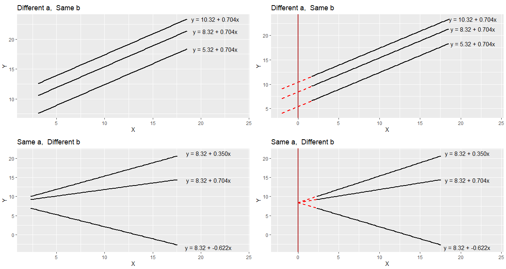
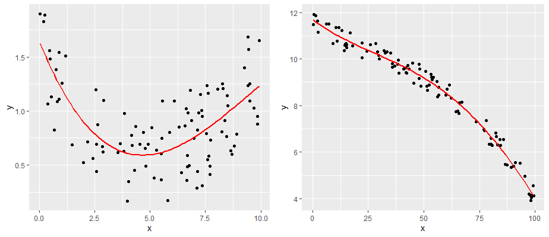
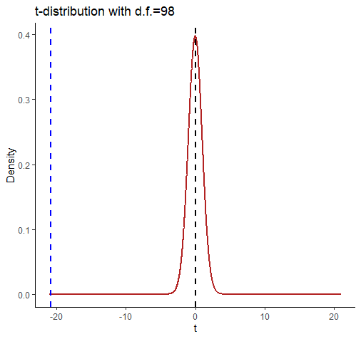

# Linear Regression

With linear regression, we are attempting to further our understanding of the relationship between two continuous variables. In particular, we try to predict the values of the outcome variable based on the values of the predictor variable. In simple linear regression we only include one predictor variable. That is the type of regression that we will discuss in this chapter.


## Introduction to Linear Regression


The regression method that we are going to start with is called *Ordinary Least Squares Regression*. Hopefully the reason why it's called "least squares" will be come obvious, although we're not too sure why it's called "ordinary".


Let's illustrate the question at hand with some data:


```{r, warning=FALSE, message=FALSE}
library(tidyverse)


# Import Data

df <- read_csv("data/parenthood.csv")

nrow(df)

head(df)


```

As you can see, what we have are four columns of data. The first column shows the amount of sleep that Dan got in an evening. The second column relates to the amount of sleep a baby got. The third column is a rating of Dan's grumpiness.  The last column is a day identifier. Each row represents a different day.

Say we're interested in seeing whether there was an association between Dan's sleep and her grumpiness.  We could examine this using a scatterplot:


```{r, warning=FALSE, message=FALSE}
# Scatterplot
ggplot(df, aes(x = dan.sleep, y = dan.grump)) + 
  geom_point() + 
  stat_smooth(method='lm', se=F) 

```

It looks like these variables are clearly associated, with higher levels of sleep being related to lower levels of grumpiness.

To get a measure of how big this relationship is, we could run a correlation test. 


```{r, warning=FALSE, message=FALSE}
cor.test(df$dan.sleep, df$dan.grump)
```

This shows that the variables are highly correlated with r=-0.90.  It's also a highly significant relationship.


Using `stat_smooth()` we also applied a best fitting trendline through the data. This line was actually calculated to be in the position that it is in using regression.

The line also has the equation:

$y' = a + xb$

You may also see this written in other ways such as:

$y' = \beta_{0} + x\beta_{1}$

but we'll stick with 

$y' = a + xb$
	


## a and b	

In the equation for a regression line, 
	
$y' = a + xb$
	
$y'$ is equal to the predicted value of $y$. Essentially if you go from any value of $x$ and go up to the trendline, and then across to the y-axis, that is your predicted value of y.  The trendline represents the predicted values of $y$ for all values of $x$.

In regression terms, we often refer to $x$ as the **predictor** variable and $y$ as the **outcome** variable.

The value of $b$ in the equation represents the **slope** of the regression line. If it's a positive number then it means that the regression line is going upwards (akin to a positive correlation, where $y$ increases as $x$ increases.)  If it's a negative number, then it means that the regression line is going downwards (akin to a negative correlation, where $y$ decreases as $x$ increases).  The value of $b$ can also be considered to be how much $y$ changes for every 1 unit increase in $x$.  So a value of $b = -1.4$ would indicate that as $x$ increases by 1, $y$ will decrease by 1.4.

The value of $a$ represents the **y-intercept**. This is the value of `y'` that you would get if you extended the regression line to cross at $x=0$. 

We can illustrate that in the graph below. We extended the trendline (dotted black line) from its ends until it passes through where $x=0$ (the dotted red line). Where it crosses this point is at $y=125.96$ which is depicted by the orange dotted line.  This makes the y-intercept for this trendline equal to 125.96.

```{r, warning=FALSE, message=FALSE}
# Scatterplot
ggplot(df, aes(x = dan.sleep, y = dan.grump)) + 
  geom_point() + 
  stat_smooth(method='lm', se=F) +
  xlim(-1,10)+ 
  ylim(40,130)+
  geom_abline(intercept =125.956 , slope = -8.937, lty=2)+
  geom_vline(xintercept=0, color='red', lty=2) +
  geom_segment(x=-1.6,xend=0,y=125.96,yend=125.96, lty=2, color='orange')

```


In reality, we do not ever extend the regression lines like this. In fact, a regression line by definition only fits the range of datapoints along the x-axis that we have - it should not extend beyond those points.  This is more a theoretical construct to help us understand where the line is on the graph. 


To think a bit more about `a` and `b` let's compare these regression lines and their respective equations.




In the top left image, you can see three parallel regression lines. These all have the same slope value (b = 0.704).  How they differ is in their y-intercept. The different values of 'a' indicate that they are at different heights.  In the top right, we've extended the regression lines in red back to where the x-axis is 0. Where the lines cross here (x=0) is the value of each y-intercept i.e. 'a'.

In the bottom right image, you can see that all the plots have the same y-intercept value (8.32).  How they differ is in their slope b. Two are positive values of b, with the larger value having a steeper slope. The negative value of b (-0.622) has a slope going downwards. In the bottom right we extend these trendlines back to where x=0, and you can see that all have the same y-intercept (x=0, y=8.32).


<br>

### How to calculate a and b in R

To run a regression in R, we use the `lm()` function. It looks like the following:


```{r, warning=FALSE, message=FALSE}

mod1 <- lm(dan.grump ~ dan.sleep, data=df)  # build regression model

```

The first thing after the bracket is the outcome variable which is `dan.grump`. Then a tilde (~) and then the predictor variable which is `dan.sleep`.  Finally, we tell `lm` what dataset we're using.  The best way to read that statement is: `"dan.grump 'is predicted by' dan.sleep"`.

We're also saving the regression model as `mod1` because there's tons of information that comes along with the regression.

To have a look at what `a` and `b` are, we can just look at our saved object `mod1`.

```{r, warning=FALSE, message=FALSE}
mod1  

```

Here the value underneath "Intercept" (125.956) refers to the y-intercept `a`. The value underneath `dan.sleep`, the predictor variable, is our value of `b` the slope.

So this would mean that the regression line for these data would be:

$y' = 125.956 + -8.937b$


We can also get these values directly by running the following code:

```{r, warning=FALSE, message=FALSE}

mod1$coefficients

```


Now, we should also mention one other thing about these values. These regression coefficients are 'estimates'. We have one sample of 100 subjects from which we estimated the true population values of 'a' and 'b'. The true population values of 'a' and 'b' are parameters. 

<br>


### How to calculate a and b 'by hand'

To think a bit more about these 'a' and 'b' values, we could look at how these values are actually calculated.

First, we calculate 'b'. The formula for this requires knowing the sample standard deviation of the X and Y variables, as well as their Pearson correlation.

$\Large b = r\frac{s_{Y}}{s_{X}}$


So for our example, we'd calculate 'b' like this:

```{r}

r <-  cor(df$dan.sleep, df$dan.grump)

sy <- sd(df$dan.grump)

sx <- sd(df$dan.sleep)

b <- r * (sy/sx)

b

```


Next, we can calculate 'a' using the formula: $a = \overline{Y} - b\overline{X}$ . This requires us to know the sample mean of X and Y. 

So for our example, we calculate 'a' like this:

```{r}
my <- mean(df$dan.grump)

mx <- mean(df$dan.sleep)

a <- my - (b * mx)

a


```


Therefore, we have an equation for our trendline which is `y' = 125.96 + -8.94x`, which means that for every 1 unit increase of sleep, Dan's grumpiness decreases by 8.94.


## Residuals

Once we fit a trendline to the data it's clear that not all the datapoints fit to the line. In fact, almost none of the datapoints are on the line!  This is because the trendline is our prediction of the value of y based on the value of x.  Each datapoint actually is either larger or smaller in terms of y than the regression line. Sometimes it's a bit bigger or smaller, other times it might be a lot bigger or smaller. Occasionally, the predicted value of y might be on the regression line.

Because our trendline isn't a perfect fit for the data, the formula for the regression line could technically be written as:

$y' = a + bx + \epsilon$ 

$\epsilon$ refers to the error, or how far each datapoint is from the predicted value. 

In fact, the difference of each data point from the predicted value is called a **raw residual** or **ordinary residual**. We calculate the size of the residual for each datapoint by the following formula:

$residual = y - y'$

This essentially is the difference of each data point from the predicted value.


### How to calculate the residuals

Using our regression line equation of  `y' = 125.96 + -8.94x`, we can manually calculate the raw residuals. 

Firstly, we calculate the predicted values of y $y'$ for each value of $x$. We can put these back into our original dataframe.

```{r}
X <- df$dan.sleep  # the predictor
Y <- df$dan.grump  # the outcome

Y.pred <-  125.96   +   (-8.94 * X)

Y.pred

df$Y.pred <- Y.pred

head(df)

```


Next, getting the raw residual is simply a matter of taking each observed value of $y$ and subtracting the predicted value of $y$.


```{r}
# so to get the residual,  y - y'
df$dan.grump - Y.pred

df$residuals <- df$dan.grump - Y.pred

head(df)

```


### Visualizing the Residuals

Now we have a raw residual for all 100 datapoints in our data. The following plot is our same scatterplot, but this time we've also added a little red line connecting each observed datapoint to the regression line. The size of each of these red lines represents the residuals.


```{r}
p1 <- ggplot(df, aes(x = dan.sleep, y = dan.grump)) +
  geom_point() +
  geom_smooth(method = "lm", se = FALSE) +   
  geom_segment(aes(xend = dan.sleep, yend = dan.grump-residuals), alpha = .5, color='red') + 
  theme_classic() +
  ggtitle("OLSR best fit trendline")

p1
```


### Comparing our trendline to other trendlines

An important question to consider is why did we end up with our trendline and not some other trendline? The answer is that ours is the 'best fit', but what does that really mean? In short, it means that the best-fit regression line is the one that has the smallest squared residuals.  The squared residuals are calculated by squaring every residual and then summing these all up.

Let's look at this by looking at one possible trendline that we could have used. The one that we'll choose is a trendline that goes horizontally through the data with a y value that is the mean of Y. 

```{r}
mean(df$dan.grump)
```

So, the mean of the Y variable `dan.grump` is 63.71.  Let's put a trendline through our data that is horizontal at 63.71.  The equation for this line would be:

$y' = 63.71 + 0x$


Let's visualize this:

```{r}
ggplot(df, aes(x = dan.sleep, y = dan.grump)) + 
  geom_point() + 
  geom_hline(yintercept = mean(df$dan.grump), color='blue') 
```

It doesn't look like using the mean value of Y is that good a predictor of each datapoint. We could actually visualize how good.bad it is by calculating the residual of each datapoint from this new trendline.  This time each residual is equal to:

$residual = y - \overline{y}$


Let's calculate these residuals, and then graph them on this scatterplot:


```{r}
# we can work out what the 'residuals' would be for this trendline:
df$Ymean <- mean(df$dan.grump)
df$resid_Ymean <- df$dan.grump - df$Ymean  #residual from Ymean
head(df)


## visualize this:
p2 <- ggplot(df, aes(x = dan.sleep, y = dan.grump)) +
  geom_point() +
  geom_hline(yintercept = mean(df$dan.grump), color='blue') +
  geom_segment(aes(xend = dan.sleep, yend = dan.grump-resid_Ymean), alpha = .5, color='red') + 
  # geom_point(aes(y = dan.grump+residuals), shape = 1) +
  theme_classic() +
  ggtitle("Residuals to the mean Y")

p2

```


If we compare both graphs scatterplots side by side, it's pretty clear that our best-fit trendline is doing a much better job of predicting each datapoint's Y value. The horizontal trendline at the mean of Y looks pretty bad for the majority of datapoints - its residuals are much bigger.


```{r, warning=FALSE, message=FALSE}

library(gridExtra)
grid.arrange(p1,p2,nrow=1)

```


 In fact, let's actually quantify the difference in residuals between these two trendlines.
Because we have both positive and negative residuals, if we just added them together we'd end up with 0. In statistics, one common way to make numbers positive is to square them. As we saw with standard deviation, this also has the advantage of emphasizing large values.

What we do to compare our residuals, is to therefore square them.  We call the residuals from our trendline the raw residuals. We call the residuals from the horizontal line the total residuals.


```{r}
df$residuals2 <- df$residuals ^ 2               # raw residuals
df$resid_Ymean2 <- df$resid_Ymean ^ 2           # total residuals

head(df[c(1,3,6,8,9,10)]) # just showing the relevant columns

```

You can see the squared raw residual and squared total residual for the first six datapoints. Ideally, we want the raw residuals to be as small a fraction as possible of the total residuals. If we sum up the squared raw residuals and squared total residuals, we can determine this:

```{r}
SS.resid <- sum(df$residuals2)
SS.resid  #1838.722

SS.tot <- sum(df$resid_Ymean2)
SS.tot    #9998.59

```

As you can clearly see, the summed squared residuals for our best fit regression line are much smaller than the summed squared residuals when using the mean of y as the regression line.


### Coefficient of Determination R2

One way to make these summed squares of residuals numbers more interpretable is to convert them to $R^{2}$.

The logic goes as following. If the trendline is absolutely useless at predicting the y values, then the trendline would have residuals as high as the total residuals. If the trendline is perfect at predicting the y values, then the residual SS total would be 0.

If we look at the sum of the squares of the raw residuals as a ratio of a sum of the squared total residuals then we can work out how well our trendline fits.

We calculate this using the formula,

$R^{2} = 1 - \frac{SS_{raw}}{SS_{total}}$

in the following way:

```{r}
1 -  (SS.resid/SS.tot)   # 0.816   (this is R2)
```

So for our data, $R^{2} = 0.816$. This means that our regression model (and trendline) is a very good fit to the data.

$R^{2}$ ranges from 0 to 1. If its value was 1, then that would indicate that the best-fit trendline perfectly fits the data with no raw residuals. If its value was 0, then that would mean that the best-fit trendline is no better at fitting the data than the horizontal line at the mean of Y. Values of $R^{2}$ that get closer to 1 indicate that the model is doing a better job at estimating each value of Y. We say that the model has a better 'fit' to the data.


There is a way to directly get the value of $R^{2}$ in R. You may remember earlier in this chapter that we ran our linear model using the function `lm()`. We saved the output of this regression model as the object `mod1`.  You can use `summary()` to get lots of information about the regression model.

```{r}
summary(mod1)  # the R2 matches
```

The thing to focus on from this output right now, is the value called `Multiple R-squared`. This gives us the same value of $R^{2}$ that we calculated by hand: $R^{2}=0.816$.  The other value of $R^{2}$ is called `Adjusted R-squared`. This is relevant when you are conducting multiple regression with more than one predictor in the model. We only have one predictor in the model (`dan.sleep`) so we won't talk more about Adjusted R squared here.


Finally, there is a shortcut way in which we can calculate $R^{2}$. It is simply to square the Pearson's correlation coefficient:

$R^{2} = r^{2}$.

```{r}
r <- cor(df$dan.sleep, df$dan.grump)

r

r^2  # same R2 as above
```


## Standard Error of the Estimate

$R^{2}$ is one value that gives us a sense of how well our regression model is doing. Another method to assess 'model fit' is to examine the Standard Error of the Estimate. Unfortunately, this value has a number of names. You'll see it referred to as the Standard Error of the Regression, Residual Standard Error, Regression Standard Error, $S$, or $\sigma_{est}$. We prefer to call it the Standard Error of the Estimate or $\sigma_{est}$.

This is calculated as follows:

$\sigma_{est} = \sqrt{\frac{\Sigma (y - y')^{2}}{n-2}}$


The $\Sigma (y - y')^{2}$ part of this equation is the Sum of the raw residuals squared that we already calculated when calculating $R^{2}$.

We can therefore calculate $\sigma_{est}$ quite straightforwardly in R manually.

```{r}
s_est <- sqrt(SS.resid / 98) # n=100

s_est

```

Therefore $\sigma_{est} = 4.332$ for our model.

It's actually possible to see this value in the output of the summary of the model in R. Here, it's called the 'residual standard error':

```{r}
summary(mod1) 
```


### What to do with the Standard Error of the Estimate ?

What we are generally looking for with $\sigma_{est}$ is a number as small as possible.  This is because what essentially it is a measure of is an approximate estimate of the average raw residual. The question is, how small is small?  This is difficult to answer. One reason is because $\sigma_{est}$ is actually in the original units of the Y-axis (the outcome variable). Therefore it's not as simple as saying that it should be close to 0, because the Y-axis may be in units that are very large. In other ways, having this value in the original units of Y can be quite helpful as it is easy to envisage what the size of the average residual is.

However, a good rule of thumb is that approximately 95% of the observations (raw datapoints) should fall within plus or minus 2 times the standard error of the estimates from the regression line.  We can illustrate this with the following plot:

```{r, warning=FALSE, message=FALSE}
ggplot(df, aes(x = dan.sleep, y = dan.grump)) +
  geom_point() +
  geom_smooth(method = "lm", se = FALSE) +
  theme_classic() +
  geom_abline(intercept = 125.956+s_est+s_est, slope = -8.937, color = 'red', lty=2)+
  geom_abline(intercept = 125.956-s_est-s_est, slope = -8.937, color = 'red', lty=2) +
  ggtitle("Regression with 2 x Standard Error of the Estimate")

```


This is our original scatterplot again. The blue line is still the best fitting trendline. The two dashed red lines are two times  $\sigma_{est}$ above and below the blue line respectively. That is they are 2 * 4.332 = 8.644 units of grumpiness above or below the trendline.

If we count up the number of datapoints that our outside of the dotted red lines, we can see that there are six datapoints out of our 100 datapoints that are just outside, although some of these are very close indeed to the red line. This is probably ok as we're only expecting 95% of datapoints on average to be inside the red lines.


## Goodness of Fit Test - F-ratio

$R^{2}$ and  $\sigma_{est}$ are two calculations that help us determine if our regression model (and trendline) is indeed a good fit to the data. A more formal method is to run a statistical test called the Goodness of Fit Test. To do this we calculate an F-ratio that essentially examines how well our trendline (and model) fit the data compared to the null model which is the model where we use the mean of Y as our prediction.


As a reminder, these scatterplots show the difference in performance of our fitted model (left) compared to the null model (right).

```{r}
grid.arrange(p1,p2,nrow=1)
```


The F-ratio is essentially a method of determining the proportion of residual variance compared to total variance. We can calculate it using the following formula:


$F = \frac{SSM/d.f.SSM}{SSR/d.f.SSR}$

Here, SSM refers to the sum of squares for the model (the model sum of squares). This is equal to:

$SSM = SST - SSR$

That is, it's the difference between the total sum of squares (the sum of the squared residuals for the null model) minus the residual sum of squares (the sum of the squared residuals for the fitted model).

The `d.f.SSM` refers to the degrees of freedom for the model sum of squares, which is equal to the number of predictors in the model. We only have one predictor (`dan.sleep`), so that means the degrees of freedom are 1.

The `d.f.SSR` refers to the degrees of freedom for the raw residuals. This is equal to the number of observations minus the number of predictors minus 1. Therefore it is equal to 100 - 1 - 1 = 98 as we had 100 datapoints (or observations).

Let's calculate this in R. Firstly, we'll calculate the model sum of squares:

```{r}
SS.mod <- SS.tot - SS.resid
SS.mod  #8159.868
```


Next we divide the model sum of squares and the residual sum of squares by their respective degrees of freedom to get the mean sum of squares for each.  $F$ is then calculated by dividing the former by the latter:


```{r}
MS.resid <- SS.resid / 98
MS.resid  #18.76

MS.mod <- SS.mod / 1
MS.mod    #8159.868
 
Fval <-  MS.mod / MS.resid
Fval  #434.9

```

So $F = 434.9$ which is a large value. Larger values indicate that we were less likely to get a difference between the sum of squares for our fitted and null models by chance alone.

Essentially, the observed value of F is compared to the sampling distribution for  F if the null hypothesis is true. The null is that our model (trendline) is no better than random in fitting the datapoints

Whether our $F$ value is sufficiently large can be looked up in an F-table (not recommended), or you can simply let R do the work for you. If you use `summary()` on your saved regression model, it will give you the $F$ value as well as a p-value to go along with it.

```{r}
summary(mod1)
```


You can see from the model output that the F-statistic is given on the bottom row along with the degrees of freedom for the model (1) and the residuals (98). The p-value here is 0.0000000000000022 which is basically 0.  Typically, if the p-value is less than 0.05 we will say that our fitted model is a better fit to the data than the null model. 


## Assumptions of Linear Regression

Even if your model is a good fit to the data, there are still several things you need to check before progressing to examining whether your predictor is 'significantly' (a better term is probably 'meaningfully') predicting the outcome variable.  

The last series of things we need to do is to check whether we have violated the assumptions of linear regression.  In short, here are some of the assumptions that we need to adhere to:

1. Normality - Specifically the residuals are normally distributed.
2. Linearity - We need to be examining linear relationships between predictors and outcomes
3. Homogeneity of Variance (homoscedasticity)
4. Uncorrelated Predictors (only relevant if doing more than one predictor)
5. No overly influential datapoints

Let's discuss each of these in turn.


### Normality of Residuals

One assumption of linear regression is that our residuals are approximately normally distributed. We can check this in several ways.  But first, we should probably own up and mention that there are several types of residuals.  The residuals we have been dealing with from the regression model have been the **raw residuals**. We got these by simply subtracting the predicted value of y from the observed value of y $residual = y - y'$.  However, statisticians like to modify these residuals. One modification they make is to turn these residuals into what are called **standardized residuals**. These are the raw residuals divided by the standard deviation of the residuals. 

You can directly access the standardized residuals in R by using the `rstandard()` function with your model output:

```{r}
df$std_resids <- rstandard(mod1)

head(df[c(1,3,6,11)]) # just showing the relevant columns
```

We can demonstrate that the standardized residuals really are highly correlated with the raw residuals by plotting them on a scatterplot:

```{r}
ggplot(df, aes(x=residuals, y=std_resids)) +
  geom_point() +
  theme_classic()+
  xlab("Raw Residuals")+
  ylab("Standardized Residuals")

```

They are effectively the same - just transformed.  One advantage of standardized residuals is that they can help us look for unusual datapoints with large residuals. While raw residuals are always in the original units of the y-axis, standardized residuals are, well, standardized. Standardized residuals that are greater than 2 or less than -2 are quite large, those that are larger than 3 or less than 3 are very large indeed and should be looked at in more detail.

Let's get back to checking the normality of these residuals.

First up, we could plot a histogram and see if we think it's approximately normal:

```{r, warning=FALSE, message=FALSE}
#a) histogram plot
ggplot(df, aes(x=std_resids)) + geom_histogram(color='white') # possibly ok
```

This looks possibly ok.  It's not **too** skewed, but it can be hard from a histogram with just 100 datapoints to get a sense of the shape.  A second approach would be to use a Shapiro-Wilk test which more formally test whether the data are approximately normally distributed:

```{r}
#b) Shapiro-Wilk test
shapiro.test(df$std_resids)  # shapiro test says normal.
```

Given that the p-value here is above our cut-off of 0.05, this suggests that we have no evidence to reject the hypothesis that our data came from a normal distribution. An easier way of saying this is, our residuals are likely approximately normally distributed.

The other method we can employ to check normality is to use a QQ plot:

```{r}
#c) QQ plot
qqnorm(df$std_resids)
qqline(df$std_resids, col = "steelblue", lwd = 2)  # it's ok

```

A discussion of precisely what these QQ plots are is beyond the scope here. However, in general terms, what we are plotting is the residual against the theoretical value of each residual that we would expect if our data were normally distributed. In practical terms, what we're looking for is that the bulk of our data fit along the blue line. It's ok to have a bit of wobble at the extremes - that just means that our data distribution probably has slightly fat tails.

It's also possible to generate a version of the above plot quickly, directly from the saved linear model object.

```{r}
plot( x = mod1, which = 2 )  # fast way of getting same plot
```


### 2. Linearity ---

The second major assumption of linear regression is that the relationship between our predictor and outcome is linear! So, data that look like the following would not have a linear relationship.





One simple approach is to examine the scatterplot of your predictor (X) and outcome (Y) variables. We already did this, and our data looked pretty linear!  Another approach is to examine the relationship between your observed Y values and the predicted Y values $y'$. This should also be a linear relationship.

Although we calculated the $y'$ values earlier using the formula for the regression line, we can actually grab them directly from the model object with the `fitted.values()` command.  

```{r, warning=FALSE, message=FALSE}
df$Y.fitted <- fitted.values(mod1)

# plot this relationship
ggplot(df, aes(x = Y.fitted, y = dan.grump)) + 
  geom_point() + 
  stat_smooth(method='lm', se=F) 

```


As you can see from this plot, our fitted (predicted) values of Y on the x-axis have a strong linear relationship with our observed values of Y on the y-axis.


### 3. Homogeneity of Variance / Homoscedasticity

The third assumption that we need to check is homoscedasticity (also sometimes referred to as homogeneity of variance).  

What this really means is that the model should be equally good at predicting Y's across all values of X. Our regression model shouldn't be better at predicting values of Y for e.g. small values of X but not for large values of X.

Practically, what this means, is that the size of the residuals should be equal across all values of X.

If we plot the values of X (or the predicted/fitted values of Y) on the x-axis against the residuals (in this case standardized residuals) on the Y-axis, then there should be no overall pattern. We should be equally likely to get small or large residuals for any value of X (or predicted/fitted value of Y). This would mean that any trendline on this graph should be a horizontal line.

```{r, warning=FALSE, message=FALSE}

# if true, this should be a straight line
ggplot(df, aes(x = Y.fitted, y = std_resids)) + 
  geom_point() + 
  stat_smooth(method='lm', se=F) 

```


As you can see, our plot is basically a random scatterplot and there is no overall pattern. That is good, it means we have homoscedasticity.  If we did not have homoscedasticity, then we'd see a pattern in this scatterplot - such as the residuals getting larger or smaller for larger fitted (predicted) values of Y.


You can access a version of this plot directly from the model object like this:

```{r}
plot(mod1, which = 3)
```


There are some more formal tests of homoscedasticity but we don't need to worry about them.


### No Colinearity

This assumption of linear regression only applies when we have more than one predictor in the model. In our model, we do only have one predictor (`dan.sleep`) so we don't need to worry about it. If we had added in another variable into the model, e.g. the amount of hours of baby sleep, then we'd have a second predictor. That means, we're trying to predict `dan.grump` based on both `dan.sleep` and `baby.sleep`.  In this case, `dan.sleep` and `baby.sleep` should not be correlated with each other.


### Unusual Datapoints

There are a number of ways that datapoints could be unusual. We will discuss data points that are:

 i. outliers
 ii. have high leverage
 iii. have high influence

 Generally linear regression models should not be overly affected by individual data points. Usually the category that we most need to be concerned about are points with high influence.
 
 


####  i. Outliers


Outliers are datapoints that are typically highly unusual in terms of outcome Y but not in terms of the predictor X. These will be datapoints that have high residuals.

Let's look at an example dataset. We have a predictor 'x' and an outcome 'y'. With 'y1' we have the same outcome variables, but have removed the value for one datapoint:


```{r, warning=FALSE, message=FALSE}
x <- c(4.1,4.2,5,5.5,6,6.1,6.15,6.4,7,7.2,7.7,8,9.7)
y <- c(3.9,4.3,6,5.9,6.1,11.9,6.3,5.8,7.9,6.4,7.8,8,9.1)
y1 <- c(3.9,4.3,6,5.9,6.1,NA,6.3,5.8,7.9,6.4,7.8,8,9.1)

ddf <- data.frame(x,y,y1)
ddf

```


And here, we're plotting the best fitting regression line in blue. The dotted red line represents the best fitting trendline that we would have if we removed the datapoints that has the y value of 11.9.  The dashed black line shows the distance from this datapoint to the trendline we would have if it was removed. 


```{r, echo=FALSE, warning=FALSE, message=FALSE}
mod.out <- lm(y~x, data = ddf)
mod.out1 <- lm(y1~x, data = ddf)

coms <- coefficients(mod.out1)
coms

x6y <- coms[1] + (x[6]*coms[2]) # to get the predicted value for x=6.1


ggplot(ddf, aes(x = x, y = y)) + 
  geom_point(size=2) +
  stat_smooth(method="lm",se=F) +
  theme_classic() +
  geom_abline(intercept = coms[1], slope = coms[2], color = 'red', lty=2)+
  geom_segment(aes(x = x[6], y = y[6], xend = x[6], yend = x6y), lty=2, alpha=.4)
```

As you can see from this small example, outliers are datapoints that have very large residuals from the trendline. They have an unusually large Y.  Notice though that the slope of the trendline hasn't change too much at all. It is slightly shifted down after you remove that outlier from the calculations, but overall the coefficient of 'b' is similar to before. This type of outlier is not necessarily a big deal.


####  ii. High Leverage

Datapoints that have high leverage are those that have a high influence on the regression line's trajectory, but don't necessarily affect the angle of the slope. They are typically unusual in terms of their X value, but not necessarily in terms of Y, meaning that they don't have to have a high residual.

We can measure the leverage of datapoints using the function `hatvalues()` on the model object. For the scatterplot above, the hat values of each datapoint can be calculated as follows:

```{r}

mod.out <- lm(y~x, data = ddf)

ddf$hat_val <- hatvalues(mod.out)  

ddf
```

As you can see, the 6th datapoint was the outlier but it does not have a large leverage as it's not overly influencing the trajectory of the regression line. Datapoint 13 on the other hand does have a higher leverage. Roughly speaking, a large hatvalue is one which is 2-3 times the average hat value. We can check the mean of the hat values like this:


```{r}
mean(hatvalues(mod.out))

```

So clearly, the 13th datapoint does have a high leverage.


#### iii. High Influence

The third type of unusual datapoint are ones that you need to be most wary of. These are datapoints that have high influence. Essentially a high influence datapoint is a high leverage datapoint that is also an outlier.


Let's look at these example data. We are looking at a predictor variable 'x' against an outcome variable 'y2'. 'y3' is the same data as 'y2' with one datapoint's value removed.

```{r}

x <- c(4.1,4.2,5,5.5,6,6.15,6.4,7,7.2,7.7,8,9.7)
y2 <- c(3.9,4.3,6,5.9,6.1,6.3,5.8,7.9,6.4,7.8,8,6.1)
y3 <- c(3.9,4.3,6,5.9,6.1,6.3,5.8,7.9,6.4,7.8,8,NA)

ddf1 <- data.frame(x,y2,y3)
ddf1
```

Let's plot these data - I'm sparing you the code for this plot:

```{r, echo=FALSE, warning=FALSE,  message=FALSE}
mod.out2 <- lm(y2~x, data = ddf1)
mod.out3 <- lm(y3~x, data = ddf1)
coms3 <- coefficients(mod.out3)
x13y <- coms3[1] + (x[13]*coms3[2]) # to get the predicted value for x=9.7

#scatterplot

ggplot(ddf1, aes(x = x, y = y2)) + 
  geom_point(size=2) +
  stat_smooth(method="lm",se=F) +
  theme_classic() +
  geom_abline(intercept = coms3[1], slope = coms3[2], color = 'red', lty=2)+
  geom_segment(aes(x = x[13], y = y2[13], xend = x[13], yend = x13y), lty=2, alpha=.4)

```

What you can see here is the scatterplot of 'x' against 'y2'.  The blue trendline is the best fit line to the regression of 'x' against 'y2'.  The red dotted line is the regression line when we remove the datapoint at x=9.7.  This datapoint has both high leverage and is an outlier (has an overly large residual).  As a consequence of this, when you remove this datapoint it significantly shifts the angle of the slope of the regression line. That means that the value of `b` changes quite considerably.

Let's add the hat values (measuring leverage) to the data.  We can also add what is called `Cook's Distance` which is a measure of the **influence** of each datapoint.

```{r}
mod.out2 <- lm(y2~x, data = ddf1)

ddf1$hat_val <- hatvalues(mod.out2) 
ddf1$cooks_d <-cooks.distance(mod.out2)

ddf1

```


As you can see, datapoint 12 (x=9.7) has high leverage and it's also an outlier. Consequently it has a very large Cook's Distance. Typically a Cook's distance > 1 requires more consideration about how to proceed with your model.

You can also quickly get a plot of the Cook's Distances of all datapoints from a regression model like this:

```{r}
plot(mod.out2, which = 4)
```


#### Checking Influence:

Let's look for influential datapoints in our Sleep vs Grumpiness Data.  At the beginning of this section, we saved the linear model as `mod`. We can look at the Cook's Distances with the `cooks.distance()` function, or we could just plot them:

```{r}
plot(mod1, which = 4)
```


This plot shows each of our 100 datapoints in the order they appear in the original dataframe along the x-axis. Clearly, looking at the y-axis, all our datapoints have Cook's distances of far below 1, so we are fine to assume that we have no overly influential datapoints.


## Examining individual predictor estimates

After checking if our model is a good fit and making sure that we did not violate any of the assumptions of the linear regression, we can finally move forward with what we came here to do. That is, we can check whether our predictor is meaningfully useful in predicting our outcome variable. This means, is our observed value of `b` sufficiently different from 0? To do this, we use two strategies. First, we can generate a 95% confidence interval around our estimate of `b`. That is the method that we prefer. Secondly, you can run a significance test.


### 95% confidence interval of 'b'.

First, let's do this the easy way. Then we'll work out how we got the 95% confidence interval.  You can simply find this by running the `confint()` function on our regression model object:

```{r}
# easy way - gives us the confidence interval:
coefficients(mod1)

confint(object = mod1, level = .95)
```

This tells us that the lower bound of the 95% confidence interval of `b` is -9.79, and the upper bound is -8.09, with our estimate of `b` being -8.94.  This means that if we were to sample 100 days randomly over and over again and measure Dan's sleep and grumpiness on these days, in 95% of the samples we collect we would have the true population parameter value of `b`.  In lay terms, we can suggest that there is  approximately a 95% likelihood that this true population value of `b` is between -9.79 and -8.09.  The only way to really get the true population value would have been to measure Dan's sleep and grumpiness for every day that Dan has been alive.

In big picture terms, what we can draw from this 95% confidence interval is that the relationship between sleep and grumpiness is highly negative and clearly strong. There really seems to be close to no chance that 0 could be the value of `b` - it is not inside the confidence interval.  In fact, we could generate a ridiculously confidence confidence interval, such as a 99.9999% confidence interval:

```{r}
confint(object = mod1, level = .999999)
```

... and 0 is still nowhere near being included.


How is this 95% confidence interval calculated?  To do this we need to think about those sampling distributions again, and the standard error of `b`.


### Standard Error of b

As we've discussed earlier, our one single estimate of `b` is just one possible estimate. We estimated this value based on our one single sample of 100 days.  However, if we had sampled a different sample of 100 days, we would have got a slightly (or maybe greatly) different estimate of `b`.  If we repeated this procedure thousands of times, then we'd have a sampling distribution of `b`'s. 

This sampling distribution will be t-distribution shaped and has degrees of freedom = number of observations - the number of predictors (1) - 1.  Therefore it is t-distribution shaped with d.f.=98.  If we know the standard deviation of this sampling distribution (which is known as the standard error of `b` - $s_{b}$), then we can create confidence intervals.

However, it turns out that calculating $s_{b}$ is a bit annoying. Fortunately, there is a quick way to find it out by looking at the summary of the model output:

```{r}
summary(mod1)
```

We can see here that $s_{b} = 0.4285$


If you're interested, then this is the formula to calculate $s_{b}$:

$s_{b} = \frac{\sigma_{est}}{\sqrt{\Sigma (x - \overline{x})}}$ 

Here's how we calculate it by hand according to this formula:


```{r}
x_dif <- df$dan.sleep - mean(df$dan.sleep) # difference of each x from mean of x

ssx <- sqrt(sum(x_dif^2))  # square root of the sum of these differences squared

sb <- s_est/ssx  #s_est was calculated earlier

sb   # this is the standard error of b
```


### Calculating 95% confidence interval of 'b' by hand

We can use the following formula to calculate the 95% CI for `b`:

$CI_{95}  = b +/-  t * s_{b}$

As with all confidence intervals, what we do is to presume that our estimate of `b` is the mean of the sampling distribution. Then knowing that the distribution is t-shaped with d.f.=98, we need to find the value of `t` that will leave 2.5% of the distribution in each tail.  We can look that up in R using `qt`:

```{r}
tval <- qt(.975, df = 98)
tval
```

We've now calculated everything we need to for the Confidence Interval

```{r}
b + (tval * sb)  #upper bound

b - (tval * sb) # lower bound
```

As we can see, these match up with the output when using `confint()`:

```{r}
confint(mod1)
```


### Signifcance Testing b

We can also use this sampling distribution to apply a significance test.  Our null hypothesis will be that the population value of `b` is 0. Our alternative hypothesis will be that `b` is not equal to 0.

<br>
$H_{0}: b=0$ 
<br>
$H_{1}: b\neq0$
<br>

Given we know the standard deviation of this sampling distribution, $s_{b}$, we can calculate how far away our observed sample value of $b$ is in terms of how many standard deviations from the mean of 0 it is.  We call this value a t-statistic and it is calculated like this: 

$t = \frac{b}{s_{b}}$

Once we have calculated our t-statistic, then we can determine given the shape of the distribution and the degrees of freedom, what proportion of the distribution is more extreme than our observed value.


```{r}
tobs <- b/sb
tobs  #-20.854

```

Our observed value is therefore $t = -20.854$.


Let's look at this graphically:




This shows the t-distribution for d.f. = 98. It looks very strange because we've extended the axes to -21 and +21. We did this so that we could include a dotted blue line for our observed t-value of -20.854.  Notice that by the time the t-distribution of d.f.=98 gets to close to a value of t=-3  then there is almost nothing left in the tail of the distribution.

Just for completeness, we can calculate what proportion of times we observe a t-value of more extreme (i.e. less than) -20.854 using `pt()`.


```{r}
pt(-20.854, df=98)
```

This essentially gives us a one-tailed p-value of p = 0.00000000000000000000000000000000000004094577, which is very small. To get a 2-tailed p-value we just double this value.

Essentially what we can conclude here is that our one value of `b` is extremely unlikely to have come from a population where `b=0`, and thus we reject our null hypothesis and accept the alternative.


The preceding information was provided to help you think about what's really going on when we calculate the t-statistic. However, it turns out there is actually a shortcut way of calculating `t` using `n` and the Pearson's correlation coefficient `r`.  

It's the following formula:

$t = \frac{r \times \sqrt{n-2}}{\sqrt{1 - r^{2}}}$


```{r}
r <- cor(df$dan.sleep, df$dan.grump)

n <- nrow(df)

(r * sqrt(n-2)) / (sqrt(1-r^2))  # -20.85

```

As you can see from the above code - it works!


