--- 
title: "PSY317L & PSY120R Textbook"
author: "James P. Curley & Tyler M. Milewski"
date: "`r Sys.Date()`"
site: bookdown::bookdown_site
---


```{r setup, include=FALSE}
knitr::opts_chunk$set(echo = TRUE)
```


# Welcome to PSY317 / PSY120R ! 


This book is written to help students enrolled in the University of Texas at Austin **Introduction to Statistics for the Behavioral Sciences** (PSY317L) course or **R Programming for Behavioral Sciences** (PSY120R) led by Professor James Curley.

We hope that the book will be a useful resource to help you learn both R and statistics. If you have any suggestions for improvements, please get in touch with Professor Curley.


## What this book includes and what it doesn't

This is in between a textbook and a study guide. We're trying to build materials that will enable students to quickly find what they're looking for to help them understand these statistical concepts.

This book is primarily aimed at the content in PSY317L and PSY120R, but occasionally we describe concepts that we don't directly cover in these courses.  This is when we feel that it's worth explaining things in a bit more detail for those students that want to know a bit more about a subject.


## How to use this guide

This guide covers the material presented in the video segments. In some parts, we go beyond what is presented. This is to supplement the material and to help you understand the content or to round out some subjects a little more. You will not be tested directly on information that is in this guide if it did not appear in the video segments. Quizzes and tests are only based on the videos. This guidebook is exactly that - an extra reference to help you understand that material and a place to look for help or answers.


## Acknowledgements

This guidebook is built upon the work of several others' teaching materials.  In particular, Danielle Navarro's book [Learning statistics with R: A tutorial for psychology students and other beginners](https://learningstatisticswithr.com/book/). A couple of data examples also come from the book [Discovering Statistics Using R](https://www.amazon.com/Discovering-Statistics-Using-Andy-Field/dp/1446200469) Field's intro to statistics using R.


## References

The following books are all freely available online (like this one!) and are helpful resources. 

For Statistics and R Help:
Danielle Navarro - [Learning statistics with R: A tutorial for psychology students and other beginners](https://learningstatisticswithr.com/book/)


For more on Data Visualization including using R:
Claus O Wilke - [Fundamentals of Data Visualization](https://serialmentor.com/dataviz/)

Hadley Wickham - [ggplot2: Elegant Graphics for Data Analysis](https://ggplot2-book.org/index.html)


For more on using R as a programming language:
Garrett Grolemund & Hadley Wickham - [R for Data Science](https://r4ds.had.co.nz)


## Other places to find help about R and Statistics

With statistics stuff, you can never really have enough resources. Although throughout this course we try to explain difficult concepts in terms we hope all students can understand, sometimes you just need to read or hear about these concepts several times before they sink in. Other times, it's not until somebody else explains it in a slightly different way that it finally finds a home in your brain.  To that end, we recommend looking over some other help tutorials and reading. You certainly don't have to go looking at these materials - but if you feel like hearing a different voice, then these are some that I recommend.


**R stuff**

[Rstudio Cheatsheets](https://rstudio.com/resources/cheatsheets/)
[R Community](https://community.rstudio.com/)
[R Cookbook](http://www.cookbook-r.com/)
[R for Data Science](https://r4ds.had.co.nz/)


**Stats stuff**

[Modern Dive by Chester Ismay & Albert Kim](https://moderndive.com)
[Khan Academy videos](https://www.khanacademy.org/math/statistics-probability)


<!--chapter:end:index.Rmd-->

# Introduction

```{r, echo=FALSE, message=FALSE, warning=FALSE}
library(tidyverse)
```


This chapter will show you how to get started with `R` and `Rstudio`.  

`R` is the programming language. It is what enables us to write code and make things happen.

`RStudio` is the piece of software that we use to make working with `R` simpler. It is a graphical interface.

When both of these are downloaded and installed, we always work by opening `RStudio`. `R` just lives happily in the background and we never need to directly open it.

The first thing to do is to download and install R and RStudio. You should do it in that order - download R first, and then RStudio. The exact steps you need to take for each will differ depending on if you're using a Windows, Mac or Linux. This is explained below.

One extra thing to note. At the time of writing this book, the latest R version is `R4.0.2` and the latest RStudio version is `RStudio.1.3.1056`. These numbers will almost certainly be different by the time you come to install each of these. That's not a problem - just download the most recent version that exists - these will be at the top of the screen at the links we explain below.


## Downloading R

Go to the [R website](https://cran.r-project.org). The first box has options for downloading R for Mac, Windows or Linux. Click on the appropriate link for your operating system.

{width=800px}

<br>

**R for Windows**

For windows users, after you have clicked the appropriate link below, you will see the following screen and you should click on  $\color{blue}{\text{"install R for the first time"}}$.

{width=800px}


After this page, you will see the following page:

{width=800px}


You want to click the link that says  $\color{blue}{\text{"Download R 4.0.2 for Windows"}}$ that is right at the top of the screen. If the version is more recent than 4.0.2, then click on that instead - just make sure it's the link at the very top of the page in the gray box. This will start downloading R. Just follow the instructions. You do not need to change any of the default settings, just click accept for each.  One piece of advice is to try and keep R in a folder on your machine such as `Documents` and don't put it in a cloud folder. We have seen some students have issues when R has been located in cloud folders.

<br>


**R for Mac OS X**

If you have a Mac operating system, then you will see the image below. You want to click on $\color{blue}{\text{"R-4.0.2.pkg"}}$.  If a more recent version of R is available, then the version number will be higher than 4.0.2 - click on this instead.

{width=800px}

Again, follow the instructions. You can accept all the default settings for the installation, you don't need to change anything. It is also best to leave this in a folder located on your machine such as `Documents` and not in a cloud based folder.

<br><br>

## Downloading RStudio
Go to the [Rstudio website](https://rstudio.com/products/rstudio/download/). Scroll down so you see something that looks like the image below. Click **DOWNLOAD** under RStudio Desktop, open source license FREE.

{width=800px}

After you click on that box, you should see something that looks like the below image on the next page:

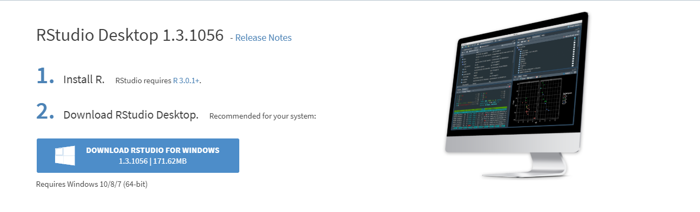{width=800px}

This will name the most recent version of RStudio (here it is 1.3.1056), don't worry if yours is a higher number than this. It will remind you that you should have installed R already (that's the number 1 in the image).  Then it says you should download RStudio Desktop.  It usually gives you a suggested download and that will be in the blue rectangle under point 2.  You can just click that to start your RStudio download.  You can then download the software.

If you don't see that blue rectangle, then you can choose an appropriate installer for your operating system (Mac, Windows, or Linux) from the list that comes further down that webpage. It looks like this: 

{width=800px}


If you have Windows, you will want to click on the first link $\color{blue}{\text{"RStudio-1.3.1056.exe"}}$. If you have Mac, you should click on the second link $\color{blue}{\text{"RStudio-1.3.1056.dmg"}}$.  


Once you have downloaded Rstudio installer, click on it to start the full installation of the program. Again you can just accept all the default settings. We also advise that, as with R, you save RStudio to a location on your machine such as your `Documents` folder rather than in a cloud folder.

<br>

### Successful installation

If you have successfully installed your `R` and your `RStudio` then you can do the following to check that it works. Find the RStudio shortcut on your Desktop, or find RStudio in your programs. Click on the program or shortcut icon to open up RStudio.

The RStudio icon looks like this:

{width=200px}


Alternatively the `R` icon looks like this:

{width=200px}

We always use `RStudio` to start our work, we never need to open `R` or click on the R icon.


Once you have opened `RStudio` it should look something like this:

{width=800px}


<br><br>

## Using RCloud 
[RCloud](https://rstudio.cloud/)

RCloud is a web-based platform for Rstudio, which allows you to perform all visualization and analysis with your data, without downloading Rstudio on to your machine.

We had considered using RCloud as a backup option for students if they had trouble downloading and installing R or RStudio.  However, RCloud has changed a lot of its accessibility options recently and so we are no longer going to use this.


<br><br>


## The RStudio Environment 

Your Rstudio environment is separated into 4 main panes. On your machine these panes by be organized differently. You can also change the order of these panes by going to your tools tab, then clicking Global preferences. 

{width=800px}


First, in the top left, you have a source pane. This is where you will be writing most of your **code**. You will have to run the code, before seeing the output in the console. This pane is important because this is where you can write and save code for future use. 

Second, on the bottom left, there is the Console. All of the code and the code's output that you run from the source panel will show up in the console. You can also directly write code in the console.  However, objects in the console will not be saved. 

Third, you have a Global Environment panel in the top right. When you first open RStudio this will be empty, but it fills up with things once you start working with the code. You will also see some tabs above the Global Environment. You should see the `Environment` and `History` tabs. You may also see other tabs up there including `Git`, `Tutorial` depending on the version of RStudio you have downloaded and what other programs you have on your machine. There are also some other buttons including the `Import Dataset` button above this panel.

Here is an example of a Global Environment where you can see dataframes, matrices, values, and functions that are being worked with: 

{width=500px}

If you click the play arrow next to the dataframe, you can view the entire dataframe. This is the save as running the function `View(df)` (see section \@ref(importing-data)). Another, important button is the broom icon, if you click this it will clear your global environment and you will have to rerun code to get any dataframes, function, etc. back. 

In the `History` tab, you can see all the code that was once ran through your console. This tab can be important, because information in the console is never saved and can be deleted easily. Nevertheless, you should get use to saving your code in **R scripts**, which we'll describe shortly, so you will probably not use this tab to often. 


The fourth pane, is the most compacted and has tabs for `Files`, `Plots`, `Packages`, `Help` and possibly `Viewer` depending on your version. 

The file tab, allows you access all files on your computer. The initial location for this is likely to be the folder that you saved R and Rstudio in - usually `My Documents` or something similar. You can navigate to other folders on your computer using the button with the three dots `...` that looks like this:


That will open up your computers folders and you can click to a new folder.


The Plot tab, will be filled with plots generated from your code. There are buttons right under the tab to Zoom and Export plots. There is also a button which looks like a broom, this will clear the plots. 

The Packages tab, has a User Library which is just a list of all the packages you already have install on your machine. You can also install a package, by hitting the install button and then search for your wanted package. The update button will update all packages you already have installed. 
  
The Help tab, will give you information to help understand different functions and commands in R. You can also call for help with a function right from the console like this:
  
`?t.test`


## Running Code


### The Console

In R, you can code run in the console and an Rscript file.

In the console, the bottom left panel, you type code and run it by hitting `Enter` or `Return` on your keyboard. R will show the results in the console as well. 

You should write this code immediately after the `command prompt` which is a blue `>` sign with a flashing cursor bar after it.  Code written in the console looks like this:

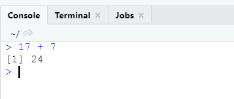

A downside of using the console is that all code and results will be forgotten when the R session is closed. This is why it is better to you use Rscripts. 


<br>

### RScript


To open a new Rscript you can:

1. Click on `File -> New File -> R Script` in the menu bar of RStudio.


2. Click on the button in the toolbar in RStudio that looks like a white sheet with a green plus sign. This is located right under `File` in your Rstudio environment:


3. Hit `"Ctrl"+ "Shift" + "N"` on your keyboard if you have Windows, or `"Command"+ "Shift" + "N"` if you have Mac. 


Once you have opened a new Rscript it will looks like this:


You will see that it says `Untitled1` which means this is a new script file and you haven't saved it yet. You'll also see a gray `1` on the side. This means that that is line 1 of the code. At the moment there is no code.

Here is a script that has a few lines of code in it:


There are a few things to point out here.  First, notice that the gray numbers now go to `11`. This means we have 11 lines in the script.  Some lines start with a `#` sign. These lines contain text (in green in our version) that is not code. After you put a `#` you can write notes to yourself or to others and R will ignore them - it will not run them as code.  Anything else that is written, e.g. the `x <- 3 + 5` and the `x + 1` is in black or blue text and can be run as code.

<br>


### Saving an RScript

To save your Rscript, hit the blue disk icon on the script toolbar and you can name your script. You can save it anywhere on your computer, but probably best to save it in an easy to remember folder. This allows you to come back later to finish working on some assignment even after you have closed the R session.  RScript folders will be saved with an `.R` extension.  

If you open several scripts, they will arrange themselves as tabs and you can click between them. That could look like this:

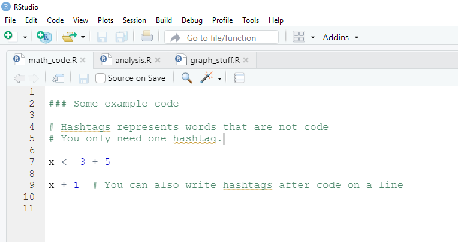

<br>

### Open an existing RScript

If you already have an RScript that you wish to open, you can go to the folder that contains this `.R` file and double click on it to open.  Alternatively, you could hit the folder icon on the RStudio toolbar and use that to locate the file you wish to open.

If it is a file that you have viewed recently, then you can hit the down arrow to the side of the folder icon on the toolbar and it will list your most recent files. You can select the one you want from this list. It will look something like this:


<br>


### Running Code in Scripts
 
There are several ways to run the code in your Rscript file. 

1. You can highlight your code, then hit 'Run' in the top right corner of the script file. 

2. You can click anywhere on the line that contains the code you wish to run, then hit 'Run'

3. You can highlight or click on the code you want to run, then use the keyboard shortcut `Command + Return` on Mac, or `Control + Enter` on Windows. 

4. You can click anywhere on the line that contains the code you wish to run, then use the keyboard shortcut `Command + Return` on Mac, or `Control + Enter` on Windows. 

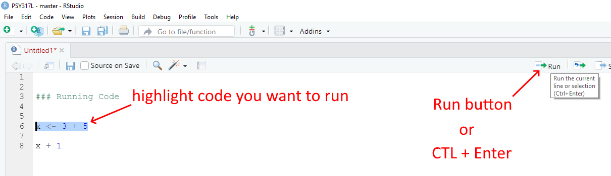


## Packages

When working with R, you will hear about different packages that we will utilize to complete a variety of tasks. A package is a collection of code, functions, and sometimes data developed by members of the R community with the purpose of freely sharing with other R users. We install packages to help us work more efficiently in R. You can think of them as similar to apps you'd download from the app-store.


There are two ways to download packages on to your computer. 

The first way is through the Packages tab in the right bottom panel in your Rstudio environment. In this tab you will see all the packages already installed on your machine.

{width=500px}

Here if you click on install, a box will pop up and your can enter the name of the package you wish to to have then hit install.

{width=500px}

The second way is through one line of code you can write in the console. For example, to just install the `tidyverse` package (which is actually a package that contains many packages within it) you would type `install.package("tidyverse")` into your console like this:


At the beginning of this class, you will be asked to install all the packages that you will need to run the various scripts used in this class. You'll only need to do this once. To do this, please copy and paste the following code in your console and hit enter: 

`install.packages(c("car", "coin", "gridExtra", "lsr", "moments", "ppcor", "psych", "rcompanion", "tidyverse"))`

Your Console should look something like this

{width=500px}

After you do that, your console should start spurting out lots of red, blue and black text. This may take a while (up to 10 minutes) to complete.  You may get a prompt that shows up asking you if you want to `download from source` or some such statement. It's ok to hit `Y` in the console if asked there, or to hit `OK` or `Yes` on the dialog box that pops up. If this question doesn't arise, then that's fine.


It should look something like this during the middle of the installation:


If it has finished installing the packages successfully, then you should see something like this at the end:


To test whether the main package that we will use `tidyverse` is downloaded correctly, then type the following in the console after the blue >

```{r, eval=F}
library(tidyverse)
```

You should see something like the following appear - the red X under "Conflicts" are ok in this instance (they are just saying that the functions `filter()` and `lag()` are used by more than one package:

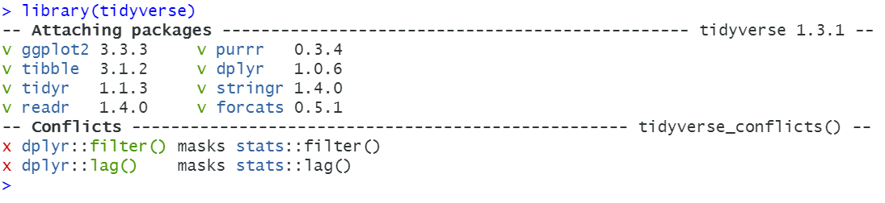


If you have any issues with the installation process then please reach out to a TA or Professor Curley through the discussion page. We will get back to you and help.


## Working with RStudio in PSY317L 

For this course, all the files that you will need to work with are contained in a single folder. This contains what's called a `project folder` in RStudio.  To get this folder, you need to download the `PSY317L_files.zip` zip folder from Canvas.  Once you have done that, double click the folder to extract all the files. The top level should just be a folder called `PSY317L`. If you click on that folder to open it, you should see the folders and files in the image below.

Next, move that folder to somewhere on your computer. Ideally in your `Documents` folder would be the best place. Please check that if you click on that folder you see these folders and files. Importantly, you should see one file that is an `RProject` file called `PSY317L`. It will have a blue transparent cube icon with an R inside of it.


For our course, the best way to access the R files is to hit the blue Rproject icon `PSY317L`. Once you click that, RStudio should automatically open and you should see something like this:


Notice the red squares that we've added to the image. These all say `PSY317L` and indicate that you're working in the PSY317L RProject. You should also see the blue R cube in various (three) places on your Rstudio.

Finally, you should see in your `Files` tab in the bottom right a list of all the files and folders that you will need in this course. 

To open any individual file, you just need to click on the appropriate folder. So, if we wanted to open the file `paired_t_test.R`, we would click on the `Statistics` folder and then click the `paired_t_test.R` file. Then our RStudio would look like this:

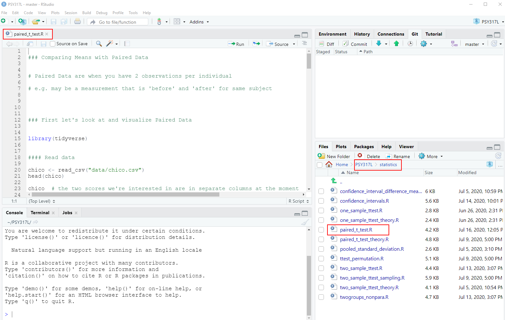

Notice that the file has opened up in the top-right panel. To navigate back to the top folder that contains all our folders, you can hit the `PSY317L` label next to `Home` highlight in the red box.

To close a file, just hit the `x` next to the file name in the top-right panel.


 
## Quitting RStudio

The easiest way to close working with RStudio is to hit the `X` in the top right corner of RStudio. If you have not done any work, this will just quite the program immediately. If you have been working with any RScript file and have made changes but have not saved it yet, then you'll get the following prompt:


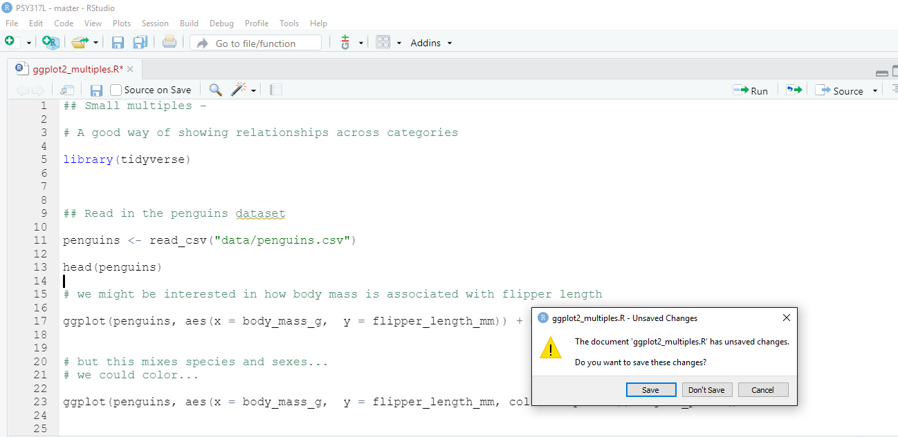{width=800px}


It is asking you `The document xxx.R has unsaved changes.  Do you want to save these changes?`. Most of the time you'll want to hit `Save` and then it will quit.

If you have saved all your RScript files, but you also ran code and perhaps have some things still present in the global environment (e.g. dataframes) or your have plots in your Plot window, you may get the following prompt:

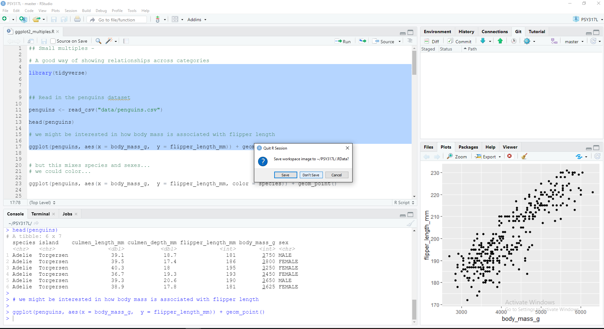{width=800px}


It asks you `Save workspace image to ~/PSY317L/.RData?`. You can safely hit `Don't Save` for this to just quit RStudio.


<!--chapter:end:01-Introduction.Rmd-->

# Basic Syntax

Before we move forward it is important to know a little bit of R syntax. This chapter contains lots of information about how R is organized and works. Don't feel like you have to learn all of this now. This chapter is here for reference and for help. Also, these nuts and bolts of programming languages are things that you pick up over time - they are pretty hard to remember at first and you constantly do have to check and copy/paste things. That's ok. Another very helpful resource on basic syntax in R is [Chapter 3 of Danielle' Navarro's book](https://learningstatisticswithr.com/book/introR.html) which we highly recommend.


## Simple mathematical syntax

R is, first and foremost, a statistical programming language. So, unsurprisingly, you can do a bunch of mathematical operations fairly easily. Let's do some really tedious math:


You can add with the `+` key:

```{r}
4 + 6
```

You can see that the output returned `10` indicating that that is the answer to `4 + 6`.  However, we also see in the output a `[1]` before it. What does this mean?  This is an index - which we'll talk about in more detail later- but essentially all it is telling us is that the number that comes directly after it is the first bit of the output. We only have one thing in our output here - the number `10`, so it's pretty pointless - but it does have relevance in the future.  For now though, you can safely ignore it.


Subtracting uses a hyphen or minus key `-`:

```{r}
43 - 18
```

Multiplying uses the asterisk `*`:

```{r}
5 * 3
```

Dividing uses this slash key `/`:

```{r}
34 / 7
```


You can square root like so by typing `sqrt()` and putting your number to square root in the brackets:

```{r}
sqrt(45)
```


Squaring a number requires us to use the cute `^` key followed by a number `2` to indicate that we are raising to the power 2 (which is squaring):

```{r}
12^2
```


We can also get the logarithm of numbers:

```{r}
log(12)
```

*Our first little warning*

Like all programming languages, R will only do what it's told. One thing that catches people out is that it will read code in order from left to right.  So, if you're doing several things at once, you may need to insert brackets to make sure that it does what you want it to.  For instance, say you want to multiply 5 by the sum of 7 and 9.

You might write that like this:

```{r}
5 * 7 + 9 
```

but `44` is not the answer you're looking for!  What it has done is to take 5, then multiply it by 7 (makes 35) and then add 9 to make 44. 


OK, how about you write it like this instead:

```{r}
7 + 9 * 5
```

Erm, this time it multiplied 9 by 5 to get 45 and then added 7 to make 52.  What is happening is that some mathematical operations are taking precedence over others and R does things in certain order. To explicitly make sure that it does what you want, insert some brackets like this:


```{r}
5 * (7 + 9) 
```

Now it **knows** that what you wanted to do was to add 7 and 9 to get 16 and have that number multiplied by 5 to get 80.  This sort of thing is something to look out for, but as you get experienced you'll have a sense for it. Well placed brackets can save you a headache.


## Assignment

e.g. what the assignment operator is.

This symbol `<-` which is just a "less than sign" followed by a "hyphen" is called an assignment operator. It basically is equivalent to saying you want to save something.  You write what you want to be saved on the right hand side of it, and the name of your newly saved thing on the left of it.  We call the 'thing' that you've saved an 'object' in programming speak.

For instance, say you wanted to save the number `17`, and you wanted to call that saved number an object called `x`. You'd do it like this:


```{r}
x <- 17
```

Now, whenever you type, `x`, R thinks that it is the number 17.


```{r}
x 
```


We should probably fess up right now and tell you that there is another way that you can assign things in R. On the face of it, it's a much easier way too, but we're going to recommend you don't do it. The only reason that we're bringing it up at this point is that if you look up help on the internet or in some books, you'll see people doing it - so we should mention it.

You can assign using the equal key `=` like this:

```{r}

y = 10 - 2

y
```

So, as you can see, we created an object called `y` that was equal to 10 minus 2, that is 8. Using `=` seems so much easier than using `<-` so what is the reason not to do it?  Well, the equal sign gets used for a ton of other commands and sometimes it gets a little messy and confusing if too many equal signs fly around.  Therefore, we're going to politely ask that whenever you assign things, please use the `<-` operator, even though it's two bits of punctuation stuck together:

```{r}

hooray <- 17 + 4  # thanks for using this sign
hooray
```


## Vectors

Of course, you can save even more complex things as the object. For example, if you wished to save the numbers `5, 6, 7, 8, 9, 10`, you have two ways of doing that.  Let's just see them in action, and then we'll explain the syntax:

```{r}

v1 <- 5:10

v1

v2 <- c(5,6,7,8,9,10)

v2

```


As you can see both `v1` and `v2` are our newly saved objects and they both contain the numbers 5 through 10.  For `v1` we separated the numbers 5 and 10 with a colon `:`.  In R, the `:` sign can be used to mean "to" when talking about a series of numbers. e.g.

```{r}
5:10

101:103
```


The other way we did it with `v2` was to use the `c()` function. This stands for `concatenate` which is a mouthful.  Basically, it's a way of sticking things together.  You write `c()` and then put the stuff you want to stick together inside the brackets, but make sure you separate each thing by a comma `,`.  For example,

```{r}
c(1,10,100,1000)

c(4,6,8,10,8,6,1)

```


Another bit of terminology might be worth mentioning right now.  Our saved objects `x`, `v1` and `v2`, as well as being called `objects` can also be called `vectors`.  A vector is something in R that contains several items. These items are actually called `elements`.  Importantly the items are indexed, which means that they are in order, not all jumbled up.  That means that you can directly grab an element by it's position.  So, if you wished to get the first element (or item) of the object `v1` you'd type like this:

```{r}
v1[1]
```

That returns '5' which was our first element we put into the vector.

If we wish to get the 3rd element of `v1` we'd do this:

```{r}
v1[3]
```

And, if we wished to get the first, second and third element of `v1` we'd do this:

```{r}
v1[1:3]
```


We can also get non-consecutive elements of vectors. If we wanted to get the first, fourth and sixth elements of `v1` we'd do this:

```{r}
v1[c(1,4,6)]
```

Notice here that you can't do this:

```{r, error=TRUE}
v1[1,4,6]
```
You have to put the indexes of the elements you want inside `c()` and separate each with a comma, if they are non-consecutive.

Be careful to make sure you're referring to elements that actually exist. The vector `v1` has six elements in total, so if you ask it to give the seventh element, then you get the following:

```{r, error=TRUE}
v1[7]
```

It just says `NA`. This is R for "nothing" or "doesn't exist" or "missing".  You'll also see `NaN` in some situations to represent missing data.


That's quite a lot about vectors, their elements, and how to index them. Hopefully the below image will help you remember this terminology:


**Working with Vectors**    
    

Now, one of the great advantages of vectors is that you can do things to all of the numbers inside the vectors at once.  For instance, say we wanted to square all the numbers inside of `v1`, then all we need to do is:

```{r}
v1^2
```

and notice how it squared the numbers 5 through 10 that are the contents of `v1`.


You can also do things to the entire contents of a vector at once.  For instance, if you wanted to add up all the numbers in `v1` you could do this by using the function `sum()` like this:

```{r}
sum(v1)
```

and it added `5+6+7+8+9+10` to give one answer!


You can also use the names of the vectors together. For example, if you do `v1 + v2` let's see what happens:

```{r}
v1

v2

v1 + v2

```

You can see that it added the first element of each vector to each other, then the second element of each vector to each other and so on.  This only works though because `v1` and `v2` are the same length. If they had unequal number of elements, R would get mad and not do anything.


## Characters

The vectors that we've been looking at so far are all `numeric` meaning that they contain numbers. Another type of information that R uses is text - or `characters`. Sometimes called `strings`.  Let's make a vector of characters:

```{r}
the_week <- c("Monday", "Tuesday", "Wednesday", "Thursday", "Friday", "Saturday", "Sunday")

the_week

```

Here we have an object called `the_week` that has 7 elements. Each element is separated by a comma. This is pretty similar to when we enter numbers except for situation when we can use the `:` shortcut such as using `5:8` to mean `5, 6, 7, 8`.  We also stick everything together into a vector using `c()` as we did with numbers.  The major difference is that to make sure R knows that each of these words is a character or text string, we have put quote marks around each word.  If we didn't do that, it would be looking for objects called `Monday`, `Tuesday` etc.  

Actually, let's see an example of using words to create a vector, when the words are actually objects:


```{r}
aa <- 5
bb <- c(9, 11)
cc <- 10
dd <- c("james", "tyler")
ee <- "hedgehog"

aa
bb
cc
dd
ee


example <- c(aa, bb, cc, dd, ee)

example

```

Here, each of `aa` to `ee` is assigned to be an object and they contain information. When we write `c(aa, bb, cc, dd, ee)` we don't need to use quotes as we're referring to the objects and not to words called `aa`, `ee` etc.  Also notice that we were able to make vectors that mixed together numbers and characters.  Also, some of our original vectors like `bb` and `dd` contained more than one element. When we put them all together with `c(aa, bb, cc, dd, ee)` to create the `example` object, R just stuck them all together in the order we wrote.


It's pretty unusual though to mix numeric and character vectors together.  Let's get back to talking about vectors that contain characters only.

Some functions can work on both character vectors and numeric vectors. One example is `length()` which counts the number of elements in a vector:


```{r}

v1

the_week

length(v1)

length(the_week)
```

However, some functions only make sense when working with one type or the other.  For instance `sum()` to add up the elements of a vector, only works with numeric data:

```{r}
sum(v1)
```

If you try it with character data, then it will give you an error:

```{r, error=TRUE}
sum(the_week)
```


Others work with characters. For example, `nchar()` calculates the number of letters in a piece of character text. Applying it to a vector will tell you how many letters are in each of the days of the week:

```{r}
nchar(the_week)
```

If you try this with numeric vectors, it gives you a funny output of how many characters are in each number!

```{r}
nchar(v1)
```


Regardless of whether you are using numerical or character vectors, indexing works in the same way.

e.g. To get the 3rd element of each vector:

```{r}
v1[3]

the_week[3]

```


e.g. to get the 5th and 5th elements of each vector:

```{r}
v1[5:6]

the_week[5:6]
```


e.g. to get the first, fourth, and sixth element of each vector:

```{r}
v1[c(1,4,6)]

the_week[c(1,4,6)]
```


## Naming of objects

One of the hardest things in R is deciding what to name things. You run out of ideas very fast! There's only so many times you can call things `x` or `df` or `v1` before you get bored. The best names tend to be short and memorable. If you were saving a vector of color names for example, you might want to call it `mycolors`:

```{r}
mycolors <- c("mistyrose", "dodgerblue", "pink")
```

There are some important rules for the naming of objects. These are some DOs and some important DON'Ts:


- you can use characters or numbers in object names, or both

- do not use spaces

- try to use lower case ideally

- do not start an object name with a number

- do not use any punctuation in names for objects, dataframes or column names except for the period `.` or underscore `_`. Everything else is forbidden.

- if you do use an underscore `_` it cannot go at the beginning, e.g.

```{r, error=TRUE}
_mynumber <- 17
```

- you can use a period `.` at the beginning of an object name, but please don't.

- periods `.` and underscores `_` are best used in the middle of object names to help read the name, e.g.

```{r}
prime_numbers <- c(1,3,5,7,11,13)
prime_numbers
```

- but even better, use short object names!

```{r}
primes <- c(1,3,5,7,11,13)
primes
```


- you should avoid using certain words, as they have other meanings in R and calling something else by that name could confuse things. Examples of words to avoid: `if`, `else`, `repeat`, `library`, `break`, `while`, `stop`, `function`, `for`, `in`, `next`, `TRUE`, `FALSE`, `NULL`, `Inf`, `NaN`, `NA`, `data`, etc.  That still leaves a lot of words you can use.

Usually when you start to write one of these words in R, you'll notice that they change color in the script (to which color depends upon your color settings) - this indicates that these words are 'special'.

- for the same reason, there are several letters that I would avoid using, because they have special meaning: e.g.  `c`, `t`, `T`, `F`.  The last two are short for `TRUE` and `FALSE`.  We've already seen `c()` in action. `t()` means to transpose data. You might find that we've called some objects of numbers `t` in this course - sorry in advance if we broke this 'rule'.


## Logical Operators

The R language contains several bits of punctuation that can be used for what's termed 'logical operators'. These will lead to an output of either `TRUE` or `FALSE` being printed to the console. It's easiest to work out what they do by just seeing them in action:

```{r}
"is equals to"

2+2 == 4
2+2 == 5
```

The double equals sign `==` checks if the left hand side is equal to the right hands side. In the top example, 2+2 does equal 4 so we get a `TRUE`, while in the bottom example, 2+5 does not equal 5 so we get a `FALSE`.

You don't have to check one thing at a time. You could check all elements of a vector at once:

```{r}
x <- c(5, 10, 15, 10, 1, 11, 10)
x == 10

```

Here it is saying which elements of `x` are equal to 10 or not.


If you want to ask whether something is `not equal to` something, then you use `!=` like this:

```{r}
x <- c(5, 10, 15, 10, 1, 11, 10)
x != 10

```


Other logical operators are `<`, `<=`, `>` and `>=` and can be used in the usual mathematical way:


```{r}
x <- c(5, 10, 15, 10, 1, 11, 10)

x < 10

x <= 10

x > 10

x >= 10


```


You can also add up the logical output.   Say you wanted to know how many of your vector of `x` were equal to 10. You can use `sum()` to add up. With the `TRUE` AND `FALSE` output, `sum()` will count up the number of `TRUE`s you have. (It considers `TRUE` to be 1's and `FALSE` to be 0's)

```{r}
x <- c(5, 10, 15, 10, 1, 11, 10)
x == 10

sum(x==10)
```


**Indexing Vectors with Logical Operators**

This is all a bit abstract and vague as to why we should care about logical operators. One common situation we use them is when we want to subset vectors. Remember, we use the square brackets `[]` to index a vector like this:


```{r}
x <- c(5, 10, 15, 10, 1, 11, 10)

x[5]

x[1:2]
```

Above we first got the 5th element of `x` and then we got the first and second elements of `x`.  We can also grab things from vectors using logic. Effectively keeping those elements that give the output `TRUE` in response to the logic statement. Here are examples:

```{r}
x <- c(5, 10, 15, 10, 1, 11, 10)

x[x==10]

```


```{r}
x[x!=10]

```


```{r}
x[x>10]

```


Another funky piece of syntax that comes in useful from time to time is `%in%`. You can basically use it only keep those elements that match those that exist inside another element.


```{r}
stuff <- c(1, 5, 15)
x[x %in% stuff]

```


## Some things that are useful to know.

**whitespace**

R doesn't, on the whole, care that much about whitespace - this is space that is between code. It just ignores it.  For instance, all of the following give the same result (what's happening here is that `a` and `b` are `vectors` that each have three `elements`. Telling `a+b` will make it add the first element of `a` to the first element of `b` and then the 2nd element of `a` to the 2nd element of `b` and so on:

```{r}
a <- c(1,2,3)
b <- c(4,5,6)
a + b
```


```{r}
a<- c(   1,            2,     3)
b <- c(4,5,6           )
a +              b
```


```{r}
a <- c(1    ,2,   3)
b <-    c(    4,5  ,6)
            a +    b
```


Hopefully, you get the point.

You can also leave whitespace across lines and R will, for the most part, jump to the code ahead and not worry about the whitespace. This example looks ugly because the commas, numbers, and brackets are all on different lines, but R reads it ok:

```{r}
x <- c(  
  
   4, 5, 
       
       
       3,    6
       
       ,   14
       )


x
```

Although this is possible. Please, please, don't do it!  It's ugly to read, and what's more, there are situations in which it can cause you problems.


Indeed, there are some important place where whitespace needs to be adhered to.

Firstly, when using the assignment operator `<-`. R cannot stand it if you put a space in between the `<` and the `-`. e.g.

```{r, error=TRUE}
eg < - 5:10
eg
```

It is stating here that `object 'eg' not found` because it thinks you're trying to ask it if `eg` is `less than` `-5:10`.    If `eg` already existed, then you need to be extra careful here. We won't go into what could happen in that situation, but it could be bad!  So, golden rule,  no spaces with `<-` !


Secondly, in future sections on carpentry and visualization, you'll use some syntax that `pipes` or chains together a series of commands. These operators are `+` or `%>%`. When using this syntax, you need to finish each line (expect the last line) with one of these pipe syntaxes. If you do not do that, you'll get an error message, because R won't jump to the later lines when it is chaining things together.  Although this might be a bit early in your R journey to mention - it is such a frequent error, that we just wanted to reference it here.  Hopefully, this will be a useful reference aid if you see this error.


Here's a simple example of what this looks like. 

```{r, error=TRUE}
x <- c(3, 5, 6, 7, 4, 6, 5, 10, 4, 5, 7)

x 
%>% unique
  

```

Here we get an error message saying `Error: unexpected SPECIAL in "%>%"`. What has happened is that R read the lines where we assigned the numbers to `x` and then on the line that just had `x` it printed out the numbers.  Then when it got to `%>% unique` it didn't know what this was referring to. When using chain syntax such as `%>%` you cannot start a new line with it. Instead you should write:

```{r}
x <- c(3, 5, 6, 7, 4, 6, 5, 10, 4, 5, 7)

x  %>% unique
```

Now, it has processed the code appropriately and the output is what we want. Basically, we took our vector of `x` and extracted all the unique numbers.

A golden rule should be - be neat with your code !!! and this will avoid a lot of errors and problems.


**Other common errors**


*Close your brackets*

Missing commas or brackets might be the most common errors! You will get an error message though, and it usually will tell you what you did wrong.  Also, when you start to type `(` RStudio will automatically autocomplete to write `()` which helps you to not forget to close your bracket.  

```{r, error=TRUE}
a <- c(4, 4, 2, 7
```


When you forget to close your brackets, but you run your code anyway, you'll notice that in your console you get a flashing bar and the cursor still has a plus sign like this :

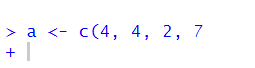


This is telling you that it's waiting for something else to finish the code. It expected you to close your brackets!  If you do this and you want to reset to get back to the `>` cursor sign (which means it's ready for action), then just click next to the plus on the flashing `|` and hit `Esc` key.  This should reset it to the `>` cursor, and look like this:


*Don't forget commas*


Commas need to be watched out for too.  They are usually used to split separate items up, such as numbers in a vector or arguments in a function (see section \@ref(functions)).  Missing them out can cause issues! For instance, here we are trying to make the vector `b` have the numbers 3, 6, 9 & 10.  But the way we write it, R might think we mean 3, 6 & 910 because we forgot the comma. Remember, R often ignores spaces. Fortunately, R catches it because it 'knows' numbers need to be paid attention to - and suggests that you've missed out a comma. Well, technically it tells you `Error: unexpected numeric constant in ....` which doesn't help much - but it's because we forgot the comma.

```{r, error=TRUE}
b <- c(3, 6, 9 10)

```


RStudio can help you as you write code. During most of this course, you will be following code already written by us. However, in the `try for yourself` examples, you'll have to fill in blanks.  Whenever there is an issue with code and it won't run, RStudio flags this for you as soon as it realizes. It will give you a big red circle with an X inside of it.  These appear in your script. You can see an example below for our problems with missing brackets and commas.


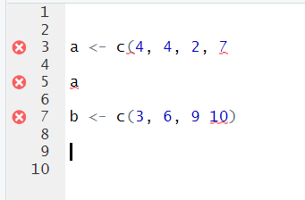


Another thing that often happens with commas, is that people forget to put something in between them. Here's this issue:

```{r, error=TRUE}
x <- c(5,  8, )

```

You get warned that one of your `arguments` are empty. If you scroll away from your code, you'll get the X in the red circle telling you something is wrong.  If your cursor is still by your code, you may get a yellow warning triangle telling you to beware, similar to this:

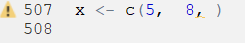


*Check your quote marks*

Quote marks `"hello"` or `'hello'` are often used in R when we want to make sure something is a character (i.e. text). Most commonly used when we're inputting data that include words, or when we're stating a color, or when we're adding a title or a label to a graph.

An error that we often see is that quote marks are either missing or not closed. Up to this point in the book, we haven't yet covered the situations in which this is most likely to occur - so don't worry about following this code just yet. We're actually trying to make a scatterplot, that we discuss more in section \@ref(scatterplots). Instead, just focus on the error message:

```{r, message=FALSE, warning=FALSE, error=TRUE}
library(tidyverse)
ggplot(mtcars, aes(x=wt, y=mpg)) + geom_point(color = purple)

```

Note that it says `object 'purple' not found`.  That's because, even though we are trying to make the points of the scatterplot purple, because we didn't put it in quotes, it's looking for the `object` called purple. It thinks there is something called purple that contains the information it needs.  The actual code should include purple in quotes, to make sure it processes the word 'purple' literally: 

```{r, message=FALSE, warning=FALSE}
library(tidyverse)
ggplot(mtcars, aes(x=wt, y=mpg)) + geom_point(color = "purple")

```


For the most part in R, you can choose whether you use double quotes `"` or single quotes `'` when using quotes. Just make sure you match them, and close them.  For example, the following examples are correct:

```{r}
days <- c("Monday", "Tuesday", "Wednesday")
days
```

```{r}
days <- c('Monday', 'Tuesday', 'Wednesday')
days
```

You can also do this, although it looks a bit odd:

```{r}
days <- c('Monday', "Tuesday", 'Wednesday')
days
```


Here are some examples of what happens if you don't close your quotes:

```{r, error=TRUE}
days <- c("Monday, "Tuesday", "Wednesday")
```

Often you'll get the error message `Error: unexpected symbol...` in such situations. This is usually a clue to look for a punctuation error.


Another think you'll notice when you make this error, is that the colors of your code don't look right. Notice that the colors of each day aren't consistent:

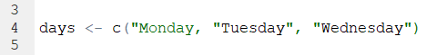


In general, we'd recommend that when you need to use quotes, that the double quotes `"hello"` are the better option. There are two reasons for this. First, if you start to type those in R then the second quote mark magically appears. RStudio knows you're using quotes and already produces the closing quote. This doesn't happen (for some reason) when you use the single quote `'hello'`.  Secondly, often we use quote marks because we're adding a title or a label to something. Some example code to add a title to a graph might be:

```{r, eval=FALSE}
p + ggtitle("Tyler's first graph")
```

Notice in this title that one of the words requires an apostrophe `'`. If you had used single quotes to wrap around `Tyler's first graph` then this would have caused confusion as to where you wanted to end the text string. This only arises when using single quotes - so we say that double quotes are safer!


*Typos are bad!*

R can only run the code that you tell it to run.....  (well this is not 100% true... but wait until the end of the paragraph for that).  If you don't precisely tell it what you want, it will get confused or angry. If you typo, then this can cause problems. Let's do an example. Say we want to make two vectors called `apples` and `oranges` and we want to add them together. This works:

```{r}
apples <- c(4, 7, 10)
oranges <- c(3, 1, 2)

apples + oranges
```

but this will not work:

```{r, error=TRUE}
apples <- c(4, 7, 10)
oranges <- c(3, 1, 2)

appless + oranges
```

You'll get the error saying `object 'blah' not found`. This is the most common error that we see. Basically, it cannot find an object (be it a vector or a dataframe) if it's not spelled correctly. This also applies to column names of dataframes and so on.  R is also case sensitive. The following doesn't work:


```{r, error=TRUE}
apples <- c(4, 7, 10)
oranges <- c(3, 1, 2)

apples + ORANGES
```

It will not automatically realize you meant `oranges`. 

However, there is a bit of help that RStudio will give you. Look what happens when we write `ORANGES` in our code script:


It automatically popped up `oranges` as a suggestion. The little colored icon to the left of it indicates that it is in an object. So - RStudio can be your friend!


Actually, when you first start to type the first letter of any object, you can hit the `Tab` key and various options will pop up for you to choose from. You can then either use your up and down arrows or your mouse to click on the thing you want. In the example below, you can see it includes our `oranges` object and ton of other stuff that we don't need right now that also beings with `o`. This is super helpful when you've forgotten what you called something:


* We said that it's not 100% true that R cannot 'guess' what you mean. There are a few exceptions. One example, is that sometimes R can guess the name of a column in a dataset if you only type half of it or the first few letters. However, many programmers think this is a terrible thing to be able to do and so perhaps we should just forget about it. We would highly recommend always writing everything precisely.


### Tab is your friend

As seen from the example above, the `Tab` key can be used to get help as you're writing code. This is a super useful little trick as it can be hard to remember the names of some of the commands (functions) in R.  Earlier in this section we saw that it was possible to calculate the `sum` of a vector with a function called `sum()`. However, what if you forgot the name of this but you just had a vague recollection that it began with an `s` ?  You could start to type `s` and then hit the `Tab` key. Scroll through the list that pops up by your code until you find the one that you think is correct!


You'll also notice that you get a big yellow help box that appears to the side. This gives you a bit more information about what the thing you've highlighted does - and this may help jog your memory as to what you were looking for.

After you have clicked on the thing you want- it will automatically include it in your script- and you're good to go:


## Error Messages

We'll be honest here and say that often times when you get an error message, they aren't massively helpful. Or, at least this was the case until recently.  There still are many error messages that don't really help you too much in learning what you did wrong, but if you make errors when using the `tidyverse` (see section \@ref(tidyverse)) such as when making visualization - these error messages are much more helpful now than they once were.

Making errors when coding is part of the learning curve though. It's like learning to play the piano. There is almost no way you can do it just by watching somebody else. You have to practice and be ok with making small mistakes. At first they catch you out, but over time you'll realize when you're about to mess up and you'll avoid it. Or, you'll mess up and be faster at working out how to get past it.

If people are stuck on particular error messages during this course - please do let us know. We'll try and collate an FAQ of error messages that we can provide answers to - that will hopefully make the learning process a lot less painful.


## Functions

Functions are operations that you can conduct in R. There are many built-in functions to R, and several that come in packages that we can install and load in.

There is usually (although not always) an object that is the focus of the function. Functions have names and end in brackets. We've already met some of these, e.g.:

`sum()`
`length()`
`c()`
`sqrt()`


As we go through the course, we'll see lots more functions and it will become second nature to use them.  There is one additional thing that we'll bring up at this point. The things that you put inside functions are called `arguments`. Sometimes you'll see them called `parameters` - but that has other meanings in statistics, so let's use 'arguments'.  Some functions have one argument, others have more.  Most functions have defaults for these arguments, so if you don't include them, it will still run using it's predefined default.

Let's illustrate this by introducing you to the function called `round()`.  This function will round numbers to various decimal places. Let's use the number   `17.10771947` as an example. What does round do to this number?

```{r}
round(17.10771947)
```

It's default is to round it to 0 decimal places. Inside of `round()` the number is in the position of the 1st argument. `round()` can have two arguments - the second one relates to how many decimal places you would like to round to. So, if you want to round to 3 decimal places, you need to do this:

```{r}
round(17.10771047, 3)
```

Now we have two arguments. In actual fact, those arguments have names, and you can most often work out what the names for the arguments should be from help guides. Technically, what we have just performed is the following:

```{r}
round(x = 17.10771047, digits = 3)
```

But as you have already worked out, we didn't need to write the names of the arguments. R worked it out already. What if we'd got the arguments, the wrong way round?

```{r, error=TRUE}
round(3, 17.10771047)
```

Now it defaulted to giving us the first argument to zero decimal places. Because the second argument isn't a whole number (integer) then it just ignored it. What if you keep these in this order, but give them their correct argument names?

```{r, error=TRUE}
round(digits = 3, x = 17.10771047)
```

Now it works as expected again.  The moral of this story is that it is best practice to use the argument names!  If you hit the `Tab` key as you type out a function name, then it will give you a list of possible arguments for that function:

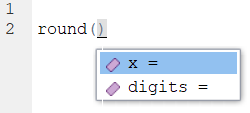


Arguments of functions aren't always numeric. Sometimes you need to write in words,  punctuation or the logical statements `TRUE` or `FALSE` to tell the function what you want to do. An example is the function `paste` which joins together two objects.  Here we tell it to paste together three objects with an underscore:

```{r}
obj1 <- "hello"
obj2 <- "james"
obj3 <- "curley"
paste(obj1, obj2, obj3, sep = "_")
```

In functions, punctuation and characters need quote marks around them. `TRUE` and `FALSE` should not have punctuation around them.


If you want to continue with R then it's also possible to write custom functions that will do what we do whatever we ask them to do - but that is for the future.


**R works from in to out**

One thing to remember about R as a coding language is that it will apply functions from in to out. It will start with the innermost function in a statement, and then move outwards.

So, if you have the following vector:

```{r}
x <- c(1, 5, 3, 7, 10, 11, 13, 5, 6, 2, 5, 6, 3, 7)

x
```

and you want to get the unique numbers (i.e. get rid of the repeating numbers and only keep one of each of all the numbers), then you could use `unique()`:

```{r}
unique(x)
```

If you wanted to take the unique numbers, and then square root each of them you could wrap `unique(x)` in `sqrt()` like this:

```{r}
sqrt(unique(x))
```

That code is still just about readable. 

However, say you want to (for some reason), keep the unique numbers, then take the square root of each number, then add them all up, then round the answer to 2 decimal places. This is what it would like:

```{r}
round(sum(sqrt(unique(x))), digits = 2)

```

It finds the object you are working with `x` then the first function outside of that is `unique()` then the next one outside of `unique(x)` is `sqrt()`, then the next one outside of `sqrt(unique(x))` is `sum()` and the next one outside of `sum(sqrt(unique(x)))` is `round()`. That's quite hard to follow!

Another approach would be to do this in steps and assign objects at each step, like this:


```{r}
x

x1 <- unique(x)
x1

x2 <- sqrt(x1)
x2

x3 <- sum(x2)
x3

x4 <- round(x3, digits = 2)
x4

```

Another alternative is to chain the syntax together (see next section). 


## Chaining Syntax

The code in the previous section was pretty ugly! Here it is:

```{r}
round(sum(sqrt(unique(x))), digits = 2)
```

We could rewrite it however by chaining together the outputs of each function using the `pipe` or chaining piece of syntax that looks like this `%>%`.  This is how it would look if we chained each function together:

```{r}
x %>%
  unique %>%
  sqrt %>%
  sum %>%
  round(2)

```

Let's break down what's happening bit by bit.  Essentially you can read the `%>%` as `and next do this`.

This first bit just keeps the numbers that are unique in the vector, removing duplicates:

```{r}
x %>%
  unique 
```

Next we square root each of those unique numbers:
```{r}
x %>%
  unique %>%
  sqrt 
```

Then the next step is to add up those six square rooted numbers:
```{r}
x %>%
  unique %>%
  sqrt %>%
  sum 
```

Then we round that value to two decimal places:

```{r}
x %>%
  unique %>%
  sqrt %>%
  sum %>%
  round(2)
```


It's also worth pointing out that you don't have to start a new line after every `%>%`, you can have these in the middle of rows. Just don't start rows with them (see errors above)!

This also is fine:

```{r}
x %>% unique %>% sqrt %>% sum %>% round(2)

```


<!--chapter:end:02-BasicSyntax.Rmd-->

# Introduction to Data Carpentry

Data carpentry gives us the tools to work with large data sets. During this chapter you will learn basic concepts and skills to help you import, tidy and manage your data. 

<br>

## Data Types 

Before learning how to work with data in R, we should know about some of the different types of data there are. 

Here is a figure that lays out the hierarchical levels of data types. We use the term 'variable' to refer here to data.

{width=400px}

<br>

#### Qualitative vs. Quantitative Data

As you can see at the highest level, there are two data types: quantitative and qualitative. The easiest way to distinguish these data types part is to think of qualitative data as data we that are types . In practical terms, you can think of quantitative data as measures such as values or counts that can be expressed as numbers and can be compared on a numeric scale - either whole numbers or numbers with decimal places. Qualitative data are measures or observations of qualities, types or characteristics. They are often cases not numbers but in text form (although they can sometimes be numbers).

<br>

### Categorical Data

Under qualitative data, we have two different data types: Nominal and Ordinal. Both of these data types are known as categorical data, which means they represent characteristics such as a person's gender, education level, language, ethnicity etc.   

Categorical data can also be represented in a dataset by numbers. For example, if we are studying smokers and non-smokers in a study, the variable "smoking" would be a categorical variable. We could represent that data in text format using "smoker" or "non-smoker" as our data entry, or we could represent smokers as a "0" and non-smokers as a "1". However, it is important to remember that these numbers don't have any mathematical meaning here - it's just a convenient way of representing the data. 

<br>

#### Nominal Data 

Nominal data, sometimes referred to as unordered data are values which represent discrete units and are used to label a variable that have no quantitative value. The key thing about nominal data is that they do not have any natural value or rank, therefore if you change the order of the data, the meaning of the data does not change. 

An example of nominal data would be the results to: "What languages do you speak at home?". If in our study we got the answers: French, English, Spanish & Hindi from different subjects, then the data type is unordered. There is no sense in that French, English, Spanish, or Hindi are higher in rank than any other - they are simply unordered categories.


<br>

#### Ordinal Data 

Like nominal data, ordinal data describes discrete units or categories. However, unlike nominal data, ordinal data does have a natural order or ranking to it.  

For example, in a study we may ask subjects, "What is the highest level of education you achieved?"  They may be able to choose from the following options:

1- Elementary
2- High School 
3- Undergraduate
4- Graduate 

Here, each level of the data is a category, but it is ordered.  Graduate is higher than Undergraduate which is higher than High School which is higher than Elementary.  Therefore this data variable (education) is ordinal data.


<br>

### Numerical Data (Discrete vs. Continuous)

Under quantitative data, there is numerical data consist of numbers with real mathematical meaning. There are two types of numerical data. 

<br>

1. **Discrete** data is data that is separated such that this data can only take on certain value. Most often, these are things that can only be counted in whole units.  e.g. If you asked subjects in a study - "how many unique people did you text this week?", then the answer has to be an integer (a whole number), e.g. 0,1,2,3,etc.  You cannot text 2.5 people. Think about discrete data as count data since it can only be counted and not measured. 

<br>

2. **Continuous** data is the opposite of discrete data, it can only be measured not counted. Continuous quantitative data is most often measured using some instrument. For example, if we collected the body weight or height of each subject in a study, then we would get values that would be measured using a scale or a measuring tape and could include decimal places. e.g. you could be 170.5 lbs heavy and you can be 180.2 cm tall.

Additionally, quantitative data can be described in terms of interval and ratio data. 

<br>

#### Interval Data

Interval data represents values that are ordered on a scale and the differences between any two values has meaning. 

In interval data there is no true zero, which means if you have zero in your data, then zero is just another number. For example, zero on the Fahrenheit temperature scale means it is zero degrees outside, but doesn't mean the scale stops - 0 actually refers to a temperature. We can also have negative numbers in interval data which are meaningful.


<br>

#### Ratio data 

For a variable to be considered ratio data, it holds all the properties of an interval variable - it relates to numbers (including those with decimal places) that can be ordered on a scale. However, ratio data also has a true meaning of zero. Whenever a ratio variable is zero, it means there is none of that variable. 

For example, in a study, if a subject reports that they texted zero people in the last week, then here 0 really means the absence of something - it relates to none. Another example of ratio scale data is temperature in Kelvin, where zero degrees Kelvin means there is no heat being emitted. 


<br><br>

## Importing Data

There are different options for importing data. It's possible to import data of all different formats into RStudio. We will primarily use spreadsheet type files that have been saved with the `.csv` suffix.  These are called 'comma separated values'.  

**Option 1. Import Tab** You can click on the "Import Dataset" tab in the top right of RStudio - it's located just above your global environment. 

Depending on your RStudio version, you will be asked to select from a dropdown menu. When importing `.csv` files, you want to select `From CSV...` if your menu looks like this:


{width=800px}


If your menu looks like the underneath, then you'll want to select `From Text (readr)`:

{width=500px}


<br>

**Option 2. Writing code.**  This is the option that we will use in our scripts for this course. You may notice that all the datasets that we wish to use are in a folder called "data".  To read in any of these datasets, what we need to do is use the `read_csv()` function.  This comes from a package contained with the `tidyverse` package, so we must have imported that library first.  We then tell it which dataset to find within the 'data' folder. We use the notation "data/..." to tell it to look inside the data folder.  For instance, if we wished to load in the `bmi.csv` dataset, and assign it the name `bmi`, we would do it like this - make sure to put quotes around the whole file name and location:

```{r, message=FALSE}
library(tidyverse)  #load package

bmi <- read_csv("data/bmi.csv") # bring in data

head(bmi) # first six rows

tail(bmi) # last six rows

```

If you want to see more on what the data looks like the following functions can help. 
```{r}
nrow(bmi) # how many rows in dataset

ncol(bmi) # how many columns in dataset

colnames(bmi) # column names
```

If you just want to view your entire dataset, there is a function for that. 

`View(bmi)`


## Introduction to Dataframes

A dataframe, in R is like a spreadsheet that contains your data. Each column contains values or characters for one variable. In R, columns are called **variables**.  Rows are called **observations**.

In R dataframes need to contain the following:

1. Columns should all be the same length, with unique column names. These column names should not start with numbers or punctuation, and have no spaces. 

2. The data stored in dataframes can hold many different data types. The most common are numbers. R describes columns with numbers as being **numeric**, although a column containing only whole numbers (e.g. 1, 5, 342, 1034) may be called **integers**. Columns containing any value with a decimal place (e.g. 0.01, 4.4, -7.39494) will be called **double**. Both `double` and `integer` are types of `numeric` data.

The second most common data type for a column is **character**. This is the case if the data in the column have any text or punctuation. 

A related column type is **factor**. This occurs when the `character` type is grouped, e.g. if you had a column with different days of the week, you may wish for R to recognize that each is a separate category.

Another column type that comes up semi-regularly, although not much in this course, is **logical**. This is when the column contains either `TRUE` or `FALSE` values.


Let's dive into all the features of a dataframe.

First import data, using `read_csv()`.


```{r, warning=F, message=FALSE}

df <- read_csv("data/cheese.csv")
```


### Dataframe basics

 1. Look at top few rows using `head()`. The default for `head()` is to look at the top 6 rows. However, if you put a comma, and then a number, you can get that number of rows instead. Here we get the default 6, and then we get 4 and 8 rows.
 
```{r}
head(df)

head(df, 4)

head(df, 8)

```

You can do the same thing with `tail()` to look at the bottom rows. The default again is 6, but you can tell it how many rows you wish to look at:

```{r}
tail(df)

tail(df, 10)
```


We can also get various dimensions of a dataframe. `nrow()` gets the number of rows (also termed observations), `ncol()` gets the number of columns (also called variables), `dim()` returns both the number of rows and the number of columns, and `length()` is another way to get the number of columns.


```{r}
nrow(df)  

ncol(df)  

dim(df) 

length(df) 
```


As we showed earlier, `colnames()` is a very useful function for retrieving the names of columns in a dataframe. This is particularly useful when you can't fit all of the columns onto your screen which is common with big datasets.

```{r}
colnames(df)

```

Sometimes you may wish to change column names. This is common when you've imported some messy data from elsewhere. Hopefully if it is your own data you named your columns well in the first place.

The way to change column names is to assign the new name to the appropriate column, by indicating which column with square brackets `[]`:

```{r}
colnames(df)[6] <- "carbo"

colnames(df)
```

In the above example, we changed the name of the 6th column to `carbo`.  You can change all column names by doing the following:

```{r}
colnames(df) <- c("type1", "sat_fat1", "polysat_fat1", "monosat_fat1", "protein1", "carb1", "chol1", "fiber1", "kcal1")

head(df)

```

Let's return them back to the original values:

```{r}
colnames(df) <- c("type", "sat_fat", "polysat_fat", "monosat_fat", "protein", "carb", "chol", "fiber", "kcal")

head(df)
```

<br>
<br>


### Indexing dataframes.

There are two indexing methods we need to learn. One is the `$` sign, which indicates we want to get data from a specific column. The other is the square brackets `[]`.


 The `$` indicates which column to call.  For instance, if we wish to get all the data from the `chol` column of the dataset `df`, then we would type `df$chol` and it returns all the data in that column:

```{r}
df$chol
```


What if you just want the first 10 rows of kcal?  Then we could get all the data from that column with `df$kcal` but then use the square brackets to tell it to get the values in positions 1 to 10 with `[1:10]`:

```{r}
df$kcal[1:10]
```

This works, because you can think of all the data values in each column as essentially its own vector. The square brackets work just as they would with any other vector indexing (see section \@ref(vectors)).


Square brackets can be used on the whole dataframe to call just certain rows and columns. **Importantly** row numbers need to be written before the comma, and columns after comma.  If you leave anything blank, then it will assume that you mean "all" of the rows or columns.

Technically, running `df`, and `df[,]` all return the whole dataframe. What you're saying is return all of the rows and all of the columns from `df`.


```{r}
df
```

```{r}
df[,] #return all rows and all columns
```


To just get the 7th row, you put a `7` before the comma, and leave after the comma blank:
```{r}
df[7,]
```

To get the 10th to 14th rows you can put `10:14` before the comma and leave after the comma blank:
```{r}
df[10:14,]
```

To get the 3rd column you can leave before the comma blank, and put a `3` after the comma:

```{r}
df[,3]
```


To get the first and second columns, leave before the comma blank and put a `1:2` after the comma:
```{r}
df[,1:2]
```


If you want to get non-consecutive columns, you need to use `c()` with your numbers. For example, to get the 3rd, 5th, and 9th columns you leave before the comma blank and put `c(3,5,9)` after the comma: 
```{r}
df[,c(3,5,9)]
```


You can also combine these. So, to get the 20th to 22nd row, and the 1st, 5th and 9th column, you put `20:22` before the comma, and `c(1,5,9)` after the comma:

```{r}
df[20:22,c(1,5,9)]
```


### Adding and removing columns

As we will see below in the `tidyverse` section, there is a way to creating new columns using the function `mutate()` which we recommend.  However, there is also a quick way to create and delete new columns which is worth knowing about.

To create a new column, you can simply type a new name after writing your dataframe name and the dollar sign, and then assign something to it. So, if you wished to create a column called `food_type` you'd write `df$food_type <- ` and then put whatever you wanted to put into that column.   For example, if you wanted it to contain the word 'cheese' you'd do the following:


```{r}
df$food_type <- "cheese"

head(df)
```

Now every observation (row) has the entry `cheese` in the column `food_type`. 

If you wanted to put in different data for each observation, e.g. the country of origin of each cheese, then you'd need a vector that was the same length as the number of rows of the dataset.  See the section on manually creating dataframes just below for some examples of this.
 
 
To delete a column from a dataframe, you just assign the word `NULL`, which is a special term in R, to that column, and then it will disappear: 


```{r}
df$food_type <- NULL

head(df)
```

<br>


### Structure of Datasets

This little subsection is a bit more about the inner workings of dataframes. It won't be coding that we use during this course, but if you ever do any extra R things by yourself, you may run into issues that this section could help you resolve.

You can see the structure of your data, whether each variable is a number, character, factor, logical, etc. This can be useful when trying to graph and analysis different types of data.  

```{r}
str(bmi)
```

Here you can see that all variables are `numeric`, except for education with is a `character`. 

Another common variable type is `factor`. This is similar to a `character` but it has `levels`. This means, that R knows that there are groups in that variable. You might notice that the variable `smoke` is currently a numerical variable with values being either a `1` (non smoker) or `2` (smoker). If we wanted to make a graph and plot non-smoker or smoker on the x-axis, then this would appear as 1 or 2, which isn't helpful. In these situations, it can be helpful to convert our `numeric` variable into a `factor`. The way to do that is as follows:

```{r}
bmi$smoke <- as.factor(bmi$smoke)
```

The `$` basically allows you to call certain columns in a dataframe. The code `bmi$smoke` is allowing us to only change that column, or variable to a factor without changing anything else in the dataframe. 

You can also change variables to characters with `as.character()` and to numbers with `as.numeric()`. 


<br>


## Manually creating a Dataframe

Often in R, we don't want to import a dataset, but rather create a dataset of our own manually in the script. We can do that using the function `data.frame()`.

Let's just do a small example.  Say, we want to create a dataframe with four columns. We will have the names of 6 different pets in column 1 and call that column `name`.  In the second column, we want the ages of those pets and we'll call that column `age`. In the third column we will have the type of animal that pet is, and we'll call that column `animal`. In the fourth column, we'll have whether it's a male or female pet and we'll call that column `sex`. In the fifth column, we'll have the main color of the pet, and we'll call that column `color`.

Here are our 6 pets:

1.  Steve, an orange male goldfish who is 5.
2.  Hannah, a female blue parrot who is 12.
3.  Colin, a brown male cat who is 15.
4.  Archibald, a grouchy green male terrapin who is 3.
5.  Missy, a female yellow labrador dog who is 2.
6.  Bob, a black male spider who is 10.

We need to make sure we put each of the column information  in the right order in our dataframe. This is how we manually enter the data:

```{r}

petdf <-
  data.frame(
    name   = c("Steve", "Hannah", "Colin", "Archibald", "Missy", "Bob"),
    age    = c(5, 12, 15, 3, 2, 10),
    animal = c("goldfish", "parrot", "cat", "terrapin", "dog", "spider"),
    sex    = c("M", "F", "M", "M", "F", "M"),
    color  = c("orange", "blue", "brown", "green", "yellow", "black")
  )

petdf


```

Inside `dataframe()` we write each column name. Then we put an `=` sign, and then write the vector of characters or numbers. After each column's data is entered, we write a comma `,` to indicate we're going to the next column. The exception to this is after the last column is entered, `color` in this case, where we don't write a comma after we're done entering all the color information. This indicates that we're done.  Also note that every column has the same number of pieces of information (6).  If we had unequal bits of information, R would generally not allow us to make the dataframe.  There is one *gotcha* here though - if you enter less than the number of rows of your new dataframe, e.g. if you'd only entered two values in the color column say, R will repeat those two colors through the remaining empty rows.  You need to be careful! If you're not sure what you're doing, the best is to ensure that you have the exact number of values as you want rows inside each vector.


    
<br><br><br><br>


## tidyverse

The package `tidyverse` is what we will be using for most of our data carpentry. `tidyverse` is a larger package which includes several packages useful for managing, exploring and visualizing  data such as `tidyr`, `dplyr`, `ggplot2`, and more. 


In this section, we will learn the following functions and syntax: 


`filter()`    - subsetting data

`select()`    - selecting columns

`arrange()`   - sorting a column

`mutate()`    - adding a new column

`count()`    - counts the number of values in a column


`%>%`  means "and next do this"  

`==`  means "is equal to"

`!=` means "is not equal to"

`|`  means "or"


First, make sure that you have the `tidyverse` installed.  If you run the following code and do not get an error message saying "tidyverse not found", then you are good:

```{r}
library(tidyverse)
```


If you did get the error message, then you'll need to install the library. You only need to do this once, but you will have to load a library on every script you plan to use it. 

To install the package:

```{r, eval=FALSE}
install.package(tidyverse) #install
```


To load the package to use each time you need it:

```{r}
library(tidyverse)
```


From the `tidyverse` package `readr` we can read in our data. We are going to work with a dataset called `bloodwork` that we will shorten to `bw`. It contains health information on several subjects:


```{r, message = FALSE}
library(tidyverse) #load
bw <- read_csv("data/bloodwork.csv")

```

```{r}
head(bw) 
```


```{r}
tail(bw) 
```

As you can see, we have variables such as `ids`, `age`, the state people live in, their heart rate, how many children they have etc. etc.


### table()


This function is not a `tidyverse` function but is a quick summary function that is useful to know - `table()`. It is good for quickly summarizing categorical or discrete numerical variables. 

For example, to look at the number of smokers and non-smokers, we can do the following:

```{r}
table(bw$smoker)
```

We have 15 non-smokers and 15 smokers in the dataset.


To look at the frequency count of how many subjects have 0, 1, 2, 3  children we can do: 

```{r}
table(bw$children)
```

We have thirteen people with 0 children ten  with 1 child, five with 2 children and two with 3 children.


You can also compare two categories at once. For instance, to look at the smokers and non-smokers that have different numbers of children, we can include both in the `table()` function and separate by a comma:

```{r}
table(bw$smoker, bw$children)
```


The `tidyverse` version of `table()` is to use a function called `count()`. It does come in useful sometimes, but most of the time you'll find using `table()` to be easier.  However, here is an example of counting how many individual by each state there are in the data.  You first take your dataset, then chain with the pipe `%>%` the next command which is to `count()` the column `state`.


```{r}
bw %>%
  count(state)
```


We can also get frequency counts for more than one column e.g. to see how many children non-smokers and smokers have, though again, the output from `table()` is nicer to look at:

```{r}
bw %>%
  count(smoker, children)
```

<br><br>

### filter()  - Subsetting Data

`filter()` is a way to subset data. In other words, it is a way to only keep certain rows in your dataset. These are rows that must fulfill specific criteria.  For example, let's say we wish to only keep rows that have values in the `hrate` column that are over 70.

The first step is to take the dataframe `bw()` and then tell R that you are about to do something else with the `%>%` syntax. Then use `filter()` with `hrate > 70` inside it. This mean, *keep* the rows with `hrate>70`.  See sections \ref(chaining-syntax) and \@ref(chaining-together) for a bit more on chaining using `%>%`.


```{r} 
bw %>% 
  filter(hrate > 70)
```


To only keep values that are precisely equal to some value (be it a number or a character), we use `filter()` with `==` to mean "is equal to":

For example, to only keep rows where the state is equal to `NJ`.

```{r} 
bw %>% 
  filter(state == "NJ")
```


If you want to include all subjects that had 3 children, you'd do the following - note that the number does not go in quote marks:

```{r} 
bw %>% 
  filter(children == 3)
```


If you want to include rows that are equal to one of two values, you can use `|` to mean "OR". The following will include rows where the `state` column is equal to either "NJ" or "NY" in the bloodwork dataset.

```{r}
bw %>% 
  filter(state == "NJ"  |  state == "NY")
```


You can also keep rows that are not equal to some value using the syntax `!=` which means "not equal to". For example, to keep rows where the `children` column is not equal to 0:

```{r}
bw %>% 
  filter(children != 0)


```

You can also filter several variables at one time. Here, we are keeping all individuals from New York, with a heart rate of over 70, and who have more than 0 children: 

```{r}
bw %>% 
  filter( state == "NY", hrate > 70, children != "0" )

```


You can create new datasets from filtered data by creating a new object. Here, we create a new dataset called `ny1` that is based on filtering out rows from our `bw` dataset.

```{r} 
ny1 <- bw %>% 
  filter( state == "NY", hrate > 70, children != "0" )

ny1

```


<br><br>


### select() - Selecting specific columns

Sometimes datasets are too big and unwieldy to look at all at once. Often, we are just interested in certain columns and it makes more sense just to keep the ones we want to focus on. We can use `select()` to only keep certain columns:


For example, to only keep the columns `ids`, `smoker`, `hrate` and `children`, we'd do the following:

```{r}
bw %>% 
  select(ids, smoker, hrate, children)
```


Occasionally, you may just want to get rid of certain columns from your data. To get rid of one column you can use `select(-column_name)`.  To get rid of the `children` column, we'd do the following:


```{r}
bw %>% 
  select(-children)
```

To get rid of the `children`, `bpsyst` and `smoker` columns, we'd do the following:

```{r}
bw %>% 
  select(-children, -bpsyst, -smoker)
```


You can also select and rename columns as you go. Here, we are selecting the columns `ids`, `sex`, `smoker`, `hrate` and `children`. We are renaming `sex` to be `gender` and `ids` to be `subject`. You rename by just typing the new name and then putting an `=` sign in front of the old name:

```{r}
bw %>% 
  select(subject = ids, gender = sex, smoker, hrate, children)
```


If you want these selections to be permanent then you need to rewrite selections in new dataframe. Here we call our new dataframe `bw1`. You can see the difference between bw and bw1:

```{r}
bw1 <- bw %>%  
  select(subject = ids, gender = sex, smoker,hrate,children)

head(bw)

head(bw1)
```


Instead of typing out the column name each time you use `select()`, you can also use the column number.

The code below selects for columns 1-2, 8, 10, but does not save the information as a new object. Notice that you don't need to put these numbers inside of `c()` for this to work: 

```{r}
bw %>% select(1:2,8,10)

```


<br><br>


### mutate() - Creating new columns

We use `mutate()` to add new columns to our dataset. Say we wanted to create a new column called `totalimmune` that is the sum of the two columns `immuncount` and `immuncount2`. Basically, we want to add each subject's `immuncount` and `immuncount2` value together to create a new value called `totalimmune` that we'll put into the new column.

The first thing you put inside `mutate()` is the name we want of the new column. `immuncount + immuncount` means to add these two columns.

To make these easier to see, we'll just select three columns and call the new dataset `bw2`:

```{r}
bw2 <- bw %>%
  select(ids, immuncount, immuncount2)

bw2

```

``` {r}
bw2 %>% 
  mutate(totalimmune = immuncount + immuncount2)
```


You can also create new columns in other ways. For example, if you want to create a new column called `year` and put 2020 into each row, we'd do the following:

```{r}
bw2 %>% 
  mutate(year = 2020)

```

<br><br>


### arrange() - Sort Data Columns


Often it's easier to see data if the columns are sorted in ascending or descending order. We can do this using `arrange()`.

Lets try another example! We'll use the `pga.csv` dataset that has historical golf data summary statistics in it.  Let's load in that dataset:

```{r, warning=FALSE,  message=FALSE}
pga <- read_csv("data/pga.csv")
```

We will select the columns `name`, `year`, `total.holes`, `total.putts`, and `score.avg` and save as `pga1`. 
```{r}

pga1 <- pga %>% select(name, year, total.holes, total.putts, score.avg)  

head(pga1)
```

You can see that we have the total number of holes played, the total number of putts made, and the scoring average (lower is better in golf) made each year by various PGA golfers. 

Perhaps we want to know who has the highest or lowest scoring average. We can sort based on the column `score.avg` in ascending order with `arrange()` like this:

```{r}
pga1 %>% 
  arrange(score.avg)  
```

So, the lowest average score was 67.794 by Tiger Woods in 2007. The second lowest was 68.052 by Tiger Woods in 2009.


To sort data in descending order, we need to put a negative sign (hyphen) `-` in front of the column name:

```{r}
pga1 %>% 
  arrange(-score.avg)  
```

The worst average score on the PGA tour was by David Gossett in 2004 with an average of 75.013.


`arrange()` can also sort data in ascending alphabetical order, if you put a column with character data into the function, such as the `name` column in our data:

```{r}
pga1 %>% 
  arrange(name) 
```

It turns out that Aaron Baddeley is the player that is closest to the beginning of the alphabet.  You cannot sort in a descending way on character data.


If you wish to sort over multiple columns, you just need to separate your column names with a comma inside `arrange()`. So, to first sort by `year`, and then by `score.avg`, we'd do the following:


``` {r}
pga1 %>% 
  arrange(year, score.avg)  
```

You can see that the lowest year in this dataset is 2004, and so it put all the rows with 2004 at the top, and then sorted each of these rows by `score.avg`. So, Vijay Singh had the lowest score with 68.839 in 2004.

<br><br>

### Chaining together

Just as an extra note, the real power of these `tidyverse` commands, is by chaining them all together. So, one thing we could do is select from our original `pga` dataset the columns above, then create a new column called `putt.avg` which is equal to the total number of putts `total.putts` divided by the total number of holes `total.holes` columns, and then arrange in ascending order by the new `putt.avg` column. Here it is in one bit of code:


```{r}
pga %>%
  select(name, year, total.holes, total.putts, score.avg)  %>%
  mutate(putt.avg = total.putts / total.holes) %>%
  arrange(putt.avg)

```

It turns out that Brian Gay in 2013 had the fewest putts per hole.


<br><br>


## Wide versus Long Data

Sometimes you will need to rearrange your data for some data analysis and more commonly for data visualization. Dataframes can come in two broad shapes. There is **wide data** where each row is a separate subject and each column has variables that may or may not contain the same type of data.  The other is **long data** where values of the same type are only in one column, and the same subject may appear on several rows.

This is easier to understand with a visual aid. The image below show data that is in **wide** format. Each row contains all the information for each subject - those being three NHL hockey teams. We see the division that each team belongs to, and the total goals they scored in the seasons beginning in 2016, 2017, 2018.  


These data are also **untidy** - as we prefer to have each row contain all the information for one unique value. To do that we need to turn the data into **long** format which looks like this:


Here, each row contains information related to the team, division, the total number of goals scored, and the year that that piece of data came from. Because each row contains unique information, we call this type of data **tidy**. Essentially, you can see we took columns 3,4, and 5 from the wide data and made these longer.

It can take a bit of practice to fully recognize what data are in wide or long format - sometimes it's not so clear in really large datasets. This does become important though, because some visualization and analyses can only be done with data in wide format, and others with data in long format. It's therefore important to be able to switch our dataframes through these two formats.

Fortunately, the `tidyverse` has built in functions that can turn your dataframe from long format to wide format and vice versa. 

`pivot_longer` makes the dataframes longer by increasing the number of rows by combing the number of columns. This is called long form data, which is needed to tidy data for graphing and some analysis.


First, we'll make some small dataframe examples manually. The first dataframe is a wide dataframe. You could imagine this as showing five subjects and their reaction times at two different timepoints. We call this dataframe `df.wide`:

```{r}
# wide data has more than one score of each type per individual in rows

df.wide <- data.frame(
                 name = c("James", "Tyler", "Stephen", "Jennifer", "Carmen"),
                 time1 = c(15, 17, 14, 13, 11),
                 time2 = c(16, 19, 20, 21, 23)
                 )


df.wide

```

The second dataframe we'll create manually contains the same data, but in a long tidy format:

```{r}

# long data (also called tidy data) has only one column for each type of score
# Every row has the information to make each score unique

df.long <- data.frame(
                 name = c("James", "Tyler", "Stephen", "Jennifer", "Carmen"),
                 score = c(15, 17, 14, 13, 11, 16, 19, 20, 21, 23),
                 time = rep(c("time1", "time2"), each = 5)
)

df.long 

```


### Wide to Long


To go from wide to long format we can use `pivot_longer`. We need to tell R which columns contain the data that are currently in wide format and need to be turned into long format. Here, we put `cols = 2:3` to indicate that the data are in columns 2 and 3. We also use `names_to` to tell it that we want the new column to be called `time`:

```{r}
# turn columns 2 and 3 into one long column:
df.wide %>% 
  pivot_longer(cols = 2:3, names_to="time")  
```

Our example dataset was very simple, only containing an identifier (`name`) column and the two columns with data. What if we had other columns in our dataset? Here we add a column called `group` that indicates if our subject are in a control or treatment group:

```{r}
df.wide$group <- c("control", "control", "treatment", "treatment", "treatment")

df.wide
```

To convert this dataframe to a long dataframe, we still use the same code indicating that the data to make long are contained in columns 2 and 3. Because each individual is always in the same group (e.g. James is always a control, Carmen is always in treatment), R will just make this a new column: 

```{r}
df.wide %>% 
  pivot_longer(cols = 2:3, names_to="time")  
```


### Long to Wide

If we start with data in the long format, we can convert the dataframe to wide format using `pivot_wider()`. Here, we need to provide the name of the column that contains the data to become new wide columns. We do that below with `values_from = score`. We also need to state which column contains the new column headers. In this example they are in the column `time`, so we do that with `names_from = time`.

```{r}
head(df.long)
```

```{r}
df.long %>% 
  pivot_wider(values_from = score, names_from = time)
```

Now our data are in a wide format.

Again, it is more common that we have more columns in our dataset. Say we had rated the confidence of each participant on the tasks prior to testing them. We may have a column called confidence that might look like this:

```{r}
# if we had more columns in our dataset:
df.long$confidence <- c(3, 8, 9, 4, 10) # this repeats all the way down the dataset

df.long
```

Even when we have more columns, we still can make our data go wide in the same way:


```{r}
df.long %>% 
  pivot_wider(values_from = score, names_from = time)
```

Here, it just truncates the `confidence` column into one column to go along with `name`.


### Real Data Example.

It can be quite hard to work out which columns to select when converting data from long to wide. It mainly comes from practice and from trial-and-error. You can always check if you got it right, and correct yourself if you did not.  In this section, we'll just show an example of converting dataframes between these two formats using some real data.

The dataset we'll use is called `wheels1.csv`. We'll read it in and assign the name `wheel`:

```{r, warning=FALSE, message=FALSE}
wheel <- read_csv("data/wheels1.csv")

head(wheel)
```

We're mainly interested in the `id`, `strain` and columns with day in, so we shall use `select()` to select these columns:


```{r}
wheeldf <- wheel %>% select(id, strain, day1,day2,day3,day4)

head(wheeldf)
```

These data represent the number id of individual mice, the strain of that mouse, and the number of wheel revolutions made on day1, day2, day3 and day4.  It's currently in wide format.

Let's convert it to long format, by taking the data in each day column and forcing them to go long:

```{r}
#convert to long
wheeldf.long <- wheeldf %>% 
  pivot_longer(cols = 3:6, names_to="day")  

wheeldf.long

```


If we wished to make our new `wheeldf.long` dataset to go back to a wide format, we could do this:

```{r}
# to make it go wider again, we do:
wheeldf.long %>% 
              pivot_wider(
                 names_from = day,
                 values_from = value
                    )
```


## Joins

A common requirement in data science is to join together two datasets. Usually these two datasets will have some bits of data in common. For instance, you may have one dataset that contains subject names and lots of demographic information. Another dataset might contain the subject names and their performance on various tests.  Ideally, you'd have all of this information in one dataframe.  The `tidyverse` is excellent at joining dataframes quickly and automatically. It is *far* more foolproof than cutting, copying and pasting in excel which should always be a no-no.  

In this course, we won't actually ever ask you to do any joining. All the datasets that we provide are already cleaned up.  However, we are including this small subsection in this guide to introduce you to the topic, should it be something you ever need to do on your own.  Joining is surprisingly a really big topic by itself, so we just scratch the surface here. For much more information on this topic, we highly recommend [Prof Jenny Bryan's guides](https://stat545.com/join-cheatsheet.html) as a good starting point.


To illustrate the power of joining, lets make up some data.

The first dataframe, `x` contains ten subjects who are referred to by an `id` and their ages (`age`).

```{r}

x <- data.frame("id" = 1:10, "age" = c(21,25,17,34,25,33,22,27,29,24))

head(x)

```

The second dataframe, `y`, contains the `id` of each individual again, but this time we also have data on their height, as well as how many hours they spent on an activity and some work.

```{r}
y <- data.frame(
  "id" = 1:10, 
  "height_cm" = c(156, 155, 154, 149, 153, 152, 151, 150, 147, 155), 
  "activity_hr"= c(3,5,3,6,7,4,2,8,4,5), 
  "work_hr" =c(40,35,38,46,50,42,40,46,41,40)
  )

head(y)

```

Currently we have 'age' in a separate dataframe. Perhaps we want to join it together with all the other information in our dataframe `y`.  We can use `full_join()` to do this. `full_join()` joins two different dataframes based on one or more shared variable(s). The following will join based on id. 


```{r}
x %>% 
  full_join(y)
```

As you can see, R joined the two dataframes together and `age` is now included in the new dataframe.

For this to work, you must have at least one column in each of your two dataframes that exactly matches by name. If you do not have this, R will not know how to join the dataframes together. If you have multiple matching columns, then R will match based on all columns that match - so be careful!


<!--chapter:end:03-DataCarpentry.Rmd-->

# Data Visualization 

In this chapter we shall discuss how we can make different types of data visualization in R. We will use the package `ggplot2` to visualize data. This is part of the `tidyverse` package, meaning you should load `tidyverse` to ensure you have `ggplot2` loaded.

We shall also discuss a little bit about when to make different types of graphs, and what each type is best suited for. We will also give a few pieces of advice about how to make your visualizations as readable and interpretable as possible. For much more information on the theory of data visualization with excellent examples, please refer to the [Fundamentals of Data Visualization](https://serialmentor.com/dataviz/) book by Claus Wilke. To understand the power behind `ggplot2` and for more data visualization examples, see the [ggplot2: Elegant Graphics for Data Analysis](https://ggplot2-book.org/index.html) by Hadley Wickham. 


## Introduction to ggplot2

The first thing to do when we want to make a visualization with `ggplot2` is to load the tidyverse:

```{r, message = FALSE}
library(tidyverse)
```


Next, let's load in some data. We'll pick the `BlueJays.csv` data:

```{r, message=FALSE, warning=FALSE}
df <- read_csv("data/BlueJays.csv")

head(df)

```


In the next few steps, we'll slowly build up a plot using `ggplot2`. This is **not** how you would typically write the code. However, it is worth going step by step, just to show you the logic behind the code.


If we just run the function `ggplot()` notice that all we get is a blank gray canvas. R knows that we want to make a plot, but it has no idea what type of plot or with what data - so it just throws up the canvas:


``` {r, fig.width = 5, fig.height = 3}
ggplot()  
```


Now, if we add the dataset to `ggplot()`, it still only gives us the blank canvas. It now knows we want to make a graph from the dataset called `df` but doesn't plot anything yet as we didn't tell it what to plot:

```{r, fig.width = 5, fig.height = 3}
ggplot(df)   
```


For R to 'know' what you are trying to plot, you need to use **`aes()`**. You put that most of the time inside `ggplot()` after your dataframe name.  (There are exceptions to this, but let's not worry about that yet). Inside the `aes()` we'll put what columns contain our data for the x and y axes. We may also refer to other columns inside `aes()` if we wish to modify the color or shape or something else about our data based on the values in some column.


For our first example, let's make a **scatterplot** of body mass against head size of these Blue Jays. If you look at the original dataset, you'll notice that both the `Mass` and `Head` columns contain continuous numeric data (i.e. they are numbers). 

In the code below, we are telling `aes()` to plot the `Mass` data on the x-axis and to plot the `Head` data on the y-axis.

```{r, fig.width = 5, fig.height = 3}
ggplot(df, aes(x=Mass, y=Head) )   
```

Something did change this time. We get a plot with labels on the x- and y-axes. It recognizes that we wish to plot `Mass` and `Head` data. It even knows the range of our data on each axis. For instance, it knows that the Mass data lies somewhere between 55 and 85.  However, we haven't yet told it precisely what type of plot we want to make (it doesn't just assume that we wanted to make a scatterplot - it can't read our minds).

So our next step is to tell it to make a scatterplot by adding points to the graph.  We tell `ggplot()` what we are adding to the chart by using different `geoms`. For a scatterplot, the geom we require is `geom_point()` - that means add datapoints. It is hard to remember all the different geoms, but you can just look them up.

Here is how we add datapoints to our graph with `+ geom_point()`.  

```{r, fig.width = 5, fig.height = 3}
ggplot(df, aes(x=Mass, y=Head) ) + geom_point()
```

That is our first ggplot graph! It looks pretty good. The amazing thing about ggplot is almost everything you are looking at on that graph can be customized to your preferred design choice. We'll discuss several of these customizations throughout this chapter. First, let's talk about changing the color of the datapoints. Inside of `geom_point()` we can change the color of all the points like this:


```{r, fig.width = 5, fig.height = 3}
ggplot(df, aes(x=Mass, y=Head) ) + geom_point(color="red")
```

This made the points red. Just make sure you put a recognized color name ([you can look them up here](http://www.stat.columbia.edu/~tzheng/files/Rcolor.pdf)) or a recognized [hex code](https://htmlcolorcodes.com/color-picker/).  Notice though that color name must be put inside of quotes.


What if we want to color the points based on another variable? For example, instead of having all of our data points be red, say we want them to be colored based on whether the birds or male or female?  The column that has the information about whether the birds are male or female is `KnownSex`. Because we are basing the color on a column, we put that information inside of `aes()` with `color = KnownSex`. We don't put that inside `geom_point()`.  This code looks like this:

```{r, fig.width = 5, fig.height = 3}
ggplot(df, aes(x=Mass, y=Head, color = KnownSex) ) + geom_point() 
```


### Assigning plots

When we make plots, our code can start to get quite long as we make more and more additions or changes to the plot. One very useful thing to know is that we can *assign* our plot to be an object, just as we would with a vector or a dataframe. For instance, let's remake the plot above, but this time we'll assign it the name `p`. We do that using `p <-`.

```{r, fig.width = 5, fig.height = 3}
p <- ggplot(df, aes(x=Mass, y=Head, color = KnownSex) ) + geom_point() 
```


Now, whenever we type and run `p` we will get our plot. e.g.

```{r, fig.width = 5, fig.height = 3}
p
```

### Titles and Axes Titles

The advantage of assigning our plots to a short name, is that we can add things with less code.  In R, if we wish to add a title to a plot, we do this with `+ ggtitle()`.  So, here is how we add a title to our above plot:

```{r, fig.width = 5, fig.height = 3}
p + ggtitle("Our first scatterplot")
```

The above plot is basically the same as writing:

```{r, fig.width = 5, fig.height = 3}
ggplot(df, aes(x=Mass, y=Head, color = KnownSex) ) + 
  geom_point() +
  ggtitle("Our First Scatterplot")

```


You'll notice that we are **chaining** together commands with the `+`. This is similar to how we chain together commands with the `%>%` when doing data carpentry. `ggplot()` instead chains with the `+`. Again, be careful not to start a row with a `+`, and you must end a row with a `+` unless it's the very last row.


To change the title of the x-axis or the y-axis, we use `xlab` and `ylab` respectively. We can do it like this:

```{r, fig.width = 5, fig.height = 3}

p + xlab("Body Mass (g)") + ylab("Head Size (mm)")

```

### Colors, Shapes and Sizes

R recognizes many default color names. These can be found at either of these places:
 
<br>
[Color names 1](https://www.datanovia.com/en/blog/awesome-list-of-657-r-color-names/)
<br>
[Color names 2](http://www.stat.columbia.edu/~tzheng/files/Rcolor.pdf)
<br>
Or, you can use a [hex code](https://htmlcolorcodes.com/color-picker/)
<br>

Here we use the color `dodgerblue` to change all the points to that color:

```{r, fig.width = 5, fig.height = 3}
ggplot(df, aes(x=Mass, y=Head) ) + geom_point(color="dodgerblue")
```


Here we change the points to the color `#ababcc` using a hexcode - note that hexcodes need to have `#` in front of them:

```{r, fig.width = 5, fig.height = 3}
ggplot(df, aes(x=Mass, y=Head) ) + geom_point(color="#ababcc")
```


You can also change the shape of the points you plot with `geom_point(pch = )`. You need to insert the appropriate number according to this guide:
 
{width=600px}


For example, to have dodgerblue asterisks, we add `pch = 8`, separating the color and shape commands by a comma:

```{r, fig.width = 5, fig.height = 3}
ggplot(df, aes(x=Mass, y=Head) ) + geom_point(color="dodgerblue", pch = 8)
```

Finally, we can change the size of our datapoints (or other shape we choose), using `size =`:

```{r, fig.width = 5, fig.height = 3}
ggplot(df, aes(x=Mass, y=Head) ) + geom_point(color="purple", size=2)
```


### Themes

**Default Themes**

You may have noticed that every plot we have made so far has the same gray background with faint white gridlines. This is the default setting for the look of `ggplot()` graphs. There are several other `themes` that are available to us that change the overall appearance of our plots. Some of these are listed below:


`theme_bw()` 
a variation on theme_grey() that uses a white background and thin grey grid lines.

`theme_linedraw()` 
A theme with only black lines of various widths on white backgrounds, reminiscent of a line drawing.

`theme_light()`
similar to theme_linedraw() but with light grey lines and axes, to direct more attention towards the data.

`theme_dark()`
the dark cousin of theme_light(), with similar line sizes but a dark background. Useful to make thin colored lines pop out.

`theme_minimal()`
A minimalistic theme with no background annotations.

`theme_classic()`
A classic-looking theme, with x and y axis lines and no gridlines.

`theme_void()`
A completely empty theme


Let's shows a couple of these different themes.  The theme that we use the most in this course is `theme_classic()`.  This is how you would apply this theme to your plot:

```{r, fig.width = 5, fig.height = 3}
ggplot(df, aes(x=Mass, y=Head) ) + 
  geom_point() +
  theme_classic()
```

It creates a very sleek simple graph. The downside to this type of graph is that it does get rid of the gridlines which can be helpful sometimes.  

Another theme that we use often is `theme_minimal()`. Here is how we would add this:

```{r, fig.width = 5, fig.height = 3}
ggplot(df, aes(x=Mass, y=Head) ) + 
  geom_point() +
  theme_minimal()
```

This theme is also simplistic, but has gridlines too. 

<br>

**Custom themes**

Rather than changing many different aspects of the graph at once, we can change individual things one by one with `theme()`. We don't propose to cover this in more detail in this book - for more information about themes [look here](https://ggplot2-book.org/) - however, here is one quick example.

Let's say we wanted to make the panel background light blue instead of gray. We could do it like this:

```{r, fig.width = 5, fig.height = 3}
ggplot(df, aes(x=Mass, y=Head) ) + 
  geom_point() +
  theme(panel.background = element_rect(fill = "lightblue"))
```

Again, this can get quite complicated - so stick with the default themes if you want to change your plots up a bit, or go to other help guides for more fine detail on customization.


<br><br>

## Histograms

Histograms are very common data visualizations. Histograms plot the frequency on the y-axis of a continuous variable on the x-axis.  For instance, let's say we had the following data, that we'll call `d1`:

```{r}

d1 <- data.frame(vals = c(1, 3, 4, 3, 6, 7, 2, 9, 3, 2, 2, 3, 1, 5, 4, 4))
d1

```

If we wanted to know how many of each number in the column vals we have, we could use `table()`:

```{r}
table(d1$vals)
```
The table above represents the **frequency table** or **frequency count** of the data. We can plot these data like this:


In this histogram, the height of each bar represents the total amount of the number on the x-axis. So, the height of the bar at `x=9` is one. This mean we have 1 of this value in our data distribution. The height of the bar at `x=3` is four, therefore we have four in our distribution for the value 3.

In the example above, the width of the bars is precisely 1. We could change the width to say two.  This is illustrated below:


Here, the first bar is at height 9. It spans the values of x between 1-3.  The second bar is at height 4, this include values between 3.01-5, and so on.  What we did here was to adjust the `binwidth`. When we have large distributions, adjusting the binwidth helps us to interpret the data more easily. 


### Histograms with ggplot2

To describe how to make histograms with the `ggplot()` function, lets look at the `films.csv` dataset.


```{r, message=FALSE, warning=FALSE}
film <- read_csv("data/films.csv")

head(film)

```

This dataset contains 146 rows of data. Each row has a unique film, with the final three columns giving three different ratings measures of how good the film was. These are their respective `rottentomatoes`, `imdb` and `metacritic` scores.

If we wished to plot the distribution of `imdb` scores, we need to put `x=imdb` inside the `aes()` part of the ggplot code. That is to tell it to plot these scores on the x-axis. We do not need to put a `y=` inside this, as we are not plotting anything from our dataset on the y-axis. Instead, ggplot2 will count up the frequency of our scores between regular intervals of `imdb` scores.

We then add `+ geom_histogram()` to tell it to make a histogram.  All together it looks like this:


```{r, fig.width = 5, fig.height = 3}

ggplot(film, aes(x=imdb)) + 
  geom_histogram()  
```


Now, this doesn't look great and we have several problems with it.  The two major problems that we get with our first histograms are.  1) The binwidth is almost never appropriate. We need to tell ggplot exactly what we want the binwidth on the x-axis to be. That is, what interval do we want our scores to be counted over. Looking at the graph, our scores range from just below 4 to about 8.6.  Perhaps a better interval would be 0.2, so we count how many films had scores between 3.6-3.8, 3.8-4.0, 4.0-4.2, 4.2-4.4, ........ 8.4-8.6, 8.6-8.8 etc.  2) Having black bars makes it really hard to distinguish the bars when they are close in heights. We need to fix the color scheme.


OK, let's make the bars dodgerblue and border them white. Inside `geom_histogram()` we use `color="white"` to represent the outside *lines* of the bars. We use `fill="dodgerblue` to indicate the color inside the bars should be dodgerblue.

```{r, fig.width = 5, fig.height = 3}
ggplot(film, aes(x=imdb)) + 
  geom_histogram(color="white", fill="dodgerblue") 
```


Now let's fix that binwidth.  To resolve this, inside `geom_histogram()` we write `binwidth = 0.2`.


```{r, fig.width = 5, fig.height = 3}
ggplot(film, aes(x = imdb)) + 
  geom_histogram(binwidth = 0.2, color="white", fill="dodgerblue") 
```

This looks a lot better. Now we can see that the majority of films have ratings in the 6.2-7.8 range, with relatively few above 8 and below 5.  It's not always easy to know what size interval to choose for the x-axis in histograms. It's worth just playing around with that number and seeing how it looks.

When we set the interval to be some value - here, we chose 0.2 - R doesn't automatically make that between easy to interpret numbers such as 4.0-4.2, 4.2-4.4 etc.  It could just as easily have chosen 3.874-4.074, 4.074-4.274.  Obviously, the latter is hard for us to interpret when looking at the axes. You can see in the above plot, that the vertical lines of the histogram bars don't neatly fall on top of whole numbers. To fix, this you can adjust the boundaries by picking a value to center your interval on. So, if we pick `boundary=4`, then that will be a boundary marker, and the interval will go 4.0-4.2, 4.2-4.4 etc.  


```{r, fig.width = 5, fig.height = 3}
ggplot(film, aes(x = imdb)) + 
  geom_histogram(binwidth = 0.2, color="white", fill="dodgerblue",boundary=4) 
```

Just be careful with using the boundaries that it does not crop your histogram incorrectly. Changing histograms too much can lead to misrepresenting the data. We would recommend that you don't use the boundary feature unless you have a real need to do so - just be careful!


Like with all ggplot figures, you can add as much customization as you wish. Here, we add a new theme, title and x- and y-axis labels:

```{r, fig.width = 5, fig.height = 3}
ggplot(film, aes(x = imdb)) + 
  geom_histogram(binwidth = 0.2, color="white", fill="dodgerblue") +
  theme_classic() +
  ggtitle("Histogram of IMDB Ratings") +
  xlab("Rating") +
  ylab("Frequency")
```

This looks really nice !


<br><br><br>

### Density Curves

Instead of plotting the **frequency** or counts of values on the y-axis, we can instead plot **density**. Here, we essentially convert the histogram to a solid line that estimates the overall shape of the distribution. We call this line a density curve. You can make this plot using `ggplot()` using `+ geom_density()` instead of `+ geom_histogram()`.

In the code below we do this for the `imdb` ratings, and we make the line color navy, and the fill of the density curve dodgerblue:

```{r, fig.width = 5, fig.height = 3}
ggplot(film, aes(x = imdb)) + 
  geom_density(color = "navy", fill = "dodgerblue") 
```

Usually the fill of these plots is too much, so it's nice to add some transparency. You can do that by picking a number between 0 and 1 to provide to the `alpha` argument. Here we choose `alpha = .4`:

```{r, fig.width = 5, fig.height = 3}
ggplot(film, aes(x = imdb)) +  
  geom_density(color = "navy", fill = "dodgerblue", alpha=.4)
```

The useful thing about density plots is that they give you a quick visual aid as to the overall shape of the distribution. You can easily see where the bulk of the data lie (here between 6 and 8 ratings score), and whether the data is symmetrical or not.


<br>

### Comparing Distributions

Instead of just plotting one histogram or one density curve, we often are interested in comparing two or more distributions. This means we are interested in comparing two or more histograms or density curves. To do this, we first need to ensure that our data are all measured in the same units.  

<br>

**Overlaid Histograms**

To illustrate this, let's use the `lifeexp.csv` data which contains life expectancy data for many countries.

```{r, message=FALSE}
life <- read_csv("data/lifeexp.csv")

head(life)
```

You can see that one of the columns is called `lifeExp` which is the life expectancy of each country in either 1952 or 2007. The year is shown in the `year` column, and the country is shown in the `country` column.  You'll notice that these data are in long format (see section \@ref(wide-versus-long-data)).

Perhaps we are interested in the distribution of life expectancies across all countries in the year 1952 compared to the distribution of life expectancies in the year 2007. We have a few options to do this.

The first option does not look good for this example (although it may work in other situations). This is an **overlaid histogram**. To do this, inside `aes()` as well as saying which column our distribution data is in `x=lifeExp`, we also tell it to make separate histograms based on the year column with `fill=year`. This will ensure it uses different fill colors for the two different years. Although not necessary, putting `position="identity"` inside `geom_histogram()` helps make the plot a little nicer.  Putting `color="black"` and `alpha=.7` inside `geom_histogram()` also helps distinguish the two histograms. 

```{r, fig.width = 5, fig.height = 3}
ggplot(life, aes(x=lifeExp, fill=year)) +  
  geom_histogram(binwidth=2, position="identity", color="black", alpha=.7) +
  theme_minimal()
```


This plot is still pretty bad though. This method of plotting is better when the histograms are quite distinctive from one another and there isn't much overlap in the distributions.

Choosing two colors that contrast more strongly than the default colors can help. Here, we are using hexcodes to pick a gray and a mustard yellow color. We manually define our fill colors using `+  scale_fill_manual(values = c("#999999", "#E69F00"))`.  To change the colors, just change the hexcodes to different ones or the names of colors you'd like. Just make sure that you have the same number of colors as groups in your data. Here, we have two groups (1952 and 2007) so we need two colors.  Also, notice that it says `scale_fill_manual` and not `scale_color_manual`. Because we are dealing with the inside color - this is considered to be a **fill** in ggplot2 terms. We used `fill=year` inside `aes()` so we need to match that with `fill` when manually choosing colors.

```{r, fig.width = 5, fig.height = 3}
ggplot(life, aes(x=lifeExp, fill=year)) +  
  geom_histogram( binwidth=2, position="identity", color="black", alpha=.7) +
  theme_minimal() +
  scale_fill_manual(values = c("#999999", "#E69F00"))

```


**Overlaid Density Plots**

Comparing distributions can also be done with `geom_density`. This is usually simpler to compare than overlaid histograms. 
  
The default plot for this would be to include `fill=year` inside the `aes()` code, as the `year` column contains the data that we wish to make separate plots for.

```{r, fig.width = 5, fig.height = 3}
ggplot(life, aes(x=lifeExp, fill=year)) +  
  geom_density(alpha = 0.4) 
```

We can add a custom fill colors with `+ scale_fill_manual(values = c("#999999", "#E69F00"))` and a custom theme with `+ theme_classic()`.

```{r, fig.width = 5, fig.height = 3}
ggplot(life, aes(x=lifeExp, fill=year)) +  
  geom_density(aes(fill = year), alpha = 0.4) +
  scale_fill_manual(values = c("#999999", "#E69F00"))  + 
  theme_classic()
```


This plot is now very easy to interpret. It's clear that in 2007 most countries had life expectancies of over 70, with a tail towards younger life expectancies. In 1952, the opposite pattern is found with most countries having life expectancies around 40 with the tail going towards older countries.


### Stem-and-Leaf Plots

Stem-and-leaf plots are a simplistic version of histograms. Before the advent of computers, this kind of plot would sometimes be easier to make than a histogram. Their heyday was quite a few decades ago! In fact, nowadays, these types of plots are almost never made by researchers or data scientists in the real world. They are pretty much exclusive to introductory statistics courses.  This is a bit of a shame because we think they are pretty cute.


Here is an example. Imagine we have the following numbers in a distribution. They may represent temperatures:

`20, 20, 23, 28, 29, 31, 32, 39, 40, 41, 42, 44, 44, 45, 48, 49, 55, 55, 56, 58, 59, 61, 62, 65, 66, 67, 70, 71, 75, 82, 86`

We can represent these in a stem-and-leaf plot as below. The first column represents the "tens" and the second column represents the "ones". So the "6" in the last row in the second column represents a temperature of 86. We put the second column data in ascending order. The heights of these bars represent a kind of histogram of sorts.


The columns do not have to be tens and ones.  For instance, if our data had been seconds, and the distribution was `2.0, 2.0, 2.3, 2.8....... 7.5, 8.2, 8.6` we could have done the same stem-and-leaf plot. 

There isn't a simple ggplot way of making stem-and-leaf plots, but there is a built-in function called `stem()` that can make them.


For an example, if we return to our imdb ratings:

```{r}
head(film)
```

We can make a stem-and-leaf plot of the `imdb` column like this.  The `scale=0.6` parameter dictates how long the stem-and-leaf plot should be. You can adjust it to your liking. Lower numbers make the plot shorter:

```{r}
stem(film$imdb, scale=0.6)
```

Here, the lowest rating we have is 4.0, and the highest is 8.6.


<br><br><br>

## Scatterplots

In the introduction to `ggplot2`, we already demonstrated how to make a scatterplot. Here we will show a few extra features of these plots. Scatterplots plot continuous variables on the x- and y-axes, and can be very useful to examine the association between the two continuous variables. We use them a lot when plotting data related to correlation (see section \@ref(correlation)) or regression (see section \@ref(linear-regression)).

As we showed earlier, `geom_point` is used to add datapoints to scatter plots. We'll do this for the `cheese.csv` dataset, that contains nutritional information about various cheeses:


```{r, message=FALSE, warning=FALSE}
cheese <- read_csv("data/cheese.csv")
head(cheese)
```

We'll start with a simple scatterplot looking at the association between saturated fat on the x-axis and cholesterol on the y-axis intake. 

```{r, fig.width = 5, fig.height = 3}
ggplot(cheese, aes(x=sat_fat, y=chol) ) + 
  geom_point()
```


We can change the color of the points by adding a color inside of `geom_point` - making sure that the color name is in quotes:

```{r, fig.width = 5, fig.height = 3}
ggplot(cheese, aes(x=sat_fat, y=chol) ) + 
  geom_point(color = "purple")
```


To add a straight trendline through the data we use  `+ stat_smooth(method = "lm")`. The `stat_smooth` bit tells it to add a trendline, and the `method="lm"` bit in the middle is telling it to make the straight line:

```{r, fig.width = 5, fig.height = 3, message=FALSE, warning=FALSE}
ggplot(cheese, aes(x=sat_fat, y=chol) ) + 
  geom_point(color = "purple") +
 stat_smooth(method = "lm")
```
Here you can see it automatically puts a shaded area around your trendline, which represents a confidence interval around the trendline. There is a way to remove it by adding `se = FALSE` or `se = F` inside of `stat_smooth()`: 

```{r, fig.width = 5, fig.height = 3, message=FALSE, warning=FALSE}
ggplot(cheese, aes(x=sat_fat, y=chol) ) + 
  geom_point(color = "purple") +
 stat_smooth(method = "lm", se = FALSE)
```


You can also change the color of the trendline, by adding to `stat_smooth`

```{r, fig.width = 5, fig.height = 3, message=FALSE, warning=FALSE}
ggplot(cheese, aes(x=sat_fat, y=chol) ) + 
  geom_point(color = "purple") +
  stat_smooth(method = "lm", se= F, color = "black")
```


As with all `ggplot2` graphs, you can customize the plot. For example changing the theme, adding a title and axes titles:


```{r, fig.width = 5, fig.height = 3, message=FALSE, warning=FALSE}
ggplot(cheese, aes(x=sat_fat, y=chol) ) + 
  geom_point(color = "purple") +
  stat_smooth(method = "lm", se= F, color = "black") +
  xlab(" Saturated Fat") +
  ylab("Cholesterol") +
  ggtitle("Saturated Fat vs Cholesterol") +
  theme_minimal()
```


If you wish to change the color of the points based on a grouping variable, then we need to put our `color=` into the `aes()`. You then need to provide the column that has the color grouping variable. For example, to change the color of points in our plot of body mass against head size in Blue Jays based on the sex of birds:

```{r, fig.width = 5, fig.height = 3}
head(df)

ggplot(df, aes(x=Mass, y=Head, color = KnownSex) ) + 
  geom_point() 
```

If you wish to customize the colors of your datapoints, then you need to add `scale_color_manual()` like this:


```{r, fig.width = 5, fig.height = 3}
ggplot(df, aes(x=Mass, y=Head, color = KnownSex) ) + 
  geom_point() +
  scale_color_manual(values = c("darkorange", "steelblue2")) +
  theme_classic()
```


If you have a lot of points on your scatterplot, it can get quite hard to see all the datapoints. One way to deal with this is to change the **transparency** of the points. You can do this by adjusting the `alpha` level inside of `geom_point()`. `alpha=` ranges from 0 to 1, with 0 being fully transparent and 1 being fully solid.


```{r, fig.width = 5, fig.height = 3}
ggplot(df, aes(x=Mass, y=Head, color = KnownSex) ) + 
  geom_point(alpha=.4) +
  scale_color_manual(values = c("darkorange", "steelblue2")) +
  theme_classic()
```


#### Multiple Groups on a Scatterplot

We can add multiple trendlines to each group of datapoints plotted on a scatterplot. Let's look at the following data of the chemical components of different olive oils produced in Italy. This is what the data look like: 

```{r, message=FALSE, warning=FALSE}
olives <- read_csv("data/olives.csv")
head(olives)
```

If we use `table()`, we can see how many different regions are represented in the data. There are three unique Italian areas where the olives come from:


```{r, message=FALSE, warning=FALSE}
table(olives$macro.area)
```

Say we are interested in looking at how `oleic` and `linoleic` acid contents are related to each other by `macro.area`:

```{r, message=FALSE, warning=FALSE, fig.width = 5, fig.height = 3}
ggplot(olives, aes(x=oleic, y=linoleic, color=macro.area)) +
  geom_point() +
  theme_classic()
```
<br>

If we wanted to add a trendline for each area, all we need to do is add our `stat_smooth(method="lm)` line to the code.  It already knows to plot these as separate trendlines for each group because inside `aes()` we have `color=macro.area`.  As long as there is a `group=` or `color=` inside `aes()` then it knows to do things like adding trendlines separately for each group:


```{r, message=FALSE, warning=FALSE, fig.width = 5, fig.height = 3}
ggplot(olives, aes(x=oleic, y=linoleic, color=macro.area)) +
  geom_point() +
  stat_smooth(method="lm", se=F) +
  theme_classic() 
```

<br>


### Bubble Charts

Bubble Charts are an extension to scatterplots. In scatterplots we plot two continuous variables against each other. With a bubble chart we add a third continuous variable and vary the size of our datapoints according to this variable.  For example, say we wish to also plot skull size on our Blue Jay scatterplot. We could increase the size of the points for individuals with larger skull sizes.  We do this by adding `size=Skull` into our `aes()` part:


```{r, fig.width = 5, fig.height = 3}
ggplot(df, aes(x=Mass, y=Head, color = KnownSex, size = Skull) ) + 
  geom_point(alpha=.4) +
  scale_color_manual(values = c("darkorange", "steelblue2")) +
  theme_classic()
```

The issue with bubble charts is that they can start to look very cluttered, making it hard to actually see any patterns. They should probably be used sparingly.  One trick you can employ to make them a little easier to see is to add `scale_size()` to the plot. Here, you enter two numbers to tell it what size points to scale to. In our example below, we used `scale_size(range = c(.1, 4))` which makes our points range between sizes 0.1 and 4. This makes the plot a little less busy:


```{r, fig.width = 5, fig.height = 3}
ggplot(df, aes(x=Mass, y=Head, color = KnownSex, size = Skull) ) + 
  geom_point(alpha=.4) +
  scale_color_manual(values = c("darkorange", "steelblue2")) +
  theme_classic() +
  scale_size(range = c(.1, 4))
```


 
<br><br><br>


## Line Graphs

Line graphs connect continuous values on the y-axis over time on the x-axis.  They are very useful for show patterns of change over time.

Let's look at the `jennifer.csv` dataset:


```{r, message=FALSE, warning=FALSE}
jennifer <- read_csv("data/jennifer.csv")

head(jennifer)
```


This dataset shows the number `n` of children born each year (`year`) in the United States with the name Jennifer. In 1916 there were five children born with the name Jennifer.  In 1917 there were 0. In 1923 there were 9. 

This dataset goes up to 2017 where there were 1052 children born with the name Jennifer:

```{r}
tail(jennifer)
```

Therefore, we have a continuous variable (`n`) and a time variable (`year`). We can plot these as we would plot a scatterplot by supplying `year` to our x-axis and `n` to our y-axis.  We could then add datapoints with `geom_point()` essentially making a scatterplot:

```{r, fig.width = 5, fig.height = 3}
ggplot(jennifer, aes(x=year, y=n) ) + geom_point() 
```


But, we aren't dealing with just a scatterplot. These datapoints can be connected to each other as they are ordered in time. Instead of using `geom_point()` we can use `geom_line()` to draw a line instead:

```{r, fig.width = 5, fig.height = 3}
ggplot(jennifer, aes(x=year, y=n) ) + geom_line()
```


If you so desired, you could plot both the points and lines together:

```{r, fig.width = 5, fig.height = 3}
ggplot(jennifer, aes(x=year, y=n) ) + 
  geom_point() +  
  geom_line() 
```

You can adjust the colors of the lines and the points independently by supplying `color=` inside of each geom:

e.g. Changing the color of the line, but *not* the points:

```{r, fig.width = 5, fig.height = 3}
ggplot(jennifer, aes(x=year, y=n) ) + 
  geom_point() +
  geom_line(color = "purple") 
```

Changing the color of both the points and the line:

```{r, fig.width = 5, fig.height = 3}
ggplot(jennifer, aes(x=year, y=n) ) + 
  geom_point(color = "violet") +
  geom_line(color = "purple") 
```

You can also change the width of lines by adding `lwd=` to `geom_line()`:

```{r, fig.width = 5, fig.height = 3}
ggplot(jennifer, aes(x=year, y=n) ) + 
  geom_line(color = "purple", lwd=2)
```


There are also several different styles of lines. You can change these by adjusting the number you provide to `lty=` inside of `geom_line()`. Here are a few examples:

```{r, fig.width = 3, fig.height = 2}
ggplot(jennifer, aes(x=year, y=n) ) + geom_line(lty=2)
```

```{r, fig.width = 3, fig.height = 2}
ggplot(jennifer, aes(x=year, y=n) ) + geom_line(lty=3)
```

This illustration shows some of the linetype options:


Just a quick reminder:  Please only connect datapoints into a line if it is meaningful to do so! This is almost always when your x-axis is some measure of time.  

<br>

### Multiple Line Graphs

Often we wish to compare the patterns over time of different groups. We can do that by plotting *multiple* lines on the same graph.

Let's look at this example dataset. 

```{r, message=FALSE, warning=FALSE}
jenlinda <- read_csv("data/jenlinda.csv")

tail(jenlinda)
```

Here, we have data in **long** format. We still have our continuous outcome variable of `n` in one column. We also have `year` in another column. So we can plot these two against each other. Importantly, we can split our lines based on our grouping variable, which is the `name` column. In that column we have two different groups - Jennifer and Linda.

To plot separate lines based on the `name` column, we need to add `group=name` to our `aes()`. We've also added some custom labels, titles and a theme.

```{r, fig.width = 5, fig.height = 3}
ggplot(jenlinda, aes(x=year, y=n, group=name)) + 
  geom_line()+
  xlab("Year") +
  ylab("Number of Children Born") +
  ggtitle("Popularity of Names Jennifer & Linda in USA") +
  theme_minimal()
```


You may notice that both lines are the same color!  To make the lines have different colors, we insert `color=name` into the `aes()` instead of `group=name`:


```{r, fig.width = 5, fig.height = 3}
ggplot(jenlinda, aes(x=year, y=n, color=name)) + 
  geom_line()+
  xlab("Year") +
  ylab("Number of Children Born") +
  ggtitle("Popularity of Names Jennifer & Linda in USA") +
  theme_minimal()
```


Again, we could customize these colors if we did not like them with `scale_color_manual()` like this:

```{r, fig.width = 5, fig.height = 3}
ggplot(jenlinda, aes(x=year, y=n, color=name)) + 
  geom_line()+
  xlab("Year") +
  ylab("Number of Children Born") +
  ggtitle("Popularity of Names Jennifer & Linda in USA") +
  theme_classic() +
  scale_color_manual(values=c("#ffadf3", "#800f4f"))


```

Just insert your favorite colors, and make sure you provide the same number of colors as you have separate groups/lines.


<br><br><br>


## Comparing Distributions across Groups

One of the most important data visualizations that we make is to compare the distribution of data across groups. Here we have a categorical variable on the x-axis, and a continuous variable on the y-axis. For some reason, the most common way to represent these data in most of the scientific literature is to plot bar graphs with error bars - so-called dynamite plots. However, in our very strong opinion these plots are dreadful and you should never use them. [Fortunately others agree](http://biostat.mc.vanderbilt.edu/wiki/pub/Main/TatsukiRcode/Poster3.pdf).  Instead, please choose from strip plots, boxplots or violin plots, or a combination, depending upon your data.

In this section we'll use the `wheels1.csv` dataset. These data show the number of revolutions of a running wheel made by mice over a four day period. The mice vary by their strain (type). Here we just select the `id`, `strain` and `day4` columns for this example: 

```{r, warning=FALSE, message=FALSE}
wheels <- read_csv("data/wheels1.csv")
wheels1 <- wheels %>% select(id, strain, day4) 
head(wheels1)
```

The `day4` column represents how many wheel revolutions the mice made on their fourth day running in the wheel. Some mice really like running in the wheel, others aren't as bothered!

Let's have a look at how many datapoints we have in each strain:

```{r}
table(wheels$strain)
```

We have 80 mice in five different strains.

<br>

### Strip Plots

Strip plots essentially just plot the raw data. It's like plotting a scatterplot, except we plot a categorical variable on the x-axis.

So in our example, inside `aes()` we'll put strain on the x-axis with `x=strain`, and on the y-axis we put our outcome variable with `y=day4`. We'll add datapoints with `+ geom_point()`:


```{r, fig.width = 5, fig.height = 3, warning=FALSE, message=FALSE}
ggplot(wheels1, aes(x = strain, y = day4)) + 
  geom_point()  +
  theme_classic()
```

The major issue with this plot is that all the points are in a very straight line, and it can be difficult to distinguish between different points.  To change this, instead of using `geom_point()` we use `geom_jitter()` which bounces the points around a bit:

```{r, fig.width = 5, fig.height = 3, warning=FALSE, message=FALSE}
ggplot(wheels1, aes(x = strain, y = day4)) + 
  geom_jitter()  +
  theme_classic()
```


Whoops! The points exploded. Now it's not possible to know which points belong to which group. To constrain this, we can set `width=` inside of `geom_jitter()` which tells the points how far they are allowed to bounce around:

```{r, fig.width = 5, fig.height = 3, warning=FALSE, message=FALSE}
ggplot(wheels1, aes(x = strain, y = day4)) + 
  geom_jitter(width = .15)  +
  theme_classic()
```

This looks a lot better!. 


<br>

### Boxplots

Boxplots are a very useful way of summarizing the distribution of data. The image below summarizes what each line in the boxplot represents. For more details on all of these descriptive measures see section \@ref(descriptives):


The middle horizontal line is at 6. This represents the **median** of the distribution which is the middle value. 50% of the distribution lies above this value and 50% below it. The higher horizontal line at the top of the box represents the **upper quartile**. This is approximately the median of the upper 50% of the data, so is approximately the 75% percentile.  The lower horizontal line at the bottom of the box represents the **lower quartile**. This is approximately the median of the lower 50% of the data, so is approximately the 25% percentile of the data.  Therefore, the middle 50% of the data (from the 25% percentile to the 75% percentile) lies inside the box.  The long vertical lines represent the **range** of the data. The top of that line is the maximum value in the data, and the bottom of that line is the minimum value in the distribution.


The above is a basic boxplot. However, `ggplot2` does things a little bit differently. It turns out there is more than one way to calculate the lower and upper quartiles (see section \@ref(interquartile-range)). Also, R doesn't necessarily extend the vertical lines (**whiskers**) all the way to the minimum and maximum values. If there are datapoints that  are too far away from the upper or lower quartile, then it truncates the whisker and shows datapoints outside of this range as dots.  Here is an illustration of a ggplot boxplot:


OK, let's have a look at some boxplots using `ggplot()`.  We provide the same `x=strain` and `y=day4` values as we do with strip plots. Instead of `geom_jitter()` we use `geom_boxplot()`:


```{r, fig.width = 5, fig.height = 3, warning=FALSE, message=FALSE}
ggplot(wheels1, aes(x = strain, y = day4)) + 
  geom_boxplot()  +
  theme_classic()
```

You can see in this example, that the strain "F1-129B6" and the strain "S129" both have two datapoints that are shown as outliers beyond the whiskers. 


To change the colors of the boxplots, you can change `color=` and `fill=` inside `geom_boxplot()`. Remember that `color` refers to the color of the lines, and `fill` refers to the filled in color of the shape:


```{r, fig.width = 5, fig.height = 3, warning=FALSE, message=FALSE}
ggplot(wheels1, aes(x = strain, y = day4)) + 
  geom_boxplot(color="navy", fill="lightsteelblue1") +
  theme_classic()
```


You can change the size, color and shape of the outliers. For instance, to remove them completely, we do `outlier.shape=NA` inside `geom_boxplot()`

```{r, fig.width = 5, fig.height = 3, warning=FALSE, message=FALSE}
ggplot(wheels1, aes(x = strain, y = day4)) + 
  geom_boxplot(color="navy", fill="lightsteelblue1", outlier.shape = NA) +
  theme_classic()
```

To change the size and color, you can use `outlier.size` and `outlier.color` respectively inside `geom_boxplot()`

```{r, fig.width = 5, fig.height = 3, warning=FALSE, message=FALSE}
ggplot(wheels1, aes(x = strain, y = day4)) + 
  geom_boxplot(color="navy", fill="lightsteelblue1", outlier.size = .5, outlier.color = "gray66") +
  theme_classic()
```

<br>

#### Overlaying points

It can often be helpful to overlay your raw datapoints over the top of boxplots, providing that you don't have too much data.  To do this, just add your points with either `geom_point()` or preferably `geom_jitter()`. But one warning - make sure you remove any outliers with `outlier.shape=NA` otherwise those datapoints will show up twice: 
```{r, fig.width = 5, fig.height = 3, warning=FALSE, message=FALSE}
ggplot(wheels1, aes(x = strain, y = day4)) + 
  geom_boxplot(color="navy", fill="lightsteelblue1", outlier.shape = NA) +
  geom_jitter(width=0.15, color="navy") +
  theme_classic()
```


Sometimes this can look a bit too busy. One way to contrast things is to set either the points or the boxplots themselves to have some transparency with `alpha=`. 

Here we make the points a bit transparent:


```{r, fig.width = 5, fig.height = 3, warning=FALSE, message=FALSE}
ggplot(wheels1, aes(x = strain, y = day4)) + 
  geom_boxplot(color="navy", fill="lightsteelblue1", outlier.shape = NA) +
  geom_jitter(width=0.15, color="navy", alpha = .3) +
  theme_classic()
```


Here we leave the points solid, but make the boxplot fill transparent:


```{r, fig.width = 5, fig.height = 3, warning=FALSE, message=FALSE}
ggplot(wheels1, aes(x = strain, y = day4)) + 
  geom_boxplot(color="navy", fill="lightsteelblue1", outlier.shape = NA, alpha = .3) +
  geom_jitter(width=0.15, color="navy") +
  theme_classic()
```


And finally, making both a bit transparent, adding some custom titles and labels. You can just choose what you think looks best!

```{r, fig.width = 5, fig.height = 3, warning=FALSE, message=FALSE}
ggplot(wheels1, aes(x = strain, y = day4)) + 
  geom_boxplot(color="navy", fill="lightsteelblue1", outlier.shape = NA, alpha = .3) +
  geom_jitter(width=0.15, color="navy", alpha=.3) +
  theme_classic()  +
  xlab("Mouse Strain") +
  ylab("Total Revolutions") +
  ggtitle("Mouse Wheel Running")
```


<br>

#### Reordering categorical x-axes

The boxplot that we made looks ok, but one thing is visually annoying. The boxes are plotted in alphabetical order on the x-axis (B6, F1-129B6..... Swiss). There is no reason why they should be in this order.  A more visually appealing way would be to order the boxplots from the group with the highest median to the lowest median. 

To do this, instead of putting `x=strain` inside of `aes()` we put `x = reorder(strain, -day4, median)` inside instead. This is a bit of a mouthful. To break it down, it's saying plot strain on the x-axis, but reorder the groups based on the median of the strain column (that's the '-day4' in the code).


```{r, fig.width = 5, fig.height = 3, warning=FALSE, message=FALSE}
ggplot(wheels1, aes(x = reorder(strain, -day4, median), y = day4)) + 
  geom_boxplot(color="navy", fill="lightsteelblue1", alpha = .3) +
  theme_classic()
```

The output looks pretty good - it is now really easy to notice that one of the groups has a much lower distribution than the others. The major issue is that the label of the x-axis is terrible. So let's fix that: 

```{r, fig.width = 5, fig.height = 3, warning=FALSE, message=FALSE}
ggplot(wheels1, aes(x = reorder(strain, -day4, median), y = day4)) + 
  geom_boxplot(color="navy", fill="lightsteelblue1", alpha = .3) +
  theme_classic() +
  xlab("Mouse Strain") +
  ylab("Total Revolutions") +
  ggtitle("Mouse Wheel Running")
```

Much nicer!


<br>

#### Flipping Axes

Often boxplots look perfectly fine with the categorical grouping variable on the x-axis and the continuous variable on the y-axis. If you start to have many groups, then sometimes the boxplots looks too cluttered when placed on the x-axis. In this situation, it might look better to flip the axes, and have the boxplots stacked vertically.  To do this, you write your plot code exactly as you would normally, but you just add `+ coord_flip()` to the end of the code.


Let's add this to the reordered boxplots we just made in the previous section:

```{r, fig.width = 5, fig.height = 3, warning=FALSE, message=FALSE}
ggplot(wheels1, aes(x = reorder(strain, -day4, median), y = day4)) + 
  geom_boxplot(color="navy", fill="lightsteelblue1", alpha = .3) +
  theme_classic() +
  xlab("Mouse Strain") +
  ylab("Total Revolutions") +
  ggtitle("Mouse Wheel Running") +
  coord_flip()
```


This is OK, but it would be nicer if the highest values were at the top. There may well be a more straightforward way of doing this, but a quick solution is to wrap `reorder(strain, strain, median)` with `fct_rev`, so you now have  `x = fct_rev(reorder(strain, strain, median))`.  It's a whole lot of code, but it does make the graph really pretty, so it's worth it:

```{r, fig.width = 5, fig.height = 3, warning=FALSE, message=FALSE}
ggplot(wheels1, aes(x = fct_rev(reorder(strain, -day4, median)), y = day4)) + 
  geom_boxplot(color="navy", fill="lightsteelblue1", alpha = .3) +
  theme_classic() +
  xlab("Mouse Strain") +
  ylab("Total Revolutions") +
  ggtitle("Mouse Wheel Running") +
  coord_flip() 
```


<br>

### Violin Plots


A disadvantage of boxplots, especially when you have large distributions, is that the box does not tell you much about the overall shape of the distribution. An alternative are **violin plots**, where the width of the shape reflects the shape of the distribution. To make these plots, instead of using `geom_boxplot()` we use `geom_violin()`.

```{r, fig.width = 5, fig.height = 3, warning= FALSE, message = FALSE}
ggplot(wheels1, aes(x = strain, y = day4)) +  
  geom_violin() + 
  theme_classic()
```

You can do all the customizing, reordering, coloring, transparency-ing, etc that you do with boxplots:

```{r, fig.width = 5, fig.height = 3, warning=FALSE, message=FALSE}
ggplot(wheels1, aes(x = fct_rev(reorder(strain, strain, median)), y = day4)) + 
  geom_violin(color="navy", fill="lightsteelblue1", alpha = .3) +
  theme_classic() +
  xlab("Mouse Strain") +
  ylab("Total Revolutions") +
  ggtitle("Mouse Wheel Running") +
  coord_flip() 
```


### Stacked Boxplots

Sometimes, we want to compare distributions for the same group side by side. For instance, we may not just want to plot the day4 wheel running data, but also plot the day1 data. 

Below, we have data in **wide format**. We have ids, strain, day1 running and day4 running. 


```{r}
wheels2 <- wheels %>% select(id, strain, day1, day4)

head(wheels2)

```

We need to turn this to **long data** to be able to make the stacked boxplot graph. See section \@ref(wide-versus-long-data) for more on how to switch between wide and long data formats:

```{r}
wheels2.long <- wheels2 %>% pivot_longer(cols = 3:4, names_to = "day")
wheels2.long

```


Now the wheel running data is in its own column - `value`. So we use `y=value`. The grouping variable is in the `day` column, so we use `fill=day` to make separate boxplots based on the day. This will also make them different fill colors:

```{r, fig.width = 5, fig.height = 3, warning=FALSE, message=FALSE}
ggplot(wheels2.long, aes(x = strain, y = value, fill=day)) + 
  geom_boxplot() +
  theme_classic()
```


This looks ok, but the colors are yucky.  Lets add custom titles, labels, and we'll customize the fill colors using `scale_fill_manual`. We have two groups (day1 and day4) so we need to provide two colors:

```{r, fig.width = 5, fig.height = 3, warning=FALSE, message=FALSE}
ggplot(wheels2.long, aes(x = strain, y = value, fill=day)) + 
  geom_boxplot() +
  theme_classic() +
  scale_fill_manual(values = c("#9381e3", "#faff75")) +
  xlab("Mouse Strain") +
  ylab("Total Revolutions") +
  ggtitle("Mouse Wheel Running") 
```

It turns out all the strains increase their overall running in wheels from day 1 to day 4, except the S129 strain who get bored with wheel running - probably similar to how you're bored of seeing graphs about wheel running.


<br>


### Ridgeline Plots

Another useful way of displaying distributions of data across groups is using ridgeline plots. These are essentially density histogram plots for each categorical group plotted side by side. To do this we need to use a package called `ggridges`. This can be installed by going to the `Packages` tab, selecting `Install` and typing in `ggridges` in the box.

Let's go back to the `olives` data.  Say we are interested in displaying the distribution of `oleic` acid content by `macro.area`.  We plot the categorical group of interest (here `macro.area`) on the y-axis, and the continuous variable whose distribution we are interested in (`oleic`) on the x-axis. We then use `stat_density_ridges()` to plot the ridgeline plots.


```{r, warning=FALSE, message=FALSE, fig.width = 6, fig.height = 4}
library(ggridges)

ggplot(olives, aes(x = oleic, y = macro.area)) +
  stat_density_ridges() +
  theme_classic()

```
You can add color by adding in a `fill=` to the `aes()`. 

```{r, message=FALSE, warning=FALSE, fig.width = 6, fig.height = 4}

ggplot(olives, aes(x = oleic, y = macro.area, fill = macro.area)) +
  stat_density_ridges() +
  theme_classic() 
```
... and perhaps we can manually override the default color scheme - here I'm using hex codes to pick a very purpley color scheme:

```{r, message=FALSE, warning=FALSE, fig.width = 6, fig.height = 4}

ggplot(olives, aes(x = oleic, y = macro.area, fill = macro.area)) +
  stat_density_ridges() +
  theme_classic() +
  scale_fill_manual(values=c("#D1B8D0", "#F78EF2", "#AC33FF"))
```
A nice thing about these ridgeline plots is that we can easily add on lines that represent the lower quartile, median  and upper quartile by adding in the argument `quantile_lines = TRUE` like this:

```{r, message=FALSE, warning=FALSE, fig.width = 6, fig.height = 4}

ggplot(olives, aes(x = oleic, y = macro.area, fill = macro.area)) +
  stat_density_ridges(quantile_lines = TRUE) +
  theme_classic() +
  scale_fill_manual(values=c("#D1B8D0", "#F78EF2", "#AC33FF"))
```
The final ridgeline plot below plots the distributions of oleic acid by region. There are 9 regions. It's best in these plots to try and plot the categories from highest to lowest median, as it looks nicer. The following code is a bit tricky, and if you're not interested - then you can safely ignore. However, just in case it is of interest to anyone:  to do that you need to make sure `ggplot` recognizes the categorical variable `region` in this case to be a factor (a grouped variable) and that they are in the right order. It can be done using using this line: `fct_reorder(region, -oleic, .fun = median)`. Essentially this says, make the `region` variable a factor, and reorder it to be from highest median of oleic acid to lowest.  One final thing - you have to do this for both the `y` axis category, and the `fill` - otherwise your colors won't match your y-axis categories.

In the below code, I also added quantiles, x-axis and y-axis titles, a title and I removed the legend as it didn't add any extra information that isn't already on the plot.


```{r, message=FALSE, warning=FALSE, fig.width = 6, fig.height = 4}

ggplot(olives, aes(x = oleic, 
                   y = fct_reorder(region, -oleic, .fun = median), 
                   fill = fct_reorder(region, -oleic, .fun = median)
                   )) +
  stat_density_ridges(quantile_lines = TRUE) +
  theme_classic() +
  scale_fill_manual(values=c("#0000FF", "#2000DF", "#4000BF", "#60009F", "#800080", "#9F0060", "#BF0040", "#DF0020", "#FF0000")) +
  theme(legend.position = "none") +
  ylab("Region") +
  xlab("Oleic Acid Content") +
  ggtitle("Oleic Acid Content of Italian Olives by Region")

```

For more information about these plots, you can look up the help documentation for this [package here](https://cran.r-project.org/web/packages/ggridges/vignettes/introduction.html).


<br><br><br>

## Bar Graphs  

A common form of data that we wish to show are the amounts of different categories. Often these data could be presented in a table format. For instance, the table below shows the total number of number 1 hits by six different artists in the UK.

{width=30%}

A table is a completely legitimate way to present data. A graphical way of presenting these same data would be to make a **bar graph**. In these plots we have a categorical grouping variable on the x-axis and a numerical value (either continuous or discrete) on the y-axis.  An advantage of bar graphs over tables is that it is often easier to visualize the proportional differences between categories in their values when looking at a bar graph compared to a table. Bar graphs are therefore especially useful when the differences between groups are larger. 


If we wish to make a bar graph using `ggplot()` our data may come in two different ways. First, we may already have the totals that we wish to plot - that is our dataset already contains the values that the bar heights will be at.  Second, we may not have these counts but need R to calculate them for us. These two different initial data setups require different geoms to create bar graphs.


**geom_col()**

Let's first describe the situation when you have a dataset where you *have* already counted the number that applies to each group. We will use the `number1s.csv` data which contains the same data as the table above. 


```{r, message=FALSE, warning=FALSE}
df1 <- read_csv("data/number1s.csv")
head(df1)
```

When data look like this and you have one column that is the category (`x = name`) and one column containing the numerical data `y = total`, you can use `geom_col()`.  

```{r, fig.width = 5, fig.height = 3}
ggplot(df1, aes(x = name, y = total) ) + 
  geom_col() +
  theme_classic()
```


Notice that the default order is alphabetical. You can reorder by putting `reorder` around the x-axis column. If you put `reorder(name, total)` this is telling it to reorder the `name` variable by their respective increasing values of total:

```{r, fig.width = 5, fig.height = 3}
ggplot(df1, aes(x = reorder(name, total), y = total) ) +
  geom_col() +
  theme_classic()
```


Alternatively, if you put `reorder(name, -total)`, with the `-` sign in front of 'total', this is telling it to reorder the `name` variable by their respective decreasing values of total:


```{r, fig.width = 5, fig.height = 3}
ggplot(df1, aes(x = reorder(name, -total), y = total) ) + 
  geom_col() +
  theme_classic()
```

 To change the color of the bars, you need to put `fill=` inside `geom_col()` as we are dealing with filling in a shape: 

When changing color use 'fill' here because it's a shape.
```{r, fig.width = 5, fig.height = 3}
ggplot(df1, aes(x = reorder(name, -total), y = total) ) + 
  geom_col(fill = "#32b5ed") +
  theme_classic()
```

If you wish to add a different color border around the bars, then you can add `color=` inside the `geom_col()`:


```{r, fig.width = 5, fig.height = 3}
ggplot(df1, aes(x = reorder(name, -total), y = total) ) + 
  geom_col(fill = "#32b5ed", color="#193642") +
  theme_classic()
```


And, as per usual, all other customizations are acceptable, including rotating the chart using `coord_flip()`: 

```{r, fig.width = 5 , fig.height = 3}
ggplot(df1, aes(x = reorder(name, total), y = total) ) + 
  geom_col(fill = "#32b5ed", color="#193642") +
  xlab("") +
  ylab("Total Number 1's") +
  ggtitle("Number 1 hits in UK") +
  theme_classic() +
  coord_flip()
```

In the code for this flipped bar graph, notice that we removed the `-` from next to `-total` when reordering. If we'd left it in, it would have plotted the bars in the opposite order. If you are unsure with your own data whether to use it or not - just see what happens with and without it. Bar graphs look better when the highest value is at the top.

One other key thing about bar graphs, is that they should technically **start at 0**. As you are visualizing amounts, it would be misleading to start the graph at e.g. 10 in the above example. That would distort the relationship of the length of the bars to each other. Some people extend this rule to all graphs, but this is a misconception. Often we don't need to know where 0 is for boxplots for instance. However, it is generally important to know where 0 is for bar graphs if we wish to compare bars between groups.


**geom_bar()**

Often we want to make bar graphs to visualize how many we have of each group, but we don't yet know how many we have! For example, take the following dataset which is found in `pets.csv`.

```{r, warning=FALSE, message=FALSE}
pets <- read_csv("data/pets.csv")
head(pets)
```

These data show different individuals in a class in the `name` column and what their favorite pet is in the `pet` column. Perhaps we want to visualize which pets are the most popular. We'd like to get the total number of people who put 'cat' as their favorite, the total number of people that put 'dog' down and so on.

One quick way to visually inspect how many we have of each pet in the `pet` column is to use the function `table()`:
```{r}
table(pets$pet)
```


To make the bar graph of these data using `ggplot()`, we need to use `geom_bar()`. Fortunately, `geom_bar()` counts how many we have of each for us. We do not need to supply a y column. We just need to supply `x=pet` to indicate that that column will be our grouping variable.

```{r, fig.width = 5, fig.height = 3}
ggplot(pets, aes(x = pet)) + 
  geom_bar() +
  theme_classic()
```


Once we have the basic plot down, all the other bits and pieces can be done:


Then just customize.
```{r, fig.width = 5, fig.height = 3}
ggplot(pets, aes(x = pet)) + 
  geom_bar(color="black", fill="plum3") +
  theme_classic()+
  xlab("Pet")+
  ylab("Total")+
  ggtitle("Popularity of Pets in a Class")
```


You can also reorder your factor. With `geom_bar()` we reorder in a similar way to how we did with `geom_boxplot()`. We use `x = reorder(pet, pet, table)` to tell it to reorder the pet category according to the frequency count of each as calculated by the `table()` function.  Using `coord_flip()` makes it easier to read and compare bars.

```{r, fig.width = 5, fig.height = 3}
ggplot(pets, aes(x = reorder(pet, pet, table))) + 
  geom_bar(color="black", fill="plum3") +
  theme_classic()+
  xlab("Pet")+
  ylab("Total")+
  ggtitle("Popularity of Pets in a Class") +
  coord_flip()
```

<br><br><br>


## Small Multiples

Often we want to compare graphs across multiple categories. One good strategy to do this is to make **small multiples**, which is essentially replicating the same graph for each group several times in different panels. This is probably best explained by doing an example.


**Scatterplot small multiple**

Here, we load in the `penguins.csv` dataset. This data shows the size of various penguins culmen (the beak) and flippers:


```{r, warning=FALSE, message=FALSE}

penguins <- read_csv("data/penguins.csv")
head(penguins)


```

The dataset contains three different species:

```{r, fig.width = 5, fig.height = 3}
table(penguins$species)
```

We might be interested in examining how body mass is associated with flipper length across species and across sex. Here, we have two different columns containing categorical variables. We have `sex` and `species`. If we wanted to show all of this on just one scatterplot, we could change the color of the points to represent species, and the shape of the points to represent sex. We change the shape by a column using `shape=` inside of `aes()`:

```{r, fig.width = 5, fig.height = 3}
ggplot(penguins, aes(x = body_mass_g,  y = flipper_length_mm, color = species, shape = sex)) + 
  geom_point() +
  theme_classic()

```

The problem with this sort of graph is that it is far too cluttered. Using shape to distinguish categories isn't that useful or helpful. You really have to squint at the graph to work out what is a circle and what is a triangle.


An alternative approach is to make small multiples. We create a separate scatterplot for each species. Here, we color our points by sex with `color=sex` inside `aes()`. We add to our code the line `facet_wrap(~species)` to tell `ggplot()` to make separate scatterplots for each species. Please note the `~` that comes before the column name that you wish to make separate plots for:

```{r, fig.width = 8, fig.height = 3}
ggplot(penguins, aes(x = body_mass_g,  y = flipper_length_mm, color = sex)) + 
  geom_point() +
  theme_minimal() +
  facet_wrap(~ species)
```


You may notice that all the scatterplots have the same range of values on the x-axis.  Technically, this is the most appropriate approach as it enables you to make comparisons across groups more easily.  However, if you want to fit the data on each scatterplot to cover the whole canvas, you can make the axes unfixed by adding `scales="free"` to your `facet_wrap()` command:

```{r, fig.width = 8, fig.height = 3}
ggplot(penguins, aes(x = body_mass_g,  y = flipper_length_mm, color = sex)) + 
  geom_point() +
  theme_minimal() +
  facet_wrap(~ species, scales = "free")
```


**Line graph small multiple**

We can also make small multiples for line graphs. Let's illustrate this using the `lifeexp_all.csv` dataset.

```{r, warning=FALSE, message=FALSE}
le <- read_csv("data/lifeexp_all.csv")

head(le)

```

In this dataset we have a column giving the life expectancy (`lifeExp`) of various countries that are in the `country` column. We also have a `year` column that goes from 1952 to 2007 at five year intervals.  Consequently, we could plot a line graph of year on the x-axis and life expectancy on the y-axis. We could make separate lines for each country. As there are far too many countries to plot, it is not worth making each one a separate color. Because of this, rather than putting `color=country` into `aes()` to indicate to make separate lines for each country, we'll put `group=country`.  This will make separate lines for each country, but make them all the same color. If we make them a light color and a bit transparent, it will look best:


```{r, fig.width = 5, fig.height = 3}
ggplot(le, aes(x = year, y = lifeExp, group = country)) + 
  geom_line(color="cornflowerblue", alpha=0.2) +
  theme_minimal()

```

This gives us a sense of the overall pattern of life expectancies from 1952 to 2007. The trend for most countries is generally upwards, though there are some countries that have big crashes.

We also have another categorical variable in our dataset. There is a column called `continent`.  We could replot this line graph, but separate the plots based on which continent the lines/countries belong to.  We do that again using `facet_wrap(~continent)`.


```{r, fig.width = 9, fig.height = 7}
ggplot(le, aes(x = year, y = lifeExp, group = country)) + 
  geom_line(color="cornflowerblue", alpha=0.5) +
  theme_minimal() +
  facet_wrap(~continent)

```

Because there are fewer lines on each graph, we upped the alpha to 0.5 to make the lines a bit darker on this plot.


If you wish to make the lines belonging to each panel different colors from each other, you can add `color=continent` to your `aes()`.  You have to remove the color from `geom_line()` to make this work:


```{r, fig.width = 9, fig.height = 7}
ggplot(le, aes(x = year, y = lifeExp, group = country, color = continent)) + 
  geom_line( alpha=0.5) +
  theme_minimal() +
  facet_wrap(~continent)+
  xlab("Year") +
  ylab("Life Expectancy")

```


<br><br><br>


## Saving and Exporting ggplot2 graphs

How do we save the nice plots that we have made using ggplot2?  There are some quite advanced ways of saving high resolution images.  Here, we'll just run through some quick and easy options.


First, you could just hit `zoom` in RStudio to make your plot bigger. Resize the window to your preferred graph size and then take a screenshot. Paste your screenshot into a program such as paint and crop away.  This is a very crude method - but it's fast and reliable if you just want to have an image to insert into some other program.

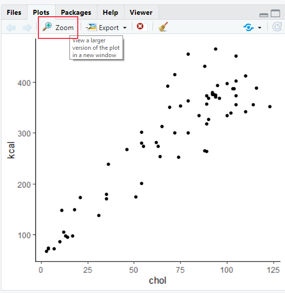{width=50%}


A second option is after you have made your plot, you can hit the 'export' tab on the plot viewer. Choose either "Save as Image" or "Save as PDF" and then choose how and where you want to save the image.

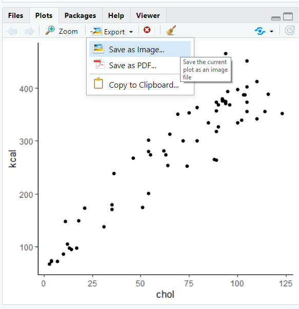{width=50%}


A more premium option is to use a function from ggplot called `ggsave()`.  The first step you should do is to assign your plot to an object name. In the code below, we are making a scatterplot that we save to the object `plot1`:

```{r, fig.width=5, fig.height=4}
plot1 <- ggplot(cheese, aes(x = chol, y = kcal)) + 
     geom_point(color='purple', size=2) + 
     theme_classic() +
     xlab("Cholesterol") +
     ylab("Calories in kcal") +
     ggtitle("Cheese")

plot1
```

Next, run a line of code that will save your plot.  You type `ggsave()`. The first thing you put inside this is the location where you want your plot to be stored. You need to write a location on your computer. If you are using an Rproject such as with this course, you could put your plot in a folder called `img`.  Remember to type the file extension `.png` or `.pdf` after the name of your new plot.  The second thing you need to write is the name of the graph object you wish to save. Here our graph is called `plot1`.

```{r, eval=FALSE}
ggsave("img/cheese_plot.png", plot1)  # save as a png

ggsave("img/cheese_plot.pdf", plot1)  # save as a pdf
```


You can also play around with the width and height of your saved image. You probably need to trial and error this a few times to get the proportions that you really like. Here we are making an image that is 10 inches wide and 8 inches high.

```{r, eval=FALSE}
ggsave("img/cheese_plot2.png", plot1, width = 10, height = 8)  #(in inches, though can be in cm)

```

<br><br><br>

<!--chapter:end:04-DataViz.Rmd-->

# Descriptives

Descriptive statistics describe basic features of the data in simple summaries. Examples include reporting measures of **central tendency** such as the mean, median, and mode. These are values that represent the most typical or most central point of a data distribution. Another class of descriptives are measures of **variability** or **variation** such as variance, standard deviation, ranges or interquartile ranges. These measures describe the spread of data. As well as being useful summaries in their own right, descriptive statistics are also used in data visualization to summarize distributions. There are several functions in R and other packages that help to get descriptive statistics from data. Before we go into detail about how to use R to get descriptives, we'll describe these measures of central tendency and variation in a bit more detail.


## Sample vs Population

The first thing we would like to discuss is the difference between **samples** and **populations**.  We can calculate descriptive measures such as means and standard deviations for both samples and populations, but we use different notation to describe these.  A population is all subjects that we could possibly collect data from. For example, if we were interested in the IQ scores of eighth graders in Texas, then our population of interest is all eighth graders in Texas. If we wished to study maze learning in juvenile rats, then our population of interest would be all juvenile rats. If we were studying leaf growth in sunflowers, then our population of interest is all sunflowers.  If we were able to measure the size of leaves on all sunflowers in existence, or measure the maze learning of all juvenile rats in the world, or the IQ of all eighth graders in Texas, then we would have data for the whole population. We would then be able to say something about the mean or median or some other descriptive about the population. Clearly, it is not always possible to measure every subject in a population. Of our three examples, it may just about be possible to measure the IQ of all Texas eighth graders although it would be a lot of work. It seems unlikely to be possible to measure the leaf growth of all sunflowers or the maze learning of all juvenile rats. Instead, what we typically do is to collect data on a subset of subjects. We call this subset a **sample**.   For instance, if we picked 10 sunflowers then we would collect data on just those sunflowers. We may be able to calculate the average leaf size of these 10 sunflowers and use that to **estimate** what the true leaf size is of all sunflowers.  We call the descriptive measures of samples **estimates** or **statistics**, whereas the descriptive measures of populations are called **parameters**.

Let's now discuss different descriptive measures in turn.


## Sample and Population Size

This isn't strictly a descriptive measure - but it is worth pointing out that the notation for the size of your data is different depending upon whether you are talking about a sample of a population.  If you are taking about a sample, then we use the lower case $n$ to refer to the sample size.  So, if you see $n=10$ this means that the sample size is 10. e.g. you picked 10 sunflowers to collect data on.  If you see the upper case $N$ this refers to the population size. So if you see that the population size is $N=1200000$ this refers to a population size of 1.2 million.


## Central Tendency

The first class of descriptives we will explore are measures of central tendency. These can be thought of as values that describe what is the most common, most typical or most average value in a distribution. Also, here we are using the term **distribution** to refer to a group of numbers or our data.

We'll use the following dataset as an example. Let's imagine that this is a sample of data:

```{r}
x <- c(1, 14, 12, 5, 3, 6, 11, 15, 9, 5, 4, 2, 7, 5, 3, 8, 11)
x
```

We can calculate the sample size using `length()`:

```{r}
length(x)
```

We can see that the sample size is $n=17$.


### Mode

The **mode** or **modal value** of a distribution is the most frequent or most common value in a distribution. The number that appears the most times in our sample of data above is `5`. The mode is therefore 5.  In our example, it's possible to manually check all the values, but a quicker way to summarize the frequency count of each value in a vector in R is to use `table()` like this:

```{r}
table(x)
```

We can see that there are 3 instances of the number 5 making it the mode.  There are two instances of 11 and 3, and every other number in the distribution has only 1 instance.

Is 5 really the 'middle' of this distribution though? The mode has some serious deficiencies as a measure of central tendency in that although it picks up on the most frequent value, that value isn't necessarily the most central measure.


### Median

The median value is the **middle** value of the distribution. It represents the value at which 50% of the data lies above the median, and 50% lies below the data.

One way to look at this is to visualize our distribution as a dot plot:

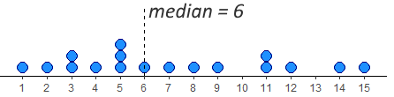

We have 17 datapoints, which is an odd number. In this case, we want the number/dot at which half the remaining datapoints (8) are below the median, and half (the other 8) are above the median. You can see in the image, that the median value is therefore 6. This leaves 8 dots below it and 8 dots above it.

To do this by hand, we would first order the data, and then work from the outside to the inside of the distribution, crossing off one from each end at a time. The image below shows how we're doing that using different colors to show the crossing out:


In R, we have a quick shortcut for calculating the median, and it's to use the function called `median()`:

```{r}
median(x)
```


If we have an even number of values in our distribution, then we take the average of the middle two values. For example, look at the image below. It has 12 numbers in the distribution, so we take the average of the 6th and 7th number:


Once we've crossed out each number going from outside to in, we're left with the 6th and 7th numbers being 10 and 15. The average of these numbers is 12.5, so the median is 12.5.  We can see that with `median()`:

```{r}
y <- c(5,7,7,9,9,10,15,16,16,21,21,22)
median(y)
```


### Mean

The mean, or **arithmetic mean** is the measure that most people think about when they think of the *average* value in a dataset or distribution. There are actually various different ways of calculating means, so the one that we will focus on is called the arithmetic mean. This is calculated by adding up all the numbers in a distribution and then dividing by the number of datapoints.  You can write this as a formula. For a sample, it looks like this:

$\overline{x} = \frac{\Sigma{x}}{n}$


And for a population it looks like this:  


$\mu = \frac{\Sigma{x}}{N}$

Notice that we use $\overline{x}$ to denote the mean of a sample, and $\mu$ to denote the mean of a population. Despite these notation differences, the formula is essentially exactly the same.


Let's calculate the arithmetic mean of our distribution `x`:


```{r}

sum_of_x <- 1 + 14 + 12 + 5 + 3 + 6 + 11 + 15 + 9 + 5 + 4 + 2 + 7 + 5 + 3 + 8 + 11

sum_of_x

```

So, here $\Sigma{x}=121$.  That makes the mean:

```{r}
sum_of_x / 17
```

This makes the mean $\overline{x}=7.12$.  The shortcut way of doing this in R, is to use the function `mean()`:

```{r}
mean(x)
```

We'll talk more about the pros and cons of the mean and median in future chapters.


## Variation

As well as describing the central tendency of data distributions, the other key way in which we should describe a distribution is to summarize the **variation** in data. This family of measures look at how much **spread** there is in the data. Another way of thinking about this is that these measure give us a sense of how *clumped* or how *spread out* the data are.


### Range

The simplest measure of spread is the **range**. This simply is the difference between the minimum and maximum value in a dataset. Looking at our distribution `x`, the minimum value is 1, and the maximum value is 15 - therefore the range is $15-1 = 14$.

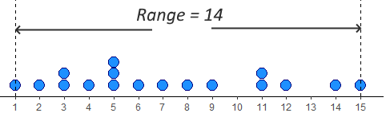


The problem with range as a measure can be illustrated by just adjusting our data distribution slightly. Say, instead of having a datapoint at 15, we had a value at 25.  Now the range is 24 instead of 14. This suggests that the data is much more spread out, but in reality it is just one datapoint that is forcing the range to be much higher - the rest of the data is no more clumped or spread out.  This is the major drawback of the range - it can be easily influenced by outliers - as illustrated below.


In R, we can calculate the minimum, maximum and range of a distribution using the functions `min()`, `max()` and `range()`. Although `range()` just gives us the minimum and maximum values, we have to do the rest:

```{r}
min(x)
max(x)
range(x)
```


### Interquartile Range

The interquartile range or IQR is another measure of spread. It is roughly equivalent to the range of the middle 50% of the data.  One way to think about this is to consider how the median splits the data into a bottom half and a top half. Then, calculate the median of the lower half of the data and the median of the upper half of the data. These values can be considered to be the lower quartile and upper quartile respectively. The interquartile range is the difference between these values.  A visualization of this is below:


The median of the bottom half of our data is 3.5 (the average of 3 and 4). The median of the top half is 11 (the average of 11 and 11). This makes the IQR equal to $11-3.5 = 7.5$.


If we start with an even number of numbers in our distribution, then we include each of the middle numbers in their respective lower and upper halves.  The image below represents this:


With this distribution, we calculated the median to be 12.5 as the numbers 10 and 15th were the middle two values. Because of this, we include 10 in the bottom half and 15 in the top half. When we work out to in on each of these halves, we find that the median of the bottom half is 8 (the average of 7 and 9) and the median of the upper half is 18.5 (the average of 16 and 21). Therefore, the lower quartile is 8 and the upper quartile is 18.5, making the IQR equal to $18.5-8=10.5$.


The above explanation of how to calculate the IQR is actually just one way of trying to estimate the "middle 50%" of the data. With this way of doing it, the lower quartile represents the 25% percentile of the data (25% of values being lower than it and 75% of values being higher). The upper quartile represents the 75% percentile of the data (75% of values being lower than it and 25% being higher).

Unfortunately, there are several ways of calculating the lower and upper quartiles and estimating where these 25% and 75% percentiles are. When we calculate them in R, the default method it uses is actually different to our 'by hand' method. To calculate quartiles, we use the function `quantile()` (note - not quartile!) but we have to put a second argument to say if we want the lower quartile or upper quartile.


```{r}
quantile(x, 0.25) #0.25 means lower quartile
quantile(x, 0.75) #0.75 means upper quartile
```

You can see these values are slightly different to our 'by hand' method. The upper quartile of `x` agrees with our method being 11. By hand we got the lower quartile to be 3.5, but R gives it as 4. This would make the IQR equal to $11-4 =7$. The quick way of getting that in R is to use `IQR()`:

```{r}
IQR(x)
```


We recommend using the R functions to calculate quartiles and interquartile ranges - it is a slightly stronger method than our by-hand method. You can actually do the by-hand method in R by adding `type=6` to the functions. There are actually nine different ways of calculating these in R - which is ridiculous!

```{r}
quantile(x, 0.25, type = 6)
quantile(x, 0.75, type = 6)
IQR(x, type = 6)
```


### Average Deviation

An alternative way of looking at spread is to ask how far from the center of the data distribution (i.e. the mean) is each datapoint on average. Distributions that are highly clumped will have most datapoints very close to the distribution's mean. Distributions that are spread out will have several datapoints that are far away from the mean.

Look at the two distributions below. Both of them have means of 10. The top distribution (A) however is much more clumped than the bottom distribution (B) which is more spread out.


Let's look at these in more detail. We'll start with distribution A.  We can calculate the difference of each datapoint from the mean (10) like this:

```{r}
A <- c(5,8,8,9,9,10,10,11,12,12,12,14)
A - mean(A)
```

If we add up all of those differences from the mean, then they will equal 0. We can show this like this:

```{r}
sum(A - mean(A))
```

A way to count up all the differences from the mean and to make sure that they count is to make each number positive regardless of its sign. We can do this using `abs()` in R:

```{r}
abs(A - mean(A))
```

When we sum all of these values up, we get the total of all the differences from the mean of each datapoint:

```{r}
sum(abs(A - mean(A)))
```

We see that this total is 22.  In formula notation, we find that $\Sigma|(x - \overline{\mu})|$. Here $x$ represents each datapoint. $\overline{\mu}$ represents the population mean. $| |$ represents 'take the absolute values of', and $\Sigma$ means "sum up".

To get the "average deviation" we simply divide our sum of difference scores by the number of datapoints, which is 12 in this case.  The formula for average deviation is:


$AD = \frac{\Sigma|(x - \overline{\mu})|}{N}$

```{r}
22/12
```

Our average deviation is therefore 1.83.  This can be interpreted as each datapoint being on average 1.83 units away from the mean of 10.


Another way to have got the $N$ would have been to use `length()` which counts the number of datapoints:

```{r}
sum(abs(A - mean(A))) / length(A)
```


We could do the same for distribution B. Calculate the sum of all the difference scores, and then divide by the $N$:

```{r}
B <- c(2,3,4,6,8,10,11,12,13,15,17,19)

#difference scores
B - mean(B)

# absolute difference scores
abs(B - mean(B))

# sum of absolute difference scores
sum(abs(B - mean(B)))

# average deviation
sum(abs(B - mean(B))) / length(B)
```

Here, the total sum of differences from the mean is 54. The average deviation is 4.5.  This value being higher than 1.83, shows that distribution B is more spread out than distribution A, which makes sense just looking at the dotplots of the data.


### Standard Deviation

An alternative, and much more common method of calculating the 'deviation' from the mean of the average datapoint is the standard deviation. This is very similar to the absolute deviation, but the method of making the difference scores positive is different. In average deviation, we just ignore the sign of the difference scores and we make everything positive (this is called taking the absolute value). In standard deviation the method used to make these difference scores positive is to square them.


Let's look at how this one works for our two distributions. We'll start with distribution A again.

First step, is again to get the difference scores, by taking each datapoint away from the mean of the distribution:

```{r}
A - mean(A)
```


Next, we square these difference scores to get positive values:

```{r}
(A - mean(A))^2
```

Notice that the datapoints that are furthest from the mean get proportionally larger than values that are close to the mean. Squaring has this effect.


We need to sum these "squared differences" to get a measure of how much deviation there is in total - this figure can also be called the **Sum of Squares** or **Sum of Squared Differences**:

```{r}
sum((A - mean(A))^2)
```

The total of the squared differences is 64. The notation for this is:

$\Sigma(x-\mu)^2$


To get a sense of the average squared difference, we then divide the total of the squared differences by our $N$:

```{r}
sum((A - mean(A))^2) / 12
```

The average squared difference is 5.33. The notation for this is $\frac{\Sigma(x-\mu)^2}{N}$.

This is a useful measure of deviation, but unfortunately it is still in the units of "squared differences". To get it back to the original units of the distribution we just square root it and we call this the "standard deviation":

```{r}
sqrt(5.333333) 
```

The standard deviation $\sigma=2.309$.  The notation for this is:

$\sigma = \sqrt{\frac{\Sigma(x-\mu)^2}{N}}$

We are using $\sigma$ to represent the **population standard deviation**.


We can do the same thing for our population B. Let's calculate the difference scores, then square them, then add them up, then divide by $N$, and finally square root:

```{r}
# difference scores
B - mean(B)

# squared difference scores
(B - mean(B))^2

# Sum of squared differences
sum((B - mean(B))^2)

# Average squared difference
sum((B - mean(B))^2) / 12

# Standard Deviation
sqrt(sum((B - mean(B))^2) / 12)

```

The population standard deviation $\sigma$ for population B is 5.31. Again, as this value is higher than 2.31 this suggests that population B is more spread out than population A, because its datapoints are on average further from the mean.


### Variance

Variance is related to standard deviation. In fact, it is just standard deviation squared. It can be calculated by the formula:

$\sigma^2 = \sigma^2$

which is a bit ridiculous. Variance is denoted by $\sigma^2$ and is calculated by squaring the standard deviation $\sigma$.

It's actually the value you get before you do the square root step when calculating standard deviation. Therefore, we can actually say:


$\sigma^2 = \frac{\Sigma(x-\mu)^2}{N}$


### Average versus Standard Deviation

So why do we have two methods for calculating the deviation from the mean. We have the "average deviation" and the "standard deviation".  One thing you should notice is that the standard deviation is larger than the average deviation.  Distribution A had an average deviation of 4.5 and a standard deviation of 5.3.  Distribution B had an average deviation of 1.83 and a standard deviation of 2.3.  The reason for this is that squaring difference scores leads to larger values than just taking absolute values.  So why do we do the squaring thing?  The main reason is that it emphasizes datapoints that are further away from the mean, and this can be an important aspect of spread that we need to take account for. Because of that, it is favored to use the 'standard deviation' above the 'average deviation'.


### Sample Standard Deviation

Something that is often confusing in introductory statistics is that there are two different formulas for calculating the standard deviation. The one we have already introduced above is called the **population standard deviation** and its formula is:


$\sigma = \sqrt{\frac{\Sigma(x-\mu)^2}{N}}$


But, we use a different formula when we are calculating the standard deviation for a *sample*. This is called the **sample standard deviation**:


$s = \sqrt{\frac{\Sigma(x-\mu)^2}{n-1}}$


Notice two things. First, we use the notation $s$ to indicate a sample standard deviation. Second, instead of dividing by $N$ in the formula, we divide by $n-1$.  


So, for our example data distribution of `A`, this is how we would calculate $s$:

First, we get the difference scores, by subtracting the mean of the distribution from each score:

```{r}
#difference scores
A - mean(A)
```

Second, we square these difference scores to make them positive and to emphasize larger difference scores:

```{r}
#square the difference scores
(A - mean(A))^2
```


Third, we sum up all the squared difference scores:


```{r}
#sum the squared difference scores
sum((A - mean(A))^2)
```

Fourth, we divide this sum by $n-1$, which technically gives us the variance:

```{r}
#divide by n-1 to get the variance
# the 'n' is 12 here
(sum((A - mean(A))^2))/(12-1)
```

Finally, we square root this value to get the sample standard deviation - a measure of the typical deviation of each datapoint from the mean:

```{r}
#square root to get the SD
sqrt((sum((A - mean(A))^2))/(12-1))
```

Here we have manually calculated the sample standard deviation $s=2.412$. Earlier in this chapter we calculated the population standard deviation of this same distribution to be $\sigma=2.309$. Notice that the sample standard deviation $s$ is larger than the population standard deviation $\sigma$. This is because $n-1$ will always be smaller than $N$, inflating the final result.

So far, we haven't shown you the shortcut for calculating the standard deviation in R.  It's actually just the function `sd()`:

```{r}
sd(A)
```

Hopefully you notice that the output of `sd()` is the sample standard deviation and not the population standard deviation.

There is actually no built in function for calculating the population standard deviation $\sigma$ in R. The below code is a custom function to calculate it that we made. It's called `pop.sd()`.

```{r}
# this is a custom function to calculate
# the population standard deviation 
 pop.sd <- function(s) { 
   sqrt(sum((s - mean(s))^2)/length(s)) 
 } 
```

When we look at the population standard deviation of A we can see that it matches what we worked out by hand earlier:

```{r}
pop.sd(A) 
```


Let's look at distribution B for its sample and population standard deviations:

```{r}
sd(B)
pop.sd(B)
```

Again you can see that $s=5.543$ is greater than $\sigma=5.307$.  Both these values are higher than the standard deviations for distribution A, indicating that distribution B is more spread out and less clumped than distribution A.


### Sample versus Population Standard Deviation

So why are there two formulas, and why do we divide by $n-1$ in the sample standard deviation?  The short answer is that whenever we determine the standard deviation for a sample, our goal is technically not to 'calculate' the standard deviation just for that sample. The bigger goal is that we are trying to **estimate** the population standard deviation $\sigma$. However, when we use the population SD formula on samples, we consistently underestimate the real population standard deviation. Why is this?  Basically it's for two reasons. First, within any one sample we typically have much less variation than we do in our population, so we tend to underestimate the true variation. Secondly, when we have our sample we use our sample mean $\overline{x}$ as an estimate of the population mean $\mu$. Because $\overline{x}$ will be usually slightly different from $\mu$ we will be usually underestimating the true deviation from the mean in the population.

The bottom line is this:  using the population SD formula for a sample generally gives an **underestimate** of the true population standard deviation $\sigma$. The solution is to use a fudge-factor of dividing by $n-1$ which bumps up the standard deviation. This is what we do in the sample standard deviation formula.


In the sections below, we are going to visually demonstrate this.  Hopefully this helps to show you that dividing by $n-1$ works. Don't worry too much about any code here, the aim isn't for you to learn how to run simulations such as these, but we want you to be able to visually see what's going on.


#### Comparing population and sample means

Before we get to why we need a separate formula for the sample standard deviation, let's show you why we don't need a separate formula for the sample mean compared to the population mean. Both of these formulas are essentially the same:

Sample mean:
$\Large\overline{x} = \frac{\Sigma{x}}{n}$

<br>

Population mean:  
$\Large \mu = \frac{\Sigma{x}}{N}$


Let's assume the following data distribution is our population, we'll call it `pop`. The following code creates a population of 10000 numbers drawn from a random normal distribution (see section \@ref(normal-distribution)) with a population mean of 8 and population standard deviation of 2. Because we're randomly drawing numbers to make our population, the final population won't have a mean and standard deviation that are precisely 8 and 2, but we can calculate what they turn out to be:


```{r}
set.seed(1) # just so we all get the same results

pop <- rnorm(10000, mean = 8, sd = 2) #100 random numbers with mean of 8, popSD of 2.

```

We now have our population of size $N=10000$. We can precisely calculate the population mean $\mu$ and population standard deviation $\sigma$ of our 10000 numbers using `mean()` and `pop.sd()`:

```{r}
mean(pop)      

pop.sd(pop) 
```

So our population has a mean $\mu=7.99$ and population standard deviation $\sigma=2.02$.


Let's now start taking samples. We'll just choose samples of size $n=10$. We can get samples using `sample()` in R. Let's look at the sample mean of each sample:

```{r}
#first sample
samp1 <- sample(pop, size = 10, replace = T)
samp1

mean(samp1)


```

Here our sample mean $\overline{x}=8.62$ which is close-ish, but a fair bit above $\mu=7.99$.  

Let's do it again:

```{r}
#second sample
samp2 <- sample(pop, size = 10, replace = T)
samp2

mean(samp2)


```

Again our value of $\overline{x}=8.10$ is above $\mu=7.99$, but this time much closer.

Let's do a third sample:

```{r}
#third sample
samp3 <- sample(pop, size = 10, replace = T)
samp3

mean(samp3)


```


This time our value of $\overline{x}=7.86$ is a bit below $\mu=7.99$.


What if we did this thousands and thousands of times? Would our sample mean be more often lower or higher than the population mean $\mu=7.99$?

This is what the code below is doing - it's effectively grabbing a sample of size 10 and then calculating the sample mean, but it's doing this 20,000 times. It's storing all the sample means in an object called `results.means`.

Note: you don't need to know how this code works! though do reach out if you are interested.

```{r}
results.means<- vector('list',20000)

for(i in 1:20000){
  samp <- sample(pop, size = 10, replace = T)
  results.means[[i]] <- mean(samp)
}
```


Let's look at 10 of these sample means we just collected:

```{r}
unlist(results.means)[1:10]
```

Some are above and some are below $\mu=7.99$.

Let's calculate the mean of all the 20,000 sample means:

```{r}
mean(unlist(results.means))
```

It turns out that the average sample mean that we collect using the formula $\Large \overline{x} = \frac{\Sigma{x}}{n}$ is 7.99 which is the same as the population mean $\mu$. What this means is that this formula is perfectly fine to use to **estimate** the population mean. It is what we call an **unbiased estimator**.  Over the long run, it gives us a very good estimate of the population mean $\mu$.  Here is a histogram of our sample means from our 20,000 samples: 

```{r, echo=FALSE, message=FALSE, warning=FALSE}
library(tidyverse)
ggplot(data.frame(x = unlist(results.means)), aes(x=x)) +
         geom_histogram(color="black",fill="lightseagreen", binwidth=.05)+
         geom_vline(xintercept=7.99, lwd=1)+
         theme_classic()+
  xlab("Sample mean")


```

The vertical solid black line represents $\mu=7.99$. This histogram is centered on this value, showing that our sample mean formula is unbiased in estimating the population mean - overall, it isn't under- or over-estimating the population mean.

As a side note - what we just did in the exercise above was to calculate a *sampling distribution of sample means* - something we'll discuss much more in section \@ref(what-is-a-sampling-distribution). 

<br>

#### Sample standard deviation as an unbiased estimator

Let's do something similar with our two formulas for calculating standard deviation. We'll take samples of size $n=10$ and use the sample standard deviation $s$ and the population standard deviation $\sigma$ formulas to estimate the true $\sigma=2.02$.


```{r}
#first sample
sd(samp1)
pop.sd(samp1)
```

With the first sample, both estimates are lower than $\sigma=2.02$, although the sample standard deviation is a bit closer to $\sigma=2.02$.


```{r}
#second sample
sd(samp2)
pop.sd(samp2)
```

With the second sample of 10, both estimates are even lower than $\sigma=2.02$. Again, the sample standard deviation formula produces a result that is closer to 2.02 than does the population deviation formula.

What if we did this for 20,000 samples of size 10?  We'll save the estimates using the sample SD formula in the object `results.samp.sd` and the estimates using the population SD formula in `results.pop.sd`. Again, don't worry about the code here - just focus on the output:


```{r}
results.samp.sd<- vector('list',20000)
results.pop.sd<- vector('list',20000)

for(i in 1:20000){
  samp <- sample(pop, size = 10, replace = T)
  results.samp.sd[[i]] <- sd(samp)
  results.pop.sd[[i]] <- pop.sd(samp)
  }
```


We can work out the average estimate of the standard deviation across all 20,000 samples:

```{r}
mean(unlist(results.samp.sd))
mean(unlist(results.pop.sd))
```

So, over 20,000 samples both formulas actually overall underestimate the true population standard deviation of $\sigma=2.02$, however, the sample standard deviation formula is closer with it's average being 1.97 compared to the population standard deviation's formula being at 1.87.

We can graph this like this:

```{r, echo=FALSE, message=FALSE, warning=FALSE}

ddx <- data.frame(sample_formula = unlist(results.samp.sd),
           pop_formula = unlist(results.pop.sd) ) %>%
  pivot_longer(1:2)

ggplot(ddx, aes(x=value)) +
         geom_histogram(color="black",fill="lightseagreen", binwidth=.05)+
         geom_vline(xintercept=2.02, lwd=1)+
         theme_classic()+
  facet_wrap(~name) +
  xlab("Estimate of Standard Deviation")+
  theme(strip.background = element_blank())


```

This visualization shows us a few things. First, over all 20,000 samples, some of our estimates of the true standard deviation $\sigma$ are higher and some are lower regardless of which formula we use. However, when we use the population formula (dividing by $N$), we have far more samples with estimates of the standard deviation $\sigma$ which are too low. The distribution is clearly not symmetrical.  If we consider the right histogram, when we use the sample SD formula (dividing by $n-1$), we correct this by and large. This histogram is closer to symmetrical, and we are not underestimating the true population standard deviation nearly as much. In this way, we called the sample standard deviation $s$ an **unbiased estimator**.

If we were to take larger sample sizes, then our estimates of the population standard deviation $\sigma$, would get better and better when using the sample standard deviation formula.


<br><br>


## Descriptive Statistics in R

The above sections interweaved some theory with how to get descriptive information using R. In this section we'll summarize how to get descriptive summaries from real data in R.

The dataset that we'll use is a year's worth of temperature data from Austin, TX.

```{r message=FALSE}
atx <- read_csv("data/austin_weather.csv")
head(atx) # first 6 rows
```


The `temp` column shows the average temperature for that day of the year in 2019. Here is a histogram showing the distribution. It is often hot in Texas.

```{r}
ggplot(atx, aes(x= temp)) + 
  geom_histogram(color="black", fill="lightseagreen", binwidth = 2)+
  theme_classic()+
  xlab("Average temperature")
```


**Basic Descriptives**

Here is a list of some the basic descriptive commands such as calculating the $n$, the minimum, maximum and range. We apply each function to the whole column of data `atx$temp`, i.e. all the numbers of the distribution:

```{r}
length(atx$temp) # length this tells you the 'n'

range(atx$temp) # range 

min(atx$temp) # minimum

max(atx$temp) # maximum

```


**Mean, Median, and Mode**

These mean and median are straightforward in R:

```{r}
mean(atx$temp) # mean

median(atx$temp) # median

```


For some descriptives, like mode, there is not a function already built into R. One option is to use `table()` to get frequencies - but this isn't useful when you have relatively large datasets. The output is too large. Another option is to use `tidyverse` methods. Here, we use `group_by()` to get each temperature, then we use `count()` to count how many of each temperature we have, and then `arrange()` to determine which is most frequent:

```{r}
atx %>%
  group_by(temp) %>%
  count() %>%
  arrange(-n)
```

This shows us that the modal value is 84.8F.  In reality however, the mode is never something that you will calculate outside of an introductory stats class.


**Variation**

The default standard variation measure in R is the sample standard deviation `sd()`, and is the one you should pretty much always use:

``` {r}
sd(atx$temp) #  sample standard deviation
```


Variance can also be calculated using `var()` - remember this is the standard deviation squared. When you calculate this using the sample standard deviation $s$ the formula notation for the variance is $s^2$:

```{r}
var(atx$temp) # variance 
```


The lower quartile, upper quartile and inter-quartile range can be calculated like this:


``` {r}
quantile(atx$temp, .25)  # this is the lower quartile

quantile(atx$temp, .75)  # this is the upper quartile

IQR(atx$temp)   # this is the inter-quartile range.

```


Remember there are several ways of calculating the quartiles (see above).


### Dealing with Missing Data

Often in datasets we have missing data. In R, missing data in our dataframes or vectors is represented by `NA` or sometimes `NaN`.  A slightly annoying feature of many of the descriptive summary functions is that they do not work if there is missing data.

Here's an illustration. We've created a vector of data called `q` that has some numbers but also a 'missing' piece of data:

```{r}
q <- c(5, 10, 8, 3, NA, 7, 1, 2)
q
```

If we try and calculate some descriptives, R will not like it:

```{r}
mean(q)

sd(q)

range(q)

median(q)

```

What we have to do in these situations is to override the missing data. We need to tell it that we really do want to get these values and it should remove the missing data before doing that. We do that by adding the argument `na.rm=T` to the end of each function:

```{r}
mean(q, na.rm=T)

sd(q, na.rm=T)

range(q, na.rm=T)

median(q, na.rm=T)

```

Now R is happy to do what we want.


The only 'gotcha' that you need to watch out for is `length()` which we sometimes use to calculate the $n$ of a vector. If we do this for `q`, we'll get 8, which includes our missing value:


```{r}
length(q)
```

This is a way of getting around that - it looks odd, so we've just put it here for reference. It's not necessary for you to remember this. It's essentially asking what is the length of `q` when you don't include the `NA`:

```{r}
length(q[!is.na(q)])
```


## Descriptives for Datasets

Often in studies, we are interested in many different outcome variables at once. We are also interested in how groups differ in various descriptive statistics. The following code will show you how to get descriptive statistics for several columns. In the next section we'll discuss getting descriptives for different groups from data. 


First read in these data that are looking at various sales of different video games.

```{r message=FALSE}
vg <- read_csv("data/videogames.csv")

head(vg)
```


One way to get quick summary information is to use the R function `summary()` like this:

```{r}
summary(vg)

```


You'll notice here that it just gives you some summary information for different columns, even those that have no numerical data in them. It's also not broken down by groups.  However, `summary()` can be a quick way to get some summary information.


A slightly better function is `Describe()` in the `psych` package. Remember to install the `psych` package before using it.  Also, here we are telling it only to provide summaries of the relevant numeric columns (which are the 6th through 11th columns):

```{r, warning=FALSE, message=FALSE}
library(psych)
describe(vg[c(6:11)])

```

This function also includes some descriptives that we don't necessarily need to worry about right now, but it does contain most of the ones we are concerned with.


### Descriptives for Groups

There are a few ways of getting descriptives for different groups.  In our videogame dataset `vg`, we have a column called `genre`. We can use the function `table()` to get the $n$ for all groups. 

```{r}
table(vg$genre)
```

We have four different groups of genres, and we might want to get descriptives for each. We can use the function `describeBy()` from the `psych` package to get a very quick and easy, but a bit annoying, look at group summaries. It also ignores missing data which is helpful.  We dictate which group to get summaries by using the `group = "genre"` argument:

```{r, warning=FALSE, message=FALSE}
describeBy(vg[c(4,6:11)], group = "genre")
```


The above is a quick and dirty way of getting summary information by group. But it is messy. We suggest an alternative method which is to write code using the `tidyverse` package. This can give us descriptive statistics in a more organized way. 

For instance, if we wanted to get the mean of the column `NA_sales` by `genre` we would use `group_by()` and `summarise()` in this way:


```{r}
vg %>% 
  group_by(genre) %>% 
  summarise(meanNA = mean(NA_sales))

```

The above code can be read as taking the dataset `vg`, and then grouping it by the column `genre`, and then summarizing the data to get the mean of the `NA_sales` column by group/genre.  Please not the British spelling of `summarise()`. The `tidyverse` was originally written using British spelling, and although R is usually fine with British or US spelling, this is one situation in which it is usually helpful to stick with the British spelling for boring reasons.

If you had missing data, you'd do it like this. 


```{r}
vg %>% 
  group_by(genre) %>% 
  summarise(meanNA = mean(NA_sales, na.rm = T)) 
```


You can do several summaries at once like this. Here we are getting the means and sample standard deviations of the `NA_sales` and `EU_sales` columns by `genre`:

```{r}
vg %>% 
  group_by(genre) %>% 
  summarise(meanNA = mean(NA_sales),
            sd_NA = sd(NA_sales),
            meanEU = mean(EU_sales),
            sd_EU = sd(EU_sales))
```

To save time, you can tell it to just get the summary of all numeric columns by using `summarise_if()`. 

```{r}
vg$year <- as.factor(vg$year) # just need to make year non-numeric first so doesn't get included in the numeric columns


vg %>%
  group_by(genre) %>%
  summarise_if(is.numeric, mean, na.rm = T) %>%
  as.data.frame()


 vg %>%
  group_by(genre) %>%
  summarise_if(is.numeric, sd, na.rm = TRUE) %>%
  as.data.frame()

```

<br><br>


### Counts by Group

Another common use of `group_by()` is to get counts of how many we have of each categorical variable.  For instance, let's look more at the videogames dataset `vg`.

We have previously seen that we can use `table()` to count simple frequencies.  For instance, the following:

```{r}
table(vg$genre)
```
shows us how many observations of each genre we have. We have 997 Action games, 349 Racing games, 583 shooter games and 573 sports games.

We can look at how these breakdown by platform by adding one more argument into our `table()` function which relates to our second column of interest:

```{r}
table(vg$genre, vg$platform)
```

<br>

We can see here that we have 32 Sports games on the PC, 135 racing games on the PS2 and so on.


This is a nice and straightforward way of doing this. It's also possible to do it using the `tidyverse()` which can come in handy sometimes in some circumstances. To do it this way, we make use of `group_by()` and `count()`.  We tell it the two columns we wish to group our data by (in this case it is the `genre` and the `platform` columns), and then tell it to count how many observations we have:

```{r}
vg %>%
  group_by(genre, platform) %>%
  count()
```

<br>

These data are presented in a slightly different way. The count of each combination is shown in the new `n` column. The nice thing about this tidy approach is that we can further manipulate the data.  This is better illustrated with an even busier dataset, the `catcolor.csv` dataset:

```{r,warning=FALSE, message=FALSE}
cats <- read_csv("data/catcolor.csv")
head(cats)
```

Say we want to know how many male and female cats of each breed we have.  With tidyverse, we would do it like this: 

```{r, warning=FALSE, message=FALSE}
cats %>%
  group_by(breed,sex) %>%
  count()

```

<br>  

This  gives us a lot of information.  In fact, we have 87 rows of data.  However, we could next sort by the newly created `n` column, to see which sex/breed combination we have the highest amount of. We can use `arrange()` to do this:

```{r, warning=FALSE, message=FALSE}
cats %>%
  group_by(breed,sex) %>%
  count() %>%
  arrange(-n)
```

<br>

Another thing we can do is to count how many there are of a given category or categories that satisfy certain conditions.  For example, let's say we wanted to know the most popular name of each breed for orange cats.  We could first filter the data by `color1` to only keep orange cats, then group by `name` and `breed` and then use `count()` and `arrange()`:

```{r, warning=FALSE, message=FALSE}
cats %>%
  filter(color1 == "orange") %>%
  group_by(name,breed) %>%
  count() %>% 
  arrange(-n)
```

It turns out that the most popular names overall for orange cats are for domestic shorthairs who are called Oliver, then Oscar, Ginger, Sam, Garfield and so on.

To do exactly what we said above, we can do something a bit different. After we've done all the above, we can then tell the chain that we only want to group by `breed` this time, and we want to keep the highest value with `top_n(1)`.  This returns the following:


```{r, warning=FALSE, message=FALSE}
cats %>%
  filter(color1 == "orange") %>%
  group_by(name,breed) %>%
  count() %>% 
  arrange(-n) %>% 
  group_by(breed) %>%
  top_n(1)
```

Charlie, Gilbert and Pumpkin are all the most common names for orange domestic longhairs!

<br>
<br>


<!--chapter:end:05-Descriptives.Rmd-->

# Distributions


```{r, echo=FALSE}

### A function for calculating the mode

estimate_mode <- function(x) {
  d <- density(x)
  d$x[which.max(d$y)]
}

```


In statistical terms a distribution refers to the range of possible values that can come from a sample space. Another way of stating that is to say that a distribution represents how the probabilities of getting various values are distributed.

There are several classic distributions in statistics. There are distributions such as the normal, t, Poisson, bimodal etc.  

We're going to dig a bit deeper into distributions, in particular the normal distribution.  The best way to look at distributions is to plot histograms.  Let's look at some distributions.


### Uniform Distribution

The first distribution we'll look at is the uniform. A uniform distribution is one where there's an equal probability of getting each value from the distribution.  In the example below, we've grabbed 1,000,000 numbers from a uniform distribution that starts at 0 and ends at 100. Let's look at it's shape:

```{r, echo=FALSE}
library(tidyverse)
uni <- runif(n = 1000000, min = 0, max = 100) 
df_uni <- data.frame(vals = uni)

ggplot(df_uni, aes(x = vals)) + 
  geom_histogram(color='black', fill='lightseagreen', boundary=0, binwidth = 5) +
  theme_classic() +
  ggtitle("Uniform Distribution")

```

As you can see, the histogram that we have generated is roughly flat across the top. This means that we have equal frequency counts in each bin. Each bin here is 5 across, so the first bin is 0-5, the next bin is 5-10, and so on. We have 25 bins in total in this histogram, and each has roughly 50,000 values in it.  This is the classic shape of the uniform distribution.


### Bimodal Distribution

Another family of distributions that is worth our attention are bimodal distributions. In these distributions we have two peaks in the distribution.  You can see an example below:


```{r, echo=FALSE}

rn1 <- rnorm(n = 600000, mean = 50, sd = 7.5)
rn2 <- rnorm(n = 600000, mean = 80, sd = 9.5)
bim <- c(rn1,rn2)

df_bim <- data.frame(vals = bim)

ggplot(df_bim, aes(x = vals)) + 
  geom_histogram(color='black', fill='lightseagreen', boundary=0, binwidth = 2.5) +
  theme_classic() +
  ggtitle("Bimodal Distribution")

```


### Normal Distribution

In most domains, the type of histograms i.e. distributions, that we most commonly observe don't have 0 peaks like the uniform distribution or 2 peaks like the bimodal distribution, but have just one peak. These are called **unimodal** distributions. One such classic distribution that is very important to statistics is the normal distribution.

The normal distribution has one peak and is symmetrical, with the same proportion of data on each side of the distribution. In addition, we say that a normal distribution has a *skewness of 0* and a *kurtosis of 3*. We'll talk about what those are a little bit more about what that means very shortly. 

Let's look at a normal distribution. The following normal distribution has a mean of 100 and a standard deviation of 5. We can generate it by collecting 1,000,000 datapoints in R:


```{r}
set.seed(1)

x <- rnorm(n = 1000000, mean = 100, sd = 5.0)

mean(x) 

sd(x) 

dfnorm <- data.frame(vals = x)

p <- ggplot(dfnorm, aes(x = vals))  + 
  geom_histogram(aes(y = ..density..), color = "black", fill = "purple", alpha=.4, binwidth = 0.5) + 
  geom_density(alpha = 0.7, fill = "mistyrose") + 
  theme_classic() +
  xlab("values")

p

```


Normal distributions can vary in their means and standard deviations. Below is an image of a selection of four different normal distributions that all vary in their means and standard deviations.  The dotted vertical black line in each graph indicates where their respective means lie. 


We use special notation to indicate that a distribution is a  Normal Distribution. For instance, for the normal distribution that has a mean of 17 and a standard deviation of 7, we would write:

$N(\mu=17, \sigma^{2}=49)$

which demonstrates that the distribution is approximately normal with a mean of 17 and variance of 49 (which is the standard deviation, 7, squared).


### Standard Normal Distribution

Although normal distributions can have various means or standard deviations, there is one case that we reserve and call the standard normal distribution. This is for the situation where the mean of the distribution is 0 and the standard deviation (and the variance) is equal to 1.


$N(\mu=0, \sigma^{2}=1)$


How does the standard normal distribution come about?  We will discuss more about this distribution in section \@ref(normal-distribution), but briefly it is obtained by converting all the values of a normal distribution into z-scores.  z-scores are calculated by:

$\Large z=\frac{x - {\mu}_x}{\sigma_x}$

This standard normal distribution is very useful in statistics because we can precisely calculate the proportion of the distribution that is to the left or right under the curve at any point of it. This principle forms the basis of several statistical tests.


### Skewness and Kurtosis

Above we described that a normal distribution has a skewness of 0 and a kurtosis of 3, but then we just skipped along and didn't really say anything else.  It's important to take a quick step back and think about these two things. 


#### Skewness

We most commonly evaluate skewness for unimodal distributions (those with one peak). The skewness of a distribution can be either negative or positive, or, if it has no skew whatsoever it will be 0.

It is probably easiest to describe skewness by looking at examples. In the picture below, all distributions have a mean of 100 and a standard deviation of 20.  However, they differ in their skewness. The one on the left has a skew of +0.68, the one on the right has a skew of -0.68. The one in the middle has a skew of 0 and is the only one that is normally distributed.


 


Distributions that have negative skew are also called left skewed because their longest tail extends to the left of the distribution.  Similarly, distributions that have positive skew are called right skewed because their longest tail extends to the right of the distribution.  

Another thing to consider about the skew of the distribution is what happens to the mean, median and mode of the distributions. 

First, let's look at the normal distribution we made earlier in this section that had a mean of approximately 100 and a standard deviation of approximately 5. If we get the median, mode and mean of that distribution, we get the following:

```{r}
mean(x)

median(x)

estimate_mode(x) # R doesn't have a built in mode function, so I'm using this as a proxy


```

We can see here, that all three values are really close to 100.  We can look at this in our plot of the distribution. We've overlaid a red line for the mean, a blue line for the median and an orange line for the mode.  However, they all lie on top of each other at x=100, so it's hard to distinguish them:

```{r}

p + 
  geom_vline(xintercept = median(x), color = "blue", lwd=1)+ 
  geom_vline(xintercept = mean(x), color = "red", lwd=1)+ 
  geom_vline(xintercept = estimate_mode(x), color = "darkorange", lwd=1)

```


Now let's look at some skewed distributions as to what happens to the mode, median and mean in such distributions.


In this dataset, we have 7486 rows of data (observations). Each row is a MLB player. The three numerical columns refer to the career total hits (`totalH`), career total at bats (`totalAB`), and career batting average (`avg`) of each player.


```{r}

bats <- read_csv("data/batting.csv")

nrow(bats)

head(bats)

```


```{r}

#histogram
p1 <- ggplot(bats, aes(x = avg)) + 
  geom_histogram(aes(y = ..density..), 
                 color = "black", 
                 fill = "lightseagreen", 
                 alpha = 0.2,
                 binwidth = .005) + 
  geom_density(colour = 'black', lwd=1) +
  theme_classic() +
  xlab("Career Batting Average")

p1
```

As you can see, this distribution is very negatively (left) skewed. This means that there are many players who have career batting averages between 0.2 and 0.3. There are relatively few players with career averages over 0.3.  There are more averages that are less than 0.2 causing the skew.

We can directly measure the skewness using the `skewness()` function from the `moments` package. We can see that it is highly negatively skewed with a value of -1.01:

```{r, message=FALSE}
library(moments)
skewness(bats$avg) 
```

Let's look at where the median, mean and mode are for this negatively skewed distribution.

```{r}
median(bats$avg)
mean(bats$avg)
estimate_mode(bats$avg)
```

This time, these descriptive values are not equal. The median and mean are lower than the mode. In fact, the mean is lowest of all. 

In negative skewed distributions, the mean and median get pulled towards the skewed tail of the distribution, but the mean gets pulled further.


```{r}
p1 + 
  geom_vline(xintercept = median(bats$avg), color = "blue", lwd=1)+ 
  geom_vline(xintercept = mean(bats$avg), color = "red", lwd=1)+ 
  geom_vline(xintercept = estimate_mode(bats$avg), color = "darkorange", lwd=1)
```


Now let's look at what happens to the mode, median and mean in right skewed distributions. Let's look at the career at-bats of MLB players.


```{r}

#histogram
p2 <- ggplot(bats, aes(x = totalAB)) + 
  geom_histogram(aes(y = ..density..), 
                 color = "black", 
                 fill = "plum", 
                 alpha = 0.2,
                 binwidth = 200) + 
  geom_density(colour = 'black', lwd=1) +
  theme_classic()

p2
```


This distribution is extremely right (positive) skewed. If we measure the skewness we find that the skewness is 1.63. 

```{r}
skewness(bats$totalAB)
```


Now, let's look at the median, mean and mode and plot these on the distribution:

```{r}
median(bats$totalAB)
mean(bats$totalAB)
estimate_mode(bats$totalAB)

p2 + 
  geom_vline(xintercept = median(bats$totalAB), color = "blue", lwd=1)+ 
  geom_vline(xintercept = mean(bats$totalAB), color = "red", lwd=1)+ 
  geom_vline(xintercept = estimate_mode(bats$totalAB), color = "darkorange", lwd=1)

```

In these severely right skewed distribution, we again see that the median and mean get pulled towards the tail of the distribution, with the mean getting pulled even further than the median.  


Let's have a look at a quick summary figure of where the mean, median and mode lie with respect to each other in skewed distributions. As you can see, the mean always gets pulled the furthest to the tail of distributions.The reason for this is that the mean is much more affected by extreme outliers than the median. The median is simply the boundary which divides the top 50% of the data from the bottom 50% of the data. The mean has to include all values in its calculation, so can be largely affected by extreme values more so than the median.


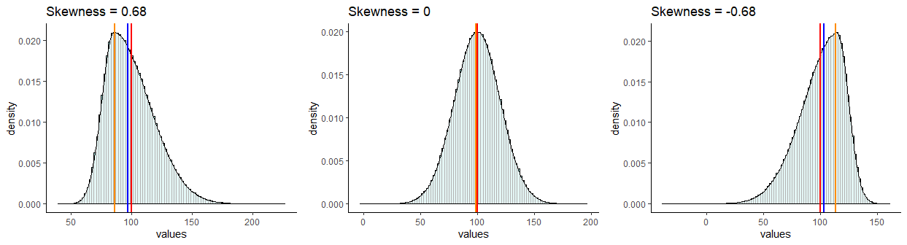
  


<br>

#### Kurtosis

Another measure of the shape of a data distribution is called kurtosis. Kurtosis relates to how heavy or thin the tails of the distribution are. Often people talk about kurtosis being related to how "peaky" the distribution is, because distributions of different kurtosis values often look to have different peaks - but strictly, kurtosis is about the tails.

We can broadly describe three basic patterns of kurtosis. 

*Mesokurtic* - tails are not too thick or too thin - this is the case with the normal distribution.

*Platykurtic* - data is moved more from the center of the distribution to the tails.

*Leptokurtic* - data is taken from the shoulders of the distribution and moved more into the center and slightly to the tails

These are illustrated below:


<br>

In addition, to using the above funny names to describe the shapes of distributions, we can also actually calculate a kurtosis value. We won't show the formula here, but effectively the values relate to the patterns as follows.

Mesokurtic distributions have a kurtosis value of approximately 3.

Leptokurtic distributions have a kurtosis value greater than 3.

Platykurtic distributions have a kurtosis value lower than 3.


We can compute this kurtosis value in R using the `kurtosis()` function from the package `moments`.

Both our distributions of total at bats and averages have kurtosis values above 3, indicating that they are leptokurtic - i.e. quite peaky and have less data in the shoulders of the distribution.


```{r}

kurtosis(bats$totalAB)   # >3 = 'peaky' less in shoulders of tails


kurtosis(bats$avg)   # >3 = 'peaky' less in shoulders of tails

```


<br>


Another thing of interest is what happens with small sample sizes. Typically small sample sizes are not that normal - that is they are fairly skewed.  They are also often fairly platykurtic - they have less data in the center and more in the shoulders and tails of the distribution. 

The below shows an example for a sample of 10 scores that come from a normal population of $\mu=100$ and $\sigma=5$.

```{r}
set.seed(10)
x1 <- rnorm(n = 10, mean = 100, sd = 5.0)
x1

skewness(x1)
kurtosis(x1)

```

You can see that this small sample is skewed with a skewness of -0.40 and platykurtic with a kurtosis of 1.85.  


<br><br>

## Z-scores

z-scores are a useful way of comparing different scores in different distributions. As an example, let's look at the two distributions below. On the left we have the population of all Airedale Terriers that is normally distributed with a mean of 60 lbs with a standard deviation of 6 lbs.  On the right we have the population of all Scottish Terriers that is normally distributed with a mean of 20 lbs and a standard deviation of 0.4 lbs.

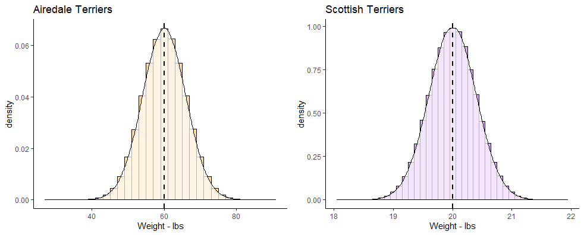 
 
 
 


If you owned an Airedale Terrier that was 65 lbs and a Scottish Terrier that was 20.5 lbs, would you be able to say which one was relatively larger than their breed average?  Both of them are above the mean of their breeds, but by how much?  The Airedale Terrier is (65-60) 5 lbs heavier than the mean of the breed, whereas the Scottish Terrier is only (20.5-20) 0.5 lbs heavier than its breed average.

Looking at things in absolute terms however is misleading. It would be better if we could somehow standardize these differences. This is where z-scores come in.  z-scores enable us to calculate how far any datapoint is from the mean of its distribution by saying how many "standard deviations" away from the mean it is.

Let's look at the Airedale Terrier. Your Airedale is 5 lbs heavier than the mean of 60 lbs. This is a bit less than one standard deviation above the mean, as the standard deviation is 6 lbs.  However, your Scottish Terrier is 0.5 lbs heavier than the mean of 20 lbs, which is a bit more than the standard deviation of 0.4 lbs for that breed.  We can calculate precisely how many standard deviations away from the mean they are using z-scores.  This is the formula:


$\Large z=\frac{x - {\mu}_x}{\sigma_x}$


Using this formula, let's calculate the z-scores for each of our dogs:

```{r}
#Airedale
(65 - 60) / 6

#Scottish
(20.5 - 20) / 0.4

```

The z-score for our 65 lb Airedale is `z=0.83`. The z-score for our 20.5 lb Scottish is `z=1.25`.  This shows us that our Scottish Terrier is actual more standard deviations away from its breed mean than is our Airedale Terrier dog.

We could also plot each of these z-scores on top of the standard normal distribution. Remember, this is the specific case of the normal distribution where the mean of the distribution is 0 and the standard deviation is 1.

Shown below, we've plotted on the top row the breed population histograms with red vertical lines the weights of each of these dogs on their respective population histogram. On the bottom row we have these values converted to their z-scores and still shown with a red line. Each is overlaid on top of a standard normal distribution.


  
 
 

z-scores can be very useful ways of standardizing observed values into ways that we can directly compare across different distributions.  If we calculate a negative z-score then it's clear that our observed value is below the population mean, and if we calculate a positive z-score then our value is greater than the population mean. The size of the z-score relates to how many population standard deviations from the mean each value is overall.


### z-scores in samples.

Often we may not know the population mean or standard deviation. In such cases if all we have is a sample mean and a sample standard deviation, we can still calculate z-scores for such samples. We effectively use the same formula to calculate the z-scores, just substituting in the sample mean and standard deviation.

$\Large z=\frac{x - {\overline{x}}}{s_{x}}$


For instance, let's look at the following sample of ages for players on a village cricket team:

```{r}

ages <- c(23, 19, 21, 33, 51, 40, 16, 15, 61, 55, 30, 28)

mean(ages)

sd(ages)
```

These data clearly don't look normally distributed, but we still are able to calculate a mean and standard deviation.  We can also still calculate the z-scores for each age:

```{r}

z <- (ages - mean(ages)) / sd(ages)

z
```

You'll notice that those individuals that have negative z-scores are younger than the mean age of 32.67. Those individuals with positive z-scores are older than the mean age of 32.67.  The largest z-score in terms of magnitude (either in the positive or negative direction) is 1.8.  This person was 61 and was 1.8 standard deviations older than the average age.

Although it's possible to calculate z-scores for any sample, if the sample data come from a normally distributed population then we can use this z-score principle to perform inferential statistics (see xxx.xxx)


### Using z-scores to determine probabilities

One of the great things about the normal distribution, is that we can calculate quite straightforwardly what proportion of the distribution lies under the curve for any distance away from the mean measured in standard deviation. 

With computers, this is a very trivial task to perform, as we'll see shortly. Prior to the computer age, these computations weren't as easy, so we'd often use something called the **empirical rule**. This is basically a framework that tell us what proportion of the distribution lies under the curve at 1$\sigma$, 2$\sigma$, 3$\sigma$, etc. from the mean.

Let's look at the distribution below, which is normally distributed with a mean ($\mu$) of 14 and a standard deviation ($\sigma$) of 4.

The first thing to note is that a normal distribution is perfectly symmetrical, with equal area under the curve on either side of the mean. Therefore, in our example, 50% of the distribution lies below the mean of 14, and 50% of datapoints lie above the mean.

The area colored in green in the distribution represents the area of the distribution that lies $\mu \pm1\sigma$. The area colored in pinky-purple lie between $\mu+1\sigma$ and $\mu+2\sigma$ or between $\mu-1\sigma$ and $\mu-2\sigma$. The area colored in yellow lie between $\mu+2\sigma$ and $\mu+3\sigma$ or between $\mu-2\sigma$ and $\mu-3\sigma$. The blue areas represent the proportion of the distribution that lies beyond $\mu \pm4\sigma$.


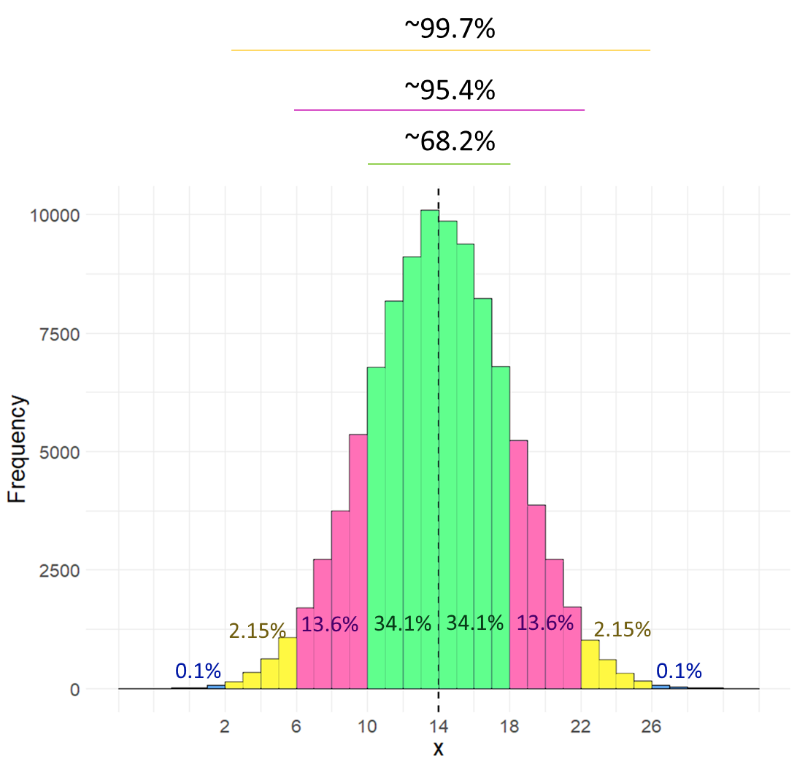{width=90%}

Rather than look at the proportion that lies between two boundaries, often instead we describe the proportion of the distribution that lies to the left of a certain value. The table below shows what proportion of the distribution lie to the left of each value. For instance, in the above distribution $\mu+2\sigma=22$. According to the table below, we have 97.72% of the data/distribution that are to the left of $x=22$.


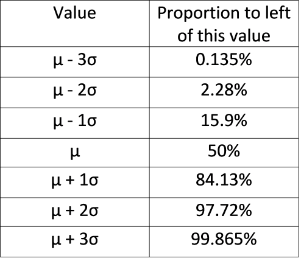{width=50%}


The above table and histogram are obviously useful guides for knowing what proportion of the data exist at certain breakpoints.  But, what if you had a value of $x=17.5$ in the above distribution? What proportion of the data are below this value? 

Well we can actually work this out if we convert our raw scores to z-scores. Once we have a z-score, we can calculate the area to the left of any point on the standard normal curve.  Our value of  $x=17.5$ has a z-score of 0.875, so it is 0.875 standard deviations above the mean.

```{r}
(17.5 - 14) /4
```

Let's look at that on the standard normal curve, with the value $z = 0.875$ represented by the red solid line. We can obtain the area in the distribution to the left of this value that is shaded in light red in R, using the function `pnorm()`.

 

```{r}
pnorm(0.875)
```

This shows us that 80.92% of the distribution lie to the left of $z=0.875$. To get what proportion of the distribution lie to the right of this value, we just subtract it from 1.


```{r}
1 - pnorm(0.875)
```


Let's look at the proportions under the curve to the left of plus or minus 0, 1, 2, or 3 standard deviations from the mean.

```{r}
zvals <- c(-3,-2,-1,0,1,2,3)
pnorm(zvals)

```

Hopefully you can see that these values mirror those in the table provided above.

<br>

#### z-score and probability problems.


Let's take this a little further with some small examples.


**Example 1**


Let's assume that the weights of pineapples are normally distributed with a mean of 1003.5g and a standard deviation of 35g. You bought a random pineapple and it turned out to only be 940g. What proportion of pineapples are less than 940g?  How unlucky did you get to buy such a small pineapple?

First, let's take a look at the population distribution of pineapples with $\mu=1003.5$ and $\sigma=35$. Our pineapple is 940g and is shown with the solid red line below. As our distribution is normal, if we convert this to a z-score we can compare it to where z is in the standard normal distribution on the right.

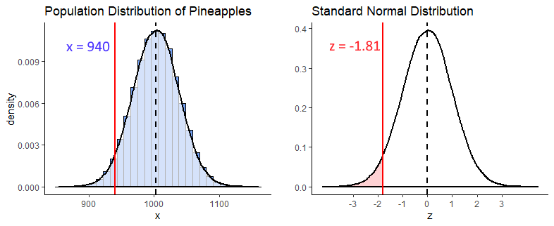

```{r}
(940 - 1003.5) / 35
```

So we calculated that $z = -1.81$, and we visualize that on our standard normal distribution. We're interested in what proportion of pineapples from the distribution are 940g or less. That is the light red shaded area.  To calculate that we can just use `pnorm()` in R:

```{r}
pnorm(-1.81)
```

From this we can see that only 3.5% of pineapples are less than 940g. We got super unlucky to get such a tiny pineapple.


**Example 2**

What is the probability of getting a pineapple of greater than 1050g ?  

To answer this we first get the z-score for a pineapple of 1050g, and find that $z = 1.33$.

```{r}
(1050 - 1003.5) / 35

```

Next we recognize that if we're interested in what proportion of pineapples weigh more than 1050g, we need to know what proportion of the standard normal curve is greater than  $z = 1.33$ (the shaded light red area below).


We can calculate that by using `pnorm()` to figure out what proportion is to the left of  $z = 1.33$, and then subtract that from 1 to get what proportion is to the right.

```{r}
1 - pnorm(1.33)   #0.003  (so 9.18% chance)

```


**Example 3**

What is the probability of getting a pineapple between 950g and 1045g  ?

For this question, we're interested in the shaded light red area between $z = x$ and $z = z$ on the standard normal curve. Why these z-values? Because these are the z scores you get if you convert a 950g and a 1045g pineapple to z scores.


```{r}
z1 <- (950 - 1003.5)  / 35
z2 <- (1045 - 1003.5)  / 35

z1 #-1.53
z2 #1.19

```

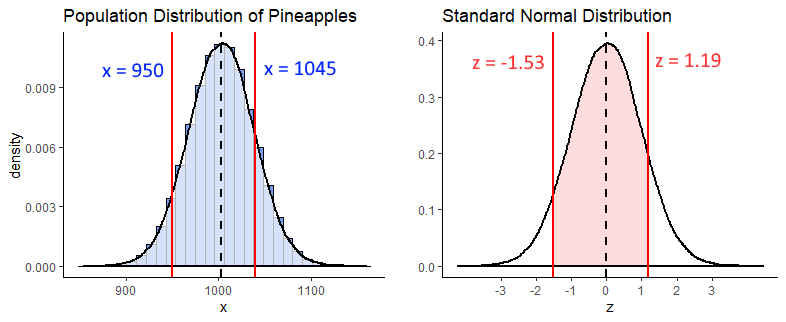

In R we can calculate the proportion to the left of each of these z-scores using `pnorm()`. What we need is the shaded area, which we can get if we subtract the area to the left of $z = -1.53$ from the area to the left of $z = 1.19$. We do it like this:

```{r}
## get proportion of curve to left of each z-score

pnorm(z1) # 0.06

pnorm(z2) # 0.88

# so the area between them is:

pnorm(z2) - pnorm(z1)  #0.82

```

So, 82% of the distribution lie between 950g and 1040g.


<br><br>


## What is a Sampling Distribution ?

Another type of distribution that we will discuss a lot! is the sampling distribution. There are different types of sampling distributions, so for now we'll focus on the **sampling distribution of the sample means**.  The best way to illustrate a sampling distribution, is to show it by example.

Say we have a population of 1 million adult Archerfish. The population mean of their bodylength is $\mu = 100.0mm$, and the population standard deviation is $\sigma = 15.0mm$.

Let's create this population:

```{r}
set.seed(3)

archerfish <- rnorm(n = 1000000, mean = 100, sd = 15)

mean(archerfish)

sd(archerfish)

```

Let's also plot what this normally distrusted population looks like by making a histogram:

```{r}
# histogram of the population:

ggplot(data.frame(archerfish), aes(x = archerfish)) + 
  geom_histogram(color='black', fill='#f584ed', alpha=.5, binwidth =2) +
  theme_classic() +
  xlab("Body Length mm") +
  ylab("Frequency") +
  ggtitle("Body Sizes of 1 million Archerfish") +
  geom_vline(xintercept = 100.0, lwd=1, color='black')

```


OK, let's say that you didn't have the time to go out and catch 1 million archerfish and measure the body length of every single fish. What should you do? One thing you might decide is to just go and take a random sample of 10 archerfish (you could have picked another sample size - let's just stick with 10 for now). Once you have your sample of 10 archerfish, you could then measure them and you will be able to calculate the sample mean of that sample.

We'll use `sample()` to randomly select 10 archerfish.

```{r}
set.seed(1) # so we all get the same sample.
samp1 <- sample(archerfish, 10, replace = T)  

samp1

mean(samp1)
```

Our sample mean is $\overline{x}=95.6$ - that's fairly close to the actual population mean of 100.0mm.  Let's grab another three samples of 10 archerfish and see what the sample means are of those sample:


```{r}

mean(sample(archerfish, 10, replace = T))  # mean of our 2nd sample

mean(sample(archerfish, 10, replace = T))  # mean of our 3rd sample

mean(sample(archerfish, 10, replace = T))  # mean of our 4th sample

```

These next three samples are closer to 100.0, with one just above and two just below 100.


What would happen if we collected thousands and thousands of samples of size 10?  Let's do it - you don't need to follow the exact code here of how we're doing this, but essentially we're grabbing 20,000 samples of size 10. From each of these we're getting the sample mean. That means we'll end up with 20,000 sample means. We're storing those results in the object called `res`.

```{r}
### What if we were to collect 20,000 samples and for each one get the mean

results<-vector('list',20000)
for(i in 1:20000){
results[[i]]  <- mean(sample(archerfish, 10, replace = T))  
}

res <- unlist(results)
```


Now we have our 20,000 sample means we could make a histogram of these sample means.

```{r}
psd <- ggplot(data.frame(res), aes(x = res)) + 
  geom_histogram(color='black', fill='#4adbe0', alpha=.5, binwidth = 1) +
  theme_classic() +
  xlab("Mean Body Length of each sample - mm") +
  ylab("Frequency") +
  ggtitle("Sampling Distribution of Sample Means for n=10") +
  geom_vline(xintercept = mean(res), lwd=1)

psd

```

This distribution that we've just plotted is the **sampling distribution of sample means for samples of size n=10**.  We picked 20,000 as the number of samples of size 10 to collect as it's reasonably large enough to get enough sample means that we can see the shape of the distribution. We could have picked 100,000 samples to collect, or 1,000,000... in fact the more the better, but 20,000 is enough to get the point across.

Out of all of these sample means that we "collected", what is the average across all of the 20,000 samples? - and what's more, what is the standard deviation of that distribution?

```{r}
mean(res)

sd(res) #standard deviation of the sampling distribution, aka standard error

```


Let's first focus on the mean.  Our mean of sample means was 99.996, which is very approximately the same as the mean of 1,000,000 archerfish in the population!  It turns out that the mean of the sampling distribution is approximately equal to the population mean.  By the way, the notation that we use to depict the mean of the sampling distribution of sample means is  $\mu_{\overline{x}}$.  So $\mu_{\overline{x}} = 100.0$.


What is the standard deviation of this distribution (the sampling distribution of the sample means)?  We just calculated it in R to be 4.77.  The notation we use for this is $\sigma_{\overline{x}} = 4.77$. It's called the standard deviation of the sampling distribution of sample means, but for short it gets called the **standard error**.

Of course, we never in reality actually collect thousands and thousands of samples - that defeats the point of sampling. If we had time to collect thousands and thousands of samples, we may as well just measure every archerfish in the population.  Usually, we just collect one sample. In later sections, we'll discuss how you can estimate what $\mu_{\overline{x}}$ and $\sigma_{\overline{x}}$ are when you have only collected one sample. 

However, given we already know the population standard deviation of the 1 million archerfish is $\sigma=15$, we can calculate the standard deviation of the sampling distribution of sample means for any sample size. It is calculated using the formula:


$\Large \sigma_{\overline{x}} = \frac{\sigma}{\sqrt{n}}$

So in our case it should be equal to:

```{r}

15/sqrt(10) # 4.74

```

As you can see this is very close to the value that we got in our simulated sampling distribution above.

<br>

### Sample Size and the Sampling Distribution

In the previous section we looked at what would happen if we took samples of size 10 from our archerfish population and looked at the sample means of each sample. We found that when we made a histogram out of these sample means, that the mean of the sample means  $\mu_{\overline{x}}$ was approximately equal to the population mean of 100. The standard deviation of the sampling distribution of sample means, or standard error, $\sigma_{\overline{x}}$ was approximately equal to 4.74.


What happens if we were to take a different sized sample each time - say size 50? What would be the mean and standard deviation of this distribution of sample means?  Let's find out. We'll again take 20000 samples of size 50 at random from our population of 1 million archerfish. For each sample we'll record the sample mean length of the 50 fish. We'll end up saving these 20,000 sample means in an R object called `res1`. Again, don't worry about how the code is doing it here, just as long as you follow what we're doing.


```{r}

# ok, get 20,000 samples of size 50
results1<-vector('list',20000)
for(i in 1:20000){
  results1[[i]]  <- mean(sample(archerfish, 50, replace = T))
}

res1 <- unlist(results1)

```


Now we have our 20,000 samples, let's plot the histogram

```{r}
psd2 <- ggplot(data.frame(res1), aes(x = res1)) + 
  geom_histogram(color='black', fill='#4adbe0', alpha=.5, binwidth = .5) +
  theme_classic() +
  xlab("Mean Body Length of each sample - mm") +
  ylab("Frequency") +
  ggtitle("Sampling Distribution of Sample Means for n=50")+
  geom_vline(xintercept = mean(res1),lwd=1)

psd2


```

If we look at the mean and standard deviation of this sampling distribution, we get the following values:

```{r}
mean(res1)  # still same as population mean

sd(res1)    # smaller with larger sample size
```

The mean of the sampling distribution of sample means $\mu_{\overline{x}}$ is still a very good estimate of the population mean.

The biggest difference is in the standard deviation of the sampling distribution,  $\sigma_{\overline{x}}$ (the standard error), which is much lower than when we had samples of size 10.  The reason for this is that the variability in our sample means is much more reduced when we have samples of size 50. On average, our sample means are much closer individual estimates to the population mean. This is what drastically reduces the standard deviation of this sampling distribution.

We could have calculated the standard error directly using the formula provided earlier, because we already know the population standard deviation. When we use that formula we get 2.12, almost the same standard deviation as we got with our simulated sampling distribution:

```{r}
15 / sqrt(50)
```


Let's directly compare the two sampling distributions for the two different sample sizes. We adjusted the x-axis so it is the same for both figures, so you can see the change in the standard deviation between the two sample sizes:

```{r, echo=FALSE, message=FALSE, warning=FALSE}
library(gridExtra)
grid.arrange(
psd + xlim(75,125) + ggtitle("Sample Size = 10"),
psd2 + xlim(75,125)+ ggtitle("Sample Size = 50"),
nrow=1)
```


<br><br>


## Central Limit Theorem

In the previous section we discovered that if you take many, many samples from a normally distributed population and calculated the sample mean of each sample, that you would get a sampling distribution of sample means. We also saw that that sampling distribution was normally distributed with a mean $\mu_{\overline{x}}$  that was approximately equal to the population mean, and a standard deviation $\sigma_{\overline{x}}$   that was equal to the population standard deviation divided by the square root of n $\Large \sigma_{\overline{x}} = \frac{\sigma}{\sqrt{n}}$.

Is it just coincidence that both the population distribution and the sampling distribution was approximately normally distributed?  What we will learn in this chapter is that it does not matter at all what the population distribution is - if we take thousands of samples from **any** shaped distribution and calculate the sample mean of each sample, when we create the histogram of those sample means we will find that they are approximately normally distributed.  This is what we refer to as the **central limit theorem**.  Further, the larger the sample size that we take, the closer to a normal distribution the sampling distribution becomes.

Let's look at this by taking samples from various different population distributions.

<br>

**Uniform Distribution**

First we'll look at a uniform distribution of 1 million numbers between 0 and 75. You might like to think of this as the distance of trees from the center of a forest in km. Let's graph the distribution and calculate the mean and standard deviation.

```{r}
set.seed(1)

#get data from uniform distribution
x1 <- runif(1000000, min = 0, max = 75)

# histogram
ggplot(data.frame(x1), aes(x = x1)) + 
  geom_histogram(color='black', 
                 fill = "#894ae0", 
                 alpha=.3, 
                 binwidth = 5,
                 boundary = 0) +
  theme_classic() +
  xlab("Distance from Center of Forest km")


### Population Mean & SD
mean(x1)  #37.5

sd(x1) #21.6

```

We can see that the mean of this population is 37.5, and the population standard deviation is 21.6.

Let's take samples of size 30 at random from this population of 1 million.  For each sample, we'll calculate the sample mean. We'll take 10,000 samples (again - we could have picked any really large number here, but 10,000 seems reasonable enough to prove our point). After we get our 10,000 sample means from samples of size 30, we'll plot the histogram of those sample means.

```{r}
## Let's get 10,000 samples of size 30

results<-vector('list',10000)
for(i in 1:10000){
  results[[i]]  <- mean(sample(x1, 30, replace = T))  
}

res <- unlist(results)


# This is the sampling distribution.
ggplot(data.frame(res), aes(x = res)) + 
  geom_histogram(color='black', fill='#894ae0', alpha=.5, binwidth = 1) +
  theme_classic() +
  geom_vline(xintercept = mean(res), lwd=1) + 
  xlab("Mean of each sample") +
  ylab("Frequency") +
  ggtitle("Sampling Distribution of Sample Means for n=30")

  
```

This histogram represents our sampling distribution of sample means when we took samples of size 30 from a uniform distribution.  Hopefully you notice that it is approximately normally distributed - even though the original population was uniformally distributed! Let's calculate the mean and standard deviation of this sampling distribution:

```{r}
mean(res)  # the mean of the sample means is close to 37.5, the population mean

sd(res)  #3.996 - this is a lot smaller than the population SD
```

The mean of our sampling distribution $\mu_{\overline{x}} = 37.5$ which is again approximately equal to the population mean. The sampling distribution standard deviation $\sigma_{\overline{x}} = 3.99$ which is a lot lower than the original population standard deviation. Because we only took 10,000 samples, these values aren't exact, but we could have calculated the standard error by taking the population standard deviation and dividing by the square root of n $\Large \sigma_{\overline{x}} = \frac{\sigma}{\sqrt{n}}$ as follows:


```{r}
sd(x1)/sqrt(30)  # standard error.
```

You'll notice that this calculated value is very close to the one we estimated by running our simulation.

<br>


**Skewed Distributions**

We can see that the central limit theorem holds true for skewed distributions also. Here, we have a population of 1 million charity donations. Let's draw a histogram of the population distribution and calculate the mean and standard deviation of the population.

```{r}
set.seed(1)
# e.g. Donations to a charity (in $s)

q <- rnbinom(1000000, 5, .4)

# histogram
ggplot(data.frame(q), aes(x = q)) + 
  geom_histogram(color='black', 
                 fill = "#1ad665", 
                 alpha=.3, 
                 binwidth = 1,
                 boundary = 0) +
  theme_classic() +
  xlab("Charity Donation in $")


### Population Mean
mean(q)  #7.5

sd(q)  #4.33
```

It is clear that this population distribution is highly positively skewed. The mean of the population is 7.5 and the standard deviation is 4.33.

In the following code we takes samples of size 30 and calculate the sample mean of each sample. This time, we'll collect 50,000 samples, just to be a bit different.

```{r}
results<-vector('list',50000)
for(i in 1:10000){
  results[[i]]  <- mean(sample(q, 30, replace = T))  
}

res <- unlist(results)


### Let's Draw this as a histogram.

ggplot(data.frame(res), aes(x = res)) + 
  geom_histogram(color='black', fill='#31e8d0', alpha=.5, binwidth = .1) +
  theme_classic() +
  geom_vline(xintercept = mean(res), lwd=1) + 
  xlab("Mean of each sample") +
  ylab("Frequency") +
  ggtitle("Sampling Distribution of Sample Means for n=30")

```


So, it happened again.  This is our sampling distribution of sample means, collected from samples of size 30 from a highly skewed distribution. But once again, the sampling distribution is approximately normally distributed. It might not be perfectly normally distributed, but it is close to being normal. We can calculate the mean and the standard deviation of this sampling distribution:


```{r}
mean(res)  # the mean of the sample means is close to 7.5

sd(res)  #0.799
```

$\mu_{\overline{x}} = 7.5$ which is once again approximately equal to the original population mean. The sampling distribution standard deviation $\sigma_{\overline{x}} = 0.799$. We could have directly calculated that using the formula for the standard error, n $\Large \sigma_{\overline{x}} = \frac{\sigma}{\sqrt{n}}$, as we know the original population standard deviation:

```{r}

sd(q)/sqrt(30)  # standard error = 0.791

```


We could keep going with even more types of population distributions. We would find the same thing over and over again. If we take many samples from each population and calculated the sample means of all samples, they would form an approximately normally distribution. This will be especially true for larger samples. This is the basis of the central limit theorem.  In the following sections we'll learn more about what we can do with these sampling distributions.


<br><br>


## Sampling distribution problems

We can use our knowledge of sampling distributions and z-scores to determine how likely or unlikely we are to observe any one particular sample mean.

Let's use an example to illustrate this.


<p style="color:blue">Q. Say the weight of chicken eggs is normally distributed with mean 60g and standard deviation of 3g. What is the probability of getting a batch of a dozen eggs that have a mean of less than 58g ?</p>

The way to think about these questions is to recognize that we're dealing with a sampling distribution. We're really being asked what proportion of the sampling distribution is less than a sample mean of 58g, when your sample size is 12 (a dozen).

First, let's plot the population of chicken eggs and then the sampling distribution of samples means for a sample size of 12.

```{r, warning=FALSE, message=FALSE}
set.seed(1) # so you get the same values as my script


### First, I'll make some plots of the 'population' and 'sampling distribution'


## Population
x <- rnorm(1000000, mean = 60, sd = 3)

p1 <- ggplot(data.frame(x), aes(x = x)) +
  geom_histogram(color='black', fill='mistyrose', alpha=.4)+
  geom_vline(xintercept = 60, lwd=1) +
  ggtitle("Population of chicken eggs") +
  theme_classic() +
  xlab("Weight")


## Sampling Distribution of sample means with Sample size of 12 (a dozen).

results<-vector('list',10000)
for(i in 1:10000){
  results[[i]] <- mean(sample(x, 12, replace = T))
}

res <- unlist(results)

p2 <- ggplot(data.frame(res), aes(x=res)) +
  geom_histogram(color="black", fill='lightseagreen', alpha=.4)+
  geom_vline(xintercept = mean(res),lwd=1) +
  ggtitle("Sampling Distribution of Sample Means") +
  theme_classic() +
  xlab("sample mean")

library(gridExtra)
grid.arrange(p1,p2,nrow=1)

```


What are the mean and standard deviation of this sampling distribution of sample means? Well, $\mu_{\overline{x}} = 60$ because that's the population mean, and we know the mean of the sample means is approximately the same. We know we can calculate $\sigma_{\overline{x}}$ because we know the population standard deviation $\sigma$.

Again, the formula is $\Large \sigma_{\overline{x}} = \frac{\sigma}{\sqrt{n}}$. Therefore, the standard deviation of the sampling distribution is $\sigma_{\overline{x}} = 0.87$:

```{r}
sem <- 3 / sqrt(12)

sem

```


Now, we're interested in a sample of 12 that has a sample mean of 58g.  Let's visualize what that looks like on the histogram of the sampling distribution:

```{r, warning=FALSE, message=FALSE}
p2 + geom_vline(xintercept = 58, lty=2, lwd=1, color="red") +
  ggtitle("Sampling Distribution of Sample Means \n for sample size = 12")
```

Because we know the mean and standard deviation of this distribution, we can actually calculate the sample mean of 58g as a z-score. Doing this we find that $z  = -2.31$, which means that a sample mean of 58g is 2.31 standard deviations below the mean.

```{r}
# so, 58g as a z-score is...

z <- (58 - 60) / sem  # -2.31

z

```

The original question asked what probability there was of getting a sample mean of less than 58g. This is basically what area is under the curve of the above sampling distribution to the left of the 58g sample mean. Because we converted that sample mean of 58g to a z-score of -2.31, we can look at that value on a standard normal curve. The area we are interested in is the filled in area to the left of z = -2.31:


We can look up this value in R, using the function `pnorm`. 

```{r}
pnorm(z)  # prob = 0.010
```

So we can see that the probability of getting a sample mean of lower than 58g is `p=0.0105`.


<br><br>


## The t-distribution

Another distribution that is important to know about is the t-distribution. Like the normal distribution, this is a symmetrical distribution, but it has slightly fatter tails than the normal distribution. 

The t-distribution comes up most commonly in sampling distributions. In particular, although the central limit theorem prescribes that sampling distributions are approximately normal, it is known that often they aren't approximately normal enough, and instead they follow a t-distribution shape.

An important detail about the t-distribution is that there are actually several t-distributions. There are  different t-distributions for different degrees of freedom. These differ slightly in how heavy the tails of the distribution are. The degrees of freedom are usually related to the sample size minus one or two (depending upon the test being employed - see sections \@ref(one-sample-t-tests) and \@ref(theory-behind-students-t-test).  The higher the degrees of freedom, the more closely the t-distribution looks like a normal distribution.  You can see this in the image below. The standard normal distribution is in black, and the t-distribution is in red. Each panel shows a different t-distribution. As the degrees of freedom increase, the t-distribution essentially becomes the normal distribution. At lower degrees of freedom, there is a lot more difference between the t-distribution and the normal distribution in the tails.

 


<!--chapter:end:06-Distributions.Rmd-->

# Confidence Intervals


When we collect a sample, we typically calculate a sample mean $\overline{x}$. We use this as our estimate of the real population mean $\mu$, as this is unknown to us typically.  If we were to collect another sample, we would most likely get a sample mean $\overline{x}$ that is slightly different to the first one, but would also be an estimate of the population mean $\mu$. 

Given that we are not completely sure of what the population mean $\mu$ is, or how close our sample mean  $\overline{x}$ is to that population mean, one thing that we like to do is to put confidence limits around our sample mean estimate. The confidence interval gives us a range of values which likely contains our population mean.  In essence, a confidence interval can be considered to be a margin of error around our sample mean estimate.

In this course, we use two separate approaches to calculate confidence intervals around a sample mean  $\overline{x}$. The first method uses the $z$-distribution to generate the confidence interval. The second method uses the $t$-distribution. In practice, we almost always use the $t$-distribution when doing this. In fact, the only time we really use the $z$-distribution is when teaching introductory stats. The reason for this, is that learning how to make a confidence interval using the $z$-distribution is a good stepping stone to using the $t$-distribution. Technically, we can use the $z$-distribution to calculate the confidence interval when we know the population standard deviation $\sigma$ and our sample size is relatively large.  However, we almost never know $\sigma$, and so that's why in practice we use the $t$-distribution.

We'll start this chapter by talking about the relationship between the sampling distribution and confidence intervals. Then we'll describe how to use both the $z$- and $t-$distributions to generate confidence intervals.


## Sample means as estimates.

Let us imagine we have a population of butterflies and we're interested in their wingspan. The population is normally distributed with a population mean $\mu = 7.8cm$, with a population standard deviation $\sigma = 0.3cm$.  This is what this population distribution looks like:

```{r, message=FALSE,warning=FALSE}
set.seed(1)
x <- rnorm(100000, mean = 7.8, sd = 0.3)
library(tidyverse)
p1 <- ggplot(data.frame(vals=x),aes(vals))+
  geom_histogram(aes(y = ..density..), color = "black", fill = "purple", alpha=.4, binwidth = 0.05) + 
  geom_density(alpha = 0.7, fill = "mistyrose") + 
  theme_classic() +
  xlab("Wingspan cm")+
  geom_vline(xintercept = 7.8, color='black',lwd=1)
p1
```


Now, let's collect samples of size $n=15$.  Here's one sample, and it's sample mean $\overline{x}$:

```{r}
samp1 <- sample(x, size = 15, replace = T)
samp1
mean(samp1)
```

Our observed sample mean is $\overline{x}=7.71$ which is close to the population mean of $\mu=7.8$.  But if we were to collect another sample, then that sample mean will be slightly different. Let's do it again:

```{r}
samp2 <- sample(x, size = 15, replace = T)
samp2
mean(samp2)
```

This time our sample mean (our estimate) is $\overline{x}=7.81$ which is very close.

If we did this thousands of times, then we'd get our sampling distribution of sample means (see section \@ref(normal-distribution)). This is what our sampling distribution for sample sizes of $n=15$ looks like:

```{r}
#get sample means for sampling distribution
results<-vector('list',100000)
for(i in 1:100000){
results[[i]]  <- mean(sample(x, 15, replace = T))  
}

res <- unlist(results)

p2 <- ggplot(data.frame(res), aes(x = res)) + 
  geom_histogram(aes(y = ..density..), color = "black", fill = "#4adbe0", alpha=.4, binwidth = 0.01) + 
  geom_density(alpha = 0.7, fill = "ghostwhite") + 
  theme_classic() +
  xlab("Sample Mean") +
  ylab("Frequency") +
  ggtitle("Sampling Distribution of Sample Means for n=15") +
  geom_vline(xintercept = mean(res), lwd=1)

p2
```


According to Central Limit Theorem, this sampling distribution is approximately normally distributed. The mean of this sampling distribution is $\mu_{\overline{x}}=7.8$ which is the same as the population mean $\mu$. The standard deviation of this sampling distribution $\Large \sigma_{\overline{x}} = \frac{\sigma}{\sqrt{n}}$.

```{r}
0.3 / sqrt(15)
```

Therefore the standard deviation of this sampling distribution is $\sigma_{\overline{x}} = 0.077$.


Remember, this sampling distribution represents thousands and thousands of potential means from individual samples of size 15 that we could have collected. Each one of them in isolation would be our point estimate of the true population mean $\mu$. Sometimes we'll be really close to the true population mean, and other times we might be quite far away. This is why we like to put confidence intervals around our sample means, to give a range of values that likely contain our population mean.


One thing we can do first is to think about this - between which two values on the sampling distribution shown above would 95% of the data lie?  That is the same as asking, which two values represent the part where 2.5% of the distribution is in each tail (leaving 95% in the middle).  To answer this, we just need to remember that according to Central Limit Theorem that our sampling distribution is normally distributed. Therefore we can use the standard normal curve.

According to the standard normal distribution, the values of `z` that leave 2.5% in each tail are $z=-1.96$ and $z=1.96$. That means values that 95% of the distribution lie between 1.96 standard deviations below and above the mean.


If you didn't want to take our word for it that +1.96 and -1.96 are the values of `z` that leave 2.5% in each tail, you could also directly calculate it in R:

```{r}
qnorm(c(0.025, 0.975)) # get the values of z that are the boundaries of 2.5% to the left, and 97.5% to the left.
```


So if we go back to thinking about our sampling distribution - because we say it is approximately normally distributed, 95% of the distribution will also lie between 1.96 standard deviations below and above the mean.  We know that the mean of the sampling distribution is $\mu_{\overline{x}=7.8}$ and the standard deviation of the sampling distribution is $\sigma_{\overline{x}} = 0.077$, as we calculated it above.  Therefore, we can use this to calculate which sample mean values in the distribution are 1.96 standard deviations either side of the mean.  They are:

```{r}
7.8 +  (1.96 * 0.077)

7.8 -  (1.96 * 0.077)
```

So, 95% of our sample means in our sampling distribution lie between 7.65 and 7.95. That area is represented by the shaded red area on our sampling distribution below:


What we have just done is the basic principle behind a confidence interval using a $z$-distribution. Let's look at this in more detail.

<br>

## Calculating a confidence interval with z-distribution

Let's go back to our first sample of size 15 that we collected, with $\overline{x}=7.71$.  

```{r}
samp1
mean(samp1)
```

What we want to do now is put a confidence interval around 7.71. We want to say that our population mean is equal to $7.71 \pm margin.of.error$  The actual formula for the $z$-distribution confidence interval is:

$\Large CI_{95\%} = \overline{x} \pm z \times \frac{\sigma}{\sqrt{n}}$

In this scenario, we are presuming that we don't know what the population mean $\mu$ is - that's why we're building a confidence interval. Consequently, we also don't precisely know what the mean of the sampling distribution $\mu_{\overline{x}}$ is.  What we'll do instead, is to *assume* that our sample mean $\overline{x}$ is the mean of the sampling distribution $\mu_{\overline{x}}$.  We already know what the standard deviation of the sampling distribution $\sigma_{\overline{x}}$ is because we know the population standard deviation $\sigma$ is.  So, $\Large \sigma_{\overline{x}} = \frac{\sigma}{\sqrt{n}}$.

What value of $z$ should we use?  The short answer is 1.96 for the same reasons as above. If our sampling distribution is normally distributed, then we want to know the values that are $\pm 1.96$ of the sample mean $\overline{x}$.


So, let's just do it - this is how we calculate the 95% confidence interval if we have $\overline{x}$, $\sigma$ and $n$.

```{r}
x_bar <- mean(samp1)  # sample mean = 7.71
x_bar

n <- length(samp1)  # sample size =  n = 15
n

sigma <- 0.3  # the pop SD given in the example

sem <- sigma/sqrt(n) # standard error of the mean (SD of sampling distribution)
sem

z <- 1.96  # the value of 'z' we need to get the middle 95% of the distribution
```


```{r}
# margin of error
z * sem

# upper bound of confidence interval
x_bar + (z * sem)


# lower bound of confidence interval
x_bar - (z * sem)

```

We have just calculated our 95% confidence interval! It has a lower bound of 7.56cm and an upper bound of 7.86cm.  We can write this confidence interval in two ways:

$CI_{95\%} = 7.71 \pm  0.152$

$CI_{95\%} = 7.71 [7.56, 7.86]$


Below is a graphical representation of our confidence interval around our sample mean $\overline{x}$. You can see that the true population mean $\mu$ is within the confidence interval.


Remember we collected a second sample that had a sample mean $\overline{x}=7.81$ ?

```{r}
mean(samp2)
```

We could also create a 95% confidence interval for our estimate of the population mean $\mu$ using this sample mean $\overline{x}$. We just use the same formula:

```{r}
# upper bound of confidence interval
7.87 + (z * sem)


# lower bound of confidence interval
7.87 - (z * sem)

```

$CI_{95\%} = 7.81 \pm  0.152$

$CI_{95\%} = 7.81 [7.72, 8.02]$


Let's compare this confidence interval with the first one we created:


Note that both include the true population mean of 7.8 in their confidence interval. 

What if we collected 25 new samples, and calculated 25 sample means, and made 25 confidence intervals?  Well, the chart below shows 25 95% confidence intervals collected from samples of size 15 selected at random from our population of butterflies:


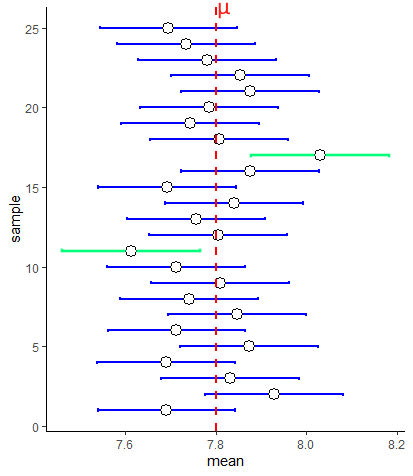


First, notice that the margin of error is equal for all of our confidence intervals around the sample means. This is because we are using the same value of $\sigma$ and same value of $z$ for all of these confidence intervals.  Secondly, you'll notice that not all the confidence intervals include the population mean $\mu$. Two of them - highlighted in green - do not include the population mean. In this sense, our sample mean and associated confidence interval is not doing a terrific job of estimating the population mean.  

Actually, it turns out that if you collect enough samples and generate enough sample means, then you *will capture* the population mean within your confidence interval 95% of the time. So roughly 5 out of every 100 confidence intervals you make from samples will not include the population mean.  

Technically, this is the definition of a 95% confidence interval. That is, in 95% of your samples you will include the true population mean. However, when talking about confidence intervals in lay-speak, when we have our one confidence interval around our one sample mean e.g. $CI_{95\%} = 7.72 [7.568, 7.871]$, we often say *"there's a 95% chance that the true population mean is between 7.568 and 7.871*. This is technically lazy shorthand although it does kind of help us understand the point of a confidence interval. But, please remember, the real definition is that in 95% of samples we'll include the true population mean in our samples.


**Assumptions** We should also briefly just remark on what the assumptions are when generating these $z$-distribution based confidence intervals. We are assuming that our data are normally distributed and that our sample is randomly drawn from the population, and that all data points are independent of each other.


<br>

### Other Confidence Intervals ranges

We can actually construct confidence intervals for any % value. Most commonly people make 95% confidence intervals, but other common ones include 80%, 90% and 99% confidence intervals.  These have the same interpretation as the 95% CI. For instance, a 99% confidence interval means that if you were to take 100 samples from a population and calculate 99% confidence intervals for each, only 1 out of a 100 on average would not include the true population mean $\mu$.

The formulas for each of these confidence intervals when using the $z$-distribution are as follows:

$\Large CI_{80\%} = \overline{x} \pm 1.28 \times \frac{\sigma}{\sqrt{n}}$

$\Large CI_{90\%} = \overline{x} \pm 1.64 \times \frac{\sigma}{\sqrt{n}}$

$\Large CI_{95\%} = \overline{x} \pm 1.96 \times \frac{\sigma}{\sqrt{n}}$

$\Large CI_{99\%} = \overline{x} \pm 2.58 \times \frac{\sigma}{\sqrt{n}}$


Where did each of these different numbers come from for $z$ ?  Well, if we wish to make a 99% CI, we need to know what values of $z$ are the boundaries that leave 99% of the distribution inside them on the standard normal curve. We exclude 0.5% in each tail.  Likewise, for the 80%CI, we want to know the values of $z$ that leave 5% in each tail and 10% in the middle.  We can calculate these values in R like this:

```{r}

qnorm(.9)# for 80% CI

qnorm(.95)# for 90% CI

qnorm(.975)# for 95% CI

qnorm(.995)# for 99% CI

```


So, if we were to calculate the 80% confidence interval for a sample with a sample mean of $\overline{x}=7.72$, we would do:


```{r}
#margin of error
1.281552 * sem

# upper bound of confidence interval
7.72 + (1.281552 * sem)


# lower bound of confidence interval
7.72 - (1.281552 * sem)

```

Our 80% confidence interval is:

$\Large CI_{80\%} = 7.72 \pm  0.099$

$\Large CI_{80\%} = 7.72 [7.620, 7.819]$


The figure below shows the CIs that we would create using each of these different values of $z$ for 80%, 90%, 95% and 99% CIs for a sample of size 15 with a sample mean of $\overline{x}=7.72$.

Clearly, confidence intervals widen with higher percentages. This makes sense, because out of 100 samples, with a 99% CI we'd expect only one confidence interval out of 100 to not include the true population mean, but with a 80% CI we'd expect 20/100 CIs not to include the true population mean.


Let's look at this same figure, but this time for a sample that has an sample mean $\overline{x}=7.95$:


As you can see here, this time the 90% and 80% CIs do not include the true population mean $\mu$. We increase the chances of including the true population mean $\mu$ inside our confidence interval by increasing the level of our confidence interval. A 99% confidence interval has an increased probability of including the confidence interval compared to a 95% confidence interval and so on.

<br>

### Confidence Intervals and Sample Size

The other variable inside the confidence interval formula that we should think about is the sample size $n$. Let's look at the formula again:

$\Large CI = \overline{x} \pm z \times \frac{\sigma}{\sqrt{n}}$

What happens when we get different sized sample sizes?  For instance, look at the 95% confidence intervals below that all have a sample mean of $\overline{x}=7.72$ but are for different sample sizes:


There are two things to note. First, as your sample size increases, for any confidence level (in this situation a 95% CI) the confidence interval is going to shrink. It gets tighter for larger sample sizes. **Increasing sample sizes increases certainty**. This is because the denominator of the confidence interval formula $\sqrt{n}$ gets larger, meaning that the margin of error gets smaller.

The second thing might seem counter-intuitive. Why does it look like in the graph above that a sample size of $n=50$ is only just able to have $\mu$ contained within it?  It would seem that a larger sample size should do a better job of including $\mu$.  Well, remember, that a 95% CI really means that 95% of your sample means will contain $\mu$.... so across all these sample sizes you have a 95% chance of having captured $\mu$ inside your CI.  

The key thing to remember is that with a bigger sample size you are much more likely to get a sample mean $\overline{x}$ that is close to the population mean $\mu$.  That's because the sampling distribution of sample means is much tighter. In some ways the figure above is a bit misleading as all the sample means are at 7.72. What is more likely to be the case for many samples is that they will be closer to the true population mean.  Look at the figure below, that compares samples sizes of 10 with sample sizes of 50.  Larger samples lead to CIs that have a sample mean closer to $\mu$ and that are tighter - but still with a 95% chance of having captured $\mu$.


<br>
<br>

## Confidence Intervals with t-distribution

Hopefully the preceding sections on creating a confidence interval with the $z$-distribution helped you in understanding some of the theory about confidence intervals in general.  Perhaps there is still one thought going through your mind - isn't all of this a bit strange?  Why are we trying to estimate the population mean $\mu$ from the sample mean $\overline{x}$ when we also already know the population standard deviation $\sigma$?  How could you know $\sigma$ but not know $\mu$ - that makes no sense, and indeed it doesn't.  

It turns out that in the real world, that when we collect a sample of data and get our sample mean $\overline{x}$, and we want to create our confidence interval around it to have some certainty about where the population mean $\mu$ might lie, we also do not know $\sigma$. We need a backup plan for how to construct confidence intervals. This back up plan is making confidence intervals with the $t$-distribution.


First, let's look at the formula for making a confidence interval with a $t$-distribution:

$\Large CI = \overline{x} \pm t \times \frac{s}{\sqrt{n}}$


Two things are different about this one compared to the formula for calculating a CI with the $z$-distribution. First, we are using a $t$ value rather than a $z$ value. Secondly, we are using the sample standard deviation $s$ rather than the population standard deviation $\sigma$. If we do not know $\sigma$ then our next best option is to use our estimate of the population standard deviation, which is our sample standard deviation $s$.


We briefly introduced the $t$-distribution in section \@ref(the-t-distribution).  Why do we need to use it here?  Essentially, the key thing is that when we collect many sample means to create our sampling distribution of sample means, it is not always the case that this sampling distribution will be perfectly normally distributed. In fact, this is especially true for smaller sample sizes. If we collect smaller samples and calculate the sample mean of each, it turns out our sampling distribution will be slightly heavier in the tails than a normal distribution. How far away from normal our sampling distribution will be depends on our sample size. For bigger sample sizes, our sampling distribution will look more normal. This is illustrated below:


It's important to remember that the shape of the $t$-distribution varies for different sample sizes. In fact, we actually state the distribution not in terms of the sample size, but in terms of the *degrees of freedom*. For instance, for a sample size of 15, we would say that the sampling distribution follows a $t$-distribution with a shape of degrees of freedom 14.  The degrees of freedom is equal to $n-1$ when describing sampling distributions of sample means.

As a result of this issue, if we were to assume that our sampling distribution was normally distributed and used $z=1.96$ to calculate our 95% confidence interval, we would be inaccurately determining where the middle 95% of the distribution was.  In fact, for a $t$-distribution, because the tails are heavier, the value of $t$ that leaves 2.5% in each tail will be a larger value than 1.96.  Compare the standard normal curve below to the $t$-distribution for $df=14$.

<br>


As we can see, the value of $t$ that leaves 2.5% in each tail is 2.145 which is higher than 1.96.  Consequently, all else being equal, this will increase our margin of error.

<br>

## Calculating a t-distribution Confidence Interval

Let's look more practically at how we calculate a 95% confidence interval for a $t$-distribution. 

The formula we use is:

$\Large CI95\% = \overline{x} \pm t \times \frac{s}{\sqrt{n}}$

First, let's grab a sample of size 15 from our population. We need to calculate the sample standard deviation and sample mean.


```{r}
set.seed(1)
samp3 <- sample(x, size = 15, replace = T)
samp3
```

```{r}
mean(samp3)
sd(samp3)

```

We can see that $\overline{x}=7.74$ and $s=0.373$:


Next, we need to calculate $t$. This value will be the value that leaves 2.5% in the tails of a $t$-distribution for degrees of freedom = 14 ($n-1 = 14$). We can calculate that in R using the function `qt()`. We enter `0.975` to ask it to return the value of $t$ that leaves 2.5% in the upper tail, and then we enter `df=14` to ensure we are using the correct $t$-distribution:

```{r}
qt(p = 0.975, df = 14)
```

This shows us that our value of $t=2.145$. 

We can now create our estimate of the standard error (the standard deviation of the sampling distribution of sample means), and our confidence intervals:

```{r}

#standard error
sem1 <- sd(samp3)/sqrt(15)
sem1

# upper bound of confidence interval
7.74 + (2.144787 * sem1)


# lower bound of confidence interval
7.74 - (2.144787 * sem1)


```

Our confidence interval is therefore:  

$\Large CI95\% = 7.74[7.53,7.95]$


Let's compare this to a 95% CI calculated with a $z$-distribution for this sample. 
```{r}
# remember we calculated the standard error sem above in the z-distribution section
7.74 + (1.96 * sem)
7.74 - (1.96 * sem)
```

We can graphically compare these 95% confidence intervals We've plotted the $t$ confidence interval in purple and the $z$ confidence interval in blue for this same sample. 


Notice that the confidence interval based on the $t$-distribution is a little wider than that based on the $z$-distribution. This is because we are using a higher value of $t$ than of $z$ in the equation. This is because we are assuming our sampling distribution is following the $t$ shape rather than the classic $z$ shape, and as the tails are heavier in a $t$-distribution, the value of $t$ that leaves 2.5% in the tail is further away from 0.  

There is also one other detail that is a little hard to see from just the one sample above. That is that the size of the confidence intervals constructed using the $z$-distribution are fixed - i.e. they are always the same size. This is because the value of $z$ is fixed (1.96 in this case) and the value of $\sigma$ is fixed - it's always the same population standard deviation, which doesn't change.  However, for confidence intervals made using the $t$-distribution, the size of these may change from sample to sample. This is because the sample standard deviation changes from sample to sample, meaning that not all confidence intervals will be the same length.

We can illustrate this below. Here are 20 95% confidence intervals made using either the $z-$ or $t$-distribution for 20 different samples of sample size $n=15$. 


You can see that the $z$-distribution CIs are all equal in length, whereas the $t$-distribution ones vary from sample to sample. This is because of the use of the sample standard deviation $s$ in the formula. Most of the time, because of the higher $t$ value in the formula than the $z$ value, it leads to the CIs being wider for those calculated with the $t$-distribution. This sometimes has important implications. For instance, notice the 9th sample down from the top. Using the $z$-distribution, this CI does not capture the true population mean $\mu$, but using the $t$-distribution does capture it.  

However, the CIs are not always bigger when using the $t$-distribution. Sometimes, the sample may just have very little variation in it meaning that the sample standard deviation $s$ is very small. This could lead to a smaller margin of error - as seen with the 19th and 20th samples from the top in the figure.


<br><br>

### t-distribution CIs and sample size.

With the $z$-distribution based confidence intervals, when we increased the sample size $n$, the margin of error always decreased because both $z$ and $\sigma$ are fixed in the formula. For instance, for a 95% CI with a population standard deviation $\sigma=10$ and sample size $n=10$ or $n=30$, the margin of error using the $z$-distribution in the CI would be for each sample size:

```{r}
1.96 * (10/sqrt(10))


1.96 * (10/sqrt(30))

```

Clearly, increasing the sample size reduces the margin of error. The situation is not as consistent when constructing confidence intervals with the $t$-distribution, although the general pattern remains true.

When we collect samples of different sample sizes, two things change in the $t$-distribution confidence interval formula. Firstly, the value of $t$ used is dependent upon the degrees of freedom.  As sample sizes increase, the $t$- distribution becomes more normal shaped and less heavy in the tails. If, for example, we are interested in making 95% Confidence Intervals, then the value of $t$ that leaves 2.5% in each tail (and 95% of the distribution in the middle) is going to get closer to 1.96 (and negative -1.96) as the sample size increases. This is illustrated in the figure below:


Each of these $t$ values can be calculated, by finding the value of $t$ on the $t$-distribution for the respective degrees of freedom that leaves 2.5% in the upper tail:

```{r}
qt(.975, df = 9)
qt(.975, df = 19)
qt(.975, df = 29)
```


So, as sample size increases, the value of $t$ decreases for a given confidence interval. This would seem to suggest that this would decrease the margin of error for the confidence interval. This is for the most part true, but not always.  Remember the $t$ value is multiplied by the estimated standard deviation of the sampling distribution (the standard error) which is $\frac{s}{\sqrt{n}}$. Now again, it looks like increasing $n$ would lead to a larger denominator and a smaller overall margin of error. This is also true.  But, because we are using the sample standard deviation $s$ in the formula to estimate the standard error, then $s$ is going to vary from one sample to another. This means that for any given sample, we may actually end up with a wider confidence interval even if we increase our sample size.  However, the main point remains - generally increasing your sample size, will lead to a tighter confidence interval for a given CI range.  

The final thing that is worth mentioning is a repeat of what is discussed above in the $z$-distribution section. Increasing sample sizes also leads to sample means that will be, on average, much closer to the true population mean $\mu$ than you get when using smaller sample sizes.


<br><br>

### Other Confidence Intervals ranges for t-distribution

Like with the confidence intervals made with the $z$-distribution, we can create confidence intervals for any range with the $t$-distribution.  The rationale is the same. If we were to make an 80% CI around a sample mean, what we are effectively saying is that in 80% of all samples that we could collect, we would capture the true population mean $\mu$.  Practically, we use a different value of $t$ for each CI range. This value of $t$ will be the positive and negative value of the $t$-distribution for a given degree of freedom that leaves the appropriate percentage in the middle of the distribution.  For instance, for an 80% CI for a sample size of 25, which had degrees of freedom 24, the value would be $t=1.32$. 

We calculated this as follows:  For an 80% CI, we wish to have 80% of the distribution in the middle (40% either side of our sample mean), leaving 20% in the tails - i.e. 10% in each tail. Therefore, we wish to know the value of $t$ that demarks this boundary. The easiest way to do that is to use the `qt()` function in R, and ask for the 90%th percentile (the value that leaves 10% in the upper tail) for a $t$ distribution of degrees of freedom = 24.  We do that like this:

```{r}
qt(0.90, df=24)

```


Thus, if we had a sample mean of $\overline{x}=15.52$, a sample standard deviation of $s=3.3$ and a sample size of $n=25$, then our 80% confidence interval of the true population mean $\mu$ would be $CI = 15.52[14.65, 16.39]$:

```{r}
15.52 + (1.32 * (3.3 / sqrt(25)))
15.52 - (1.32 * (3.3 / sqrt(25)))

```


The value of $t$ used in the confidence interval formula therefore changes based on both your confidence interval size, and your degrees of freedom. Below are some other values of $t$ that would be used for different sample sizes and CI ranges:

```{r}
# 99% CI, n = 20
qt(.995, df = 19)


# 90% CI, n = 12
qt(.95, df = 11)


# 99.9% CI, n = 35
qt(.9995, df = 34)

```


<br>

## Comparing CIs using the z- and t-distributions

You might be thinking that using the $t$-distribution to make 95% confidence intervals seems like a lot of extra legwork to figure out what value of $t$ to use, compared to just using $z=1.96$ when using the $z$-distribution.  This mini section hopefully is an illustration of why you have to do this.  

These are the two formulas that we use to generate confidence intervals:


$\Large CI_{95\%} = \overline{x} \pm z \times \frac{\sigma}{\sqrt{n}}$

$\Large CI_{95\%} = \overline{x} \pm t \times \frac{s}{\sqrt{n}}$


But, what if we did just decide to use $z$ when we don't know the population standard deviation $\sigma$ and we used this formula:

$\Large CI_{95\%} = \overline{x} \pm z \times \frac{s}{\sqrt{n}}$


Well, in the figure below, we did just that for 25 sample means collected from samples of size $n=8$ from a population with a mean of $\mu=4$ and standard deviation of $\sigma=1.5$.  As you can see, the first and third columns that are using the appropriate $z$- and $t$-distribution formulas have 23/25 confidence intervals that include the true population mean.  In fact, out of 1000 simulations of these data (i.e. 1000 sample means collected) precisely 95% of confidence intervals included the population mean for both, which is what we would expect.


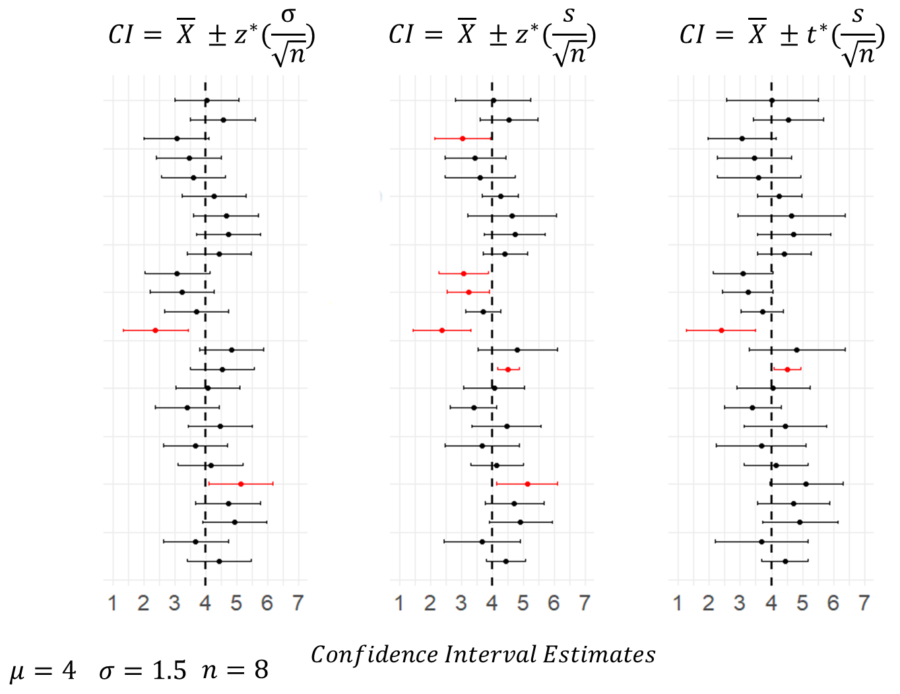

Conversely, the middle column includes the confidence intervals calculated using $z=1.96$ and using $s$ as an estimate of the population standard deviation.  With this formula, 6/25 confidence intervals fail to include the true population mean. Out of the 1000 simulations of the data, actually 9.6% of CIs failed to capture the true population mean. This shows that the margin of error calculated using this formula is consistently too small.  The reason for this is that when we estimate the population standard deviation, we generally are under-estimating the true value. This is another reason why we should be using the $t$-distribution.


<!--chapter:end:07-cis.Rmd-->

# Hypothesis Testing


Descriptive statistics allows you to describe or summarize your data, whereas inferential statistics allows you to make predictions or draw inferences from the data. 

In particular, we often wish to make predictions about our data samples. For instance, if we collected a sample of 12 Granny Smith apples, we may wish to predict if they came from a population of Granny Smith apples with a particular mean weight using a statistical test. This sort of procedure is called *hypothesis testing* or *significance testing*.

A statistical hypothesis is a clear prediction to specific claims about a population parameter (almost always in intro stats a population mean, or the difference between the means of two populations). This prediction may or may not be true. There are two types of statistical hypotheses. 

For one-sample tests they would be as follows:
<br>
  **Null Hypothesis (_H~0~_)**: a statistical hypothesis that states there is **_no_** difference between a parameter (e.g. population mean) and a specific value.
<br>  
  **Alternative Hypothesis (_H~1~_)**: a statistical hypothesis that states there **_is_** a meaningful difference between a parameter (e.g. population mean) and a specific value
<br>


For two-sample tests (see chapter 11) they would be as follows:
<br>
  **Null Hypothesis (_H~0~_)**: a statistical hypothesis that states there is **_no_** difference between two parameters e.g. population means.
<br>  
  **Alternative Hypothesis (_H~1~_)**: a statistical hypothesis that states there **_is_** a meaningful difference between two parameters e.g. population means. 
<br>

<br>

Let's think of an example.  Say we predicted that a species of bird, a Silvereye, had beaks that were 11mm long. We're essentially making the prediction that the population mean of Silvereye beaks is $\mu=11$. 


We therefore would make our null hypothesis that the population mean (parameter) of this species beak length was 11mm. 

We would then make the alternative hypothesis that the population mean beak length was not equal to 11mm. We can write those like this using shorthand abbreviations:

$H_0:  \mu = 11.0$ 
<br>
$H_1:  \mu \ne 11.0$


We would then collect a sample of data and conduct a significance test to determine if we have sufficient evidence, or not, to suggest that the population mean was likely to be 11mm.  

If we have sufficient evidence from our sample to suggest that the population mean is indeed highly **unlikely** to be 11mm then we **_reject_** the null hypothesis and **_accept_** the alternative hypothesis.

If the null hypothesis is rejected then we must accept the the alternative hypothesis is true. These hypotheses are always stated together.

The other outcome is that our sample of data does not provide us with sufficient evidence to reject the null hypothesis. In this case, we **_fail to reject_**  the null hypothesis. This isn't quite the same as saying we accept it - it just means that it is a likely prediction and we don't have enough evidence to say that it's wrong.

<br>
An important point to consider here is "what constitutes sufficient evidence?". Well typically we should use two pieces of information together. First, we can run a significance test and we will obtain a p-value for that test.  We discuss more about p-values below, but essentially if we get a p-value of <0.05 then we generally say that is sufficient evidence that our test is "significant" and we can reject the null hypothesis. If the p-value is >0.05, then we say we fail to reject the null hypothesis. Second, we can use confidence intervals (see chapter 8).


<br>
<br>


## Two-tailed and One-tailed tests

**Two-tailed tests**

The above example is a type of significance test called a two-tailed test.  Here, we made a prediction about the parameter (the population mean in this case) for the null hypothesis. For the alternative hypothesis we did not make a prediction as to whether it would be higher or lower than the predicted value. In the test that we would carry out, we will account for this when calculating our probability of how likely the parameter is that specific value. We call these tests two-tailed (as will become evident later in the chapter). (Essentially we just double the p-value for the one-tailed tests - see below).

<br>

**One-tailed tests**

When we do make a prediction as to the direction of the alternative hypothesis, we term these tests one-tailed tests. For instance, we could have suggested for the alternative hypothesis that that the population mean bill length was larger than 11mm.  This would mean that the null hypothesis would be that the bill length was 11mm or less.  We would write these out like this:

$H_0:  \mu \le 11.0$ 
<br>
$H_1:  \mu \gt 11.0$

<br>

Practically, the p-value that we derive from one-tailed significance tests will be half the value of the p-value of that calculated with the same data but doing a two-tailed test. We discuss this more in chapters 10 and 11.

Alternative hypotheses that test whether some value is higher than a parameter are sometimes called right-tailed tests. Alternative hypotheses that test whether some value is less than a parameter are sometimes called left-tailed tests. But I don't really like these terms - I think just calling them both one-tailed is better. 

It is important to have specific predictions before doing significance testing, and to state ahead of time whether you will do a one-tailed or two-tailed test.

<br>


## Examples of 1- and 2-tailed tests

<br>

Given the above information, consider why the null and alternative hypotheses for the following experiments are as they are.

1. Biologists are interested in determining whether mice given a dopamine infusion directly into the nucleus accumbens (a specific region of the brain) show an increase in aggression above the standard 3 aggressive interactions per minute. The biologist's hypotheses are:
          <br>
          _H~0~_: $\mu \le 3$
          <br>
          _H~1~_: $\mu > 3$
          <br>
          
<br>

2. A botanist is interested in determining whether sunflower seedlings treated with an Epsom salt fertilizer resulted in a lower average height of sunflower seedlings than the standard height of 23 cm. The botanist's hypotheses are:
          <br>
          _H~0~_: $\mu \ge 23$
          <br>
          _H~1~_: $\mu < 23$
          <br>

<br>

3. An ecologist claims that the migration distance of the Arctic tern is 22,000 km. Another group of ecologists regularly check this claim. The ecologist's hypotheses are:
          <br>
          _H~0~_: $\mu = 22,000$
          <br>    
          _H~1~_: $\mu \ne  22,000$
          <br>

<br>

<br>


## Significance Levels and p-values

In the sections below, we will introduce different types of significance tests. These differ in how they are implemented but they all are based on the principle of determine how likely it was for your sample data to have come from a population with specific characteristics/parameters.  

Each time we run a significance or hypothesis test, we also need to set a significance or alpha level, symbolized as $\alpha$. By convention, this tends to be $\alpha = 0.05$, or a 95% significance level. There is a long history of why this value was chosen and why it may or may not be appropriate for different types of experiments - but for now, we'll go with it as an example.

What we will do with each test is to generate a **_p-value_**.  This p-value is a measure of the likelihood or probability of our sample data coming from a population with certain parameters (e.g. a mean equal to 11mm, a mean less than or equal to 11mm).If this p-value is very, very small then we say, "wow, it was really unlikely for our sample data to have come from a population with that parameter".  The question becomes, how small is small enough for a p-value? This is where we use the convention of 0.05.  If our p-value is **_lower_** than 0.05 we **_reject the null hypothesis_** and accept the alternative. If our p-value is **_higher_** than 0.05 we **_fail to reject the null hypothesis_**.   

<br>

The above is a general overview of the decision making process:

- make hypotheses about population parameter(s)
- test sample data against hypotheses
- get p-value
- determine if p-value is lower than alpha level (usually 0.05)
- if p-value lower than alpha level, reject null, accept alternative
- if p-value higher than alpha level, fail to reject null

<br>

However, we do urge caution in following this pattern too dogmatically. In this course, we do use p-values to gain insights into whether samples of data are meaningfully different from population parameters, or in chapter 10 whether the inferred population parameters of two samples are different from each other - but p-values and significance tests are just one method. They should be used in conjunction with confidence intervals, effect sizes and other tools to gain insight into our data. Further, should 0.05 really be the alpha level that is appropriate for your data? This can be a hard question sometimes to answer, and people tend to ignore it and just use it regardless.  

Another important caveat is that even when we collect awesome sample data, there is always a chance that we just won't have sample data that is reflective of the population. For example, say that our Silvereye bird population actually had a mean beak length of 11.5mm. We might take 20 samples of 10 birds and measure their beaks and run a significance test and find in 19 of these samples a p-value of less than 0.05 suggesting that the population mean was not equal to 11mm.  However, by chance, in one of our samples we might get a p-value of greater than 0.05 and fail to reject the null (even though it's not true).  We just have to accept with these kinds of inferential statistics that by chance these situations may occur.

In fact there are two types of errors we could make here. The first error is called **Type I error**. This is when you <u>reject the null hypothesis when it is actually true (i.e. a false positive)</u>. The other error is **Type II error**. This is when you <u>do not reject the null hypothesis when it is false</u> (i.e. a false negative).  

With an alpha level of 95%, we are essentially saying that we have a 1 in 20 chance of producing a type II error. This might be fine for some studies (e.g. measuring bird beak lengths) but be a real problem for other studies.

<br><br>

          

<!--chapter:end:08-hypothesis.Rmd-->

# One Sample Inferential Statistics


The general question at hand with one-sample inferential tests, is that we wish to test the probability that our one sample of data comes from a population that has a true population mean $\mu$ that is equal to, greater than, or less than, some specific value.  We will look at two ways of doing this - firstly using a z-test and then using t-tests.  

<br><br>

          
## One-sample z-tests


### Sampling Distribution Recap

In one-sample z-tests we are provided with the population mean $\mu$ and standard deviation $\sigma$. We then collect or are given one sample of data of size $n$. From this sample, we calculate the sample mean $\overline{x}$. The question then becomes, how likely were we to get a sample mean as large or as small as the sample that we got?

To answer this, we need to think in terms of the sampling distribution of sample means. We need to recognize that our one observed sample mean $\overline{x}$ is just one sample mean that we could have got from a sampling distribution of sample means. 

For instance, look at the population below. This is a normally distributed population of IQ scores, with a population mean $\mu = 100$ and a population standard deviation $\sigma = 15$.


Let's take a sample of size $n=25$ from this population, round the individual scores to 1dp, and get the mean of the sample:

```{r}
set.seed(1)
samp1 <- round(rnorm(n=25, mean=100, sd=15),1)
samp1
mean(samp1)
```

Our one observed sample has a sample mean of $\overline{x}=102.5$


If we repeated this step and got a second sample of $n=25$, we could get another sample mean $\overline{x}$:

```{r}
samp2 <- round(rnorm(n=25, mean=100, sd=15),1)
samp2
mean(samp2)
```

This time the sample mean is $\overline{x}=100.5$.


If you remember back to section \@ref(what-is-a-sampling-distribution), if we were to repeat this process thousands and thousands of times, we would get a **sampling distribution of sample means**. We could visualize all of our sample means from many thousands of samples in a histogram, which shows the shape of the sampling distribution:


Because of Central Limit Theorem (see section \@ref(central-limit-theorem)) then this sampling distribution is normally distributed and it's mean $\mu_{\overline{x}}$ is equal to the population mean $\mu$. Therefore $\mu_{\overline{x}}=10.0$. We also know the standard deviation of this sampling distribution, also known as the **standard error** as it can be calculated by: $\Large  \sigma_{\overline{x}} = \frac{\sigma}{\sqrt{n}}$.  Therefore, the sampling distribution standard deviation is $\sigma_{\overline{x}}=3.0$:

```{r}
sem <- 15 / sqrt(25)
sem
```


Because this sampling distribution is normally distributed, we can determine how far away from the mean any sample mean is in terms of how many standard deviations from the mean they are.  For instance, our first sample we got a mean of  $\overline{x}=102.5$. How many sampling distribution standard deviations is this from the mean of the sampling distribution?  We can use an amended z-score formula (see section  \@ref(z-scores)) to determine this:

$z = \frac{\overline{x} - \mu_{\overline{x}}}{\sigma_{\overline{x}}}$

```{r}
(102.5 - 100.0) / 3


```

So, our sample mean of  $\overline{x}=102.5$ is 0.833 standard deviations above the mean.  Because our sampling distribution is normally distributed, then we can visualize how far above the mean this value is on the standard normal curve as well as on the sampling distribution:


If we were asked what proportion of sample means were at least as big as 102.5, then we'd be interested in knowing what proportion of sample means are to the right of the red lines above. We can calculate the area under a standard normal curve to the left of any `z` value in R using `pnorm()`:

```{r}
pnorm(0.833)
```

To find the proportion of the curve to the right of the red line (i.e. the proportion of sample means that are greater than 102.5), we just subtract this value from 1.

```{r}
1 - pnorm(0.833)

```

So 20.2% of samples have a sample mean greater than 102.5.  In this situation, our one sample mean was not therefore that unusual or surprising.


<br><br>

### Calculating p-values for z-test

**One-tailed tests** 

We can calculate the proportion of sample means that are greater or less than any value.  For instance, if we were interested in whether a new reading program in a school boosted the IQ of subjects. We might take a sample of 25 of these students and measure their IQ.  If we got a sample mean of $\overline{x}= 105.7$, we may wish to test whether this value is surprisingly large given that the population of IQ has a $\mu=100.0$ and $\sigma=15.0$.

If we were to formally write this in hypothesis terms, it would look like this:

<br>
$H_{0}: \mu \le 100.0$
<br>
$H_{1}: \mu > 100.0$
<br>

This is saying that the alternative hypothesis $H_{1}$ is that our sample of 25 come from a population whose mean is greater than 100.0.  The null hypothesis that we are testing is that they come from a population whose mean is equal to or less than 100.0.

For the test, we assume with the null hypothesis that our sample did indeed come from a population with  $\mu=100.0$ and $\sigma=15.0$. We already calculated above that the sampling distribution of sample means for $n=25$ has a $\mu_{\overline{x}}=100.0$ and $\sigma_{\overline{x}}=3.0$. How unusual is our one observed sample mean of $\overline{x}=105.7$?   We need to calculate this in terms of z:

$\Large z = \frac{\overline{x} - \mu_{\overline{x}}}{\sigma_{\overline{x}}}$

```{r}
(105.7 - 100.0) / 3

```

This suggests that our observed sample mean is 1.9 sampling distribution standard deviations away from the mean of the sampling distribution.  We next need to work out what proportion of sample means are greater than this. That is akin to the red shaded area below:


We can do this with `pnorm()`:

```{r}
1 - pnorm(1.9)

```

This shows that only 2.9% of sample means are greater than our observed sample mean, given the population data of $\mu=100.0$ and $\sigma=15.0$. Therefore, our observed sample mean is quite surprising. We can write the likelihood of getting this sample mean as `p = 0.029`. Because we a priori had a prediction as to the direction of the mean in our sample (we predicted it to be higher than the population mean of 100.0), then we have in fact just done a one-tailed test. If we decide that any p-values that are below `p=0.05` are 'significant', then we can say that our reading program in the school has a 'significant effect' on improving IQ scores.  


<br><br>

**Two-tailed tests** 

What instead we had implement a reading program that was quite radical, and we were not sure whether it would be successful or not. We were interested in seeing whether it could increase or decrease IQ?  In this situation, we do not have a direction of prediction, and we set up our hypotheses slightly differently:

<br>
$H_{0}: \mu = 100.0$
<br>
$H_{1}: \mu \ne 100.0$
<br>

Here, we are interested in whether our observed sample mean of $\mu=105.7$ could have come from a sampling distribution with a population mean of $\mu_{\overline{x}=100.0} or not.  The initial steps are the same. We calculate how unusual our observed sample mean was in terms of standard deviations away from the mean of the sampling distribution:


```{r}
(105.7 - 100.0) / 3

```


It's still 1.9 standard deviations away.

What we have to now thing about, is that because we did not predict the direction of the difference, we have to double our p-value. This is to account for the fact that in terms of 'surprising' results, we are interested in results that are more extreme than 1.9 standard deviations either side of the mean - i.e. the sum of the shaded area below:


Therefore, our p-value for this test is:

```{r}
2 * (1 - pnorm(1.9))
```

Which is `p=0.057`.  This would suggest that our reading program did not sufficiently shift the population IQ scores in our school away from 100.0, as our p-value is greater than 0.05.

But is this really true?   It is important to consider two things here.  One, it is important what initial hypothesis that you set up. If you have a strong a priori belief in the directionality of the hypothesis, then you are justified in doing a one-tailed z-test and using that p-value from that.  Secondly, the difference between `p=0.029` and `p=0.057` in this case isn't that great. We shouldn't be overly focused on the cut-off value of `p=0.05` as the criteria as to whether our results are significant or not significant. We should see the bigger picture, that our p-value is just one piece of information as to how different our sample of data is from the population that we believe it came from.


<br><br>


### Using critical values

In the preceding section, we ran one-tailed and two-tailed z-tests and calculated exact p-values. It is reasonably straightforward to do this in R. There is no reason not to use that approach. We prefer it. However, most often in introductory textbooks, a different approach is used. In this approach, the step of calculating the p-value is missed out. Instead, you are asked to just determine whether your observed z-value is more extreme than you'd expect by chance.  "By chance" in this context means, that your observed z-value is less than 5% likely to occur.

<br>

**One-tailed z-test**

The population mean for SAT scores is $\mu=500$ with a population standard deviation $\sigma=100$. A tutoring company says that they improve SAT scores. A random sample of 12 students who took the tutoring program had a sample mean of $\overline(x)=551$. Let's test whether this sample mean came from the population.


<br>
$H_{0}: \mu \le 500.0$
<br>
$H_{1}: \mu > 500.0$
<br>

Next, we calculate the mean and standard deviation of the sampling distribution for a sample size $n=12$.  For the test, we assume that the sampling distribution mean $\mu_{\overline{x}}=500.0$ - i.e. is the same as the population mean. The standard deviation of the sampling distribution $\sigma_{\overline{x}} = 28.87$:

```{r}
100 / sqrt(12)

```

Next, we work out how many sampling distribution standard deviations from the sampling distribution mean is our observed sample:

```{r}
(551 - 500) / 28.86751

```

This shows that our observed sample mean of $\overline{x}=551$ is 1.77 standard deviations above the mean of the sampling distribution. We could convert this to a p-value and calculate precisely how many sample means are larger than this in the sampling distribution. Instead, we'll take a different approach:


Because this sampling distribution is approximately normal, we can determine how many standard deviations above the mean you'd have to be to be larger than 95% of all samples.


It turns out that $z=1.645$ is the value of $z$ that leaves 5% in the right hand tail. Therefore, any value of $z$ greater than $z=1.645$ will be 'unusually' large and have a p-value of less than 0.05.  If we were dealing with sample means that were surprisingly small (so a one-tailed test where we are predicting that the sample mean comes from a population with a mean that is smaller than the population mean), then we are looking for $z$ values that are lower than $z=-1.645$. 

We can work out where these 'critical values' are in R using the `qnorm()` function:

```{r}
qnorm(0.95) # leaves 5% in right of tail
```


```{r}
qnorm(0.05) # leaves 5% in left of tail
```


If we get back to our observed $z$ value of $z=1.77$, we can overlay this over the graph above like this:


As you can see, our observed $z$ value is more extreme than the 'critical value' of $z=1.645$. We say that our observed value is therefore in the 'region of rejection' and we can therefore reject the null hypothesis with a p-value of $p<0.05$ and accept the alternate hypothesis that our sample comes from a population with a population mean that is greater than 500. In other words, the tutoring program appears to have a population mean of SAT scores greater than 500.

<br><br>

**Two-tailed z-test**

With the one-tailed z-test, we see that our critical values of z are $z=1.645$ for situations in which we are testing whether our sample mean is unexpectedly large, or $z=-1.645$ for situations in which we are testing that our sample mean is unexpectedly small. In a two-tailed situation, we are testing whether our sample mean is unexpectedly large *or* small. Because we still want only 5% of sample means to be in this 'unexpectedly' large or small category, this time we need a value of $z$ that leaves a total of 5% in the ends of both tails of the normal distribution. This is the same as leaving 2.5% in each tail:


```{r}
qnorm(.975)  # leaves 2.5% in right tail

qnorm(.025)  # leaves 2.5% in left tail

```


Let's illustrate this a bit further with the following example.  Say we have a bakery that makes cupcakes. The population mean weight of cupcakes is $\mu=6.5$ ounces, with a standard deviation of $\sigma=0.15$ ounces. A customer wants to test if a new cupcake variety is heavier or lighter than 6.5 ounces. They purchase a random sample of 10 cupcakes and find that the sample mean is $\overline(x)=6.42$ ounces. 

If we were to conduct a two-tailed test, to test if the population mean that our sample come from is equal to 6.5 ounces or not,  then our hypotheses would be:

<br>
$H_{0}: \mu = 6.5$
<br>
$H_{1}: \mu \ne 6.5$
<br>


We need to calculate the z-score for our sample mean, to determine how many standard deviations of the sampling distribution it is away from the mean.

```{r}
sem <- 0.15 / sqrt(10)  #standard deviation of the sampling distribution

z <- (6.42 - 6.5) / sem  # how many SD away from the mean is our sample

z
```

We can overlay this observed value of $z$ onto our standard normal curve like this:

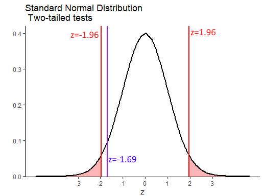

Our value of $z=-1.69$ is therefore not inside either of the regions of rejection. This means that we do not have sufficient evidence to reject the null hypothesis that our sample comes from a population with mean of equal to 6.5. 


<br><br>


## One-sample t-tests

As with confidence intervals based on the $z$-distribution (the standard normal curve), the major issue with z-tests is that they require you to know the population mean $\sigma$ to perform the calculations.  This is almost never the case - with exceptions like standardized tests including IQ and SAT that are designed to have specific means and standard deviations.  

If you wish to test whether your observed sample mean is likely or not to come from a population with a given mean, what approach should you take when you do not know $\sigma$?  As with confidence intervals, the approach we take is to use the $t$-distribution.


In this situation, because we don't know our population standard deviation $\sigma$, we have to estimate it using the sample standard deviation $s$. Further, because our sampling distribution may not be precisely normal given this estimation, we say that it comes from a $t$-distribution. $t$-distributions have slightly heavier tails than the normal distribution.

<br><br>

**One-tailed t-test example**

Let's illustrate the steps we take in a one-sample t-test with an example. These steps are identical to the two-tailed t-test up until we calculate the p-value.

The population mean number of words spoken by two year olds by their 2nd birthday is $\mu=50$ words and this is normally distributed.  We don't know the population standard deviation $\sigma$. A researcher wanted to investigate if reading to children increases their word knowledge. They collected data from 12 children ($n=12$) who were read to for at least two hours every day. These are the number of words spoken by the 12 children:

```{r}
x <- c(45, 53, 71, 35, 51, 59, 49, 55, 78, 27, 66, 59)
x
mean(x)  
```

Our one observed sample mean $\overline{x}=54$. This is higher than 50, but is it meaningfully higher? If we were to formalize our hypothesis for this test, we would write:

<br>
$H_{0}: \mu \le 50.0$
<br>
$H_{1}: \mu > 50.0$
<br>

We are testing whether our sample was likely to have come from a population with mean 50 or less (null hypothesis), or if it was more likely to come from a population with a mean of greater than 50.

The first step is to think about the sampling distribution. We need to recognize that our one observed sample mean is just one sample mean that we theoretically could have got from a sample distribution. Under the null hypothesis, we are going to assume that the mean of our sampling distribution $\mu_{\overline{x}}$ is equivalent to the population mean $\mu$. Therefore, $\mu_{\overline{x}}=50.0$

Next, we need to calculate the standard deviation of the sampling distribution of sample means for n=12 (i.e. the standard error). As we do not know the population standard deviation $\sigma$, we estimate this by using the following formula:

$\Large \sigma_{\overline{x}} = \frac{s}{\sqrt{n}}$

Therefore, our estimate of the standard error is $\sigma_{\overline{x}}=4.14$:

```{r}
sem <- sd(x) / sqrt(12)
sem

```

Now that we know both the mean and standard deviation of the t-shaped sampling distribution, next we need to calculate how many standard deviations from this mean is our one observed sample mean. We calculate that using the formula that is similar to the $z$ formula:

$\Large t = \frac{\overline{x} - \mu_{\overline{x}}}{\sigma_{\overline{x}}}$

Our sample mean of $\overline{x}=54$ has a $t$ value of $t = 0.965$:

```{r}
(54-50) / sem

```

This means that it is approximately 0.965 standard deviations higher than the mean.  We can calculate the proportion of sample means in the sampling distribution that are higher than our one observed sample mean by calculating the area under the curve to the right of our $t$-value. Remember, that our sampling distribution is $t$-shaped and has 11 degrees of freedom. The degrees of freedom are $df = n-1$ for a one-sample t-test.

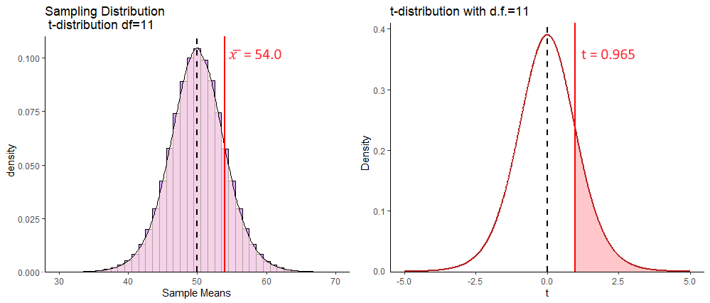


To determine what proportion of the curve lies to the right of $t=0.965$ we can use `pt()` which calculates the proportion to the left of the given value. 

```{r}
pt(0.965, df=11)
```

So, this tells us that for a $t$-distribution with 11 degrees of freedom, that 82.2% of values are to the left (lower than) of this value.  That means that 17.8% of values are to the right, or 17.8% of sample means that could be drawn from the sampling distribution with a mean of 54 and standard deviation of 4.14 will be higher than our observed sample mean.

```{r}
1 - pt(0.965, df=11)
```

We can also get this value by setting `lower.tail = FALSE`:

```{r}
pt(0.965, df=11, lower.tail = FALSE) 
```

Because we made a prediction as to the direction of the hypothesis - i.e. we predicted that reading to children would *increase* the population mean, we are effectively running a one-tailed test. Our p-value is simply $p=0.177$. As we use an alpha level of 0.05 (a p-value of 0.05 as our critical value), this suggests that we do not have sufficient evidence to suggest that our sample of 12 children have a mean value that comes from a population with a mean that is greater than 50. We do not reject our null hypothesis.

<br><br>

**Two-tailed t-test example**

There are 20 psychology students in Dr. Zeppo's class. Here are their scores on a test, as well as their sample mean $\overline{x}$ and sample standard deviation $s$:

```{r}
zeppo <- c(50,60,60,64,66,66,67,69,70,74,76,76,77,79,79,79,81,82,82,89)

zeppo

length(zeppo)  # 20 - there are 20 students in the sample.

mean(zeppo)  # the mean of the sample is 72.3

sd(zeppo)  # the sample SD is 9.52
```

Historically, students in this class get a score of 65 points on this test - that is the population mean $\mu$. Dr Zeppo wishes to test if this one sample (one class) has a mean (technically 'comes from a population with a mean') that is different to 65.  We would write out this hypothesis like this:

<br>
$H_{0}: \mu = 65.0$
<br>
$H_{1}: \mu \ne 65.0$
<br>

As with all of these tests, our first job is to recognize that our one sample mean is just one sample mean that we 'theoretically' could have got from lots of samples of size $n=20$. All of those sample means together are referred to as the sampling distribution of sample means.  Under the null hypothesis, we assume that the mean of the sampling distribution of sample means $\mu_{\overline{x}}=65$, i.e. it is equivalent to the population mean $\mu$. Next, we have to estimate the standard deviation of the sampling distribution of sample means, i.e. the standard error $\sigma_{\overline{x}}$.  We do this using the same formula as before:


$\large \sigma_{\overline{x}} = \frac{s}{\sqrt{n}}$

So, our standard error is $\sigma_{\overline{x}} = 2.13$:

```{r}
sem <- sd(zeppo) / sqrt(20)
sem

```

Following this, we need to calculate how expected or unexpected our one sample mean $\overline{x}$ was. We do this by calculating it in terms of how many sampling distribution standard deviations is it away from the sampling distribution mean.  We use the formula:

$\Large t = \frac{\overline{x} - \mu_{\overline{x}}}{\sigma_{\overline{x}}}$

```{r}
(mean(zeppo) - 65) / sem
```

Our observed sample mean of $\overline{x} = 72.3$ is 3.43 sampling distribution standard deviations from the sampling distribution mean.

We can picture this as follows:
<br>


To calculate our p-value for our 2-tailed t-test, we need to calculate not just the area underneath the curve with values of $t$ greater than our observed $t=3.43$, but also the values under the curve with $t$ values that are more negative than $t=-3.43$. This is because in a 2-tailed test, we need to test for the probability of getting a $t$-value as large in both directions. Our p-value can be calculated using `pt()`:

```{r}
pt(3.43, df = 19, lower.tail = F) + pt(-3.43, df = 19) 
```

Or alternatively, we could just multiply those values greater than $t=3.43$ by 2:

```{r}
pt(3.43, df = 19, lower.tail = F) * 2
```

Either way, we can see that our p-values is $p = 0.003$, which tells us that our observed mean of $\overline{x}=72.3$ is quite unlikely to have come from a distribution with a population mean $\mu=65$. This leads us to rejecting our null hypothesis and accepting the alternative, that these psychology students come from a population with a mean that is greater than 65.


<br><br>


### Critical values for the one-sample t-test


As with the z-test (see section \@ref(one-sample-z-test), instead of calculating the p-values for our observed values of $t$, you can simply test whether your value of $t$ exceeds (in either the positive or negative direction) some 'critical value' of $t$. Again, this approach was more often taken when it wasn't as easy to run computers to do these tests, so it seems a bit obsolete to do it this way. We recommend just doing it the way outlined above. Nevertheless, just for completeness, here is how to calculate these critical values of $t$.


We'll use data from a different dataset.  Here, we have the times taken to complete a crossword puzzle. We have a sample of $n=10$ subjects.  

```{r, message=FALSE, warning=FALSE}
library(tidyverse)
xt <- read_csv("data/crosstimes.csv")
xt$time3
```

Let's say we wish to test whether this sample comes from a population with a mean of less than 16.0.  We would be doing a one-tailed test and our hypotheses would look like this:

<br>
$H_{0}: \mu \ge 16.0$
<br>
$H_{1}: \mu < 16.0$
<br>

When using critical values, all the steps up to completing the observed $t$-value are the same as before. So, we assume that our one sample mean $\overline{x}$ comes from a sampling distribution of sample means that has a mean equivalent to the population mean of 16.  The standard deviation of this sampling distribution is:

```{r}
sem <- sd(xt$time3) / sqrt(10)
sem

```

Next, we calculate our observed $t$ which is a measure of how many sampling deviation standard deviations our observed sample mean is away from the mean of the sampling distribution:

```{r}
(mean(xt$time3) - 16) / sem
```

Our observed $t$ values is $t = -0.99$.

As we are conducting a one-tailed t-test, we need to think in terms of what value of $t$ leaves 5% in the tail for a t-distribution with 9 degrees of freedom. This is visualized below:

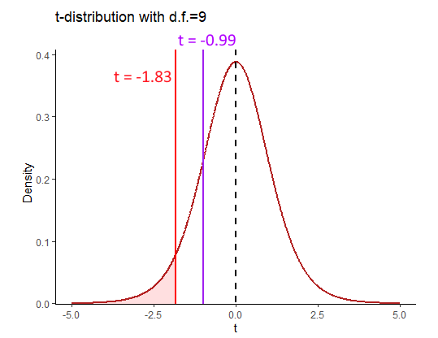

If our observed sample mean with a $t$-value of -0.99 was unexpectedly small, then it would need to be in the region of rejection (red shaded area). This would mean that it was in the bottom 5% of sample means from such a distribution. The value of $t$ that is the boundary of the the lower 5% can be calculated using the `qt()` function like this:


```{r}
qt(0.05, df=9)
```

<br><br>

**Two-tailed tests**

For this example, let's use the `penguins` data. Say we are interested in the flipper length of male Adelie  penguins on Biscoe island (a bit specific, but let's go with it), and wanted to know if their mean length was different from $\mu = 188$.  Our hypotheses would be:

<br>
$H_{0}: \mu = 188.0$
<br>
$H_{1}: \mu \ne 188.0$
<br>


From our data, we can calculate our $n$ and sample mean $\overline{x}$:

```{r, message=FALSE, warning=FALSE}
### Read in the Data Penguins
penguins <- read_csv("data/penguins.csv")

# just look at the females.
adelie <- penguins %>% filter(species == "Adelie", sex == "MALE", island == "Biscoe")

nrow(adelie)

mean(adelie$flipper_length_mm)

```


We can also represent these data as a boxplot:

```{r, fig.width=6, fig.height=1.5}
ggplot(adelie, aes(x = 0, y = flipper_length_mm)) +
  geom_boxplot() +
  geom_jitter(width = .1, size=2)+
  theme(axis.title.y=element_blank(),
        axis.text.y=element_blank(),
        axis.ticks.y=element_blank()) +
  coord_flip() +
  geom_hline(yintercept = 187, color="red")

```

Our sample of penguins has a sample size of $n=22$, with a sample mean of $\overline{x}=190.4$.  Let's calculate our observed value of $t$ for this sample:

```{r}
sem <- sd(adelie$flipper_length_mm) / sqrt(22)

tobs <- (mean(adelie$flipper_length_mm) - 188) / sem

tobs
```

This means that our observed sample mean is 1.75 sample standard deviations above the sampling distribution mean. 

In terms of critical regions, for a 2-tailed test, we need to know the values of $t$ that leave 2.5% in each tail for a $t$-distribution with 21 degrees of freedom.

```{r}
qt(.975, df = 21)

qt(.025, df = 21)
```

<br>


For a $t$-distribution with 21 degrees of freedom, the top 2.5% of t-values are greater than $t=2.08$, whilst the lowest 2.5% of t-values are below $t=-2.08$. Therefore, for us to reject the null hypothesis, our observed t-value needs to be higher than 2.08 or lower than -2.08. That would leave it in the region of rejection (red shaded areas above).  Our observed t-value is $t=1.75$ which is not in these areas, so we cannot reject the null hypothesis. We do not have sufficient evidence to suggest that our penguins come from a population with a mean of $\mu = 188$. 


<br><br>


## Conducting one-sample t-tests in R

Conducting one-sample t-tests in R is very straightforward. 

First, let's consider the sample of 12 two-year olds and their word scores.

```{r}
x <- c(45, 53, 71, 35, 51, 59, 49, 55, 78, 27, 66, 59)
mean(x)

```

To test whether this sample mean is likely to have come from a population with a mean greater than 50, we use `t.test()` in the following way:


```{r}
t.test(x, mu = 50, alternative = "greater")  # one-tailed test
```

`mu` specifies the mean that we are testing against.  `alternative = "greater"` states that it is a one-tailed test, where we are testing the prediction that the population mean is greater than 50.  The output gives us the same observed t-value that we calculated by hand $t=0.97$, the degrees of freedom and the p-value.


To conduct a two-tailed test, where we just make the prediction that the population mean that the sample came from is not equal to some value, we just drop the `alternative` argument.  For instance, we can test whether the `zeppo` data come from a population with a mean equal to 65:


```{r}

t.test(zeppo, mu = 65)  # two tailed test

```


Again, we see the same t-value, degrees of freedom and p-value as we calculated by hand.  Also with a two-tailed t-test we get the 95% confidence interval of the true population mean (see section  \@ref(calculating -a-t-distribution-confidence-interval).


Finally, if we wished to do a one-tailed t-test where we were testing whether the sample came from a population with a population mean of less than some value, we would use `alternative = "less"`. For example, to test if the sample of puzzle competitors came from a population that completed their puzzles in less than 16 minutes:

```{r}
t.test(xt$time3, mu = 16, alternative = "less")
```

<br><br>


## Assumptions of the one-sample t-test

The main assumptions of the one-sample t-test are that the observations should be independent of each other, and the values should be approximately normally distributed.

We can more formally test if our data come from a population that is approximately normally distributed using a Shapiro-Wilk test. This test essentially examines the distribution of our data, and determines the probability that it came from a normal distribution. We can perform this test in R using `shapiro.test()`.

```{r}
shapiro.test(x)

shapiro.test(zeppo)

shapiro.test(xt$time3)

shapiro.test(adelie$flipper_length_mm)

```

As you can see, all four of the datasets that we have performed one-sample t-tests on have p-values for this test that are greater than p=0.05. This suggests that our data are approximately normally distributed. The p-value for the crossword puzzle times is very low `p=0.0501` which probably suggests that we should look at that data in more detail to be sure that our data are normally distributed.

If your data are not normally distributed, then one option is to perform a non-parametric alternative to the one-sample t-test. This test is called the  one-sample Wilcoxon signed rank test. We will not go into the details of the test, but effectively it tests whether your sample is likely to have come from a population with a median of a specified value.  It is run like this in R:

```{r}
wilcox.test(xt$time3, mu = 16, alternative = "less")
```

Again, with this test, we are looking for a p-value lower than 0.05 to reject the null hypothesis and accept the alternative that our sample comes from a population with a median of less than 16.


<!--chapter:end:09-onesample.Rmd-->

# Two Sample Inferential Statistics

```{r, echo=FALSE, warning=FALSE, message=FALSE}
library(tidyverse)
```

A very common question in statistics is whether two groups differ from each other in their distributions. Most often, what we are really asking is whether the population means $\mu$ of two groups differ from each other. 

In the figure below, we are plotting four different comparisons of two normal distributions. 

In the top left, both populations have the same mean $\mu$ and same variance $\sigma^2$ (remember that variance is standard deviation $\sigma$ squared). These two populations are essentially identical. In the top right, both populations have the same mean $\mu$, but differ in their variance $\sigma^2$. 

The bottom two distributions show populations with different population means $\mu$ and the same variance $\sigma^2$. In the bottom left, the means are quite far apart, whereas in the bottom right the means are different to each other but the effect is much smaller.

<br><br>


<br><br>

It is also possible to have the situation where the means are different to each other, and so is the variance, as is shown in the figure below:

<br><br>


<br><br>

## Independent Samples t-test

The most typical situation where we are interested in comparing two means is when we collect two samples of data. Perhaps we collect data on the reaction times of subjects after drinking water or coffee.  We would be able to directly calculate the sample means $\overline{x}$ of both samples and could find out if there was a different or not in these values. But, what we really want to know is whether the respective populations that these two samples come from (i.e. the population of water drinkers vs the population of coffee drinkers) actually differ in their population means $\mu$.

This is the situation that we will discuss more in this chapter. **Independent t-tests** examine whether two independent samples (meaning different individuals in each group) could theoretically have come from populations with the same population mean $\mu$, or whether this is unlikely and their populations likely had different population means $\mu$. Independent t-tests also get called **two-sample t-tests**.

There are two types of independent t-tests. The first, and the one that we will discuss most extensively, is called the **Student's t-test**. This test assumes that the populations we are comparing have the same variances $\sigma^2$. The other independent t-test is called the **Welch's t-test** and makes a correction that allows for the two populations we are comparing to have different variances $\sigma^2$.  We will talk more about this version when performing t-tests in R, as it is actually the default version that R performs. For now, we shall dive deeper into the principles behind the Student's t-test. 


## Sampling Distribution of the Difference in Sample Means

For a two-sample independent $t$-test, the sampling distribution we use is different to the sampling distribution for a one-sample $t$-test. In a one-sample test, we are focused on the sampling distribution of sample means. In a two-sample test we are focused on the *sampling distribution of the differences in sample means*.


### Visualizing the Sampling Distribution


Let's try to illustrate this by looking at the sampling distributions we could get when we draw samples from two populations. In the first example, the populations differ in their means.  In the second example, the populations do not differ in their means.

<br>

**Difference in Population Means**

Say we have two normally distributed populations, A and B and each has 500,000 subjects. A has a population mean $\mu = 15$, and a population standard deviation $\sigma = 2.5$.  B has a population mean $\mu = 12$, and a population SD $\sigma = 2.5$.

We can generate these population by simulation in R like this:

```{r}
set.seed(1)

A <- rnorm(n = 500000, mean = 15, sd = 2.5)
B <- rnorm(n = 500000, mean = 12, sd = 2.5)

```


We can check their mean and standard deviation, and we see that the standard deviations are identical at 2.5, but the population means differ by 3:

```{r}
# and their summary descriptive stats
mean(A)   
sd(A)     

mean(B)   
sd(B)    

```


We can visualize these population distributions as follows:

```{r}
data.frame(A, B) %>%
  pivot_longer(1:2) %>%
  ggplot(aes(x=value, fill=name)) +
  geom_density(alpha = .1) +
  theme_classic() +
  ggtitle("Comparison of Population A vs B")+
  geom_vline(xintercept = 15, color="red", lwd=1, lty=1)+
  geom_vline(xintercept = 12, color="dodgerblue", lwd=1, lty=2) +
  scale_x_continuous(breaks = seq(2,26,2))
```


We can calculate the true difference in population means $\mu_{A} - \mu_{B}$ to be 2.997. 


```{r}
mean(A) - mean(B) 
```


If we knew nothing about the populations of A and B, but were interested in whether they differed in their population means, then we might take a sample of A and a sample of B and compare their sample means. In this example, we are going to take a sample of size $n=17$ from population A, and a sample of size $n=20$ from population B.  These sample sizes were picked more or less at random - they can be the same sized samples, or they can be different sizes. 

Let's take our samples, and then examine the differences in our sample means:

```{r}
set.seed(1) # so we get the same values

a1 <- sample(A, 17)
a1

b1 <- sample(B, 20)
b1

mean(a1)
mean(b1)

mean(a1) - mean(b1)  

```

Here we find that the difference in means between our sample from population A and our sample from population B is 2.85.  In other words, $\overline{x}_{A} - \overline{x}_{B} = 2.85$  This is pretty close to the true difference in population means (although we're currently pretending that we don't know that difference).


We could do this again. Let's select another sample from population A of size 17, and another sample from population B of size 20:


```{r}
a2 <- sample(A, 17)
a2

b2 <- sample(B, 20)
b2


mean(a2)
mean(b2)

mean(a2) - mean(b2)  

```

This time, $\overline{x}_{A} - \overline{x}_{B} = 3.37$  This is again pretty close to the true difference in population means, but a bit higher this time.


We can keep drawing samples of size 17 from A, and size 20 from B and examining the difference in sample means $\overline{x}_{A} - \overline{x}_{B}$.  A quick way of writing that code in R is as follows - where we repeat it 5 more times:

```{r}
mean(sample(A,17)) - mean(sample(B,20))
mean(sample(A,17)) - mean(sample(B,20))
mean(sample(A,17)) - mean(sample(B,20))
mean(sample(A,17)) - mean(sample(B,20))
mean(sample(A,17)) - mean(sample(B,20))
```

As you can see, the values we get tend to be a little bit above or a little bit below 3.

If we did this thousands and thousands of times, we'd get a distribution of the differences in sample means. This would be the *sampling distribution of the differences in sample means*.  Below we repeat the above step 10,000 times to get a visualization of what this sampling distribution looks like:

```{r}
set.seed(1)
difs <- vector('list', 10000)

for(i in 1:10000){
  difs[[i]] <-  mean(sample(A, 17)) - mean(sample(B, 20))
}

df <- data.frame(dif = unlist(difs))


#get mean difference
mean(unlist(difs))  # 3.00

#make histogram
ggplot(df, aes(x=dif)) +
  geom_histogram(color='black', fill='dodgerblue', alpha=.5, binwidth = .1)+
  theme_classic() +
  xlab("Difference in Sample Means")+
  ggtitle("Sampling Distribution of Difference in Sample Means") +
  geom_vline(xintercept = mean(unlist(difs)), lwd=1, color="red")


```


As you can see, the sampling distribution is approximately symmetrical. If we ran it for more simulations, it would become even more symmetrical. The average (mean) difference in sample means across all samples is $\Large \mu_{\overline{x}_{A} - \overline{x}_{B}}= 2.987$ which is approximately equal to the real difference in population means $\mu_{A} - \mu_{B}$.

An obvious next question is what is the standard deviation of this sampling distribution? i.e. the standard deviation of the sampling distribution of the differences in sample means. If we knew this, then we'd be able to describe how likely or unlikely we were to get any particular difference in sample means in terms of how many sampling distribution standard deviations that score is away from the mean.

There are actually two different formulas that we can use to work out the standard deviation - which we will discuss shortly (see section \@ref(pooled-standard-deviation)). In brief, it is a bit trickier to calculate the standard deviation of this sampling distribution compared to the standard deviation of the sampling distribution of sample means, because our difference in sample means uses two different samples each with their own sample standard deviation. 

Given we just simulated our sampling distribution of the differences in sample means, we could just look at its standard deviation in R:

```{r}
sd(unlist(difs))
```

This tells us that the standard deviation of this sampling distribution is approximately equal to $\sigma_{\overline{x}_{A} - \overline{x}_{B}}= 0.82$.  As well as using the formulas that we will introduce shortly to estimate this value, there is actually another shortcut we could have used too as we know the original population standard deviations. This is not essential to know or remember, as it's not something we would ever do in practice, it's just something to point out in passing.

There is something called [variance sum law](http://onlinestatbook.com/2/summarizing_distributions/variance_sum_law.html).  Essentially, if you want to know the difference of two variables, then it is equal to the sum of the variance of the two variables.

Our variables in this scenario are the sampling distributions of sample means for A and B. We can calculate the variance of each by $\sigma^2/n$.  If we add them together according to the variance sum law, we get the variance for the difference in these two variables. Then we square-root to get the standard deviation - which is equivalent to our sampling distribution of the difference in sample means standard deviation:

```{r}
sqrt((var(A)/17) + (var(B)/20)) 
```

Again, this tells us that $\Large  \sigma_{\overline{x}_{A} - \overline{x}_{B}}= 0.82$.  

However, in practice, we only have our two samples (our one sample of population A and our one sample of population B). We don't know anything else about the sampling distribution or the populations. Therefore we cannot use either of the above methods to calculate the standard deviation of the sampling distribution.  We'll get to what method you need to use soon.  


<br><br>

**No Difference in Population Means**

Let's look at an example of what the sampling distribution of difference in sample means looks like when there is no difference between population means.

In this scenario, we have two normally distributed populations, C and D and each has 500,000 subjects. C has a population mean $\mu = 10$, and a population standard deviation $\sigma = 3$.  D has a population mean $\mu = 10$, and a population SD $\sigma = 3$. We can generate these populations in R:

```{r}
set.seed(1)

C <- rnorm(n = 500000, mean = 10, sd = 3)
D <- rnorm(n = 500000, mean = 10, sd = 3)

```


We can then examine their means and standard deviations:

```{r}
# and their summary descriptive stats
mean(C)   
sd(C)     

mean(D)   
sd(D)     
```


We can then calculate the true difference between these populations in their population means and see that $\mu_{C}-\mu_{D} = 0.00$ 

```{r}
mean(C) - mean(D)
```


We can also visualize these populations - it can be hard to see both populations because they are identical and D is directly on top of C, but they are both there!

```{r}
data.frame(C, D) %>%
  pivot_longer(1:2) %>%
  ggplot(aes(x=value, fill=name)) +
  geom_density(alpha = .1) +
  theme_classic() +
  ggtitle("Comparison of Population C vs D")+
  geom_vline(xintercept = 10, color="red", lwd=1, lty=1)+
  geom_vline(xintercept = 10, color="dodgerblue", lwd=1, lty=2)
```


For this example, let's look at one sample of size 11 for population C and one sample of size 14 for population D.

```{r}
set.seed(1)
c1 <- sample(C, 11)
d1 <- sample(D, 14)

c1
d1

mean(c1)

mean(d1)

mean(c1) - mean(d1)  
```

Here we find that the difference in sample means $\Large \overline{x}_C - \overline{x}_D = -0.197$.

If we did this lots of times, we'd sometimes get sample means that were larger in C and sometimes they would be larger in D. Let's do it five more times:

```{r}
mean(sample(C,11)) - mean(sample(D,14))
mean(sample(C,11)) - mean(sample(D,14))
mean(sample(C,11)) - mean(sample(D,14))
mean(sample(C,11)) - mean(sample(D,14))
mean(sample(C,11)) - mean(sample(D,14))
```


If we did this thousands and thousands of times, we will get our sampling distribution of the differences in sample means. We can use the code below to simulate this, collecting 20,000 samples of C and D and determining the difference in means for each sample collected:

```{r}
set.seed(1)

difs1 <- vector('list', 20000)

for(i in 1:20000){
  difs1[[i]] <-  mean(sample(C, 11)) - mean(sample(D, 14))
}

```

We can visualize this sampling distribution:

```{r}
## plot as a histogram:
df1 <- data.frame(dif = unlist(difs1))

ggplot(df1, aes(x=dif)) +
  geom_histogram(color='black', fill='mistyrose', alpha=.5, binwidth = .2)+
  theme_classic() +
  ggtitle("Sampling Distribution of Difference in Sample Means") +
  geom_vline(xintercept = mean(unlist(difs1)), lwd=1, color="red")
```


```{r}
mean(unlist(difs1))  
```

After 20,000 samples of size 11 from population C and size 14 from population D, we find that the mean difference in sample means is $\mu_{\overline{x}_C - \overline{x}_D} = -0.006$. This is pretty close to the true difference in population means of 0. If we were to run our simulation for longer to get even more differences in sample means, then our mean difference would get even closer to 0.


So, we have a symmetrical sampling distribution of differences in sample means with a mean $\mu_{\overline{x}_C - \overline{x}_D}$ approximately equal to 0.0. What is the Standard Deviation of this distribution? Again, we can calculate this directly from our simulated data:

```{r}
sd(unlist(difs1))
```

Here we find that the standard deviation is $\sigma_{\overline{x}_C - \overline{x}_D} = 1.2$.  The question becomes, how do you estimate this standard deviation when you only have one sample of each population?  We shall get to how this is done in the next few sections.


## Pooled Standard Deviation


In the Student's t-test, we assume that our two samples come from populations that have "equal variance", i.e. that their standard deviations are equivalent. The reason behind this is that it enables us to use this estimate in calculating the Standard Deviation of the Sampling Distribution of Differences in Sample Means.  

When we assume that two samples have the same variance, we estimate this by pooling their standard deviations. Let's look in more detail about how standard deviations are pooled.


When we have two samples, they each have sample standard deviations, that are usually not equal. For example, let's look at these two samples. The first sample is of size 9 and the second sample is of size 10.

```{r}
samp1 <-  c(23, 25, 33, 19, 21, 27, 26, 31, 20)
samp1
sd(samp1)


samp2 <-  c(21, 22, 23, 19, 20, 24, 25, 21, 23, 22)
samp2
sd(samp2)

```


It's clear that our sample standard deviations differ, with sample 1 having a sample standard deviation $s=4.82$ and sample 2 having a sample standard deviation of $s=1.83$.

So, if we assumed that they both come from populations with the same SD, how do we estimate that value? We have to pool the standard deviation.  Essentially, we want to calculate a value that is likely somewhere in between the two sample SDs. In practice we use a weighted average.

There are two ways of going about calculating this pooled standard deviation value.  The first is to use first principles as to what a standard deviation is. This is the one that makes most sense logically (to us at least), but it is also the more long-winded way.  The second way is to use a shortcut formula.

<br><br>

**Option 1: From first principles**

Let's first calculate the pooled standard deviation based on first principles.  Remember, a standard deviation is the square root of the average squared deviation of each value from the mean.

What we could do is to get the difference of every score from it's group mean, then square those differences, then add them all up, then divide by $n-2$, and then square root.  We divide by $n-2$ instead of $n-1$ because we have two samples that we are using and we are using two different estimated means to determine the standard deviation. Therefore, to avoid underestimating our standard deviation we divide by $n-2$.

Here, we break this down step by step:

i) Calculate each sample mean:

```{r}
mean(samp1)
mean(samp2)

```

ii) Let's get the differences of each score from their group mean:

```{r}
# get the differences from each group mean:

samp1_dif  <- samp1 - mean(samp1)
samp2_dif  <- samp2 - mean(samp2)

samp1_dif

samp2_dif
```


iii) Now square all these differences:

```{r}
samp1_dif2 <- samp1_dif^2
samp2_dif2 <- samp2_dif^2

samp1_dif2
samp2_dif2
```

iv) Get the sum of all the squares and add them up across both samples:

```{r}
ssq <- sum(samp1_dif2) + sum(samp2_dif2)
ssq
```

v) Now we get the 'average' squared deviation by dividing by n-2

```{r}
n2 <- 9 + 10 - 2
asd <- ssq/n2
asd
```

vi) Finally, we get the pooled standard deviation by square-rooting this:

```{r}
sqrt(asd)
```

Thus our estimate of the pooled standard deviation is $\hat\sigma_p = 3.56$.   This value is between our original sample standard deviations of 4.82 and 1.83, which makes sense.

You may see the following formula for calculating the pooled standard deviation in the way we just did. 

$\Large \hat\sigma_p = \sqrt{\frac{\Sigma_{ik}(x_{ik} - \overline{x}_k)^2}{n_1 + n_2 -2}}$


Here, $n_1$ is the sample size of sample 1, $n_2$ is the sample size of sample 2. The $\Sigma_{ik}(x_{ik} - \overline{x}_k)^2$ part of the formula is simply saying to take each data point away from it's sample mean and then square it - and then add all of these up. It looks quite intimidating, but hopefully the steps we outlined above make sense.

<br><br>

**Option 2: Using a shortcut formula**

The second way to calculate the pooled standard deviations doesn't require you to know the raw data. It is a formula that only requires you to know the sample standard deviation of each sample and the sample size of each sample. This is the formula:

$\Large \hat\sigma_p = \sqrt{\frac{w_1s_1^2 + w_2s_2^2 }{w_1 + w_2}}$


Here, $w_1 = n_1-1$ where $n_1$ is the sample size of sample 1. $w_2 = n_2-1$ where $n_2$ is the sample size of sample 2. $s_1$ is the sample standard deviation of sample 1, and $s_1$ is the sample standard deviation of sample 2.

We can calculate the pooled standard deviation using this formula for our two samples above:

```{r}
s1sd <- sd(samp1)
s2sd <- sd(samp2)

w1 <- length(samp1) - 1
w2 <- length(samp2) - 1

numerator <- (w1*s1sd^2) + (w2*s2sd^2)
denominator <- w1+w2

sqrt(numerator/denominator) 

```

This approach also calculates the pooled standard deviation to be $\hat\sigma_p = 3.56$.


## Theory behind Student's t-test

Hopefully you have a sense of the sampling distribution for the difference in sample means, and an idea about what pooled standard deviation is.  In this section we'll bring together these ideas to show you the behind the scenes working of the Student's t-test.


We'll use some example data from [the Navarro book](https://learningstatisticswithr.com/book/ttest.html#studentttest). These data are the exam scores of students who were TA-ed by either Anastasia or Bernadette. The question at hand is whether these two samples could have come from populations with the same mean, or from populations with different means. We assume that the variance (and therefore standard deviations) of both of these populations are the same. 

Here are the data:

```{r}
anastasia <- c(65, 74, 73, 83, 76, 65, 86, 70, 80, 55, 78, 78, 90, 77, 68)
bernadette <- c(72, 66, 71, 66, 76, 69, 79, 73, 62, 69, 68, 60, 73, 68, 67, 74, 56, 74)

```


We can make a boxplot to compare the two samples:

```{r}
# plot the data:
d <- data.frame(values = c(anastasia, bernadette),
                group = c(rep("anastasia",15), rep("bernadette", 18))
)

ggplot(d, aes(x = group, y = values, fill = group)) +
  geom_boxplot(alpha=.3) +
  geom_jitter(width=.1, size=2) +
  theme_classic() +
  scale_fill_manual(values = c("firebrick", "dodgerblue"))

```


We can also get the sample mean $\overline{x}$, standard deviation $s$ and $n$ of each sample:

```{r}
mean(anastasia)            
sd(anastasia)              
nA<-length(anastasia)      
nA

mean(bernadette)           
sd(bernadette)             
nB <- length(bernadette)   
nB
```


Although we are actually interested in whether these two samples come from populations that differ in their population means, we can directly measure if the two samples differ in their sample means by subtracting one from the other:

```{r}
mean(anastasia)  - mean(bernadette)  
```

We can see that Anastasia students have on average 5.48 higher scores than Bernadette students. But how meaningful is this difference?


What we are going to do is to work out how unusual or usual our one observed sample mean difference is.  We need to construct the sampling distribution of differences in sample means. We hypothesize that the true mean difference in population means is 0 (no difference between groups).

These are our hypotheses:

<br>
$H_{0}: \mu_A = \mu_A$
<br>
$H_{1}: \mu_A \ne \mu_A$
<br>


If we assume that the true difference in population means is 0 (the null hypothesis), then this will mean that the mean of the sampling distribution of the difference in sample means will also be 0 ($\mu_{\overline{x}_A-\overline{x}_B}=0$). If we know the standard deviation of this sampling distribution, then we could work out how many standard deviations away our one observed sample mean difference of 5.48 is from 0. That would enable us to work out the probability of getting a value that extreme.


So our next step is to work out the standard deviation of the sampling distribution. If we assume equal variances between the populations of group A and B, then we can calculate the standard deviation of this sampling distribution as

$\Large \sigma_{\overline{x}_A-\overline{x}_B} = \hat\sigma_p \times \sqrt{\frac{1}{n_1} + \frac{1}{n_2} }$


So, the first step in this formula is to calculate the pooled standard deviation $\hat\sigma_p$.  We can either calculate this from first principles or using the shortcut formula (see section \@ref(pooled-standard-deviation)). Below, we calculate the pooled standard deviation using the first principles:

```{r}
# from first principles, calculating deviations from each group mean
difA2 <- (anastasia - mean(anastasia))^2
difB2 <- (bernadette - mean(bernadette))^2
sumsq <- sum(difA2) + sum(difB2)
n <- nA + nB #33
sd.pool <- sqrt(sumsq/(n-2))

sd.pool # 7.41  this is the estimated pooled s.d.
```

This gives us a value of $\hat\sigma_p = 7.407$. This makes sense being in between our two sample standard deviations:

```{r}
sd(anastasia) #8.999
sd(bernadette) #5.775
```


Once we've calculated the pooled standard deviation $\hat\sigma_p$, we can insert it to the formula above to calculate the standard deviation of the sampling distribution of differences in sample means $\sigma_{\overline{x}_A-\overline{x}_B}$.

```{r}
sedm <-  sd.pool * sqrt( (1/nA) + (1/nB))

sedm  # this is the Standard Deviation of the Sampling Distribution of differences in sample means
```

Doing this, we calculate $\sigma_{\overline{x}_A-\overline{x}_B} = 2.59$.  This tells us that the standard deviation of the theoretical sampling distribution of the differences in sample means is 2.59. With that information, we can work out how many standard deviations away from the mean (of 0) our one observed difference in sample means of $\overline{x}_A - \overline{x}_B = 5.48$ is. 


Lets' visualize what this sampling distribution looks like:
<br>


By estimating the standard deviation, we are able to plot what our sampling distribution would look like. We are then able to see that our observed difference in sample means of $\overline{x}_A - \overline{x}_B = 5.48$ is quite far away from the hypothesized mean of 0 in terms of standard deviations.  What we have not discussed so far is what kind of shape that this distribution is other than it is symmetrical.  Similar to when we were looking at sampling distributions of sample means (see section \@ref(sampling-distribution-of-the-difference-in-sample-means)), the shape of this sampling distribution of the difference in sample means is also $t$-shaped. In the example given above, it is a $t$-distribution with 31 degrees of freedom. The degrees of freedom of these sampling distributions are equal to $df = n_A +  n_B - 2$. So in our case, this is equal to:

```{r}
nA + nB - 2
```

Given that the shape of our distribution is $t$-shaped, when we determine how many standard deviations away from the mean our single observed difference in sample means is, we call this our *observed t-value*.

We calculate t by the following formula:

$\Large t = \frac{(\overline{x}_A - \overline{x}_B)  -  (\mu_{\overline{x}_{A} - \overline{x}_{B}})}{\sigma_{\overline{x}_{A} - \overline{x}_{B}}}$

But because we assume the mean of the sampling distribution of sample means to be zero, we can write it as:

$\Large t = \frac{\overline{x}_A - \overline{x}_B}{\sigma_{\overline{x}_{A} - \overline{x}_{B}}}$


Essentially, it is taking our observed difference in sample means and dividing it by the standard deviation of the sampling distribution.


```{r}
tobs <- (mean(anastasia)  - mean(bernadette))  / sedm  

tobs 
```

Our observed t-value is $t = 2.115$.


Our final thing to do is to calculate the p-value.  The first step in this is to work out the proportion of the t distribution that is higher than our observed t-value. Because we are running a two-tailed test (we are examining whether the true difference in population means is 0 or not equal to 0), we need to double that proportion to get our p-value.  


The image above helps to explain how we'd calculate the p-value. Because it's a two-tailed test, we need to calculate the proportion of the distribution in the red area - this is the area that is greater than $t=2.115$ and less than $t=-2.115$.  We can use the `pt()` function in R to calculate this - remember that for this example, our degrees of freedom are 31:

```{r}
1 - pt(2.115, df=31)
```

This tells us that the area beyond $t=2.115$ is 0.021.  Therefore to get our p-value we double this:

```{r}
(1 - pt(2.115, df=31)) * 2
```

Our p-value is $p = 0.043$.


** One-tailed test **

If we had predicted beforehand that Anastaia's students would score more highly on the exam than Bernadette's then we could perform a one-tailed test. The hypotheses in this situation would be:

$H_{0}: \mu_A \le \mu_A$
$H_{1}: \mu_A > \mu_A$


All of the steps for calculating the observed $t$-value would be the same as above. The only difference is when calculating the p-value, we only need to consider the area under the curve beyond $t=2.115$. Therefore the p-value for this one-tailed test is $p = 0.021$.


<br><br>


## Confidence Interval for Difference in Means

When we take a sample of two independent groups, we are able to directly calculate the observed difference in sample means $\overline{x}_A - \overline{x}_B$. What we are usually interested in is whether this observed difference is meaningfully different from 0. One way to gain more insight into whether this might be true or not is to generate a 95% confidence interval around our observed sample difference $\overline{x}_A - \overline{x}_B$. If 0 is not inside our confidence interval, then this is pretty good evidence that the true difference in population means $\mu_A - \mu_B$ between the two groups is not 0, and therefore there is a difference in population means.  

As with all confidence intervals, the longer explanation as to what a 95% confidence interval really is, is a bit more long winded. Technically, this 95% confidence intervals means that if we were to take many samples of A and many samples of B, and calculate the difference and confidence intervals for all of them, in 95% of these confidence intervals we would have captured the true difference in population means $\mu_A - \mu_B$.


Let's illustrate with a small example, and then we'll turn to our TA data.


<br>

*Example 1*

A researcher compares the reaction times of two groups on a motor test. Individuals are different (independent) in each group. GroupA took a stimulant prior to the test. GroupB is the control group.

```{r}
groupA <- c(5.5, 5.1, 3.5, 5.1, 4.6, 4.6, 5.9, 4.0, 3.1, 3.8)
mean(groupA)     # 4.52
sd(groupA)       # 0.91


groupB <- c(5.7, 5.3, 5.9, 5.0, 5.0, 4.3, 4.1, 5.9, 5.9, 5.8, 5.4, 5.2, 4.9, 5.5)
mean(groupB)     # 5.28
sd(groupB)       # 0.58
```


```{r}

# plot the data:
dd <- data.frame(values = c(groupA, groupB),
                group = c(rep("A",10), rep("B", 14))
)

head(dd)

ggplot(dd, aes(x = group, y = values, fill = group)) +
  geom_boxplot(alpha=.3) +
  geom_jitter(width=.1, size=2) +
  theme_classic() +
  scale_fill_manual(values = c("firebrick", "dodgerblue"))

```


We can see from our data, that the observed difference in sample means between the two groups is $\overline{x}_A - \overline{x}_B = -0.759$

```{r}
mean(groupA) - mean(groupB)
```

Group B (the control group) is slower by 0.76 seconds on average than group A (the group that took the stimulant).


The first step in constructing a confidence interval around this observed difference in sample means, is to imagine that this observed difference in sample means came from a sampling distribution of difference in sample means. Our observed value was just one possible sample that we could have got from this sampling distribution.

This sampling distribution of differences in sample means, is $t$-shaped with degrees of freedom equal to $n-2$. We assume that our observed value of the difference in sample means is a good estimate of the true difference in population means. If we know the standard deviation of this sampling distribution, then we can create the 95% confidence interval around it using the formula:


$\Large CI_{95\%} =  \overline{x}_A - \overline{x}_B   \pm   t \times \sigma_{\overline{x}_A - \overline{x}_B}$ 


As discussed in the previous sections (see \@ref(sampling-distribution-of-the-difference-in-sample-means) and \@ref(pooled-standard-deviation)) the standard deviation of the sampling distribution of differences in sample means, can be calculated using the formula:

$\Large \sigma_{\overline{x}_A - \overline{x}_B}  =  \hat{\sigma_{\rho}} \times \sqrt{\frac{1}{n_A} + \frac{1}{n_B}}$


where $\hat{\sigma_{\rho}}$ is the pooled estimate of the standard deviation between the two groups.


The below diagram illustrates how this formula determines the 95% confidence interval. Our margin of error is the value of $t$ for the $t$-distribution with the appropriate degrees of freedom that leaves 2.5% in each tail, and therefore 95% in the middle of the distribution. We multiply this value of $t$ by the standard deviation of the sampling distribution of the differences in sample means to get the margin of error.  


The first step is therefore to calculate the pooled estimate of the common standard deviation $\hat{\sigma_{\rho}}$ (see section \@ref(sampling-Distribution-of-the-difference-in-sample-means)). Using the method of calculating deviations from each group mean, we can find that $\hat{\sigma_{\rho}} = 0.73$

```{r}
difA2 <- (groupA - mean(groupA))^2
difB2 <- (groupB - mean(groupB))^2
sumsq <- sum(difA2) + sum(difB2)
n <- length(groupA) + length(groupB) #24
sd.pool <- sqrt(sumsq/(n-2))
sd.pool
```

Putting this value into the above formula, we can calculate the standard deviation of the sampling distribution of the  differences in sample means to be $\sigma_{\overline{x}_A - \overline{x}_B} = 0.302$.


```{r}
sedm1 <-  sd.pool * sqrt( (1/length(groupA)) + (1/length(groupB)))

sedm1
```


So now we have the estimated mean $\overline{x}_A - \overline{x}_B$ and the standard deviation $\sigma_{\overline{x}_A - \overline{x}_B}$ of our sampling distribution of differences in sample means. Because our sampling distribution approximates to a $t$-distribution of degrees of freedom = $n-2$, we calculate the value of $t$ which leaves 2.5% in the tails using the `qt()` function in R.

```{r}
n <- length(groupA) + length(groupB)
tval <- qt(.975, df = n-2)
tval
```

Using this value, we can calculate the margin of error, and the lower and upper bounds of the confidence interval:

```{r}
dm <- mean(groupA) - mean(groupB)
dm

tval*sedm1
dm +  (tval*sedm1)  # upper bound = -0.13
dm -  (tval*sedm1)  # lower bound = -1.39

```

So the confidence interval is equal to: $CI_{95\%} = -0.76 \pm 0.63$ or  $CI_{95\%} =  -0.76[-0.13, -1.39]$. This shows us that the true difference in population means is unlikely to include 0, so we can conclude that there is likely a true difference in population means between the two groups.
 

The above is the 'by hand' way to calculating the confidence interval, that explains the theory behind it. The quickest way is to use the R function `t.test()`. Inside the brackets, you include the two groups of data, and use `var.equal=T`. This last argument ensures that you are assuming that the variances between the two populations that the samples come from are equal.  The `$conf.int` bit on the end just gives us the confidence intervals:

```{r}
t.test(groupA, groupB, var.equal = T)$conf.int
```

<br>

*Example 2*

Let's look at this with a second example using the `anastasia` and `bernadette` data. 

First, we get the value of $\overline{x}_A - \overline{x}_B$, which is our observed difference in sample means. This is what we assume the mean of the sampling distribution of differences in sample means is.

```{r}
meandif <- mean(anastasia)  - mean(bernadette)   # 5.48
meandif # this is our observed difference in sample means
```

We find that $\overline{x}_A - \overline{x}_B=5.48$

Previously in section \@ref(theory-behind-student's-t-test) we calculated the standard deviation of this sampling distribution to be $\sigma_{\overline{x}_A - \overline{x}_B} = 2.59$. We saved this earlier as `sedm`.

```{r}
sedm  
```

To calculate our margin of error, we need to multiply $\sigma_{\overline{x}_A - \overline{x}_B}$ by the value of $t$ that leaves 2.5% in each tail for a $t$-distribution with $n-2$ degrees of freedom:

```{r}
tval <- qt(.975, df = length(anastasia) + length(bernadette) -2)
tval  #2.04
```

We can now calculate the confidence intervals:

```{r}
tval*sedm
meandif +  (tval*sedm) # 10.76
meandif -  (tval*sedm) # 0.20
```

So the 95% confidence interval is equal to: $CI_{95\%} = 5.48 \pm 5.28$ or  $CI_{95\%} =  5.48[0.20, 10.76]$.  These CIs suggest that 0 is not likely to be the true difference in population means, therefore it is plausible that the population of students that have Anastasia as a TA score more highly on their exams than the population of students that have Bernadette as a TA.

We could have checked this using `ttest()`:

```{r}
t.test(anastasia, bernadette, var.equal = T)$conf.int
```

Finally, we could also plot confidence intervals like this:

```{r}
## plotting confidence intervals

dci <- data.frame(group = "", 
                  mean = meandif, 
                  lower = meandif -  (tval*sedm), 
                  upper = meandif +  (tval*sedm)
)


ggplot(dci, aes(x=group, y=mean, ymax=upper, ymin=lower)) +
  geom_errorbar(width=0.2, size=1, color="blue") +
  geom_point(size=4, shape=21, fill="white") +
  theme_minimal() +
  coord_flip() +
  xlab("") +
  ylab("Estimate of Difference in Sample Means")
```  
   


## Conducting the Student t-test in R

The function we need to conduct a Student's t-test in R is `t.test()`.

For instance, we want to test whether there is a difference in population means between the `anastasia` and `bernadette` samples. Here is the data visualized:

```{r}
# boxplot
ggplot(d, aes(x = group, y = values, fill = group)) +
  geom_boxplot(alpha=.3, outlier.shape = NA) +
  geom_jitter(width=.1, size=2) +
  theme_classic() +
  scale_fill_manual(values = c("firebrick", "dodgerblue"))

```


You can do the Student's t-test either from data stored in vectors, or in dataframes.   

Here's how to do it for data stored in vectors. The first two arguments should be the names of the two independent samples. The final argument of `var.equal = T` tells R to do a Student's t-test by assuming that variances are equal between the two groups.

```{r}
t.test(anastasia, bernadette, var.equal = T)
```

As you can see from the output, the default Student's t-test is to do a 2-tailed test.  In this output you are given the observed $t$-value, the degrees of freedom and the p-value. Also given are the sample means of each sample, as well as a 95% confidence interval of the true difference in population means (see section \@ref(confidence-interval-for-difference-in-means) for more on this confidence interval).


It's also possible to use `t-test` with data in long format in dataframes.  Here is our data in long data format (we used this to make the boxplot):

```{r}
head(d)
tail(d)
```

In this format, we use `t.test()` and use the tilde `~` like this:

```{r}
t.test(values ~ group, data=d, var.equal = T)
```

As you can see, this gives the exact same output as using data stored in vectors.


To perform a one-tailed t-test, you need to add the argument `alternative = "greater"` or `alternative = "less"` as appropriate for your hypothesis.  So, if you had hypothesized Anastasia's students came from a population with a greater population mean than the population that Bernadette's you would use `alternative = "greater"`:


```{r}
t.test(anastasia, bernadette, var.equal = T, alternative = "greater")
```

You could also do the following if your data are in long format:


```{r}
t.test(values ~ group, data=d, var.equal = T, alternative = "greater")
```

Notice that the observed $t$-value is the same as are the degrees of freedom compared to the two-tailed t-test. The p-value has actually halved. The confidence intervals also changed in the output, but you should use the confidence intervals from the two-tailed version of the test.


<br><br>

## Assumptions of the Independent t-test

The Student's t-test has two important assumptions that should be checked before you can fully be confident in the results of your statistical test.

<br>

**Independence fo Data**

As the name suggests, the data in each sample should be independent of each other. That is, individuals in each sample must be different - no individual should be in both  groups. Also, subjects in one sample should not influence subjects in the other sample. e.g. If students who were in the Anastasia group studied with students who were in the  Bernadette group, then the groups are no longer independent.


**Normality**

Firstly, the test assumes that both samples comes from populations that are normally distributed. We can test this by examining whether each sample is approximately normally distributed. Two options for doing this are to run a Shapiro-Wilk test, or make a QQ plot.  Both test whether the distribution of data in your sample follow the normal distribution shape.

The Shapiro-Wilk test is run using `shapiro.test()`

```{r}
shapiro.test(anastasia)  
shapiro.test(bernadette) 
```

Because the p-values of these tests are both $p>.05$, we do not have sufficient evidence to suggest that our data are not approximately normal. In other words, we can assume that our data are approximately normal.


To make a QQ plot, we use `qnorm()` followed by `qqline()`.  What we are looking for here is for our data points to roughly stick to the diagonal line. This would mean that our data values are approximately in line with what we'd expect for a normal distribution:

```{r}
qqnorm(anastasia)
qqline(anastasia, col = "steelblue", lwd = 2) # looks ok

qqnorm(bernadette)
qqline(bernadette, col = "steelblue", lwd = 2) # looks ok
```

In both of our plots, the data points are roughly against the line, which is good evidence that our data are normally distributed. Having some variability is fine, especially with datapoints at the tail of the x-axes. 


**Homogeneity of Variance**

Another assumption of the Student's t-test is that we have homogeneity of variance between the populations that our samples come from. We assume this when we calculate the pooled standard deviation which helps us calculate the standard deviation of the sampling distribution.

We can examine the standard deviations of each group with `sd()` but this alone does not tell us if they are similar enough to qualify for having equality of variance:

```{r}
sd(anastasia)
sd(bernadette)
```


There is a formal test you can to to test for the equality of variance. This test is called a Levene's test. To do it, we use the `leveneTest()` function from the `car` library. To use it, you need your data in long format:

```{r, message=F,warning=F}
library(car)
leveneTest(y = d$values, group = d$group)
```

A p-value of $p>.05$ indicates that there is not sufficient evidence to suggest that the groups have different variances. In other words, we can assume that their variances are equal and we are ok to do a Student's t-test.


<br><br>

## Welch's t-test

It is important to mention that the Student's t-test is only on version of an Independent t-test. It is the one that is taught first because computationally it is the most straightforward (even though it has several strange formulas in it).  An issue with the Student's t-test is that we assume equal variances between the groups. As we saw in the previous section, we can test for this formally with a Levene's test, and proceed with a Student's t-test if we pass that.  However, a more commonly taken approach is to computationally account for any difference in variance between the groups using the Welch's test. We won't go into how this is done, but you can do this in R using `t.test()`.

To do the Welch's test, just remove the `var.equal=T`:

```{r}
t.test(anastasia, bernadette)  # notice the changes...
```

You'll notice here that the t-value, degrees of freedom and p-value have all changed!  This is a result of the test accounting for the slight differences in variance between the two samples.

For a one-tailed Welch's test, you again use `alternative = "greater"`, and remove `equal.var=T`:

```{r}
t.test(anastasia, bernadette, alternative = "greater") 
```

Again, the t-value and degrees of freedom are the same of the two-tailed Welch's t-test, and the p-value is halved. 


We actually recommend that if you are doing an independent t-test then you should do a Welch's test rather than a Student's t-test, even though we've spent a lot of time in this chapter outlining how to do a Student's t-test by hand!  There is no real penalty for doing a Welch's test, and it is technically more accurate.


<br><br>

## Effect Size for Independent two sample t-tests:

Just because you observe a significant difference in the population means between your two groups doesnt mean that its necessarily interesting or relevant. The test is designed to pick up on whether there is a difference in the population means, not to tell you how large or small that difference is.  We can determine how great the difference in means is by calculating the effect size. There are many different effect size measures we could choose, but perhaps the most commonly used is Cohen's $\delta$.

The formula for this effect size measure is:

$\Large \delta = \frac{\overline{X}_{1} - \overline{X}_{2}}{\hat{\sigma}_{\rho}}$

This is saying to divide the difference between the means of each group by the pooled standard deviation. For our `anastasia` and `bernadette` samples, we could do this 'by hand' like this (note: we calculated the pooled standard deviation ${\hat{\sigma}_{\rho}}$ for these samples earlier in section \@ref(confidence-interval-for-difference-in-means) and saved it as `sd.pool`.:

```{r}
(mean(anastasia) - mean(bernadette))  / sd.pool 

```

Here, $\delta = 0.74$.  

The `t.test()` function does not produce the effect size by default. Instead, if we didn't want to calculate the effect size by hand, we can use the function `cohensD` from the library `lsr` on long format data:

```{r}
library(lsr)
cohensD(values ~ group, data = d)  
```

Again, $\delta = 0.74$.  This would be considered a large effect size. Any value of $\delta$ above 0.7 or 0.8 is considered to be a large effect size. Anything above 0.5 is a moderate effect size, and anything above 0.2 or 0.3 is a small effect size. The precise boundaries were not exactly defined by Cohen, so they are a little fuzzy.

When reporting results of your t-test, you should always give the effect size too.


<br><br>


## Paired t-tests

Paired data are data where we have two related scores per individual subject. For instance, we may have a 'before' and 'after' score on some test. Importantly, the scores need to be measured on the same scale. For instance, if we had 'height' and 'weight' of each subject, then these would not be paired data as they are measured on different scales.

When we have paired data, we may be interested in knowing if there is a difference between the two groups of scores in means over all subjects. We cannot proceed with an independent t-test to examine this, as the data all violate the assumption of independence.  These data by their very nature are non-independent of each other. Instead, we need to account for the fact the data are paired.

Let's look at the following data which show exam scores in Dr Chico's class. We have 20 students who took two exams during the class. These are called `grade_test1` and `grade_test2`. As you can see below, the data are currently in "wide format".


```{r, message=FALSE}
chico <- read_csv("data/chico.csv")
chico
```

A typical visualization would be to look at the boxplot to compare the two samples:


```{r}

chico.long <- chico %>% pivot_longer(2:3) 


# boxplot
ggplot(chico.long, aes(x=name, y=value, fill=name))+
  geom_boxplot(outlier.shape = NA, alpha=.5) +
  geom_jitter(width=.1, size=1) +
  theme_classic() +
  scale_fill_manual(values=c("lightseagreen","darkseagreen"))

```


The issue with this plot however, is that our data our paired. It looks as if there isn't much of a difference between the two groups. But with paired data we are actually more interested in how each individual changes their own score over time, not how the overall mean of each group changes.

There are two other ways to present paired data. A good visualization to use on paired data is a scatterplot, plotting each subject's twos scores as one datapoint.

```{r}
## Scatterplot
head(chico)

ggplot(chico, aes(x=grade_test1, y=grade_test2)) +
  geom_point() +
  theme_classic()+
  geom_abline(intercept =0 , slope = 1)
```

As you can see with this scatterplot, we have also added a diagonal line through the plot. This line represents values that are equivalent on test 1 and test 2. Most dots are above this diagonal line. This shows us that for most subjects, they have a higher score on test 2 than they do on test 1.  We have 20 dots because we have 20 individual subjects.


Another option is to use a slope graph. Here we plot the individual dots of each group as if we are doing a boxplot, but then we join dots who are the same individual in each group together:

```{r}
## Slope Graph
ggplot(chico.long, aes(x=name, y=value, group=id))+
  geom_point(alpha=.6, size=2)+
  geom_line(color="gray50")+
  theme_classic()
```

What we are looking for in a plot such as this is whether a majority of the lines are going in the same direction as each other - either up or down.  In this particular example, the absolute increase of each line is quite small and so it's harder to see the differences in this graph than the scatterplot. For other datasets, where there is a lot more variation in the magnitude and direction of the differences for each individual, the slope graph might be better than the scatterplot.


### The paired t-test is a one-sample t-test

The general principle behind a paired t-test is that it is not a new test at all. In fact, we will be doing a one-sample t-test based on the difference between the two scores.  We will be testing whether the true population mean difference in scores is likely to include 0. Please see section \@ref(one-sample-t-tests) for more information on the theory of one-sample t-tests. Here, we'll just walk through how to write the code in R, what assumptions you need to check, and what plots you should make.

Let's first do this by hand, before we see the very quick way to do this in R.

The first step is to calculate the difference scores. We create a new column called `improvement` that shows whether the test 2 score is higher or lower than the test 2 score. Positive scores indicate that subjects scored more highly on test 2 than on test 1.


```{r}
# Create a new column that is the difference between our two columns:
chico$improvement <- chico$grade_test2 - chico$grade_test1 
chico
```

We can visually inspect these data by doing a histogram of the difference scores:


```{r}
# histogram of difference scores
ggplot(chico, aes(x=improvement)) +
  geom_histogram(color='black', fill='green', alpha=.4, boundary=0, binwidth = .5) +
  theme_classic()+
  geom_vline(xintercept = 0, lty=2, color='black')
```

This shows us that the vast majority of scores are positive, indicating that the students generally did better on test 2 than test 1. The fist bar contains two values - one is a negative improvement score, and the other is 0.

We can also get the observed sample mean and standard deviation of these differences:

```{r}
# descriptives of the difference scores
mean(chico$improvement)
sd(chico$improvement)
```

This shows us that the average improvement score from our 'one sample' of difference scores is $\overline{x}=1.405$.

Before we proceed with the test, we need to check that our data is normally distributed, as this is one of the assumptions of the test. We can do that using QQ plots or a Shapiro-Wilk test:


```{r}
# check normality of difference scores
qqnorm(chico$improvement)
qqline(chico$improvement, col = "steelblue", lwd = 2) # bit better

shapiro.test(chico$improvement)

```

As the dots fall largely on the line, especially in the middle of our plot, the QQ plot suggests that date are approximately normal. Likewise, because the p-value of the Shapiro-Wilk test is greater than 0.05, this indicates that our data are approximately normal.


If you recall back to section \@ref(one-sample-t-tests), to run a one-sample t-test in R we use `t.test()` and set `mu=0` to indicate that we are testing whether our sample comes from a population whose mean could be equal to 0.

```{r}
t.test(chico$improvement, mu=0) 
```

This output suggests that the 95% confidence interval of the true population mean of difference (improvement)
 scores is  $CI_{95\%} =  1.405[0.951, 1.859]$. The observed $t$-value is $t=6.475$ suggesting that the observed sample mean difference score is relatively large compare to the range of mean difference scores we could have got. Indeed, we have a significant p-value, $p=0.000003$ which indicates that our difference scores are unlikely to have come from a population with a true mean difference of $\mu=0$.
 
Above, we just performed a one-sample t-test on the difference scores (the improvement column in our data).  To do this, we needed to create the extra column of data. We actually didn't need to do this, we could have just done a paired t-test directly on our data:

```{r} 
t.test(chico$grade_test2, chico$grade_test1, paired=T)  
```

By including `paired=T` we are telling R to essentially run a one-sample t-test on the difference scores - this is the paired t-test. Notice the output is identical.


<br><br>

### One-tailed paired t-tests


The above test we just completed is a two-tailed t-test. This is testing the null hypothesis that the population mean of the difference scores is equal to 0, and the alternative hypothesis is that it is not equal to 0. If we had made an a priori prediction that test 2 would have higher scores than test 1, we could run a one-tailed test. The hypotheses for a one-tailed test would be:

<br>
$H_0: \mu \le 0$
<br>
$H_1: \mu > 0$
<br>

To run the one-tailed test, we simply add `alternative="greater"` or `alternative="less"` depending upon which direction we are testing. In our case, we predict that test 2 will be greater than test 1, therefore we do the following:

```{r}
t.test(chico$grade_test2, chico$grade_test1, paired=T, alternative = "greater")  # this is 1-tailed
```


<br><br>

### Calculating effect sizes

As with the independent t-test, just because you observe a 'significant' difference between the two groups does not indicate that that difference is particularly large or interesting. To get a better indicator of how large or meaningful a difference in group means is, we should calculate an effect size. There are numerous different effect size measures that exist. One that is commonly reported for the paired t-test is another version of Cohen's $\delta$.  For a paired t-test, this is calculated by the formula:

$\Large \delta = \frac{\overline{d}}{s_d}$

where $\overline{d}$ refers to the mean of the differences in scores for each individual, and $s_d$ is the standard deviation of the differences in scores for each individual.

Therefore for our `chico` dataset, the effect size $\delta = 1.45$.

```{r}
# Effect Size is equal to:
mean(chico$improvement) / sd(chico$improvement) 
```

This indicates a very large effect.  As with the independent t-test (see section \@ref(effect-size-for-independent-two-sample-t-tests)) anything above 0.7 can be considered a large effect, anything above 0.5 is a moderate effect, and anything above 0.3 is a small effect.


<br><br>

## Non-parametric Alternatives for Independent t-tests

One of the key assumptions of the independent t-test is that the data come from populations that are approximately normally distributed. If your data do not appear to be normal, there are several options still available. One of these is to do a permutation t-test (see section \@ref(t-test-permutation)). Another option is to run a non-parametric statistical test. We won't go into the theory here, instead just focusing on how to run these tests in R. 

Let's look at an example dataset of how we would do these non-parametric tests.

In a study, a researcher measured anxiety scores of subjects 1hour after taking placebo or anti-anxiety drug.  These are the scores. Because different individuals are in different groups, this is a between subjects design, and therefore would be appropriate for an independent t-test.

These are the scores:

```{r}
placebo <- c(15, 16, 19, 19, 17, 20, 18, 14, 18, 20, 20, 20, 13, 11, 16, 19, 19, 16, 10) 

drug <- c(15, 15, 16, 13, 11, 19, 17, 17, 11, 14, 10, 18, 19, 14, 13, 16, 16, 17, 14, 10, 14)

```


We can put these into a dataframe:

```{r}
# put into dataframe - long format
df <- data.frame(anxiety = c(placebo, drug),
           group = c(rep("placebo", length(placebo)), 
                     rep("drug", length(drug))
                     )
           )

head(df)
tail(df)
```


We can visualize these data and group differences by making a boxplot:

```{r}
## Plot Data of anxiety by group

ggplot(df, aes(x=group, y=anxiety, fill=group)) + 
  geom_boxplot(outlier.shape = NA, alpha=.4) +
  geom_jitter(width=.1) +
  theme_classic() +
  scale_fill_manual(values=c("orange", "brown"))
  
```


Looking at these data, it seems that the anti-anxiety drug group does have subjects with generally lower overall anxiety scores than the placebo group. A logical next step would be to think about doing an independent t-test.

To check whether our data are normally distributed, and therefore appropriate for an independent t-test, we need to perform a Shapiro-Wilk test on the data:

```{r}
# test if each group is approximately normally distributed
shapiro.test(drug)    
shapiro.test(placebo)
```

As you can see from this output, this suggests that the placebo data are not normally distributed as the p-value is less than 0.05.  This means that continuing with the independent t-test would be inappropriate.

An alternative approach would be to do what's called a non-parametric alternative to the independent t-test. This test is called **Wilcoxon Ranked Sum Test** (also called a Mann-Whitney U test). Essentially this test ranks the data from both groups and examines whether one group has significantly more of the higher or lower ranks.  Practically, what it is testing is whether there is a difference in the medians of the populations that the two samples came from.

To run this test in R, we just use the function `wilcox.test()` and include our two vectors of data:

```{r}
wilcox.test(placebo, drug) # 2-tailed
```

The default is to run a 2-tailed test. You are given a test-statistic $W$ and a p-value. Here, $p=0.0191$ which indicates that our two samples have significantly different medians. With this test, you will get a warning about not being able to compute an exact p-value with ties. This isn't really important and can be ignored. In fact, you can turn it off by using the following:

```{r}
wilcox.test(placebo, drug, exact=F) # this gets rid of obnoxious warnings, but not a big deal
```


We can also get a 95% confidence interval of the difference in population medians between the two groups by including `conf.int=T`:

```{r}

wilcox.test(placebo, drug, exact=F, conf.int = T) 

```

This tells us that the lower bound of the confidence interval is 0.000031 and the upper bound is 4.0.  


If your data are in a dataframe, you can run the test if your data are in long format like this:

```{r}
head(df)
wilcox.test(anxiety ~ group, data=df, exact=F, conf.int=T)
```

There is also a one-tailed version of this test, which you can do in the same way as you do for the t-test:

```{r}
wilcox.test(placebo, drug, exact=F, alternative = "greater") # 1-tailed
```


Finally, as with t-tests, we should also report effect sizes for Wilcoxon Ranked Sum tests. This is because just determining there is a significant difference in population medians, does not tell us enough about how large this difference is.  There are many different effect size measures that exist, all of which effectively evaluate the degree to which one group has higher ranks of data than the other group.  Without going into formulaic details, the easiest way to calculate this effect size is to use the function `wilcoxonR()` from the package `rcompanion`.  This function needs your data to be in long-data format.

```{r, message=FALSE}
library(rcompanion)

wilcoxonR(x  = df$anxiety,
          g  = df$group,
          ci = T)
```

We can ignore the sign here. What we notice is that the effect size is 0.37, with a possible range of 0.05 to 0.63. With this effect size measure, medium effects are above 0.3, and large effects are over 0.5.


## Non-parametric Alternatives to the Two Sample t-tests


Likewise if Paired Data are not normal, you should not perform a paired t-test. Instead, you can use a **Wilcoxon Signed Rank Test**. This is basically the non-parametric version of the one-sample t-test. It essentially assesses how likely your difference scores are to come from a population whose population median is not equal to 0.

In this example, we look at the `bloodwork` dataset. The two columns called `immuncount` and `immuncount2` refer to before and after measurements of some immune cells in blood.

```{r, warning=FALSE, message=FALSE}
df1 <- read_csv("data/bloodwork.csv") %>% select(ids, immuncount, immuncount2)
head(df1)
```

If we examine whether the data are approximately normal, we find out that they are definitely not approximately normally distributed as the Shapiro-Wilk test on each give p-values far below 0.05:

```{r}
shapiro.test(df1$immuncount)
shapiro.test(df1$immuncount2)
```


We can visualize the differences between time point 1 and time point 2 using a scatterplot:

```{r}
# scatterplot
ggplot(df1, aes(x = immuncount, y=immuncount2 )) +
  geom_point() +
  theme_classic() +
  geom_abline(intercept =0 , slope = 1)
```

Looking at this, it looks like lots of low values are close to the line, some middle values are below the line and some are a long way above the line. 

We can next test if the population median of the difference scores is equal to 0 or not.  We use the `wilcox.test` function but use the `paired=T` argument to ensure we do a paired test.

```{r}
## Wilcoxon Signed Rank Test
wilcox.test(df1$immuncount, df1$immuncount2,  paired=T, conf.int = T) #with CIs
```

This gives us confidence intervals of the population median in differences cores of -0.135[-1.162, 0.137] which includes 0 and therefore suggests that there is no difference in medians between the paired groups. The p-value confirms this being $p=0.54$. The $V$ value is the test-statistic.

Should you need a 1-tailed test you can do it this way - this time we use `alternative="less"` as we're seeing if time point 1 has a lower median that time point 2 across individuals:

```{r}
wilcox.test(df1$immuncount, df1$immuncount2,  paired=T, alternative = "less") # 1-tailed
```


Again, we have an effect size measure for this test. This can be done using the `wilcoxonPairedR()` function from the `rcompanion` package. 

The downside of this function is that it requires the data to be ordered specifically. The top half of the data are the values for group1. The bottom half of the data are the values for group2. Then the id variable needs to be in the same order for both groups.

```{r}

df2 <- df1 %>% pivot_longer(2:3) %>% arrange(name,ids)

head(df2)


wilcoxonPairedR(x  = df2$value,
          g  = df2$name,
          ci = T)

```
What we can see from this output is that the estimate of the effect size is -0.11[-0.45, 0.27]. This suggests that the likely effect size is 0.11 but 0 is also likely to be the effect size as it is inside the confidence interval.  This is further evidence that there is no real effect of changes in scores from time point 1 to time point 2 in these data.


<!--chapter:end:10-Inferential.Rmd-->

# Correlation

Correlation is the simplest measure of association between two continuous variables. There are a number of different types of correlation measures that will explore in this chapter. All of these measures attempt to define how changes in one variable are associated with changes in another variable.


## Pearson Correlation

Pearson's correlation is measured by $r$ and ranges between -1 and +1.  +1 indicates that the variables `X` and `Y` are maximally positively correlated, such that as values of X increase so do values of Y. -1 indicates a completely negative correlation such that as values of `X` increase, values of `Y` decrease.  A value of 0 indicates that there is no overall relationship.


The below image shows a positive correlation of $r=0.6$, a zero correlation of $r=0$ and a negative correlation of $r=-0.6$ for 20 datapoints in each scatterplot.


<br><br>

The below image shows scatterplots, each with a sample size of 30. The trendline is to help demonstrate how correlations of different magnitudes look in terms of their association.


## Cross-products

The formula for calculating the Pearson's correlation coefficient for a sample is:

$\Large r = \frac{\sum_{}^{} z_{x}z_{y}}{n - 1}$


When we have a population, we can use the formula: 


$\Large \rho = \frac{\sum_{}^{} z_{x}z_{y}}{N}$


Notice that for a population we use a different notation for the Pearson's correlation coefficient.

Essentially, the steps are to convert all the `X` and `Y` scores into their respective z-scores. Then you multiply these two values together to get the `cross-product`.  After summing up all the cross-products for each data point, we divide this number by `n-1` if we're dealing with a sample (we usually are), or `N` if we're dealing with a population.  


The sum of the cross-products will therefore be largely positive if positive z-scores are multiple together or if negative z-scores are multiplied together.  The sum of the cross-products will be largely negative if negative z-scores are multiplied with positive z-scores.


The following example should help make this clearer.  Look at the following data, its  scatterplot and the correlation coefficient.  They show that we have a positive correlation of `r=0.84`.  Let's break it down how we got that value.

```{r, warning=FALSE, message=FALSE}

library(tidyverse)

x <- c(1.1, 1.5, 2.1, 3.5, 3.6, 3.5, 2.6, 5.6, 4.4, 3.9)
y <- c(2.8, 2.9, 1.6, 5.5, 4.7, 8.1, 3.3, 7.7, 7.1, 5.8)

df <- data.frame(x, y)

df

ggplot(df, aes(x = x, y = y)) + geom_point(size=2)

cor(x,y)
```

First, let's calculate the means and standard deviation (using `sd` so a sample standard deviation) of `x` and `y`.  We need to get these values so we can calculate the z-scores of each.

```{r, message=F, warning=F}

# step 1:  Get the mean and sd of x and y


mean(x)
sd(x)

mean(y)
sd(y)
```


Now, we can calculate the z-scores, remembering that the formula for that is:  

$\Large z = \frac{x - \overline{x}}{s_{x}}$

```{r, message=F, warning=F}
# step 2. Calculate z-scores of x, and z-scores of y.

df$zx <- (x - mean(x)) / sd(x)  # z scores of x
df$zy <- (y - mean(y)) / sd(y)  # z scores of y

df

```


Following this, we simply multiple the z-scores of `x` and `y` against each other for every data point:

```{r, message=F, warning=F}
# step 3. Calculate the cross-product:  zx * zy

df$zxzy <- df$zx * df$zy

df

```


We now have all of our cross-products.  Notice why the majority are positive. This is because we have multiplied positive $z_{x}$ with positive $z_{y}$ or we multiplied negative $z_{x}$ with negative $z_{y}$.  This happens because datapoints that tend to be above the mean for `x` are also above the mean for `y`, and points that are below the mean of `x` are also below the mean of `y`.  

We can add this up to get the sum of the cross-products.  That is the $\sum_{}^{} z_{x}z_{y}$ in the formula.

```{r, message=F, warning=F}

# step 4.  Sum up the cross products.

sum(df$zxzy) # 7.58

```

We now divide that by `n-1` as we have a sample, to get the correlation coefficient `r`. That gives us an estimation of the average cross-product.


```{r, message=F, warning=F}

# step 5- calculate 'r' by dividing by n-1. (for a sample)

sum(df$zxzy) / 9   # our n was 10, so n-1 = 9

sum(df$zxzy) / (nrow(df) - 1)  # nrow(df) is more generalizable

# r=0.84

```


Just as a quick second example, here is a work through calculating a negative correlation.  Notice the $z_{x}$ and   $z_{y}$ scores that are multiplied together.  They are largely opposite in terms of signs. This is what leads to a negative sum of cross-products and the negative correlation.  Why?  Because data points that are above the mean for `x` are generally below the mean in terms of `y` and visa-versa.


```{r, message=F, warning=F}

### Example 2.   Negative Correlation.

x <- c(1.1, 1.5, 2.1, 3.5, 3.6, 3.5, 2.6, 5.6, 4.4, 3.9)
y <- c(10.4, 10.0, 8.4, 8.5, 8.4, 6.3, 7.1, 6.2, 8.1, 10.0)

df <- data.frame(x, y)

ggplot(df, aes(x = x, y = y)) + geom_point(size=2)


cor(df$x,df$y) 

```

Here is the code, truncated for space:


```{r, message=F, warning=F}
# Calculate z-scores for each x and each y
df$zx <- (x - mean(x)) / sd(x)
df$zy <- (y - mean(y)) / sd(y)

# Calculate the cross-product:  zx * zy
df$zxzy <- df$zx * df$zy

# let's look at the dataframe
# notice the cross products:
df


# Sum up the cross products and Calculate 'r' by dividing by N-1.

sum(df$zxzy) / (nrow(df) - 1)


cor(df$x,df$y) 

```


<br>

## Conducting a Pearson Correlation Test

Although `cor()` gives you the correlation between two continuous variables, to actually run a significance test, you need to use `cor.test()`.

Let's use some BlueJay data to do this. We'll just use data on male birds.

```{r, message=F, warning=F}
library(tidyverse)
jays <- read_csv("data/BlueJays.csv")
jayM <- jays %>% filter(KnownSex == "M") # we'll just look at Males

nrow(jayM) # 63 observations

head(jayM)
```


Let's say you're interested in examining whether there is an association between Body Mass and Head Size.  First we'll make a scatterplot between the `Mass` and `Head` columns.  We'll also investigate the correlation using `cor()`.

```{r, message=F, warning=F}
ggplot(jayM, aes(x=Mass, y=Head)) + 
  geom_point(shape = 21, colour = "navy", fill = "dodgerblue") +
  stat_smooth(method="lm", se=F)


cor(jayM$Mass, jayM$Head)  # r = 0.58,  a strong positive correlation.

```


To run the significance test, we do the following:

```{r, message=F, warning=F}
cor.test(jayM$Head, jayM$Mass) 

```

This gives us a lot of information. Firstly, at the bottom it repeats the correlation coefficient `cor`. At the top, it gives us the value of `t` which is essentially how surprising it is for us to get the correlation we did assuming we were drawing our sample from a population where there is no correlation.  Associated with this `t` value is the degrees of freedom which is equal to `n-2`, so in this case that is `63-2 = 61`. The p-value is also given. If we are using `alpha=0.05` as our significance level, then we can reject the hypothesis that there is no overall correlation in the population between Body Mass and Head size if `p<0.05`.  

The default for `cor.test()` is to do a two-tailed test.  This is testing whether your observed correlation `r` is different from `r=0` in either the positive or negative direction.  This default version also gives us the confidence interval for the correlation coefficient. Essentially, this gives us the interval in which we have a 95% confidence that the true population `r` lies (remember we just have data from one sample that theoretically comes from a population).

It's also possible however that you had an **a priori** prediction about the direction of the effect. For instance, you may have predicted that Body Mass would be positively correlated with Head Size. In this case, you could do a one-tailed correlation test, where your alternative hypothesis is that there is a positive correlation and the null is that the correlation coefficient is equal to 0 or less than 0.

To do one-tailed tests you need to add the `alternative` argument.

```{r, message=F, warning=F}

# testing if there is a positive correlation
cor.test(jayM$Head, jayM$Mass, alternative = "greater") 

```


```{r, message=F, warning=F}

# testing if there is a negative correlation
cor.test(jayM$Head, jayM$Mass, alternative = "less") 
```

<br>

### Significance Testing a Pearson Correlation

In the above section we demonstrated how to do a one-tailed and two-tailed significance test in R.  Let's discuss a little more the output that is produced from `cor.test()` and what its relevance is.

Most importantly, we need to discuss the observed $t$ statistic and the degrees of freedom. As already described above, the degrees of freedom are equal to $n-2$.  The $t$ value represents how likely it was to get the sample correlation that we got in our sample if the true population correlation was actually $\rho=0$. 


There are several ways to calculate $t$, but here is a nice shortcut formula:

$\Large t = r\sqrt{\frac{n-2}{1-r^2}}$

You'll also see this same formula written like this:

$\Large t = \frac{r}{\sqrt{\frac{1-r^2}{n-2}}}$


So, as an example, if we calculated a correlation coefficient of $r=0.42$ from a sample size of 19, then we could calculate our observed $t$ value as follows:

```{r, warning=FALSE, message=FALSE}

r <- 0.42
n <- 19

tval <- r * sqrt( (n-2) / (1 - r^2) )

tval

```

We calculate the observed $t$ value to be $t = 1.91$.  We can visualize our sampling distribution of possible correlations as a $t$-distribution with degrees of freedom equal to  17 (19-2).
<br>


Like with other t-distributions, we can calculate how likely we were to get our observed value of $t$ by calculating the area under the curve in the tails.  For a positive $t$-value we want to know the area under the curve for values greater than our $t$-value.  That would tell us how likely we were to get that value.  We do this in the same way as with t-tests, using `pt()`. We put in our $t$-value, and our degrees of freedom.  Because `pt()` returns the area under the curve to the left of our $t$-value, we need to do `1 - pt()` to get the area to the right:


```{r, warning=FALSE, message=FALSE}

1 - pt(tval, df=n-2)


```
Therefore, our p-value here is $p=0.04$.  But, be careful.  This is only the p-value for a one-tailed test.  If we are conducting a two-tailed significance test, then we need to account for samples that are as extremely negative as well as extremely positive as our observed value.  We must double the p-value to account for the area under both tails.


```{r, message=FALSE, warning=FALSE}

2 * (1 - pt(tval, df=n-2))

```

Our p-value is $p=0.073$ for a two-tailed test.

Below is a sample of data that actually has a correlation of $r=0.42$ and a sample size of 19.

```{r, warning=FALSE, message=FALSE}

x <- c(-0.73, 0.89, 1.36, -1.30, 1.07,  0.76, -1.32, -1.31,  0.46,  2.09,  0.36, -0.70, -1.34, -1.99, -0.39, -0.51, -0.92,  1.37,  2.31)

y <-c(0.69, 0.29, -0.52, -0.05, -1.08,  0.37, -0.31, -0.33,  0.76,  1.37,  0.91,  0.19,  0.10, -2.00, -1.72, 0.53, -0.52, -0.20,  0.63)

dfxy <- data.frame(x=x, y=y)
ggplot(dfxy, aes(x=x, y=y)) +
  geom_point(size=2, color = "#123abc", alpha=.7)+
  stat_smooth(method="lm", se=F) +
  theme_classic()

```
<br>

Let's look at the output if we conduct a two-tailed significance test on our sample $r$:

```{r, warning=FALSE, message=FALSE}
cor.test(x,y)
```
<br>

We get our correlation of $r=0.42$, degrees of freedom = 17, and observed $t$-value of $t=1.91$.  We also see the p-value of $p=0.07$.

If we were to do a one-tailed test (assuming we had an *a priori* prediction as to the direction of the correlation):


```{r, warning=FALSE, message=FALSE}
cor.test(x,y, alternative = "greater")
```
<br>
Now we see that we get the same $t$- and p-values, but the probability is half as with the two-tailed test.

Additionally the R output of `cor.test()` gives us a 95% confidence interval around our sample Pearson correlation r.  Remember, r is just an estimate of the true population correlation coefficient $\rho$.  Therefore, this 95% confidence interval represents a measure of how certain we are in this estimate. We should use the 95% confidence interval that is outputted when we do a two-tail test. We discuss this in more detail below.

<br>


## Assumptions of Pearson's Correlation

The Pearson Correlation Coefficient requires your data to be approximately normally distributed. To do this we have various options how to test for normality.

Firstly, we could do a Shapiro-Wilk test, which formally determines whether our data are normal. This is done using `shapiro.test()`, where we assume our data are from a normal population if the resulting p-value is above 0.05.  If the p-value is below 0.05 then we have evidence to reject that our data come from a normal population.

With our data above, this would look like this when running the test on each variable:

```{r, message=F, warning=F}
shapiro.test(jayM$Mass)  # P > 0.05, therefore cannot reject null that data is not normal
shapiro.test(jayM$Head)  # P > 0.05, therefore cannot reject null that data is not normal

```


We can also make a QQ-plot for each variable. Essentially what we require from this plot is for the majority of our data to fall on the straight line - especially the datapoints in the middle. Some deviation at the tails is ok.  This plot orders our data and plots the observed data against values on the x-axis that we would expect to get if our data was truly from a normal population.

```{r, message=F, warning=F}
qqnorm(jayM$Mass)
qqline(jayM$Mass, col = "steelblue", lwd = 2)
```

```{r, message=F, warning=F}
qqnorm(jayM$Head)
qqline(jayM$Head, col = "steelblue", lwd = 2)

```

Both of these QQ plots are ok, and indicate normality, as does our Shapiro-Wilk tests. Therefore we would be ok to use a Pearson Correlation test with these data.

What should you do though if either of your continuous variables are not approximately normally distributed? In that case, there are other correlation coefficients and associated significance tests that you could run instead.  We describe these in more detail in Section \@ref(non-parametric-correlations). 


<br>

## Confidence Intervals for r

When we run a correlation on our data we get one correlation coefficient $r$ from our sample. Ideally we would be able to give a confidence interval around this correlation coefficient to describe how certain or uncertain we are in the correlation coefficient.  This is possible to do, but it's a bit long-winded.  Let's look at how it is done.


The main thing to realize is that our sample of data that we calculate our observed correlation coefficient from is technically just one sample that we could have got from a population. We could have picked a slightly different sample, and got a slightly different correlation.  Let's work through this using an example.


Say we have a population of 25,000 subjects (datapoints) and the true population correlation coefficient is $\rho=0.75$ (When we're dealing with a population we use $\rho$ for the Pearson's correlation coefficient rather than $r$.).

This is our population. We have 25,000 rows of `x` and `y` data:


```{r, message=F, warning=F}
dfr <- read_csv("data/popcor.csv")
head(dfr)
tail(dfr)
nrow(dfr)
```


We could plot this to examine the population data:

```{r,message=FALSE,warning=FALSE}
ggplot(dfr, aes(x=x,y=y))+
  geom_point(alpha=.05) +
  theme_classic() +
  stat_smooth(method='lm',se=F) +
  ggtitle("Population of 25,000  r=0.75")

```


We can check the correlation for the population and we find that $\rho=0.75$.

```{r, message=F, warning=F}
cor(dfr$x, dfr$y)
```


If we were interested in trying to find the correlation between `x` and `y` but were unable to measure all 25,000 individuals in the population, we might pick one sample to test.  Imagine we pick a sample size of $n=15$. Let's pick 15 datapoints at random from our population and find out the correlation coefficient $r$ of this sample:


```{r, message=F, warning=F}
set.seed(1) # so we get the same results 

# this code selects 15 rows at random
samp1 <- dfr[sample(1:nrow(dfr),15, T),]
samp1

```


We can make a quick plot of our sample of 15, and calculate the sample correlation:

```{r, message=FALSE}

ggplot(samp1, aes(x=x, y=y)) +
  geom_point(size=2) +
  theme_classic() +
  stat_smooth(method='lm',se=F)

cor(samp1$x, samp1$y)

```

In our sample we get $r=0.80$ which is a little bit higher than our population correlation. What if we take a few more samples of size 15? What would we get for those sample correlations?  Let's do it:

```{r, message=F, warning=F}
samp2 <- dfr[sample(1:nrow(dfr),15, T),]
cor(samp2$x, samp2$y)

samp3 <- dfr[sample(1:nrow(dfr),15, T),]
cor(samp3$x, samp3$y)

samp4 <- dfr[sample(1:nrow(dfr),15, T),]
cor(samp4$x, samp4$y)

samp5 <- dfr[sample(1:nrow(dfr),15, T),]
cor(samp5$x, samp5$y)


```

The next three samples have correlations that are also higher than the population correlation.  The fifth sample we collected is much lower with the sample correlation being $r=0.55$. As you might have worked out by now, if we keep doing this over and over again (thousands of times) we would end up with a **sampling distribution of correlation coefficients**.  Let's do that:

```{r, message=F, warning=F}
#this code is to get 50,000 correlation coefficients from samples of n=15

results <- vector('list',50000)
for(i in 1:50000){
samp <- dfr[sample(1:nrow(dfr),15, T),]
results[[i]] <- cor(samp$x, samp$y)
}

dfr.results <- data.frame(r = unlist(results))

head(dfr.results)
```

Because we now have a sampling distribution of correlation coefficients, we can plot this in a histogram.


```{r, message=F, warning=F}
ggplot(dfr.results, aes(x=r)) +
  geom_histogram(aes(y = ..density..), color = "black", fill = "purple", alpha=.4, binwidth = .01) + 
  geom_density(alpha = 0.7, fill = "mistyrose") + 
  theme_classic() +
  xlab("Sample correlation r") +
  ggtitle("Sampling Distribution of Correlation Coefficients")+
  geom_vline(xintercept=0.75, lty=1, lwd=1, color="red")


```

What is the first thing that you notice about this sampling distribution?  Hopefully it is that it is *not symmetrical*. It is highly skewed. This is because correlation coefficients are bounded between -1 and +1. We do not get an approximately normally distributed sampling distribution (with the one exception being when the population correlation $\rho=0$.  The red line represents our original population coefficient of $\rho=0.75$.

There is however a trick that we can employ to make this sampling distribution approximately normal. We can do something called **Fisher Transform** our sample correlations in the sampling distribution. So for every value of $r$ in our sampling distribution, we can apply the following formula:


$\Large z' = 0.5 \times \log(\frac{1 + r}{1 - r})$


$z'$ is referred to as the Fisher Transformed $r$ value.  So, if we had a sample correlation of $r=0.56$, that would equate to a $z'$ value of $z'=0.63$:

```{r, message=F, warning=F}
0.5 * log( (1+0.56) / (1-0.56) )
```

Alternatively, a correlation of $r=0.75$ would have a Fisher transformed score of $z'=0.97$:

```{r, message=F, warning=F}
0.5 * log( (1+0.75) / (1-0.75) )
```

Notably, a correlation of $r=0.0$ has  a Fisher transformed score of $z'=0.00$:

```{r, message=F, warning=F}
0.5 * log( (1+0) / (1-0) )
```


If we apply this formula to all the $r$ values in our sampling distribution and replot the distribution, it now looks like this:

```{r, message=F, warning=F}
#put Fisher transformed scores into a column called 'zt'
dfr.results$zt <-  0.5 * log( (1+dfr.results$r) / (1-dfr.results$r) )
head(dfr.results)

```


```{r, message=F, warning=F}
ggplot(dfr.results, aes(x=zt)) +
  geom_histogram(aes(y = ..density..), color = "black", fill = "purple", alpha=.4, binwidth = .05) + 
  geom_density(alpha = 0.7, fill = "mistyrose") + 
  theme_classic() +
  xlab("Fisher Transformed z'") +
  ggtitle("Sampling Distribution of Correlation Coefficients")+
  geom_vline(xintercept=0.97, lty=1, lwd=1, color="red")

```

This distribution is approximately symmetrical. The red line here represents the population correlation coefficient of $r=0.75$ which is $z'=0.97$. This is the approximate mean of the distribution. 

The standard deviation of this transformed sampling distribution can be calculated by this formula:

$\Large se = \sqrt{\frac{1}{n-3}}$

So, because we have a sample size of $n=15$ the standard deviation of this sampling distribution is $se = 0.289$:

```{r, message=F, warning=F}
sqrt(1/12)
```

Now we have an approximately normal sampling distribution with a standard deviation, we can start to do similar things to what we did with other sampling distributions such as calculate confidence intervals.


Let's calculate a confidence interval around a sample of $r=0.56$.  What we assume is that the Fisher transformed score of $r=0.56$ is the mean of the sampling distribution. Therefore we assume that $z' = 0.63$ is the mean of the sampling distribution. Because we want to have 95% of the distribution inside the confidence interval, then we want to know which values are 1.96 standard deviations away from the mean. This is because we're assuming the transformed sampling distribution to be approximately normal, and in a standard normal curve 95% of the data is $\pm 1.96$ standard deviations of the mean (see section \@ref(sampling-distribution-of-the-difference-in-sample-means).

The formula is:

$CI_{95\%} = z' + (1.96 \times se)$


In our example, 1.96 standard deviations away from the mean is:

```{r, message=F, warning=F}
0.63 + (1.96 * 0.289)
0.63 - (1.96 * 0.289)
```

We can visualize this as follows:


Our confidence interval in terms of Fisher Transformed z' values is $z' = 0.63[0.06, 1.20]$. One thing we can immediately draw from that is that a correlation of $r=0$ is unlikely to be the true population correlation. This is because when $r=0$, the transformed value is also equal to 0 and $z'=0$ is not within the 95% confidence interval.  Also, it is notable that our true population correlation coefficient of $
rho=0.75$ which equates to $z'=0.97$ is included within the correlation coefficient.  

As with other 95% confidence interval measures, what this really means is that in 95% of our samples we will capture the true population correlation coefficient when we create confidence intervals around our sample correlation coefficient.

Although we can directly determine if a population correlation of $\rho=0$ is within our confidence interval or not, leaving the confidence interval in Fisher transformed $z'$ values isn't that interpretable. Therefore, you can transform $z'$ values back to $r$ values using the following formula:

$\Large r = \frac{\exp(2z')-1}{1 + \exp(2z')}$

So for each bit of our confidence interval, transforming the $z'$ values back to $r$ values we get the following:


```{r, message=F, warning=F}
(exp(2 * 0.63) - 1) / ( 1 + exp(2 * 0.63))

(exp(2 * 0.06) - 1) / ( 1 + exp(2 * 0.06))

(exp(2 * 1.20) - 1) / ( 1 + exp(2 * 1.20))


```


Our 95% confidence interval in terms of $r$ is therefore $r = 0.56[0.06, 0.83]$ which is very wide! but doesn't include $r=0$. If we were to increase our sample size then our confidence intervals would get tighter - and our individual estimate of the correlation coefficient would get close to the true population correlation coefficient $\rho$.

<br>


**Correlation Confidence Interval Example**

Because the above is a little bit tricky, let's look at a second example.  In a study, researchers found a correlation of $r= -0.654$ based on 34 observations. What is the 95% confidence interval of this correlation ?

First, convert the $r$ value to a Fisher Transformed $z'$ value and assume that is the mean of the symmetrical sampling distribution, and we get $z' = -0.78$:

```{r, message=F, warning=F}
0.5 * log( (1 + -0.654) / (1 - -0.654) )
```


Second, we know the standard deviation of this symmetrical sampling distribution is equal to $se = \sqrt{\frac{1}{n-3}}$, so it's equal to 0.1796: 

```{r, message=F, warning=F}
sqrt(1 / 31)
```


Third, we want to know the values of $z'$ that are 1.96 times the sampling distribution standard deviation from the mean, to get the lower and upper bounds of our confidence intervals:

```{r, message=F, warning=F}
 -0.7822566 + (1.96 * 0.1796053)
 -0.7822566 - (1.96 * 0.1796053)

```

In terms of Fisher transformed values, our 95% confidence interval is therefore $z' = -0.78[-1.13, -0.43]$. Notice that 0 is not inside the confidence interval, suggesting that the population correlation coefficient is not equal to 0.

We can also convert all of these back to $r$ values:


```{r, message=F, warning=F}
(exp(2 * -0.78) - 1) / ( 1 + exp(2 * -0.78))

(exp(2 * -1.13) - 1) / ( 1 + exp(2 * -1.13))

(exp(2 * -0.43) - 1) / ( 1 + exp(2 * -0.43))


```

So our 95% Confidence interval is $r = -0.65[-0.41, -0.81]$.  Notice with the larger sample size, we get a much tighter confidence interval.


<br>


## Partial Correlations

An important consideration when running a correlation is the **third variable** problem. In brief, this is when we have the situation that a purported association between `X` and `Y` is actually being driven by both of their association with a third variable `Z`. It is important to consider that a correlation may only exist because both variables are correlated with something else. Alternatively, we may wish to get an "adjusted" correlation between `X` and `Y` based on their relationship with `Z`. This is essentially the theory behind partial correlations.


If we have measured the correlation between `X` and `Y` (which we'll call $r_{xy}$) as well as each of their correlations with `Z` (which we'll call $r_{xz}$ and $r_{yz}$ respectively) then we can calculate this adjusted partial correlation between `X` and `Y` which we'll call $r_{xy.z}$.  To do this, we use this horrible looking formula:


$\Large r_{xy.z} = \frac{r_{xy} - (r_{xz}\times r_{yz}) } {\sqrt{1-r_{xz}^2} \times \sqrt{1-r_{yz}^2}}$

In reality though, it's pretty easy to plug the correct values for $r$ or $r^2$ into this formula and get the result required.


Let's use an example. In these data we have 50 participants who logged the number of hours that they engaged in a task. We also have a column that shows their score in that task, and a column that records how tired they were. Higher tiredness scores means that they were more tired. (We've changed this from the column name in the original video to make it clear!)

```{r, message=F, warning=F}

gs <- read_csv("data/gamescore.csv")
colnames(gs)[4]<-"tiredness" # change this column name to make it more clear

nrow(gs)

head(gs)
```


Say we predicted that the more hours played would lead to a higher score in the task. We might make our scatterplot and then run a one-tailed Pearson's correlation significance test:


```{r, message=F, warning=F}
# scatterplot
ggplot(gs, aes(x=hours, y=score)) + 
  geom_point(color="navy") +
  stat_smooth(method="lm",se=F) +
  theme_classic()


cor.test(gs$hours, gs$score, alternative = "greater")  # p=0.049

```


We can see from this plot that we have a correlation of `r=0.24` between `hours` and `score`, which is a low to moderate correlation. Our one-tailed significance test also tells us that we have a significant difference of `p=0.049` that this is a significantly positive correlation, although the effect is smallish.


What if we considered each of these variables' relationship with `tiredness` ?


We can calculate the Pearson correlation for `tiredness` against `score` and for `hours` against `tiredness`, in addition to our original correlation of `hours` against `score`.


```{r, message=F, warning=F}
cor(gs$hours, gs$score)  # r = 0.24
cor(gs$tiredness, gs$score) # r = -0.21
cor(gs$hours, gs$tiredness) # r = -0.29
```

As you can see, tiredness is negatively correlated with score, meaning individuals who report themselves as more tired scored lower in the task. Hours was also negatively correlated with tiredness, meaning individuals who were more tired spent fewer hours on the task.

It's therefore possible that an individual's tiredness could affect both the number of hours that an individual engages in the task, as well as their overall performance.  These relationships may affect the overall observed relationship between `hours` and `score`.


If we were to do this in R, we'd use the `pcor.test()` function from the `ppcor` package. We just need to tell it what our original `X` and `Y` are as well as our third variable `Z`.


```{r, message=F, warning=F}
library(ppcor)

pcor.test(x=gs$hours, y=gs$score, z=gs$tiredness)

```

This output tells us that the adjust correlation, i.e. the `partial correlation` for $r_{xy}$ is 0.19.  There is a p-value associated with that correlation of `p=0.194` which indicates that the correlation is no longer significant. This means that the relationship between test score and hours is no longer significant after you take into account that they are both related to tiredness.


We can also look at this 'by hand' using the formula above:

```{r, message=F, warning=F}
r.xy <- cor(gs$hours, gs$score)  # r = 0.24
r.xz <- cor(gs$tiredness, gs$score) # r = -0.21
r.yz <- cor(gs$hours, gs$tiredness) # r = -0.29
```


```{r, message=F, warning=F}
numerator <- r.xy - (r.xz * r.yz)
denominator <- (sqrt(1 - r.xz^2) * (sqrt(1  - r.yz^2)) )

numerator/denominator

```

We get the same result!


<br>


## Non-parametric Correlations


When at least on of our variables are not normal, then we need to consider alternative approaches to the Pearson correlation for assessing correlations. 

Let's take this example, where we are interested in seeing if there's an association between saturated fat and cholesterol levels across a bunch of different cheeses:


```{r, message=F, warning=F}

library(tidyverse)

cheese <- read_csv("data/cheese.csv")

head(cheese)

# let's make a scatterplot of saturated fat against cholesterol
ggplot(cheese, aes(x = sat_fat, y = chol)) + geom_point() +
  stat_smooth(method="lm",se=F)

```


It looks like there is a pretty obvious relationship, but let's check the normality of each variable before progressing. Firstly the Shapiro-Wilk tests suggest that our data do not come from a normal distribution:

```{r, message=F, warning=F}
shapiro.test(cheese$sat_fat)  # P < 0.05, therefore data may not be normal
shapiro.test(cheese$chol)  # P < 0.05,  therefore data may not be normal
```

Secondly, we have quite dramatic deviation from the straight line of our datapoints in our QQ plots. This indicates that our data are likely skewed.

```{r, message=F, warning=F}

qqnorm(cheese$sat_fat)
qqline(cheese$sat_fat, col = "steelblue", lwd = 2)

qqnorm(cheese$chol)
qqline(cheese$chol, col = "steelblue", lwd = 2)

```


We could be thorough and check this by plotting histograms of our data:


```{r, message=F, warning=F}

library(gridExtra)

p1 <- ggplot(cheese, aes(x=sat_fat)) + geom_histogram(color="black", fill="lightseagreen")
p2 <- ggplot(cheese, aes(x=chol)) + geom_histogram(color="black", fill="lightseagreen")

grid.arrange(p1,p2,nrow=1)

```


Because our data do not appear to be normal, we cannot do a Pearson correlation coefficient. We should instead use a non-parametric correlation method.  There are several of these to choose from. We don't plan to go into the details here of how these methods determine their correlation coefficients or conduct significance test. In brief, these methods generally rank order the datapoints along the `x` and `y` axes and then determine how ordered these ranks are with respect to each other. 

Probably the most commonly used non-parametric correlation test is called the Spearman Rank Correlation test.

To run this, we can use `cor()` to get the correlation or `cor.test()` to run the significance test in the same way we did the Pearson test. However, the difference here is that we specify `method="spearman"` at the end.

```{r, message=F, warning=F}
cor(cheese$sat_fat, cheese$chol, method = "spearman")      

cor.test(cheese$sat_fat, cheese$chol, method = "spearman") 

```

The correlation coefficient here is 0.87 and is termed `rho` instead of `r`. With the significance test, you get a test-statistic `S` which relates to how well ordered the ranked data are. Also provided is a p-value. As with the Pearson, the default is a 2-tailed test, testing whether the observed correlation could have come from a population with a correlation of 0. If the p-value is below 0.05 (using alpha = 0.05 as our criterion), then that is reasonable evidence that there is a significant correlation. 

You may also notice with Spearman Rank correlations that you are forever getting warnings about computing p-values with ties. Don't worry at all about this - although this is an issue with the test and how it calculates the p-value, it isn't of any real practical concern.

If you were interested in conducting a one-tailed correlation test, you could do that in the same way as you did for the Pearson.  For instance, if you predicted that cholesterol and saturated fat would have a positive correlation, you could do the following to do a one-tailed test:

```{r, message=F, warning=F}

cor.test(cheese$sat_fat, cheese$chol, method = "spearman", alternative = "greater") 

```

You may also notice that the output of the Spearman Rank test does not give confidence intervals for the value of rho.  This is unfortunate and is one of the drawbacks of doing a non-parametric correlation.


Finally, there are several other types of non-parametric correlations you could choose from if you didn't want to do a Spearman Rank correlation.  We personally recommend using a method called `Kendalls Tau B` correlation, which can be done like this:

```{r, message=F, warning=F}
cor.test(cheese$sat_fat, cheese$chol, method = "kendall") 

```

This output gives you a `tau` value which is the correlation coefficient, and a p-value which you can interpret in the same way as the other tests.


<br>

**Ranked Data**


If at least one of your variables of your data are rank (ordinal) data, then you should use non-parametric correlations. 

In the following example, the data show the dominance rank, age, body size and testosterone levels for a group of 18 animals.  Lower numbers of the ranks, indicate a higher ranking animal. An animal with rank 1 means that it is the most dominant individual.

Perhaps with such data you may be interested in seeing if there was an association between dominance rank and testosterone levels. Because your dominance rank measure is ordinal (a rank), then you should pick a non-parametric correlation.


```{r, message=F, warning=F}

test <- read_csv("data/testosterone.csv")

head(test)

ggplot(test, aes(x = drank, y = testosterone)) + 
  geom_point() +
  stat_smooth(method = "lm", se=F) +
  xlab("Dominance Rank") +
  ylab("Testosterone Level") 


cor(test$drank, test$testosterone, method = "spearman") # rho = -0.91

```


If you had the *a priori* prediction, that more dominant animals would have higher testosterone, then you could do a one-tailed test. This would mean that you expect there to be a negative correlation - as the rank number gets higher, the levels of testosterone would fall. In this case, you'd use `alternative = "less"`.

```{r, message=F, warning=F}

cor.test(test$drank, test$testosterone, method = "spearman", alternative = "less") # 1- tailed

```

<br>

**Non-parametric Partial Correlation**

If you look back to section \@ref(partial-correlations) calculate the partial correlation for a Pearson correlation. We also used the function `pcor.test()` from the `ppcor` package to do this for us. We can actually use the same formula or function to do partial correlations for non-parametric correlations.

For example, let's examine the Spearman correlations between anxiety, exam score and revision.

These are the data:

```{r, message=F, warning=F}

exams <- read_csv("data/exams1.csv")

nrow(exams)

head(exams)

```


Using the Shapiro-Wilk test we note that our data are not approximately normal:

```{r, message=F, warning=F}
# note these data are not approximately normal:
# all p<0.05, therefore reject null that they are approximately normal

shapiro.test(exams$revise)
shapiro.test(exams$exam)
shapiro.test(exams$anxiety)

```


We can investigate the individual correlations by plotting the scatterplots and calculating the Spearman correlations:

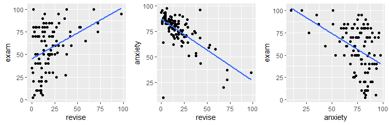


```{r, message=F, warning=F}
cor(exams$revise, exams$exam, method = "spearman")  

cor(exams$revise, exams$anxiety, method = "spearman") 

cor(exams$anxiety, exams$exam, method= "spearman") 
```

If we were interested in the correlation between revision time and exam performance controlling for anxiety, we would need to do a partial correlation. We can just use the `ppcor.test()` function:

```{r, message=F, warning=F}
pcor.test(x=exams$revise, y=exams$exam, z=exams$anxiety, method = "spearman")
```

Again, we see that the relationship between these two variables is reduced considerably to $\rho=0.13$ when we control for each of their relationships with anxiety.


<br>


## Point-Biserial Correlation

Throughout the entirety of this chapter we've been discussing various correlation measures between two continuous variables. This little subsection is here just to point out that you can in fact also measure the correlation between a categorical variable and a continuous variable. 

In the following dataset, we have data on the number of hours that various cats spend away from their house over a one week period. They are tracked via cool GPS collars, and these data make pretty pictures of how far they traveled from their homes.


```{r, message=F, warning=F}
cats <- read_csv("data/cats.csv")  

nrow(cats)

head(cats)

```

The data have a `time` column that is the number of hours away from home. A `sex` column which is the sex of the cat, and a `sex1` column which is the sex of the cat coded as a number. This final column exists to help us make the dotplot below and to help run a correlation:


```{r, message=F, warning=F}
# dot plot
ggplot(cats, aes(sex1,time)) + 
  geom_jitter(width = .05) +
  scale_x_continuous(breaks=c(0,1), labels=c("female", "male"))+
  stat_smooth(method='lm',se=F) +
  theme_classic()

```

What we have in this plot are individual points representing each cat. The points are jittered to make overlapping datapoints more readable. We have also put a trendline through the data. How was this achieved?   Essentially, all the  females are given the value 0, and all the males are given the value 1. We then run a Pearson's correlation using the `X` values to be 0 or 1, and the `Y` values to be the `time` measurement.

Doing this, we can simply run a Pearson's correlation test using `cor.test()`:

```{r, message=F, warning=F}
cor.test(cats$sex1, cats$time)
```

These results suggests that there is a positive relationship between cat sex and time spent away from home, with male cats spending more time away than female cats.


Looking at the dotplot again, it looks like the female data are possibly bimodal. As the data are in long format, we can filter out the male and female data:

```{r, message=F, warning=F}
catsF_time <- cats %>% filter(sex=="female") %>% .$time
catsM_time <- cats %>% filter(sex=="male") %>% .$time

shapiro.test(catsF_time)

shapiro.test(catsM_time)

```

Clearly our suspicions about the female data are true, they do not appear to come from an approximately normal distribution.  In that case, we could run a point-biserial Spearman correlation. This is just the same procedure, but instead we apply the Spearman test:


```{r, message=F, warning=F}
cor.test(cats$time, cats$sex1, method="spearman") 
```


Just as a note - there are probably 'better' ways of running such a point-biserial correlation than using `cor.test()`, but what we've shown here is probably sufficient to get the idea across that you can convert two groups to 0's and 1's and then run a correlation to test for group differences.

<!--chapter:end:11-Correlation.Rmd-->

# Linear Regression

With linear regression, we are attempting to further our understanding of the relationship between two continuous variables. In particular, we try to predict the values of the outcome variable based on the values of the predictor variable. In simple linear regression we only include one predictor variable. That is the type of regression that we will discuss in this chapter.


## Introduction to Linear Regression


The regression method that we are going to start with is called *Ordinary Least Squares Regression*. Hopefully the reason why it's called "least squares" will be come obvious, although we're not too sure why it's called "ordinary".


Let's illustrate the question at hand with some data:


```{r, warning=FALSE, message=FALSE}
library(tidyverse)


# Import Data

df <- read_csv("data/parenthood.csv")

nrow(df)

head(df)


```

As you can see, what we have are four columns of data. The first column shows the amount of sleep that Dan got in an evening. The second column relates to the amount of sleep a baby got. The third column is a rating of Dan's grumpiness.  The last column is a day identifier. Each row represents a different day.

Say we're interested in seeing whether there was an association between Dan's sleep and her grumpiness.  We could examine this using a scatterplot:


```{r, warning=FALSE, message=FALSE}
# Scatterplot
ggplot(df, aes(x = dan.sleep, y = dan.grump)) + 
  geom_point() + 
  stat_smooth(method='lm', se=F) 

```

It looks like these variables are clearly associated, with higher levels of sleep being related to lower levels of grumpiness.

To get a measure of how big this relationship is, we could run a correlation test. 


```{r, warning=FALSE, message=FALSE}
cor.test(df$dan.sleep, df$dan.grump)
```

This shows that the variables are highly correlated with r=-0.90.  It's also a highly significant relationship.


Using `stat_smooth()` we also applied a best fitting trendline through the data. This line was actually calculated to be in the position that it is in using regression.

The line also has the equation:

$y' = a + xb$

You may also see this written in other ways such as:

$y' = \beta_{0} + x\beta_{1}$

but we'll stick with 

$y' = a + xb$
	


## a and b	

In the equation for a regression line, 
	
$y' = a + xb$
	
$y'$ is equal to the predicted value of $y$. Essentially if you go from any value of $x$ and go up to the trendline, and then across to the y-axis, that is your predicted value of y.  The trendline represents the predicted values of $y$ for all values of $x$.

In regression terms, we often refer to $x$ as the **predictor** variable and $y$ as the **outcome** variable.

The value of $b$ in the equation represents the **slope** of the regression line. If it's a positive number then it means that the regression line is going upwards (akin to a positive correlation, where $y$ increases as $x$ increases.)  If it's a negative number, then it means that the regression line is going downwards (akin to a negative correlation, where $y$ decreases as $x$ increases).  The value of $b$ can also be considered to be how much $y$ changes for every 1 unit increase in $x$.  So a value of $b = -1.4$ would indicate that as $x$ increases by 1, $y$ will decrease by 1.4.

The value of $a$ represents the **y-intercept**. This is the value of `y'` that you would get if you extended the regression line to cross at $x=0$. 

We can illustrate that in the graph below. We extended the trendline (dotted black line) from its ends until it passes through where $x=0$ (the dotted red line). Where it crosses this point is at $y=125.96$ which is depicted by the orange dotted line.  This makes the y-intercept for this trendline equal to 125.96.

```{r, warning=FALSE, message=FALSE}
# Scatterplot
ggplot(df, aes(x = dan.sleep, y = dan.grump)) + 
  geom_point() + 
  stat_smooth(method='lm', se=F) +
  xlim(-1,10)+ 
  ylim(40,130)+
  geom_abline(intercept =125.956 , slope = -8.937, lty=2)+
  geom_vline(xintercept=0, color='red', lty=2) +
  geom_segment(x=-1.6,xend=0,y=125.96,yend=125.96, lty=2, color='orange')

```


In reality, we do not ever extend the regression lines like this. In fact, a regression line by definition only fits the range of datapoints along the x-axis that we have - it should not extend beyond those points.  This is more a theoretical construct to help us understand where the line is on the graph. 


To think a bit more about `a` and `b` let's compare these regression lines and their respective equations.


In the top left image, you can see three parallel regression lines. These all have the same slope value (b = 0.704).  How they differ is in their y-intercept. The different values of 'a' indicate that they are at different heights.  In the top right, we've extended the regression lines in red back to where the x-axis is 0. Where the lines cross here (x=0) is the value of each y-intercept i.e. 'a'.

In the bottom right image, you can see that all the plots have the same y-intercept value (8.32).  How they differ is in their slope b. Two are positive values of b, with the larger value having a steeper slope. The negative value of b (-0.622) has a slope going downwards. In the bottom right we extend these trendlines back to where x=0, and you can see that all have the same y-intercept (x=0, y=8.32).


<br>

### How to calculate a and b in R

To run a regression in R, we use the `lm()` function. It looks like the following:


```{r, warning=FALSE, message=FALSE}

mod1 <- lm(dan.grump ~ dan.sleep, data=df)  # build regression model

```

The first thing after the bracket is the outcome variable which is `dan.grump`. Then a tilde (~) and then the predictor variable which is `dan.sleep`.  Finally, we tell `lm` what dataset we're using.  The best way to read that statement is: `"dan.grump 'is predicted by' dan.sleep"`.

We're also saving the regression model as `mod1` because there's tons of information that comes along with the regression.

To have a look at what `a` and `b` are, we can just look at our saved object `mod1`.

```{r, warning=FALSE, message=FALSE}
mod1  

```

Here the value underneath "Intercept" (125.956) refers to the y-intercept `a`. The value underneath `dan.sleep`, the predictor variable, is our value of `b` the slope.

So this would mean that the regression line for these data would be:

$y' = 125.956 + -8.937b$


We can also get these values directly by running the following code:

```{r, warning=FALSE, message=FALSE}

mod1$coefficients

```


Now, we should also mention one other thing about these values. These regression coefficients are 'estimates'. We have one sample of 100 subjects from which we estimated the true population values of 'a' and 'b'. The true population values of 'a' and 'b' are parameters. 

<br>


### How to calculate a and b 'by hand'

To think a bit more about these 'a' and 'b' values, we could look at how these values are actually calculated.

First, we calculate 'b'. The formula for this requires knowing the sample standard deviation of the X and Y variables, as well as their Pearson correlation.

$\Large b = r\frac{s_{Y}}{s_{X}}$


So for our example, we'd calculate 'b' like this:

```{r}

r <-  cor(df$dan.sleep, df$dan.grump)

sy <- sd(df$dan.grump)

sx <- sd(df$dan.sleep)

b <- r * (sy/sx)

b

```


Next, we can calculate 'a' using the formula: $a = \overline{Y} - b\overline{X}$ . This requires us to know the sample mean of X and Y. 

So for our example, we calculate 'a' like this:

```{r}
my <- mean(df$dan.grump)

mx <- mean(df$dan.sleep)

a <- my - (b * mx)

a


```


Therefore, we have an equation for our trendline which is `y' = 125.96 + -8.94x`, which means that for every 1 unit increase of sleep, Dan's grumpiness decreases by 8.94.


## Residuals

Once we fit a trendline to the data it's clear that not all the datapoints fit to the line. In fact, almost none of the datapoints are on the line!  This is because the trendline is our prediction of the value of y based on the value of x.  Each datapoint actually is either larger or smaller in terms of y than the regression line. Sometimes it's a bit bigger or smaller, other times it might be a lot bigger or smaller. Occasionally, the predicted value of y might be on the regression line.

Because our trendline isn't a perfect fit for the data, the formula for the regression line could technically be written as:

$y' = a + bx + \epsilon$ 

$\epsilon$ refers to the error, or how far each datapoint is from the predicted value. 

In fact, the difference of each data point from the predicted value is called a **raw residual** or **ordinary residual**. We calculate the size of the residual for each datapoint by the following formula:

$residual = y - y'$

This essentially is the difference of each data point from the predicted value.


### How to calculate the residuals

Using our regression line equation of  `y' = 125.96 + -8.94x`, we can manually calculate the raw residuals. 

Firstly, we calculate the predicted values of y $y'$ for each value of $x$. We can put these back into our original dataframe.

```{r}
X <- df$dan.sleep  # the predictor
Y <- df$dan.grump  # the outcome

Y.pred <-  125.96   +   (-8.94 * X)

Y.pred

df$Y.pred <- Y.pred

head(df)

```


Next, getting the raw residual is simply a matter of taking each observed value of $y$ and subtracting the predicted value of $y$.


```{r}
# so to get the residual,  y - y'
df$dan.grump - Y.pred

df$residuals <- df$dan.grump - Y.pred

head(df)

```


### Visualizing the Residuals

Now we have a raw residual for all 100 datapoints in our data. The following plot is our same scatterplot, but this time we've also added a little red line connecting each observed datapoint to the regression line. The size of each of these red lines represents the residuals.


```{r}
p1 <- ggplot(df, aes(x = dan.sleep, y = dan.grump)) +
  geom_point() +
  geom_smooth(method = "lm", se = FALSE) +   
  geom_segment(aes(xend = dan.sleep, yend = dan.grump-residuals), alpha = .5, color='red') + 
  theme_classic() +
  ggtitle("OLSR best fit trendline")

p1
```


### Comparing our trendline to other trendlines

An important question to consider is why did we end up with our trendline and not some other trendline? The answer is that ours is the 'best fit', but what does that really mean? In short, it means that the best-fit regression line is the one that has the smallest squared residuals.  The squared residuals are calculated by squaring every residual and then summing these all up.

Let's look at this by looking at one possible trendline that we could have used. The one that we'll choose is a trendline that goes horizontally through the data with a y value that is the mean of Y. 

```{r}
mean(df$dan.grump)
```

So, the mean of the Y variable `dan.grump` is 63.71.  Let's put a trendline through our data that is horizontal at 63.71.  The equation for this line would be:

$y' = 63.71 + 0x$


Let's visualize this:

```{r}
ggplot(df, aes(x = dan.sleep, y = dan.grump)) + 
  geom_point() + 
  geom_hline(yintercept = mean(df$dan.grump), color='blue') 
```

It doesn't look like using the mean value of Y is that good a predictor of each datapoint. We could actually visualize how good.bad it is by calculating the residual of each datapoint from this new trendline.  This time each residual is equal to:

$residual = y - \overline{y}$


Let's calculate these residuals, and then graph them on this scatterplot:


```{r}
# we can work out what the 'residuals' would be for this trendline:
df$Ymean <- mean(df$dan.grump)
df$resid_Ymean <- df$dan.grump - df$Ymean  #residual from Ymean
head(df)


## visualize this:
p2 <- ggplot(df, aes(x = dan.sleep, y = dan.grump)) +
  geom_point() +
  geom_hline(yintercept = mean(df$dan.grump), color='blue') +
  geom_segment(aes(xend = dan.sleep, yend = dan.grump-resid_Ymean), alpha = .5, color='red') + 
  # geom_point(aes(y = dan.grump+residuals), shape = 1) +
  theme_classic() +
  ggtitle("Residuals to the mean Y")

p2

```


If we compare both graphs scatterplots side by side, it's pretty clear that our best-fit trendline is doing a much better job of predicting each datapoint's Y value. The horizontal trendline at the mean of Y looks pretty bad for the majority of datapoints - its residuals are much bigger.


```{r, warning=FALSE, message=FALSE}

library(gridExtra)
grid.arrange(p1,p2,nrow=1)

```


 In fact, let's actually quantify the difference in residuals between these two trendlines.
Because we have both positive and negative residuals, if we just added them together we'd end up with 0. In statistics, one common way to make numbers positive is to square them. As we saw with standard deviation, this also has the advantage of emphasizing large values.

What we do to compare our residuals, is to therefore square them.  We call the residuals from our trendline the raw residuals. We call the residuals from the horizontal line the total residuals.


```{r}
df$residuals2 <- df$residuals ^ 2               # raw residuals
df$resid_Ymean2 <- df$resid_Ymean ^ 2           # total residuals

head(df[c(1,3,6,8,9,10)]) # just showing the relevant columns

```

You can see the squared raw residual and squared total residual for the first six datapoints. Ideally, we want the raw residuals to be as small a fraction as possible of the total residuals. If we sum up the squared raw residuals and squared total residuals, we can determine this:

```{r}
SS.resid <- sum(df$residuals2)
SS.resid  #1838.722

SS.tot <- sum(df$resid_Ymean2)
SS.tot    #9998.59

```

As you can clearly see, the summed squared residuals for our best fit regression line are much smaller than the summed squared residuals when using the mean of y as the regression line.


### Coefficient of Determination R2

One way to make these summed squares of residuals numbers more interpretable is to convert them to $R^{2}$.

The logic goes as following. If the trendline is absolutely useless at predicting the y values, then the trendline would have residuals as high as the total residuals. If the trendline is perfect at predicting the y values, then the residual SS total would be 0.

If we look at the sum of the squares of the raw residuals as a ratio of a sum of the squared total residuals then we can work out how well our trendline fits.

We calculate this using the formula,

$R^{2} = 1 - \frac{SS_{raw}}{SS_{total}}$

in the following way:

```{r}
1 -  (SS.resid/SS.tot)   # 0.816   (this is R2)
```

So for our data, $R^{2} = 0.816$. This means that our regression model (and trendline) is a very good fit to the data.

$R^{2}$ ranges from 0 to 1. If its value was 1, then that would indicate that the best-fit trendline perfectly fits the data with no raw residuals. If its value was 0, then that would mean that the best-fit trendline is no better at fitting the data than the horizontal line at the mean of Y. Values of $R^{2}$ that get closer to 1 indicate that the model is doing a better job at estimating each value of Y. We say that the model has a better 'fit' to the data.


There is a way to directly get the value of $R^{2}$ in R. You may remember earlier in this chapter that we ran our linear model using the function `lm()`. We saved the output of this regression model as the object `mod1`.  You can use `summary()` to get lots of information about the regression model.

```{r}
summary(mod1)  # the R2 matches
```

The thing to focus on from this output right now, is the value called `Multiple R-squared`. This gives us the same value of $R^{2}$ that we calculated by hand: $R^{2}=0.816$.  The other value of $R^{2}$ is called `Adjusted R-squared`. This is relevant when you are conducting multiple regression with more than one predictor in the model. We only have one predictor in the model (`dan.sleep`) so we won't talk more about Adjusted R squared here.


Finally, there is a shortcut way in which we can calculate $R^{2}$. It is simply to square the Pearson's correlation coefficient:

$R^{2} = r^{2}$.

```{r}
r <- cor(df$dan.sleep, df$dan.grump)

r

r^2  # same R2 as above
```


## Standard Error of the Estimate

$R^{2}$ is one value that gives us a sense of how well our regression model is doing. Another method to assess 'model fit' is to examine the Standard Error of the Estimate. Unfortunately, this value has a number of names. You'll see it referred to as the Standard Error of the Regression, Residual Standard Error, Regression Standard Error, $S$, or $\sigma_{est}$. We prefer to call it the Standard Error of the Estimate or $\sigma_{est}$.

This is calculated as follows:

$\sigma_{est} = \sqrt{\frac{\Sigma (y - y')^{2}}{n-2}}$


The $\Sigma (y - y')^{2}$ part of this equation is the Sum of the raw residuals squared that we already calculated when calculating $R^{2}$.

We can therefore calculate $\sigma_{est}$ quite straightforwardly in R manually.

```{r}
s_est <- sqrt(SS.resid / 98) # n=100

s_est

```

Therefore $\sigma_{est} = 4.332$ for our model.

It's actually possible to see this value in the output of the summary of the model in R. Here, it's called the 'residual standard error':

```{r}
summary(mod1) 
```


### What to do with the Standard Error of the Estimate ?

What we are generally looking for with $\sigma_{est}$ is a number as small as possible.  This is because what essentially it is a measure of is an approximate estimate of the average raw residual. The question is, how small is small?  This is difficult to answer. One reason is because $\sigma_{est}$ is actually in the original units of the Y-axis (the outcome variable). Therefore it's not as simple as saying that it should be close to 0, because the Y-axis may be in units that are very large. In other ways, having this value in the original units of Y can be quite helpful as it is easy to envisage what the size of the average residual is.

However, a good rule of thumb is that approximately 95% of the observations (raw datapoints) should fall within plus or minus 2 times the standard error of the estimates from the regression line.  We can illustrate this with the following plot:

```{r, warning=FALSE, message=FALSE}
ggplot(df, aes(x = dan.sleep, y = dan.grump)) +
  geom_point() +
  geom_smooth(method = "lm", se = FALSE) +
  theme_classic() +
  geom_abline(intercept = 125.956+s_est+s_est, slope = -8.937, color = 'red', lty=2)+
  geom_abline(intercept = 125.956-s_est-s_est, slope = -8.937, color = 'red', lty=2) +
  ggtitle("Regression with 2 x Standard Error of the Estimate")

```


This is our original scatterplot again. The blue line is still the best fitting trendline. The two dashed red lines are two times  $\sigma_{est}$ above and below the blue line respectively. That is they are 2 * 4.332 = 8.644 units of grumpiness above or below the trendline.

If we count up the number of datapoints that our outside of the dotted red lines, we can see that there are six datapoints out of our 100 datapoints that are just outside, although some of these are very close indeed to the red line. This is probably ok as we're only expecting 95% of datapoints on average to be inside the red lines.


## Goodness of Fit Test - F-ratio

$R^{2}$ and  $\sigma_{est}$ are two calculations that help us determine if our regression model (and trendline) is indeed a good fit to the data. A more formal method is to run a statistical test called the Goodness of Fit Test. To do this we calculate an F-ratio that essentially examines how well our trendline (and model) fit the data compared to the null model which is the model where we use the mean of Y as our prediction.


As a reminder, these scatterplots show the difference in performance of our fitted model (left) compared to the null model (right).

```{r}
grid.arrange(p1,p2,nrow=1)
```


The F-ratio is essentially a method of determining the proportion of residual variance compared to total variance. We can calculate it using the following formula:


$F = \frac{SSM/d.f.SSM}{SSR/d.f.SSR}$

Here, SSM refers to the sum of squares for the model (the model sum of squares). This is equal to:

$SSM = SST - SSR$

That is, it's the difference between the total sum of squares (the sum of the squared residuals for the null model) minus the residual sum of squares (the sum of the squared residuals for the fitted model).

The `d.f.SSM` refers to the degrees of freedom for the model sum of squares, which is equal to the number of predictors in the model. We only have one predictor (`dan.sleep`), so that means the degrees of freedom are 1.

The `d.f.SSR` refers to the degrees of freedom for the raw residuals. This is equal to the number of observations minus the number of predictors minus 1. Therefore it is equal to 100 - 1 - 1 = 98 as we had 100 datapoints (or observations).

Let's calculate this in R. Firstly, we'll calculate the model sum of squares:

```{r}
SS.mod <- SS.tot - SS.resid
SS.mod  #8159.868
```


Next we divide the model sum of squares and the residual sum of squares by their respective degrees of freedom to get the mean sum of squares for each.  $F$ is then calculated by dividing the former by the latter:


```{r}
MS.resid <- SS.resid / 98
MS.resid  #18.76

MS.mod <- SS.mod / 1
MS.mod    #8159.868
 
Fval <-  MS.mod / MS.resid
Fval  #434.9

```

So $F = 434.9$ which is a large value. Larger values indicate that we were less likely to get a difference between the sum of squares for our fitted and null models by chance alone.

Essentially, the observed value of F is compared to the sampling distribution for  F if the null hypothesis is true. The null is that our model (trendline) is no better than random in fitting the datapoints

Whether our $F$ value is sufficiently large can be looked up in an F-table (not recommended), or you can simply let R do the work for you. If you use `summary()` on your saved regression model, it will give you the $F$ value as well as a p-value to go along with it.

```{r}
summary(mod1)
```


You can see from the model output that the F-statistic is given on the bottom row along with the degrees of freedom for the model (1) and the residuals (98). The p-value here is 0.0000000000000022 which is basically 0.  Typically, if the p-value is less than 0.05 we will say that our fitted model is a better fit to the data than the null model. 


## Assumptions of Linear Regression

Even if your model is a good fit to the data, there are still several things you need to check before progressing to examining whether your predictor is 'significantly' (a better term is probably 'meaningfully') predicting the outcome variable.  

The last series of things we need to do is to check whether we have violated the assumptions of linear regression.  In short, here are some of the assumptions that we need to adhere to:

1. Normality - Specifically the residuals are normally distributed.
2. Linearity - We need to be examining linear relationships between predictors and outcomes
3. Homogeneity of Variance (homoscedasticity)
4. Uncorrelated Predictors (only relevant if doing more than one predictor)
5. No overly influential datapoints

Let's discuss each of these in turn.


### Normality of Residuals

One assumption of linear regression is that our residuals are approximately normally distributed. We can check this in several ways.  But first, we should probably own up and mention that there are several types of residuals.  The residuals we have been dealing with from the regression model have been the **raw residuals**. We got these by simply subtracting the predicted value of y from the observed value of y $residual = y - y'$.  However, statisticians like to modify these residuals. One modification they make is to turn these residuals into what are called **standardized residuals**. These are the raw residuals divided by the standard deviation of the residuals. 

You can directly access the standardized residuals in R by using the `rstandard()` function with your model output:

```{r}
df$std_resids <- rstandard(mod1)

head(df[c(1,3,6,11)]) # just showing the relevant columns
```

We can demonstrate that the standardized residuals really are highly correlated with the raw residuals by plotting them on a scatterplot:

```{r}
ggplot(df, aes(x=residuals, y=std_resids)) +
  geom_point() +
  theme_classic()+
  xlab("Raw Residuals")+
  ylab("Standardized Residuals")

```

They are effectively the same - just transformed.  One advantage of standardized residuals is that they can help us look for unusual datapoints with large residuals. While raw residuals are always in the original units of the y-axis, standardized residuals are, well, standardized. Standardized residuals that are greater than 2 or less than -2 are quite large, those that are larger than 3 or less than 3 are very large indeed and should be looked at in more detail.

Let's get back to checking the normality of these residuals.

First up, we could plot a histogram and see if we think it's approximately normal:

```{r, warning=FALSE, message=FALSE}
#a) histogram plot
ggplot(df, aes(x=std_resids)) + geom_histogram(color='white') # possibly ok
```

This looks possibly ok.  It's not **too** skewed, but it can be hard from a histogram with just 100 datapoints to get a sense of the shape.  A second approach would be to use a Shapiro-Wilk test which more formally test whether the data are approximately normally distributed:

```{r}
#b) Shapiro-Wilk test
shapiro.test(df$std_resids)  # shapiro test says normal.
```

Given that the p-value here is above our cut-off of 0.05, this suggests that we have no evidence to reject the hypothesis that our data came from a normal distribution. An easier way of saying this is, our residuals are likely approximately normally distributed.

The other method we can employ to check normality is to use a QQ plot:

```{r}
#c) QQ plot
qqnorm(df$std_resids)
qqline(df$std_resids, col = "steelblue", lwd = 2)  # it's ok

```

A discussion of precisely what these QQ plots are is beyond the scope here. However, in general terms, what we are plotting is the residual against the theoretical value of each residual that we would expect if our data were normally distributed. In practical terms, what we're looking for is that the bulk of our data fit along the blue line. It's ok to have a bit of wobble at the extremes - that just means that our data distribution probably has slightly fat tails.

It's also possible to generate a version of the above plot quickly, directly from the saved linear model object.

```{r}
plot( x = mod1, which = 2 )  # fast way of getting same plot
```


### 2. Linearity ---

The second major assumption of linear regression is that the relationship between our predictor and outcome is linear! So, data that look like the following would not have a linear relationship.


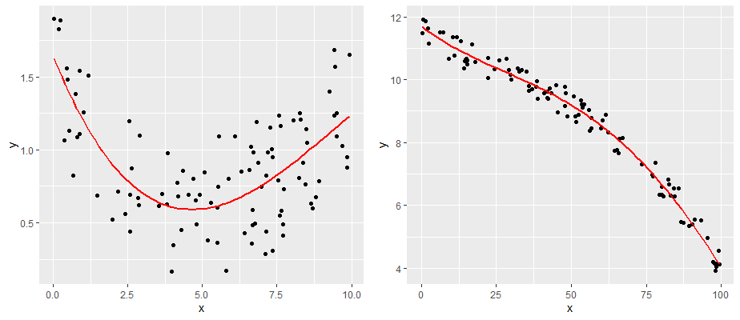


One simple approach is to examine the scatterplot of your predictor (X) and outcome (Y) variables. We already did this, and our data looked pretty linear!  Another approach is to examine the relationship between your observed Y values and the predicted Y values $y'$. This should also be a linear relationship.

Although we calculated the $y'$ values earlier using the formula for the regression line, we can actually grab them directly from the model object with the `fitted.values()` command.  

```{r, warning=FALSE, message=FALSE}
df$Y.fitted <- fitted.values(mod1)

# plot this relationship
ggplot(df, aes(x = Y.fitted, y = dan.grump)) + 
  geom_point() + 
  stat_smooth(method='lm', se=F) 

```


As you can see from this plot, our fitted (predicted) values of Y on the x-axis have a strong linear relationship with our observed values of Y on the y-axis.


### 3. Homogeneity of Variance / Homoscedasticity

The third assumption that we need to check is homoscedasticity (also sometimes referred to as homogeneity of variance).  

What this really means is that the model should be equally good at predicting Y's across all values of X. Our regression model shouldn't be better at predicting values of Y for e.g. small values of X but not for large values of X.

Practically, what this means, is that the size of the residuals should be equal across all values of X.

If we plot the values of X (or the predicted/fitted values of Y) on the x-axis against the residuals (in this case standardized residuals) on the Y-axis, then there should be no overall pattern. We should be equally likely to get small or large residuals for any value of X (or predicted/fitted value of Y). This would mean that any trendline on this graph should be a horizontal line.

```{r, warning=FALSE, message=FALSE}

# if true, this should be a straight line
ggplot(df, aes(x = Y.fitted, y = std_resids)) + 
  geom_point() + 
  stat_smooth(method='lm', se=F) 

```


As you can see, our plot is basically a random scatterplot and there is no overall pattern. That is good, it means we have homoscedasticity.  If we did not have homoscedasticity, then we'd see a pattern in this scatterplot - such as the residuals getting larger or smaller for larger fitted (predicted) values of Y.


You can access a version of this plot directly from the model object like this:

```{r}
plot(mod1, which = 3)
```


There are some more formal tests of homoscedasticity but we don't need to worry about them.


### No Colinearity

This assumption of linear regression only applies when we have more than one predictor in the model. In our model, we do only have one predictor (`dan.sleep`) so we don't need to worry about it. If we had added in another variable into the model, e.g. the amount of hours of baby sleep, then we'd have a second predictor. That means, we're trying to predict `dan.grump` based on both `dan.sleep` and `baby.sleep`.  In this case, `dan.sleep` and `baby.sleep` should not be correlated with each other.


### Unusual Datapoints

There are a number of ways that datapoints could be unusual. We will discuss data points that are:

 i. outliers
 ii. have high leverage
 iii. have high influence

 Generally linear regression models should not be overly affected by individual data points. Usually the category that we most need to be concerned about are points with high influence.
 
 


####  i. Outliers


Outliers are datapoints that are typically highly unusual in terms of outcome Y but not in terms of the predictor X. These will be datapoints that have high residuals.

Let's look at an example dataset. We have a predictor 'x' and an outcome 'y'. With 'y1' we have the same outcome variables, but have removed the value for one datapoint:


```{r, warning=FALSE, message=FALSE}
x <- c(4.1,4.2,5,5.5,6,6.1,6.15,6.4,7,7.2,7.7,8,9.7)
y <- c(3.9,4.3,6,5.9,6.1,11.9,6.3,5.8,7.9,6.4,7.8,8,9.1)
y1 <- c(3.9,4.3,6,5.9,6.1,NA,6.3,5.8,7.9,6.4,7.8,8,9.1)

ddf <- data.frame(x,y,y1)
ddf

```


And here, we're plotting the best fitting regression line in blue. The dotted red line represents the best fitting trendline that we would have if we removed the datapoints that has the y value of 11.9.  The dashed black line shows the distance from this datapoint to the trendline we would have if it was removed. 


```{r, echo=FALSE, warning=FALSE, message=FALSE}
mod.out <- lm(y~x, data = ddf)
mod.out1 <- lm(y1~x, data = ddf)

coms <- coefficients(mod.out1)
coms

x6y <- coms[1] + (x[6]*coms[2]) # to get the predicted value for x=6.1


ggplot(ddf, aes(x = x, y = y)) + 
  geom_point(size=2) +
  stat_smooth(method="lm",se=F) +
  theme_classic() +
  geom_abline(intercept = coms[1], slope = coms[2], color = 'red', lty=2)+
  geom_segment(aes(x = x[6], y = y[6], xend = x[6], yend = x6y), lty=2, alpha=.4)
```

As you can see from this small example, outliers are datapoints that have very large residuals from the trendline. They have an unusually large Y.  Notice though that the slope of the trendline hasn't change too much at all. It is slightly shifted down after you remove that outlier from the calculations, but overall the coefficient of 'b' is similar to before. This type of outlier is not necessarily a big deal.


####  ii. High Leverage

Datapoints that have high leverage are those that have a high influence on the regression line's trajectory, but don't necessarily affect the angle of the slope. They are typically unusual in terms of their X value, but not necessarily in terms of Y, meaning that they don't have to have a high residual.

We can measure the leverage of datapoints using the function `hatvalues()` on the model object. For the scatterplot above, the hat values of each datapoint can be calculated as follows:

```{r}

mod.out <- lm(y~x, data = ddf)

ddf$hat_val <- hatvalues(mod.out)  

ddf
```

As you can see, the 6th datapoint was the outlier but it does not have a large leverage as it's not overly influencing the trajectory of the regression line. Datapoint 13 on the other hand does have a higher leverage. Roughly speaking, a large hatvalue is one which is 2-3 times the average hat value. We can check the mean of the hat values like this:


```{r}
mean(hatvalues(mod.out))

```

So clearly, the 13th datapoint does have a high leverage.


#### iii. High Influence

The third type of unusual datapoint are ones that you need to be most wary of. These are datapoints that have high influence. Essentially a high influence datapoint is a high leverage datapoint that is also an outlier.


Let's look at these example data. We are looking at a predictor variable 'x' against an outcome variable 'y2'. 'y3' is the same data as 'y2' with one datapoint's value removed.

```{r}

x <- c(4.1,4.2,5,5.5,6,6.15,6.4,7,7.2,7.7,8,9.7)
y2 <- c(3.9,4.3,6,5.9,6.1,6.3,5.8,7.9,6.4,7.8,8,6.1)
y3 <- c(3.9,4.3,6,5.9,6.1,6.3,5.8,7.9,6.4,7.8,8,NA)

ddf1 <- data.frame(x,y2,y3)
ddf1
```

Let's plot these data - I'm sparing you the code for this plot:

```{r, echo=FALSE, warning=FALSE,  message=FALSE}
mod.out2 <- lm(y2~x, data = ddf1)
mod.out3 <- lm(y3~x, data = ddf1)
coms3 <- coefficients(mod.out3)
x13y <- coms3[1] + (x[13]*coms3[2]) # to get the predicted value for x=9.7

#scatterplot

ggplot(ddf1, aes(x = x, y = y2)) + 
  geom_point(size=2) +
  stat_smooth(method="lm",se=F) +
  theme_classic() +
  geom_abline(intercept = coms3[1], slope = coms3[2], color = 'red', lty=2)+
  geom_segment(aes(x = x[13], y = y2[13], xend = x[13], yend = x13y), lty=2, alpha=.4)

```

What you can see here is the scatterplot of 'x' against 'y2'.  The blue trendline is the best fit line to the regression of 'x' against 'y2'.  The red dotted line is the regression line when we remove the datapoint at x=9.7.  This datapoint has both high leverage and is an outlier (has an overly large residual).  As a consequence of this, when you remove this datapoint it significantly shifts the angle of the slope of the regression line. That means that the value of `b` changes quite considerably.

Let's add the hat values (measuring leverage) to the data.  We can also add what is called `Cook's Distance` which is a measure of the **influence** of each datapoint.

```{r}
mod.out2 <- lm(y2~x, data = ddf1)

ddf1$hat_val <- hatvalues(mod.out2) 
ddf1$cooks_d <-cooks.distance(mod.out2)

ddf1

```


As you can see, datapoint 12 (x=9.7) has high leverage and it's also an outlier. Consequently it has a very large Cook's Distance. Typically a Cook's distance > 1 requires more consideration about how to proceed with your model.

You can also quickly get a plot of the Cook's Distances of all datapoints from a regression model like this:

```{r}
plot(mod.out2, which = 4)
```


#### Checking Influence:

Let's look for influential datapoints in our Sleep vs Grumpiness Data.  At the beginning of this section, we saved the linear model as `mod`. We can look at the Cook's Distances with the `cooks.distance()` function, or we could just plot them:

```{r}
plot(mod1, which = 4)
```


This plot shows each of our 100 datapoints in the order they appear in the original dataframe along the x-axis. Clearly, looking at the y-axis, all our datapoints have Cook's distances of far below 1, so we are fine to assume that we have no overly influential datapoints.


## Examining individual predictor estimates

After checking if our model is a good fit and making sure that we did not violate any of the assumptions of the linear regression, we can finally move forward with what we came here to do. That is, we can check whether our predictor is meaningfully useful in predicting our outcome variable. This means, is our observed value of `b` sufficiently different from 0? To do this, we use two strategies. First, we can generate a 95% confidence interval around our estimate of `b`. That is the method that we prefer. Secondly, you can run a significance test.


### 95% confidence interval of 'b'.

First, let's do this the easy way. Then we'll work out how we got the 95% confidence interval.  You can simply find this by running the `confint()` function on our regression model object:

```{r}
# easy way - gives us the confidence interval:
coefficients(mod1)

confint(object = mod1, level = .95)
```

This tells us that the lower bound of the 95% confidence interval of `b` is -9.79, and the upper bound is -8.09, with our estimate of `b` being -8.94.  This means that if we were to sample 100 days randomly over and over again and measure Dan's sleep and grumpiness on these days, in 95% of the samples we collect we would have the true population parameter value of `b`.  In lay terms, we can suggest that there is  approximately a 95% likelihood that this true population value of `b` is between -9.79 and -8.09.  The only way to really get the true population value would have been to measure Dan's sleep and grumpiness for every day that Dan has been alive.

In big picture terms, what we can draw from this 95% confidence interval is that the relationship between sleep and grumpiness is highly negative and clearly strong. There really seems to be close to no chance that 0 could be the value of `b` - it is not inside the confidence interval.  In fact, we could generate a ridiculously confidence confidence interval, such as a 99.9999% confidence interval:

```{r}
confint(object = mod1, level = .999999)
```

... and 0 is still nowhere near being included.


How is this 95% confidence interval calculated?  To do this we need to think about those sampling distributions again, and the standard error of `b`.


### Standard Error of b

As we've discussed earlier, our one single estimate of `b` is just one possible estimate. We estimated this value based on our one single sample of 100 days.  However, if we had sampled a different sample of 100 days, we would have got a slightly (or maybe greatly) different estimate of `b`.  If we repeated this procedure thousands of times, then we'd have a sampling distribution of `b`'s. 

This sampling distribution will be t-distribution shaped and has degrees of freedom = number of observations - the number of predictors (1) - 1.  Therefore it is t-distribution shaped with d.f.=98.  If we know the standard deviation of this sampling distribution (which is known as the standard error of `b` - $s_{b}$), then we can create confidence intervals.

However, it turns out that calculating $s_{b}$ is a bit annoying. Fortunately, there is a quick way to find it out by looking at the summary of the model output:

```{r}
summary(mod1)
```

We can see here that $s_{b} = 0.4285$


If you're interested, then this is the formula to calculate $s_{b}$:

$s_{b} = \frac{\sigma_{est}}{\sqrt{\Sigma (x - \overline{x})}}$ 

Here's how we calculate it by hand according to this formula:


```{r}
x_dif <- df$dan.sleep - mean(df$dan.sleep) # difference of each x from mean of x

ssx <- sqrt(sum(x_dif^2))  # square root of the sum of these differences squared

sb <- s_est/ssx  #s_est was calculated earlier

sb   # this is the standard error of b
```


### Calculating 95% confidence interval of 'b' by hand

We can use the following formula to calculate the 95% CI for `b`:

$CI_{95}  = b +/-  t * s_{b}$

As with all confidence intervals, what we do is to presume that our estimate of `b` is the mean of the sampling distribution. Then knowing that the distribution is t-shaped with d.f.=98, we need to find the value of `t` that will leave 2.5% of the distribution in each tail.  We can look that up in R using `qt`:

```{r}
tval <- qt(.975, df = 98)
tval
```

We've now calculated everything we need to for the Confidence Interval

```{r}
b + (tval * sb)  #upper bound

b - (tval * sb) # lower bound
```

As we can see, these match up with the output when using `confint()`:

```{r}
confint(mod1)
```


### Signifcance Testing b

We can also use this sampling distribution to apply a significance test.  Our null hypothesis will be that the population value of `b` is 0. Our alternative hypothesis will be that `b` is not equal to 0.

<br>
$H_{0}: b=0$ 
<br>
$H_{1}: b\neq0$
<br>

Given we know the standard deviation of this sampling distribution, $s_{b}$, we can calculate how far away our observed sample value of $b$ is in terms of how many standard deviations from the mean of 0 it is.  We call this value a t-statistic and it is calculated like this: 

$t = \frac{b}{s_{b}}$

Once we have calculated our t-statistic, then we can determine given the shape of the distribution and the degrees of freedom, what proportion of the distribution is more extreme than our observed value.


```{r}
tobs <- b/sb
tobs  #-20.854

```

Our observed value is therefore $t = -20.854$.


Let's look at this graphically:


This shows the t-distribution for d.f. = 98. It looks very strange because we've extended the axes to -21 and +21. We did this so that we could include a dotted blue line for our observed t-value of -20.854.  Notice that by the time the t-distribution of d.f.=98 gets to close to a value of t=-3  then there is almost nothing left in the tail of the distribution.

Just for completeness, we can calculate what proportion of times we observe a t-value of more extreme (i.e. less than) -20.854 using `pt()`.


```{r}
pt(-20.854, df=98)
```

This essentially gives us a one-tailed p-value of p = 0.00000000000000000000000000000000000004094577, which is very small. To get a 2-tailed p-value we just double this value.

Essentially what we can conclude here is that our one value of `b` is extremely unlikely to have come from a population where `b=0`, and thus we reject our null hypothesis and accept the alternative.


The preceding information was provided to help you think about what's really going on when we calculate the t-statistic. However, it turns out there is actually a shortcut way of calculating `t` using `n` and the Pearson's correlation coefficient `r`.  

It's the following formula:

$t = \frac{r \times \sqrt{n-2}}{\sqrt{1 - r^{2}}}$


```{r}
r <- cor(df$dan.sleep, df$dan.grump)

n <- nrow(df)

(r * sqrt(n-2)) / (sqrt(1-r^2))  # -20.85

```

As you can see from the above code - it works!


<!--chapter:end:12-Regression.Rmd-->

# Permutation Testing

Permutation tests are a type of randomization test. The theoretical difference between permutation tests and inferential tests is that with permutation tests we build the sampling distribution from the observed data, rather than inferring or assuming that a sampling distribution exist.

In practice, what a permutation test does is to take your observed data and then shuffle (or permute) part of it. After each shuffle, some aspect of the data is recalculated. That could be for instance the correlation coefficient, or it could be a difference in means between two groups. The data then get randomly reshuffled again, and the test-statistic is recalculated again. This goes on for thousands of times - for as many shuffles are deemed acceptable. This is usually a minimum of 1,000 but typically at least 10,000 shuffles are done.  After all the permutations (shuffles) are performed, a distribution of the statistic of interest is generated from the permutations. This is compared to the original observed statistics (e.g. correlation coefficient, difference in group means) to see if the observed value is unusually large compared to the permuted data.

If this seems a little confusing, hopefully seeing it in action will help...


## t-test Permutation


Let's look at our two independent samples of exam scores:

```{r}
library(tidyverse)

anastasia <- c(65, 74, 73, 83, 76, 65, 86, 70, 80, 55, 78, 78, 90, 77, 68)
bernadette <- c(72, 66, 71, 66, 76, 69, 79, 73, 62, 69, 68, 60, 73, 68, 67, 74, 56, 74)

# put into a dataframe:
dd <- data.frame(values = c(anastasia, bernadette),
                 group = c(rep("Anastasia",15), rep("Bernadette", 18))
)

dd

```


We can plot these data as boxplots to get a sense of the within group variation as well as the observed differences between the groups:

```{r}
ggplot(dd, aes(x = group, y = values, fill = group)) +
  geom_boxplot(alpha=.3, outlier.shape = NA) +
  geom_jitter(width=.1, size=2) +
  theme_classic() +
  scale_fill_manual(values = c("firebrick", "dodgerblue"))

```


Now, from our two independent samples, we can directly observe what the difference in sample means is. This is just calculated by subtracting one sample mean from the other:


```{r}
meandif <- mean(anastasia)  - mean(bernadette)   # 5.48
meandif

```

So, from our samples, we observed a difference in grades of 5.48 between the groups. Typically, we would run an independent t-test to test whether these two samples came from theoretical populations that differ in their means: 

```{r}

t.test(anastasia, bernadette, var.equal = T)
```

This Student's t-test (notice `var.equal=T`) suggests that this is a significant difference, meaning that the groups do differ in their population means.

However, this test relies on several assumptions (see section \@ref(assumptions-of-the-independent-t-test)).  Instead, we could apply a permutation test that is free of assumptions.


Essentially what we are going to do is ask how surprising it was to get a difference of 5.48 given our real data.  Put another way, if we shuffled the data into different groups of 15 and 18 (the respective sample sizes of Anastasia and Bernadette), would we get a difference in sample means of greater or lower than 5.48?  If we did this thousands of times, how many times would we get differences in sample means above 5.48?


Let's apply this theory to just one permutation.

First, we combine all the data:

```{r}

set.seed(1) # just to keep the random number generator the same for all of us

allscores <- c(anastasia, bernadette)

allscores
```


Next, we shuffle them into new groups of 15 and 18.:


```{r}

x <- split(sample(allscores), rep(1:2, c(15,18))) 

x

```


We have two brand new samples that contain all of the scores from our original data, but they've just been shuffled around.  We could look at what the difference in sample means is between these two new samples:

```{r}

x[[1]] # this is our shuffled sample of size 15
x[[2]] # this is our shuffled sample of size 18

mean(x[[1]])  # mean of the new sample of size 15
mean(x[[2]])  # mean of the new sample of size 18


# what's the difference in their means?
mean(x[[1]]) - mean(x[[2]]) 

```

The difference in sample means is 1.81, which is a lot smaller than our original difference in sample means.

Let's do this same process 10,000 times!  Don't worry too much about the details of the code. What we are doing is the above process, just putting it in a loop and asking it to do it 10,000 times. We save all the results in an object called `results`.

```{r}
results<-vector('list',10000)
for(i in 1:10000){
  x <- split(sample(allscores), rep(1:2, c(15,18)))
  results[[i]]<-mean(x[[1]]) - mean(x[[2]])  
}

head(unlist(results)) # these are all our mean differences from 10,000 shuffles of the data. We're just looking at the first 6.

```


We can actually make a histogram showing the distribution of these differences in sample means.

```{r}
df <- data.frame(difs = unlist(results))

ggplot(df, aes(x=difs)) +
  geom_histogram(color="black", fill="green", alpha=.4) +
  geom_vline(color="navy",lwd=1,lty=2,xintercept = 5.48) +
  theme_classic()+
  ggtitle("Mean Differences from \n 10000 Permutations of Raw Data")

```


This histogram shows that for some of our 10,000 shuffles, we actually got some differences between our two samples of higher than 5.48 (the dotted  blue line), but the vast majority of shuffles led to samples that had mean differences lower than 5.48. In fact, several shuffles led to samples where the sample of size 18 (Bernadette in the original data) had a sample mean that was higher than the sample of size 15 (Anastasia in the original data).

We can directly calculate how many times out of 10,000 shuffles we got a difference in sample means that was greater than 5.48

```{r}
sum(unlist(results) > 5.48)  # 202 times out of 10000
```

To convert this to a p-value, we simply divide this value by the number of shuffles we ran - which was 10,000.

```{r}
sum(unlist(results) > 5.48) /10000  # which is 0.0202 proportion of the time
```

So our p-value is `p=0.0215` which is similar to a one-tailed p-value.  If we wished to have a 2-tailed p-value we would simply multiply this value by 2:


```{r}
# 2-tailed value
2 * (sum(unlist(results) > 5.48) /10000)
```


**Example 2:**

Let's take a look at a second example.  Here, we have various subjects rating their anxiety levels. They do this after either taking a new anxiolytic drug or a placebo. The subjects in each group are independent of each other.  The placebo group has 19 subjects and the drug group has 21 subjects.

The data:


```{r}
placebo <- c(15, 16, 19, 19, 17, 20, 18, 14, 18, 20, 20, 20, 13, 11, 16, 19, 19, 16, 10) 
drug <- c(15, 15, 16, 13, 11, 19, 17, 17, 11, 14, 10, 18, 19, 14, 13, 16, 16, 17, 14, 10, 14)


length(placebo) #19
length(drug)  #21

```


If we were interested in doing a Student's t-test, we might want to check whether the data are approximately normal. We could perform Shapiro-Wilk tests to do this:


```{r}

shapiro.test(drug)    # approximately normal as p>.05
shapiro.test(placebo) # not enough evidence to be normal as p<.05

```


From this we find that the placebo group is not approximately normally distributed (p value of the Shapiro-Wilk test is <.05).  We could do a non-parametric test such as Wilcoxon Ranked Sum test (see xxx.xxx), but an alternative strategy is to perform a permutation test.

Let's first plot the data, and then look at our observed difference in anxiety scores between our two independent samples:

```{r}
# put into dataframe - long format
ddf <- data.frame(anxiety = c(placebo, drug),
                 group = c(rep("placebo", length(placebo)), 
                           rep("drug", length(drug))
                 )
)

head(ddf)

#boxplots
ggplot(ddf, aes(x=group, y=anxiety, fill=group)) + 
  geom_boxplot(outlier.shape = NA, alpha=.4) +
  geom_jitter(width=.1) +
  theme_classic() +
  scale_fill_manual(values=c("orange", "brown"))


mean(placebo) - mean(drug) #2.128

```


So our observed difference in sample means is 2.128.  In the permutation test, what we'll do is shuffle all the scores randomly between the two groups, creating new samples of the same size (19 and 21).  Then we'll see what difference in sample means we get from those shuffled groups. We'll also do this 10,000 times.


```{r}

allvalues <- c(placebo, drug)

results<-vector('list',10000)
for(i in 1:10000){
  x <- split(sample(allvalues), rep(1:2, c(19,21)))
  results[[i]]<-mean(x[[1]]) - mean(x[[2]])  
}

head(unlist(results)) # these are the first six of all our mean differences from 10,000 shuffles of the data.
```


Let's plot the distribution of these data to see what proportion of times our shuffled groups got samples that were greater than 2.128.

```{r}

df0 <- data.frame(difs = unlist(results))

ggplot(df0, aes(x=difs)) +
  geom_histogram(color="black", fill="pink", alpha=.4) +
  geom_vline(color="navy",lwd=1,lty=2,xintercept = 2.128) +
  theme_classic()+
  ggtitle("Mean Differences from \n 10000 Permutations of Raw Data")

```

It looks like very few times did we get two samples that had differences in sample means that were greater than 2.128.  We can calculate exactly how many times, and express this as the proportion of times we got a difference in sample means greater than 2.128:

```{r}
sum(unlist(results) > 2.128)  # 109 times out of 10000

sum(unlist(results) > 2.128) /10000  # which is 0.0109 proportion of the time

```

So, in this case we can say that the probability of getting a difference in sample means between the drug and placebo groups that was larger than our observed difference of 2.128 was `p = 0.0109`. This is very strong evidence that the observed difference is significantly greater than we'd expect by chance.


## Correlation Coefficient Permutation Tests

You can apply the logic of permutation tests to almost any statistical test.  Let's look at an example for Pearson correlations.


In these data, we are looking at 15 subjects who are completing a task. We measured the time they spent on the task and their high scores.  

```{r}

library(tidyverse)

df <-  read_csv("data/timescore.csv")

head(df)

```

If we make a scatterplot of the data, we can see that those who spent longer on the task tended to get higher scores:

```{r}
# scatterplot
ggplot(df, aes(x = time, y = score)) + 
  geom_point() +
  stat_smooth(method = "lm", se=F)
 
```

Using a standard approach, we could find the correlation of these two variables and run a significance test using `cor.test()`.  We can see that there is a moderate Pearson's r of `r=0.55` which is statistically significant (p=0.031).

```{r}
# regular significance test
cor.test(df$time,df$score) #r=0.55, p=0.031
```


We could take an alternative tack, and decide to do a permutation test. The idea here is again, how surprising is it to get a correlation of 0.55 with these data?  Were there other ways of ordering the `x` and `y` variables to get higher correlation coefficients?

Let's look at our `y` axis variable, the `score`:

```{r}
set.seed(1) # just doing this so all our results look same

df$score  # actual data in order

```

This is the original order of the data.  If we use `sample()` we can shuffle the data:

```{r}
sample(df$score)  # actual data but order shuffled
```

Let's shuffle the score again, but this time store it in the original dataframe:

```{r}
df$shuffle1 <- sample(df$score) #create a new column with shuffled data

df
```


If we plot this shuffled `y` (score) against the original `x` (time), we now get this scatterplot, which basically shows no relationship:

```{r}
# this is what that new column looks like:
ggplot(df, aes(x = time, y = shuffle1)) + 
  geom_point() +
  stat_smooth(method = "lm", se=F)

```

And the correlation for this new scatterplot is really close to 0! r = 0.0005:

```{r}
cor.test(df$time, df$shuffle1) # now relationship is a bit negative

```


We could shuffle the score variable even more times, and directly calculate the `r` value against the time variable for each shuffle using `cor()`.

```{r}
# we can do this many times
cor(df$time, sample(df$score))
cor(df$time, sample(df$score)) 
cor(df$time, sample(df$score)) 
cor(df$time, sample(df$score)) 


```

As you can see, the more shuffles we do, we get varied values of `r`.  What we really should do is perform 10,000 (or another really high number) shuffles of the score variable and re-calculate `r` against the time variable for all 10,000 of these shuffles.  Don't worry about the code below, but that's exactly what we're doing.  We're saving the `r` values from the 10,000 shuffles in the object called `results`.

```{r}

results <- vector('list',10000)
for(i in 1:10000){
  results[[i]] <- cor(df$time, sample(df$score))
}

head(unlist(results)) # this are the correlations for the first 6 of  10,000 shuffles

```


We can plot the results in a histogram, and also put a vertical line at 0.56 which was our original observed correlation between time and score from the raw unshuffled data.


```{r}
results.df <- data.frame(x = unlist(results))

ggplot(results.df, aes(x)) + 
  geom_histogram(color="darkgreen",fill="lightseagreen") +
  geom_vline(xintercept = 0.56, lwd=1, lty=2) +
  xlab("r") 

```

As you can see, there were a few shuffles (or permutations) that we got an `r` value of greater than 0.56, but not that many.  In fact, we can directly calculate how many:


```{r}
sum(unlist(results) > 0.56) #163 were greater.
```

It turns out that 163 times out of 10,000 shuffles we got a `r` value of greater than 0.56.  WE could calculate this as a proportion by dividing by 10,000:

```{r}
sum(unlist(results) > 0.56)  / 10000  #0.0163

```

We can use this value as our p-value. Because it is relatively low, we could argue that we were very unlikely by chance alone to have got a `r` value of 0.56 from our data. This suggests that the correlation between time and score is significant.

The advantages of running a permutation test is that it is free of the assumptions of normality for the Pearson's r correlation significance test.  It's also a cool method, and pretty intuitive.


## Permutation test for a Paired t-test

We can apply the same principle of permutation to the paired t-test. Remember, essentially the paired t-test is focused on performing a one-sample t-test on the difference in scores between the paired data - testing whether the mean of the differences could potentially come from a population with $\mu=0$.

Let's look at the following data that record scores for the same individual over two time points - 'before' and 'after'.


```{r, message=FALSE}

# take a look at these before and after scores

ba <- read_csv("data/beforeafter1.csv")

head(ba)
```


We could plot these data using a scatterplot to examine the overall trend of how scores change from before to after:

```{r}
# make a scatterplot with the x being 'before' and y being 'after'
ggplot(ba, aes(x=before, y=after)) +
  geom_point() +
  theme_classic()+
  geom_abline(intercept =0 , slope = 1) +
  xlim(2,8)+
  ylim(2,8)

```

As most of these points are below the diagonal line, this seems to suggest that the scores for the 'before' data seem to be lower on the whole than the scores for the 'above' data.

Typically, we would run a paired t-test with such data to examine if there was a difference:

```{r}
t.test(ba$before, ba$after, paired=T)
```

This suggests that there is a significant difference `p<.05` with the 95% confidence interval of the true difference in means being between 0.13 and 1.47. However, the paired t-test assumes that the data are from an approximately normal distribution. In particular, that the differences scores (the difference between the 'before' and 'after' scores for each individual) are normally distributed.  We can check that using a Shapiro-Wilk test:


```{r}
# create a difference column for the difference between before and after
ba$difference <- ba$before - ba$after

# run a Shapiro test on the difference column
shapiro.test(ba$difference)
```

With the p-value here being `p<.05`, this suggests that our data are not normally distributed. One option would be to do a non-parametric Wilcoxon-signed rank test (see section \@ref(non-parametric-alternatives-to-the-two-sample-t-tests)). Alternatively, we could do a permutation test.


Let's look at our data again, and focus on the difference column. 


```{r}
ba
```

Our observed mean for the differences scores is 0.8.

```{r}
mean(ba$difference)
```

How likely were we to get this mean difference if our 'before' and 'after' conditions were randomized?  For example, for individual 'mj', their before score was 6.6 and after was 3.9 leading to a difference of 2.7. But what if their before and after were switched?  Then the difference score would be -2.7.  What we would like to do, is to randomly flip the before and after columns for each individual and recalculate the difference scores. Each time we do this, we will calculate the mean of the difference scores.  A programmatic shortcut to doing this is to multiple each difference score randomly by either +1 or -1. Here is the first shuffle we could perform:

```{r}
set.seed(1)
shuffle1 <- ba$difference * sample(c(-1,1), 11, replace = T)
shuffle1
mean(shuffle1)
```

In this example, the 'before' and 'after' scores were randomly flipped for individuals 'mc', 'ma', 'mj' and 'kb'.  Let's do a second shuffle:


```{r}
shuffle2 <- ba$difference * sample(c(-1,1), 11, replace = T)
shuffle2
mean(shuffle2)
```
In this example, the 'before' and 'after' scores were randomly flipped for individuals 'mc', 'co', 'kj', 'oe', 'mb', 'dg' and 'mj'.  In both shuffles the mean of the difference scores was less than our observed mean of 0.8.  

We can put this into a loop to do it 10,000 times:

```{r}
results <- vector('list',10000)
for(i in 1:10000){
results[[i]] <-  mean(ba$difference * sample(c(-1,1), 11, replace = T))
}
```

And we can plot these results as a histogram:

```{r}

df1 <- data.frame(difs = unlist(results))

ggplot(df1, aes(x=difs)) +
  geom_histogram(color="black", fill="pink", alpha=.4, binwidth = .05) +
  geom_vline(color="navy",lwd=1,lty=2,xintercept = .8) +
  theme_classic()+
  ggtitle("Mean Differences from \n 10000 Permutations of Raw Data")

```

We can also calculate the number of times out of 10,000 that we observed a mean difference higher than the mean of 0.8 in our original data, which is only in 19 shuffles out fo 10,000:

```{r}
sum(unlist(results)>0.8)
```

We divide this number by 10,000 to get our p-value:

```{r}
sum(unlist(results)>0.8) / 10000
```


This suggests that we have a highly significant `p=0.002` difference between our 'before' and 'after' data within subjects.


## Permutation tests in Packages

Above we wrote script from scratch to perform our permutation tests. In many ways, this is our preferred approach as it is more customizable. However, in some packages there are some permutation tests already available as functions.  One example is the `independence_test` from the package `coin` that will do a permutation t-test for between subjects. The code for this is below (this requires dataframes to be in the long format):

```{r, message=FALSE}
library(coin)

head(ddf)

# for some reason, the coin package makes you make the 'group' column/variable a factor
ddf$group <- factor(ddf$group) 

independence_test(anxiety ~ group, data = ddf, alternative = "less")

```

As you can see, this gives a roughly similar result to our own permutation script.


You can also do a 2-tailed version:

```{r}
#2-tailed permutation test
independence_test(anxiety ~ group, data = ddf)
```

<!--chapter:end:13-Perm.Rmd-->

# Analyzing Categorical Data

This chapter will explore analyzing categorical data using Chi-Squared and Fisher-Exact tests.

<!--chapter:end:14-Categorical.Rmd-->

